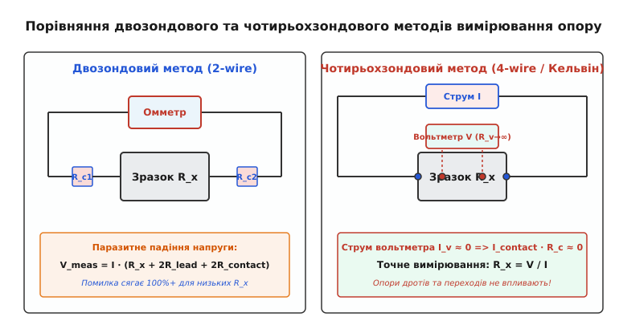
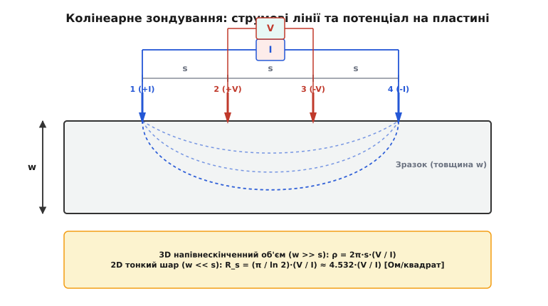
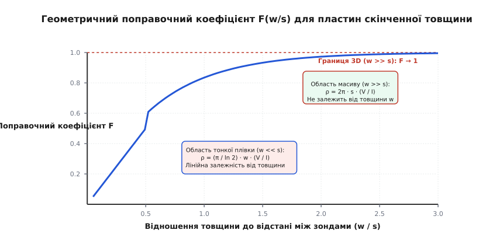
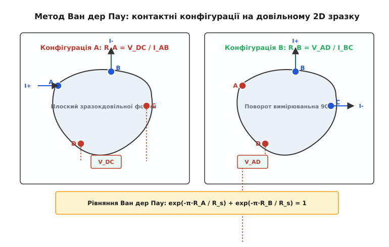

# Чотирьохзондове вимірювання опору

<preknowlist>
- [Питомий електричний опір](book:physics/condensed-matter-physics/resistivity) — зв'язок між геометрією провідника, його опором та внутрішніми носіями заряду.
- [Омічний контакт](book:physics/condensed-matter-physics/ohmic-contact) — падіння напруги та опір на межі «метал-напівпровідник».
- [Електричний опір](book:physics/condensed-matter-physics/resistance) — закон Ома для лінійного елемента кола.
</preknowlist>

Спроба виміряти опір високопровідного металевого стержня, тонкої напівпровідникової пластини або надпровідника поблизу критичної температури за допомогою звичайного двоконтактного омметра завершується вимірювальною катастрофою. Прилад, підключений двома щупами до зразка з очікуваним опором у 1 міліом (`10⁻³ Ом`), показує значення 0.45 Ом — помилка вимірювання перевищує 45 000%. 

Причина полягає в тому, що двоконтактний омметр вимірює не опір самого досліджуваного матеріалу, а сумарний опір усього електричного контуру: опір двох вимірювальних дротів, опір механічних затискачів і, найголовніше, опір контактного переходу між щупом та поверхнею зразка. У випадку напівпровідників або оксидованих металів опір контактного переходу зумовлений поверхневими потенціальними бар'єрами (бар'єрами Шотткі) та тонким оксидним шаром, що робить паразитний опір контакту в тисячі разів більшим за опір об'єму матеріалу.

Усунення цієї базової фізичної перешкоди досягається розділенням функцій струмопідведення та знімання напруги у чотирьохзондовій геометрії (схема Кельвіна).

## Парадокс низьких опорів та принцип Кельвіна

Еквівалентна електрична схема двозондового вимірювання містить послідовно з'єднані елементи:

```
R_total = R_x + 2·R_lead + 2·R_contact
```

де `R_x` — істинний опір досліджуваного зразка, `R_lead` — опір підвідних мідних дротів, `R_contact` — опір контактного переходу щуп-матеріал. Якщо `R_x = 0.001 Ом`, а `R_lead = 0.1 Ом` та `R_contact = 0.12 Ом`, то вимірювальний прилад реєструє `R_total = 0.441 Ом`, де частка самого зразка становить менше ніж 0.23% від підсумкового результату.

Для напівпровідників ситуація ускладнюється випрямними властивостями межі метал-напівпровідник. Через вигинання енергетичних зон на поверхні виникає збіднений шар із високим омічним опором, величина якого залежить від струму, температури та стану поверхні.


*Порівняння двозондової схеми (ліворуч), де струм I та напруга V знімаються через одну пару дротів з виникненням паразитного падіння напруги на контактах, та чотирьохзондової схеми Кельвіна (праворуч), де вимірювальний струм I_v вольтметра практично дорівнює нулю.*

Чотирьохзондовий метод розриває зв'язок між струмом збудження та вимірюванням напруги, розбіваючи коло на два незалежні контури:
1. **Струмове коло (Force):** Зовнішня пара зондів підключається до джерела стабілізованого струму `I`. Цей струм протікає через весь зразок, створюючи в ньому розподіл електричного потенціалу `φ(r)`. На контактах струмових зондів виникає падіння напруги `I · R_contact`, однак воно компенсується джерелом струму і не потрапляє у вимірювальний тракт.
2. **Потенціальне коло (Sense):** Внутрішня пара зондів підключається до цифрового вольтметра з надвисоким вхідним опором (`R_voltmeter ≥ 10¹⁰ Ом`).

Оскільки вхідний опір вольтметра на багато порядків перевищує опір контактного переходу (`R_voltmeter >> R_contact`), струм через потенціальне коло `I_v = V / R_voltmeter` прямує до нуля (`I_v ≈ 0`). Відповідно, падіння напруги на потенціальних контактах та підвідних провідниках стає нехтовно малим:

```
V_contact = I_v · R_contact ≈ 0
```

Вольтметр вимірює чисто різницю потенціалів `ΔV = φ₂ - φ₃` між двома точками на поверхні зразка, створену виключно основним струмом `I`. За законом Ома опір ділянки між потенціальними зондами визначається як `R_x = ΔV / I`.

📜 Докладніше про історію винайдення подвійного моста Кельвіна для трансатлантичного кабелю та розробку напівпровідникової метрології у Bell Labs викладено в [Еволюція чотирьохзондової метрології: від Кельвіна до Ван дер Пау](book:physics/condensed-matter-physics/four-probe-measurement/hist-kelvin-van-der-pauw.md).

## Мікроскопічна фізика контактного опору на межі метал-напівпровідник

Для глибокого розуміння неможливості двоконтактних вимірювань на напівпровідниках необхідно розглянути мікроскопічні процеси на межі раздела металевого щупа та напівпровідникової пластини.

При механічному притисканні металевої голки (наприклад, з вольфраму або сплаву осмію та іридію) до поверхні германію чи кремнію реальна площа фізичного контакту становить лише незначну частку від геометричного радіуса закруглення голки. Через мікрошорсткість поверхні контакт відбувається у кількох дискретних мікроконтактних плямах (асперитетах). Це створює так званий **опір стягування** (Constriction Resistance), зумовлений звуженням ліній струму у вузьких канальцях провідності.

Другим, значно потужнішим фактором є виникнення потенціального бар'єра Шотткі. На межі металу та напівпровідника роботи виходу електронів з матеріалів є різними (`Φ_m ≠ Φ_s`). Для компенсації різниці хімічних потенціалів носії заряду перетікають через межу, створюючи область просторового заряду (ОПЗ) та вигинання енергетичних зон на величину `e·V_bi`.

Питомий опір контакту `ρ_c` (вимірюваний у `Ом·см²`) визначається основними механізмами переносу носіїв заряду через бар'єр:
1. **Термоелектронна емісія:** Для слаболегованих напівпровідників носії заряду повинні подолати потенціальний бар'єр висотою `Φ_B` за рахунок теплової енергії. Струм описується класичним рівнянням діода Шотткі `J = J_s · [exp(e·V / (k_B·T)) - 1]`. При малих напругах опір контакту є екстремально високим і нелінійним.
2. **Термоавтоелектронна та тунельна емісія:** Для сильнолегованих напівпровідників (`N_d > 10¹⁹ см⁻³`) ширина області просторового заряду `W_dep` зменшується до 1–2 нанометрів. Електрони отримують можливість тунелювати крізь бар'єр. Питомий опір контакту `ρ_c ∝ exp( (2·√ε_s·m*) / ℏ · (Φ_B / √N_d) )` експоненціально зменшується при зростанні концентрації домішок.

У двоконтактній схемі ці потенціальні бар'єри включені послідовно із зразком. Оскільки один із контактів завжди опиняється у зворотно зміщеному стані, двоконтактний вимірювальний прилад показує не опір напівпровідника, а зворотну гілку вольт-амперної характеристики метало-напівпровідникового діода. У чотирьохзондовій схемі потенціальні зонди працюють у режимі відсутності струму (`I_v ≈ 0`), тому падіння напруги на бар'єрах Шотткі повністю зникає (`V = I_v · R_barrier ≈ 0`).

## Колінеарний чотирьохзондовий метод Вальдеса

Найпоширенішою конфігурацією для вимірювання питомого опору пластин та напівпровідникових злитків є колінеарний зондовий головний пристрій, запропонований Лео Вальдесом у 1954 році. Чотири загострені підпружинені голки розташовуються на одній прямій лінії з однаковим міжзондовим кроком `s`.


*Схема колінеарного чотирьохзондового методу на пластині товщиною w з міжзондовою відстанню s. Показано півсферичні та циліндричні струмові лінії розтікання струму I між зондами 1 та 4.*

Струм `+I` вводиться через зонд 1, виходить `-I` через зонд 4. Зонди 2 та 3 реєструють різницю потенціалів `ΔV`. Розрахунок питомого опору `ρ` залежить від співвідношення між товщиною зразка `w` та відстанню між зондами `s`.

### Випадок 1: 3D напівнескінченний масив (w >> s)

Якщо товщина зразка `w` значно перевищує відстань між зондами `s` (`w ≥ 3s`), зразок можна вважати напівнескінченним тривимірним середовищем. Струм від точкового зонда 1 розтікається півсферично. Густина струму `J(r)` на відстані `r` від зонда дорівнює `J(r) = I / (2π·r²)`.

За диференціальним законом Ома електричне поле `E(r) = ρ · J(r) = ρ·I / (2π·r²)`. Потенціал точкового джерела на поверхні:

```
V(r) = ρ·I / (2π·r)
```

За принципом суперпозиції потенціали на зондах 2 та 3 від двох струмових джерел (зонди 1 та 4):

```
V₂ = (ρ·I / 2π) · (1/s - 1/(2s)) = ρ·I / (4π·s)
```

```
V₃ = (ρ·I / 2π) · (1/(2s) - 1/s) = -ρ·I / (4π·s)
```

Різниця потенціалів між зондами 2 та 3 дорівнює:

```
ΔV = V₂ - V₃
   = ρ·I / (4π·s) - (-ρ·I / (4π·s))
   = ρ·I / (2π·s)       [сумування потенціалів]
```

Звідси отримуємо фундаментальну формулу Вальдеса для об'ємного питомого опору масивних зразків:

```
ρ = 2π·s · (ΔV / I)
```

### Випадок 2: 2D тонка плівка (w << s) та листковий опір

Якщо зразок являє собою тонку плівку або епітаксійний шар товщиною `w << s`, струм обмежений верхньою та нижньою поверхнями плівки і розтікається радіально в площині 2D. Площа бічної поверхні розтікання дорівнює `A(r) = 2π·r·w`, а густина струму `J(r) = I / (2π·r·w)`.

Потенціал у 2D середовищі має логарифмічну залежність від відстані: `V(r) = -(ρ·I / (2π·w)) · ln(r)`. Обчислення різниці потенціалів `ΔV` між зондами 2 та 3 дає:

```
ΔV = V₂ - V₃
   = (ρ·I / (π·w)) · ln(2)
```

У фізиці напівпровідників та плівкової мікроелектроніки вводиться поняття **листкового (поверхневого) опору** `R_s` (sheet resistance), який характеризує опір квадратного фрагмента плівки довільного розміру:

```
R_s = ρ / w
```

Виражаючи `R_s` через виміряні величини `ΔV` та `I`:

```
R_s = (π / ln 2) · (ΔV / I)
    ≈ 4.53236 · (ΔV / I)
```

Розмірність листкового опору за формою збігається з Омом (`Ом`), однак для запобігання плутанині з об'ємним опором його завжди записують у специфічних одиницях: **Ом на квадрат** (`Ом/□` або `Ω/sq`). 

Фізичний зміст `R_s` полягає в тому, що опір тонкої квадратної пластини зі стороною `L` та товщиною `w` при підключенні суцільних контактів до протилежних сторін не залежить від лінійного розміру `L`:

```
R = ρ · L / (w · L) = ρ / w = R_s
```

Квадрат розміром `1 мм × 1 мм` та квадрат розміром `1 м × 1 м` з однієї плівки мають абсолютно одинаковий опір `R_s`.

## Альтернативні зондові геометрії: квадратна 4-зондова головка

Окрім прямолінійного (колінеарного) розташування зондів Вальдеса, у дослідницькій практиці застосовується **квадратна чотирьохзондова конфігурація** (Square 4-Point Probe Array). Чотири зонди розташовуються у вершинах квадрата зі стороною `s`.

У цій конфігурації струм `I` подається через дві суміжні вершини (зонди 1 та 2), а різниця потенціалів `ΔV` вимірюється між двома протилежними вершинами (зонди 3 та 4).

Обчислимо потенціал на зондах для 2D тонкої плівки:
* Відстань між струмовими контактами (1 і 2) дорівнює `s`.
* Відстані від зонда 1 (`+I`) до потенціальних зондів 3 і 4 дорівнюють `s` та `s·√2` відповідно.
* Відстані від зонда 2 (`-I`) до потенціальних зондів 3 і 4 дорівнюють `s·√2` та `s` відповідно.

Застосовуючи принцип суперпозиції для логарифмічного потенціалу 2D плівки, виражаємо виміряну різницю потенціалів `ΔV`:

```
ΔV = (ρ·I / (2π·w)) · ln(2)
```

Для квадратної зондової головки на тонкій плівці поверхневий опір `R_s` виражається формулою:

```
R_s = (2π / ln 2) · (ΔV / I) ≈ 9.06472 · (ΔV / I)
```

Квадратна конфігурація володіє суттєвою перевагою при вимірюванні анізотропних матеріалів (текстурованих плівок, високоорієнтованого графіту, 2D матеріалів). Обертаючи квадратну зондову головку на кут `θ` відносно кристалографічних осей зразка, можна визначати головні компоненти тензора провідності `σ_xx` та `σ_yy`.

## Геометричні поправкові коефіцієнти F(w/s) та крайові ефекти

У реальних вимірюваннях зразок має скінченні розміри: товщину `w`, діаметр або ширину `d`, а зонди можуть розташовуватися поблизу ізолюючого краю пластини. У таких випадках струмові лінії викривляються, а геометрія розтікання відхиляється від ідеального 2D або 3D півпростору.

Загальна формула питомого опору з урахуванням геометричних факторів набрає вигляду:

```
ρ = 2π·s · (ΔV / I) · F₁(w/s) · F₂(d/s) · F₃(x/s)
```

де `F₁` — поправка на товщину, `F₂` — поправка на поперечний розмір зразка, `F₃` — поправка на відстань `x` від зондів до краю пластини.


*Залежність поправочного коефіцієнта F(w/s) від відношення товщини зразка до відстані між зондами w/s. Плавний перехід від 2D режиму тонкої плівки до 3D режиму напівнескінченного масиву.*

### 1. Поправка на товщину F₁(w/s)
Розрахунок `F₁` виконується методом дзеркальних відображень. Оскільки межі плівки примикають до диелектрика (повітря або підкладка), нормальна складова струму на межах дорівнює нулю (`J_z = 0`). Це еквівалентно введенню нескінченного ряду дзеркальних джерел струму на відстанях `2n·w` від поверхні:

```
F₁(w/s) = (w / s) · (1 / (2·ln 2)) · [ 1 + 4 · ∑_{n=1}^∞ ( 1 / √(1 + (2n·w/s)²) - 1 / √(4 + (2n·w/s)²) ) ]⁻¹
```

* Коли `w / s < 0.5` (тонка плівка), коефіцієнт `F₁` переходить у лінійну залежність `F₁(w/s) ≈ (w/s) · (π / (2·ln 2))`, повертаючи формулу `R_s = 4.53236 · (ΔV/I)`.
* Коли `w / s > 3.0` (масивний зразок), `F₁(w/s) → 1.0`, повертаючи формулу `ρ = 2π·s·(ΔV/I)`.

### 2. Крайовий фактор F₂(d/s) та простір струмових ліній
Якщо зонди розташовані поблизу крайки пластини на відстані `x < 3s`, струмові лінії не можуть виходити за край диелектрика. Струм «стискається» у меншому об'ємі провідника, що призводить до локального зростання напруженості електричного поля та підвищення виміряної різниці потенціалів `ΔV`. Без урахування поправки `F₃ < 1` виміряний опір буде штучно завищеним.

🧮 Повне математичне виведення ряду дзеркальних зображень та конформних відображень для поправкових коефіцієнтів наведено у вставці [Виведення теореми Ван дер Пау та геометричних коефіцієнтів](book:physics/condensed-matter-physics/four-probe-measurement/math-van-der-pauw-derivation.md).

## Метод Ван дер Пау для зразків довільної форми

Колінеарний метод Вальдеса має жорстке обмеження: він вимагає строго визначеної прямолінійної геометрії зондів та плоских пластин великого розміру. У 1958 році голландський фізик Лео Ван дер Пау розробив метод, який дозволяє точне вимірювати поверхневий опір `R_s` та питомий опір `ρ` на зразках **абсолютно довільної геометричної форми**.


*Метод Ван дер Пау для зразка довільної форми. Показано дві взаємно ортогональні конфігурації вимірювань: конфігурація A (струм I_AB, напруга V_DC) та конфігурація B (струм I_BC, напруга V_AD).*

Для застосування методу Ван дер Пау зразок повинен задовольняти чотири умови:
1. Зразок має бути двовимірним (плоским) з однаковою товщиною `w` по всій площі.
2. Зразок має бути однозв'язним (не мати наскрізних отворів чи ізолюючих включень).
3. Чотири точкові контакти A, B, C, D розташовуються послідовно на самому краю периметра зразка.
4. Площа контактних площадок має бути знехтовно малою порівняно з загальною площею зразка.

### Конфігурації вимірювання та тотожність Ван дер Пау

Вимірювання виконуються у двох взаємно ортогональних конфігураціях:
* **Конфігурація A:** Струм `I_AB` подається через сусідні контакти A та B; напруга `V_DC = φ_D - φ_C` знімається з протилежної пари контактів D та C. Опір конфігурації: `R_A = |V_DC| / |I_AB|`.
* **Конфігурація B:** Струм `I_BC` подається через контакти B та C; напруга `V_AD = φ_A - φ_D` знімається з контактів A та D. Опір конфігурації: `R_B = |V_AD| / |I_BC|`.

Ван дер Пау довів, що для будь-якої геометричної форми контуру зразка опори `R_A` та `R_B` пов'язані з поверхневим опором `R_s` фундаментальним трансцендентним рівнянням:

```
exp(-π·R_A / R_s) + exp(-π·R_B / R_s) = 1
```

### Симетричні та асиметричні зразки

Для ідеально симетричного зразка (квадрат або круг з контактами через `90°`) опори двох конфігурацій однакові (`R_A = R_B = R`). У цьому випадку рівняння спрощується:

```
2 · exp(-π·R / R_s) = 1
-π·R / R_s = ln(1/2) = -ln(2)
R_s = (π / ln 2) · R ≈ 4.53236 · R
```

Якщо зразок асиметричний (`R_A ≠ R_B`), рівняння Ван дер Пау розв'язується через введення поправкового коефіцієнта `f(R_A/R_B)`:

```
R_s = (π / ln 2) · ((R_A + R_B) / 2) · f(R_A / R_B)
```

де фактор асиметрії `f` задовольняє співвідношенню:

```
(R_A - R_B) / (R_A + R_B) = (f / ln 2) · arcosh( exp(ln 2 / f) / 2 )
```

У практичній автоматизованій електрометрії функція `f` або само значення `R_s` знаходяться чисельним методом Ньютона — Рафсона за 4–5 ітерацій.

⚙️ Алгоритми чисельного розв'язання рівняння Ван дер Пау та готові коди програмування подано у вставці [Обробка даних вимірювань та чисельне розв'язання рівняння Ван дер Пау](book:physics/condensed-matter-physics/four-probe-measurement/proj-four-probe-sim.md).

## Вплив неосновних носіїв та фотопровідності

При вимірюванні питомого опору напівпровідників високої чистоти (наприклад, монокристалічного германію або кремнію з низькою концентрацією домішок `N_d < 10¹³ см⁻³`) виникає додатковий фізичний ефект — **інжекція неосновних носіїв заряду**.

Коли струмовий зонд 1 торкається напівпровідника n-типу, під контактом утворюється зворотно зміщений p-n перехід. При подачі високої напруги струмовий зонд інжектує у матеріал неосновні носії (дірки). Ці носії дрейфують під дією вимірювального електричного поля вглиб зразка до потенціальних зондів. 

Збільшення концентрації носіїв `Δp` за рахунок інжекції підвищує локальну провідність матеріалу `σ = e·(n·μ_n + p·μ_p)`. У результаті виміряне падіння напруги `ΔV` зменшується, а обчислений питомий опір виявляється штучно заниженим.

Для запобігання похибці від інжекції неосновних носіїв застосовують три класичні технічні прийоми:
1. **Обмеження електричного поля:** Струм збудження зменшують до рівня, при якому дрейфова швидкість інжектованих носіїв є набагато меншою за швидкість їхньої об'ємної рекомбінації.
2. **Механічна обробка поверхні:** Поверхню зразка під зондами роблять злегка шорсткою (лапування абразивним порошком). Це створює високу щільність поверхових рекомбінаційних центрів, завдяки чому інжектовані дірки рекомбінують прямо біля контакту, не досягаючи потенціальних зондів.
3. **Захист від світла (ефект фотопровідності):** Напівпровідники з шириною забороненої зони `E_g ~ 1.1 еВ` (кремній) відчутно змінюють свій опір під дією кімнатного освітлення за рахунок генерації електронно-діркових пар. Вимірювальна камера чотирьохзондової станції має бути повністю світлонепроникною.

## Техніка синхронного детектування (AC Lock-in) та високочастотні обмеження

При вимірюваннях наднизьких опорів (`< 10⁻⁶ Ом`) або масивних напівпровідникових пластин постійний струм (DC) має суттєвий недолік: вимірювальний сигнал перекривається низькочастотними шумами типу `1/f` (флікер-шумом) та температурним дрейфом електрометричного тракту.

Для підвищення чутливості на 3–4 порядки застосовують **метод синхронного детектування на змінному струмі (AC Lock-in Technique)**. Струмове джерело генерує чисто синусоїдальний струм `I(t) = I_0 · sin(ω_0 · t)` на низькій частоті `f_0 = ω_0 / (2π)` (типово `13 – 100 Гц`), вибранній поза гармоніками мережі живлення (`50/60 Гц`).

Сигнал з потенціальних зондів `V(t)` надходить на фазочутливий підсилювач (Lock-in Amplifier), який перемножує вхідний сигнал на опорну синусоїду `sin(ω_0 · t)` і фільтрує результат низькочастотним інтегратором. Це дозволяє виділяти корисний сигнал напруги `V_0` навіть тоді, коли рівень шумів у 10 000 разів перевищує амплітуду сигналу.

Однак при збільшенні частоти `f_0 > 1 кГц` виникають паразитні емкісні та індуктивні наведення:
* **Паразитна ємність дротів:** Ємність між підвідними коаксіальними кабелями `C_cable` створює шунтуючий реактивний струм `I_cap = ω · C_cable · V`, що призводить до систематичного заниження виміряного опору.
* **Взаємна індуктивність вимірювальних контурів:** Струмове коло та потенціальне коло утворюють взаємну індуктивність `M`. Змінний струм `I(t)` індукує в потенціальному контурі паразитно-ЕРС `V_ind = -M · (dI/dt) = -ω · M · I_0 · cos(ω·t)`. Цей сигнал зсунутий за фазою на `90°` відносно омічного падіння напруги.

Для усунення взаємної індуктивності підвідні дроти потенціальної та струмової пар ретельно зкручують у виті пари (Twisted Pairs) або застосовують чотирьохкоаксіальну схему заземлення (4-terminal pair configuration).

## Метрологія квантового ефекту Холла та кріогенні вимірювання

У фізиці низьких температур чотирьохзондовий метод є єдиним надійним інструментом для реєстрування надпровідного фазового переходу та квантового ефекту Холла.

При охолодженні зразка високотемпературного надпровідника (наприклад, кераміки YBa₂Cu₃O₇₋δ або плівок NbN) опір об'єму матеріалу стрімко падає до нуля при досягненні критичної температури `T_c`.

Якщо спробувати провести це вимірювання за двоконтактною схемою, опір підвідних дротів та контактів затискачів (`R_contact ≈ 0.01–0.1 Ом`) залишиться незмінним навіть при рідкому гелії (`4.2 K`). На графіку залежності `R(T)` виникне залишковий «поріг» опору, який унеможливлює визначення справжнього значення `T_c` та критичного струму `I_c`.

У чотирьохзондовій геометрії, оскільки струм через потенціальні контакти дорівнює нулю (`I_v ≈ 0`), вольтметр реєструє абсолютний нуль напруги (`V = 0`) у надпровідному стані. Це дозволяє:
* Точно фіксувати ширину надпровідного переходу `ΔT_c`.
* Вимірювати вольт-амперні характеристики `V(I)` у флюксоїдному режимі для визначення сили піннінгу магнітних вихорів Абрикосова.
* Вимірювати квантований опір Холла `R_H = h / (ν · e²)`, де `h` — стала Планка, `e` — заряд електрона, `ν` — ціле число плато. Квант опору Клітцинга `R_K = h / e² ≈ 25812.807 Ом` є сучасним первинним еталоном Ома у міжнародній системі одиниць СІ.

> 🔧 **Навіщо це.**
> Чотирьохзондовий метод є основою сучасної діагностики напівпровідникових матеріалів та приладів. У виробництві інтегральних мікросхем колінеарні 4-зондові станції автоматично сканують кремнієві пластини діаметром 300 мм після іонної імплантації, термовідпалу або осадження металевих шарів, будуючи карти розподілу листкового опору `R_s`. У фізиці твердого тіла метод Ван дер Пау в поєднанні з ефектом Холла дозволяє на одному зразку довільної форми визначати тип носіїв, їхню концентрацію `n` та рухливість `μ`. У фізиці надпровідності 4-провідне підключення є єдиним способом зареєструвати падіння опору до строгого нуля при фазовому переході без маскування результатом опору контактів.
