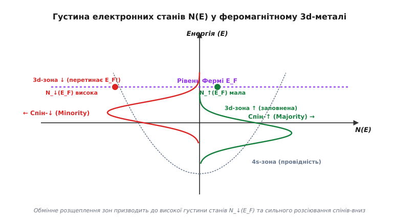
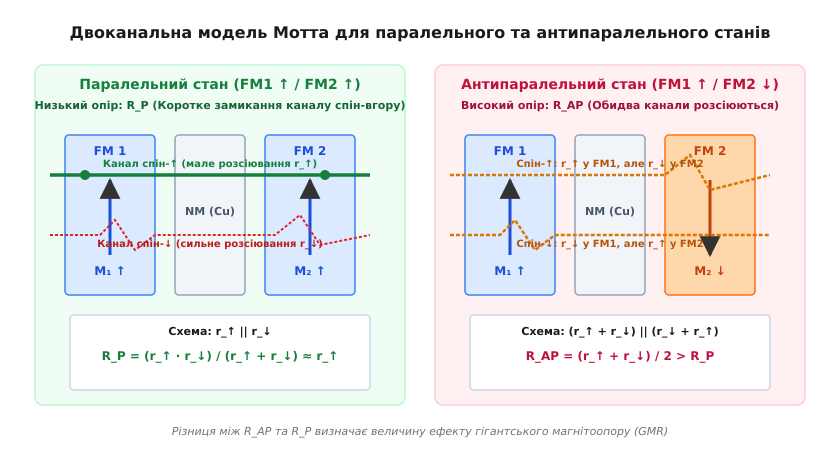
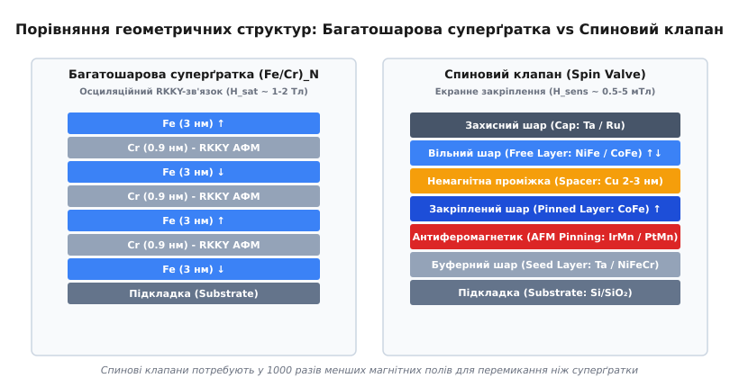
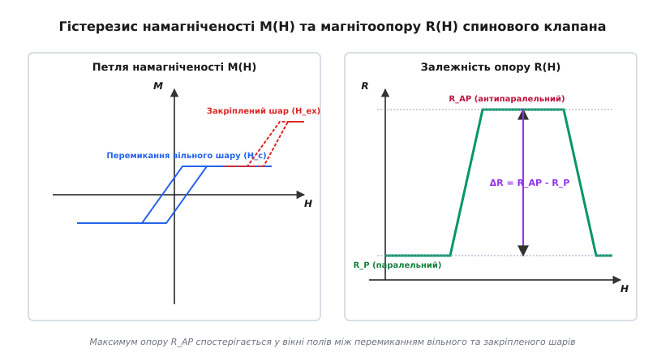

# Гігантський магнітоопір (GMR)

<preknowlist>
- [Феромагнетизм](topic:physics/ferromagnetism) — спонтанна намагніченість і доменна структура 3d-металів.
- [Обмінна взаємодія](topic:physics/exchange-interaction) — квантовомеханічне розщеплення електронних станів за спіном.
- [Середня довжина вільного пробігу](topic:physics/mean-free-path) — відстань між послідовними актами розсіювання електронів.
- [Модель Друде](topic:physics/drude-model) — класична теорія провідності електронів у металі.
</preknowlist>

Електричний опір більшості масивних металів слабко реагує на зовнішнє магнітне поле: ефект звичайного анізотропного магнітоопору (AMR) у феромагнетиках змінює опір лише на 1–3% при кімнатній температурі. Такий низький відгук унеможливлював подальше збільшення щільності магнітного запису на жорстких дисках наприкінці 1980-х років, оскільки індукційні зчитувальні голівки не могли надійно реєструвати слабкі поля розсіювання (порядку кількох мілітесл) від нанометрових магнітних бітів. Рішенням цієї проблеми стало відкриття у 1988 році ефекту гігантського магнітоопору (GMR, від англ. *Giant Magnetoresistance* — велетенська зміна опору у магнітному полі), у якому чергування тонких шарів феромагнетика та немагнітного металу товщиною у кілька атомних шарів викликає спад опору на 10–50% при зміні взаємної орієнтації намагніченостей.

## Спин-залежне розсіювання електронів провідності

У класичних металах провідність визначається рухом рухливих `4s`-електронів, які слабо взаємодіють із кристалічною ґраткою та мають велику довжину вільного пробігу. У transition 3d-металах (залізо, кобальт, нікель) електронна структура містить дві перекривні зони: широку `4s`-зону з малою ефективною масою електронів та вузьку `3d`-зону з високою густиною станів `N(E)`. Основний внесок у перенесення електричного заряду роблять швидкі `4s`-електрони, проте ймовірність їхнього розсіювання (а отже, і величина електричного опору) визначається доступністю вільних станів у `3d`-зоні, куди електрон може перескочити в результаті зіткнення з дефектом або фононом.

Згідно із золотим правилом Фермі, ймовірність розсіювання електрона в одиницю часу `1/τ` є прямо пропорційною густині кінцевих станів на рівні Фермі `N(E_F)`:

```
1/τ ∝ |M_scat|² · N(E_F)      [золоте правило Фермі для частоти розсіювання]
```

тут `M_scat` — матричний елемент оператора розсіювання, що описує взаємодію електрона з потенціалом кристалічного дефекту або міжфазної межі.

У феромагнітному стані квантовомеханічна обмінна взаємодія розщеплює `3d`-електронну зону на дві спінові підзони, зміщені одна відносно одної на величину обмінного енергетичного інтервалу `ΔE_ex ≈ 1–2` еВ. Підзона електронів із напрямком спіна, паралельним макроскопічній намагніченості (мажоритарні електрони, або спін-вгору `↑`), опускається нижче по енергії і виявляється майже повністю заповненою. Підзона електронів із протилежним напрямком спіна (міноритарні електрони, або спін-вниз `↓`) зміщується вгору, і її верхній край перетинає рівень Фермі `E_F`.


*Густина електронних станів N(E) у 3d-феромагнетику: обмінне розщеплення створює низьку густину станів N_↑(E_F) для спінів-вгору та високу N_↓(E_F) для спінів-вниз.*

У результаті обмінного розщеплення густина станів на рівні Фермі для двох спінових орієнтацій стає глибоко асиметричною: `N_3d↑(E_F) ≪ N_3d↓(E_F)`. Для чистих кристалів кобальту або нікелю густина станів для спінів-вниз перевищує густину станів для спінів-вгору у 5–10 разів. Оскільки опір зворотний до часу релаксації імпульсу `τ`, електрони зі спіном «вгору» зустрічають мало вільних `3d`-станів і вільно рухаються на велику відстань `λ_↑` (мале розсіювання, низький питомий опір `ρ_↑`). Електрони зі спіном «вниз» інтенсивно розсіюються у щільну `3d`-підзону, володіючи короткою довжиною вільного пробігу `λ_↓` (сильне розсіювання, високий питомий опір `ρ_↓`):

```
λ_↑ ≫ λ_↓                     [асиметрія довжини вільного пробігу спінових каналів]
```

У масивних феромагнітних металах цей ефект пригнічується, оскільки струм тече крізь хаотично орієнтовані магнітні домени, а процеси розсіювання відбуваються у випадкових напрямках. Однак якщо сформувати штучну наноструктуру з альтернативних шарів феромагнетика та немагнітного металу товщиною `d < λ_↑`, спінова асиметрія проявиться на макроскопічному рівні.

Розсіювання носіїв відбувається як усередині об'єму феромагнітних шарів (об'ємне спін-залежне розсіювання), так і на атомно-шорстких межах поділу між феромагнітним та немагнітним металами (поверхневе спін-залежне розсіювання). Зміна електронного потенціалу на межі поділу `FM/NM` створює спіново-залежний бар'єр відображення, величина якого залежить від збігу хвильових векторів та симетрії хвильових функцій електронів у двох суміжних матеріалах. Наприклад, для межі `Co/Cu` зв'язок 3d-зони кобальту зі спіном «вгору» з 4s-зоною міді забезпечує майже повну прозорість межі для спінів `↑`, тоді як для спінів `↓` виникає сильне міжфазне відбивання.

Окрім шаруватих гетероструктур, ефект GMR спостерігається також у гранульованих магнітних сплавах (наприклад, несплавних системах `Co-Cu` або `Fe-Ag`), виготовлених методом сумісного напилення з подальшим відпалом. У таких матеріалах нанометрові феромагнітні гранули Co (діаметром `2–5` нм) самовільно виділяються у немагнітній мідній матриці. За відсутності поля магнітні моменти гранул орієнтовані хаотично завдяки суперпарамагнетизму, що створює високий опір для обох спінових каналів. Зовнішнє магнітне поле орієнтує моменти всіх гранул паралельно, що призводить до спаду опору на `10–20%`.

## Двоканальна модель Мотта для екстраполяції опору

Для кількісного опису транспорту заряду у магнітних шаруватих структурах Невілл Мотт висунув концепцію двох незалежних каналів провідності. За температур, значно нижчих за температуру Кюрі (`T ≪ T_C`), кількість теплових збуджень спинових хвиль (магнонів) є невеликою. Зіткнення електрона з магноном є єдиним механізмом, здатним перевернути орієнтацію спіна носія. Оскільки характерний час перевороту спіна `t_sf` перевищує час релаксації за імпульсом `τ` у сотні разів (`t_sf ≫ τ`), електрон зберігає свій спіновий напрямок протягом усього шляху проходження крізь наноструктуру.

Це дозволяє розглядати повну провідність структури як паралельне з'єднання двох незалежних електричних кіл: каналу електронів зі спіном «вгору» та каналу електронів зі спіном «вниз». Детальне [математичне виведення двоканальної моделі Мотта](topic:physics/giant-magnetoresistance/math-mott-two-channel.md) дає можливість точно розрахувати еквівалентний опір системи для паралельного (`R_P`) та антипаралельного (`R_AP`) станів намагніченості шарів.


*Схема двох каналів провідності Мотта: у паралельному стані канал спін-вгору забезпечує низький опір R_P, у той час як в антипаралельному стані обидва канали зазнають сильного розсіювання, формуючи високий опір R_AP.*

Розглянемо проходження струму крізь тришарову систему `FM1 / NM / FM2`:

1. **Паралельний стан (FM1 ↑ / FM2 ↑):**
   Вектори намагніченості обох феромагнітних шарів спрямовані паралельно.
   - Для електронів зі спіном «вгору» обидва шари `FM1` та `FM2` є мажоритарними середовищами. Парціальний опір цього каналу є мінімальним: `r_каналу↑ = r_↑ + r_↑ = 2·r_↑`.
   - Для електронів зі спіном «вниз» обидва шари є міноритарними середовищами. Парціальний опір цього каналу є максимальним: `r_каналу↓ = r_↓ + r_↓ = 2·r_↓`.

Оскільки два канали увімкнені паралельно, канал зі спіном «вгору» виступає в ролі низькоомного шунта («короткого замикання»), пропускаючи крізь себе основну частку струму. Еквівалентний опір системи `R_P` визначається переважно малою величиною `r_↑`:

```
R_P = (2·r_↑ · 2·r_↓) / (2·r_↑ + 2·r_↓) = 2·r_↑·r_↓ / (r_↑ + r_↓) ≈ 2·r_↑     [опір паралельного стану]
```

2. **Антипаралельний стан (FM1 ↑ / FM2 ↓):**
   Вектор намагніченості другого шару розвернутий на 180° відносно першого.
   - Електрони зі спіном «вгору» легко проходять шар `FM1` (`r_↑`), але зазнають сильного розсіювання у шарі `FM2` (`r_↓`). Опір каналу дорівнює `r_каналу↑ = r_↑ + r_↓`.
   - Електрони зі спіном «вниз» зазнають сильного розсіювання у шарі `FM1` (`r_↓`), але вільно проходять шар `FM2` (`r_↑`). Опір каналу дорівнює `r_каналу↓ = r_↓ + r_↑`.

У цьому стані обидва канали стають абсолютно симетричними та високоомними, оскільки кожен електрон обов'язково зустрічає один шар із несприятливою орієнтацією намагніченості. Шуканий опір антипаралельного стану `R_AP` становить:

```
R_AP = (r_↑ + r_↓) / 2                                                      [опір антипаралельного стану]
```

Математична різниця опорів `R_AP - R_P` завжди є додатною величиною:

```
R_AP - R_P = (r_↓ - r_↑)² / (2·(r_↑ + r_↓)) > 0
```

Відносний коефіцієнт гігантського магнітоопору `GMR`, виражений через параметр спінової асиметрії матеріалу `β = (r_↓ - r_↑)/(r_↓ + r_↑)`, набуває компактного вигляду:

```
GMR = (R_AP - R_P) / R_P = (r_↓ - r_↑)² / (4·r_↑·r_↓) = β² / (1 - β²)
```

Чим вища спінова поляризація електронів у феромагнетику (чим більший параметр `β`), тим сильнішим є спад опору при переході від антипаралельного до паралельного стану. При нагріванні системи до кімнатної температури магнонні перевороти спінів почнуть змішувати струми в двох каналах, зменшуючи ефективне значення `β(T)` та викликаючи помірне зниження ефекту GMR.

## Від суперґраток Fe/Cr до спинових клапанів FM/NM/FM

Історично перший спосіб отримання антипаралельного стану намагніченості базувався на явищі міжшарового обмінного зв'язку Рудермана-Кіттеля-Касуї-Йосиди (RKKY-зв'язок). Досліджуючи [історію відкриття GMR Альбертом Фером та Петером Ґрюнберґом](topic:physics/giant-magnetoresistance/hist-fert-gruenberg.md), можна побачити, що у суперґратках `(Fe/Cr)ₙ` спини електронів провідності немагнітного проміжка Хрому спиново поляризуються на межі із Залізом. Поляризована електронна густина поширюється углиб хрому у вигляді осцилювальної стоячої хвилі з періодом близько 1 нм.

Залежно від товщини проміжного шару `d_NM`, між сусідніми шарами заліза виникає або феромагнітний, або антиферомагнітний зв'язок. При товщині хрому `d_Cr ≈ 0.9` нм зв'язок є строго антиферомагнітним: у відсутності зовнішнього магнітного поля шар заліза `Fe₁` орієнтується вгору, а шар `Fe₂` — вниз. Зовнішнє магнітне поле, прикладене до суперґратки, долає енергію RKKY-зв'язку та примусово розвертає вектори намагніченості усіх шарів паралельно полю, що супроводжується спадом опору.


*Конструктивне порівняння багатошарової суперґратки (Fe/Cr)ₙ та спинового клапана: спиновий клапан використовує закріплення антиферомагнетиком замість жорсткого RKKY-зв'язку.*

Проте суперґратки володіли істотним недоліком: для розвороту стійкого RKKY-зв'язку вимагалися зовнішні магнітні поля понад `1–2` тесли. Для вирішення цієї проблеми було створено нову гетероструктуру — спиновий клапан (*Spin Valve*). Детальні [конструктивні особливості багатошарового спинового клапана](topic:physics/giant-magnetoresistance/comp-spin-valve.md) полягають у розділенні феромагнітних шарів на два функціональні типи:

- **Закріплений шар (Pinned Layer):** Феромагнетик (`CoFe`), намагніченість якого жорстко зафіксована у одному напрямку за допомогою обмінного зсуву (*exchange bias*) з суміжним шаром антиферомагнетика (`IrMn` або `PtMn`).
- **Вільний шар (Free Layer):** Магнітном'який феромагнетик (`NiFe` пермалой), намагніченість якого не зв'язана з антиферомагнетиком і вільно повертається під дією слабких зовнішніх полів у частки мілітесли.
- **Немагнітна проміжка (Spacer):** Шар міді (`Cu`) товщиною `2.0–2.5` нм, який вибирається товщим за перший антиферомагнітний максимум RKKY-зв'язку, щоб магнітно розв'язати вільний та закріплений шари.

Сучасні спинові клапани часто використовують замість одиночного закріпленого шару складну тришарову систему — синтетичний антиферомагнетик (SAF): `CoFe / Ru (0.8 нм) / CoFe`. Завдяки проміжці рутенію товщиною точно `0.8 нм` між двома шарами кобальт-заліза виникає гігантський антиферомагнітний RKKY-зв'язок. Це забезпечує повну компенсацію магнітного моменту закріпленої системи, усуває поля розсіювання та підвищує термічну стабільність пристрою при робочих температурах до `150–200 °C`.

Завдяки такій геометрії спиновий клапан здатен перемикатися у низькоомний стан під дією полів, у 1000 разів менших, ніж вимагалося для суперґраток.

## Петлі гістерезису намагніченості M(H) та магнітоопору R(H)

Функціонування спинового клапана ілюструється суміщеними кривими намагнічування `M(H)` та магнітоопору `R(H)`. Оскільки вільний та закріплений шари володіють принципово різними коерцитивними силами та полями зміщення, їхнє перемагнічування відбувається при різних значеннях зовнішнього поля.


*Гістерезис намагніченості M(H) та магнітоопору R(H) спинового клапана: плато високого опору R_AP формується в інтервалі полів між коерцитивним полем H_c та полем обмінного зсуву H_ex.*

Виконуючи [числове моделювання кривої магнітоопору](topic:physics/giant-magnetoresistance/proj-gmr-simulation.md), процес розгортки магнітного поля `H` можна розділити на чотири послідовні фази:

1. **Сильне від'ємне поле (`H < -H_ex`):**
   Зовнішнє поле є достатньо великим, щоб подолати як коерцитивну силу вільного шару `H_c`, так і поле екранного зсуву закріпленого шару `H_ex`. Вектори намагніченостей обох шарів спрямовані паралельно полю (вліво `← ←`). Система перебуває у паралельному стані з мінімальним опором `R = R_P`.

2. **Помірне від'ємне поле (`-H_ex < H < -H_c`):**
   При зменшенні від'ємного поля закріплений шар перемагнічується назад у свій зафіксований стан (вправо `→`) під дією внутрішнього поля обмінного зсуву `H_ex`. Вільний шар все ще утримується зовнішнім полем у напрямку вліво (`←`). Намагніченості шарів стають антипаралельними (`← →`). Опір скачкоподібно зростає до максимуму `R = R_AP`.

3. **Слабке позитивне поле (`-H_c < H < H_c`):**
   При переході поля через нуль вільний шар перемагнічується у напрямку позитивного поля (вправо `→`). Тепер обидва шари орієнтовані паралельно (вправо `→ →`). Опір структури повертається до мінімального рівня `R = R_P`.

4. **Плато магнітоопору:**
   Ширина відрізка полів, у якому спостерігається високий опір `R_AP`, визначається різницею між полем обмінного зсуву та коерцитивною силою: `ΔH = H_ex - H_c`. Створення великого поля `H_ex` гарантує стабільне вимірювальне вікно для магнітних датчиків.

Кутова залежність опору спинового клапана від кута `θ` між векторами намагніченості вільного та закріпленого шарів підпорядковується косинусоїдальному закону:

```
R(θ) = R_P + [(R_AP - R_P) / 2] · (1 - cos θ)                             [кутова залежність опору GMR]
```

При малих відхиленнях кута `θ` поблизу 90° (коли вектори намагніченості у відсутності поля перпендикулярні) відгук опору `ΔR` є строго лінійним відносно напруженості зовнішнього магнітного поля `H`, що робить спиновий клапан ідеальним аналоговим датчиком. Для створення вихідної перпендикулярної орієнтації застосовують формувальну анізотропію форми елемента або допоміжні смужки Барбера (*Barber poles*).

## Практичне застосування, вимірювальні мости та обмеження ефекту

Упровадження спинових клапанів компанією IBM у 1997 році в якості зчитувальних голівок жорстких дисків викликало вибухове зростання щільності магнітного запису. Спиновий клапан здатний зчитувати магнітні бліпи розміром у десятки нанометрів, генеруючи високий рівень вихідної напруги при швидкостях обертання шпинделя понад 10 000 об/хв.

Окрім комп'ютерної пам'яті, GMR-елементи широко використовуються у промисловій робототехніці, автомобільній електроніці (датчики частоти обертання коліс ABS, датчики положення колінчастого вала) та безконтактних вимірювачах електричного струму. Використовуючи [параметри електричного інтерфейсу та мостового підключення GMR-сенсора](topic:physics/giant-magnetoresistance/api-gmr-sensor.md), чотири спинові клапани об'єднують у мікроелектронний міст Вітстона, що забезпечує температурну компенсацію та лінійну чутливість порядку `3–5` мВ/В/мТл.

Гранична чутливість GMR-пристроїв обмежується трьома основними джерелами шумів:
- **Тепловий шум Джонсона-Найквіста:** Викликаний хаотичним тепловим рухом носіїв заряду у металевих шарах (`V_n = √(4·k_B·T·R·Δf)`).
- **Дробовий шум:** Виникає при проходженні електронів крізь межі поділу шарів.
- **Магнонний та флікер-шум (1/f):** Викликаний флуктуаціями магнітних доменів у вільному шарі при перемагнічуванні.

Еволюційним розвитком ідеї спін-залежного транспорту став тунельний магнітоопір (TMR, *Tunnel Magnetoresistance*). У TMR-структурах немагнітну металеву проміжку Cu замінюють ультратонким діелектричним тунельним бар'єром оксиду магнію (`MgO`) товщиною близько 1 нм. Електрони долають бар'єр за рахунок квантовомеханічного тунелювання. Оскільки тунельна прозорість бар'єру залежить від спінової поляризації станів по обидва боки та симетрії хвильових функцій `Δ₁` у монокристалічному `MgO(001)`, величина ефекту TMR при кімнатній температурі досягає `100–600%`, що перевищує показники GMR у десятки разів і робить TMR основною технологією сучасної магніторезистивної пам'яті (MRAM).

> 🔧 **Навіщо це.** Ефект GMR довів, що спін електрона можна використовувати як носій інформації в електронних колах нарівні з його зарядом. Це відкрило шлях до створення енергонезалежної магніторезистивної оперативної пам'яті (MRAM), яка поєднує швидкість SRAM, щільність DRAM та незмінність даних Flash-пам'яті при вимкненні живлення.

## Спінтроніка як нова парадигма твердотільної фізики

Відкриття гігантського магнітоопору вийшло далеко за межі розробки чутливих датчиків магнітного поля. Воно продемонструвало можливість створення квантових металевих наноструктур, у яких довжина транспорту носіїв узгоджена з довжиною релаксації спинового кутового моменту.

GMR започаткував нову галузь фізики конденсованого стану — спінтроніку (*spintronics*, або спінову електроніку). Якщо класична напівпровідникова електроніка керує лише просторовим переміщенням заряду електрона `e`, то спінтроніка використовує квантовий спіновий момент `s = 1/2`. Розвиток GMR привів до відкриття нових спінових явищ:
- **Перенос спінового моменту (Spin-Transfer Torque, STT):** Явище, при якому високополяризований за спіном струм провідності передає свій кутовий момент намагніченості нанорозмірного феромагнетика, розвертаючи її без використання зовнішніх магнітних полів.
- **Спіновий ефект Холла (Spin Hall Effect):** Генерація чистого спінового струму у перпендикулярному напрямку до електричного струму внаслідок спин-орбітальної взаємодії у важких металах (Pt, Ta, W).
- **Магнітні скірміони:** Нанорозмірні вихрові спінові топологічні текстури, які можуть переміщатися вздовж спінових клапанів під дією ультранизьких густин струму.

Таким чином, ефект гігантського магнітоопору зв'язав квантову механіку електронного спіна з мікроелектронною інженерією, заклавши фундамент для обчислювальних систем наступного покоління.
