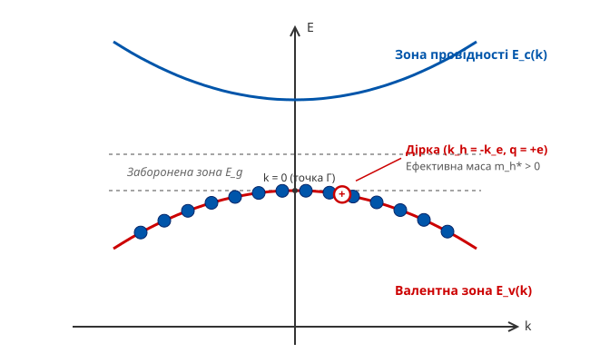
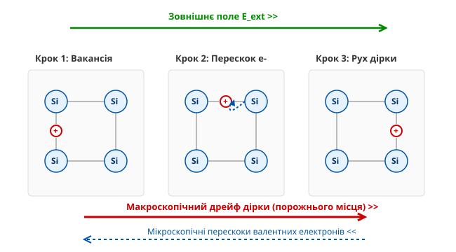
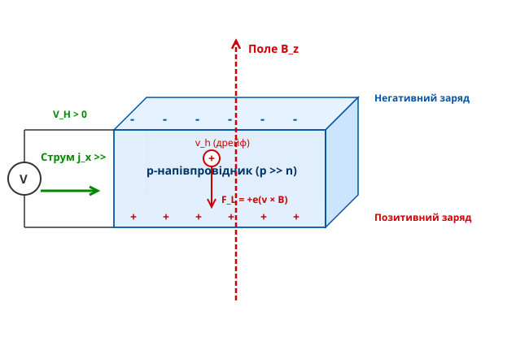

<preknowlist>
- [Зонна теорія твердих тіл](book:physics/condensed-matter-physics/band-theory) — формування валентної зони, зони провідності та енергетичної щілини
- [Класичний ефект Холла](book:physics/electromagnetism/hall-effect) — розділення носіїв заряду у поперечному магнітному полі та холллівська різниця потенціалів
- [Рухливість носіїв заряду](book:physics/condensed-matter-physics/carrier-mobility) — дрейфовий рух електронів і дірок у зовнішньому електричному полі
</preknowlist>

Коли до чистого напівпровідника додають невелику кількість елемента з меншою валентністю — наприклад, бор до кристала кремнію, — електричний струм у матеріалі починають переносити позитивні заряди. Прикладене електричне поле зміщує ці заряди в напрямку свого вектора, а поперечне магнічне поле відхиляє їх так, що на бічній грані зразка накопичується саме додатний потенціал. Жодного позитивно зарядженого іона чи ядра при цьому кристалічними гратами не рухається: ядра кремнію та бору залишаються жорстко зафіксованими у вузлах кристалічної ґратки. Весь струм забезпечується зв'язаними електронами валентної зони, проте колективна поведінка цих електронів за наявності хоча б одного вільного стану описується як рух окремої позитивної квазічастинки — дірки.

Зрозуміти походження дірки як носія заряду можна лише через аналіз заповнення енергетичних зон. Абсолютно заповнена валентна зона за температури нуль кельвінів не здатна проводити струм, незалежно від величини прикладеного зовнішнього поля. Це випливає з симетрії кристалічної ґратки та симетрії зони Бріллюена: для кожного електрона з хвильовим вектором `k`, що рухається з груповою швидкістю `v_g(k)`, існує парний електрон зі строго протилежним хвильовим вектором `-k` і протилежно направленою швидкістю `-v_g(k)`. Сумарний електричний струм такої повністю заповненої зони є тотожним нулю. Поле намагається прискорити електрони, змінюючи їхні хвильові вектори, але оскільки всі доступні квантові стани в межах зони вже зайняті принципом заборони Паулі, електрон не має можливості змінити свій квантовий стан, не вибуваючи із зони.

Ситуація принципово змінюється, коли в результаті теплової збудженості, фотопоглинання або акцепторного легування один із електронів залишає валентну зону. У зоні виникає один незаповнений квантовий стан — вакансія. Тепер електричний струм створюють решта `N - 1` електронів зони, які отримують можливість переходити на вільний рівень під дією зовнішнього поля. Проте розраховувати сумарний рух колосальної кількості `N - 1` електронів (порядку `10^23` на кубічний сантиметр) для кожного мікроскопічного акту провідності математично громіздко й фізично неефективно. Концепція дірки дозволяє замінити складну квантовомеханічну задачу багатьох тіл еквівалентною задачею для однієї-єдиної квазічастинки.


*Енергетичний спектр валентної зони з відсутнім електронним станом, який поводиться як позитивна квазічастинка з додатною ефективною масою.*

## Колективний струм та квазіімпульс відсутнього стану

Математична еквівалентність між колективним рухом `N - 1` електронів та рухом однієї дірки будується на підсумовуванні квантових характеристик заповнених станів. Якщо повна зона містить `N` квантових станів, а електрон видалено зі стану з хвильовим вектором `k_e` та енергією `E_e(k_e)`, то сумарний хвильовий вектор решти електронів `K_total` визначається відніманням вектора видаленого електрона від суми по всій зоні. Оскільки сума хвильових векторів по симетричній зоні Бріллюена дорівнює нулю, сумарний імпульс електронної системи виявляється рівним строго `-k_e`.

Цей результат означає, що відсутність електрона з імпульсом `k_e` еквівалентна наявності квазічастинки — дірки — з хвильовим вектором `k_h = -k_e`. Те саме стосується й електричного заряду. Сумарний заряд повністю заповненої валентної зони разом із позитивним фоном іонних остовів кристала є нейтральним. Видалення одного негативного заряду `-e` залишає некомпенсований позитивний заряд `+e`. Отже, дірка володіє елементарним додатним зарядом `q_h = +e`.

Швидкість руху дірки визначається груповою швидкістю вакантного стану. Оскільки енергетичний спектр валентної зони симетричний відносно інверсії часу, енергія електрона задовольняє умову `E_e(k) = E_e(-k)`. Градієнт енергії за хвильовим вектором визначає групову швидкість електрона `v_e(k_e)`. Для дірки енергію відраховують униз від вершини валентної зони, тобто `E_h(k_h) = -E_e(k_e)`. Обчислення градієнта дає рівність швидкостей: швидкість дірки `v_h` строго дорівнює груповій швидкості відсутнього електрона `v_e`.

Зовнішнє електричне поле `E_ext` діє на всі електрони зони, змінюючи їхні хвильові вектори за рівнянням Блоха `ħ (dk_i/dt) = -e E_ext`. Коли ми підсумовуємо зміни хвильових векторів усіх `N - 1` заповнених станів, швидкість зміни сумарного вектора `K_total` визначається часовою похідною відсутнього вектора:

```
ħ (dK_total / dt) = -ħ (dk_e / dt) = -(-e · E_ext) = +e · E_ext
```

Оскільки квазіімпульс дірки визначається як `p_h = ħ k_h = ħ K_total`, ми отримуємо фундаментальне рівняння динаміки дірки в електричному полі: `dp_h/dt = +e E_ext`. Зовнішня сила прискорює квазіімпульс дірки так, ніби на неї діє класична сила з додатним зарядом `+e`.

Детальний математичний формалізм перетворення операторів інверсії часу, підсумовування квазіімпульсів та визначення ефективної маси дірки винесено у відповідний матеріал: [🧮 Математичний апарат динаміки дірок](book:physics/condensed-matter-physics/holes-carriers/math-hole-dynamics.md).

## Фізичний зміст від'ємної ефективної маси електрона

Найбільш парадоксальним аспектом зонної теорії є те, що електрони, які знаходяться поблизу вершини валентної зони, володіють від'ємною ефективною масою. Ефективна маса динамічно описує відповідь кристалічної решітки на зовнішнє поле й визначається другою похідною енергії за хвильовим вектором. Поблизу максимуму валентної зони енергетична крива `E(k)` направлена опуклістю вгору, через що друга похідна `d²E/dk²` є від'ємною величиною.

Від'ємна маса електрона означає не від'ємну інертність у класичному розумінні, а специфічний характер взаємодії електрона з внутрішнім періодичним потенціалом кристалічних ґраток. Коли зовнішнє електричне поле `E_ext` діє на електрон поблизу вершини зони із силою `-e E_ext`, воно намагається прискорити його у напрямку, протилежному полю. Проте внаслідок інтенсивного Bragg-відбиття електронних хвиль від періодичних атомних площин кристала, внутрішня сила з боку ґратки спрямована проти зовнішньої сили і перевищує її за модулем. У результаті сумарна сила, що діє на електрон, змушує його прискорюватися проти зовнішньої сили.

Формально це описується рівнянням руху Ньютона для електрона з від'ємною масою:

```
m_e* · a = -e · E_ext    [m_e* < 0, тому прискорення a напрямлене вздовж поля E_ext]
```

Оскільки обидві частини рівняння мають від'ємні знаки (маса від'ємна, заряд від'ємний), їхній добуток дає додатне прискорення у напрямку вектора електричного поля `E_ext`. Спроба використовувати для опису реального провідника електрони з від'ємною масою та від'ємним зарядом постійно призводить до плутанини в знаках сил і прискорень.

Перехід до концепції дірки усуває цей парадокс. Ми визначаємо ефективну масу дірки `m_h*` як величину, протилежну за знаком ефективній масі електрона на вершині валентної зони:

```
m_h* = -m_e* > 0         [оскільки m_e* < 0, маса дірки m_h* стає додатною]
```

Завдяки такому визначенню дірка поводиться як звичайна класична частинка з додатною масою `m_h*` та додатним зарядом `+e`. Його рівняння руху у зовнішньому електричному полі набуває абсолютно природного вигляду:

```
m_h* · a = +e · E_ext    [додатна маса прискорюється за вектором додатного заряду]
```

Такий перехід повністю узгоджується із законами механіки та електродинаміки: замість того, щоб стежити за негативно зарядженими електронами з аномальною від'ємною масою, ми описуємо позитивно заряджені квазічастинки зі звичайною додатною масою.

## Естафетний механізм перенесення заряду у кристалічній ґратці

Для формування інтуїтивного розуміння корисно розглянути рух дірки на атомному рівні в реальному кристалічному просторі. У чистому кремнії кожен атом утворює чотири ковалентні парноелектронні зв'язки з чотирма сусідніми атомами. Якщо один електрон виривається зі зв'язку унаслідок теплової флуктуації, на його місці залишається незаповнена електронна орбіталь — ненасичений зв'язок.

Цей ненасичений зв'язок має локальний позитивний заряд, оскільки позитивний заряд ядра відповідного атома кремнію більше не компенсується відсутнім електроном. Електрон сусіднього насиченого ковалентного зв'язку може легко перескочити на цю вільну орбіталь під дією теплового руху або зовнішнього поля. 


*Схематичне зображення реального ковалентного зв'язку кремнію: координований перехід зв'язаних електронів між сусідніми атомами створює видимість макроскопічного руху позитивного заряду.*

Під час такого переходу реальний електрон зміщується на одну міжатомну відстань в один бік (наприклад, ліворуч). Проте незаповнений зв'язок — вакансія — опиняється тепер на тому місці, звідки електрон щойно пішов (тобто праворуч). Послідовний ряд таких перескоків сусідніх валентних електронів спричиняє макроскопічне переміщення вакансії через кристал.

Цей процес нагадує естафету або рух порожнього місця у шерензі людей: люди зміщуються вліво на одне крісло, а порожнє крісло «рухається» вправо. Хоча фізичними носіями руху є реальні люди (електрони), спостерігач бачить макроскопічний перенос порожнього місця (дірки). 

Звідси випливає важлива відмінність між рухливістю електронів у зоні провідності та рухливістю дірок у валентній зоні. Електрон у зоні провідності пересувається практично як вільна хвиля де Бройля через регулярну кристалічну ґратку, лише злегка розсіюючись на фононах та дефектах. Його рухливість `μ_n` є відносно високою. Натомість дірка рухається естафетним шляхом через тугозв'язані валентні станційні орбіталі. Перекриття хвильових функцій валентних електронів менше, а ефективна маса дірок зазвичай більша за ефективну масу електронів провідності. Через це рухливість дірок `μ_p` у більшості напівпровідників (як-от кремній чи арсенід галію) суттєво нижча за рухливість електронів: для кремнію при кімнатній температурі `μ_n ≈ 1450 cm²/(V·s)`, тоді як `μ_p ≈ 450 cm²/(V·s)`.

## Акцепторне легування та утворення дірок у p-напівпровідниках

Основним джерелом дірок у напівпровідниковій мікроелектроніці є процес акцепторного легування. Коли до кристала чотиривалентного кремнію вводиться заміщувальна домішка тривалентного елемента — наприклад, бору (B), алюмінію (Al) або галію (Ga), — атом домішки займає вузол кристалічної ґратки. Три його валентні електрони утворюють повноцінні ковалентні зв'язки з трьома сусідніми атомами кремнію. 

Проте для четвертого ковалентного зв'язку з четвертим сусідом у атома бору бракує власного електрона. Утворюється незаповнений стан з енергетичним рівнем `E_A`, що розташований у забороненій зоні на невеликій відстані `ΔE_A` вище вершини валентної зони `E_v`. Для кремнію ця енергія іонізації акцептора `ΔE_A` становить лише близько `0.045 eV` для бору, що порівняно з енергією теплового руху `k_B T ≈ 0.026 eV` при кімнатній температурі (`300 K`).

Внаслідок теплового збудження валентний електрон легко захоплюється на вільний акцепторний рівень бору. При цьому атом бору перетворюється на негативно заряджений зафіксований іон `B^-`, а у валентній зоні виникає вільна дірка. Оскільки негативний іон акцептора нерухомо закріплений у вузлі ґратки, єдиним мобільним носієм заряду, здатним брати участь у провідності, є додатна дірка у валентній зоні.

Квантовомеханічний стан дірки, зв'язаної з акцепторним іоном при низьких температурах, описується водневоподібною моделлю. Негативний іон акцептора створює кулонівський потенціал `-e² / (4 π ε ε_0 r)`, у якому дірка з ефективною масою `m_h*` рухається по водонеподібній орбіті. Ефективний радіус Бора такої зв'язаної дірки `r_B*` перевищує міжатомну відстань:

```
r_B* = r_B · ε · (m_0 / m_h*)      [де r_B ≈ 0.053 nm — радіус Бора для атома водню]
```

Завдяки високій діелектричній проникності кремнію (`ε ≈ 11.7`) радіус орбіти дірки становить близько `1–2 nm`, охоплюючи десятки атомних комірок. Це пояснює, чому енергія іонізації акцептора `ΔE_A` є такою малою порівняно з енергією іонізації вільного атома водню (`13.6 eV`):

```
ΔE_A = E_H · (m_h* / m_0) / ε²     [зменшення енергії зв'язку пропорційно ε²]
```

Збільшення концентрації акцепторних домішок `N_A` призводить до перекриття водневоподібних орбіталей сусідніх акцепторів. При досягненні критичної концентрації (порядку `10^18 cm^-3` для Si) відбувається метал-діелектричний перехід Мотта: акцепторний рівень розширюється в акцепторну зону, яка зливається з вершиною валентної зони, і напівпровідник стає виродженим (p-тип провідності зберігається навіть при температурах, близьких до абсолютного нуля).

## Температурна залежність концентрації дірок

Концентрація дірок `p` у напівпровіднику p-типу виявляє складну тристадійну температурну залежність, яка відображає конкуренцію між іонізацією домішок та власною генерацією електронно-діркових пар.

На першій стадії — в **області виморожування носіїв** (низкотемпературний режим, `T < 100 K`) — теплової енергії `k_B T` недостатньо для повної іонізації акцепторів. Більшість дірок перебуває у зв'язаному стані на акцепторних рівнях. Зростання температури спричиняє експоненційне зростання концентрації вільних дірок за законом:

```
p(T) ≈ (N_A · N_v / 2)^(1/2) · exp(-ΔE_A / (2 k_B T))
```

де `N_v = 2 (2 π m_h* k_B T / h²)^(3/2)` — ефективна щільність станів у валентній зоні.

На другій стадії — в **області насичення (виснаження домішок)** (кімнатні температури, `100 K < T < 500 K`) — усі акцепторні рівні вже повністю іонізовані (`k_B T > ΔE_A`), тоді як власна генерація носіїв через заборонену зону `E_g` ще є знехтовно малою (`k_B T << E_g`). У цьому діапазоні концентрація дірок залишається практично постійною і дорівнює концентрації введених акцепторних домішок:

```
p ≈ N_A                   [концентрація дірок визначається легуванням]
```

На третій стадії — в **області власної провідності** (високотемпературний режим, `T > 500 K`) — теплова енергія стає достатньою для масового розриву міжвідновних ковалентних зв'язків та переходу електронів безпосередньо з валентної зони у зону провідності. Власна концентрація носіїв `n_i(T) ∝ exp(-E_g / (2 k_B T))` починає значно перевищувати концентрацію домішок `N_A`. Концентрація дірок порівнюється з концентрацією електронів: `p ≈ n ≈ n_i`, і напівпровідник втрачає свій p-тип, перетворюючись на власний.

Положення рівня Фермі `E_F` у p-напівпровіднику безпосередньо пов'язане з концентрацією дірок. У режимі насичення рівень Фермі розташований поблизу валентної зони:

```
E_F = E_v + k_B T · ln(N_v / N_A)
```

З підвищенням температури рівень Фермі зміщується вгору до середини забороненої зони, що відповідає переходу матеріалу до власної провідності.

## Ефект Холла у p-напівпровідниках: прямий доказ існування дірок

Історично концепція дірок викликала тривалі дискусії, адже видавалася лише зручною математичною абстракцією. Прямим фізичним доказом того, що дірка поводиться як реальний позитивний носій заряду у макроскопічних експериментах, став ефект Холла.

Якщо через прямокутну пластину напівпровідника пропустити струм щільністю `j_x` уздовж осі `X`, і прикласти перпендикулярне магнічне поле з індукцією `B_z` вздовж осі `Z`, на носії заряду почне діяти сила Лоренца `F_L`. Для класичних електронів провідності (з від'ємним зарядом `-e` та дрейфовою швидкістю `v_x < 0`, спрямованою проти струму) сила Лоренца розраховується як:

```
F_y = -e · (v_x · B_z - 0)    [v_x < 0, тому добуток (-e)·v_x > 0, сила напрямлена в бік -Y]
```

Електрони відхиляються до нижньої грані зразка, створюючи на ній негативний потенціал. Коефіцієнт Холла `R_H`, що визначається відношенням поперечного електричного поля `E_y` до добутку `j_x · B_z`, виявляється строго від'ємним:

```
R_H = -1 / (n · e)            [де n — концентрація електронів провідності]
```

Для дірок у напівпровіднику p-типу струм `j_x` створюється носіями з додатним зарядом `+e`, які рухаються у напрямку струму (`v_x > 0`). Сила Лоренца, що діє на дірку, дорівнює:

```
F_y = +e · (v_x · B_z)        [v_x > 0 та B_z > 0 дають силу, спрямовану до нижньої грані -Y]
```

Дірки також відхиляються до нижньої грані зразка. Але оскільки вони несуть додатний заряд `+e`, нижня грань заряджається позитивно відносно верхньої. Поперечне електричне поле Холла `E_y` змінює свій напрямок на протилежний порівняно з електронним провідником. 


*Відхилення дірок силю Лоренца до нижньої грані зразка створює поперечне електричне поле з додатним значущим коефіцієнтом Холла.*

У результаті коефіцієнт Холла для p-напівпровідника стає додатним:

```
R_H = +1 / (p · e)            [де p — концентрація дірок]
```

Експериментальне вимірювання додатного коефіцієнта Холла `R_H > 0` у зразках кремнію чи германію, легованих акцепторами, остаточно підтвердило реальність позитивних носіїв заряду. Вимірявши коефіцієнт Холла, можна безпосередньо розрахувати концентрацію дірок `p`, а знаючи питому провідність `σ = p · e · μ_p` — визначити їхню рухливість.

Історію виявлення аномального знака Холла металів та створення квантовомеханічної теорії Пеєрлса детально описано у матеріалі: [📜 Відкриття дірок та парадокс знака Холла](book:physics/condensed-matter-physics/holes-carriers/hist-holes-concept.md).

Чисельне моделювання траєкторій носіїв у перехресних полях та накопичення холллівського заряду на межах зразка наведено у проєкті: [⚙️ Моделювання руху носіїв та ефекту Холла у p- та n-напівпровідниках](book:physics/condensed-matter-physics/holes-carriers/proj-hall-carrier-sim.md).

## Термоелектричні та гальваномагнітні ефекти за участю дірок

Додатний знак заряду дірок виявляється не лише в ефекті Холла, але й у термоелектричних явищах, зокрема в ефекті Зеебека (виникненні термо-ЕРС). Якщо один кінець напівпровідникового бруска нагріти до температури `T_hot`, а другий тримати при вищій температурі `T_cold`, хаотичний тепловий рух дірок на гарячому кінці стає більш інтенсивним.

Внаслідок градієнта температури виникає дифузійний потік дірок від гарячого кінця до холодного. Оскільки дірки несуть додатний заряд `+e`, на холодному кінці зразка накопичується надлишковий позитивний заряд, тоді як на гарячому кінці залишається некомпенсований негативний заряд об'ємних іонів акцептора. Виникає внутрішнє термоелектричне поле `E_th`, спрямоване від холодного кінця до гарячого, яке зупиняє подальшу дифузію.

Коефіцієнт Зеебека `S`, що визначається відношенням виниклої різниці потенціалів до різниці температур `S = ΔV / ΔT`, для p-напівпровідника є строго додатним:

```
S_p = + (k_B / e) · [A + ln(N_v / p)]    [де A — константа, що залежить від механізму розсіювання]
```

Для n-напівпровідника аналогічна дифузія електронів переносить негативний заряд до холодного кінця, роблячи коефіцієнт Зеебека від'ємним (`S_n < 0`). Вимірювання знака термо-ЕРС є найпростішим експрес-методом визначення типу провідності напівпровідникових пластин у промисловому виробництві (метод гарячого зонда).

У двозонних провідниках, де присутні і електрони, і дірки, під дією магнітного поля спостерігаються складні гальваномагнітні явища — зокрема поздовжній та поперечний магнітоопір (зміна опору в магнітному полі). Оскільки електрони та дірки відхиляються силами Лоренца в один і той самий бік (до однієї грані), але створюють поле Холла протилежних знаків, їхні холллівські поля частково компенсують одне одне. Це перешкоджає повній компенсації сили Лоренца електричним полем Холла, через що носії продовжують рухатися по викривлених траєкторіях, значно збільшуючи електричний опір зразка у магнітному полі.

## Складна структура валентної зони: важкі, легкі та відщеплені дірки

У реальних напівпровідниках зі структурою алмазу чи сфалериту (Si, Ge, GaAs) валентна зона утворюється з p-орбіталей атомів. Внаслідок спін-орбітальної взаємодії та симетрії кристала валентна зона біля центра зони Бріллюена (точка Г) має складну вироджену структуру, складаючись із трьох підзон.

Перша підзона має малу кривину дисперсійної кривої `E(k)`. Це означає велику другу похідну та, відповідно, більшу значення ефективної маси. Носії в цій зоні називаються **важкими дірками** (heavy holes, `m_hh*`). Наприклад, для кремнію ефективна маса важкої дірки становить приблизно `0.49 m_0` (де `m_0` — маса вільного електрона).

Друга підзона має стрімку кривину `E(k)`, що відповідає малій ефективній масі. Ці носії називаються **легкими дірками** (light holes, `m_lh*`). Для кремнію маса легких дірок становить близько `0.16 m_0`. 

Третя підзона опускається нижче по енергії на величину спін-орбітального розщеплення `Δ_so` внаслідок взаємодії спіна електрона з його орбітальним моментом. Вона називається **спін-орбітально відщепленою зоною** (split-off band). За звичайних температур більшість дірок зосереджена у зонах важких та легких дірок.

через наявність двох типів дірок (важких і легких), які беруть участь у провідності одночасно, загальний коефіцієнт Холла та провідність p-напівпровідника визначаються двозонною моделлю:

```
σ = e · (p_hh · μ_hh + p_lh · μ_lh)

R_H = (1 / e) · (p_hh · μ_hh² + p_lh · μ_lh²) / (p_hh · μ_hh + p_lh · μ_lh)²
```

Оскільки рухливість легких дірок `μ_lh` значно вища за рухливість важких дірок `μ_hh`, легкі дірки роблять непропорційно великий внесок у гальваномагнітні ефекти, незважаючи на їхню меншу концентрацію `p_lh < p_hh`.

Крім того, ізоенергетичні поверхні дірок (поверхні постійної енергії у `k`-просторі) не є ідеально сферичними, а виявляють виражену анізотропію — так звану гофрованість (warping). Це призводить до того, що ефективна маса дірки залежить від напрямку її руху відносно кристалографічних осей `[100]`, `[110]` та `[111]`.

## Дірки у низькорозмірних напівпровідникових гетероструктурах

У сучасній напівпровідниковій наноелектроніці — квантових ямах (quantum wells), квантових нитках та квантових точках — геометричне обмеження руху дірок по одній або кількох координатах принципово змінює їхній енергетичний спектр.

У плоскій квантовій ямі (наприклад, шар GaAs між широкізольними бар'єрами AlGaAs) розмірне квантування уздовж осі `Z` розщеплює вироджені вершини зон важких та легких дірок. Оскільки енергія квантування розраховується як `E_n = (ħ² π² n²) / (2 m* L_z²)`, рівень важких дірок (з більшою масою `m_hh*`) опиняється енергетично вище за рівень легких дірок. Більшість дірок за низьких температур накопичується на найвищому підрівні квантування важких дірок.

Тут проявляється ефект інверсії ефективних мас: дірка, яка є «важкою» під час руху вздовж осі квантування `Z`, володіє малою «легкою» масою в площині квантової ями `XY` (in-plane mass), і навпаки. Це випливає зі збереження загального кутового моменту `J = 3/2` при симетрії гетероструктури.

Деформаційне інженерне проектування (strain engineering) активно використовує цей ефект. Якщо шар кремнію виростити на підкладці кремній-германію (Strained Silicon), механічні напруги стиску розщеплюють валентну зону так, що ефективна маса дірок у площині каналу зменшується у 2–3 рази. Це дозволяє різко підвищити рухливість дірок `μ_p` та зрівняти характеристики p-канальних польових транзисторів (PMOS) із n-канальними (NMOS) у сучасних процесорних КМОН-технологіях (CMOS).

## Експериментальне вимірювання динамічних параметрів дірок

Пряме вимірювання динамічних характеристик дірок — їхньої рухливості, коефіцієнта дифузії та ефективної маси — виконується за допомогою двох класичних експериментальних методів: досліду Гейнса-Шоклі та циклотронного резонансу.

Експеримент Гейнса-Шоклі (Haynes-Shockley experiment) дозволяє безпосередньо спостерігати дрейф та розмивання нерівноважного пакета дірок. У довгий напівпровідниковий брусок (наприклад, n-типу) за допомогою коротроткого лазерного імпульсу місцево інжектується локалізований пакет нерівноважних електронно-діркових пар. До кінців бруска прикладено постійне електричне поле `E_x`.

Під дією поля пакет дірок дрейфує вздовж бруска зі швидкістю `v_drift = μ_p · E_x`, одночасно розширюючись внаслідок теплової дифузії. На фіксованій відстані `L` розташовано колекторний p-n перехід, який реєструє часовий профіль струму дірок. Вимірявши час прольоту пакета `t_flight`, безпосередньо розраховують дрейфову рухливість дірок:

```
μ_p = L / (E_x · t_flight)
```

А за шириною розмиття сигналу в часі `Δt` визначають коефіцієнт дифузії `D_p`. Це дає пряме експериментальне підтвердження співвідношення Ейнштейна: `D_p / μ_p = k_B T / e`.

Циклотронний резонанс забезпечує пряме вимірювання ефективної маси дірок `m_h*`. Напівпровідниковий кристал поміщають у постійне магнічне поле `B` при кріогенних температурах (`4.2 K`) та опромінюють мікрохвильовим електромагнітним полем частоти `ω`. Магнічне поле змушує дірки обертатися по спіральних траєкторіях навколо ліній магнітного поля з циклотронною частотою:

```
ω_c = e · B / m_h*
```

Коли частота зовнішнього мікрохвильового випромінювання `ω` збігається з циклотронною частотою `ω_c`, спостерігається резонансне поглинання електромагнітної енергії. Оскільки у валентній зоні присутні важкі та легкі дірки, на спектрі поглинання виникають два чіткі резонансні піки при різних значеннях магнітного поля `B`, що дозволяє з високою точністю обчислити значення ефективних мас `m_hh*` та `m_lh*`.

## Закони збереження при генерації та рекомбінації дірок

У напівпровідникових приладах дірки постійно створюються та зникають у процесах генерації та рекомбінації. При поглинанні фотона з енергією, що перевищує ширину забороненої зони `hν ≥ E_g`, електрон із валентної зони переходить у зону провідності. Цей процес створює одночасно дві квазічастинки — електрон у зоні провідності та дірку у валентній зоні (електронно-діркову пару).

Під час зворотного процесу — рекомбінації — електрон із зони провідності переходить у незаповнений стан валентної зони, тобто «падає» на вільне місце. З точки зору теорії квазічастинок відбувається анігіляція електрона та дірки із виділенням енергії у вигляді фотона (випромінювальна рекомбінація) або фононів (безвипромінювальна рекомбінація через пастки Шоклі-Ріда-Холла).

Під час цих перетворень суворо виконуються закони збереження енергії та квазіімпульсу:

```
E_e + E_h = hν                     [закон збереження енергії]

k_e + k_h = q_photon ≈ 0           [закон збереження квазіімпульсу]
```

Оскільки імпульс оптичного фотона `q_photon` є знехтовно малим порівняно з розмірами зони Бріллюена, прямі оптичні переходи на діаграмі `E(k)` відбуваються строго вертикально. У прямозонних напівпровідниках (як-от арсенід галію GaAs) мінімум зони провідності та максимум валентної зони знаходяться при однаковому хвильовому векторі `k = 0`, що забезпечує високу ефективність випромінювальної рекомбінації в світлодіодах та лазерах. У непрямозонних матеріалах (кремній Si, германій Ge) рекомбінація вимагає участі третьої частинки — фонона — для компенсації різниці імпульсів, що значно збільшує час життя нерівноважних дірок.

Концепція дірки як позитивної квазічастинки з додатною ефективною масою є фундаментальною основою всієї фізики напівпровідникових приладів. Без урахування діркової провідності неможливо пояснити роботу p-n переходів, біполярних та польових транзисторів, сонячних батарей та світлодіодів. Вона перетворює складну квантову систему з колосальною кількістю взаємодіючих валентних електронів на елегантну та просту фізичну модель, де струм переносять два типи носіїв — вільні електрони та вільні дірки.
