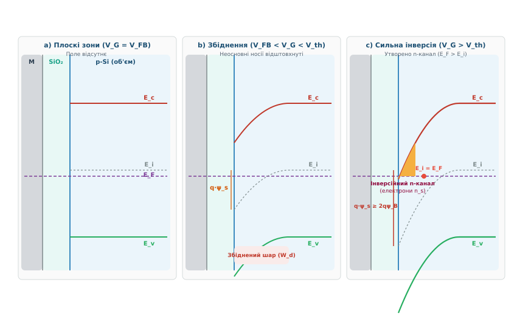
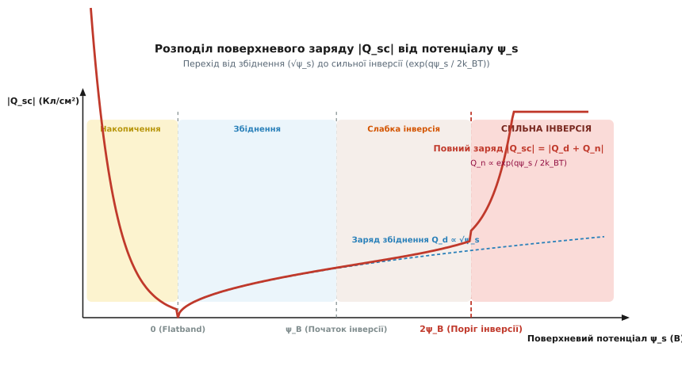
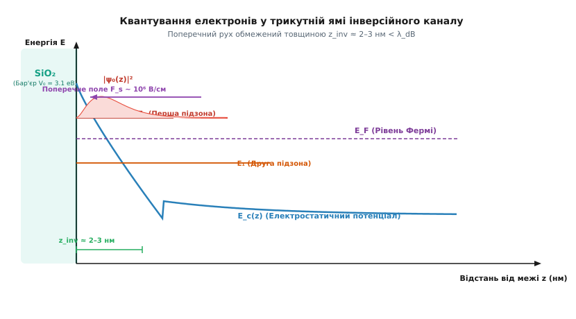

# Шар інверсії в напівпровіднику

<preknowlist>
- [Напівпровідники](topic:physics/semiconductor) — власна та домішкова провідність, носії заряду p- та n-типу.
- [Рівень Фермі](topic:physics/fermi-level) — хімічний потенціал електронів та розподіл Фермі-Дірака.
- [Енергетичні зони](topic:physics/energy-bands) — структура зони провідності та валентної зони в кристалі.
- [Двовимірний електронний газ (2DEG)](topic:physics/two-dimensional-electron-gas) — локалізація носіїв у потенціальній ямі з квантуванням поперечного руху.
- [Дебаївський радіус екранування](topic:physics/debye-length) — просторове екранування електростатичного поля носіями заряду.
</preknowlist>

Керування струмом у напівпровідникових структурах без постійного витоку заряду через електрод керування є головною фізико-технічною проблемою мікроелектроніки. Традиційні p-n переходи та біполярні транзистори потребують струму керування й обмежені інжекцією носіїв, що унеможливлює масштабування мікропроцесорів до мільярдів елементів на кристалі. Фундаментальне вирішення цієї проблеми полягає у безконтактній електростатичній модуляції провідності: приповерхневий потенціал напівпровідника контролюється зовнішнім електричним полем ізольованого затвора.

Накладання поперечного поля через тонкий шар діелектрика вигинає енергетичні зони вглиб напівпровідника p-типу. Коли потенціал поверхні `ψ_s` перевищує поріг, середина забороненої зони (власний рівень `E_i`) опускається нижче стаціонарного рівня Фермі `E_F`. У цьому стані концентрація неосновних носіїв (електронів) біля межі `діелектрик-напівпровідник` експоненційно зростає і перевищує концентрацію акцепторних дірок `N_A`, створюючи провідний шар протилежного n-типу в об'ємі p-матеріалу. Фізичний стан зміни типу провідності називається **інверсією провідності**, а утворений приповерхневий провідний канал — **інверсійним шаром**.

Формування та модулювання інверсійного шару є базовим механізмом роботи всіх сучасних польових транзисторів типу метал-діелектрик-напівпровідник (МДН або MOSFET — *Metal-Oxide-Semiconductor Field-Effect Transistor*), а також їхніх 3D-модифікацій FinFET та Gate-All-Around (GAA). Можливість за частки пікосекунди змінювати опір інверсійного каналу на 8–10 порядків лише за рахунок поверхневого електростатичного потенціалу визначає масштабування та енергоефективність усієї цифрової наноелектроніки.

## 1. Механізм згину енергетичних зон та електростатика МДН-структури

Електростатична поведінка приповерхневої області напівпровідника визначається структурою МДН-конденсатора, який складається з трьох послідовних шарів: металевого (або сильнодопованого полікремнієвого) керівного електрода — **затвора**, тонкого шарчика твердотільного діелектрика (найчастіше діоксиду кремнію `SiO₂` товщиною від `1` до `10 нм`) та напівпровідникової підкладки.

При подачі електричного потенціалу на затвор усередині структури виникає поперечне електростатичне поле `F`, під дією якого електрони та дірки перерозподіляються вздовж координати `x`, спрямованої від межі розділу вглиб напівпровідника. Просторова зміна потенціалу `ψ(x)` безпосередньо виражається через потенціальну енергію електрона `V(x) = -q · ψ(x)`, що викликає відповідний плавній нахил усіх енергетичних меж зонного спектра кристала.


*_Зонна діаграма МДН-структури на основі p-Si при різних напругах затвора: a) режим плоских зон (поле відсутнє); b) режим збіднення (дірки відштовхнуті); c) режим сильної інверсії (власний рівень E_i опускається нижче E_F, утворюючи проводимий n-канал)._*

Еволюція стану поверхні напівпровідника p-типу при зміні напруги затвора `V_G` розгортається через чотири послідовні фізичні режими:

1. **Режим накопичення (акумуляції):** При прикладанні від'ємного потенціалу `V_G < V_{FB}` (де `V_{FB}` — напруга плоских зон) енергетичні зони вигинаються вгору (`ψ_s < 0`). Позитивне поле затвора притягує основні носії — дірки — з об'єму до межі розділу. Концентрація дірок на поверхні `p_s = N_A · exp(q·|ψ_s| / (k_B·T))` стає значно вищою за об'ємну концентрацію `N_A`, утворюючи збагачений шар.
2. **Режим плоских зон (Flatband):** При напрузі `V_G = V_{FB}` зовнішнє поле та різниця робіт виходу матеріалів повністю компенсуються. Електростатичний потенціал `ψ(x) = 0` вздовж усієї товщини напівпровідника, зонні межі `E_c` та `E_v` лишаються строго горизонтальними прямолінійними смугами.
3. **Режим збіднення (Depletion):** Подача помірної позитивної напруги затвора `V_G > V_{FB}` створює в напівпровіднику електричне поле, спрямоване від поверхні вглиб. Поле відштовхує позитивні дірки у глибину кристала. На поверхні залишається незакомплексований просторовий заряд іонізованих негативних акцепторних атомів `N_A⁻`. Утворюється **збіднений шар** товщиною `W_d`, у якому вільні носії практично відсутні, а енергетичні зони вигинаються додолу на величину поверхневого потенціалу `ψ_s > 0`.
4. **Режим інверсії (Inversion):** При подальшому збільшенні позитивної напруги затвора згин зон стає настільки глибоким, що дно зони провідності `E_c` наближається до рівня Фермі `E_F`. У точці, де власний рівень Фермі `E_i` перетинає горизонтальну лінію `E_F`, концентрація вільних електронів `n_s` зрівнюється з власною концентрацією `n_i`. Подальше зростання напруги приводить до стану, коли `E_F` опиняється ближче до зони провідності `E_c`, ніж до валентної зони `E_v`. Тип провідності приповерхневого шару фізично змінюється з p на n.

Докладний історичний шлях від теоретичних заперечень Джона Бардіна про пасивацію поверхневих станів до створення перших MOS-структур розкрито у [історії відкриття інверсійного шару та винайдення MOS-структури](topic:physics/inversion-layer/hist-inversion-layer.md).

Згин зон визначається чисельним значенням **поверхневого потенціалу** `ψ_s = ψ(0)`, який вимірюється відносно нейтрального об'єму напівпровідника. Зв'язок між локальною концентрацією вільних носіїв у довільній точці `x` та потенціалом `ψ(x)` виражається формулами Больцмана:

```
p(x) = N_A · exp(-q · ψ(x) / (k_B · T))
n(x) = n₀ · exp(+q · ψ(x) / (k_B · T)) = (n_i² / N_A) · exp(q · ψ(x) / (k_B · T))
```

де `k_B` — стала Больцмана, `T` — абсолютна температура, `q` — елементарний заряд.

В об'ємі напівпровідника p-типу рівень Фермі `E_F` лежить нижче власного рівня `E_i` на величину об'ємного потенціалу Фермі `ψ_B`:

```
ψ_B = (k_B · T / q) · ln(N_A / n_i)
```

Для кремнію з помірним рівнем допування `N_A = 10¹⁶ см⁻³` при `T = 300 K` значення об'ємного потенціалу становить `ψ_B ≈ 0.35 В`.

У режимі збіднення, коли інверсійний заряд ще незначний, аналітичний розпис потенціалу `ψ(x)` отримують розв'язанням рівняння Пуассона у наближенні постійної об'ємної густини заряду іонізованих домішок `ρ(x) = -q · N_A`. Двократне інтегрування дає параболічний профіль потенціалу у збідненому шарі:

```
ψ(x) = ψ_s · (1 - x / W_d)²
```

де ширина збідненого шару `W_d` виражається через поверхневий потенціал як:

```
W_d = √( (2 · ε_s · ψ_s) / (q · N_A) )
```

Напруга плоских зон `V_{FB}` відіграє роль відлікової точки для всіх МДН-приладів. Вона враховує не лише різницю робіт виходу електрода затвора та напівпровідника `ΔΦ_{MS} = Φ_M - Φ_S`, але й наявність різних видів технологічних зарядів у товщі діелектрика та на його межах:

```
V_{FB} = ΔΦ_{MS} - (Q_{ox} / C_{ox})
```

тут `Q_{ox} = Q_f + Q_m + Q_{ot} + Q_{it}` є ефективним сумарним зарядом оксиду, де `Q_f` — фіксований заряд поверхневих іонів кремнію, `Q_m` — рухомі іони лужних металів (наприклад, `Na⁺`), `Q_{ot}` — підзатворні пастки, індуковані радіацією, а `Q_{it}` — заряд швидкодіючих поверхневих станів інтерфейсу.

Фізична природа технологічного заряду `Q_f` пов'язана з недоокисленими атомами кремнію `Si⁺` на гетеромежі `Si/SiO₂`, які мають позитивний знак зарядження та зміщують вольт-фарадні характеристики МДН-структур ліворуч уздовж осі напруг. У реальному виробництві високотемпературний відпал у середовищі водню або азоту при `450°C` дозволяє пасивувати поверхневі стани та зменшити густість `D_{it}` до рівня `10¹⁰ см⁻² еВ⁻¹`.

> 🔧 **Навіщо це.** 
> Поверхневий згин зон та явище інверсії провідності дозволяють створювати ізольовані канальні структури всередині монокристала без фізичного etching чи нанесення нових матеріалів. Прикладаючи напругу до затвора, інженер може за частки пікосекунди змінити опір каналу між витоком і стоком на 8–10 порядків, що є основою функціонування всіх цифрових логічних вентилів у сучасних мікропроцесорах.

## 2. Слабка та сильна інверсія: поріг виникнення та поверхневий заряд

Процес формування інверсійного шару не є миттєвим стрибком — він розвивається безперервно зі зростанням поверхневого потенціалу `ψ_s`. У фізиці МДН-приладів чітко розрізняють два режими інверсії: **слабку інверсію** та **сильну інверсію**.

Межею між збідненням та слабкою інверсією є точка `ψ_s = ψ_B`, у якій власний рівень `E_i` на поверхні перетинає рівень Фермі `E_F`. У цій точці поверхнева концентрація електронів досягає власної концентрації напівпровідника `n_s = n_i`. Однак оскільки `n_i ≪ N_A`, заряд цих електронів є нехтовно малим порівняно з зарядом іонізованих акцепторів у збідненому шарі `Q_d`.


*_Залежність повного поверхневого заряду |Q_sc| від поверхневого потенціалу ψ_s: перехід від параболічного зростання заряду збіднення √ψ_s до стрімкого експоненційного підйому заряду сильної інверсії exp(qψ_s / 2k_BT)._*

У режимі **слабкої інверсії** (`ψ_B ≤ ψ_s < 2·ψ_B`) концентрація електронів вже перевищує концентрацію дірок (`n_s > p_s`), проте все ще залишається меншою за об'ємну концентрацію акцепторів `N_A`. Електрони у цьому режимі рухаються переважно шляхом дифлузії, а не дрейфу, утворюючи так званий підпороговий струм витоку транзистора `I_{sub}`:

```
I_{sub} ∝ exp( (q · (V_G - V_{th})) / (n · k_B · T) )
```

де `n = 1 + C_d / C_{ox}` — фактор підпорогового нахилу, а `C_d = ε_s / W_d` — питома ємність збідненого шару. Підпороговий нахил `S = (k_B·T / q) · ln(10) · n` визначає, накільки мілівольт треба змінити напругу затвора, щоб підпороговий струм витоку змінився в 10 разів (теоретичний мінімум для планарного кремнієвого транзистора при `300 K` становить `S ≈ 60 мВ/декаду`). Збільшення ємності оксиду `C_{ox}` або перехід до 3D-архітектури затвора дозволяє наблизити параметр `n` до 1 та мінімізувати паразитні струми витоку в запертому стані.

Перехід до режиму **сильної інверсії** відбувається при досягненні критерію:

```
ψ_s,th = 2 · ψ_B = (2 · k_B · T / q) · ln(N_A / n_i)
```

При `ψ_s = 2 · ψ_B` поверхнева концентрація вільних електронів становиться точно рівною об'ємній концентрації основних носіїв:

```
n_s(0) = (n_i² / N_A) · exp(q · (2·ψ_B) / (k_B · T)) = (n_i² / N_A) · (N_A / n_i)² = N_A
```

Після досягнення порогу `ψ_s ≥ 2·ψ_B` найменше подальше збільшення поверхневого потенціалу викликає катастрофічне експоненційне зростання концентрації вільних електронів. Завдяки високій густості рухомих носіїв інверсійний шар починає повністю екранувати об'єм напівпровідника від зовнішнього поля. 

Це приводить до двох надзвичайно важливих наслідків:
1. **Зафіксованість поверхневого потенціалу:** При подальшому зростанні напруги затвора `V_G > V_{th}` поверхневий потенціал `ψ_s` практично застрягає на рівні `2 · ψ_B` і збільшується лише на декілька мілівольт при подвоєнні напруги затвора.
2. **Насичення товщини збідненого шару:** Товщина збідненого шару досягає свого фізичного максимуму `W_{d,max}` і перестає зростати:
```
W_{d,max} = √( (2 · ε_s · (2 · ψ_B)) / (q · N_A) )
```

З цього моменту весь додатковий електричний заряд, що індукується зовнішньою напругою затвора, накопичується виключно у вигляді вільних електронів інверсійного шару `Q_n`.

Точний математичний зв'язок між напруженістю поверхневого поля `F_s`, повним зарядом `Q_sc` та компонентами `Q_d` і `Q_n` отримують інтегруванням одновимірного рівняння Пуассона. Повний заряд напівпровідника на одиницю площі описується виразом:

```
Q_sc = - √(2 · ε_s · q · N_A · (k_B · T / q)) · F(u_s, u_b)
```

де `u_s = q · ψ_s / (k_B · T)` — безрозмірний поверхневий потенціал, а `F(u_s, u_b)` — функція Кінгстона-Нейштадтера. Детальний апарат математичного виводу рівнянь Пуассона-Больцмана та виділення інверсійної компоненти наведено у [математичному виводі рівняння Пуассона-Больцмана та поверхневого заряду інверсії](topic:physics/inversion-layer/math-band-bending.md).

Для практичних інженерних розрахунків використовують **наближення зарядового шару** (*charge-sheet approximation*), у якому інверсійний шар вважається безнескінченно тонким шарчиком заряду `Q_n`, локалізованим безпосередньо на межі `x = 0`. У цьому наближенні зв'язок між напругою затвора `V_G` та інверсійним зарядом `Q_n` стає строго лінійним:

```
Q_n = -C_{ox} · (V_G - V_{th})
```

де `C_{ox} = ε_{ox} / d_{ox}` — питома ємність оксиду затвора на одиницю площі, а `V_{th}` — **порогова напруга** МДН-структури, яка визначається співвідношенням:

```
V_{th} = V_{FB} + 2 · ψ_B + (√(2 · ε_s · q · N_A · (2 · ψ_B)) / C_{ox})
```

У випадку наявності зміщення на підкладці `V_{SB}` (ефект підкладки або *body effect*) порогова напруга зростає через додаткове розширення збідненого шару:

```
V_{th} = V_{th0} + γ · ( √(2·ψ_B + V_{SB}) - √(2·ψ_B) )
```

де `γ = √(2 · ε_s · q · N_A) / C_{ox}` — коефіцієнт впливу підкладки. Ефект підкладки має принципове значення при розрахунку каскодних схем та інтегральних аналогових ключах, оскільки підвищення потенціалу джерела змінює робочу точку транзистора.

Фізична товщина інверсійного каналу у класичному наближенні описується довжиною скринінгу і зменшується зі зростанням напруги затвора. Середня глибина залягання електронів `x_{avg}` може бути виражена як:

```
x_{avg} = (3 · k_B · T) / (q · F_{eff})
```

де `F_{eff}` — ефективне електричне поле у каналі. При високих напругах затвора класична товщина каналу стає меншою ніж `2 нм`, що вимагає залучення строгої квантово-механічної теорії.

## 3. Квантування носіїв у потенціальній ямі та двовимірний електронний газ (2DEG)

У класичній фізиці напівпровідників вважається, що потенціал `ψ(x)` є плавною функцією, а електрони інверсійного каналу вільно переміщуються у всіх трьох просторових вимірах. Однак у реальних сучасних МДН-структурах при напругах затвора, що перевищують порогове значення `V_{th}`, поперечне електричне поле біля поверхні досягає колосальних величин `F_s = 10⁵ – 10⁶ В/см`.

Таке потужне поле створює біля межі розділу `Si/SiO₂` надзвичайно вузьку квантову потенціальну яму практично трикутної форми. Оскільки потенціальний бар'єр з боку діоксиду кремнію є дуже високим (`ΔE_c ≈ 3.15 еВ`), електрони виявляються повністю запертими у вузькому шарчику товщиною `z_{inv} ≈ 1.5 – 3.0 нм`.


*_Квантова трикутна потенціальна яма інверсійного каналу: геометричне обмеження товщиною z_inv розщеплює зону провідності на дискретні квантові підзони E₀, E₁, перетворюючи носії на двовимірний електронний газ (2DEG)._*

Оскільки геометрична товщина інверсійного каналу `z_{inv}` стає сумірною або меншою за де-бройлівську довжину хвилі електрона `λ_dB = h / p ≈ 5 – 10 нм`, квантово-механічні ефекти стають домінуючими:

1. **Квантування поперечного руху:** Рух електронів уздовж осі `x` (перпендикулярно до поверхні) перестає бути неперервним. Енергетичний спектр поперечного руху розщеплюється на дискретні квантовані рівні — **підзони** `E₀, E₁, E₂...`.
2. **Формування 2DEG:** Рух електронів у площині `(y, z)`, паралельній межі розділу, залишається абсолютно вільним і описується планарними хвильовими векторами `(k_y, k_z)`. В результаті електрони інверсійного шару трансформуються у **двовимірний електронний газ (2DEG — *Two-Dimensional Electron Gas*)**.

Хвильова функція електрона в інверсійному каналі розкладається на добуток планарної плоскої хвилі та поперечної огидної хвильової функції `χ_n(x)`:

```
Ψ_{n, k_y, k_z}(x, y, z) = χ_n(x) · exp(i · k_y · y + i · k_z · z)
```

Повна енергія електрона складається з дискретного дна квантової підзони `E_n` та параболічної кінетичної енергії планарного руху:

```
E(n, k_y, k_z) = E_n + (ħ² / (2 · m_{||}*)) · (k_y² + k_z²)
```

де `m_{||}*` — ефективна маса електрона для транспорту вздовж каналу.

У трикутному потенційному наближенні розв'язок стаціонарного рівняння Шредінгера виражається через функції Ейрі `Ai(ξ)`. Дно найнижчої квантової підзони `E₀` обчислюється за формулою:

```
E₀ ≈ (ħ² / (2 · m_x*))¹/³ · [(3 · π · q · F_s / 2) · (3/4)]²/³
```

де `m_x*` — ефективна маса електрона в напрямку квантування (перпендикулярно до поверхні).

Особливістю кремнієвих інверсійних шарів є розщеплення підзон за долиновим виродженням. У кремнії орієнтації поверхні (100) шість ізоенергетичних еліпсоїдів зони провідності діляться на дві групи:
- **Нижня група (Unprimed subbands):** дві долини, орієнтовані важкою масою `m_x* = m_l* = 0.91 · m₀` перпендикулярно до поверхні. Оскільки маса `m_x*` є великою, енергія квантування нульових коливань `E₀` є найнижчою. У цій підзоні планарний транспорт описується легкою масою `m_{||}* = m_t* = 0.19 · m₀`, що забезпечує максимальну рухливість електронів каналу.
- **Верхня група (Primed subbands):** чотири долини з легкою масою квантування `m_x* = m_t* = 0.19 · m₀`. Вони утворюють квантовану підзону `E₀'` з більшою енергією дна.

При орієнтації поверхні кремнію (111) всі 6 еліпсоїдів є еквівалентними та мають однакову масу квантування `m_x* = 0.32 · m₀`. Це приводить до нижчої рухливості планарного транспорту, через що у мікроелектроніці для n-MOSFET завжди вибирають підкладки з орієнтацією (100).

Квантово-механічна природа інверсійного шару приводить до двох кардинальних відмінностей від класичної моделі Больцмана:

- **Зсув максимуму електронної густості:** На відміну від класичної теорії, де максимум концентрації `n(x)` лежить безпосередньо на межі `x = 0`, хвильова функція квантового електрона мусить дорівнювати нулю на непроникному оксидному бар'єрі `χ_n(0) = 0`. В результаті максимум розподілу електронної густості `|χ₀(x)|²` виявляється зсунутим вглиб напівпровідника на відстань `x_{max} ≈ 1.0 – 1.5 нм`.
- **Збільшення порогової напруги:** Через квантову енергію нульових коливань `E₀` мінімальна енергія, необхідна для заселення електронами зони провідності, зростає на `E₀ - E_c`. Це збільшує реальну порогову напругу транзистора `V_{th}` на `100 – 200 мВ` порівняно з класичним розрахунком.

Квантове обмеження також зменшує ефективну підзатворну ємність за рахунок послідовного підключення квантової ємності `C_q = q² · g_{2D}` та ємності центроїдного зсуву `C_{cent} = ε_s / x_{max}`:

```
1 / C_G = 1 / C_{ox} + 1 / C_q + 1 / C_{cent}
```

Для аналізу двовимірної густості станів `g_{2D} = (g_v · m*) / (π · ħ²)` використовують принципи 2D-електронного газу, де густість станів у межах однієї підзони є постійною величиною, що не залежить від енергії.

Ознайомитися з алгоритмом чисельного самоузгодженого розв'язку рівнянь Пуассона та Шредінгера для отримання точного профілю `ψ(x)` і заповнення підзон можна у [чисельному розрахунку потенціалу та концентрації носіїв в інверсійному каналі МДН-структури](topic:physics/inversion-layer/proj-inversion-profile-sim.md).

## 4. Транспортні властивості, поверхневе розсіювання та роль у сучасній наноелектроніці

Електрична провідність інверсійного шару `σ_s` виражається добутком поверхневої концентрації носіїв `n_s` на їхню поверхневу рухливість `μ_{inv}`:

```
σ_s = q · n_s · μ_{inv}
```

Однак вимірювання показують, що поверхнева рухливість електронів у кремнієвому інверсійному каналі `μ_{inv} ≈ 300 – 500 см²/(В·с)` є у 3–4 рази нижчою за об'ємну рухливість у монокристалічному кремнії (`μ_n ≈ 1450 см²/(В·с)`). 

Це суттєве зниження викликане трьома домінуючими поверхневими механізмами розсіювання:

1. **Розсіювання на шорсткостях межі розділу (Surface Roughness Scattering):** Атомна поверхня гетероінтерфейсу `Si/SiO₂` не є ідеально гладкою площиною — вона містить флуктуації висоти (ступеньки та горбики товщиною `Δ ≈ 0.2 – 0.5 нм`). Коли електрони притискаються до поверхні сильним поперечним полем `F_s`, ці флуктуації створюють потужний хаотичний потенціал, що розсіює носії. Цей механізм є домінуючим при високих напругах затвора і пропорційний `F_s⁻²`.
2. **Розсіювання на заряджених центрах інтерфейсу (Coulomb Interfacial Scattering):** На межі `Si/SiO₂` завжди присутні позитивно заряджені іони кремнію та незаповнені поверхневі пастки `D_{it}`. Кулонівське розсіювання носіїв на цих зарядах є домінуючим при низьких концентраціях електронів (поблизу порогу `V_{th}`).
3. **Поверхневе фононне розсіювання (Surface Phonon Scattering):** Коли електрони локалізовані у двовимірному каналі, вони інтенсивно розсіюються на акустичних та оптичних фононах гратки, а також на інтерфейсних оптичних модах оксиду.

Підсумкова поверхнева рухливість описується за правилом Маттіссена:

```
1 / μ_{inv} = 1 / μ_{sr} + 1 / μ_{C} + 1 / μ_{ph}
```

Експериментальні дослідження Сабша та Клеменса довели існування **універсальних кривих рухливості** (*universal mobility curves*): залежність `μ_{inv}` від ефективного поперечного електричного поля `F_{eff} = (1 / ε_s) · (|Q_d| + η · |Q_n|)` не залежить від конкретної концентрації допування підкладки чи товщини оксиду, а є універсальною характеристикою матеріалу гетероінтерфейсу.

При збільшенні поздовжнього електричного поля `F_{||}` уздовж каналу (між витоком та стоком) дрейфова швидкість електронів інверсійного шару виходить на насичення `v_{sat} ≈ 10⁷ см/с` через інтенсивне випромінювання оптичних фононів:

```
v(F_{||}) = (μ_{inv} · F_{||}) / [ 1 + (μ_{inv} · F_{||} / v_{sat})ⁿ ]¹/ⁿ
```

Насичення дрейфової швидкості лімітує максимальний струм стоку короткоканальних транзисторів, переводячи їхню характеристику з квадратичної `I_{DS} ∝ (V_{GS} - V_{th})²` у лінійну `I_{DS} ∝ (V_{GS} - V_{th})`.

Систематизований звід фізичних параметрів для різних матеріалів підкладок (Si, SiC, GaN, GaAs), рівнянь деградації рухливості та характеристик оксидів наведено у [довіднику фізичних параметрів та характеристик інверсійного шару в напівпровідниках](topic:physics/inversion-layer/api-inversion-parameters-ref.md).

У сучасних планарних та об'ємних 3D-архітектурах транзисторів концепція інверсійного шару зазнала фундаментальної еволюції:

- **HKMG (High-k Metal Gate):** Для запобігання квантовому тунелюванню через надто тонкий діоксид кремнію (`d_{ox} < 1.2 нм`) підзатворний оксид замінюють на діелектрики з високою проникністю (наприклад, оксид гафнію `HfO₂` з `ε_r ≈ 25`), що дозволяє зберегти високу ємність затвора при більшій фізичній товщині.
- **Strain Engineering (Деформаційні технології):** Створення механічних напружень у каналі (розтягнення для n-MOSFET чи стиснення за допомогою `SiGe` для p-MOSFET) змінює симетрію кристалічної гратки, додатково розщеплюючи квантові підзони та підвищуючи рухливість носіїв на 50–100%.
- **FinFET (транзистори з вертикальним ребром):** У 3D-транзисторах FinFET затвор охоплює вертикальне кремнієве ребро з трьох боків. Інверсійний шар утворюється одночасно на двох бічних вертикальних гранях та верхній горизонтальній грані, що потроює підсумковий струм каналу при збереженні мінімальної площі кристала.
- **GAA / Nanosheet (Gate-All-Around):** У найсучасніших технологічних вузлах (менше `3 нм`) кремнієвий канал розщеплюється на декілька горизонтальних наношарів (*nanosheets*), які повністю занурені в матеріал затвора. Інверсійний шар огортає кожен наношар з усіх чотирьох боків, забезпечуючи ідеальне електростатичне управління каналом та пригнічуючи короткоканальні ефекти.

Таким чином, інверсійний шар перетворився з перших теоретичних здогадок про поверхневі явища на головну робочу область сучасної мікро- та наноелектроніки. Розуміння його електростатики, квантового обмеження 2DEG та механізмів транспорту є необхідним фундаментом для створення перспективних напівпровідникових приладів майбутнього.
