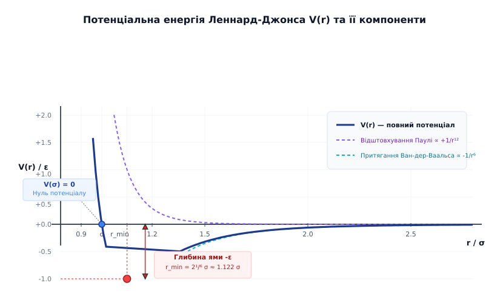
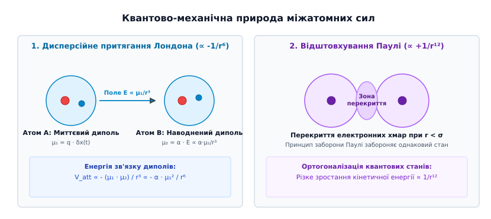
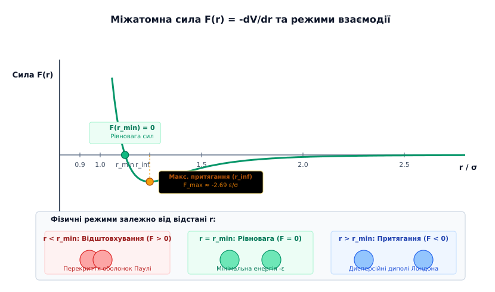
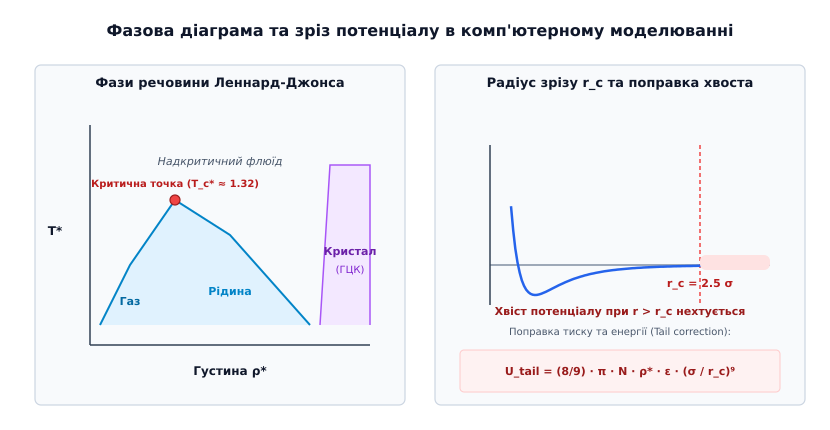

# Потенціал Леннард-Джонса

<preknowlist>
- [Рівняння Ван-дер-Ваальса](book:physics/thermodynamics/van-der-waals-equation) — врахування власного об'єму молекул та сил міжатомного притягання у неідеальних газах.
- [Принцип заборони Паулі](book:physics/quantum-mechanics/pauli-exclusion) — фундаментальне обмеження на одночасне перебування двох ферміонів в однаковому квантовому стані.
- [Пружна деформація](book:physics/condensed-matter-physics/elastic-deformation) — відновлювальні сили в твердому тілі та квазігармонічні коливання навколо рівноважного стану.
</preknowlist>

Нейтральні атоми інертних газів (такі як аргон, криптон чи ксенон) володіють повністю заповненими електронними оболонками і не утворюють ковалентних чи іонних хімічних зв'язків. Проте при зниженні температури ці речовини зкраплюються у рідини та кристалізуються у тверді тіла з характерною енергією зв'язку `E_b ≈ 0.08–0.16 еВ/атом`. Стабільність конденсованої фази неполярних частинок забезпечується тонким балансом між ефектами квантово-електродинамічного притягання на середніх відстанях та жорсткого квантово-механічного відштовхування електронних хмар при їх безпосередньому перекритті.

Потенціал Леннард-Джонса (також відомий як потенціал 12-6) є фундаментальною емпіричною моделлю, яка математично описує парну потенціальну енергію взаємодії `V(r)` між двома сферично симетричними нейтральними атомами як функцію відстані між їхніми центрами `r`:

```
V(r) = 4 · ε · [ (σ / r)¹² - (σ / r)⁶ ]
```

у цій формулі `ε` (грецька буква *епсилон*) визначає глибину потенційної ями (енергетичний масштаб взаємодії), а `σ` (грецька буква *сигма*) — характерний діаметр жорсткої сфери атома (відстань, на якій потенціал перетинає нуль `V(σ) = 0`). Докладно про те, як феноменологічний пошук неідеальних рівнянь стану Ван-дер-Ваальса та класична модель Густава Мі привели Джона Леннард-Джонса до вибору показників 12 і 6, а Фріц Лондон обґрунтував їх через квантову теорію збурень, розказано в [історії відкриття потенціалу Леннард-Джонса та теорії міжатомних сил](book:physics/condensed-matter-physics/lennard-jones-potential/hist-lennard-jones-potential.md).


*Графік потенціальної енергії Леннард-Джонса V(r) та її розклад на відштовхувальну (∝ +1/r¹²) і притягальну (∝ -1/r⁶) компоненти.*

## Мікроскопічна природа складових потенціалу

Математична форма потенціалу 12-6 складається з двох протилежно спрямованих доданків, кожен з яких має чітко визначену фізичну природу:

```
V(r) = V_rep(r) + V_att(r) = 4ε·(σ/r)¹² - 4ε·(σ/r)⁶
```

### 1. Дисперсійне притягання Лондона (Ван-дер-Ваальсові сили ∝ -1/r⁶)

Доданок `-4ε · (σ / r)⁶` описує дальнодіюче притягання між атомами. У нейтральному атомі інертного газу (наприклад, `Ar`) середня у часі конфігурація електронної хмари є строго сферично симетричною, тому постійний дипольний момент дорівнює нулю `⟨μ⟩ = 0`. Однак через квантово-механічні нульові флуктуації електронної густини в будь-який миттєвий момент часу `t` виникає асиметрія розподілу заряду, що породжує миттєвий дипольний момент `μ₁(t) = q · δx(t)`.

Миттєвий диполь першого атома створює у навколишньому просторі змінне електричне поле напруженістю `E ∝ μ₁ / r³`. Це поле діє на електронну хмару другого атома, розташованого на відстані `r`, викликаючи в ньому наводнений (індукований) дипольний момент:

```
μ₂(t) = α · E ∝ α · μ₁ / r³
```

де `α` — атомна поляризовуваність середовища (від латинського *polus* — полюс). Енергія кулонівської взаємодії між миттєвим та індукованим диполями є строго від'ємною (притягальною) і пропорційною добутку дипольних моментів, поділеному на куб відстані:

```
V_att(r) ∝ - (μ₁ · μ₂) / r³ ∝ - (α · μ₁²) / r⁶
```

Строге квантово-механічне виведення Фріца Лондона (1930) у другому порядку теорії збурень дає коефіцієнт притягання `C₆ = (3/2) · α² · I` (де `I` — потенціал іонізації атома). Оскільки флуктуації електронів двох атомів узгоджуються за фазою, сил притягання Лондона діють між абсолютно всіма атомами та молекулами, незалежно від їхньої хімічної природи чи наявності постійного диполя.


*Формування миттєвого диполя μ₁, наведення індукованого диполя μ₂ (ліворуч) та зона перекриття атомних оболонок під дією принципу заборони Паулі (праворуч).*

### 2. Відштовхування Паулі (Обмінне перекриття оболонок ∝ +1/r¹²)

Доданок `+4ε · (σ / r)¹²` описує потужне короткодіюче відштовхування, яке перешкоджає взаємному проникненню атомів та колапсу речовини. Коли відстань між ядрами зменшується до `r < σ`, зовніші електронні оболонки атомів починають суттєво перекриватися у просторі.

Згідно з принципом заборони Вольфганга Паулі (1925), два однакові ферміони (електрони з однаковими спіновими квантовими числами) не можуть одночасно займати один і той самий квантовий стан. При наближенні атомів їхні хвильові функції `Ψ_A` та `Ψ_B` змушені ортогоналізуватися:

```
⟨Ψ_A | Ψ_B⟩ = 0
```

Це змушує валентні електрони переходити у вищі, незаповнені енергетичні стани з більшою кількістю вузлових поверхонь. Збільшення просторової кривини хвильової функції підпорядковується рівнянню Шредінгера і призводить до різкого зростання кінетичної енергії електронів `E_kin ∝ ℏ² ∇²Ψ / 2m`. Одночасно посилюється кулонівське відштовхування між неповністю екранованими позитивними ядрами атомів.

Точний квантово-механічний розрахунок обмінної взаємодії (модель Борна — Маєра) дає експоненційну залежність відштовхування `V_rep(r) = A · exp(-B·r)`. Джон Леннард-Джонс замінив експоненту на степенний закон `1/r¹²` з чисто практичних міркувань: степенний показник `12` є точним квадратом показника `6` (`r¹² = (r⁶)²`). Це дозволяє обчислювальним алгоритмам розраховувати відштовхувальний член за одну операцію множення вже обчисленого значення `1/r⁶`, забезпечуючи колосальну екологію обчислювальних ресурсів при моделюванні мільйонів атомів.

## Аналітичні властивості: потенційна яма, сила та точка перегину

Графік потенціалу Леннард-Джонса має характерну асиметричну форму потенційної ями з крутим лівим бар'єром відштовхування та пологою правою гілкою притягання.


*Міжатомна сила F(r) = -dV/dr, точка стаціонарної рівноваги r_min (F = 0) та точка перегину r_inf з максимальною силою притягання.*

### 1. Характерні точки потенціальної кривої

Аналітичне дослідження функції `V(r)` визначає три ключові геометричні репери:
- **Нуль потенціалу `r_0 = σ`**: при `r = σ` потенціальна енергія перетинає вісь відстаней `V(σ) = 0`. При `r < σ` потенціал стрімко прямує до плюс нескінченності `V(r) → +∞`, утворюючи жорстку стінку (Hard Core).
- **Позиція мінімуму `r_min = 2¹/⁶ · σ ≈ 1.12246 · σ`**: перша похідна потенціалу по відстані дорівнює нулю `dV/dr|_{r_min} = 0`. У цій точці сила взаємодії повністю зникає `F(r_min) = 0`, а потенціальна енергія досягає мінімального значення:

```
V(r_min) = - ε
```

- **Точка перегину `r_inf = (26/7)¹/⁶ · σ ≈ 1.24445 · σ`**: друга похідна потенціалу дорівнює нулю `d²V/dr²|_{r_inf} = 0`. Ця точка відповідає максимуму сили притягання між атомами.

### 2. Залежність міжатомної сили від відстані

Просторова сила взаємодії `F(r)` визначається як від'ємний градієнт потенціальної енергії `F(r) = - dV / dr`:

```
F(r) = (24 · ε / σ) · [ 2 · (σ / r)¹³ - (σ / r)⁷ ]
```

Аналіз сили показує три чіткі фізичні режими:
1. **Режим відштовхування (`r < r_min`)**: `F(r) > 0`. Атоми відштовхуються один від одного, намагаючись відновити рівноважну відстань. При `r → 0` сила зростає як `1/r¹³`.
2. **Точка механічної рівноваги (`r = r_min`)**: `F(r_min) = 0`. Сумарна сила дорівнює нулю. Якщо атоми позбавлені кінетичної енергії, вони залишаються на цій відстані нескінченно довго.
3. **Режим притягання (`r > r_min`)**: `F(r) < 0`. Атоми притягуються один до одного. Сила досягає свого абсолютного максимуму за модулем у точці перегину `r_inf`:

```
|F_max| = |F(r_inf)| = |- (288 / 26) · (7 / 26)⁷/⁶| · (ε / σ) ≈ 2.396 · (ε / σ)
```

Величина `|F_max|` визначає теоретичну межу міцності міжатомного зв'язку на механічний розрив (Tensile Strength). Якщо прикладена зовнішня розтягувальна сила перевищує `|F_max|`, атоми неповоротно віддаляються один від одного, і зв'язок руйнується. При `r » σ` сила притягання згасає за законом `F(r) ∝ - 1/r⁷`.

Усі детальні математичні кроки диференціювання, підстановки безрозмірних змінних та пошуку екстремумів викладено у [математичному аналізі та термодинамічних виведеннях потенціалу Леннард-Джонса](book:physics/condensed-matter-physics/lennard-jones-potential/math-lennard-jones-derivation.md).

## Квазігармонічні коливання та термічні властивості конденсованого стану

Поблизу точки рівноваги `r = r_min` потенційну яму можна апроксимувати параболою (квазігармонічний осцилятор). Розкладаючи `V(r)` у ряд Тейлора за малим відхиленням `u = r - r_min`:

```
V(u) ≈ - ε + (1/2) · k_eff · u² - (1/6) · g_anharm · u³
```

де ефективний коефіцієнт жорсткості міжатомного зв'язку `k_eff` дорівнює другій похідній у мінімумі:

```
k_eff = d²V / dr²|_{r_min} = (72 / 2¹/³) · (ε / σ²) ≈ 57.146 · (ε / σ²)
```

### 1. Фонові коливання та динаміка кристалічної ґратки

У твердому стані атоми інертних газів здійснюють теплові коливання навколо вузлів кристалічної ґратки (фонони). Власна частота малих гармонічних коливань двохатомного димера з масою атома `m` становить:

```
ω_0 = √(k_eff / μ) = √( (144 / 2¹/³) · (ε / (m · σ²)) ) ≈ 10.69 · √(ε / (m · σ²))
```

Для аргону (`m = 39.95` а.о.м., `ε/k_B = 119.8 К`, `σ = 0.3405 нм`) характеристичний період коливань становить `τ_0 = 2π / ω_0 ≈ 2.15` пікосекунди, що визначає природний часовий крок при комп'ютерному моделюванні.

### 2. Ангармонічність та теплове розширення

Член третього порядку `g_anharm = - d³V/dr³|_{r_min} > 0` описує пологість потенційної ями праворуч від мінімуму та її крутизну ліворуч. При підвищенні температури `T` амплітуда коливань атомів зростає. Через асиметрію ями середня середня відстань між атомами `⟨r⟩` стає більшою за рівноважну відстань при нулі кельвінів `r_min`:

```
⟨u⟩ = ⟨r - r_min⟩ ≈ (3 / 2) · (g_anharm / k_eff²) · k_B · T > 0
```

Саме ангармонічність потенціалу Леннард-Джонса природно пояснює явище теплового розширення твердих тіл та рідин (лінійний коефіцієнт теплового розширення `α_T > 0`), а також відхилення теплоємності від класичного закону Дюлонга — Пті при високих температурах.

### 3. Кристалічна структура та енергія когезії

При низьких температурах інертні гази (за винятком гелію `He`, який залишається рідким через потужні квантові нульові коливання) кристалізуються у кубічну гранецентровану ґратку (ГЦК / FCC). 

Для розрахунку повної енергії когезії кристала (енергії зв'язку на один атом `u_coul`) необхідно підсумувати парні потенціали взаємодії даного атома з усіма іншими атомами ґратки:

```
u_coul = (1 / 2) · ∑_{j ≠ 0} V(r_0j) = 2·ε · [ A₁₂ · (σ / a)¹² - A₆ · (σ / a)⁶ ]
```

де `a` — період кристалічної ґратки, а `A₁₂` та `A₆` — решіткові суми Джонса — Інгама (Jones-Ingham lattice sums) для ГЦК-структури:

```
A₆ = ∑_{j ≠ 0} (1 / p_j⁶) ≈ 14.45392
A₁₂ = ∑_{j ≠ 0} (1 / p_j¹²) ≈ 12.13188
```

Мінімізація повної енергії по періоду ґратки `a` дає рівноважну сталу кристалічної ґратки `a_eq` та енергію когезії кристала при `T = 0 К`:

```
a_eq = (2 · A₁₂ / A₆)¹/⁶ · σ ≈ 1.0901 · σ
u_coul(a_eq) = - (A₆² / (2 · A₁₂)) · ε ≈ - 8.6102 · ε
```

Зауважте, що енергія зв'язку атома у кристалі (`-8.61 ε`) є значно більшою за глибину парної потенційної ями (`-1.0 ε`), оскільки кожен атом у ГЦК-ґратці має `12` найближчих сусідів першої координаційної сфери, а також взаємодіє з дальшими координаційними сферами.

## Закон відповідних станів та комп'ютерне моделювання

Особливою перевагою потенціалу 12-6 є його дворівнева універсальність. Якщо поділити всі фізичні величини на відповідні комбінації параметрів `ε` та `σ`, рівняння руху частинок та макроскопічні термодинамічні характеристики переходять у безрозмірну форму.

### 1. Безрозмірні одиниці Леннард-Джонса (LJ Reduced Units)

Система безрозмірних змінних задається наступними співвідношеннями:
- **Відстань**: `r* = r / σ`
- **Енергія**: `E* = E / ε`
- **Температура**: `T* = (k_B · T) / ε`
- **Густина**: `ρ* = ρ · σ³ = (N / V) · σ³`
- **Тиск**: `P* = (P · σ³) / ε`
- **Час**: `t* = t / τ`, де `τ = σ · √(m / ε)`

У цих безрозмірних одиницях потенціал набуває канонічного вигляду `V*(r*) = 4 [ (1/r*)¹² - (1/r*)⁶ ]`, який не містить жодного матеріального параметра! 

Це означає, що **усі речовини, які описуються потенціалом Леннард-Джонса, мають абсолютно однакову фазову діаграму у безрозмірних координатах `(T*, ρ*, P*)`** (закон відповідних станів). Знайшовши фазову діаграму для аргону, ми автоматично отримуємо фазову діаграму для криптону, ксенону чи метану шляхом простого масштабування координат на відповідні `ε` та `σ`.


*Фазова діаграма Леннард-Джонса у безрозмірних одиницях T*-ρ* (ліворуч) та зріз потенціалу на радіусі r_c з поправкою хвоста (праворуч).*

### 2. Фазові переходи флюїду Леннард-Джонса

Дослідження речовини Леннард-Джонса методом Монте-Карло та молекулярної динаміки дозволили встановити строгі координати її фазових переходів:
- **Критична точка (рідина — газ)**: `T_c* ≈ 1.312`, `ρ_c* ≈ 0.316`, `P_c* ≈ 0.128`.
- **Потрійна точка (газ — рідина — кристал)**: `T_tr* ≈ 0.694`, густина рідини `ρ_liq* ≈ 0.845`, густина кристала `ρ_sol* ≈ 0.962`.

Знаючи ці безрозмірні значення та параметри аргону (`ε/k_B = 119.8 К`, `σ = 0.3405 нм`), ми негайно отримуємо фізичні критичні параметри аргону: `T_c = 1.312 · 119.8 К ≈ 157.2 К`, що з високою точністю збігається з експериментом (`150.8 К`).

| Речовина | `σ` (нм) | `ε / k_B` (К) | `ε` (10⁻²¹ Дж) | Експериментальна `T_c` (К) |
| :--- | :--- | :--- | :--- | :--- |
| **Гелій (`⁴He`)** | 0.2556 | 10.22 | 0.141 | 5.2 |
| **Неон (`Ne`)** | 0.2749 | 35.60 | 0.492 | 44.4 |
| **Аргон (`Ar`)** | 0.3405 | 119.80 | 1.654 | 150.8 |
| **Криптон (`Kr`)** | 0.3650 | 171.00 | 2.361 | 209.4 |
| **Ксенон (`Xe`)** | 0.3980 | 221.00 | 3.051 | 289.7 |
| **Метан (`CH₄`)**| 0.3758 | 148.60 | 2.052 | 190.6 |

### 3. Радіус зрізу (Cutoff Radius) та поправки хвоста

При комп'ютерному моделюванні систем із великою кількістю частинок `N` прямий розрахунок парних сил вимагає `O(N²)` операцій на кожному часовому кроці. Оскільки лондонівське притягання `1/r⁶` стрімко згасає на великих відстанях, у чисельних алгоритмах застосовують сферичне відтинання потенціалу на радіусі зрізу `r_c`:

```
V_cut(r) = V(r) при r ≤ r_c;  V_cut(r) = 0 при r > r_c
```

Типовим стандартом є вибір `r_c = 2.5 · σ` або `r_c = 3.0 · σ`. При `r_c = 2.5σ` значення потенціалу становить лише `V(2.5σ) ≈ -0.0163 ε` (менше 1.6% від глибини ями).

Для усунення скачка потенціалу на межі зрізу використовують зміщений потенціал (Shifted Potential):

```
V_shifted(r) = V(r) - V(r_c)      [при r ≤ r_c]
```

Для компенсації нехтування взаємодією частинок при `r > r_c` до розрахованих макроскопічних величин додають аналітичні **поправки хвоста (Tail Corrections)**, вважаючи, що при `r > r_c` радіальна функція розподілу частинок `g(r) ≈ 1`:

```
U_tail = (8/9) · π · N · ρ* · ε · (σ / r_c)⁹
P_tail = (16/9) · π · (ρ*)² · (ε / σ³) · (σ / r_c)⁹
```

Повний алгоритм симуляції молекулярної динаміки за схемою Velocity Verlet, реалізований мовами C та C++, наведено у [моделюванні молекулярної динаміки аргону за потенціалом Леннард-Джонса](book:physics/condensed-matter-physics/lennard-jones-potential/proj-lennard-jones-md-sim.md).

> 🔧 **Навіщо це.**
> Потенціал Леннард-Джонса є «золотим стандартом» та головною обчислювальною конячкою сучасної молекулярної фізики, хімії та біоінформатики. Він використовується як базовий модуль розрахунку невалентних ван-дер-ваальсових взаємодій у провідних силових полях (CHARMM, AMBER, OPLS, GROMACS) для моделювання згортання білків, проникності мембран клітин, адсорбції газів у пористих металоорганічних каркасах (MOF) та конструювання нових ліків. Розуміння параметрів `ε` та `σ` дозволяє інженерам описувати теплофізичні властивості холодоагентів, в'язкість змащувальних масел та коефіцієнти дифузії в нанофлюїдних каналах без проведення дорогих натурних експериментів.

## Межі застосовності та сучасні модифікації

Незважаючи на колосальний успіх моделі 12-6, вона є наближеною феноменологічною схемою і має обмеження, які важливо враховувати при точних фізичних розрахунках:

1. **Занадто жорсткий бар'єр відштовхування**: Показник `n = 12` дає дещо стрімкіше зростання сили при надвисоких тисках (`P > 10` ГПа) порівняно з квантовою експонентою Борна — Маєра. Для усунення цього недоліку використовують **потенціал Батінгема (Buckingham potential)**:

```
V_Buckingham(r) = A · exp(-B·r) - (C / r⁶)
```

2. **Ізотропність взаємодії**: Потенціал Леннард-Джонса є строго сферично симетричним. Він ідеально описує інертні гази та сферичні молекули (наприклад, `CH₄`), але не здатен описувати напрямлені ковалентні зв'язки у кремнії чи вуглеці (де потрібні багаточастинкові потенціали Терсоффа або Стіллінгера — Вебера), а також делокалізований електронний газ у металах (де застосовують метод зануреного атома EAM).
3. **Неадитивність багаточастинкових сил**: У щільних середовищах притягання трьох атомів `A`, `B` і `C` не дорівнює точній сумі трьох парних потенціалів. Поправка Аксилрода — Теллера (Axilrod-Teller 3-body force) враховує потрійний дипольний ефект і становить до 10% енергії зв'язку в кристалічному ксеноні.

Попри ці обмеження, потенціал Леннард-Джонса залишається неперевершеним за балансом між фізичною точністю та обчислювальною швидкістю, утримуючи статус фундаментального містка між квантовою мікрофізикою атомів та макроскопічною термодинамікою речовини.
