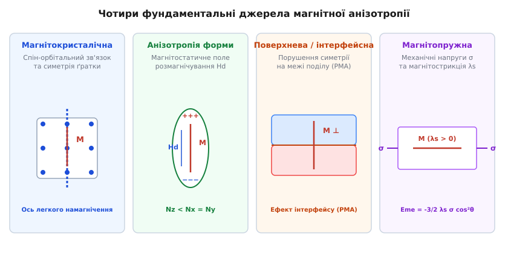
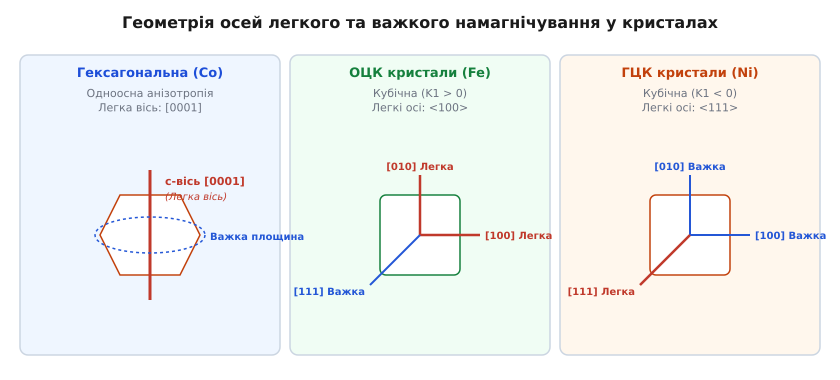
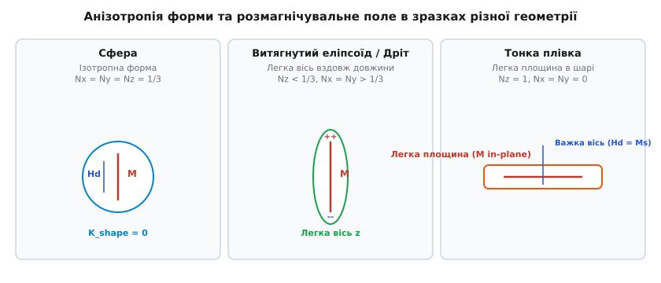
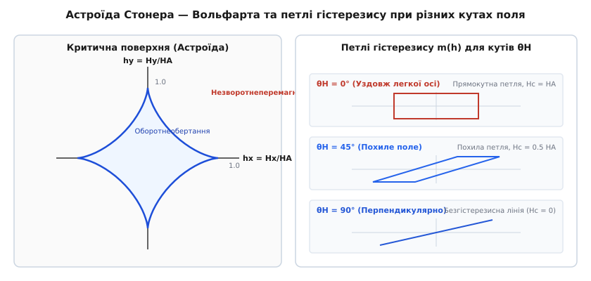

<preknowlist>
* [Феромагнетизм](topic:physics/ferromagnetism)
* [Магнітні домени](topic:physics/magnetic-domains)
</preknowlist>

# Магнітна анізотропія

Уявімо феромагнітний кристал, позбавлений будь-яких внутрішніх напрямків переважного впорядкування спінів. У такому гіпотетичному магнетику вектор макроскопічної намагніченості міг би вільно обертатися в будь-якому напрямку без жодних енергетичних витрат. Навіть найслабше зовнішнє магнітне поле або незначні теплові флуктуації миттєво розвертали б усі атомні магнітні моменти. У такому світі не існувало б постійних магнітів, здатних утримувати власне поле, не існувало б доменної структури, а створення енергонезалежної магнітної пам'яті чи жорстких дисків було б фізично неможливим.

У реальних конденсованих середовищах вектор намагніченості завжди пов'язаний із внутрішньою геометрією кристала або формою зразка. Ця фізична нееквівалентність напрямків намагнічування називається **магнітною анізотропією**. Енергія магнітної анізотропії створює потенціальні бар'єри, які фіксують вектор намагніченості вздовж чітко визначених кристалографічних або геометричних осей, які називаються **осями легкого намагнічування** (Easy Axes). Для розвороту намагніченості від легкої осі до **осі важкого намагнічування** (Hard Axis) необхідно виконати роботу проти внутрішніх полів анізотропії.

Історичний шлях відкриття фундаментальних механізмів анізотропії — від молекулярного поля П'єра Вейсса та експериментів Котаро Хонди до спін-орбітальної теорії Джонна Ван Флека та поверхневої анізотропії Луї Нееля — детально висвітлено у вставці [Історія магнітної анізотропії](topic:physics/magnetic-anisotropy/hist-magnetic-anisotropy.md).

За своїм фізичним походженням магнітна анізотропія поділяється на чотири фундаментальні категорії, які схематично представлені на малюнку 1.


*Рис. 1. Чотири фундаментальні механізми магнітної анізотропії в конденсованому стані: кристалографічна анізотропія ґратки, магнітостатична анізотропія форми, поверхнева/інтерфейсна анізотропія Нееля та магнітопружна анізотропія під дією деформацій.*

---

## 1. Магнітокристалічна анізотропія

Магнітокристалічна анізотропія виникає на мікроскопічному квантовомеханічному рівні завдяки взаємодії спінових магнітних моментів електронів із кристалічним полем ґратки. Пряма диполь-дипольна взаємодія між сусідніми спінами є занадто слабкою (вона дає внесок `~ 10³ Дж/м³`, що на кілька порядків менше за спостережувані константи анізотропії в багатьох матеріалах). Головним фізичним містком, який передає інформацію про симетрію кристалічної ґратки спіновій системі, є **спін-орбітальна взаємодія**.

Електрони у кристалі знаходяться у просторово анізотропних квантовомеханічних станах (`d`- та `f`-орбіталі). Електричне поле сусідніх іонів ґратки (кристалічне поле) розщеплює п'ятикратно вироджені d-орбіталі перехідного металу на дублет `e_g` (`d_z²`, `d_x²-y²`) та триплет `t_2g` (`d_xy`, `d_yz`, `d_xz`). Оскільки орбіталі `e_g` спрямовані вздовж осей кристала, а `t_2g` — між осями, електрони прагнуть зайняти стани з мінімальною кулонівською енергією відштовхування. Це орієнтує електронні хмари у строго визначених кристалографічних напрямках. Спін електрона зв'язаний з його орбітальним моментом імпульсу `L` через релятивістський спін-орбітальний оператор `H_so = ξ · (L · S)`. Оскільки орбітальний рух «прив'язаний» до ґратки кристалічним полем (явище часткового або повного заморожування орбітального моменту), спін через спін-орбітальний зв'язок відчуває анізотропію навколишнього середовища.

У 3d-перехідних металах (Fe, Co, Ni) орбітальний момент майже повністю заморожений кристалічним полем (`⟨L⟩ ≈ 0`), тому магнітокристалічна анізотропія виникає лише у другому порядку теорії збурень Ван Флека: `K_1 ∝ ξ² / ΔE`, де `ΔE` — енергетичний розщеп між d-зонами. У 4f-рідкісноземельних елементах (Nd, Sm, Dy) глибокі 4f-оболонки екрановані зовнішніми 5s- та 5p-електронами, тому орбітальний момент `L` не заморожений і безпосередньо взаємодіє з кристалічним градієнтом поля у першому порядку теорії збурень, що дає колосальні значення `K_1 ~ 10⁶ ... 10⁷ Дж/м³`.

### Одноосні кристали
У кристалах із нижчою симетрією — гексагональних (гексагональний кобальт `hcp Co`), тетрагональних (інтерметаліди `Nd_2 Fe_14 B`, `L1_0-FePt`) або ромбоедричних — існує одна виділена головна кристалографічна вісь (зазвичай вісь `c` або `[0001]`).

Густина енергії магнітокристалічної анізотропії `E_a` одноосного кристала феноменологічно розкладається в ряд за степенями синуса кута `θ` між вектором намагніченості `M` та головною віссю `c`:

```
E_a = K_1 · sin²(θ) + K_2 · sin⁴(θ) + K_3 · sin⁶(θ) + ...
```

де `K_1`, `K_2`, `K_3` — константи кристалічної анізотропії, що вимірюються в `Дж/м³` (у системі SI) або `ерг/см³` (у CGS).

Знак та співвідношення констант визначають конфігурацію осей легкого намагнічування:
1. **Легка вісь (Easy Axis):** Якщо `K_1 > 0` і `K_2 > -K_1`, мінімум енергії досягається при `sin(θ) = 0`, тобто при `θ = 0` або `θ = π`. Вектор намагніченості спонтанно орієнтується уздовж головної кристалографічної осі `[0001]`. Це має місце для кобальту при кімнатній температурі (`K_1 = +45 · 10⁴ Дж/м³`).
2. **Легка площина (Easy Plane):** Якщо `K_1 < 0` і `K_2 < |K_1|/2`, мінімум енергії відповідає `sin(θ) = 1`, тобто `θ = π/2`. Намагніченість може вільно обертатися всередині базисної площини кристала, а напрямок уздовж осі `c` є найважчим.
3. **Легкий конус (Easy Cone):** Якщо `K_1 < 0`, але `K_2 > |K_1|/2`, мінімум енергії досягається при куті `θ_0`, який задовольняє умові `sin²(θ_0) = - K_1 / (2 K_2)`. Вектор намагніченості утворює конус стійких станів навколо кристалографічної осі. Таке явище спостерігається, наприклад, у кобальті при підвищенні температури понад 518 K або в рідкісноземельному магніті `Nd_2 Fe_14 B` при охолодженні нижче 135 K.


*Рис. 2. Осі легкого та важкого намагнічування для гексагонального кобальту (одноосна анізотропія), ОЦК заліза (кубічна анізотропія з легкими осями <100>) та ГЦК нікелю (кубічна анізотропія з легкими осями <111>).*

### Кубічні кристали
У кубічних кристалах — об'ємноцентрованому залізі (`α-Fe`), гранецентрованому нікелі (`fcc Ni`), або шпінельних феритах (`Fe_3 O_4`) — трьом взаємно перпендикулярним ребрам куба відповідають напрямні косинуси вектора намагніченості `α_1 = cos(α)`, `α_2 = cos(β)`, `α_3 = cos(γ)` відносно осей `[100]`, `[010]`, `[001]`.

З огляду на кубічну симетрію (`α_1² + α_2² + α_3² = 1`), перші нетривіальні члени розкладу густини енергії анізотропії мають вигляд:

```
E_a = K_1 · (α_1² · α_2² + α_2² · α_3² + α_3² · α_1²) + K_2 · (α_1² · α_2² · α_3²) + ...
```

Фізичний характер кубічної анізотропії повністю визначається знаком першої константи `K_1`:
- **Залізо (α-Fe, bcc):** Константа `K_1 = +4.8 · 10⁴ Дж/м³ > 0`. Енергетичні мінімуми відповідають напрямкам, де один із косинусів дорівнює `±1`, а інші два — нулю. Отже, **осями легкого намагнічування є три ребра куба `<100>`**, а найважчими осями — просторові діагоналі куба `<111>`.
- **Нікель (Ni, fcc):** Константа `K_1 = -0.45 · 10⁴ Дж/м³ < 0`. Енергетичні мінімуми відповідають комбінаціям `α_1² = α_2² = α_3² = 1/3`. Отже, **осями легкого намагнічування нікелю є чотири просторові діагоналі куба `<111>`**, а найважчими осями — ребра куба `<100>`.

### Наведена анізотропія у комбінованих гетероструктурах
У тонких епітаксійних плівках кубічних металів на напівпровідникових підкладках (наприклад `Fe/GaAs(001)`) одночасно присутня як чотириразова кубічна анізотропія `K_c`, так і додаткова наведена одноосна анізотропія у площині `K_u` вздовж напрямку `[110]`. Густина енергії стає рівною:

```
E_a = (K_c / 4) · sin²(2φ) + K_u · sin²(φ - φ_0)
```

Співвідношення між `K_c` та `K_u` дозволяє гнучко керувати кутом між легкими осями в площині плівки, створюючи асиметричні стану з двома асиметричними потенціальними ямами для спінтроніки.

### Температурна залежність констант анізотропії
З підвищенням температури `T` теплові флуктуації спінів хаотизують їхні орієнтації, що призводить до спадання намагніченості насичення `M_s(T)`. Оскільки константи анізотропії залежать від високих порядків спінових кореляторів, вони спадають із температурою значно швидше за намагніченість.

Мікроскопічна теорія Зінера — Акулова описує цю залежність закон степеня:

```
K_l(T) / K_l(0) = [ M_s(T) / M_s(0) ]^(l(l+1)/2)
```

де `l` — порядок сферичної гармоніки. Для одноосної анізотропії (`l = 2`) показник степеня дорівнює 3 (`K_1(T) ∝ [M_s(T)]³`), а для кубічної анізотропії (`l = 4`) показник дорівнює 10 (`K_1(T) ∝ [M_s(T)]¹⁰`). Саме тому при нагріванні заліза або кобальту анізотропія зникає значно раніше за досягнення точки Кюрі.

### Обертальна магнітометрія (Torque Magnetometry)
Прямим експериментальним методом вимірювання констант магнітокристалічної анізотропії є обертальна магнітометрія. Зразок закріплюють на чутливому підвісі у сильному зовнішньому магнітному полі `H`, яке перевищує поле анізотропії `H_A`. Зовнішнє поле намагається утримати вектор `M` уздовж поля, а анізотропія кристала намагається розвернути його до легкої осі. Внаслідок цього виникає механічний обертальний момент `L(θ)`:

```
L(θ) = - ∂E_a / ∂θ
```

Для одноосного кристала обертальний момент дорівнює `L(θ) = - K_1 · sin(2θ) - (1/2) K_2 · sin(4θ)`. Гармонічний аналіз виміряної залежності `L(θ)` дозволяє з високою точністю розділити та обчислити константи `K_1` та `K_2`.

Аналітичні квантовомеханічні виведення констант `K_1` та `K_2` через теорію збурень спін-орбітальної взаємодії другого порядку представлено у вставці [Математичне виведення енергії анізотропії](topic:physics/magnetic-anisotropy/math-anisotropy-energy.md).

---

## 2. Анізотропія форми (Магнітостатична анізотропія)

На відміну від кристалографічної анізотропії, яка обумовлена спін-орбітальними мікроефектами на атомному рівні, анізотропія форми має **чисто макроскопічне магнітостатичне походження**. Вона описується класичною електродинамікою Максвелла і залежить виключно від геометричної зовнішньої форми феромагнітного тіла та величини намагніченості насичення `M_s`.

Коли феромагнітне тіло намагнічується, на його поверхні виникають фіктивні магнітні заряди з поверхневою густиною `σ_m = M · n`, де `n` — зовнішня нормаль до поверхні. Ці заряди створюють всередині зразка поле розмагнічування `H_d`, яке спрямоване протилежно до вектора намагніченості `M`:

```
H_d = - N · M
```

де `N` — безрозмірний симетричний тензор розмагнічувальних факторів (тензор Нееля — Стонера). Для тіл у формі еліпсоїдів обертання тензор `N` у власних осях є діагональним з елементами `N_x, N_y, N_z`, які задовольняють фундаментальній сумарній теоремі:

```
N_x + N_y + N_z = 1
```

Густина магнітостатичної енергії розмагнічування `E_d` виражається формулою:

```
E_d = - (1/2) · μ_0 · (M · H_d) = (1/2) · μ_0 · (N_x · M_x² + N_y · M_y² + N_z · M_z²)
```

або через напрямні косинуси `α_1, α_2, α_3`:

```
E_d = (1/2) · μ_0 · M_s² · (N_x · α_1² + N_y · α_2² + N_z · α_3²)
```


*Рис. 3. Поля розмагнічування та розмагнічувальні фактори N для трьох канонічних геометрій: ідеальної сфери (ізотропна), витягнутого сфероїда/дроту (легка вісь уздовж довжини) та тонкої плівки (легка площина в поверхні).*

Розглянемо три граничні геометричні випадки, показані на малюнку 3:

1. **Ідеальна сфера (`a = b = c`):**
   Симетрія сфери вимагає `N_x = N_y = N_z = 1/3`. Густина енергії розмагнічування `E_d = (1/6) · μ_0 · M_s²` є абсолютно константною і не залежить від напрямку вектора `M`. **У сферичних зразках анізотропія форми відсутня.**

2. **Витягнутий еліпсоїд / Магнітна голка чи дріт (`c >> a = b`):**
   Уздовж довгої осі `z` поверхневі заряди віддалені на велику відстань, тому розмагнічувальний фактор вздовж осі `N_z → 0`, тоді як у поперечному напрямку `N_x = N_y → 1/2`.
   Густина енергії стає рівною `E_d = (1/4) · μ_0 · M_s² · (α_1² + α_2²) = (1/4) · μ_0 · M_s² · sin²(θ)`.
   Це еквівалентно одноосній анізотропії з константою анізотропії форми:
   
   ```
   K_shape = (1/2) · μ_0 · M_s² · (N_x - N_z) > 0
   ```
   
   Магнітна голка спонтанно намагнічується вздовж своєї довгої осі. Для заліза (`μ_0 M_s = 2.15 Тл`) константа анізотропії форми голки досягає `K_shape ≈ 4.6 · 10⁵ Дж/м³`, що майже на порядок перевищує його власну кристалографічну анізотропію.

3. **Тонка плоска плівка (`a = b >> c`):**
   Для нескінченної плоскої плівки у площині `xy` розмагнічувальні фактори дорівнюють `N_x = N_y = 0`, а вздовж нормалі `z` фактор `N_z = 1`.
   Густина енергії розмагнічування:
   
   ```
   E_d = (1/2) · μ_0 · M_s² · cos²(θ) = (1/2) · μ_0 · M_s² · (1 - sin²(θ))
   ```
   
   Поле розмагнічування створює потужний бар'єр `K_shape = - (1/2) · μ_0 · M_s²`, який примушує вектор намагніченості лежати у площині плівки.

### Межі застосування анізотропії форми та обмінна довжина
Формули розмагнічування на основі тензора `N` справедливі лише тоді, коли вектор намагніченості є просторово однорідним по всьому об'єму зразка. Якщо геометричний розмір зразка `d` стає меншим за фундаментальну **обмінну довжину `l_ex = √(2A / (μ_0 M_s²))`** (типово 3–5 нм), квантова обмінна взаємодія жорстко зв'язує сусідні спіни, запобігаючи нескінченним розмагнічувальним локальним текстурам і роблячи однорідне поле розмагнічування строго точним.

Точні табличні значення розмагнічувальних факторів для циліндрів, кубів та сфероїдів наведено в [Довіднику констант анізотропії](topic:physics/magnetic-anisotropy/api-anisotropy-constants.md).

---

## 3. Поверхнева (Інтерфейсна) та Магнітопружна анізотропія

### Поверхнева анізотропія Нееля (PMA)
На поверхні кристала або на гетеромежі між двома різними матеріалами (наприклад, у наноструктурах `Co/Pt`, `Fe/MgO`, `CoFeB/MgO`) порушується просторова трансляційна симетрія ґратки. Поверхневі атоми мають зменшене координаційне число, а їхні електронні хмари зазнають одностороннього хімічного зв'язку.

Луї Неель у 1954 році передбачив, що це порушення симетрії індукує додаткову **поверхневу густину енергії анізотропії** `E_s`, яка вимірюється у `Дж/м²` або `мДж/м²`:

```
E_s = K_s · sin²(θ)
```

де `K_s` — поверхнева константа Нееля, а `θ` — кут відносно нормалі до поверхні.

Для тонкої феромагнітної плівки товщиною `t` з двома інтерфейсами загальна ефективна константа анізотропії `K_eff` об'єднує об'ємну кристалографічну анізотропію `K_v`, розмагнічування форми `-(1/2) μ_0 M_s²` та поверхневий внесок `K_s`:

```
K_eff = K_v - (1/2) · μ_0 · M_s² + (2 · K_s) / t
```

Якщо поверхнева константа є позитивною (`K_s > 0`), анізотропія Нееля намагається спрямувати вектор намагніченості перпендикулярно до поверхні плівки. При зменшенні товщини плівки нижче **критичної товщини `t_c`**:

```
t_c = (4 · K_s) / (μ_0 · M_s² - 2 · K_v)
```

поверхневий член `(2 K_s) / t` перевищує розмагнічувальне поле плівки. Відбувається спін-реорієнтаційний перехід, і намагніченість спонтанно розвертається перпендикулярно до площини плівки. Це явище отримало назву **Перпендикулярна магнітна анізотропія (Perpendicular Magnetic Anisotropy, PMA)**.

### Інтерфейсна взаємодія Дзялошинського — Морія (DMI)
На межі поділу між феромагнетиком та важким металом із сильним спін-орбітальним зв'язком (Pt, Ta, W) відсутність інверсійної симетрії генерує неізотропну антисиметричну обмінну взаємодію Дзялошинського — Морія:

```
E_DMI = D · (m_1 × m_2)
```

де `D` — вектор Дзялошинського. Ця несиметрична анізотропія надає перевагу визначеній киральності розвороту спінів, стабілізуючи лівозакручені 180° доменні стінки Нееля та магнітні скірміони.

### Обмінне зсунення (Exchange Bias)
При контактуванні феромагнетика (FM) з антиферомагнетиком (AFM) та охолодженні системи у зовнішньому магнітному полі нижче температури Нееля `T_N` виникає поверхнева односпрямована анізотропія (Exchange Bias). Спіни антиферомагнетика на гетеромежі запікаються у визначеному напрямку і створюють ефективне поле `H_eb = J_eb / (μ_0 M_s t_FM)`, яке зміщує петлю гістерезису вздовж осі полів. Це явище є критично важливим для фіксації опорного магнітного шару у зчитувальних головках та спінових клапанах.

### Магнітопружна анізотропія (Ефект Вілларі)
При прикладанні до магнетика зовнішніх механічних напружень (стиску або розтягу з тензором напружень `σ`) міжатомні відстані в кристалічній ґратці змінюються. Це деформує електронні орбіталі і змінює спін-орбітальний зв'язок, індукуючи **магнітопружну анізотропію**.

Для ізотропного або полікристалічного матеріалу з константою насичення магнітострикції `λ_s` густина магнітопружної енергії при одноосному механічному напруженні `σ` дорівнює:

```
E_me = - (3/2) · λ_s · σ · cos²(θ)
```

де `θ` — кут між вектором намагніченості `M` та напрямком одноосного напруження `σ`.

Знак продукту `λ_s · σ` визначає характер деформаційної анізотропії:
- Якщо `λ_s · σ > 0` (наприклад, розтяг `σ > 0` матеріалу з позитивною магнітострикцією `λ_s > 0`), вісь розтягу стає **легкою віссю намагнічування**.
- Якщо `λ_s · σ < 0` (наприклад, стиск `σ < 0` або матеріал із негативною магнітострикцією `λ_s < 0`, як чистий нікель), вісь прикладання сили стає **важкою віссю**, а вектор `M` вкладається у перпендикулярну площину.

У сучасних гігантських магнітострикційних сплавах, таких як **Терфенол-Д (Tb₀.₂₇Dy₀.₇₃Fe₂)** (`λ_s ≈ +1200 · 10⁻⁶`), механічне напруження може створювати поля анізотропії величиною в кілька Тесла.

---

## 4. Модель однорідного обертання Стонера — Вольфарта та анізотропна астроїда

Для опису процесів перемагнічування монодоменних наночастинок (розмір яких менший за обмінну довжину `l_ex = √(2A / (μ_0 M_s²))`) Едмунд Стонер та Малкольм Вольфарт у 1948 році запропонували концепцію **когерентного (однорідного) обертання**. У цій моделі всі спіни всередині наночастинки обертаються строго паралельно як єдиний макроскопічний магнітний момент.

Розглянемо частинку з одноосною константою анізотропії `K`, що перебуває у зовнішньому магнітному полі `H`, яке прикладене під кутом `φ` до легкої осі. Загальна густина енергії частинки дорівнює сумі енергії анізотропії та Зеєманівської енергії у зовнішньому полі:

```
E(θ) = K · sin²(θ) - μ_0 · M_s · H · cos(θ - φ)
```

Увівши безрозмірне поле `h = H / H_A`, де `H_A = (2 K) / (μ_0 M_s)` — ефективне поле анізотропії, нормована густина енергії набуває вигляду:

```
e(θ) = E(θ) / (2 K) = (1/2) · sin²(θ) - h · cos(θ - φ)
```

Стійкі стани намагніченості відповідають мінімуму енергії (`∂e/∂θ = 0`, `∂²e/∂θ² > 0`).


*Рис. 4. Крива анізотропної астроїди Стонера — Вольфарта у координатах (h_x, h_z) та розраховані петлі гістерезису M(H) для трьох характерних кутів прикладання зовнішнього поля (0°, 45°, 90°).*

Граничний стан втрати стійкості (точка перегину потенційної енергії) визначається одночасною рівністю нулю першої та другої похідних:

```
∂e / ∂θ = (1/2) · sin(2θ) - h_x · cos(θ) + h_z · sin(θ) = 0
∂²e / ∂θ² = cos(2θ) + h_x · sin(θ) + h_z · cos(θ) = 0
```

Розв'язок цієї системи у компонентах полів `h_z = h · cos(φ)` (вздовж легкої осі) та `h_x = h · sin(φ)` (перпендикулярно до легкої осі) дає виражену аналітичну геометричну криву — **астроїду Стонера — Вольфарта**:

```
(h_x)^(2/3) + (h_z)^(2/3) = 1
```

Астроїда Стонера — Вольфарта (рис. 4) наочно описує критичну поверхню перемагнічування:
1. **Всередині астроїди:** Система має два енергетичні мінімуми, що відповідають двом стійким напрямкам намагніченості (двостабільний стан, який зберігає 1 біт інформації).
2. **Поза астроїдою:** Існує лише один енергетичний мінімум — намагніченість однозначно орієнтується зовнішнім полем.
3. **При перетині межі астроїди:** Один із мінімумів зникає, і відбувається незворотній стрибок намагніченості (нестабільність Стонера — Вольфарта).

Форма петлі гістерезису `M(H)` суттєво залежить від кута `φ`:
- **Паралельне поле (`φ = 0°`):** Петля гістерезису є строго прямокутною з коерцитивною силою `H_c = H_A = (2 K) / (μ_0 M_s)` та 100% залишковою намагніченістю.
- **Перпендикулярне поле (`φ = 90°`):** Гістерезис повністю відсутній (`H_c = 0`). Намагніченість лінійно розвертається від `M_z = M_s` до `M_z = 0` при досягненні поля насичення `H = H_A`.
- **Похиле поле (`φ = 45°`):** Крива демонструє похилий гістерезисний перехід зі зменшеною коерцитивною силою `H_c = (1/2) H_A`.

Детальний чисельний C++ та Python код моделювання астроїди та інтегрування динамічного рівняння Ландау — Ліфшиця — Гільберта (LLG) наведено у вставці [Чисельне моделювання анізотропії](topic:physics/magnetic-anisotropy/proj-anisotropy-simulation.md).

---

## 5. Вплив анізотропії на мікроструктуру: Доменні стінки та Суперпарамагнетизм

### Ширина та енергія доменних стінок
У макроскопічних магнетиках для мінімізації магнітостатичної енергії розмагнічування кристал розпадається на магнітні домени. Структура та розмір межі між доменами (доменної стінки Блоха або Нееля) визначаються жорсткою конкуруючою боротьбою між квантовим обмінним зв'язком та магнітною анізотропією:
- **Обмінна взаємодія** прагне розтягнути доменну стінку на якомога більшу кількість атомних площин, роблячи кут між сусідніми спінами `Δθ → 0`, щоб мінімізувати енергію `E_ex = A · (∇m)²`.
- **Магнітна анізотропія** прагне стиснути доменну стінку до мінімальної товщини, щоб якомога менша кількість спінів відхилялася від енергетично вигідної легкої осі.

Точний варіаційний розрахунок профілю 180-градусної доменної стінки Блоха дає аналітичні вирази для її **ефективної товщини `δ`** та **поверхневої густини енергії `γ_w`**:

```
δ = π · √( A / K_eff )
γ_w = 4 · √( A · K_eff )
```

де `A` — константа обміну (вимірюється в `ПДж/м`), а `K_eff` — ефективна константа одноосної анізотропії.

Порівняння двох крайніх класів матеріалів наочно ілюструє роль анізотропії:
1. **Магнітом'які матеріали (Залізо, Пермаллой):** Завдяки помірній анізотропії (`K_1 ≈ 4.8 · 10⁴ Дж/м³`) та високому обміну (`A ≈ 2Shared pJ/m`) товщина доменної стінки Блоха є широкою і становить `δ ≈ 40 нм` (понад 150 атомних площин), а енергія стінки відносно мала: `γ_w ≈ 1.5 мДж/м²`.
2. **Магнітожорсткі рідкісноземельні матеріали (`Nd_2 Fe_14 B`):** Колосальна анізотропія (`K_1 ≈ 4.3 · 10⁶ Дж/м³`) стискає доменну стінку до надзвичайно малого масштабу: `δ ≈ 2.4 нм` (всього 6-8 атомних площин), тоді як енергія стінки зростає до `γ_w ≈ 35 мДж/м²`.

### Парадокс Брауна та формули Крона-Мюллера
У той час як теорія Стонера — Вольфарта передбачає коерцитивну силу `H_c = H_A = 2 K_1 / (μ_0 M_s)` (що для `Nd_2 Fe_14 B` становить понад 8 Тл), у реальних полікристалічних магнітах коерцитивна сила виявляється у 3-4 рази меншою (`H_c ≈ 1.5 ... 2 Тл`). Це розходження носить назву **парадоксу Брауна**.

Гельмут Кронмюллер пояснив парадокс Брауна за допомогою формули феноменологічного врахування мікроструктурних дефектів:

```
H_c = α_k · H_A - N_eff · M_s
```

де `α_k < 1` — коефіцієнт зниження бар'єру зародкоутворення доменів на межах зерен, а `N_eff` — ефективний локальний розмагнічувальний фактор на гострих дефектах мікроструктури.

### Суперпарамагнітна межа у наночастинках
Для ізольованої монодоменної частинки об'ємом `V` потенціальний енергетичний бар'єр, який необхідно подолати для перевороту вектора намагніченості між двома протилежними напрямками легкої осі, дорівнює:

```
ΔE = K_eff · V
```

За наявності кінцевої температури `T` теплові флуктуації кристалічної ґратки викликають терморелаксацію намагніченості. Середній час термічної релаксації спінів описується формулою Нееля — Арреніуса:

```
τ = τ_0 · exp( (K_eff · V) / (k_B · T) )
```

де `τ_0 ~ 10⁻⁹ ... 10⁻¹⁰ с` — характерний час спроб прецесії, а `k_B` — константа Больцмана.

Якщо об'єм частинки `V` зменшується настільки, що виконується умова `K_eff · V < 25 · k_B T`, час релаксації `τ` стає меншим за час вимірювання (зазвичай `t_meas ≈ 100 с`). Спостерігач фіксує хаотичні спонтанні термофлуктуації вектора намагніченості, внаслідок чого середня за часом залишкова намагніченість зникає. Наночастинка переходить у **суперпарамагнітний стан**.

Для забезпечення 10-річної термічної стабільності збереження даних у комерційних мікросхемах пам'яті вимагається безрозмірний бар'єр стабільності `Δ = (K_eff · V) / (k_B T) ≥ 60`.

Суперпарамагнетизм створює фундаментальний **суперпарамагнітний ліміт** для носіїв магнітного запису: при зменшенні розміру зерна менше 8-10 нм записана інформація самовільно стирається тепловим рухом протягом кількох місяців. Єдиним фізичним шляхом подолання цього ліміту є перехід до матеріалів із рекордними значеннями константи анізотропії `K_1 > 5 · 10⁶ Дж/м³` (таких як впорядкована фаза `L1_0-FePt`).

---

## 6. Технологічні застосування та сучасна спінтроніка

Магнітна анізотропія перетворилася з теоретичної концепції фізики твердого тіла на головний інструмент проектування новітніх приладів мікроелектроніки, нанотехнологій та енергетики.

### 1. Елементи пам'яті STT-MRAM та SOT-MRAM
У сучасних комірках енергонезалежної магнітомагнітної пам'яті з перемиканням спіновим струмом (Spin-Transfer Torque MRAM, STT-MRAM) базовим елементом є магнітний тунельний перехід (MTJ). Перехід складається з двох феромагнітних шарів `CoFeB`, розділених тонким діелектричним тунельним бар'єром `MgO` товщиною 1 нм.

Завдяки поверхневій анізотропії Нееля на гетеромежах `CoFeB/MgO` обидва шари володіють перпендикулярною магнітною анізотропією (PMA). Застосування PMA замість планарної анізотропії дозволило вирішити дві головні суперечності наноелектроніки:
- Забезпечити високу термічну стабільність `Δ = (K_eff V) / (k_B T) ≥ 60` для надійного зберігання даних протягом 10 років при діаметрі осередку менше 20 нм.
- Знизити критичний струм перемикання `I_c0 ∝ (α e / ℏ) · M_s V H_k / η`, оскільки при PMA відсутній розмагнічувальний член `4π M_s` у критичному полі перемикання.

У перспективних комірках SOT-MRAM (Spin-Orbit Torque MRAM) перемикання здійснюється спін-орбітальним моментом від прилеглого шару важкого металу (Pt або W), де сильний поверхневий зв'язок та взаємодія Дзялошинського — Морія стабілізують незбурене швидкодіюче перемагнічування за часи `< 1 нс`.

### 2. Вольт-контрольована магнітна анізотропія (VCMA-MRAM)
Технологія VCMA (Voltage-Controlled Magnetic Anisotropy) використовує накопичення електричного заряду на гетеромежі `Fe/MgO` при прикладанні електричного поля `E`. Електричне поле зміщує рівень Фермі та змінює заповнення d-орбіталей атомів заліза, модулюючи поверхневу константу `K_s` на 30–50%. Це дозволяє перемикати вектор намагніченості імпульсом напруги без проходження електричного струму, знижуючи енергоспоживання пам'яті до декількох фемтоджоулів на біт.

### 3. Термомагнітний запис на жорстких дисках (HAMR)
У носіях термомагнітного запису (Heat-Assisted Magnetic Recording, HAMR) інформаційні комірки виготовляють із нанозернистих плівок `L1_0-FePt` з гігантською анізотропією (`K_1 ≈ 6.6 · 10⁶ Дж/м³` та `μ_0 H_A ≈ 10 Тл`). При кімнатній температурі такі зерна неможливо перемагнітити навіть найпотужнішими магнітними головками.

Під час запису лазерний промінь через плазмонний антенний підсилювач локально нагріває зерно `FePt` до температури, близької до точки Кюрі (`T_C ≈ 750 K`). Відповідно до закону Зінера — Акулова (`K_1(T) ∝ [M_s(T)]¹⁰`), константа анізотропії при нагріванні падає практично до нуля, що дозволяє записати біт слабким полем магнітної головки (`~ 0.8 Тл`). При охолодженні за долі наносекунди анізотропія відновлюється, надійно заморожуючи записаний стан.

### 4. Анізотропія у двовимірних (2D) Ван-дер-Ваальсівських магнетиках
Відповідно до теореми Мерміна — Вагнера, ідеальна двовимірна флуктуаційна система з ізотропним короткосяжним Гейзенбергівським обміном не може мати довгосяжного магнітного порядку при `T > 0 K`. Відкриття двовимірних феромагнетиків у 2017 році (моношари `CrI_3` та `Fe_3 GeTe_2`) стало можливим виключно завдяки наявності сильної одновісної магнітокристалічної анізотропії `K_1 ~ 10⁵ ... 10⁶ Дж/м³`. Магнітна анізотропія відкриває спектральну щілину у магнонному спектрі, пригнічуючи довжинохвильові спінові флуктуації та стабілізуючи 2D-магнетизм при скінченних температурах.

### 5. Анізотропія в антиферомагнітній спінтроніці (AFM Spintronics)
В антиферомагнетиках (наприклад `Mn_2 Au`, `CuMnAs`) макроскопічна намагніченість дорівнює нулю (`M_s = 0`), однак вектор Нееля `L = M_1 - M_2` має чітку магнітокристалічну анізотропію відносно осей кристала. Оскільки перемагнічування вектора Нееля керується потужним внутрішнім обмінним полем `H_E ~ 1000 Тл`, частота антиферомагнітного резонансу виражається як `f_AFMR = (γ / 2π) · √(2 H_E H_A)` і лежить у терагерцовому діапазоні (`10¹² Гц`). Це дозволяє створювати надшвидкодіючі терагерцові спінтронічні генератори та логічні елементи.

### 6. Високоенергетичні постійні магніти
Виробництво потужних постійних магнітів для роторів електродвигунів, вітрогенераторів та тягових приводів повністю базується на одноосній анізотропії рідкісноземельних сполук `Nd_2 Fe_14 B` (`μ_0 H_A = 8.4 Тл`) та `SmCo_5` (`μ_0 H_A = 32 Тл`). Низькосиметрична кристалічна ґратка та потужний спін-орбітальний зв'язок 4f-електронів неодиму та самарію створюють колосальний коерцитивний запірний бар'єр, що запобігає розмагнічуванню під дією сильних протиполів.

Характеристики констант анізотропії, полів та термодинамічних параметрів усіх описаних матеріалів зібрано у [Довіднику констант анізотропії](topic:physics/magnetic-anisotropy/api-anisotropy-constants.md).

---

## 7. Підсумковий синтез

Магнітна анізотропія є результатом фундаментального змагання між квантовомеханічною спін-орбітальною взаємодією на мікроскопічному рівні та макроскопічними розмагнічувальними полями Maxwell-івської електродинаміки. Вона виступає головним регулятором магнітного стану речовини, що визначає:
- Орієнтацію та кількість осей легкого намагнічування в кристалах різної симетрії;
- Геометричні масштаби мікроструктури: товщину доменних стінок `δ` та поверхневу енергію межі `γ_w`;
- Термодинамічну стабільність наночастинок та суперпарамагнітну межу зберігання інформації;
- Динаміку перемагнічування та коерцитивну силу через межеву криву астроїди Стонера — Вольфарта.

Можливість штучно конструювати анізотропію на атомному рівні шляхом створення гетероструктур із перпендикулярною поверхневою анізотропією Нееля відкрила нову еру наномагнетизму, перетворивши магнітну анізотропію на ключовий фундамент сучасної спінтроніки та квантових матеріалів. Багатогранні фізичні ефекти анізотропії продовжують розширювати межі сучасного матеріалознавства, об'єднуючи концепції квантової механіки, кристалографії та термодинаміки.
