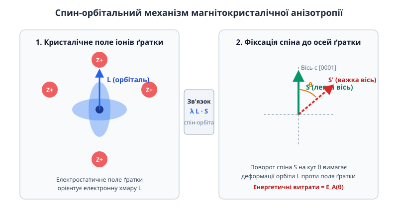
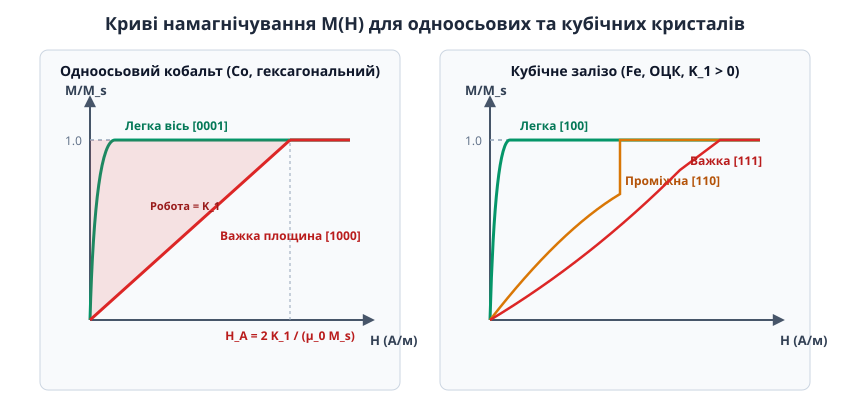
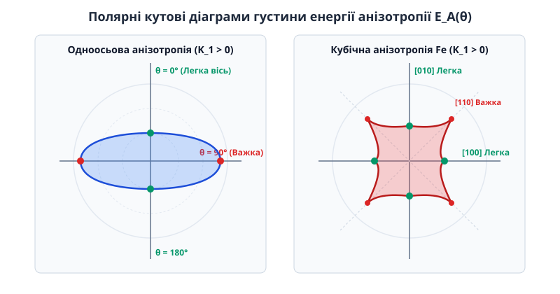
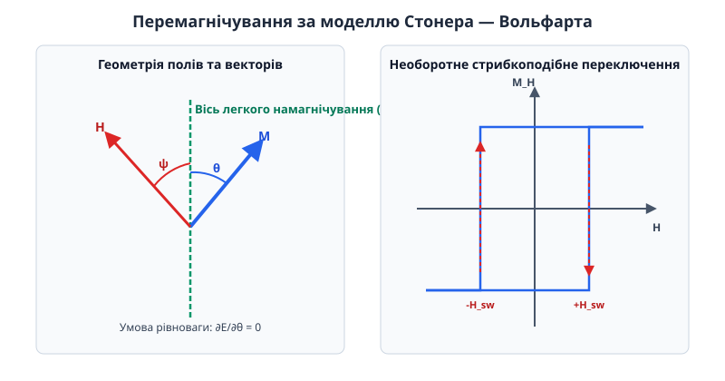

# Магнітокристалічна анізотропія

<preknowlist>
- [Спін електрона](topic:physics/electron-spin) — власний квантовий момент імпульсу електрона, що створює атомарний магнітний момент.
- [Феромагнетизм](topic:physics/ferromagnetism) — спонтанне впорядкування атомарних магнітних моментів у макроскопічних доменах нижче температури Кюрі.
- [Обмінна взаємодія](topic:physics/exchange-interaction) — квантово-механічна електростатична взаємодія, що вирівнює сусідні спіни паралельно один до одного.
</preknowlist>

Якщо помістити монокристал чистого заліза у слабке зовнішнє магнітне поле, його магнітна поведінка виявиться кардинально різною залежно від того, як орієнтований кристал відносно силових ліній поля. Намагнічування уздовж ребра кубічної ґратки `[100]` досягає повного насичення у слабкому полі напруженістю менше ніж `2 кА/м`. Проте, якщо повернути той самий кристал і прикласти поле уздовж його просторової діагоналі `[111]`, для досягнення того самого стану насичення знадобиться поле напруженістю понад `45 кА/м`. При цьому фундаментальні атомарні магнітні моменти іонів заліза в обох випадках абсолютно однакові, а температура й об'єм зразка не змінюються.

Ця фундаментальна нееквівалентність напрямків називається **магнітокристалічною анізотропією** (від грецького *ἀν-* — не, *ἴσος* — рівний, та *τρόπος* — напрямок, спосіб). Вона являє собою внутрішню властивість кристалічного феромагнетика, через яку вектор макроскопічної намагніченості утворює енергетично вигідні орієнтації уздовж чітко визначених кристалографічних осей. Цей ефект не є дрібною поправкою: саме магнітокристалічна анізотропія визначає коерцитивну силу постійних магнітів у двигунах електромобілів, межу щільності запису на жорстких дисках та енергоефективність силових трансформаторів високої частоти.

## Парадокс нееквівалентних осей та тупик класичної фізики

Щоб зрозуміти, чому виникає магнітокристалічна анізотропія, необхідно спочатку розібратися, чому її неможливо пояснити за допомогою найочевидніших магнітних сил.

У будь-якому феромагнетику головною силою, яка змушує трильйони електронних спінів вирівнюватися паралельно й створювати макроскопічну намагніченість, є [обмінна взаємодія](topic:physics/exchange-interaction). Вона має суто квантово-механічне електростатичне походження і описується гамільтоніаном Гейзенберга:

```
H_обмін = - 2 · J · ∑ (S_i · S_j)
```

де `J` — обмінний інтеграл між суміжними спінами `S_i` та `S_j`. 

Зверніть увагу на математичний вираз для обмінної взаємодії: вона залежить виключно від **скалярного добутку** двох спінових векторів. Це означає, що обмінна енергія визначається лише **кутом між спінами**, але абсолютно не чутлива до того, як ця пара спінів орієнтована відносно просторових осей кристала. Якщо повернути увесь масив взаємопов'язаних спінів як єдине ціле на будь-який кут відносно атомної ґратки, обмінна енергія системи не зміниться жодним чином. Обмінна взаємодія створює феромагнітний порядок, але вона є строго ізотропною і не здатна вибрати переважний напрямок у кристалі.

Другим кандидатом на роль джерела анізотропії в класичній фізиці є пряма магнітна диполь-дипольна взаємодія між атомарними магнітними моментами. Проте прямий розрахунок показує невідповідність двох типів:

1. **Симетрійна компенсація.** У строго кубічній ґратці (наприклад, об'ємноцентрованій кубічній ґратці заліза ОЦК чи гранецентрованій ГЦК нікелю) сумарне магнітне диполь-дипольне поле, що діє на кожен окремий атом з боку всіх інших сферично симетричних шарів кристала, дорівнює **строго нулю**.
2. **Енергетична мізерність.** У кристалах нижчої симетрії (наприклад, гексагональних) диполь-дипольна взаємодія не компенсаційна, але її густина енергії не перевищує `10² - 10³ Дж/м³`. Це у сотні та тисячі разів менше за експериментально спостережувану енергію анізотропії у залізі (`4.8×10⁴ Дж/м³`), кобальті (`4.1×10⁵ Дж/м³`) чи сполуці `Nd₂Fe₁₄B` (`4.9×10⁶ Дж/м³`).

Виникає фундаментальний парадокс: спіни електронів формують потужну намагніченість завдяки обмінній взаємодії, але самі по собі «не знають», де знаходяться атоми кристалічної ґратки. З іншого боку, позитивні іони ґратки утворюють жорстку просторову структуру, але не мають власного макроскопічного магнітного моменту. Який механізм слугує «містом» або «передавальним пасом», що жорстко зв'язує вектор спінової намагніченості з фізичними осями кристалографічної ґратки?

### Магнітокристалічна анізотропія та мікроструктура доменних меж

Магнітокристалічна анізотропія відіграє вирішальну роль у формуванні внутрішньої доменної структури феромагнетиків. Усередині доменної стінки (межі Блоха чи Неєля) спинові вектори мусять плавно повертатися від орієнтації одного домену до орієнтації сусіднього.

Цей поворот вимагає компромісу між двома конкуруючими енергіями:
- **Обмінна енергія** намагається зробити доменну стінку якомога ширшою, щоб кут повороту між кожною парою сусідніх спінів був мінімальним.
- **Енергія анізотропії** `K₁`, навпаки, намагається стиснути доменну стінку до мінімальної товщини, оскільки спіни всередині стінки відхиляються від легких осей і накопичують енергетичний штраф `E_A`.

Точний варіаційний розрахунок дає фундаментальні формули для товщини доменної стінки `δ_w` та її поверхневої енергії `σ_w`:

```
δ_w = π · √(A / K₁)       [товщина доменної стінки]
σ_w = 4 · √(A · K₁)      [поверхнева енергія доменної стінки]
```

де `A` — параметричний коефіцієнт обмінної жорсткості (`Дж/м`). Для заліза (`A ≈ 2×10⁻¹¹ Дж/м`, `K₁ = 4.8×10⁴ Дж/м³`) товщина доменної стінки становить близько `δ_w ≈ 60 нм` (приблизно 200 атомних шарів). Для супермагніту `Nd₂Fe₁₄B` з гігантською анізотропією `K₁ = 4.9×10⁶ Дж/м³` товщина стінки стискається до надтонких `δ_w ≈ 6 нм` (всього 10–12 атомних площин).

## Квантово-механічний механізм: Спин-орбітальна взаємодія та заморожування орбітального моменту

Відповідь на парадокс незалежності спінів від ґратки лежить у квантовій релятивістській фізиці електронних оболонок. Передавальним механізмом між спіном електрона та просторовим розташуванням іонів ґратки є **спин-орбітальна взаємодія** (англ. *spin-orbit coupling*, від англійського *spin* — обертання, та латинського *orbita* — колія, шлях).

Процес формування магнітокристалічної анізотропії складається з трьох послідовних квантово-механічних ланок:

### 1. Формування електростатичного кристалічного поля

У твердому тілі іони кристалічної ґратки несуть позитивний електричний заряд і утворюють у просторі періодичний електростатичний потенціал — **кристалічне поле** (англ. *crystal electric field*). Валентні та незаповнені 3d-електрони перехідних металів (Fe, Co, Ni) знаходяться у безпосередньому контакті з цим полем. 

Електронні орбіталі 3d-типу мають складну просторову форму («пелюстки»). Електростатичне відштовхування між електронами та позитивними іонами ґратки є найменшим тоді, коли пелюстки електронної хмари орієнтовані у проміжках між іонами. Внаслідок цього електростатичне кристалічне поле жорстко зафіксовує просторову орієнтацію орбітальних електронних хмар уздовж симетричних осей кристала.

### 2. Заморожування орбітального моменту (Orbital Quenching)

У вільному ізольованому атомі вектор орбітального моменту імпульсу електрона `L` може вільно обертатися у просторі, забезпечуючи сферичну симетрію. Проте у кристалічному полі перехідного металу сферична симетрія сильно порушується потужним електростатичним потенціалом ґратки (енергія розщеплення кристалічним полем `ΔE_cryst ≈ 1 - 2 еВ`).

Це поле знімає орбітальне виродження електронних станів. У результаті квантово-механічне середнє значення вектора орбітального моменту в основному стані кристала стає близьким до нуля:

```
⟨L⟩ ≈ 0
```

Цей ефект називається **заморожуванням орбітального моменту** (англ. *orbital angular momentum quenching*). Електронна хмара втрачає здатність вільно повертатися за зовнішнім магнітним полем: вона виявляється «прикутою» електростатичними силами до позитивних іонів ґратки.

### 3. Спин-орбітальний зв'язок як міст між спіном і орбіталлю

Спін електрона `S` є внутрішнім квантовим моментом і безпосередньо не відчуває електростатичного поля іонів ґратки. Проте з точки зору електродинаміки релятивістський рух електрона зі спіном у просторово неоднорідному електричному полі ґратки викликає появу внутрішнього магнітного поля. Гамільтоніан спин-орбітального зв'язку має вигляд:

```
H_SO = λ · (L · S)
```

де `λ` — константа спин-орбітальної взаємодії (для 3d-металів `λ ≈ 0.01 - 0.05 еВ`).

Хоча у першому порядку теорії збурень орбітальний момент заморожений (`⟨L⟩ = 0`), спин-орбітальна взаємодія у другому порядку підмішує збуджені орбітальні стани до основного стану. В результаті виникає крихітний некомпенсований орбітальний момент `ΔL ∝ λ S`, орієнтація якого жорстко зв'язана з орієнтацією спіна `S`.


*Електростатичне поле іонів ґратки фіксує орієнтацію орбітальних хмар L, а релятивістська спин-орбітальна взаємодія λ L · S прив'язує спіновий вектор S до легких осей кристала.*

Тепер ланцюг причинно-наслідкового зв'язку замикається:
1. Ззовні магнітне поле повертає спиновий вектор намагніченості `S`.
2. Спиновий вектор `S` через спин-орбітальний зв'язок `λ L · S` намагається повернути електронну орбітальну хмару `L`.
3. Але повернення електронної хмари `L` деформує її орієнтацію відносно позитивних іонів ґратки, що вимагає подолання потужних електростатичних сил кристалічного поля.

Саме ця **електростатична енергія деформації орбітальних хмар при повороті спінів** і спостерігається макроскопічно як енергія магнітокристалічної анізотропії `E_A`. Докладний опис історії відкриття цього ефекту та полеміки навколо нього винесено в окрему вставку: 📜 [Історія відкриття магнітної анізотропії та теорії Акулова і Ван Влека](topic:physics/magnetocrystalline-anisotropy/hist-spin-orbit-anisotropy.md).

### Відмінність між 3d-перехідними металами та 4f-рідкісноземельними елементами

Цей мікроскопічний механізм пояснює колосальну різницю між двома головними класами магнітних матеріалів:

- **3d-перехідні метали (Fe, Co, Ni):** Незаповнена 3d-оболонка є зовнішньою, тому вона зазнає прямої дії потужного кристалічного поля. Орбітальний момент майже повністю заморожений (`L ≈ 0.1 ℏ`), а спин-орбітальна взаємодія слабша за кристалічне поле (`λ ≪ ΔE_cryst`). В результаті енергія анізотропії є помірною (`10⁴ - 10⁵ Дж/м³`).
- **4f-рідкісноземельні елементи (Nd, Sm, Dy):** Незаповнена 4f-оболонка лежить глибоко всередині атома і закрита від зовнішнього кристалічного поля зовнішніми `5s² 5p⁶`-електронними шарами. Орбітальний момент **не заморожується** (`L ≫ 0`), а спин-орбітальний зв'язок виявляється потужнішим за кристалічне поле (`λ ≫ ΔE_cryst`). При внесенні таких іонів у тетрагональну чи гексагональну ґратку виникає **гігантська магнітокристалічна анізотропія** (`10⁶ - 10⁷ Дж/м³`), що робить можливим існування супермагнітів `Nd₂Fe₁₄B` та `SmCo₅`.

## Феноменологічна теорія та математична симетрія енергії анізотропії

Для макроскопічного розрахунку магнітних систем не потрібно щоразу розв'язувати квантові рівняння спин-орбітальної взаємодії. Використовують феноменологічний підхід, у якому густина вільної енергії анізотропії `E_A` розкладається у степеневий ряд за напрямними косинусами вектора намагніченості `m = (α₁, α₂, α₃)`.

Форма цього розкладу строго підпорядковується кристалографічній симетрії матеріалу.

### 1. Одноосьові кристали (гексагональні, тетрагональні, тригональні)

У кристалах з однією виділеною головною віссю симетрії `c` (наприклад, гексагональний кобальт `Co`, тетрагональний `Nd₂Fe₁₄B` або гексапламбітові ферити `BaFe₁₂O₁₉`) енергія анізотропії має осьову симетрію. Вона залежить від полярного кута `θ` між вектором намагніченості `M` та віссю `c` `[0001]`, а у вищих порядках — і від азимутального кута `φ` у базисній площині:

```
E_A(θ, φ) = K₁·sin²θ + K₂·sin⁴θ + K₃·sin⁶θ + K₄·sin⁶θ·cos(6φ) + ...
```

де `K₁, K₂, K₃, K₄` — феноменологічні константи анізотропії, що вимірюються у `Дж/м³`. Член `K₄·sin⁶θ·cos(6φ)` описує слабку шестиразову анізотропію усередині базисної площини `(0001)` для гексагональних кристалів.


*Криві намагнічування монокристалів гексагонального кобальту (зліва) та кубічного заліза (справа) уздовж осей легкого, проміжного та важкого намагнічування.*

Залежно від знаків та співвідношення констант `K₁` та `K₂`, в одноосьовому кристалі реалізуються три типи магнітних станів:

- **Вісь легкого намагнічування (Easy Axis):** При `K₁ > 0` (і `K₂ > -K₁`) мінімум енергії досягається при `θ = 0` та `θ = π`. Вектор намагніченості самочинно орієнтується уздовж осі `c`. Це випадок кобальту при кімнатній температурі (`K₁ = 4.1×10⁵ Дж/м³`).
- **Площина легкого намагнічування (Easy Plane):** При `K₁ < 0` та `K₁ + 2·K₂ < 0` мінімум енергії досягається при `θ = π/2`. Намагніченість вільно лежить у базисній площині `(0001)`, а вісь `c` є важкою віссю.
- **Конус легкого намагнічування (Easy Cone):** При `K₁ < 0`, `K₂ > 0` та `0 < -K₁ < 2·K₂` енергетичний мінімум реалізується на конусі з кутом напіврозхилу `θ₀ = arcsin(√(-K₁ / (2·K₂)))`.


*Полярні розподіли густини енергії анізотропії E_A(θ) для одноосьового кристала Co (легка вісь θ=0) та кубічного кристала Fe (легкі осі уздовж кубічних ребер).*

### 2. Кубічні кристали (ОЦК, ГЦК, шпінелі, гранати)

У кубічній ґратці три декартові осі `x, y, z` є еквівалентними. Розклад енергії повинен бути інваріантним відносно перестановки напрямних косинусів `α₁, α₂, α₃` та зміни їхніх знаків:

```
E_A = K₁·(α₁²·α₂² + α₂²·α₃² + α₃²·α₁²) + K₂·α₁²·α₂²·α₃² + ...
```

Аналіз цього виразу для головних напрямків куба дає такі значення енергії:
- Уздовж ребра куба `⟨100⟩`: `E_A([100]) = 0`;
- Уздовж діагоналі грані `⟨110⟩`: `E_A([110]) = K₁ / 4`;
- Уздовж просторової діагоналі куба `⟨111⟩`: `E_A([111]) = K₁ / 3 + K₂ / 27`.

Орієнтація легкої осі кубічного кристала повністю визначається знаком першої константи `K₁`:
- **Залізо (Fe, ОЦК):** `K₁ > 0` (`+4.8×10⁴ Дж/м³`). Легкими осями є ребра куба `⟨100⟩`, а важкими — просторові діагоналі `⟨111⟩`.
- **Нікель (Ni, ГЦК):** `K₁ < 0` (`-4.5×10³ Дж/м³`). Легкими осями є просторові діагоналі `⟨111⟩`, а важкими — ребра куба `⟨100⟩`.

Детальний математичний вивід усіх стаціонарних станів, перевірку їхньої стійкості через другу похідну та обчислення роботи намагнічування наведено у вставці: 🧮 [Феноменологічна енергія анізотропії та ефективне поле анізотропії](topic:physics/magnetocrystalline-anisotropy/math-anisotropy-energy.md).

## Динаміка намагнічування: Ефективне поле анізотропії та модель Стонера — Вольфарта

При впливі зовнішнього магнітного поля `H` вектор намагніченості `M` виходить із легкої осі й повертається у напрямку поля. Зміна енергії анізотропії при повороті вектора намагніченості еквівалентна дії на спіни внутрішнього **ефективного поля анізотропії** `H_A`:

```
H_A = - (1 / (μ₀ · M_s)) · ∇_m E_A
```

Для одноосьового кристала з `E_A = K₁·sin²θ` поле анізотропії спрямоване уздовж легкої осі і має максимальну модульну величину:

```
H_A = 2·K₁ / (μ₀ · M_s)
```

Це поле `H_A` є уявним внутрішнім магнітним полем, яке «утримує» намагніченість уздовж легкої осі. Щоб повністю повернути вектор намагніченості у перпендикулярний напрямок (перпендикулярно до легкої осі), зовнішнє магнітне поле повинно зрівнятися з полем анізотропії `H_A`.

Для кобальту поле анізотропії становить `μ₀·H_A ≈ 0.58 Тл` (`460 кА/м`), а для супермагніту `Nd₂Fe₁₄B` воно сягає колосального значення `μ₀·H_A ≈ 7.3 Тл`!

### Вплив поля анізотропії на феномен феромагнітного резонансу (ФМР)

Поле анізотропії `H_A` діє на вектор намагніченості абсолютно аналогічно до зовнішнього магнітного поля. При вивченні високочастотної сприйнятливості феромагнетиків на НВЧ-частотах (феромагнітний резонанс) поле анізотропії додається векторно до зовнішнього поля `H₀`.

Згідно із виведеною Чарльзом Кіттелем формулою резонансної частоти Кіттеля, для одноосьового феромагнетика резонансна колова частота прецесії спінів `ω_FMR` дорівнює:

```
ω_FMR = γ · √[ (H₀ + H_A) · (H₀ + H_A + M_s · (N_x - N_z)) ]
```

де `γ ≈ 1.76×10¹¹ рад/(с·Тл)` — гіромагнітне відношення електрона, а `N_x, N_z` — фактори размагнічування форми зразка. Внаслідок цього наявність потужного поля анізотропії `H_A` дозволяє спостерігати феромагнітний резонанс навіть у нульовому зовнішньому магнітному полі (`H₀ = 0`) на так званій природній резонансній частоті `ω₀ = γ · H_A`, що широко використовується у СВЧ-фільтрах та вентилях на базі гексагональних феритів.

### Модель когерентного обертання Стонера — Вольфарта

У дрібних однодоменних наночастинках (з розміром менше за критичний радіус однодоменності `R_c ≈ 10 - 50 нм`) перемагнічування відбувається не через зсув доменних меж, а шляхом **однорідного (когерентного) обертання** всіх спінів частинки як єдиного цілого. Цей процес описується моделлю Стонера — Вольфарта (1948).


*Векторна геометрія полів та прямокутна петля магнітного гістерезису при когерентному перемагнічуванні однодоменної частинки.*

Коли зовнішнє розмагнічувальне поле прикладено протилежно до початкового напрямку намагніченості (`ψ = 180°`), вектор намагніченості утримується у потенціальній ямі анізотропії доти, доки зовнішнє поле не досягне критичного значення поля переключення `H_sw = H_A`. У цій точці потенціальний бар'єр між двома станами зникає (`d²E / dθ² = 0`), і вектор намагніченості робить необоротний лавиноподібний стрибок у протилежний напрямок. 

При прикладанні поля під кутом `ψ = 45°` поле переключення мінімальне і дорівнює `H_sw = H_A / 2`. Програмну реалізацію чисельного моделювання кривих намагнічування та розрахунку астроїди Стонера — Вольфарта мовами C та C++ подано у вставці: ⚙️ [Чисельне моделювання кривих намагнічування та поверхні енергії анізотропії](topic:physics/magnetocrystalline-anisotropy/proj-anisotropy-simulation.md).

## Температурна залежність, спінові переорієнтації та магнітострикція

Магнітокристалічна анізотропія не є застиглою константою: вона сильно змінюється при зміні температури та під дією механічних напружень.

### Степовий закон Акулова — Зенера

При підвищенні температури `T` теплові флуктуації хаотизують орієнтацію спінів, народжуючи [спінові хвилі (магнони)](topic:physics/spin-wave). Це викликає зменшення спонтанної намагніченості насичення `M_s(T)`. Проте константи анізотропії `K₁(T)` згасають із температурою **значно швидше**, ніж сама намагніченість.

Микола Акулов та Кларенс Зенер довели, що для анізотропії симетрії порядку `n` температурна залежність описується універсальним степеневим законом:

```
K_n(T) / K_n(0) = [ M_s(T) / M_s(0) ]^l     де     l = n · (n + 1) / 2
```

- Для **одноосьового кристала** (`n=2`): показник степеня дорівнює `2(2+1)/2 = 3`. Отже, `K₁(T) ∝ M_s(T)³`.
- Для **кубічного кристала** (`n=4`): показник степеня дорівнює `4(4+1)/2 = 10`. Отже, `K₁(T) ∝ M_s(T)¹⁰`!

Цей десятий степінь пояснює дивовижний факт: при нагріванні заліза від `0 К` до кімнатної температури намагніченість `M_s` зменшується лише на `≈ 5%`, але константа анізотропії `K₁` падає майже вдвічі (від `5.2×10⁴ Дж/м³` до `4.8×10⁴ Дж/м³`).

### Спін-переорієнтаційні фазові переходи

Оскільки константи вищих порядків (`K₁, K₂`) мають різну температурну залежність, зміна температури може призвести до зміни знаку `K₁`. Це викликає **спін-переорієнтаційний фазовий перехід** (англ. *spin reorientation transition*):
- У гексагональному кобальті при нагріванні вище `245 °C` константа `K₁` змінює знак з додатного на від'ємний, і легка вісь `[0001]` розгортається у легкий конус, а при `325 °C` — у базисну легку площину.
- У тетрагональному супермагніті `Nd₂Fe₁₄B` при охолодженні нижче `135 К` легка вісь `[001]` розщеплюється у легкий конус із кутом відхилення до `30°`, що викликає падіння коерцитивної сили при кріогенних температурах.

### Магнітострикція та магнітопружна анізотропія

Оскільки орієнтація спінів зв'язана з орбіталями через спин-орбітальну взаємодію, поворот вектора намагніченості змінює межатомні відстані у кристалічній ґратці. Це явище називається **магнітострикцією** (від латинського *stringere* — стискати, стягувати).

Якщо кристал піддати зовнішнім механічним напруженням `σ` (стиску або розтягу), деформація ґратки змінить електростатичне кристалічне поле і наведе додаткову **магнітопружну анізотропію** (напруженісну анізотропію):

```
E_me = - (3/2) · λ_s · σ · cos²θ
```

де `λ_s` — константа насичення магнітострикції. У матеріалах із додатною магнітострикцією (`λ_s > 0`, як у залізі) механічний розтяг (`σ > 0`) створює додаткову легку вісь уздовж напрямку натягу.

## Інженерне значення та матеріалознавство

> 🔧 **Навіщо це.** Уся сучасна інженерія магнітних матеріалів розділена на дві протилежні задачі: максимальне збільшення анізотропії для створення стійких носіїв пам'яті й силових магнітів, або її повне усунення для створення надпроникних трансформаторних сердечників.

### 1. Магнітотверді матеріали (супермагніти)
Для створення постійних магнітів необхідні матеріали з максимально можливим полем анізотропії `H_A = 2·K₁ / (μ₀ · M_s)`. Високе поле анізотропії створює високий коерцитивний бар'єр `H_c ≈ H_A`, який не дозволяє розмагнітити магніт під дією власних розмагнічувальних полів чи зовнішніх завад. Магніти на основі `Nd₂Fe₁₄B` та `SmCo₅` забезпечують роботу компактних тягових електродвигунів електромобілів, генераторів вітроелектростанцій та робототехніки.

### 2. Магнітом'які матеріали (трансформатори та індуктивності)
У силовій електроніці (трансформаторах, дроселях, магнітних екранах) поглинання енергії при кожному циклі перемагнічування пропорційне площі петлі гістерезису, яка визначається константою анізотропії `K₁`. Для мінімізації втрат розробляють сплави з `K₁ → 0` та `λ_s → 0`:
- **Пермалой (`Ni₈₀Fe₂₀`):** точний вибір складу підбирає точку, де кубічна анізотропія `K₁` та магнітострикція `λ_s` одночасно обертаються в нуль, даючи початкову проникність `μ_i > 100000`.
- **Нанокристалічний Фіномет (`Fe-Si-B-Nb-Cu`):** розмір кристалічних зерен (`10 нм`) роблять меншим за мікромагнітну довжину обмінного взаємозв'язку (`35 нм`). В результаті вектор намагніченості «усереднює» анізотропію окремих зерен у нуль (ефект усереднення Ерохна — Герцера).

### 3. Магнітна пам'ять (MRAM) та межа суперпарамагнетизму
У носіях магнітного запису (HDD) та енергонезалежній операційній пам'яті STT-MRAM кожен біт інформації зберігається у формі орієнтації намагніченості однодоменного нанозерна об'ємом `V`. Щоб біт зберігав інформацію протягом 10 років без самовільного перемагнічування під дією теплових флуктуацій `k_B · T`, повинен виконуватися **критерій термостійкості**:

```
Δ = K₁ · V / (k_B · T) ≥ 60
```

При зменшенні розміру біта `V` для підвищення щільності запису єдиним способом зберегти термостійкість є перехід на матеріали з гігантською анізотропією `K₁` (такі як тетрагональні сплави `FePt` або `CoPt` з `K₁ ≈ 6.6×10⁶ Дж/м³`).

Повний систематичний довідник констант анізотропії `K₁, K₂`, полів анізотропії `H_A` та намагніченості насичення для всіх основних класів феромагнетиків, феритів та інтерметалідів наведено у довіднику: 📋 [Таблиця характеристик і констант анізотропії магнітних матеріалів](topic:physics/magnetocrystalline-anisotropy/api-magnetocrystalline-constants.md).
