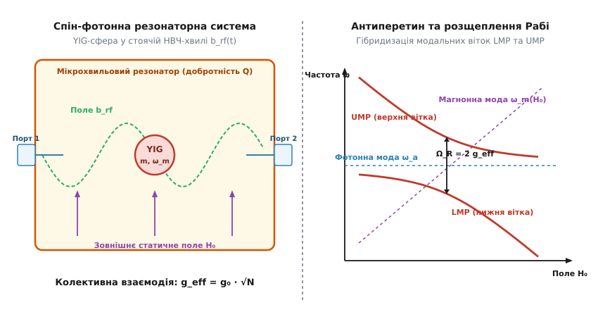
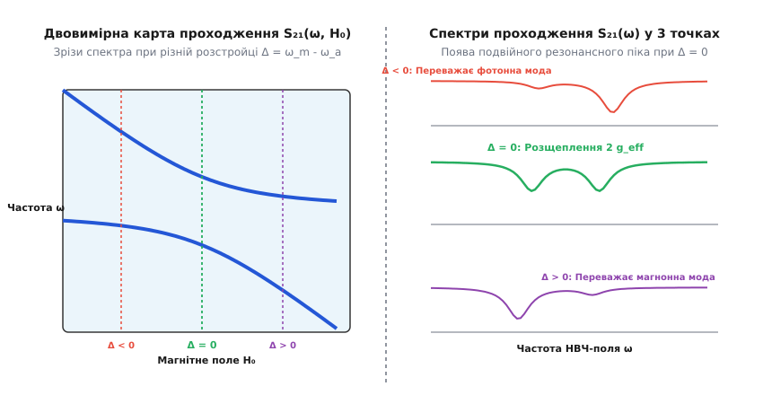

# Магнон-поляритони та сильнозв'язані спін-фотонні системи

<preknowlist>
- [Феромагнітний резонанс](topic:physics/ferromagnetic-resonance) — однорідна прецесія намагніченості у постійному магнітному полі.
- [Спінові хвилі та магнони](topic:physics/spin-wave) — квазічастинки спінових коливань у магнітовпорядкованих середовищах.
- [Квантовий гармонічний осцилятор](topic:physics/quantum-harmonic-oscillator) — оператори народження та знищення в квантовій моделі осцилятора.
- [Фотон](topic:physics/photon) — квант електромагнітного поля та його взаємодія з речовиною.
</preknowlist>

Помістивши монокристалічну сферу ітрій-залізистого гранату (`Y₃Fe₅O₁₂`, YIG) діаметром `1.0 мм` у мікрохвильовий мідний резонатор з власною частотою `ω_a / (2π) = 10.0 ГГц` та добротністю `Q ≈ 3000` і піддавши її дії зовнішнього статичного магнітного поля `H₀`, ми виявляємо несподівану фундаментальну трансформацію спектра. Замість очікуваного класичного перетину двох незалежних ліній — нерухомого резонаторного піка `ω_a` та лінії феромагнітного резонансу `ω_m(H₀) = γ H₀`, що лінійно зростає з полем — на графіку коефіцієнта проходження `S₂₁(ω, H₀)` виникає виражене розщеплення частот (англ. *anticrossing*). Поблизу точки резонансу `ω_m(H₀) = ω_a` системи принципово не існує окремого магнона чи окремого фотона. Кванти колективних спінових коливань (магнони) та кванти мікрохвильового електромагнітного поля (фотони) когерентно обмінюються енергією зі швидкістю, що перевищує швидкість розпаду обох підсистем. У результаті народжуються нові гібридні бозонні квазічастинки — **магнон-поляритони** (грец. *magnon* — хвиля намагніченості + *polariton* — зв'язаний стан поляризації та світла), а відстань між новими спектральними вітками визначається вакуумним розщепленням Рабі `Ω_R = 2 g_eff`.

У фізиці конденсованого стану магнон-поляритони утворюють фундамент резонаторної магноніки та квантових спін-фотонних інтерфейсів. Вони поєднують переваги двох фізичних світів: високу локалізацію, керованість магнітним полем та мале згасання магнонів у диелектричних магнетиках із високою швидкістю поширення, фазовою когерентністю та далекодією мікрохвильових фотонів. Без розуміння магнон-поляритонів неможливо створити ні квантові транслятори між мікрохвильовими надпровідними кубітами й оптичними фотонними мережами, ні когерентні спінові елементи пам'яті, ні невзаємні мікрохвильові вентилі й циркулятори для кріогенної квантової електроніки.

---

### 1. Механізм взаємодії: від одиночного електронного спіна до колективного дикківського підсилення

Щоб зрозуміти, як виникає магнон-поляритонний стан, розберемо мікроскопічну природу взаємодії світла з магнітним середовищем. Розглянемо одиночний електронний спін `S = 1/2`, поміщений у мікрохвильову кавіті об'єму `V_eff`. Магнітно-дипольна взаємодія спіна з квантовими вакуумними флуктуаціями резонаторного поля `b_zp` описується гамільтоніаном Джейнса — Каммінгса з константою зв'язку одиночного спіна:

```
g₀ = γ_e · b_zp = γ_e · √[ ℏ ω_a μ₀ / (2 V_eff) ]
```

де `γ_e / (2π) ≈ 28.0 ГГц/Тл` — ґіромагнітне співвідношення електрона. 

Підставивши типові параметри мікрохвильової кавіті X-діапазону (`ω_a / (2π) = 10 ГГц`, `V_eff ≈ 1 см³`), отримуємо вакуумну амплітуду поля `b_zp ≈ 10⁻¹¹ Тл`. Звідси константа зв'язку одиночного спіна становить мізерну величину: `g₀ / (2π) ≈ 0.05 ГГц` (тобто лише `0.05 Гц`).

Водночас власне згасання мікрохвильового фотона у металевому резонаторі становить `κ / (2π) ~ 1–10 МГц`, а дефазування поодинокого спіна у твердому тілі перевищує `γ / (2π) ~ 1–100 МГц`. Оскільки швидкість розпаду `κ` та `γ` на сім порядків перевищує константу зв'язку `g₀`, одиночний спін абсолютно нездатний встановити когерентний зв'язок із фотоном: будь-який квант випромінювання розсіюється у довкілля значно швидше, ніж спін встигне зробити хоча б один оберт прецесії.


*Схема мікрохвильового резонатора з YIG-сферою (ліворуч) та антиперетин спектральних віток магнон-поляритонів з вакуумним розщепленням Рабі Ω_R = 2 g_eff (праворуч).*

Ситуація фундаментально змінюється у магнітовпорядкованому матеріалі — феромагнетику або феримагнетику. У монокристалі ітрій-залізистого гранату (`Y₃Fe₅O₁₂`) сильна квантова обмінна взаємодія утримує `N` електронних спінів строго паралельно один одному. При збудженні однорідної моди Кіттеля (`k = 0`) весь колосальний ансамбль спінів прецесує синфазно як єдиний макроскопічний вектор намагніченості.

Кристалічна структура ітрій-залізистого гранату належить до кубічної просторової групи `Ia3d`. У кубічній елементарній комірці іони заліза `Fe³⁺` розміщуються у двох нееквівалентних кристалографічних позиціях: октаедричних (`16a`) та тетраедричних (`24d`). Антиферомагнітний обмінний зв'язок між цими підґратками створює результуючий феримагнітний момент, спрямований вздовж напрямку намагніченості. Оскільки іони `Fe³⁺` мають повністю напівзаповнену 3d-електронну оболонку (`3d⁵`), їхній орбітальний момент є повністю замороженим (`L = 0`), а квантовий спін дорівнює `S = 5/2`. Це забезпечує унікально мале дисипативне згасання прецесії намагніченості.

Завдяки квантовому ефекту **колективного підсилення Дикке** (виведеному Робертом Дикке у 1954 році для атомарних ансамблів), матричний елемент оператора взаємодії між макроскопічним спіновим генератором `S⁺ = √(2 S N) m` та фотонним полем `a` підсилюється в усякого спіна однаково. У результаті ефективна колективна константа зв'язку `g_eff` становить:

```
g_eff = g₀ · √(2 S N) = g₀ · √N_spins
```

Для монокристалічної сфери YIG діаметром `1.0 мм` щільність неспарених спінів дорівнює `ρ_s ≈ 4.2 × 10²⁸ м⁻³`, що дає загальну кількість спінів в ансамблі `N_spins ≈ 2.2 × 10¹⁹`. 

Помноживши мікроскопічну константу `g₀ / (2π) ≈ 0.05 Гц` на колективний фактор `√N_spins ≈ 4.7 × 10⁹`, отримуємо макроскопічну константу зв'язку:

```
g_eff / (2π) ≈ 0.05 Гц · 4.7 × 10⁹ ≈ 235 МГц
```

Колективне підсилення Дикке перетворює мікроскопічно невідчутну взаємодію одиночного спіна на потужний макроскопічний ефект, де константа зв'язку `g_eff / (2π) ≈ 235 МГц` у десятки разів перевищує втрати фотонів у резонаторі (`κ / (2π) ≈ 3 МГц`) та згасання магнонів у YIG (`γ / (2π) ≈ 1 МГц`).

#### Вплив температури та закону Блоха
Ефективна колективна константа зв'язку `g_eff(T)` прямо залежить від намагніченості насичення `M_s(T)`, яка зменшується з ростом температури згідно із законом Блоха `M_s(T) = M_s(0) · [1 - (T / T_c)^(3/2)]`, де `T_c ≈ 560 K` — температура Кюрі ітрій-залізистого гранату. При охолодженні від кімнатної температури (`300 K`) до кріогенних температур (`10 mK`) намагніченість YIG зростає приблизно на 15–20% (від `M_s ≈ 140 кА/м` до `M_s(0) ≈ 196 кА/м`). Відповідно, константа зв'язку `g_eff` при кріогенних температурах зростає на `10%`, а термічне заселення магнонів `n_th = 1 / [exp(ℏ ω_m / k_B T) - 1]` падає від `n_th ≈ 600` при `300 K` до зневажливо малого `n_th ≈ 10⁻²¹` при `10 mK`. Це переводить систему у чистий квантовий вакуумний стан.

Детальний історичний шлях від теоретичної концепції Дикке до перших експериментів із резонаторними магнон-поляритонами висвітлено у вставці [Історія розвитку резонаторної магноніки](topic:physics/magnon-polariton/hist-cavity-magnonics.md).

---

### 2. Гамільтоніан Тавіса — Каммінгса та спектральні режими зв'язку

Квантово-механічний опис гібридизованої системи у наближенні обертальної хвилі (RWA) задається гамільтоніаном Тавіса — Каммінгса для одного резонаторного фотонного поля `a` та однієї магнонної моди `m`:

```
H / ℏ = ω_a · a⁺ a  +  ω_m(H₀) · m⁺ m  +  g_eff · (a⁺ m + a m⁺)
```

де `ω_a` — власна частота фотонної моди, `ω_m(H₀) = γ_e H₀` — частота однорідного феромагнітного резонансу, керована статичним полем `H₀`, а `g_eff` — колективна константа спін-фотонного зв'язку.

Щоб урахувати дисипативні процеси (випромінювальне та внутрішнє згасання фотонів `κ`, а також релаксацію намагніченості Гільберта `γ`), сформуємо неермітів ефективний матричний гамільтоніан системи у базисі `(a, m)ᵀ`:

```
H_eff = ℏ · [  (ω_a - i κ)     g_eff       ]
            [    g_eff      (ω_m - i γ)    ]
```

Власні значення `w_±` цієї матриці визначають комплексні частоти магнон-поляритонів:

```
w_± = (ω_a + ω_m) / 2 - i (κ + γ) / 2  ±  √[ g_eff² + ( (ω_m - ω_a) / 2 - i (γ - κ) / 2 )² ]
```

Аналіз дійсної `Re(w_±)` та уявної `Im(w_±)` частин власних значень дозволяє строго класифікувати п'ять фундаментальних фізичних режимів взаємодії:

1. **Режим слабкого зв'язку (Weak coupling regime):**
   Виконується умова `g_eff < |κ - γ| / 4` або `g_eff < (κ + γ) / 2`. Підкореневий вираз є чисто уявним. Власні дійсні частоти мод не розщеплюються (антиперетин відсутній). Спостерігається лише зміна дисипативних втрат та часу життя мод — ефект Перселла (Purcell effect). Швидкість обміну енергією є повільнішою за розпад підсистем.
2. **Режим сильного зв'язку (Strong coupling regime):**
   Виконуються умови `g_eff > (κ + γ) / 2` та `g_eff > |κ - γ| / 4`. Підкореневий вираз є додатним і дійсним. У точці резонансу дійсна частина частоти розщеплюється на дві симетричні модові вітки нижнього (LMP) та верхнього (UMP) магнон-поляритонів. Вакуумне розщеплення Рабі `Ω_R` сягає величини:

   ```
   Ω_R = Re(w_+) - Re(w_-) = 2 · √[ g_eff² - (κ - γ)² / 16 ]  ≈  2 g_eff
   ```

   При цьому згасання обох гібридних мод вирівнюється і стає рівним `Im(w_±) = (κ + γ) / 2`. Високодобротний фотонний резонатор із малим `κ` ефективно захищає магнонний стан від дисипації, зменшуючи його ширину лінії.
3. **Режим ультрасильного зв'язку (Ultra-strong coupling regime, USC):**
   Виконується умова `0.1 ≤ g_eff / ω_a < 1.0`. Колективна константа зв'язку перевищує 10% від несучої частоти резонатора. Наближення обертальної хвилі (RWA) порушується: швидкоосцилюючі члени вида `a⁺ m⁺` та `a m` принципово змінюють вакуумний стан системи. Вакуум збагачується віртуальними магнон-фотонними парами, а основний стан стає стиснутим квантовим вакуумом (Squeezed Vacuum).
4. **Режим глибокого сильного зв'язку (Deep strong coupling regime, DSC):**
   Виконується умова `g_eff / ω_a ≥ 1.0`. Швидкість когерентного обміну енергією перевищує період осциляцій електромагнітного поля `T = 2π / ω_a`. Фотони та магнони переплітаються настільки глибоко, що класичне уявлення про окремі підсистеми повністю втрачає сенс.
5. **Дисипативний спін-фотонний зв'язок (Dissipative coupling):**
   Виникає у відкритих резонаторних системах або при зв'язку через спільний безперервний спектр випромінювання (суцільне середовище фотонів). Константа зв'язку стає уявним числом `i g_d`. Замість класичного відштовхування рівнів (anticrossing) спостерігається **притягання рівнів** (Level Attraction), де лінії частот зближуються і зливаються в один резонансний пік.

#### Перетворення Гопфілда та склад поляритонного стану
Власні стани гібридизованої системи є суперпозицією однофотонного стану `|1_a, 0_m⟩` та одномагнонного стану `|0_a, 1_m⟩`:

```
|LMP⟩ = u(H₀) · |1_a, 0_m⟩  -  v(H₀) · |0_a, 1_m⟩
|UMP⟩ = v(H₀) · |1_a, 0_m⟩  +  u(H₀) · |0_a, 1_m⟩
```

Коефіцієнти змішування (амплітуди Гопфілда) `u(H₀)` та `v(H₀)` залежать від розстройки `Δ = ω_m(H₀) - ω_a`:

```
u²(H₀) = 1/2 · [ 1 + Δ / √(Δ² + 4 g_eff²) ]
v²(H₀) = 1/2 · [ 1 - Δ / √(Δ² + 4 g_eff²) ]
```

Далеко від резонансу (`|Δ| ≫ g_eff`) квазічастинки відновлюють свою чисту природу: одна вітка стає чисто фотонною (`u² → 1`), а інша — чисто магнонною (`v² → 1`). Проте у точці точного резонансу (`Δ = 0`) коефіцієнти дорівнюють `u² = v² = 0.5`. Нижній (LMP) та верхній (UMP) магнон-поляритони являють собою ідеальний гібридний стан, що складається строго на 50% з фотона та на 50% з магнона.

#### Багатомодовий зв'язок із модами Уокера
У монокристалічній YIG-сфері діаметром `> 0.5 мм` окрім однорідної прецесійної моди Кіттеля `(1, 1, 0)` під дією статичного магнітного поля виникає багатий спектр магнітостатичних мод Уокера `(n, m, l)` з неоднорідним просторовим розподілом прецесії намагніченості. Якщо НВЧ магнітне поле резонатора має просторову неоднорідність у місці розташування зразка, фотонна мода може одночасно зв'язуватися з кількома модами Уокера. В експериментальному спектрі проходження `S₂₁(ω, H₀)` це виявляється як поява кількох послідовних точок антиперетину з різними розщепленнями Рабі `Ω_R^(n,m,l) = 2 g_eff^(n,m,l)`, де значення константи зв'язку пропорційне інтегралу перекриття між просторовою формою фотонної моди `u(r)` та магнонної моди `m_nm(r)`.

Повне математичне виведення перетворення Гопфілда, секулярного рівняння неермітового гамільтоніана та квазічастинкових операторів наведено у вставці [Математичне виведення рівняння магнон-поляритонів та матриці розсіювання S₂₁](topic:physics/magnon-polariton/math-rabi-polariton-derivation.md).

---

### 3. Мікрохвильова спектроскопія проходження та матриця розсіювання S₂₁

У лабораторному експерименті спостереження магнон-поляритонів здійснюється за допомогою векторного аналізатора кіл (VNA), підключеного до вхідного (Порт 1) та вихідного (Порт 2) зондів мікрохвильового резонатора. Аналізатор вимірює комплексний коефіцієнт проходження матриці розсіювання `S₂₁(ω, H₀)`.

Застосовуючи квантову теорію входу-виходу (Input-Output Theory) до лінеаризованих рівнянь Гейзенберга — Ланжевена, отримуємо аналітичний вираз для коефіцієнта проходження:

```
S₂₁(ω) = [ -2 i √(κ_ext1 · κ_ext2) ] / [ ω - ω_a + i κ - g_eff² / (ω - ω_m + i γ) ]
```

де `κ_ext1` та `κ_ext2` — зовнішні коефіцієнти зв'язку резонатора з вимірювальними кабелями портів.


*Двовимірна карта коефіцієнта проходження S₂₁(ω, H₀) у режимі сильного зв'язку (горілиць) та зрізи спектра S₂₁(ω) для трьох розстройок Δ (долілиць).*

Аналіз профілю `S₂₁(ω, H₀)` на двовимірній карті демонструє ключові експериментальні особливості:

1. **Далеко від резонансу (`Δ ≪ 0` або `Δ ≫ 0`):** Спектр проходження містить один гострий лоренцівський пік на частоті резонатора `ω_a` з амплітудою `|S₂₁| ≈ 2 √(κ_ext1 κ_ext2) / κ`. Магнонний резонанс виявляється як мале нерадіаційне просідання на частоті `ω_m(H₀)`.
2. **У точці точного резонансу (`Δ = 0`):** Одиночний резонаторний пік симетрично розщеплюється на два дублетні піки на частотах `ω_- = ω_a - g_eff` та `ω_+ = ω_a + g_eff`. У самій точці `ω = ω_a` амплітуда проходження просідає до мінімуму (деструктивна інтерференція фотонного та магноного каналів). Відстань між вершинами піків прямо дає величину вакуумного розщеплення Рабі `Ω_R = 2 g_eff`.

Для коефіцієнта відбиття від вхідного порту `S₁₁(ω, H₀)` квантова теорія входу-виходу дає дуальний вираз:

```
S₁₁(ω) = -1  +  [ 2 i κ_ext1 ] / [ ω - ω_a + i κ - g_eff² / (ω - ω_m + i γ) ]
```

Вимірювання комплексних фазових спектрів `arg(S₂₁)` та `arg(S₁₁)` дозволяє визначити фазовий набіг магнон-поляритонної системи та відокремити резонаторне згасання від внутрішньої релаксації Гільберта.

#### Електрична детекція через обернений спіновий ефект Холла (ISHE)
Крім мікрохвильового проходження `S₂₁`, магнон-поляритони можна зафіксувати за допомогою прямого електричного вимірювання. Якщо на поверхню сфери або плівки YIG напилити тонку смужку важкого металу (платини `Pt` товщиною `5 нм`), прецесуюча намагніченість під час магнон-поляритонного резонансу інжектує спіновий струм `j_s` у платину за рахунок ефекту спінового накачування (Spin Pumping). Усередині платини завдяки сильному спін-орбітальному розсіюванню спіновий струм трансформується у поперечний електричний струм `j_e` через обернений спіновий ефект Холла (Inverse Spin Hall Effect, ISHE).

Вимірювана на кінцях платинової смужки постійна напруга `V_ISHE(H₀)` виявляє подвійний резонансний пік при тих самих магнітних полях, що й вакуумне розщеплення Рабі в `S₂₁`. Це дає прямий електричний підтверджувальний канал для гібридних спін-фотонних пристроїв.

#### Нелінійні процеси Сула у сильнозв'язаних системах
При підвищенні НВЧ-потужності падаючої хвилі кут прецесії намагніченості `θ` зростає. У звичайному магнонному кристалі це викликає нелінійне тримагнонне та чотиримагнонне розсіювання — первинну та вторинну нестійкості Сула (Suhl Instabilities). У резонаторних магнон-поляритонних системах наявність сильного зв'язку з фотонною модою кардинально змінює поріг виникнення нестійкостей Сула. По-перше, розщеплення Рабі змінює умови спектрального резонансного узгодження для параметричного розпаду магнонів. По-друге, нелінійність прецесії викликає динамічний зсув магнонної частоти (Duffing nonlinearity), що призводить до виникнення оптичної та магнонної бістабільності у системі.

Алгоритм чисельного розрахунку спектральних карт `S₂₁(ω, H₀)` та апроксимації експериментальних даних VNA наведено у вставці [Чисельний розрахунок спектра вакуумного розщеплення Рабі та коефіцієнта S₂₁](topic:physics/magnon-polariton/proj-polariton-spectrum.md).

---

### 4. Квантова магноніка, хіральність та багатокомпонентні гібридні системи

Розвиток теорії магнон-поляритонів вивів резонаторну магноніку за межі класичного мікрохвильового поглинання, відкривши шлях до квантових технологій.

#### Одномагнонні стани та кубіт-магнонні інтерфейси
Оскільки магнон-поляритонний стан у резонаторі є бозонним, він описується гармонічним осцилятором з рівновіддаленими енергетичними рівнями `E_n = ℏ ω (n + 1/2)`. Для використання магнонів у квантових обчисленнях необхідно створити нелінійність, яка дозволить адресувати окремі квантові рівні.

Цю задачу було розв'язано шляхом інтеграції магнон-поляритонної системи з надпровідним трансмон-кубітом у спільній кріогенній 3D-кавіті при температурі `T ≈ 10 мК`. Трансмон діє як штучний нелінійний атом з нерівновіддаленими квантовими рівнями. Взаємодіючи з фотоном резонатора, який у свою чергу сильний зв'язаний з магноном у YIG, кубіт дозволяє:
- Здійснювати неруйнівне вимірювання кількості магнонів у сферичному зразку (Single-Magnon Counting);
- Ґенерувати некласичні фоківські стани спінової системи `|n_m = 1⟩` та `|n_m = 2⟩`;
- Використовувати магнонний ансамбль як тривалу квантову пам'ять для збереження кубітних станів.

#### Хіральний спін-фотонний зв'язок та невзаємність
У мікрохвильових копланарних хвилеводах або специфічних модах прямокутних резонаторів вектор змінного магнітного поля `b_rf` має кругову або еліптичну поляризацію у площині, перпендикулярній до поширення хвилі (`b_x ± i b_y`).

Оскільки прецесія Кіттеля у феромагнетику під дією поля `H₀` має строго визначений напрямок обертання (визначений ґіромагнітним співвідношенням `γ_e`), магнони взаємодіють лише з тими фотонами, магнітне поле яких обертається у той самий бік.

Якщо фотон поширюється у напрямку `+z`, його магнітне поле поляризоване за годинниковою стрілкою і симетрично збуджує магнони (`g_eff⁺ > 0`). Якщо ж фотон поширюється у зворотному напрямку `-z`, поляризація змінюється на протилежну, і зв'язок з магнонами повністю зникає (`g_eff⁻ ≈ 0`). Це явище має назву **хірального спін-фотонного зв'язку**. Воно дає змогу будувати компактні мікрохвильові вентилі та циркулятори безпосередньо на мікрочіпі без використання важких зовнішніх постійних магнітів.

#### Трикомпонентні гібриди: Кавіті оптомагноніка та акустомагноніка
Магнон-поляритони здатні когерентно об'єднувати не лише мікрохвильові фотони, але й інші фізичні ступені вільності:

- **Кавіті оптомагноніка (Магнон + НВЧ-фотон + Оптичний фотон):** Монокристал YIG має високий коефіцієнт заломлення та є оптично прозорим в інфрачервоному телекомунікаційному діапазоні (`λ = 1.55 мкм`), виявляючи потужний магнітооптичний ефект Фарадея. Використовуючи оптичний резонатор шепочучої галереї (Whispering Gallery Mode, WGM) у YIG-сфері, вдається досягти потрійного резонансу. Це дає змогу реалізувати **квантові транслятори** (Quantum Transducers), які когерентно конвертують мікрохвильові кванти надпровідного процесора (`5 ГГц`) у оптичні фотони (`200 ТГц`) для передачі квантової інформації через волоконно-оптичні лінії зв'язку на великі відстані.
- **Кавіті акустомагноніка (Магнон + Фотон + Фонон):** Магнітострикційна взаємодія у YIG зв'язує прецесію намагніченості з когерентними звуковими хвилями (акустичними фононами) Гігагерцового діапазону, формуючи трикомпонентні магнон-фотон-фононні поляритони.

#### Детекція темної матерії: магнонні халоскопи
Один із найсучасніших напрямків застосування магнон-поляритонів лежить у галузі астрофізики та фізики елементарних частинок. Аксіони — гіпотетичні легкі частинки, що вважаються головними кандидатами на роль темної матерії Всесвіту — у зовнішньому магнітному полі можуть конвертуватися у мікрохвильові фотони за рахунок ефекту Примакова. У високодобротних магнон-поляритонних резонаторах (наприклад, експеримент QUAX у Італії) гібридизація магнонів із фотонами забезпечує вузькосмугове підсилення сигналу аксіонно-фотонної конверсії, що підвищує чутливість пошуку темної матерії на кілька порядків.

> 🔧 **Навіщо це.**
> Магнон-поляритони є ключовою технологічною платформою для квантової інженерії та кріогенної мікрохвильової радіофізики. У квантових обчисленнях вони вирішують проблему зв'язку між надпровідними кубітами та оптичними каналами зв'язку, виконуючи роль когерентних квантових трансляторів. У НВЧ-спінтроніці магнон-поляритони забезпечують створення надкомпактних невзаємних пристроїв (циркуляторів, ізоляторів та фазообертачів) з усуненням зворотних завад у кріогенних зчитувальних трактах квантових процесорів. Завдяки високій спіновій щільності та керованості магнітним полем магнон-поляритонні системи слугують чутливими спектроскопічними детекторами для пошуку темної матерії (аксіонних халоскопів) у фундаментальній фізиці.
