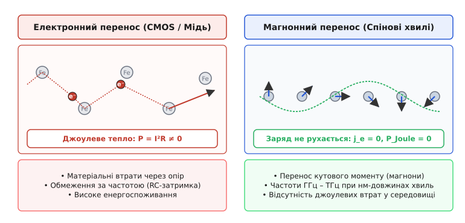
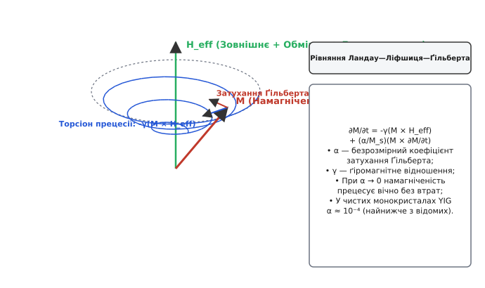
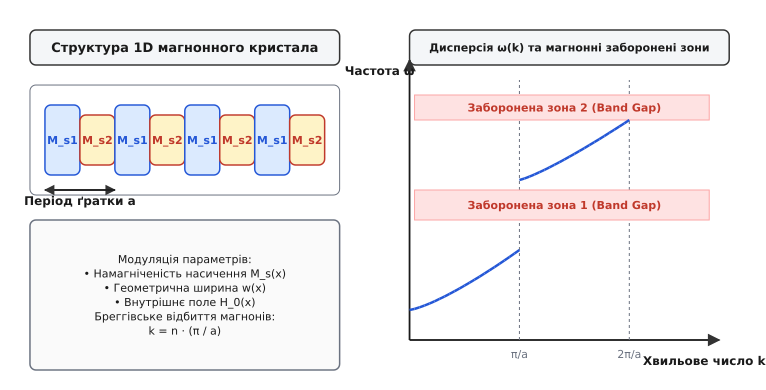
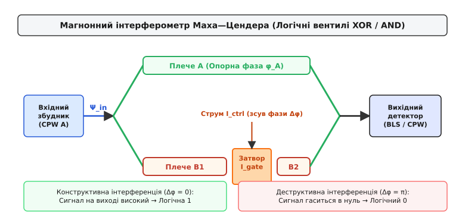

# Магноніка та магнонні кристали

<preknowlist>
- [Спінові хвилі](topic:physics/spin-wave) — колективні коливання намагніченості у феромагнетиках (магнони).
- [Феромагнітний резонанс](topic:physics/ferromagnetic-resonance) — прецесія намагніченості у зовнішньому магнітному полі.
- [Обмінна взаємодія](topic:physics/exchange-interaction) — квантово-механічна взаємодія спінів сусідніх атомів.
- [Гігантський магніторезистивний ефект](topic:physics/giant-magnetoresistance) — зчитування магнітного стану за допомогою спінового струму.
</preknowlist>

Сучасна наноелектроніка підійшла до фундаментального фізичного бар'єра, зумовленого тепловиділенням та енергоспоживанням. При масштабуванні кремнієвих CMOS-транзисторів до розмірів у кілька нанометрів основні втрати енергії виникають не під час виконання корисних логічних перемикань, а через розсіювання дрейфуючих електронів на атомах кристалічної ґратки (джоулеве тепло `P = I²R`). Окрім цього, паразитна ємність та опір металевих з'єднувальних мікроліній (RC-затримка) обмежують тактову частоту сучасних мікропроцесорів на рівні кількох гігагерц. Альтернативною парадигмою, здатною забезпечити передачу та обробку інформації без перенесення електричного заряду, є **магноніка**.

Магноніка — це напрямок фізики конденсованого стану та спінтроніки, що вивчає закони збудження, поширення, взаємодії та детектування спінових хвиль у магнітовпорядкованих середовищах. Квантами спінових хвиль є квазічастинки **магнони**, які переносять кутовий момент (спін) без матеріального переміщення самих атомів чи електричних зарядів.

## 1. Фізична сутність магнонного переносу інформації

Щоб зрозуміти, чим магнонний перенос відрізняється від традиційної мікроелектроніки та фотоніки, розглянемо мікроскопічний механізм поширення сигналу у феромагнетику.

У класичній провідниковій лінії передачі носієм інформації є потік вільних електронів, які дрейфують під дією поздовжнього електричного поля. Під час руху електрони безперервно зіштовхуються з дефектами кристалічної ґратки та фононами (тепловими коливаннями атомів), віддаючи їм кінетичну енергію. Це викликає швидкий нагрів провідника та загасання сигналу.

У магнонному хвилеводі всі атоми магнітної ґратки залишаються строго на своїх місцях у вузлах кристала. Електрони провідності також не переміщуються вздовж хвилеводу (а у разі діелектричних магнетиків вільні електрони взагалі відсутні). Інформація поширюється у вигляді **колективної фазованої прецесії** атомних спінів довкола напрямку рівноважної намагніченості.


*Порівняння електронного дрейфу в провіднику із джоулевим нагріванням та спін-хвильового переносу кутового моменту без руху заряду.*

Як видно з наведеного порівняння, спінова хвиля є узгодженим рухом спінових векторів сусідніх атомів. Кожен наступний спін відхиляється від осі намагнічування із певним зсувом фази `Δφ = k · a`, де `k` — хвильовий вектор, а `a` — період ґратки. Оскільки вектор кутового моменту передається від атома до атома за рахунок квантово-механічної обмінної та диполь-дипольної взаємодії, електричний струм у середовищі дорівнює нулю (`j_e = 0`), а отже, повністю відсутні джоулеві втрати.

### Хвильовий дуалізм та довжина хвилі магнонів

Спінові хвилі мають унікальне поєднання фізичних властивостей, яке робить їх вигіднішими за фотони та електромагнітні хвилі у радіочастотних мікросхемах:

1. **Короткі довжини хвиль на гігагерцових частотах:** Електромагнітна хвиля частотою `f = 10 ГГц` у вакуумі або діелектрику має довжину хвилі `λ_em ≈ 3 см`. Спінова хвиля тієї ж частоти у феромагнетику за рахунок обмінної взаємодії має довжину хвилі `λ_magnon` від 10 до 500 нанометрів. Це дає змогу створювати надкомпактні інтерференційні пристрої та хвилеводи, розміри яких на п'ять порядків менші за довжину електромагнітної хвилі тої ж частоти.
2. **Нелінійність при низьких потужностях:** Магнони є сильненелінійними бозе-квазічастинками. При збільшенні амплітуди прецесії магнони інтенсивно взаємодіють один з одним (трьох- та чотиримагнонні процеси розсіювання), що дозволяє створювати магнонні транзистори, змішувачі частот та обчислювальні системи без застосування зовнішніх напівпровідникових діодів.
3. **Керування зовнішнім полем:** Дисперсійні характеристики магнонів (частота та фазова швидкість) можна динамічно змінювати в діапазоні від мегагерців до терагерців шляхом зміни зовнішнього магнітного поля `H_0` або підведенням спінового струму.

## Порівняння парадигм обробки інформації

| Фізична характеристика | Електронна CMOS-технологія | Фотоніка (Оптоелектроніка) | Магноніка (Спінові хвилі) |
| :--- | :--- | :--- | :--- |
| **Первинний носій сигналу** | Електричний заряд (електрон `e⁻`) | Фотон (світло `γ`) | Магнон (квазічастинка прецесії `ℏs`) |
| **Електричний струм `j_e`** | `j_e ≠ 0` (потік заряду) | `j_e = 0` (нейтральні фотони) | `j_e = 0` (чистий спіновий струм) |
| **Джоулеве тепло `P_Joule`** | Високе (`P = I²R`) | Відсутнє у хвилеводі | Відсутнє у діелектричних магнетиках |
| **Довжина хвилі при 10 ГГц** | ~10 мм (у мікросмужці) | ~30 мм (екстраполяція) | **10 нм – 500 нм** (наномасштаб) |
| **Швидкість поширення** | `10⁴ – 10⁵ м/с` (дрейф) | `2 · 10⁸ м/с` (швидкість світла) | `10³ – 10⁴ м/с` (групова швидкість) |
| **Нелінійні взаємодії** | Потребує транзисторних PN-переходів | Слабкі (потребує високих потужностей) | Сильні при низьких амплітудах |
| **Керування параметрами** | Електричним потенціалом | Оптичними затворами / РК | Магнітним полем, струмом `SOT`, напругою |

## 2. Динаміка намагніченості та затухання Ґільберта

Математичним фундаментом магноніки є рівняння Ландау — Ліфшиця — Ґільберта (`LLG`), яке описує часову еволюцію вектора намагніченості `M(r, t)` у мікромагнітному наближенні:

```
∂M/∂t = -γ · (M × H_eff) + (α / M_s) · (M × ∂M/∂t)
```

У цьому рівнянні перший доданок відповідає за чисто консервативну прецесію вектора намагніченості довкола напрямку ефективного магнітного поля `H_eff` із гіромагнітною частотою `ω_p = γ · H_eff`. Гіромагнітне відношення електронного спіна становить `γ ≈ 1.76 · 10¹¹ rad/(s·T)`.


*Спіральна траєкторія прецесії намагніченості у зовнішньому полі з урахуванням гальмівного моменту Ґільберта.*

Другий доданок у рівнянні `LLG` описує **дисипацію енергії** спінової системи. Безрозмірний параметр `α` називається **коефіцієнтом затухання Ґільберта** (*Gilbert damping parameter*).

### Фізичний зміст затухання Ґільберта

Затухання Ґільберта виникає внаслідок релаксації кутового моменту прецесуючих спінів у кристалічну ґратку через спін-орбітальну взаємодію та розсіювання на електронах провідності.

1. **Торсіон дисипації:** Вектор моменту затухання `(α / M_s) · (M × ∂M/∂t)` спрямований перпендикулярно до вектора намагніченості `M` та напрямку його миттєвої зміни. Він «закручує» траєкторію прецесії у спіраль, змушуючи вектор `M` поступово вирівнюватися вздовж напрямку ефективного поля `H_eff`.
2. **Вплив на пробіг хвилі:** Чим менший параметр `α`, тим довше триває прецесія і тим далі спінова хвиля може поширитися у хвилеводі до того, як її амплітуда згасне в `e` разів. Час життя магнона оцінюється як `τ_m ≈ 1 / (α · ω)`.

У металевих феромагнетиках (наприклад, у пермалої `Ni₈₀Fe₂₀` або `CoFeB`) релаксація відбувається швидко через розсіювання спінів на електронах провідності (`α ≈ 10⁻³ – 10⁻²`), що обмежує пробіг спінових хвиль мікроновою гамою (`5–20 мкм`).

Натомість у монокристалах діелектричного **залізо-ітрієвого гранату (YIG, `Y₃Fe₅O₁₂`)** вільні електрони відсутні, а спін-орбітальна взаємодія іонів `Fe³⁺` є надзвичайно слабкою. Це забезпечує рекордне для фізики твердого тіла затухання `α_YIG ≈ 10⁻⁴`. Спінові хвилі у тонких плівках YIG здатні поширюватися на відстані до кількох сантиметрів, що робить цей матеріал базовим для пристроїв магноніки.

### Три геометрії магнітостатичних хвиль

Залежно від взаємної орієнтації поля підмагнічування `H_0`, норми до плівки `n` та хвильового вектора `k`, магнітостатичні хвилі у плівках поділяються на три основні моди:

1. **Поверхневі хвилі Деймона — Ешбаха (MSSW):** Поле `H_0` лежить у площині плівки перпендикулярно до `k`. Вони характеризуються найвищою груповою швидкістю та строгою невзаємністю: енергія хвилі, що поширюється вліво, локалізується біля верхньої поверхні плівки, а тієї, що вправо — біля нижньої.
2. **Прямі об'ємні хвилі (MSFVW):** Поле `H_0` перпендикулярне до площини плівки. Хвилі поширюються ізотропно у всіх напрямках площини з позитивною дисперсією `∂ω/∂k > 0`.
3. **Зворотні об'ємні хвилі (MSBVW):** Поле `H_0` паралельне до хвильового вектора `k` у площині плівки. Вони мають аномальну від'ємну дисперсію `∂ω/∂k < 0`: напрямок переносу енергії (групова швидкість) протилежний до напрямку поширення гребенів хвилі (фазова швидкість).

Докладний математичний вивід рівняння Ландау — Ліфшиця — Ґільберта, розклад ефективного поля на обмінну та дипольну компоненти та розрахунок швидкості дисипації енергії наведено у вставці [Динаміка Ландау — Ліфшиця — Ґільберта та хвильова математика магнонних кристалів](topic:physics/magnonics/math-landau-lifshitz-gilbert.md).

## 3. Магнонні кристали та магнонні заборонені зони

Найважливішим інструментом керування магнонними потоками є створення періодичних магнітних середовищ — **магнонних кристалів** (*magnonic crystals*).

За аналогією з фотонними кристалами для світла та напівпровідниковими періодичними ґратками для електронів, магнонний кристал є магнітним середовищем, у якому один або декілька фізичних параметрів періодично змінюються у просторі з періодом `a`, порівнянним із довжиною спінової хвилі (`a ≈ 10 нм – 1 мкм`).

### Параметри модуляції

Просторова модуляція у магнонному кристалі може бути реалізована через періодичну зміну:

- **Намагніченості насичення `M_s(x)`:** Шляхом іонної імплантації або створення гетероструктур із двох різних магнітних матеріалів (наприклад, альтернація смужок YIG та пермалою).
- **Геометричного профілю хвилеводу:** Створення періодичного масиву канавок травлення або варіювання ширини мікросмужки `w(x)`.
- **Внутрішнього магнітного поля `H_0(x)`:** За допомогою мікромасивів провідників зі струмом або смужок із постійних магнітів.
- **Магнітної анізотропії `K_u(x)`:** Механічним напруженням через п'єзоелектричний підшар.


*Формування магнонних заборонених зон у спектрі дисперсійних кривих 1D періодичного магнітного середовища.*

### Механізм формування заборонених зон (Magnonic Band Gaps)

Коли спінова хвиля з хвильовим вектором `k` поширюється вздовж магнонного кристала з періодом `a`, вона зазнає часткового відбиття на кожній границі розділу періодичних блоків.

При виконанні умови бреггівського відбиття:

```
k = n · (π / a)   [де n = ±1, ±2, ±3...]
```

пряма хвиля та масив відбитих хвиль складаються у фазі, утворюючи стоячу хвилю. У результаті конструктивної інтерференції відбитих потоків поширення спінової хвилі крізь кристал стає неможливим: хвиля повністю відбивається від входу кристала.

На дисперсійній діаграмі `ω(k)` на межах зон Бріллюена `k = n · (π / a)` утворюються розриви суцільного спектра — **магнонні заборонені зони** (*magnonic band gaps*).

У межах забороненої зони частот:

1. **Відсутні дозволені хвильові стани:** Не існує дійсного значення хвильового числа `k ∈ ℝ`, яке б задовольняло рівняння `LLG`.
2. **Комплексне хвильове число:** Хвильовий вектор стає чисто уявним `k = n(π/a) + i · Im(k)`.
3. **Експоненціальне згасання:** Амплітуда спінової хвилі, заведеної у кристал на частоті всередині забороненої зони, експоненціально загасає вглиб структури `|ψ(x)| ∝ exp(-Im(k) · x)`.

Ширина забороненої зони `Δω_gap` визначається глибиною модуляції параметрів середовища. Вона може сягати від кількох десятків мегагерц до кількох гігагерц.

Докладніше про хронологію виникнення концепції магнонних кристалів, перші експерименти з травленими YIG-плівками та відкриття бозе-конденсації магнонів читайте у вставці [Історія розвитку магноніки та концепції магнонних кристалів](topic:physics/magnonics/hist-magnonics.md).

## 4. Класифікація та технологія магнонних кристалів

Залежно від вимірності просторової модуляції магнонні кристали поділяються на 1D (періодичні смужки чи канавки), 2D (матриці отворів чи стовпчиків) та 3D (самозібрані опалоподібні структури з феромагнітних сферичних наночастинок).

У двовимірних магнонних кристалах із квадратною або шестикутною ґраткою виникають специфічні топологічні ефекти: створення магнонних точок Дірака та захищених крайових станів, у яких магнони поширюються в одному напрямку уздовж межі кристала без розсіювання на дефектах.

За принципом керування властивостями магнонні кристали ділять на дві великі групи:

### 1. Статичні магнонні кристали

Структура та заборонені зони закладаються на етапі фабрикації і не можуть бути змінені під час роботи пристрою.

- **Методи виготовлення:** Фокусоване іонне травлення (FIB), електронна літографія, рідинне хімічне травлення канавок, іонна імплантація гелію або азоту.
- **Застосування:** Пасивні НВЧ-фільтри з фіксованими смугами загородження, вузькосмугові резонатори, лінії затримки високочастотних сигналів.

### 2. Динамічні (переналаштовувані) магнонні кристали

Дозволяють керувати положенням та шириною заборонених зон у реальному часі за допомогою зовнішніх фізичних впливів.

- **Струмове керування (Орстедівські лінії):** Поруч із магнітною плівкою розміщують мікромасив паралельних металевих провідників. Пропущення струму `I_ctrl` створює просторово-періодичне магнітне поле `H_z(x)`. Зміна струму дозволяє миттєво («увімкнути» або «вимкнути») заборонені зони за наносекунди.
- **Спін-орбітальне керування (SOT):** Використання підшару важкого металу (платини або танталу), у якому спіновий струм Холла змінює локальне затухання `α(x)` або створює періодичний зсув фази.
- **Магнітоелектричне керування:** Використання гетероструктур «феромагнетик — п'єзоелектрик» (наприклад, `YIG / PZT`). Прикладення електричної напруги до п'єзоелектрика викликає періодичні механічні напруження, які через ефект магнотострикції модулюють константу анізотропії. Це дає змогу керувати магнонним спектром за допомогою напруги з мінімальним струмовим споживанням.

Детальний аналіз фізико-хімічних параметрів YIG, пермалою та сплавів Гейслера, а також конструкцію антен збудження наведено у вставці [Хвилеводи та матеріальні компоненти магноніки](topic:physics/magnonics/comp-yig-waveguides.md).

## 5. Нелінійні магнонні явища та Бозе-Ейнштейнівська конденсація

Оскільки магнони мають цілочисельний спін `s = 1` (у одиницях ℏ), вони є бозонами. При високих щільностях збудження проявляються унікальні квантові та нелінійні ефекти.

### Параметричне збудження та розсіювання Сула

При перевищенні порогової потужності НВЧ-накачування виникає нелінійна нестабільність Сула. Одна фотонна мода або один магнон із частотою `2ω_0` розпадається на два магнони з протилежними хвильовими векторами `k` та `-k` і частотами `ω_0`. Цей процес лежить в основі параметричних магнонних підсилювачів та генераторів.

### Солітони спінових хвиль

У середовищах із балансом між нелінійним зсувом частоти та дисперсійним розпливанням хвильового пакета формуються магнонні солітони — стійкі самофокусовані хвильові сгустки, які поширюються без зміни форми.

### Бозе-Ейнштейнівська конденсація магнонів (BEC)

У 2006 році було спостережено унікальне явище: при інтенсивному параметричному накачуванні магнонів у плівку YIG при кімнатній температурі, надлишкові магнони через термалізацію (чотиримагнонне розсіювання) стікають на саме дно спектрального стану `k = k_min`. При досягненні критичної щільності магнони спонтанно переходять у єдиний макроскопічний квантовий стан із загальною фазою — бозе-конденсат магнонів. Це відкриває шляхи для створення квантових магнонних обчислювачів без кріогенного охолодження.

## 6. Магнонна логіка та пристрої обробки інформації

Можливість керування фазою та амплітудою спінових хвиль у мікрохвилеводах відкрила шлях до створення **магнонних обчислювальних пристроїв** (*magnonic computing*).

У магнонній логіці інформаційні біти «0» та «1» можуть кодуватися двома способами:

1. **Амплітудне кодування:** Відсутність магнонного сигналу (амплітуда `A ≈ 0`) відповідає логічному «0», а наявність когерентного хвильового пакета (`A > A_th`) — логічній «1».
2. **Фазове кодування:** Спінова хвиля з початковою фазою `φ = 0` кодує логічний «0», а хвиля зі зсувом фази `φ = π` — логічну «1». Фазове кодування є значно стійкішим до загасання і дає змогу виконувати логічні операції на основі **інтерференції**.

### Магнонний інтерферометр Маха — Цендера

Основним базовим елементом магнонної обчислювальної техніки є інтерферометр Маха — Цендера, сформований у вигляді Y-подібного розгалуженого магнонного хвилеводу.


*Схема логічного елемента на основі інтерференції спінових хвиль у плечах хвилеводу.*

Вхідна копланарна антенна збуджує спінову хвилю, яка розгалужується на два паралельні плечі: опорне плече A та керувальне плече B.

- **Конструктивна інтерференція (Δφ = 0):** Якщо фази хвиль у двох плечах збігаються, на виході хвилеводи зводяться і додаються у фазі. Вихідна амплітуда є максимальною, що відповідає логічній «1».
- **Деструктивна інтерференція (Δφ = π):** Якщо за допомогою затвора (наприклад, локального магнітного поля або спін-орбітального струму) у плечі B створюється додатковий зсув фази `Δφ = π`, хвилі на виході гасять одна одну. Вихідна амплітуда дорівнює нулю, що відповідає логічному «0».

Така поодинока структура залежно від способу подачі вхідних сигналів здатна виконувати фундаментальні логічні операції `XOR`, `AND`, `NOT` та `NAND` без використання складних схем із десятків транзисторів.

### Магнонний транзистор

У 2014 році було створено магнонний транзистор, у якому потік первинних магнонів (канал) керується додатковим потоком магнонів високої щільності (затвор). При подачі магнонного сигналу на затвор унаслідок нелінійного чотиримагнонного розсіювання магнони каналу відхиляються за частотою та випадають із робочого діапазону, що призводить к замиканню магнонного каналу.

### Нейроморфна магноніка (Reservoir Computing)

Нанорозмірні магнонні кристали виявляють високу складність спектральних відгуків на вхідні НВЧ-сигнали. Використовуючи інтерференцію та нелінійну динаміку спінових хвиль у 2D магнонній матриці, можна створити **фізичний резервуарний обчислювач** (*magnonic reservoir computer*), який виконує паралельне нелінійне згортання сигналів для алгоритмів штучного інтелекту та розпізнавання мовлення з енергоспоживанням у мільйони разів меншим за цифрові відеокарти.

Повний чисельний розрахунок спектра пропускання 1D магнонного кристала, формувань заборонених зон та побудову матриць переходу на мовах Python та C++ наведено у практичній вставці [Чисельне моделювання дисперсії магнонів у 1D магнонному кристалі](topic:physics/magnonics/proj-magnon-dispersion.md).

## 7. Енергетичні переваги, обмеження та фундаментальна ціна

Оцінимо фундаментальні переваги та фізичні обмеження магноніки порівняно з напівпровідниковою мікроелектронікою.

### Енергетична ефективність та межа Ландауера

Мінімальна енергія, необхідна для перемикання одного біта інформації за термодинамічною межею Ландауера, становить:

```
E_min = k_B · T · ln(2) ≈ 2.87 · 10⁻²¹ Дж   [при T = 300 К]
```

Сучасні CMOS-транзистори через перезаряджання ємності затвора витрачають на одну логічну операцію близько `10⁻¹⁵ – 10⁻¹⁴` Дж, що на шість порядків перевищує межу Ландауера.

У магнонній логіці для кодування одного біта інформації фазовим станом потрібен ансамбль лише з `100 – 1000` магнонів. Оскільки енергія одного магнона на частоті 10 ГГц становить `E_m = ℏω ≈ 6.6 · 10⁻²⁴` Дж, загальна енергія магнонного хвильового пакета становить:

```
E_magnon_gate ≈ 1000 · ℏω ≈ 6.6 · 10⁻²¹ Дж   [на рівні межі Ландауера]
```

Це демонструє потенціал зменшення енергоспоживання обчислювальних систем у 10 000 разів порівняно з найкращими кремнієвими процесорами.

### Фундаментальні обмеження

Поряд із перевагами магноніка має власні фізичні обмеження:

1. **Нижча швидкість поширення сигналу:** Групова швидкість спінових хвиль `v_g = ∂ω/∂k` становить від `10³` до `10⁴` м/с, що на три-чотири порядки повільніше за швидкість поширення електромагнітного сигналу у мідних провідниках (`~10⁸` м/с). Тому магноніка не розглядається як заміна швидкісних системних шин, а орієнтується на паралельні обчислення.
2. **Втрати при конверсії «заряд — спін»:** Найбільші енергетичні втрати виникають на вхідних та вихідних перетворювачах при трансформації електричного НВЧ-сигналу в спінову хвилю і навпаки. Для компенсації цих втрат розробляються прямі архітектури, де весь обчислювальний граф виконується у магнонному домені без проміжних конверсій.

## Порівняльна таблиця параметрів пристроїв

| Параметр | Напівпровідник CMOS (3 нм) | Магнонний кристалічний вентиль |
| :--- | :--- | :--- |
| **Основа логічного стану** | Заряд на ємності затвора | Фаза / амплітуда спінової хвилі |
| **Енергія на 1 логічну операцію** | `~10⁻¹⁵` Дж (1 фДж) | **`~10⁻²⁰ – 10⁻¹⁹` Дж (10–100 аДж)** |
| **Тепловиділення у каналі** | Високе (Джоулів нагрів) | Майже відсутнє (діелектрик YIG) |
| **Площа двовхідного вентиля XOR** | ~12–20 транзисторів | **1 монолітний Y-інтерферометр** |
| **Тактова частота** | 3 – 5 ГГц (обмеження теплом) | **10 – 100 ГГц (ГГц–ТГц діапазон)** |
| **Затримка поширення сигналу** | ~10 пікосекунд | ~100 пікосекунд (повільніша хвиля) |

> 🔧 **Навіщо це.**
> 1. **Переналаштовувані НВЧ-фільтри 5G / 6G:** Магнонні кристали з електронним керуванням напрямком поля дозволяють створювати надкомпактні режекційні фільтри для радіофронтендів мобільних станцій, здатні переналаштовувати смугу глушіння від 2 до 40 ГГц за наносекунди.
> 2. **Нейроморфні магнонні процесори:** Сильна нелінійність взаємодії спінових хвиль у 2D магнонних кристалах дає змогу реалізувати резервуарні обчислення (*reservoir computing*). Магнонна середина фізично виконує нелінійне згортання вхідних векторів даних для розпізнавання образів та сигналів із мінімальними витратами енергії.
> 3. **Кріогенні обчислювальні інтерфейси:** Для зчитування стану кубітів у надпровідникових квантових комп'ютерах при температурах 10 мК магнонні хвилеводи забезпечують передачу сигналів без підведення тепла через металеві дроти.
