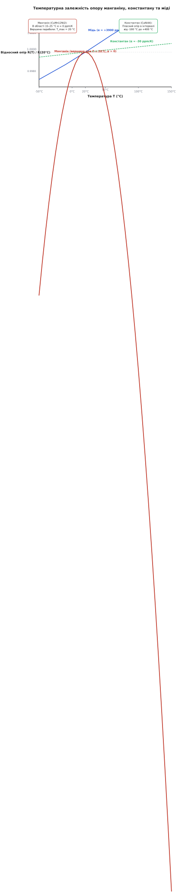
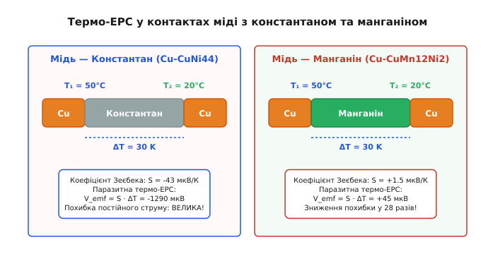
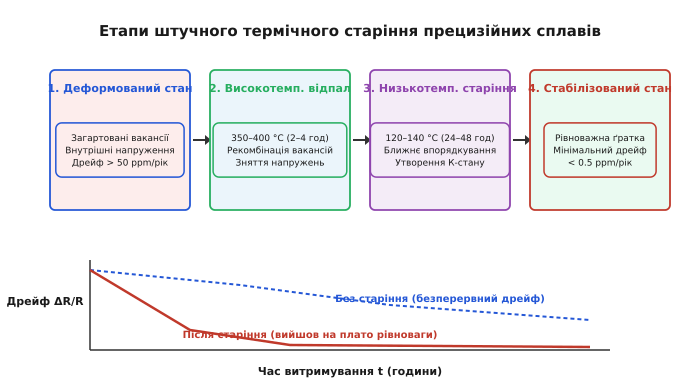

# Сплави з низьким TCR (манганін, константан)

<preknowlist>
- [Модель Друде](topic:physics/drude-model) — класичний зв'язок питомого опору з концентрацією та часом релаксації носіїв.
- [Правило Маттіссена](topic:physics/matthiessens-rule) — розділення загального опору на фононну та домішкову складові.
- [Сплави з нульовим ТКО](topic:physics/temperature-coefficient-alloys) — загальні фізичні принципи мінімізації температурного коефіцієнта опору.
- [Ефект Зеєбека](topic:physics/spin-seebeck-effect) — утворення термоелектрорушійної сили у контактах різнорідних металів при перепаді температур.
</preknowlist>

Коли через мідний вимірювальний шунт силою `100 А` виділяється `15 Вт` джоулевого тепла, температура провідника швидко піднімається на `40 °C`. Через високу температурну чутливість чиста мідь збільшує свій питомий опір майже на `16%` (температурний коефіцієнт опору `α = +3900 ppm/K`), що спотворює результати метрологічних вимірювань і робить створення прецизійних аналогових приладів неможливим. Заміна міді на спеціально розроблені прецизійні сплави — манганін або константан — знижує температурний дрейф опору у тисячі разів, зводячи його до величин порядка `1–10 ppm/K`.

Фізична природа такої надзвичайної стабільності опору полягає у цілеспрямованому зниженні довжини вільного пробігу електронів до атомних масштабів та взаємній компенсації класичного фононного розсіяння квантовими ефектами розмиття Фермі-поверхні та модифікації s-d електронних переходів у сильно неупорядкованих кристалічних ґратках.

## 1. Електронні механізми стабільності опору у прецизійних сплавах Cu-Mn-Ni та Cu-Ni

Електричний опір суцільного металевого провідника визначається інтенсивністю розсіяння носіїв заряду (електронів провідності) на будь-яких відхиленнях від строгої трансляційної періодичності ідеального монокристала. Згідно з квантовомеханічним підходом Блоха, у нескінченній ідеальній ґратці електронні хвилі поширюються без жодного опору. Опір виникає лише через два незалежні чинники: теплові коливання іонних остовів (фонони) та статичні дефекти (домішкові атоми, вакансії, міжзеренні межі).

Згідно з [правилом Маттіссена](topic:physics/matthiessens-rule), загальний питомий опір `ρ(T)` додається з двох базових складових:

```
ρ(T) = ρ_res + ρ_ph(T)
```

де `ρ_res` — залишковий опір, викликаний статичним домішковим розсіянням (який у першому наближенні не залежить від температури), а `ρ_ph(T)` — фононний опір, який для температур, вищих за температуру Дебая (`T > Θ_D`), зростає прямо пропорційно абсолютній температурі:

```
ρ_ph(T) = A · T                      [лінійний фононний опір при T > Θ_D]
```

У чистих металах (наприклад, у міді `Cu`) домішковий опір є мікроскопічним (`ρ_res < 0.001 мкОм·см`), тому фононна складова повністю домінує. У результаті диференціальний температурний коефіцієнт опору (ТКО, або англійською *TCR — Temperature Coefficient of Resistance*) чистих металів визначається відношенням фононного внеску до загального опору:

```
α(T) = (1 / ρ_0) · (dρ / dT) ≈ (1 / T) ≈ +3900 ppm/K   [при T = 293 K]
```

Для створення сплавів із низьким TCR необхідно штучно збільшити залишковий опір `ρ_res` до такого високого рівня, щоб температурно-залежний фононний внесок `ρ_ph(T)` становив лише мікроскопічну частку від загальної величини `ρ(T)`.

### Резонансне s-d розсіяння Мотта у манганіні та константані
Легування мідної матриці переходними металами (марганцем `Mn` та нікелем `Ni`) радикально змінює структуру електронних станів поблизу енергії Фермі `E_F`. У чистій міді провідність забезпечується легкими електронними хвилями в широкій s-зоні провідності, де густина станів `N_s(E_F)` є відносно малою, а ефективна маса електронів близька до маси вільного електрона `m* ≈ m_e`.

При введенні атомів марганцю (у манганіні, склад `86% Cu + 12% Mn + 2% Ni`) або нікелю (у константані, склад `55% Cu + 45% Ni`) частково заповнені `3d`-оболонки домішкових атомів формують вузьку d-зону з високою локальною густиною станів `N_d(E_F)`. Згідно з теорією s-d розсіяння Немілла Мотта (Nevill Mott, від англ. *Mott s-d scattering*), електрони провідності з s-зони під час зіткнень із домішковими атомами марганцю чи нікелю випробовують ефективне резонансне перерозсіяння у вузьку d-зону:

```
1 / τ_sd = (2π / ℏ) · |V_sd|² · N_d(E_F)
```

де `τ_sd` — час релаксації s-d розсіяння, `V_sd` — матричний елемент гібридизаційного потенціалу між s- та d-станами, а `N_d(E_F)` — густина прийнятних d-станів на рівні Фермі.

Оскільки густина d-станів `N_d(E_F)` на один-два порядки перевищує густину s-станів, імовірність s-d розсіяння стає колосальною. Це різко зменшує середню довжину вільного пробігу електронів `l_e` від десятки нанометрів (як у міді) до величин порядка атомного радіуса `l_e ≈ 0.5–1.0 нм`. Одночасно питомий опір зростає від значення міді `1.72 мкОм·см` до `43–49 мкОм·см`.

### Кореляція Муя та ефекти квантового розмиття
Коли питомий опір металевого сплаву перевищує критичне значення `ρ_c ≈ 1.5 мкОм·см` (критерій Іоффе — Регеля, при якому довжина вільного пробігу порівнюється з дебройлівською довжиною хвилі електрона `k_F · l_e ≈ 1`), входить у дію **кореляція Муя** (J. H. Mooij correlation).

Згідно з кореляцією Муя, у сильно неупорядкованих сплавах класичне зростання фононного опору `dρ_ph/dT > 0` починає компенсаційно збалансовуватись негативними квантовими внесками:

1. **Термічне розмиття функції розподілу Фермі — Дірака**: Підвищення температури розмиває сходинку розподілу електронів на величину `k_B · T`. Якщо густина станів `N(E)` поблизу рівня Фермі має локальний мінімум або максимум (що характерно для d-зон марганцю), розмиття змінює ефективне число носіїв, що беруть участь у провідності, призводячи до від'ємного температурного коефіцієнта.
2. **Руйнування квантової інтерференції (слабкої локалізації)**: У сильно забруднених ґратках електронні хвилі, що поширюються по замкнених траєкторіях у протилежних напрямках, інтерферують самі з собою, викликаючи додаткову квантову локалізацію. Нагрівання збільшує непружне розсіяння фононів, що руйнує фазову когерентність та знижує локалізаційний опір.

У результаті накладання двох протилежних процесів — позитивного лінійного фононного розсіяння та негативного квантового розмиття — підсумковий ТКО `α` в околі кімнатної температури падає практично до нуля.

## 2. Параболічна та лінійна термозалежність опору: Манганін проти Константану

Незважаючи на те, що манганін і константан належать до класу прецизійних сплавів з низьким TCR, їхні терморезистивні характеристики демонструють суттєву фізичну відмінність у математичній формі залежності `R(T)`.


*Рис. 1. Порівняння температурної залежності опору манганіну (параболічна залежність з максимумом при 20 °C), константану (лінійна пласка крива з α ≈ -30 ppm/K) та чистої міді (крутий позитивний нахил α = +3900 ppm/K).*

### Математичний опис та кривина параболи манганіну
Температурна залежність питомого опору манганіну (склад `CuMn12Ni2`, тобто `86% Cu`, `12% Mn`, `2% Ni`) в інтервалі температур від `-40 °C` до `+100 °C` має виражений параболічний характер відносно референтної температури `T_0 = 20 °C`:

```
R(T) = R_0 · [1 + α · (T - T_0) + β · (T - T_0)²]
```

де `R_0` — опір при `20 °C`, `α` — лінійний коефіцієнт (в `1/K` або `ppm/K`), а `β` — квадратичний коефіцієнт кривини параболи (в `1/K²` або `ppm/K²`). Детальні математичні виведення екстремумів та алгоритми визначення коефіцієнтів наведено у [математичному моделюванні параболічної залежності](topic:physics/manganese-alloys-tcr/math-tcr-parabolic-fit.md).

Для належним чином відпаленого манганінового дроту коефіцієнт `α` лежить у дуже вузьких межах від `-5 ppm/K` до `+15 ppm/K`, тоді як квадратичний коефіцієнт завжди є негативним:

```
β ≈ -(0.35 ... 0.50) · 10⁻⁶ K⁻² = -0.35 ... -0.50 ppm/K²
```

Негативне значення `β` означає, що вершина параболи спрямована вгору, створюючи абсолютний максимум опору при температурі:

```
T_max = T_0 - α / (2 · β)
```

При технологічному підборі складу (регулюванні відсоткового вмісту марганцю та нікелю) і режиму термообробки значення `α` настроюють так, щоб температура максимуму `T_max` потрапляла точно в інтервал `15–25 °C` (кімнатна зона). У точці `T_max` диференціальний ТКО перетворюється на нуль:

```
dR / dT = 0    при T = T_max
```

Завдяки цьому в температурному вікні `15–30 °C` зміна опору манганіну не перевищує `±1 ppm` (`0.0001%`), що робить його найдосконалішим матеріалом для первинних метрологічних еталонів Ома та лабораторних шунтів.

### Модифіковані сплави: Зеранін, Карма та Еваном
Для усунення параболічної кривини манганіну матеріалознавці створили потрійні та четвертинні сплави наступного покоління:

- **Зеранін (`CuMn7Sn`)**: Заміною частини марганцю на олово вдалося знизити квадратичний коефіцієнт кривини параболи `β` до значення `-0.05 ppm/K²`. Це розширило температурний плато постійності опору від `10 °C` до `45 °C` із відхиленням менше ніж `±0.2 ppm`.
- **Карма та Еваном (`NiCr20Al3Fe`)**: Високоомні сплави на основі нікелю та хрому з добавками алюмінію та заліза. Завдяки утворенню атомарного ближнього порядку (К-стану) вони мають високий питомий опір (`133 мкОм·см`) та екстремально пласку залежність `R(T)` у широкому вікні від `-50 °C` до `+150 °C`.

### Лінійний характер опору константану
На відміну від манганіну, константан (склад `CuNi44`, тобто `55% Cu`, `45% Ni`) має значно меншу квадратичну кривину `β ≈ -0.10 ppm/K²`, але володіє невеликим лінійним негативним ТКО:

```
α ≈ -30 ppm/K    (в інтервалі від -100 °C до +400 °C)
```

Залежність `R(T)` константану виглядає як практично пласка пряма лінія з легким від'ємним нахилом. Головна перевага константану полягає у **широті температурного вікна**: тоді як манганін зберігає низький ТКО лише до `+60 ... +80 °C` (після чого парабола стрімко іде вниз), константан зберігає стабільний опір при нагріванні аж до `+400 °C`.

Порівняльні електрофізичні та технологічні характеристики прецизійних сплавів зведені у [довідкових специфікаціях прецизійних сплавів](topic:physics/manganese-alloys-tcr/api-precision-alloy-specs.md).

## 3. Термоелектрорушійна сила (термо-ЕРС) відносно міді: критичний фактор для DC-метрології

При виготовленні вимірювальних резисторів і шунтів прецизійний сплав обов'язково з'єднується (припаюється або зварюється) з мідними підвідними провідниками вимірювальної схеми. Якщо у місцях спаїв існує температурний градієнт `ΔT` (наприклад, один спай нагрівається струмом або розміщений ближче до джерела тепла), внаслідок [ефекту Зеєбека](topic:physics/spin-seebeck-effect) у вимірювальному колі виникає паразитна термоелектрорушійна сила (термо-ЕРС).


*Рис. 2. Виникнення паразитної термо-ЕРС у контактах міді з константаном (S = -43 мкВ/К) та манганіном (S = +1.5 мкВ/К) при перепаді температур ΔT = 30 K.*

Диференціальна термо-ЕРС `V_emf`, яка додається до корисного спаду напруги на резисторі, обчислюється як:

```
V_emf = S_Cu-alloy · (T_1 - T_2) = S_Cu-alloy · ΔT
```

де `S_Cu-alloy = S_alloy - S_Cu` — диференціальний коефіцієнт Зеєбека пари «мідь — сплав» (вимірюється в `мкВ/К`).

### Фізичний парадокс константану
Константан має дуже високий коефіцієнт Зеєбека відносно міді:

```
S_Cu-CuNi44 ≈ -43 мкВ/К
```

Якщо на вимірювальному шунті з константану виникає перепад температур між мідними клемними блоками всього у `10 °C` (наприклад, через нерівномірне охолодження або виділення тепла на контактах), утворена термо-ЕРС становить:

```
V_emf = -43 мкВ/К · 10 К = -430 мкВ = -0.43 мВ
```

Для прецизійного вимірювального шунта з корисним сигналом `75 мВ` або `100 мВ` така паразитна напруга створює велетенську систематичну похибку постійного струму на рівні `0.43–0.57%`. Більш того, цей зсув залежить від часу нагрівання та напрямку конвекційних потоків повітря, що робить точну калібровку приладу неможливою.

Додатковим ускладнюючим чинником у вимірювальних кола постійного струму є **асиметрія самонагріву за ефектом Пельтьє**. При проходженні постійного струму `I` через межу розділу мідь-константан на одному спаї тепло Пельтьє виділяється (`Q_Peltier = +П · I`), а на протилежному — поглинається (`Q_Peltier = -П · I`). У результаті струм сам створює несиметричний температурний градієнт між контактами, генеруючи некомпенсовану термо-ЕРС навіть за умови абсолютно симетричного зовнішнього охолодження.

### Термоелектрична нейтральність манганіну
Введення марганцю до складного сплаву `Cu-Mn-Ni` змінює рівень Фермі та електронну структуру так, що коефіцієнт Зеєбека манганіну стає практично тотожним коефіцієнту Зеєбека чистої міді. Диференціальний коефіцієнт Зеєбека пари «мідь — манганін» становить лише:

```
S_Cu-CuMn12Ni2 ≈ +1.0 ... +2.0 мкВ/К
```

При тому ж перепаді температур `ΔT = 10 °C` паразитна термо-ЕРС манганінового шунта не перевищує:

```
V_emf = +1.5 мкВ/К · 10 К = +15 мкВ = +0.015 мВ
```

Це у `28 разів менше`, ніж у константану. Саме з цієї причини **манганін є абсолютним стандартом для вимірювальних систем постійного струму (DC)**, тоді як константан застосовують переважно у кола змінного струму (AC), де постійна складова термо-ЕРС відфільтровується, або для виготовлення самих термопар (тип J та тип T).

## 4. Мікроструктурні трансформації та термічне старіння

Отримання низького ТКО одразу після виплавки або волочіння дроту ще не гарантує довгострокової стабільності опору. Свіжовитягнутий манганіновий дріт демонструє часовий дрейф опору зі швидкістю понад `50–100 ppm/рік`, що є неприпустимим для метрології.

Причина часової нестабільності полягає у двох мікроструктурних факторах:
1. **Висока концентрація загартованих точкових дефектів (вакансій)** та внутрішніх механічних напружень, зафіксованих після пластичної деформації під час волочіння.
2. **Термодинамічна нерівноважність атомного розподілу** марганцю та нікелю у мідній матриці.


*Рис. 3. Послідовні етапи технологічного циклу штучного термічного старіння для релаксації ґратки та припинення часового дрейфу опору.*

### Ефект ближнього атомного впорядкування (К-стан)
При тривалому витримуванні сплаву при помірно підвищених температурах атоми марганцю та нікелю у твердому розчині починають перерозподілятися, утворюючи мікроскопічні області ближнього атомного впорядкування — так званий **К-стан** (від німецького *Kurzreichweitenordnung*). Утворення кластерів ближнього порядку змінює локальний потенціал розсіяння та знижує загальну вільну енергію ґратки. Якщо цей процес відбувається повільно при кімнатній температурі, опір виробу безперервно зміщується протягом багатьох років.

Кінетика формування К-стану та релаксації вакансій описується рівнянням Джонсона — Мела — Аврамі — Колмогорова (ЖМАК):

```
ξ(t) = 1 - exp(- (k · t)ⁿ)
```

де `ξ(t)` — частка перетвореної фази ближнього порядку, `k` — константа швидкості диффузійного процесу за законом Арреніуса `k = k_0 · exp(-E_a / (k_B · T))`, а `n` — показник кінетики нуклеації.

### Технологічний цикл штучного термічного старіння
Для прискорення мікроструктурної релаксації та виходу опору на стаціонарне плато рівноваги виготовлені котушки та шунти піддають багатоступеневому штучному термічному старінню:

1. **Високотемпературний відпал для зняття напружень (Stress Relief Annealing)**: Виріб нагрівають у вакуумі або в захисній атмосфері аргону/водню до температури `350–400 °C` протягом `2–4 годин`. При цій температурі рухливість вакансій є високою: вакансії рекомбінують із дислокаціями, а деформаційні напруження повністю релаксують.
2. **Контрольоване охолодження**: Повільне охолодження до кімнатної температури зі швидкістю не більше `50 °C/годину` для запобігання виникненню нових термічних напружень.
3. **Низькотемпературне стабілізуюче тренування (Low-Temperature Artificial Aging)**: Виріб витримують при температурі `120–140 °C` протягом `24–48 годин` (іноді до декількох тижнів для еталонів першого розряду). На цьому етапі завершується формування стабільного К-стану.

Після проходження повного циклу термічного старіння довгостроковий дрейф опору манганінових еталонів знижується до величини менше ніж **`0.5–1.0 ppm/рік`**, що дозволяє експлуатувати метрологічні прилади десятиліттями без втрати калібрування.

## 5. Конструкційні особливості та застосування у прецизійному приладобудуванні

Практична реалізація вимірювальних компонентів із прецизійних сплавів вимагає врахування їхніх механічних і теплофізичних властивостей, детальний аналіз яких наведено у [огляді прецизійних резисторів та шунтів](topic:physics/manganese-alloys-tcr/comp-manganin-constantan-resistors.md).

Застосування двох основних сплавів розподіляється за чіткими метрологічними критеріями:

```
Критерій вибору                 Манганін (CuMn12Ni2)        Константан (CuNi44)
----------------------------------------------------------------------------------
Основний режим струму            Постійний струм (DC)         Змінний струм (AC)
Паразитна термо-ЕРС проти Cu     Нікчемна (1–2 мкВ/К)         Велика (-43 мкВ/К)
Робочий діапазон температур     -40 °C ... +80 °C            -100 °C ... +400 °C
Основні вироби                   DC-шунти, еталони Ома        Тензодатчики, термопари J/T
```

Для вимірювальних систем, що працюють у жорстких умовах завад і термоградієнтів, програмне забезпечення вимірювальних контролерів використовує алгоритми двохфазного інвертування струму та квадратичної апроксимації, представлені у [програмній реалізації вимірювання ТКО](topic:physics/manganese-alloys-tcr/proj-tcr-measurement-bridge.md).

Історичний процес розробки цих матеріалів, пов'язаний із діяльністю Едварда Вестона та Берлінського метрологічного інституту (PTR), детально описано у [історичному екскурс про манганін та константан](topic:physics/manganese-alloys-tcr/hist-manganin-constantan-origin.md).

> 🔧 **Навіщо це.**
> При розробці силового інвертора електромобіля на `500 А` розробник має вибрати матеріал струмовимірювального шунта для системи керування векторним струмом фаз. Використання звичайного нікельованого мідного провідника призведе до того, що при розігріві силового блоку від `20 °C` до `100 °C` опір шунта зросте на `31%`, викликаючи хибні спрацьовування захисту від перевантаження за струмом. 
> 
> Застосування манганінового шунта із чотирипровідним підключенням Кельвіна забезпечує стабільність опору з точністю до `0.05%` у всьому робочому діапазоні температур автоелектроніки (від `-40 °C` до `+125 °C`), а мала термо-ЕРС відносно міді повністю усуває похибку вимірювання малого струму холостого ходу двигуна.
