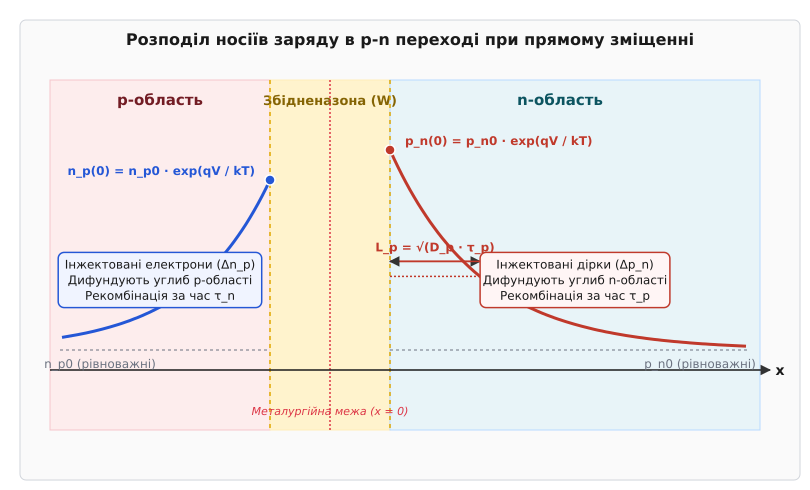
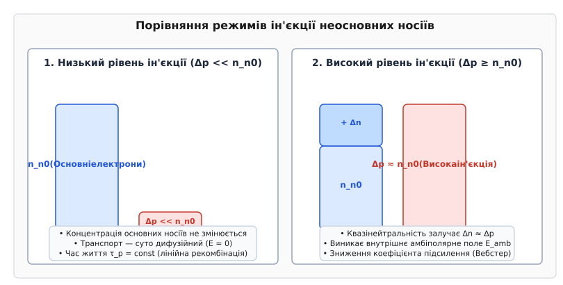
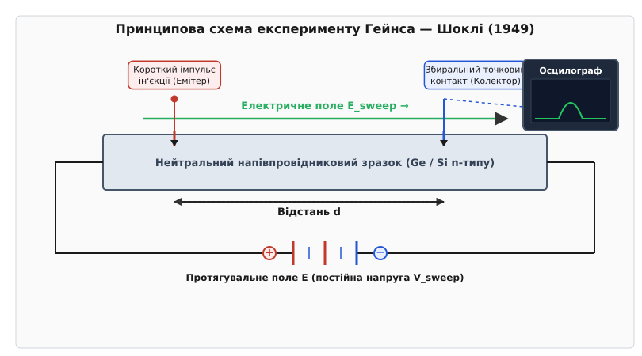
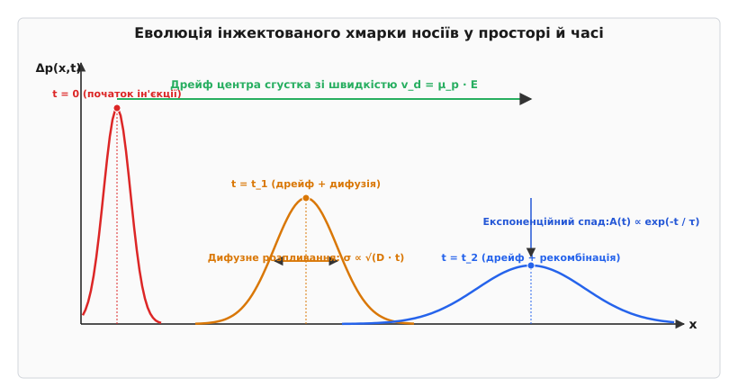

# Ін'єкція меншинних носіїв

<preknowlist>
- [PN-перехід](book:physics/pn-junction) — структура прямого та зворотного зміщення, потенціальний бар'єр та збіднена область.
- [Зонна структура й рівень Фермі](book:physics/energy-bands) — розташування валентної зони, зони провідності та квазірівнів Фермі при відхиленні від рівноваги.
- [Рухливість носіїв заряду](book:physics/carrier-mobility) — дрейф у зовнішньому електричному полі та зв'язок рухливості з коефіцієнтом дифузії через співвідношення Ейнштейна.
- [Рекомбінація Шокли — Рида — Холла (SRH)](book:physics/shockley-read-hall-recombination) — механізми рекомбінації через глибокі пастки та беквипромінювальний перехід.
</preknowlist>

Коли до напівпровідникового діода прикладають пряму напругу значенням усього в кілька десятих вольта, прилад миттєво перетворюється з високомного ізолятора на провідник, здатний пропускати струми в десятки ампер. Ця драматична зміна провідності є результатом ефекту **ін'єкції меншинних носіїв** (від латинського *injectio* — впорскування). Зовнішня напруга знижує внутрішній потенціальний бар'єр `p-n` переходу, внаслідок чого основні носії заряду з однієї області масово долають збіднену зону і потрапляють у суміжну область, де вони стають неосновними (меншинними) носіями.

Без ін'єкції меншинних носіїв фізика напівпровідникових приладів звелася б до звичайних омічних опорів. Саме поява надлишкових неосновних носіїв та їхній подальший транспорт у квазінейтральних областях визначає роботу біполярних транзисторів, світлодіодів, напівпровідникових лазерів, сонячних елементів та силових перемикачів. Кількісне розуміння того, як інжектовані носії поводяться в кристалі — як вони дифундують, дрейфують під дією електричних полів та рекомбінують, — становить фундамент фізики конденсованого стану й напівпровідникової мікроелектроніки.

---

### Пряме зміщення p-n переходу та межові умови Шоклі

У стані термодинамічної рівноваги за відсутності зовнішньої напруги `p-n` перехід перебуває в динамічному балансі. Внутрішнє електричне поле об'ємного заряду збідненої зони утворює потенціальний бар'єр висотою `V_bi` (контактна різниця потенціалів). Цей бар'єр протидіє дифузії основних носіїв: електрони з n-області не можуть масово перейти в p-область, а дірки з p-області — у n-область. Дифузійний струм основних носіїв строго врівноважується дрейфовим струмом теплових неосновних носіїв, а рівень Фермі `E_F` залишається єдиним і горизонтальним уздовж усього кристала.

При підключенні джерела прямого зміщення позитивний потенціал подається на p-область, а негативний — на n-область. Прикладена зовнішня напруга `V` компенсує частину внутрішнього поля, знижуючи потенціальний бар'єр до значення `V_bi - V`. Внаслідок експоненційного розподілу Максвелла — Больцмана кількість основних носіїв, що володіють енергією, достатньою для подолання зниженого бар'єра, зростає в `exp(q·V / (k·T))` разів.

Потік дірок із p-області прямує через збіднену зону у квазінейтральну n-область, а потік електронів із n-області — у p-область. Потрапляючи в суміжний напівпровідник, ці носії опиняються в середовищі, де їхня рівноважна концентрація є мізерно малою. Так виникає **нерівноважна ін'єкція**: концентрація неосновних носіїв на межі збідненої області катастрофічно перевищує свій рівноважний рівень.


*Концентраційний профіль носіїв заряду при прямому зміщенні p-n переходу. На межах збідненої зони (позначені x = 0) концентрації меншинних носіїв p_n(0) та n_p(0) зростають експоненційно згідно із Законом переходу Шоклі, після чого згасають углиб квазінейтральних областей за рахунок рекомбінації.*

Для математичного опису цього стану Вільям Шоклі сформулював межові умови, відомі як **Закон переходу Шоклі** (*Law of the Junction*). Припустивши, що в межах самісінької збідненої зони рекомбінація є незначною, а квазірівні Фермі для електронів `E_Fn` та дірок `E_Fp` залишаються практично плоскими, расщеплення квазірівнів Фермі дорівнює прикладеній напрузі:

```
E_Fn - E_Fp = q · V
```

Концентрація дірок `p_n(0)` у n-області безпосередньо на межі зі збідненою зоною пов'язана з рівноважною концентрацією дірок `p_n0` співвідношенням:

```
p_n(0) = p_n0 · exp( q · V / (k · T) )
```

Аналогічно, концентрація електронів `n_p(0)` у p-області на межі збідненого шару становить:

```
n_p(0) = n_p0 · exp( q · V / (k · T) )
```

Тут `k` — стала Больцмана, `T` — абсолютна температура, `q` — елементарний заряд, а величина `V_t = (k · T) / q` називається **тепловим потенціалом** (близько `25.9 мВ` за кімнатної температури `300 K`).

Надлишкова концентрація меншинних носіїв `Δp_n(0)` на межі визначається як різниця між повною та рівноважною концентраціями:

```
Δp_n(0) = p_n(0) - p_n0 = p_n0 · ( exp( q · V / (k · T) ) - 1 )
```

Ці межові умови є відправною точкою для розрахунку розподілу носіїв у будь-якому інжекційному приладі.

---

### Рівні ін'єкції: Низький проти високого рівнів та амбіполярний транспорт

Фізична поведінка інжектованої хмарки меншинних носіїв принципово залежить від співвідношення між концентрацією інжектованих частинок `Δp` та рівноважною концентрацією основних носіїв у кристалі (наприклад, `n_n0` для n-типу). За цим критерієм розрізняють два фізичних режими: **низький рівень ін'єкції** (*low-level injection*) та **високий рівень ін'єкції** (*high-level injection*).


*Схематичне порівняння режимів ін'єкції у напівпровіднику n-типу. При низькому рівні ін'єкції (ліворуч) Δp << n_n0, концентрація основних носіїв залишається незмінною. При високому рівні ін'єкції (праворуч) Δp ≥ n_n0, квазінейтральність вимагає накопичення додаткових основних електронів Δn ≈ Δp, що викликає амбіполярний ефект.*

#### 1. Низький рівень ін'єкції (`Δp << n_n0`)

Режим низького рівня ін'єкції виконується у більшості малосигнальних напівпровідникових приладів, коли кількість впорсканих дірок набагато менша за концентрацію легуючої донорної домішки `N_D`:

```
Δp << n_n0 ≈ N_D
```

У цьому режимі напівпровідник демонструє три вирішальні спрощення:

- **Сталість провідності та концентрації основних носіїв**: Оскільки `Δp` становить лише частки відсотка від `n_n0`, концентрація основних електронів практично не змінюється: `n_n ≈ n_n0`.
- **Відсутність внутрішнього електричного поля**: Квазінейтральна область напівпровідника залишається електрично нейтральною без залучення помітних додаткових основних носіїв. Поле в об'ємі прямує до нуля (`E ≈ 0`), тому транспорт меншинних носіїв є **суто дифузійним**.
- **Лінійна рекомбінація та сталий час життя `τ`**: Швидкість рекомбінації неосновних носіїв строго лінійно залежить від їхньої надлишкової концентрації: `U = Δp / τ_p`, де час життя `τ_p` є константою матеріалу.

#### 2. Високий рівень ін'єкції (`Δp ≥ n_n0`)

Коли прямий струм через перехід зростає настільки, що надлишкова концентрація впорсканих дірок досягає або перевищує концентрацію основних електронів (`Δp ≥ n_n0`), фізика транспорту радикально змінюється.

Щоб зберегти квазінейтральність напівпровідника, кристал мусить утримувати в інжекційній зоні таку ж кількість додаткових основних електронів: `Δn ≈ Δp`. Це призводить до низки важливих ефектів:

1. **Амбіполярний транспорт**: Електрони володіють вищою рухливістю, ніж дірки (`μ_n > μ_p`). Намагаючись випередити дірки під час дифузії, електрони створюють мікроскопічне просторове розділення заряду. Це розділення породжує внутрішнє **амбіполярне електричне поле** `E_amb`. Це поле гальмує швидші електрони й прискорює повільніші дірки, примушуючи обидва типи носіїв рухатися єдиним зв'язаним плазмовим сгустком із **амбіполярним коефіцієнтом дифузії** `D_amb`:

```
D_amb = ( (n + p) · D_n · D_p ) / ( n · D_n + p · D_p )
```

У граничному разі дуже високої ін'єкції (`n ≈ p ≈ Δp`) коефіцієнт `D_amb` прямує до гармонійного середнього: `D_amb → 2 · D_n · D_p / (D_n + D_p)`.

2. **Ефект Вебстера (Webster effect)**: У біполярних транзисторах при високому рівні ін'єкції в базу концентрація основних носіїв у базі зростає, що підвищує емітерний струм відновлення й викликає різке падіння коефіцієнта підсилення струму `β`.

3. **Модуляція провідності**: Впорскування величезної кількості електрон-діркової плазми у слаболеговану розширену область (наприклад, у `i`-базу `PIN`-діода або `IGBT`-транзистора) знижує її опір на 2–3 порядки. Це явище дозволяє силовим приладам витримувати тисячі вольт у закритому стані й мати мізерне падіння напруги у відкритому стані.

Детальний математичний вивід рівняння неперервності для обидвох рівнів ін'єкції наведено у вставці [Рівняння неперервності та рівні ін'єкції](book:physics/condensed-matter-physics/minority-carrier-injection/math-continuity-equation.md).

---

### Динаміка рекомбінації та час життя носіїв τ

Інжектовані неосновні носії перебувають у нерівноважному стані. Якщо ін'єкцію раптово вимкнути, надлишкова концентрація `Δp` почне релаксувати до нуля за рахунок рекомбінації з основними носіями. Фізична величина `τ_p`, яка визначає середній час існування неосновного носія від моменту його ін'єкції до акту анігіляції з основним носієм, називається **об'ємним часом життя меншинних носіїв** (*minority carrier lifetime*).

Часова релаксація надлишкового заряду описується простим диференціальним рівнянням першого порядку:

```
d(Δp) / dt = - Δp / τ_p
```

Розв'язком якого є експоненційний спад: `Δp(t) = Δp(0) · exp(-t / τ_p)`.

Суммарна швидкість рекомбінації у напівпровідниковому кристалі складається з кількох паралельних фізичних каналів, кожен із яких характеризується власним часом життя:

```
1 / τ_eff = 1 / τ_SRH + 1 / τ_rad + 1 / τ_Auger + 1 / τ_surf
```

```
                        [ Загальний час життя τ_eff ]
                                      │
     ┌──────────────────┬─────────────┴────────────┬──────────────────┐
     ▼                  ▼                          ▼                  ▼
[ Безвипромінювальна ]  [ Випромінювальна ]      [ Оже-рекомбінація ] [ Поверхнева ]
[     SRH          ]  [   міжзонна      ]      [  (три частинки)  ] [ рекомбінація ]
[ Глибокі пастки   ]  [ Фотони (GaAs)   ]      [ Високий струм    ] [ Дефекти межі ]
```

#### 1. Рекомбінація Шокли — Рида — Холла (SRH)

У непрямозонних напівпровідниках, таких як кремній (`Si`) та германій (`Ge`), прямий міжзонний перехід електрона з зони провідності у валентну зону є малоймовірним, оскільки він вимагає одночасної зміни імпульсу (участі фонона). Тому домінуючим каналом рекомбінації є безвипромінювальний перехід через глибокі енергетичні рівні у забороненій зоні — **пастки рекомбінації**, утворені домішками важких металів (золото, платина) або дефектами кристалічної ґратки.

Згідно з теорією Шокли — Рида — Холла, час життя `τ_SRH` залежить від концентрації пасток `N_t` та їхнього перерізу захоплення `σ_t`:

```
τ_SRH = 1 / ( N_t · σ_t · v_th )
```

де `v_th` — теплова швидкість носіїв (приблизно `10⁷ см/с`).

#### 2. Пряма випромінювальна рекомбінація (`τ_rad`)

У прямозонних напівпровідниках (сполуки `AᴵᴵᴵBⱽ`: `GaAs`, `GaN`, `InP`) електрони й дірки рекомбінують безпосередньо з випромінюванням фотона світла. Швидкість випромінювальної рекомбінації пропорційна добутку концентрацій `R_rad = B · n · p`. Для низького рівня ін'єкції у напівпровіднику n-типу випромінювальний час життя дорівнює:

```
τ_rad = 1 / ( B · n_n0 )
```

де `B` — коефіцієнт міжзонної випромінювальної рекомбінації (для `GaAs` `B ≈ 7·10⁻¹⁰ см³/с`). Саме цей процес лежить в основі роботи світлодіодів та напівпровідникових лазерів.

#### 3. Оже-рекомбінація (`τ_Auger`)

Оже-рекомбінація є беквипромінювальним тричастинковим процесом: електрон і дірка рекомбінують, але вивільнена енергія передається не фотону чи фонону, а третьому носію заряду (електрону або дірці), який переходить високо в зону. Швидкість Оже-рекомбінації пропорційна квадрату концентрації основних носіїв: `R_Auger = C_n · n² · p`. Оже-процеси стають домінуючими при дуже високих рівнях ін'єкції або у високолегованих областях (`N_D > 10¹⁸ см⁻³`), обмежуючи максимальну яскравість світлодіодів (ефект Droop) та критичний струм силових приладів.

#### 4. Поверхнева рекомбінація та швидкість S

Поверхня кристала являє собою середовище з обірваними ковалентними зв'язками (*dangling bonds*) та високою щільністю поверхневих станів. Інтенсивність поверхневої рекомбінації характеризується **швидкістю поверхневої рекомбінації** `S` (одниця виміру — `см/с` або `м/с`). Густина поверхневого струму рекомбінації становить:

```
J_surf = q · S · Δp_surface
```

Для непасивованої поверхні кремнію `S` може досягати `10⁵ ... 10⁶ см/с`, що призводить до миттєвого згасання інжектованого заряду біля поверхонь. Сучасна технологія сонячних елементів та мікросхем обов'язково включає **пасивацію поверхні** — вирощування тонких шарів диоксиду кремнію (`SiO₂`), нітриду кремнію (`Si₃N₄`) або оксиду алюмінію (`Al₂O₃`), що знижує швидкість `S` до значень, менших за `10 см/с`.

Для пластини товщиною `W` ефективний час життя з урахуванням поверхні визначається як:

```
1 / τ_eff = 1 / τ_bulk + ( 2 · S / W )
```

---

### Дифузійна довжина L_n, L_p та просторовий спад носіїв

Інжектовані неосновні носії перебувають у безперервному хаотичному тепловому русі. Навіть за відсутності електричного поля градієнт концентрації примушує їх дифундувати від межі ін'єкції вглиб квазінейтральної області. Упродовж цього дифузійного руху носія одночасно піддаються рекомбінації.

Стаціонарний розподіл надлишкових дірок `Δp(x)` у квазінейтральній n-області описується одновимірним диференціальним рівнянням дифузії та рекомбінації:

```
D_p · ( d²(Δp) / dx² ) - ( Δp / τ_p ) = 0
```

Переписавши це рівняння у канонічному вигляді:

```
d²(Δp) / dx² - ( Δp / L_p² ) = 0
```

ми вводимо фундаментальний просторовий параметр — **дифузійну довжину меншинних носіїв** `L_p`:

```
L_p = √( D_p · τ_p )
```

Аналогічно, для неосновних електронів у p-області дифузійна довжина становить: `L_n = √( D_n · τ_n )`.

**Фізичний зміст дифузійної довжини `L_p`**: це середня просторова відстань, яку неосновний носій заряду встигає пройти шляхом хаотичного дифузійного блукання від точки ін'єкції до моменту анігіляції в акті рекомбінації.

Розв'язок рівняння для напівнескінченного напівпровідника з межовою умовою Шоклі `Δp(0)` дає експоненційний профіль спаду концентрації:

```
Δp(x) = Δp(0) · exp( -x / L_p )
```

На відстані `x = L_p` надлишкова концентрація меншинних носіїв зменшується в `e ≈ 2.718` раза, а на відстані `x = 3·L_p` вона падає на 95%.

```
Концентрація Δp(x)
  ▲
  │  █ Δp(0) [Межова ін'єкція]
  │  ██
  │  ███
  │  ████
  │  ██████ █ Δp(0)/e   (x = L_p)
  │  ███████████
  │  ████████████████ █ Δp(0)/e² (x = 2 L_p)
  └─────────────────────────────────────────► Координата x
     0        L_p       2·L_p     3·L_p
```

Дифузійний струм дірок `J_p(x)` у будь-якій точці n-області пропорційний градієнту їхньої концентрації:

```
J_p(x) = - q · D_p · ( d(Δp) / dx ) = ( q · D_p · Δp(0) / L_p ) · exp( -x / L_p )
```

Густина інжектованого дифузійного струму на самій межі `x = 0` становить:

```
J_p(0) = ( q · D_p · p_n0 / L_p ) · ( exp( q·V / (k·T) ) - 1 )
```

Цей вираз чітко показує: чим більша дифузійна довжина `L_p` та коефіцієнт дифузії `D_p`, тим легше меншинні носія проникають углиб напівпровідника, і тим більший дифузійний струм протікає через p-n перехід.

---

### Експеримент Гейнса — Шоклі: Прямий вимір дрейфу, дифузії та часу життя

Хоча теорія ін'єкції меншинних носіїв математично була сформована Вільямом Шоклі наприкінці 1940-х років, наукова спільнота вимагала прямого доказу того, що неосновні носії справді можуть існувати як вільні об'ємні частинки, рухатися під дією поля та дифундувати.

У 1949–1951 роках Джон Гейнс та Вільям Шоклі з Bell Labs провели блискучий експеримент, який став класикою фізики напівпровідників.


*Принципова схема експериментальної установки Гейнса — Шоклі. Емітерний контакт інжектує імпульс дірок у n-германієвий брусок. Тягнуче поле E переміщує хмарку до колекторного контакту на відстані d, де осцилограф фіксує часову затримку, розширення та загасання сигналу.*

Експериментальна установка складалася з монокристалічного бруска германію n-типу, уздовж якого за допомогою постійної напруги створювалося тягнуче електричне поле `E`. На поверхні бруска на фіксованій відстані `d` один від одного розташовувалися два точкові контакти:
- **Емітер**: подавав короткий токовий імпульс позитивної полярності, який інжектував вузький сгусток неосновних дірок `Δp` в n-область.
- **Колектор**: точковий діод під зворотним зміщенням, який реєстрував проходження діркового сгустка й передавав сигнал на осцилограф.

Упродовж руху вздовж бруска інжектована хмарка дірок зазнавала трьох одночасних фізичних трансформацій:


*Просторово-часова еволюція сгустка меншинних носіїв. Центр пакета зміщується вправо завдяки дрейфу (v_d = μ_p · E), ширина пакета зростає через дифузію (σ ∝ √(D·t)), а амплітуда падає через рекомбінацію (exp(-t/τ)).*

1. **Дрейф (переміщення центра)**: Постійне поле `E` зміщувало центр пакета зі швидкістю `v_d = μ_p · E`. Час прольоту максимуму пакета до колектора становив `t_0 = d / (μ_p · E)`. Вимірявши затримку `t_0` при відомих `d` та `E`, Гейнс і Шоклі безпосередньо обчислили **рухливість меншинних носіїв `μ_p`**.

2. **Дифузія (розширення форми)**: Під час руху хмарка розпливалася внаслідок хаотичного теплового руху дірок. Початково вузький імпульс набував гаусової форми з дисперсією `σ² = 2 · D_p · t`. Вимірявши напівширину імпульсу на екрані осцилографа, фізики обчислили **коефіцієнт дифузії `D_p`**.

3. **Рекомбінація (зменшення площі)**: З часом кількість дірок у хмарці зменшувалася внаслідок рекомбінації з основними електронами. Інтегральна площа під кривою імпульсу зменшувалася як `exp(-t / τ_p)`. Змінюючи напруженість поля `E` і відповідно час прольоту `t_0`, дослідники точно розрахували **об'ємний час життя `τ_p`**.

Головним результатом експерименту Гейнса — Шоклі стало перше пряме експериментальне підтвердження **співвідношення Ейнштейна** для напівпровідників:

```
D_p / μ_p = ( k · T ) / q
```

Детальніше про драматичні дискусії довкола цього досліду та його значення для створення транзистора описано у вставці [Історія експерименту Гейнса — Шоклі та вимірювання дрейфу і дифузії](book:physics/minority-carrier-injection/hist-haynes-shockley.md). Моделювання еволюції імпульсу за допомогою скінченно-різницевого алгоритму наведено у вставці [Чисельна симуляція експерименту Гейнса — Шоклі](book:physics/minority-carrier-injection/proj-haynes-shockley-sim.md).

---

### Практичне застосування та інженерні виклики

> 🔧 **Навіщо це.**
> Ін'єкція меншинних носіїв — це фундаментальний привід, чому працюють активні напівпровідникові прилади. Розуміння та контроль ін'єкції дозволяє інженерам керувати струмами, створювати джерела світла та оптимізувати перетворювачі енергії.

#### 1. Біполярні транзистори (BJT)

Робота біполярного транзистора спирається на ін'єкцію меншинних носіїв з емітера у вузьку базу та їхнє подальше збирання колектором. Для досягнення високого коефіцієнта підсилення струму `β` інженери вирішують два фундаментальні завдання:

- **Коефіцієнт ін'єкції емітера `γ`**: Емітер легують на 2–3 порядки сильніше за базу (`N_emitter >> N_base`). Це забезпечує те, що струм через емітерний перехід майже на 100% складається з ін'єкції носіїв у базу, а не навпаки.
- **Товщина бази `W_b`**: Ширину бази роблять набагато меншою за дифузійну довжину меншинних носіїв (`W_b << L_base`). У такому разі понад 99% інжектованих носіїв пролітають базу без рекомбінації й досягають колектора. Час прольоту бази становить `τ_b = W_b² / (2 · D)`.

#### 2. Світлодіоди (LED) та напівпровідникові лазери

У світлодіодах пряме зміщення інжектує електрони й дірки в активну область (або квантові ями). Там вони рекомбінують випромінювально, перетворюючи електричний струм на фотони світла. Внутрішній квантовий вихід `IQE` залежить від співвідношення випромінювального та безвипромінювального часів життя:

```
IQE = (1 / τ_rad) / ( 1 / τ_rad + 1 / τ_SRH + 1 / τ_Auger )
```

Щоб досягти високої ефективності, напівпровідникові гетероструктури ростять із високою кристалічною досконалістю (мінімізація `1 / τ_SRH`) та пасивують гетеромежі.

#### 3. Сонячні елементи та фотодетектори

У сонячних елементах відбувається зворотний процес: світло ґенерує електрон-діркові пари в об'ємі напівпровідника. Щоб перетворити ці носії на електричний струм, фотозгенеровані меншинні носії мусять дифундувати до `p-n` переходу, не рекомбінувавши по дорозі.

Тому головною вимогою до сонячного кремнію є **велика дифузійна довжина `L_minority`**, яка повинна перевищувати товщину пластини (`L_p > 200 мкм`). Це вимагає надчистого монокристалічного кремнію з часом життя `τ > 1 мс`.

#### 4. Швидкодія та проблема зворотного відновлення (Reverse Recovery)

Коли силовий `PIN`-діод або `IGBT`-транзистор працює у відкритому стані під великим струмом, його об'єм заповнений величезною кількістю інжектованої електрон-діркової плазми.

При раптовому перемиканні напруги на зворотну прилад не може закритися негайно. Упродовж **часу зворотного відновлення** `t_rr` збережений надлишковий заряд меншинних носіїв мусить розсмоктатися за рахунок зворотного струму виведення та внутрішньої рекомбінації. Це викликає величезні динамічні втрати потужності `P_loss = V_reverse · I_recovery`.

Щоб створити швидкодіючі діоди (Fast Recovery Diodes), інженери навмисно виконують **легування пастками рекомбінації** (*lifetime killing*) — легують кремній золотом (`Au`) або платиною (`Pt`), чи піддають його електронному й протонному опроміненню. Це зменшує час життя `τ` з десятків мікросекунд до кількох наносекунд, прискорюючи вимкнення приладу в сотні разів.
