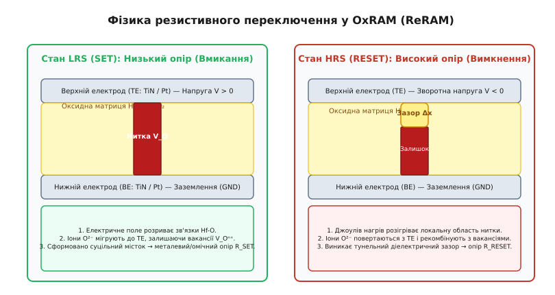
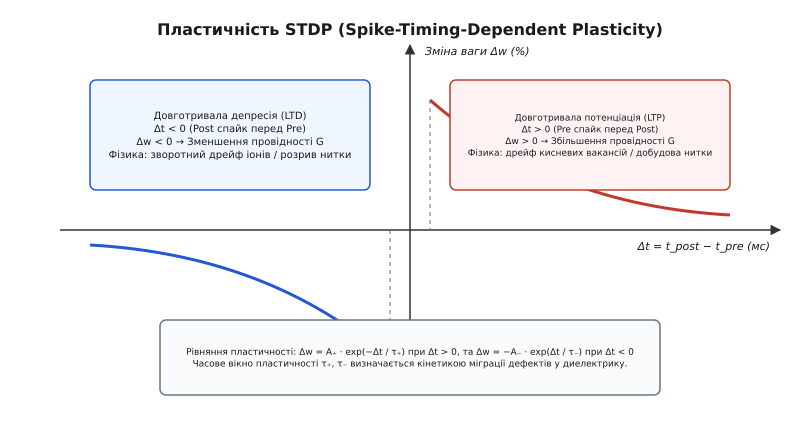
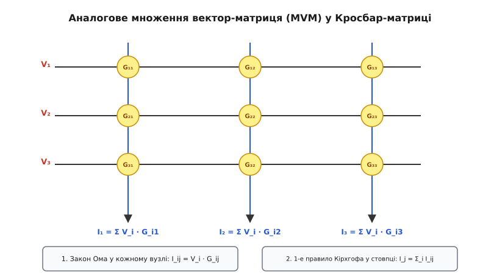

# Фізика нейроморфних пристроїв та штучних синапсів

<preknowlist>
- [Іонні провідники](book:physics/condensed-matter-physics/ionic-conductor) — міграція вакансій та іонів у твердих тілах під дією електричного поля.
- [p-n перехід](book:physics/condensed-matter-physics/pn-junction) — генерація дефектів, тунелювання та дрейфово-дифузійні струми.
- [Електричний опір](book:physics/condensed-matter-physics/resistance) — закон Ома, омічні та нелінійні вольт-амперні характеристики.
</preknowlist>

Коли обчисливальні алгоритми штучного інтелекту виконуються на класичних цифрових мікропроцесорах, до 90% усієї електроенергії витрачається не на арифметичні розрахунки, а на постійне переміщення бітових масивів між кремнієвим ядром процесора та зовнішньою динамічною пам'яттю DRAM через вузькі металеві шини. Спроба масштабувати глибинні нейронні мережі на процесорах класичної архітектури наражається на фундаментальну енергетичну перешкоду: кожен виклик синаптичної ваги вимагає заряджання та розряджання паразитичних ємностей довгих провідників, що споживає десятки пікоджоулів енергії. Живий біологічний мозок вирішує аналогічну задачу розпізнавання складних образів у реальному часі, витрачаючи лише близько 20 ват потужності. Ця фундаментальна різниця виникає з того, що біологічна нервова тканина не має розділення на «процесор» і «пам'ять»: кожна синаптична шпарина одночасно є і носієм збереженої інформації (синаптичної ваги), і фізичним середовищем, де прихід електрохімічного імпульсу негайно перетворюється на аналоговий струм.

Фізика нейроморфних пристроїв та штучних синапсів створює твердотільну альтернативу цифровим обчисленням за рахунок використання внутрішніх матеріальних властивостей конденсованого стану — дрейфу кисневих вакансій, фазових перетворень халькогенідів, поляризації сегнетоелектриків та іонної інтеркаляції.

## 1. Обмеження архітектури фон Неймана та концепція Compute-in-Memory

У класичному цифровому обчислювачі базовою операцією штучних нейронних мереж є множення матриці вагових коефіцієнтів `W` на вектор вхідних сигналів `X`. Щоб обчислити один нейронний шар із `10⁴` входами та `10⁴` виходами, цифровий процесор мусить послідовно зчитати `10⁸` чисел з пам'яті, зберегти їх у регістрах арифметично-логічного пристрою (АЛЮ), виконати операції множення та накопичення (Multiply-Accumulate, MAC) і записати результат назад у пам'ять.

Вузкополосне передавання даних між обчислювальним блоком і пам'яттю називається **фон-нейманівським пляшковим горлом** (*Von Neumann bottleneck*). При зменшенні технологічної норми транзисторів нижче 7 нанометрів енергетика самого переключання транзистора знизилася до фемтоджоулів, проте енергія перезарядки шини міжпроцесорного зв'язку залишилася на рівні `10–100` пікоджоулів за один біт даних. Фізичною причиною є паразитична ємність металевих провідників `C_line`, яка пропорційна довжині шини `L`. При перезарядці шини напругою `V` виділяється теплова енергія:

```
E_loss = 1/2 · C_line · V²      [Енергетичні втрати на перезарядку шини зв'язку]
```

При частотах 3 ГГц та тисячах паралельних ліній зв'язку це призводить до виділення сотень ват тепла, що обмежує продуктивність обчислювачів.

```
Класична архітектура фон Неймана (Обчислення розділені з пам'яттю):

 ┌─────────────────┐  Дані / Інструкції (10–100 pJ/біт)  ┌─────────────────┐
 │   Процесор     │ ◄──────────────────────────────────► │  Пам'ять DRAM   │
 │ (АЛЮ + Регістри)│                                     │  (Матриця ваг)  │
 └─────────────────┘                                     └─────────────────┘
    Високі енергетичні втрати на перезарядку довгих шин зв'язку

 Архітектура Compute-in-Memory (Обчислення безпосередньо у пам'яті):

 ┌─────────────────────────────────────────────────────────────────────────┐
 │               Аналоговий штучний кросбар (ReRAM / PCM)                  │
 │  Синаптичний вузол (i, j) ───► Одночасно зберігає вагу G_ij            │
 │                                та виконує множення I_ij = V_i · G_ij    │
 └─────────────────────────────────────────────────────────────────────────┘
    Енергетичні витрати ~1–10 fJ на синаптичну операцію (SOP)
```

Альтернативний підхід — **обчислення у пам'яті** (*Compute-in-Memory, CIM*) — відмовляється від передавання вагових коефіцієнтів. Вагові коефіцієнти кодуються фізичною провідністю `G` двополюсних або триполюсних наноструктур, об'єднаних у двовимірні матриці (кросбари). Вхідні дані подаються у вигляді електричних напруг `V`, а множення та додавання відбуваються миттєво безпосередньо у матеріалі матриці відповідно до фундаментальних законів електродинаміки.

Детальна хронологія формування теоретичної бази та відкриття перших нанорозмірних штучних синапсів викладена у [історії розвитку мемристорів та штучних синапсів](book:physics/condensed-matter-physics/neuromorphic-devices-physics/hist-synaptic-memristor-evolution.md).

## 2. Фізичні механізми переключення опору та багаторівневі стани

Щоб пристрій міг виконувати роль штучного синапсу, його електричний опір `R` (або провідність `G = 1 / R`) мусить не лише змінюватися під дією зовнішнього електричного поля, а й зберігати задане аналогове значення протягом тривалого часу після зняття напруги. У фізиці конденсованого стану це реалізується за рахунок чотирьох основних мікроскопічних механізмів.

### Оксидно-резистивне ниткове переключення (OxRAM / ReRAM)

У структурах типу «метал — оксид — метал» (наприклад, `TiN / HfO₂ / Ti / TiN`) діелектричний шар `HfO₂` товщиною від 3 до 10 нанометрів містить кристалографічні дефекти. При прикладенні первинної напруги формування (*Electroforming*) високе електричне поле `E > 10⁶` В/см розриває ковалентні зв'язки `Hf−O`. Негативно заряджені іони кисню `O²⁻` дрейфують до верхнього позитивного електрода, який виконує роль резервуара кисню, залишаючи в оксиді позитивно заряджені кисневі вакансії `V_Oⁿ⁺`.


*Фізичний механізм переключення в ReRAM/OxRAM: ліворуч — низькоопоковий стан LRS (SET, сформовано суцільну провідну нитку кисневих вакансій V_O); праворуч — високоопоковий стан HRS (RESET, Джоулів нагрів викликав рекомбінацію з іонами O²⁻ та розрив нитки).*

При процесі **SET** (потенціація) позитивний імпульс напруги змушує вакансії накопичуватися вздовж лінії найвищої напруженості поля. Утворюється суцільний атомарний місток — провідний філамент (*Conductive Filament, CF*). Опір пристрою падає до стану LRS (*Low Resistance State*), причому провідність визначається квантовим мезоскопічним транспортом крізь атомарний точковий контакт:

```
G = n · G₀ = n · (2 · e² / h)      [Квантування провідності: G₀ ≈ 77.48 мкСм]
```

де `e` — заряд електрона, `h` — константа Планка, а `n` — кількість квантових каналів провідності у найвужчому перетині нитки.

При процесі **RESET** (депресія) від'ємний імпульс напруги створює зворотне поле, але вирішальну роль починає відігравати локальний **Джоулів нагрів**. Струм, що протікає крізь вузьку нитку діаметром 2–5 нанометрів, розігріває оксид до температур `T > 600` Кельвінів. Висока температура активує термічну дифузію іонів кисню `O²⁻` з резервуара назад у шар `HfO₂`, де вони рекомбінують з вакансіями. Нитка розривається, утворюючи тунельний зазор `Δx`. 

Опір зростає до стану HRS (*High Resistance State*). У цьому стані перенесення носіїв визначається двома конкурентними фізичними механізмами:
1. **Пряме квантове тунелювання електронів** крізь діелектричний зазор `Δx`:
   ```
   I_tunnel(V) ∝ V · exp(−2 · √(2 · m* · Φ_B) / ℏ · Δx)
   ```
2. **Термоелектронна емісія Пула — Френкеля** крізь пастки у забороненій зоні:
   ```
   J_PF ∝ E · exp(−(q · Φ_t − q · √(q · E / (π · ε_0 · ε_r))) / (k_B · T))
   ```
де `Φ_t` — глибина пасток, а `ε_r` — високочастотна діелектрична проникність оксиду.

### Термодинаміка фазових перетворень (Phase Change Memory, PCM)

У синаптичних елементах на матеріалах зі зміною фазового стану (наприклад, халькогенідний сплав `Ge₂Sb₂Te₅` — GST) опір кодується атомарною впорядкованістю кристалічної ґратки.

Аморфний стан халькогеніду позбавлений далекого порядку, має високу заборонену зону і формує високий опір (`R_RESET ≈ 10⁷` Ом). Подача імпульсу напруги з амплітудою, що розігріває матеріал вище температури кристалізації (`T_crys ≈ 200` °C), але нижче точки плавлення (`T_melt ≈ 600` °C), викликає нуклеацію та ріст кристалічних зерен. Кристалічний стан володіє високою концентрацією вільних носіїв і низьким опором (`R_SET ≈ 10³` Ом).

Кінетика кристалізації описується рівнянням Джонсона — Мела — Аврамі:

```
x_crys(t) = 1 − exp(−K_crys · tⁿ_Avrami)      [Об'ємна частка кристалічної фази]
```

Регулюючи тривалість та амплітуду електричних імпульсів, можна контролювати об'ємну частку кристалічної фази `x_crys`, отримуючи понад 64 стабільних аналогових рівнів провідності.

Проте аморфний стан PCM піддається ефекту **структурної релаксації** (Resistance Drift), при якому з часом атоми аморфної матриці повільно зменшують механічне напруження, а заборонена зона позбавляється підпорогових станів. Це викликає часовий дрейф опору:

```
R(t) = R_0 · (t / t_0)^ν_drift      [Закон часового дрейфу опору PCM: ν_drift ≈ 0.05–0.1]
```

### Сегнетоелектричні тунельні переходи (FTJ) та електрохімічні триоди (ECRAM)

У сегнетоелектричних тунельних переходах (FTJ) шар діелектрика виконується з сегнетоелектрика (наприклад, легованого цирконієм `HfO₂` — HZO). Переключення напрямку спонтанної дипольної поляризації `P` під дією зовнішнього поля змінює електростатичний потенціал на інтерфейсах електродів, що модулює ефективну висоту тунельного бар'єра `Φ_B` без переміщення атомів.

Динаміка сегнетоелектричного переключення доменів описується моделлю Колмогорова — Аврамі — Ішібаші (KAI):

```
ΔP(t) = 2 · P_s · [1 − exp(−(t / t_switch)^n_domain)]
```

де `P_s` — спонтанна поляризація, `t_switch` — час переключення домену, а `n_domain` — вимірність росту доменних стінок.

Електрохімічна оперативна пам'ять (ECRAM) являє собою тритермінальний пристрій, у якому провідність напівпровідникового каналу (`WO₃` або `TiO₂`) модулюється інтеркаляцією іонів літію `Li⁺` або протонів `H⁺` з твердого електроліту. Зміна ступеня інтеркаляції змінює концентрацію вільних електронів у каналі, забезпечуючи ідеально лінійну та симетричну зміну опору.

Детальні порівняльні характеристики всіх чотирьох технологічних класів наведено у [порівнянні фізичних типів штучних синапсів](book:physics/condensed-matter-physics/neuromorphic-devices-physics/comp-memristive-synapse-types.md).

## 3. Біофізика синаптичної пластичності: LTP, LTD та алгоритм STDP

У живих біологічних нейромережах зв'язок між нейронами не є статичним. Здатність синапсу змінювати свою провідність у відповідь на електричну активність називається **синаптичною пластичністю**.

Підсилення синаптичного зв'язку називається **довготривалою потенціацією** (*Long-Term Potentiation, LTP*), а його послаблення — **довготривалою депресією** (*Long-Term Depression, LTD*). У біології LTP та LTD регулюються концентрацією іонів кальцію `Ca²⁺` у постсинаптичному ущільненні та кількістю рецепторів AMPA.

У напівпровідникових штучних синапсах роль біологічних іонів виконують кисневі вакансії `V_Oⁿ⁺`, аморфно-кристалічні межі або інтеркальовані іони `Li⁺`. Подача послідовності однотипних електричних імпульсів зазвичай викликає поступову зміну провідності `G`.


*Пластичність STDP: при Δt > 0 відбувається потенціація LTP (підсилення провідності G), при Δt < 0 — депресія LTD (послаблення провідності G).*

Найважливішим біологічним алгоритмом самонавчання без учителя є **часово-залежна пластичність синапсів** (*Spike-Timing-Dependent Plasticity, STDP*). При STDP величина та знак зміни синаптичної ваги `Δw` визначаються точною затримкою за часом `Δt = t_post − t_pre` між моментом приходу імпульсу від пресинаптичного нейрона `t_pre` та моментом генерації спайка постсинаптичним нейроном `t_post`:

1. **Причинний зв'язок (`Δt > 0`):** Пресинаптичний імпульс передує постсинаптичному (`t_pre < t_post`). Мозок інтерпретує це як те, що даний синапс брав участь у активації постсинаптичного нейрона. Фізично це викликає дрейф вакансій убік розширення нитки або кристалізацію — відбувається потенціація **LTP** (`Δw > 0`).
2. **Апричинний зв'язок (`Δt < 0`):** Постсинаптичний нейрон згенерував спайк раніше, ніж прийшов пресинаптичний імпульс (`t_post < t_pre`). Синапс не брав участі у підпороговому сумуванні. Зовнішнє поле змінює знак, викликаючи рекомбінацію дефектів або аморфізацію — відбувається депресія **LTD** (`Δw < 0`).

Феноменологічні рівняння STDP пластичності та їхній вплив на оновлення вагових матриць виведено у [математичному моделюванні синаптичної пластичності STDP](book:physics/condensed-matter-physics/neuromorphic-devices-physics/math-stdp-learning-rule.md).

## 4. Аналогові вагові матриці (Crossbar Arrays) та обчислення за законами Кірхгофа

Найвищий ступінь паралелізму штучних синапсів досягається при їх об'єднанні у двовимірну сітку — **кросбар-матрицю** (*Crossbar Array*). У цій архітектурі горизонтальні металеві шини (Word Lines, WL) виконують роль пресинаптичних аксонів, а вертикальні шини (Bit Lines, BL) — роль постсинаптичних дендритів. На кожному перетині шин впаяно двополюсний штучний синапс із провідністю `G_ij`.


*Аналогова матриця кросбар для множення матриці на вектор (MVM): вхідні напруги V_i множаться на синаптичні провідності G_ij (Закон Ома), а вихідні струми I_j підсумовуються уздовж стовпчиків (Перше правило Кірхгофа).*

Фізика аналогового множення вектор-матриця (MVM) спирається на два класичні закони електродинаміки:

1. **Локальне множення за Законом Ома:** Подача напруги `V_i` на `i`-й рядок викликає у вузлі `(i, j)` струм `I_ij`, пропорційний провідності мемристора `G_ij`:
   ```
   I_ij = V_i · G_ij      [Закон Ома: струм вузла є добутком вхідної напруги та провідності]
   ```
2. **Просторове додавання за Першим правилом Кірхгофа:** Струми від усіх `M` синапсів, підключених до `j`-го стовпчика, зливаються у спільну металеву шину Bit Line. Законом збереження електричного заряду підсумковий струм `I_j` дорівнює їхній сумі:
   ```
   I_j = ∑_(i=1)^M I_ij = ∑_(i=1)^M (V_i · G_ij)      [Перше правило Кірхгофа: аналогове сумування струмів]
   ```

Вся операція множення вектор-матриці обчислюється у фізичному середовищі за один такт, визначений лише часом поширення фронту напруги по металевих провідниках (~10–100 пікосекунд).

### Пасивні та активні архітектури селекторів (1R vs 1T1R, 1S1R)

У чистій пасивній матриці (схема 1R) при читанні або записі осередку `(i, j)` виникає проблема **паразитичних струмів витоку** (*Sneak-path Currents*). Струм від напруги `V_i` шунтується крізь суміжні необрані мемристори, які перебувають у низькоопоковому стані LRS, спотворюючи вихідний струм стовпчика.

```
       Проблема паразитичних струмів витоку (Sneak-path) у 1R кросбарі:

     V_in ───────► ( i, j ) ───────► I_target
                     │
                     ▼ (Витік крізь LRS синапси)
                   ( i+1, j ) ───► ( i+1, j+1 ) ───► Помилковий струм
```

Для вирішення цієї проблеми розроблено три типи осередків:
1. **Схема 1T1R (Один транзистор — один резистор):** Послідовно з мемристором впаяно полевий транзистор MOSFET, затвор якого підключено до Word Line. Затвор відсікає необрані осередки, знижуючи витік до нульового рівня.
2. **Схема 1S1R (Один селектор — один резистор):** Замість транзистора використовується двополюсний порогам селектор на основі аморфних овшатів (Ovonic Threshold Switch, OTS) або метало-діелектричного переходу Мотта. При напругах `V < V_th` селектор має опір `R > 10⁸` Ом, відсікаючи паразитичні струми.
3. **Об'ємні 3D VRRAM кросбари (Vertical ReRAM):** Вертикальне штабелювання металевих електродів із циліндричними оксидними шарами, що дозволяє досягти рекордної щільності пам'яті до `10¹²` синапсів на квадратний сантиметр.

### Паразитичне падіння напруги (IR-Drop) та шуми

У реальних нанокросбарах металеві шини мають скінченний опір `R_line` на один сегмент. При проходженні великих струмів потенціал на віддалених синапсах зменшується за гіперболічним законом `v(x) ∝ cosh((L − x) / λ_eff)`, що вимагає апаратної компенсації або обмеження розміру кросбар-блоків до `128 × 128` вузлів.

Крім того, атомарні вакансії у нанониті здійснюють хаотичні теплові стрибки (тепловий шум Найквіста — Джонсона та дробовий шум), що створює розкид провідності `G` від циклу до циклу (Cycle-to-Cycle Variability).

Чисельну програму моделювання роботи кросбару та алгоритму оновлення ваг STDP наведено у [проекті моделювання синаптичного кросбару](book:physics/condensed-matter-physics/neuromorphic-devices-physics/proj-stdp-crossbar-sim.md).

## 5. Системна енергетична ефективність та термодинамічні межі

Перехід від цифрової обробки сигналів до аналогових нейроморфних пристроїв змінює фундаментальну енергетику обчислень.

У цифрових GPU або спеціалізованих акселераторах NPU виконання однієї операції Multiply-Accumulate (MAC) з 16-бітною точністю вимагає близько 10–50 пікоджоулів (`10⁻¹¹` Дж) енергії. У той же час, нанорозмірний штучний синапс ReRAM або FTJ виконує аналогову синаптичну операцію (Synaptic Operation, SOP) з енергоспоживанням від 1 до 100 фемтоджоулів (`10⁻¹⁵` Дж), що в `10³–10⁴` разів ефективніше.

```
 Енергетична шкала обчислювальних операцій:

 10⁻¹⁰ Дж (100 pJ) ──► Цифрова передача біта з DRAM у процесор
 10⁻¹¹ Дж (10 pJ)  ──► Цифрова операція MAC (Multiply-Accumulate) у GPU/NPU
 10⁻¹⁴ Дж (10 fJ)  ──► Біофізичний синапсис живого мозку
 10⁻¹⁵ Дж (1 fJ)   ──► Аналогова синаптична операція (SOP) у ReRAM / FTJ
 10⁻²¹ Дж (k_B T)  ──► Термодинамічна межа Ландауера стирання біта (4.11 · 10⁻²¹ Дж при 300 K)
```

Фундаментальною термодинамічною межею будь-якого обчислювального пристрою є **принцип Ландауера**: стирання одного біта інформації або незворотна рекомбінація дефектів супроводжується виділенням мінімальної теплової енергії:

```
E_min = k_B · T · ln(2) ≈ 4.11 · 10⁻²¹ Дж      [При T = 300 K]
```

Сучасні штучні синапси працюють на рівні `10⁴ · k_B T`, що залишає величезний простір для подальшого фізичного масштабування у бік поодиноких іонних переміщень та спін-орбітальних ефектів.

> 🔧 **Навіщо це.** Фізика штучних синапсів є основою нової обчислювальної парадигми — аналогових нейроморфних процесорів (Compute-in-Memory). Вони дозволяють локально обробляти масиви даних від сенсорів автономних роботів, безпілотних апаратів та медичних імплантів із мікроскопічним споживанням енергії, усуваючи енергетичний бар'єр цифрової архітектури фон Неймана.
