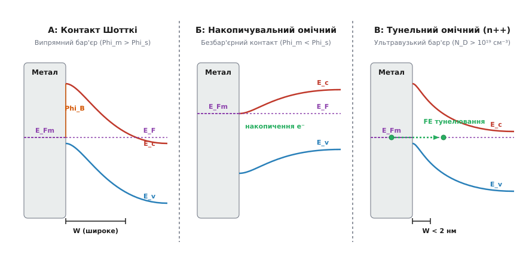
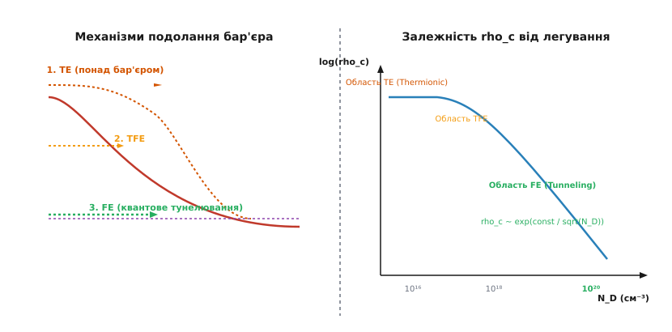
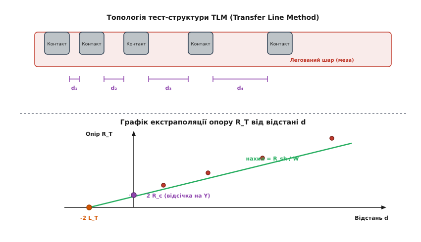

# Омічний контакт

<preknowlist>
- [Зонна теорія твердого тіла](topic:physics/band-theory) — валентна зона, зона провідності та енергетична заборонена зона.
- [Рівень Фермі](topic:physics/fermi-level) — електрохімічний потенціал електронів та робота виходу матеріалу.
- [Легування](topic:physics/doping) — створення n- та p-типів напівпровідників домішковими атомами.
- [Діод Шотткі](topic:electronics/components/schottky-diode) — випрямний перехід метал-напівпровідник з потенціальним бар'єром.
</preknowlist>

Коли на виході силового кремнієвого транзистора зі струмом `50 А` виникає паразитна розбіжність напруги у `0.6 В`, цей прилад виділяє додаткові `30 Вт` паразитного тепла і перегрівається до терморуйнування ще до досягнення розрахункового режиму. Джерелом такого теплового паду є незапланований потенціальний бар'єр між металевою ніжкою виводу та напівпровідниковим кристалом. Щоб електронний прилад працював згідно з розрахунковими законами схеми, кожен метал, під'єднаний до кристала, мусить утворювати **омічний контакт** (*ohmic contact*) — інтерфейс, який пропускає струм в обох напрямках зі знехтовно малим опором і лінійною вольт-амперною характеристикою.

## 1. Конфлікт на межі: чому метал і напівпровідник не зливаються автоматично

Звичайний металевий провідник слухається закону Ома: струм `I` пропорційний прикладеній напрузі `V`. Усередині металу електронний газ вільно рухається між атомами кристалної решітки, а середня густина електронів залишається незмінною по всьому об'єму. Проте щойно метал торкається напівпровідника, вихідна симетрія руйнується.

Напівпровідник має значно меншу концентрацію вільних носіїв (типово `10¹⁴ – 10¹⁸ см⁻³` проти `10²² см⁻³` у металі) та власну роботу виходу електронів. У мить фізичного контакту електрони починають перетікати з матеріалу з вищим рівнем Фермі у матеріал із нижчим рівнем, доки електрохімічні потенціали обох фаз не зрівняються.

```
Електрони перетікають через межу (E_F1 ≠ E_F2)
                 ↓
Утворюється просторовий заряд і внутрішнє поле E
                 ↓
Виникає потенціальний бар'єр Phi_B на межі
                 ↓
Формується випрямний контакт Шотткі замість провідника
```

Цей просторовий заряд створює збіднену область (*depletion region*) у напівпровідникові, де майже немає вільних носіїв. Енергетичні зони напівпровідника вигинаються вгору або вдолу, утворюючи потенціальний бар'єр `Phi_B`.

Для електронів цей бар'єр поводиться як односторонній клапан: при прямому зміщенні електрони долають його відносно легко, а при зворотному — опиняються у пастці. У результаті замість звичайного резистора виникає випрямний діод Шотткі.

Щоб замість діода отримати омічний контакт, інженери мусять примусити межу розділу відповідати двом жорстким фізичним критеріям:
1. **Лінійність (або симетрія ВАХ):** Залежність струму від напруги `I(V)` повинна бути строго симетричною відносно нуля `I(-V) = -I(V)` при робочих напругах кола.
2. **Низький питомий опір:** Спад напруги на самому переході `V_contact = I · R_c` має бути мізерно малим порівняно зі спадом напруги на активній робочій області кристала.

> 🔧 **Навіщо це.** Без омічних контактів неможливо створити жоден сучасний напівпровідниковий прилад. Якщо контакти джерела та витоку в MOSFET або емітера в біполярному транзисторі матимуть випрямний характер чи високий опір, транзистор втратить підсилювальні властивості, а його швидкодія впаде через паразиційні `RC`-затримки.

## 2. Термодинамічна модель Шотткі-Мотта та накопичувальний контакт

Першу спробу пояснити фізику контакту здійснили у 1938–1939 роках Вальтер Шотткі та Невілл Мотт. В ідеальній **моделі Шотткі-Мотта** передбачається, що на межі розділу немає сторонніх оксидів, хімічних забруднень чи дефектів решітки.

У цій ідеальній картині поведінка контакту визначається виключно відношенням роботи виходу металу `Phi_m` до спорідненості до електрона напівпровідника `chi` (для n-типу) або до роботи виходу напівпровідника `Phi_s` (для p-типу).


*Порівняння трьох фізичних станів межі метал-напівпровідник: випрямний бар'єр Шотткі (А), безбар'єрне накопичення (Б) та тунельний контакт (В).*

### Контакт на напівпровіднику n-типу

Для напівпровідника n-типу електрони є основними носіями заряду. Розглянемо два протилежні випадки:

1. **Випрямний контакт (`Phi_m > Phi_s`):**
   Рівень Фермі металу лежить нижче за рівень Фермі напівпровідника. Електрони з напівпровідника переходять у метал, залишаючи біля межі некомпенсовані позитивні іони донорів. Зони вигинаються вгору, утворюючи збіднений шар товщиною `W` та потенціальний бар'єр для електронів `Phi_Bn`:
```
Phi_Bn = Phi_m - chi                     [бар'єр Шотткі для n-типу]
```
   Цей контакт поводиться як випрямний діод Шотткі.

2. **Ідеальний омічний контакт (`Phi_m < Phi_s`):**
   Рівень Фермі металу лежить вище за рівень Фермі напівпровідника. Електрони з металу перетікають у напівпровідник. У напівпровідникові біля поверхні утворюється **накопичувальний шар** (*accumulation layer*), де концентрація вільних електронів вища за об'ємну. Зони вигинаються вдолу.
   
   У цьому стані між металом і напівпровідником немає жодного потенціального бар'єра для електронів, що прямують із напівпровідника в метал. Бар'єр для переходу з металу в напівпровідник також відсутній. Струм обмежений лише власною провідністю об'єму напівпровідника, а ВАХ є ідеально лінійною.

### Контакт на напівпровіднику p-типу

Для напівпровідника p-типу основними носіями є дірки, тому знаки вимог змінюються на протилежні:
- Для створення омічного накопичувального контакту на p-типі потрібен метал із **великою** роботою виходу: `Phi_m > Phi_s`. Тоді електрони переходять із напівпровідника в метал, збагачуючи поверхню дірками (зони вигинаються вгору).
- Якщо ж `Phi_m < Phi_s`, утворюється збіднений шар для дірок і бар'єр Шотткі `Phi_Bp = E_g - (Phi_m - chi)`, де `E_g` — ширина забороненої зони.

```
Критерії ідеального омічного контакту Шотткі-Мотта:
- n-тип: Phi_m ≤ chi  (робота виходу металу менша за спорідненість)
- p-тип: Phi_m ≥ I_s  (робота виходу металу більша за потенціал іонізації)
```

Здавалося б, фізична задача вирішена: варто лише підібрати метал із відповідною роботою виходу. Проте спроба приложити цю теорію до реальних кристалів кремнію чи арсеніду галію зазнала суцільного краху.

## 3. Закріплення рівня Фермі (Fermi Level Pinning)

Коли інженери спробували виготовити омічний контакт до кремнію n-типу (`chi ≈ 4.05 еВ`), напилюючи алюміній (`Phi_m ≈ 4.1 еВ`) або титан (`Phi_m ≈ 4.3 еВ`), виявилося, що на межі **завжди** виникає випрямний бар'єр висотою близько `0.6–0.7 еВ`, незалежно від того, який метал нанесено.

Причину цього явища 1947 року пояснив Джон Бардін ([📜 історія відкриття поверхневих станів Бардіна](topic:physics/ohmic-contact/hist-bardeen-barrier.md)). На реальній поверхні напівпровідникового кристала періодична структура решітки обривається. Кожен поверхневий атом має принаймні один «розірваний» валентний зв'язок (*dangling bond*).

Крім того, на контактувальному інтерфейсі виникають **металом індуковані щілинні стани** (*Metal-Induced Gap States*, MIGS): хвильові функції електронів металу згасають углиб забороненої зони напівпровідника на відстань кількох атомних шарів.

```
[ Розірвані зв'язки + MIGS ]
             ↓
Висока щільність поверхневих станів N_ss ( > 10¹³ см⁻²·еВ⁻¹ )
             ↓
Фіксація рівня Фермі E_F на рівні нейтральності CNL
             ↓
Бар'єр Phi_B перестає залежати від Phi_m металу (межа Бардіна)
```

Поверхневі стани хаотично розподілені по енергії всередині забороненої зони. Існує певний енергетичний рівень нейтральності заряду `E_0` (або `CNL` — *Charge Neutrality Level*): якщо стани заповнені вище `E_0`, поверхня заряджається негативно; якщо нижче — позитивно.

Якщо щільність поверхневих станів `N_ss` дуже висока (`N_ss > 10¹³ см⁻²·еВ⁻¹`), навіть мізерний зсув рівня Фермі створює величезний поверхневий заряд. Цей заряд повністю екранує внутрішній об'єм кристала від електричного поля металу.

У результаті рівень Фермі на поверхні виявляється «затиснутим» або **закріпленим** (*pinned*) біля рівня нейтральності `E_0`. Висота бар'єра Шотткі `Phi_B0` стає фіксованою величиною, що визначається властивостями самого напівпровідника, а не металу:

```
Phi_B = gamma · (Phi_m - chi) + (1 - gamma) · (E_g - E_0)
```

Де параметр фактора поверхні `gamma` змінюється від `1` (межа Шотткі, відсутність поверхневих станів) до `0` (межа Бардіна, повне закріплення рівня Фермі).

Для більшості класичних напівпровідників `gamma ≈ 0.05 – 0.2`. Рівень Фермі закріплюється приблизно на рівні `1/3` забороненої зони від валентної зони для GaAs та біля середини забороненої зони для Si. Отже, отримати омічний контакт через природний вигин зон `Phi_m < Phi_s` у реальній мікроелектроніці практично неможливо.

## 4. Квантовий перехід — тунелювання через надсильне легування

Оскільки природа не дозволяє усунути висоту бар'єра `Phi_B`, фізики знайшли інший шлях: **зменшити його товщину** `W` до таких розмірів, щоб електрони могли вільно проходити крізь бар'єр за допомогою квантовомеханічного **тунелювання** (*field emission*).

Ширина збідненої області `W` у контакту з бар'єром `Phi_B` визначається з розв'язку рівняння Пуассона:

```
W = √[ (2 · epsilon_s · V_bi) / (q · N_D) ]
```
де `epsilon_s` — діелектрична проникність напівпровідника, `V_bi` — контактна різниця потенціалів, `q` — заряд електрона, а `N_D` — концентрація донорно-легуючої домішки.

З цієї формули видно ключовий зв'язок: товщина бар'єра `W` обернено пропорційна квадратному кореню з концентрації домішок `√N_D`:

```
При помірному легуванні (N_D ~ 10¹⁶ см⁻³):   W ≈ 200–300 нм  (тунелювання неможливе)
При надсильному легуванні (N_D ~ 10²⁰ см⁻³):  W ≈ 1–2 нм     (бар'єр стає прозорим)
```

Коли ширина бар'єра падає нижче `2 нм`, хвильові функції електронів поблизу рівня Фермі проникають крізь потенціальний бар'єр практично без перешкод. Контакт із випрямного діода Шотткі перетворюється на тунельний омічний контакт з низьким опором.

```
                +------------------------------------+
                |  Метал  | Напівпровідник (n++)    |
                |         |                          |
E_F (метал) ----+--------->  тунелювання e⁻ ---------> E_F (напівпровідник)
                |         | (ширина W < 2 нм)       |
                +------------------------------------+
```

Саме цей квантовий механізм — **надсильне легування поверхневого шару (`n⁺⁺` або `p⁺⁺`)** — є основним промисловим методом створення омічних контактів у всіх сучасних мікросхемах.

## 5. Механізми переносу заряду: TE, TFE та FE

Проходження носіїв заряду через межу розділу метал-напівпровідник описується трьома основними фізичними механізмами залежно від рівня легування та температури.


*Три режими подолання потенціального бар'єра та залежність питомого опору контакту від концентрації домішок.*

### 1. Термоелектронна емісія (Thermionic Emission, TE)
При низькому легуванні (`N_D < 10¹⁷ см⁻³`) бар'єр є дуже широким (`W > 100 нм`). Електрони не можуть протунелювати крізь нього. Єдиний шлях перетиснути межу — отримати від теплових коливань решітки енергію, більшу за висоту бар'єра `Phi_B`, і перелетіти через його вершину.

Питомий опір контакту `rho_c` у режимі TE визначається формулою:

```
rho_c = (k_B / (q · A* · T)) · exp( Phi_B / (k_B · T) )
```
де `A*` — ефективна стала Річардсона (`A* = 4·π·m*·q·k_B² / h³ ≈ 120 А/см²·К²` для вільних електронів), `T` — абсолютна температура, `k_B` — стала Больцмана.

У режимі TE опір контакту експоненційно залежить від висоти бар'єра `Phi_B` та температури `T`, але практично **не залежить** від концентрації домішок `N_D`. Контакт має яскраво виражені випрямні властивості (діод Шотткі).

### 2. Термоелектронно-польова емісія (Thermionic-Field Emission, TFE)
При проміжному легуванні (`10¹⁷ < N_D < 10¹⁹ см⁻³`) товщина бар'єра зменшується до `10–30 нм`. Електрони теплово збуджуються на деяку проміжну енергію `E_pad`, де бар'єр стає достатньо тонким, і протунельовують крізь його верхню частину. 

Опір контакту `rho_c` у режимі TFE одночасно залежить і від температури, і від концентрації домішок:

```
rho_c ~ exp( Phi_B / (E_00 · coth(E_00 / (k_B · T))) )
```
де `E_00` — характерна енергія тунелювання (параметр Падокані):

```
E_00 = (q · h_bar / 2) · √[ N_D / (m* · epsilon_s) ]
```

### 3. Польова емісія (Field Emission, FE)
При високому легуванні (`N_D > 10¹⁹ см⁻³`) параметр `E_00 >> k_B · T`. Бар'єр стає настільки вузьким (`W < 2 нм`), що електрони тунелюють прямо біля рівня Фермі `E_F` без потреби в тепловій активації.

Питомий опір контакту у режимі FE задається виразом:

```
rho_c ~ exp[ (2 · √[epsilon_s · m*] / h_bar) · (Phi_B / √N_D) ]
```

У режимі FE опір контакту експоненційно падає зі зростанням `√N_D` і практично **не залежить від температури**. Саме цей режим забезпечує лінійну ВАХ і наднизький опір, необхідний для мікроелектроніки.

```
Порівняння трьох режимів переносу:
-----------------------------------------------------------------------------
Режим | Концентрація N_D (см⁻³) | Залежність rho_c від N_D | Залежність від T
-----------------------------------------------------------------------------
TE    | < 10¹⁷                   | Немає                     | Сильна exp(1/T)
TFE   | 10¹⁷ – 10¹⁹              | Помірна                   | Помірна
FE    | > 10¹⁹                   | Експоненційна exp(1/√N_D) | Слабка (майже 0)
-----------------------------------------------------------------------------
```

## 6. Метрологія та метод трансферної лінії (TLM)

Опір омічного контакту вимірюють не у звичайних Омах (`Ом`), а у вигляді **питомого опору контакту** `rho_c` (*specific contact resistance*), який має розмірність `Ом·см²`. Фізичний зміст `rho_c` — це опір ділянки контакту площею `1 см²`:

```
rho_c = ( dV / dJ )|_(V=0)               [Ом·см²]
```

Оскільки прямо виміряти опір тонкої межі розділу металевим зондом неможливо (опір самих вимірювальних щупів та об'єму напівпровідника виявиться більшим), використовують спеціальну тест-структуру та **метод трансферної лінії** (*Transfer Line Method*, TLM).


*Геометрія вимірювальних площадок TLM та екстраполяція експериментальної прямої для вилучення опору контакту й довжини перенесення.*

### Топологія тест-структури TLM
На ізольованій прямокутній смужці напівпровідника (мезі) шириною `W` формують ряд з однакових металевих площадок довжиною `L`, розділених різними відстанями `d₁, d₂, d₃, d₄...`.

За допомогою чотириточкової методики вимірюють повний опір `R_T` між кожною парою сусідніх контактів. Загальний опір `R_T` складається з опору напівпровідникового зазору та подвійного опору контактів:

```
R_T(d) = (R_sh / W) · d + 2 · R_c
```
де `R_sh` — шаровий опір легованого шару напівпровідника (`Ом/кв`).

### Екстраполяція та параметр довжини перенесення `L_T`
Будуючи графік залежності виміряного опору `R_T` від відстані `d`, отримують пряму лінію:
1. **Нахил прямої** `S = dR_T/dd = R_sh / W` дозволяє обчислити шаровий опір напівпровідника `R_sh = S · W`.
2. **Перетин з віссю опору (`d = 0`)** дає подвійний опір контакту `R_T(0) = 2 · R_c`, звідки `R_c = R_T(0) / 2`.
3. **Перетин з віссю відстаней (`R_T = 0`)** відповідає від'ємній відстані `d = -2 · L_T`, де `L_T` — **довжина перенесення струму** (*transfer length*).

Довжина перенесення `L_T` показує відстань під металевим контактом, на якій струм стікає з напівпровідника в метал. Через ефект перерозподілу струму (*current crowding*) струм не тече рівномірно по всій довжині контакту `L`, а концентрується на його передньому краю:

```
L_T = √( rho_c / R_sk )                  [довжина перенесення]
```
де `R_sk` — шаровий опір напівпровідника безпосередньо під металевим контактом.

Повний математичний вивід диференціального рівняння розподілу струму `J(x)` під контактом та гіперболічних функцій `coth(L/L_T)` наведено у [🧮 математичному виведенні рівнянь струморозподілу TLM](topic:physics/ohmic-contact/math-tlm-derivation.md).

Для «довгого» контакту (`L ≥ 2 · L_T`) питомий опір контакту обчислюється за простою формулою:

```
rho_c = R_c · W · L_T = (R_sh · L_T²)     [Ом·см²]
```

Типові значення `rho_c` для сучасних напівпровідникових приладів:
- **Звичайні дискретні прилади:** `rho_c ≈ 10⁻⁴ – 10⁻⁵ Ом·см²`;
- **Високочастотні транзистори (GaN HEMT, SiGe HBT):** `rho_c ≈ 10⁻⁶ – 10⁻⁷ Ом·см²`;
- **Субмікронні процесори (FinFET / GAAFET 3 нм):** `rho_c < 10⁻⁸ Ом·см²`.

Обробку первинних експериментальних даних вимірювань TLM та розрахунок усіх чотирьох параметрів реалізовано у [⚙️ програмі аналізу TLM-вимірювань](topic:physics/ohmic-contact/proj-tlm-analyzer.md).

## 7. Матеріалознавство та технологічні методи виготовлення

Просте фізичне напилення металу на напівпровідник рідко дає надійний омічний контакт. Поверхневий шар оксиду (`SiO₂` на кремнії чи `Ga₂O₃` на GaAs) створює ізолювальний прошарок. 

Тому створення омічного контакту — це складний багатокроковий матеріалознавчий процес, що включає очищення, напилення багатошарових металізацій та високотемпературне термозагартування (*Rapid Thermal Annealing*, RTA).

```
Поверхнева обробка (HF-травлення для видалення оксиду)
                         ↓
Напилення багатошарової структури (наприклад, Ti/Al/Ni/Au або Co/Ti)
                         ↓
Швидке термічне загартування RTA (400–900 °C)
                         ↓
Хімічна реакція + утворення силіциду/сплаву + самолегування
```

### 1. Силіциди в кремнієвій технології (Si / SiGe)
У виробництві кремнієвих мікросхем метал напилюють безпосередньо на високолегований кремній (`n⁺⁺` або `p⁺⁺` стоку/витоку). Під час відпалу при `400–700 °C` метал вступає у хімічну реакцію з кремнієм, утворюючи **силіцид** (*silicide*):

- **Дисиліцид титану (`TiSi₂`):** Використовувався у вузлах `0.25 – 0.13 мкм`.
- **Силіцид кобальту (`CoSi₂`):** Стандарт для вузлів `90 – 65 нм`.
- **Моносиліцид нікелю (`NiSi`):** Основний матеріал для вузлів `45 нм — 7 нм`. Забезпечує мале споживання кремнію при реакції та низький опір контакту.

Завдяки реакції утворення силіциду межа розділу занурюється вглиб кристала, оминаючи забруднений та деформований поверхневий шар. Процес є самосуміщеним (*SALICIDE* — *Self-Aligned Silicide*): силіцид утворюється лише там, де метал торкається голого кремнію.

### 2. Сплавні контакти у напівпровідниках III-V (GaAs, InP)
Арсенід галію має сильну тенденцію до закріплення рівня Фермі. Для створення омічних контактів до n-GaAs застосовують багатошарову металізацію **AuGe / Ni / Au**:
- Еутектичний сплав золото-германій (`AuGe`, 88% Au, 12% Ge) плавиться при `356 °C`.
- Нікель (`Ni`) розчиняє тонку поверхневу плівку оксиду і запобігає згортанню сплаву в краплі.
- Під час відпалу при `400–450 °C` германій (`Ge`) дифундує в кристал GaAs і заміщає атоми галію, утворюючи надвисоколегований шар `n⁺⁺-GaAs` під контактом.

Для p-GaAs використовують сплав **Ti / Pt / Au** або **AuZn**, де цинк (`Zn`) діє як акцепторна домішка (`p⁺⁺`).

### 3. Широкозонні напівпровідники (GaN, SiC)
Нітрид галію (`GaN`, `E_g ≈ 3.4 еВ`) та карбід кремнію (`SiC`, `E_g ≈ 3.2 еВ`) мають дуже велику заборонену зону і високий бар'єр Шотткі.
- Для n-GaN силових транзисторів та HEMT застосовують металізацію **Ti / Al / Ni / Au** з відпалом при високих температурах (`800–850 °C`). Титан реагує з азотом, утворюючи нітрид титану `TiN` і створюючи величезну кількість вакансій азоту на поверхні GaN, які діють як сильні донори (`n⁺⁺`).
- Для p-GaN (світлодіоди, лазери) створення омічного контакту є найважчим завданням через низьку рухливість і низьку концентрацію дірок. Застосовують напівпрозорі плівки **Ni / Au** або оксид індію-олова (`ITO`).

## 8. Омічні контакти у 2D-матеріалах та квантових гетероструктурах

У сучасній наноелектроніці на основі двомірних (2D) напівпровідників — таких як дихалькогеніди перехідних металів (`MoS₂`, `WSe₂`) та графен — проблема створення омічного контакту виявляється ще гострішою. 

При фізичному напиленні 3D-металів (алюмінію, золота чи титану) енергетичні атоми металу руйнують атомарно тонку моношарову структуру 2D-кристала. Виникає надзвичайно сильне закріплення рівня Фермі, а питомий опір контакту зростає до неприйнятних `10⁻³ – 10⁻⁴ Ом·см²`.

```
[ Напилення 3D-металу ]  →  Деформація моношару  →  Сильне закріплення E_F  →  Високий опір
[ Ван-дер-Ваальсів контакт ]  →  Атомарно чистий стик  →  Збереження решітки  →  Низький опір
```

Для подолання цієї проблеми розроблено технологію **ван-дер-ваальсових омічних контактів** (*van der Waals contacts*). Складається атомарно чистий стик без хімічних розірваних зв'язків шляхом механічного перенесення 2D-металів (наприклад, металевого дисульфіду танталу `TaS₂` або переносу атомних плівок висмуту `Bi`).

У таких Ван-дер-Ваальсових інтерфейсах фактор закріплення `gamma` прямує до `1` (ідеальна межа Шотткі-Мотта), що дозволяє керувати висотою бар'єра шляхом прямого добору роботи виходу металу.

## 9. Особливості контактів надпровідник-нормальний метал (N-S інтерфейси)

Окремим спеціальним класом омічних контактів є межа розділу між нормальним металом (N) та надпровідником (S) при кріогенних температурах (`T < T_c`).

У такій системі звичайні поодинокі електрони з нормального металу не можуть проникати в надпровідник за енергій, менших за надпровідну щілину `Delta`. Замість звичайного омічного протікання на межі виникає квантовий ефект **Андрєєвського відбиття** (*Andreev reflection*):

```
Електрон (e⁻) з нормального металу (N)  ──>  Межа N-S  ──> Куперівська пара (2e⁻) в надпровідник (S)
                                              └──> Відбита дірка (h⁺) назад у метал (N)
```

При Андрєєвському відбитті електрон з енергією `E < Delta` впадає на межу N-S, формує Куперівську пару в надпровідникові, а назад у нормальний метал відбивається дірка з протилежним імпульсом і спіном.

Цей процес забезпечує збереження заряду і подвоює електричну провідність межі при малих напругах (`V < Delta/q`), створюючи наднизькоомний омічний контакт для квантових обчислювальних систем та надпровідникових кубітів.

## 10. Крайові ефекти, надійність та теплова деградація

Навіть ідеально сформований омічний контакт із низьким початковим опором з часом може деградувати або спричинити відмову напівпровідникового приладу під дією високих струмів і температур.

### Електроміграція та утворення піків (Contact Spiking)
При високих густинах струму (`J > 10⁵ А/см²`) імпульс електронного вітру переносить атоми металу у напрямку руху електронів. 

У класичних контактах алюмінію до кремнію (`Al/Si`) виникає явище **проколювання переходів** (*contact spiking*): кремній розчиняється в алюмінії при підвищеній температурі, а алюміній заповнює утворені порожнини, утворюючи гострі металеві «шипи». Якщо такий шип проростає крізь мілкозалягаючий p-n перехід, прилад коротко замикається.

```
[ Електронний вітер / Висока T ]
                ↓
Розчинення кремнію в алюмінієвому контакті
                ↓
Утворення металевих шипів (Contact Spiking)
                ↓
Коротке замикання p-n переходу під контактом
```

Щоб запобігти розчиненню, до алюмінію додають 1–2% кремнію (`Al-Si` сплав) або вводять **дифузійний бар'єр** (*diffusion barrier*).

### Дифузійні бар'єри (TiN, TaN, W)
У сучасному багаторівневому розведенні між силіцидним контактом (`NiSi`) та силовими мідними чи алюмінієвими шинами обов'язково вставляють тонкий шар тугоплавкого нітриду металу — **нітрид титану (`TiN`)**, **нітрид танталу (`TaN`)** або **вольфрам (`W`)**.

Ці матеріали мають високу електричну провідність, але повністю блокують взаємну дифузію атомів міді/алюмінію та кремнію навіть при температурах до `500–600 °C`.

### Теплове локальне перегрівання
Через явище скупчення струму (*current crowding*) понад 80% усього струму протікає крізь вузьку передню смужку контакту шириною `L_T ≈ 0.1 – 0.5 мкм`.

У цій локальній зоні густина струму може досягати пікових значень `10⁶ А/см²`, що призводить до локального джоулевого нагріву. Якщо питомий опір контакту `rho_c` перевищує критичну норму, локальна температура зростає, прискорюючи міжфазну дифузію і спричиняючи термічний деградаційний розпад контакту.

Саме тому оптимізація геометрії контактних площадок, термостабільність силіцидних фаз та досягнення наднизького питового опору `rho_c < 10⁻⁷ Ом·см²` є вирішальним фактором надійності та довговічності сучасних напівпровідникових систем.
