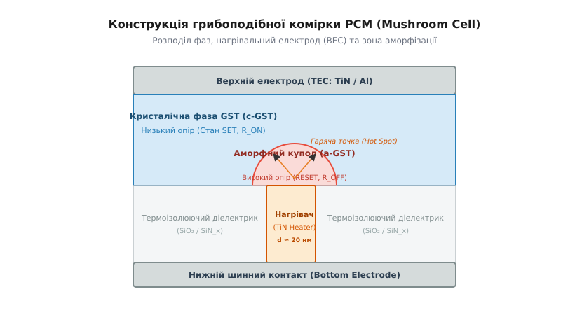
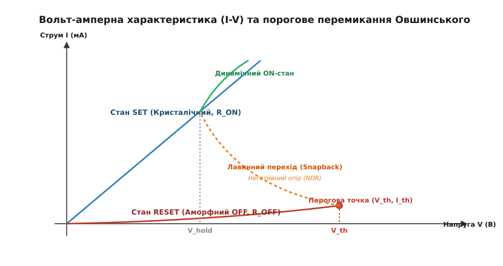
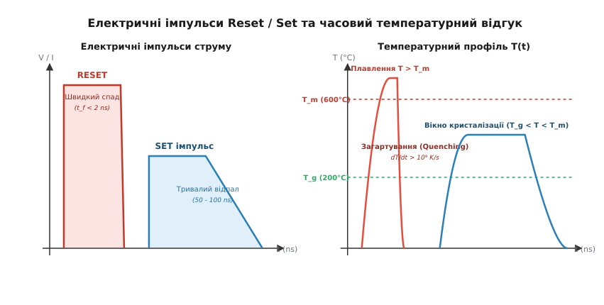
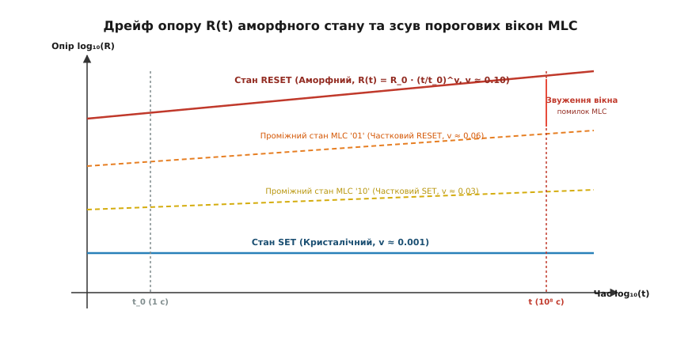

# Фізика PCM (PCRAM) комірки та процеси Reset/Set

<preknowlist>
- [Зонна теорія твердого тіла](book:physics/band-theory) — формування енергетичних зон, заборонена зона та локалізовані стани у впорядкованих і хаотичних структурах.
- [Термодинаміка фазових переходів](book:phase-transitions) — фазові переходи першого роду, прихована теплота плавлення, зародкоутворення та кристалізація.
- [Ефекти Джоуля — Ленца та теплопередача](book:joule-heating-heat-transfer) — теплова потужність P = I²·R, термічний опір та дифузія тепла в мікротомах.
</preknowlist>

Зменшення фізичних розмірів традиційної Flash-пам'яті із плаваючими затворами та зарядовими пастками нижче позначки 10 нанометрів зіткнулося з нездоланними квантовомеханічними обмеженнями. Пряме тунелювання електронів через витончений діелектрик створює високі струми витоку в режимі очікування, а зменшення об'єму затвора призводить до того, що бітовий стан розрізняється всього кількома електронами. Альтернативним шляхом побудови енергонезалежної пам'яті високої щільності став перехід від накопичення електричного заряду у потенціальному бар'єрі до зміни самого структурного та агрегатного стану матеріалу — пам'яті на основі фазового переходу (*Phase Change Memory*, PCRAM або PCM).

В основі функціонування комірки PCM лежить оборотна термодинамічна трансформація халькогенідного матеріалу між двома стабільними фазовими станами: невпорядкованим аморфним та впорядкованим кристалічним.

## 1. Вступ і фундаментальний принцип фазової пам'яті (PCRAM)

Головним робочим матеріалом сучасної фазової пам'яті є халькогенідний сплав германію, стибію та телуру складальної стехіометрії `Ge₂Sb₂Te₅` (скорочено GST-225). Ця речовина належить до класу халькогенідних стекол — матеріалів, що містять елементи VI групи періодичної системи (теллур, селен або сірку). При кімнатній температурі сплав GST-225 здатен роками перебувати в одному з двох фазових станів, що різко відрізняються за своїми атомарними та електронними властивостями:

1. **Аморфна фаза (стан RESET, бітовий «0»):** Атомна структура халькогеніду позбавлена дальнього трансляційного порядку. Валентні кути та довжини міжатомних зв'язків германію і стибію хаотично спотворені, утворюючи велику концентрацію розірваних зв'язків та дефектних пар (так звані валентні альтернативні пари K⁰, C₁⁻ та C₃⁺ за моделлю Кастнера — Адлера — Фріше). Ці дефекти створюють високу щільність локалізованих станів у забороненій зоні, які працюють як пастки для електронів. Питомий опір аморфної фази становить `ρ_am ≈ 10¹ - 10³` Ом·м, а повний опір комірки сягає `R_OFF ~ 10⁶` Ом (мегаомний діапазон). У цьому стані електронна провідність обмежується термоелектронним вивільненням носіїв із пасток (модель Пулла — Френкеля).
2. **Кристалічна фаза (стан SET, бітовий «1»):** Атоми впорядковані у метастабільну гранецентровану кубічну ґратку (fcc) або гексагональну щільноупаковану структуру (hcp). Завдяки делокалізації хвильових функцій електронів (p-подібний резонансний зв'язок між атомами) та відсутності локалізованих бар'єрів питомий опір матеріалу падає до `ρ_cryst ≈ 10⁻³ - 10⁻²` Ом·м, а опір всієї комірки зменшується до `R_ON ~ 10³` Ом (кілоомний діапазон).

Контраст опорів між цими двома фазовими станами становить від трьох до чотирьох порядків величини (`R_OFF / R_ON ~ 10³ - 10⁴`), що забезпечує високу завадостійкість та чітке розрізнення зафіксованого бітового стану при зчитуванні. На відміну від конденсаторних осередків DRAM або затворів Flash, аморфний і кристалічний стани PCM є термодинамічно метастабільними та енергонезалежними — вони не вимагають постійної подачі напруги для утримання збережених даних.

Історичні етапи виявлення цього явища та шлях від перших скляних елементів Овшинського до промислових масивів 3D XPoint розібрано в [Історії відкриття ефекту Овшинського та еволюції фазової пам'яті](book:physics/condensed-matter-physics/pcm-cell-physics/hist-ovshinsky-effect.md).

```
Кристалічний матеріал (fcc ґратка)  ───►  [ Плавлення T > T_m ]  ───►  Рідка фаза (Розплав)
             ▲                                                                │
             │                                                                │
     [ Відпал T_g < T < T_m ]                                    [ Швидке загартування ]
             │                                                  [ dT/dt > 10⁹ K/s ]
             │                                                                │
             └───────────────────────  Аморфна фаза (a-GST)  ◄────────────────┘
```

Мікроскопічна фізика фазової трансформації в GST-225 пов'язана зі зміною конфігурації хімічних зв'язків навколо атомів германію `Ge`. У кристалічному кубічному стані атоми `Ge` перебувають у ненапруженому октаедричному оточенні атомів телуру з переносом заряду за рахунок резонансних p-орбіталей. Під дією джоулевого нагріву ґратка плавиться, втрачаючи впорядкованість. При стрімкому загартуванні розплаву частина атомів `Ge` заморожується у тетраедричній конфігурації з ковалентною sp³-гібридизацією, що розриває провідний електронний каркас і перетворює матеріал на високоомний діелектрик.

Енергетичний спектр станів у забороненій зоні аморфного халькогеніду характеризується наявністю «хвостів» зон, сформованих флуктуаціями потенціалу. Рівень Фермі зафіксовано поблизу середини забороненої зони завдяки позитивному енергетичному ефекту парного зв'язування дефектів (ефект негативного кореляційного енергетичного потенціалу `U < 0`). Це пояснює, чому аморфний халькогенід неможливо продопувати традиційними донорними або акцепторними домішками в класичному розумінні.

## 2. Електро-термічна геометрія комірки та роль теплової ізоляції

Щоб перевести мікроскопічний об'єм халькогеніду з одного фазового стану в інший, крізь матеріал пропускають електричні імпульси струму. Перетворення електричної енергії на теплову в об'ємі комірки відбувається за законом Джоуля — Ленца:

```
P_Joule = I² · R_cell = J² · ρ · V_active
```

Де `I` — електричний струм, `J` — густина струму, `ρ` — питомий опір матеріалу, а `V_active` — об'єм перемикання.

Найбільш поширеною та відпрацьованою у промисловості є грибоподібна геометрія комірки (**Mushroom Cell**).

```
                      Top Electrode Contact (TEC: TiN / Al)
       ┌──────────────────────────────────────────────────────────┐
       │                                                          │
       │           Кристалічний масив GST (c-GST, SET)            │
       │                                                          │
       │             ┌──────────────────────────────┐             │
       │             │    Аморфний купол (a-GST)    │             │
       │             │           (RESET)            │             │
       ├─────────────┴──────────────┬───────────────┴─────────────┤
       │   Діелектрик SiO₂/SiN_x    │ Нагрівач TiN  │  Діелектрик │
       │                            │  (BEC Pillar) │             │
       └────────────────────────────┴───────────────┴─────────────┘
                     Bottom Electrode Contact (BEC)
```

У цій геометрії тонкий шар халькогеніду GST нанесено поверх вузького циліндричного нагрівального електрода (**Bottom Electrode Contact**, BEC / Heater), виготовленого з тугоплавкого металу з високим питомим опором (найчастіше нітриду титану TiN або TiAlN). Діаметр контакту нагрівача `d` становить всього 10–20 нанометрів.

Звуження перерізу нагрівального електрода створює максимальну локалізацію густини струму `J = I / (π · d² / 4)`. У місці контакту нагрівача з плівкою GST густина струму сягає `J ~ 10¹¹ - 10¹²` А/м². Це викликає інтенсивне локальне виділення джоулевого тепла — формується так звана **гаряча точка** (*hot spot*).


*Крос-секційний розріз комірки Mushroom Cell: звужений нагрівальний електрод (BEC), аморфна купольна зона (RESET), кристалічна матриця GST та лінії теплових потоків.*

Теплодинамічний стан комірки PCM у наближенні зосереджених параметрів описується диференціальним рівнянням теплового балансу:

```
C_th · (dT / dt) = I² · R_cell - (T - T_amb) / R_th      [тепловий баланс осередку PCM]
```

Де:
- `C_th` — ефективна теплоємність активної зони нагріву (Дж/К),
- `R_cell` — електричний опір зони контакту,
- `R_th` — еквівалентний термічний опір комірки відносно навколишньої підкладки (К/Вт),
- `T_amb` — температура довкілля (300 K).

Стаціонарна температура гарячої точки у рівноважному стані виражається як:

```
T_max = T_amb + I² · R_cell · R_th
```

Щоб мінімізувати амплітуду струму `I_RESET`, необхідного для плавлення матеріалу, термічний опір комірки `R_th` має бути якнайвищим. Для цього активний об'єм халькогеніду оточують діелектричними матеріалами з низьким коефіцієнтом теплопровідності `k_th` — оксидом кремнію SiO₂ (`k_th ≈ 1.4` Вт/(м·К)), нітридом кремнію SiN_x (`k_th ≈ 2.1` Вт/(м·К)) або новітніми пористими low-k діелектриками.

Термічний опір контакту `R_th` складається з двох основних компонентів: об'ємного опору теплопровідності навколишнього діелектрика та міжфазного термічного опору Капиці на межі розділу металевого нагрівача TiN і плівки GST. Оскільки розмір контакту `d` знаходиться у нанодіапазоні, міжфазний опір стає домінуючим, зменшуючи витік тепла у нагрівач і підвищуючи енергетичну ефективність аморфізації.

Вимоги до оптимізації струму плавлення привели до створення альтернативних наногеометрій:
- **Pillar Cell (Стовпчаста комірка):** Шар GST формується у вигляді вертикального циліндричного стовпчика одинакового діаметра з нагрівачем, що повністю усуває бічне розсіювання тепла.
- **Confined Cell (Обмежена комірка):** Халькогенід заповнює глибокий наноотвір у діелектрику, завдяки чому вся розплавлена область ізольована з усіх боків.
- **Superlattice PCM (Суперґратка iPCM):** Матеріал наноситься у вигляді альтернативних моноатомних шарів `GeTe` та `Sb₂Te₃`. Зміна стану відбувається без фазового плавлення за рахунок зміщення атомів германію в межах елементарної комірки, що зменшує енергію перемикання на порядок.

## 3. Фізика процесу RESET: плавлення та загартування (Quenching)

Процес **RESET** являє собою операцію запису бітового стану «0» — переведення активного об'єму комірки з провідного кристалічного стану в високоомний аморфний.

Для виконання операції RESET на комірку подається короткий електричний імпульс напруги високої амплітуди.

```
Параметри RESET імпульсу:
- Амплітуда струму: I_RESET ~ 150 – 300 мкА
- Тривалість плато: t_w ~ 10 – 20 нс
- Час спаду (fall time): t_f < 2 нс (Критична швидкість охолодження!)
```

Фізичний процес аморфізації складається з двох послідовних етапів:

1. **Етап фазового плавлення (Melting):** Проходження потужного струму `I_RESET` протягом кількох наносекунд розігріває гарячу точку над кінчиком нагрівача до температури, що перевищує температуру плавлення халькогеніду `T_m ≈ 600 °C` (для GST-225 `T_m = 615 °C`). Кристалічна ґратка руйнується, атоми втрачають дальній порядок, утворюючи локалізовану рідку фазу.
2. **Етап швидкого загартування (Quenching):** Після вимкнення електричного струму розплавлений мікрооб'єм починає віддавати тепло у довкілля. Для заморожування невпорядкованого стану швидкість охолодження розплаву мусить перевищувати критичну величину:

```
dT / dt > 10⁹ - 10¹⁰ K/s      [критерій загартування аморфного стану]
```

Якщо час спаду імпульсу `t_f` становить менше 2 наносекунд, тепло блискавично відводиться крізь металевий нагрівальний електрод у масивну підкладку. Атоми `Ge`, `Sb` та `Te` не встигають дифундувати та утворити кристалічні зародки — рідка фаза «заморожується», перетворюючись на аморфний напівпровідниковий купол.

Фізико-хімічні константи та специфікації імпульсного керування наведено у вставці [Фізичні параметри матеріалів GST та специфікація імпульсного керування](book:physics/condensed-matter-physics/pcm-cell-physics/api-pcm-cell-params.md).

Кінетика охолодження розплавленого халькогеніду описується TTT-діаграмами (Time-Temperature-Transformation). При охолодженні розплав проходить крізь температурний інтервал максимальної швидкості зародкоутворення (поблизу `T ≈ 400 °C`). Якщо час перебування в цьому інтервалі перевищує `t_crit ≈ 1` наносекунду, у матеріалі формуються критичні зародки розміром понад 1.5 нм, які спричиняють небажану часткову кристалізацію. Швидкий спад імпульсу `t_f < 2` нс гарантує проходження критичної зони TTT-діаграми без утворення зародків.

Збільшення товщини аморфного купола перекриває весь шлях проходження струму між верхнім та нижнім електродами, внаслідок чого опір всієї комірки зростає до рівня `R_OFF ~ 10⁶` Ом.

## 4. Фізика процесу SET: ефект порогового перемикання та відпал (Crystallization)

Процес **SET** являє собою операцію запису бітового стану «1» — відновлення високої провідності шляхом кристалізації аморфного купола.

Тут виникає фундаментальна фізична дилема: аморфна фаза має гігантський опір `R_OFF ~ 10⁶` Ом. Згідно з законом Ома, щоб прогнати крізь такий високий опір струм, достатній для джоулевого нагріву, до комірки довелося б прикласти напругу в десятки вольт:

```
V = √(P_Joule · R_OFF) = √(10⁻⁴ Вт · 10⁶ Ом) = 10 В
```

Така висока напруга негайно пробила б міжшаровий діелектрик і зруйнувала б керувальний транзистор.

Порятунком від цього обмеження став фундаментальний фізичний ефект — **порогове перемикання Овшинського** (*Ovshinsky Threshold Switching*).


*Вольт-амперна характеристика аморфної комірки PCM: підпороговий режим витоку, порогова напруга V_th, ділянка негативного диференціального опору та лавинний перехід у високопровідний стан ON.*

Коли прикладена до аморфного осередку напруга досягає порогового значення `V_th ~ 1.1 - 1.5` В (що відповідає пороговому електричному полю `E_th ~ 30 - 45` В/мкм), підпороговий омічний режим витоку припиняється. Сильне електричне поле викликає ударну іонізацію та лавинне вивільнення носіїв заряду з глибоких пасток у забороненій зоні.

Концентрація вільних носіїв вибухово зростає на п'ять порядків, опір аморфного купола падає до низького динамічного значення `R_dyn ~ 10³` Ом (ефект *snapback*), а напруга на комірці зменшується до залишкової напруги утримання `V_hold ≈ 0.5` В.

Після порогового перемикання комірка переходить у високопровідний стан і починає ефективно пропускати струм при низькій напрузі. Тепер стає можливим здійснення другого етапу — **кристалізаційного відпалу**.


*Зліва: амплітуда та спад імпульсу Reset (плавлення та загартування) в порівнянні з подовженим імпульсом Set (відпал). Справа: відповідальні термічні криві T(t) відносно меж T_m та T_g.*

Для кристалізації подається імпульс SET помірної амплітуди, але значно більшої тривалості:
- Амплітуда напруги: `V_SET > V_th` (1.2 – 1.6 В),
- Тривалість плато: `t_w_SET ~ 50 - 100` нс,
- Повільне спадання імпульсу: `t_f_SET ~ 20 - 50` нс.

Цей імпульс підтримує температуру аморфного купола у так званому **вікні кристалізації**:

```
T_g < T_cell < T_m      (Для GST-225:  200 °C < T < 615 °C)
```

При цій температурі атоми набувають достатньої термоактиваційної рухливості для подолання потенціального бар'єра кристалізації (`E_c ≈ 2.1` еВ). Усередині аморфної матриці починають виникати стабільні кристалічні зародки (механізм *nucleation*), які швидко розростаються (механізм *growth*), відновлюючи суцільну гранецентровану кубічну ґратку fcc.

Кінетика росту кристалічної фази залежить від типу халькогеніду:
- **Матеріали з превалюванням зародкоутворення (Nucleation-dominated, як GST-225):** Кристалізація відбувається за рахунок виникнення мільйонів дрібних кристалітів по всьому об'єму аморфного купола.
- **Матеріали з превалюванням росту зерен (Growth-dominated, як Ge-Sb, Doping-SbTe):** Кристалізація поширюється у вигляді фронту росту від зовнішньої кристалічної межі контакту вглиб аморфного ядра.

Чисельне моделювання часових температурних профілів та кінетики кристалізації наведено у вставці [Моделювання теплодинаміки Reset/Set імпульсів та кристалізації в PCM](book:physics/condensed-matter-physics/pcm-cell-physics/proj-pcm-pulse-sim.md).

## 5. Дрейф опору (Resistance Drift) у аморфній фазі

Найбільш складним фізичним явищем, яке обмежує надійність фазової пам'яті, є часова нестабільність аморфного стану — **дрейф опору** (*resistance drift*).

Після завершення імпульсу RESET опір аморфного купола не залишається постійним, а повільно і систематично зростає з часом за степеневим законом:

```
R(t) = R_0 · (t / t_0)^v
```

Де `R_0` — опір у початковий момент часу `t_0 = 1` с, а `v` — безрозмірний коефіцієнт дрейфу опору (`v ≈ 0.08 - 0.12` для аморфної фази GST-225).


*Логарифмічна залежність опору R(t) аморфного (RESET) та кристалічного (SET) станів від часу t, що ілюструє степеневий дрейф опору v та перекриття порогових марджінів у багаторівневих комірках.*

Фізична природа дрейфу опору полягає у **структурній релаксації** (*structural relaxation*) метастабільної аморфної матриці. Оскільки аморфний стан утворюється шляхом надшвидкого загартування розплаву, атоми заморожуються у вимушених високоенергетичних конфігураціях із надлишковим «вільним об'ємом» (*free volume*).

З часом, під дією термічних флуктуацій при кімнатній температурі, в аморфному склі відбуваються повільні атомні перебудови:
- Зменшується вільний об'єм між атомами (атомна сітка стає щільнішою),
- Валентні кути атомів `Ge` та `Sb` релаксують до енергетично вигідніших конфігурацій,
- Енергетичні рівні локалізованих пасток у забороненій зоні поглиблюються відносно дна зони провідності (ефект `z-shift` у моделі Пулла — Френкеля).

Поглиблення пасток збільшує енергію активації провідності `E_a`, унаслідок чого опір `R(t)` монотонно зростає протягом місяців і років.

Математичне виведення моделі `z-shift` та температурну залежність коефіцієнта `v` описано у вставці [Математична модель та термодинаміка дрейфу опору аморфного халькогеніду](book:physics/condensed-matter-physics/pcm-cell-physics/math-resistance-drift.md).

Дрейф опору є головною перешкодою для створення багаторівневих комірок пам'яті (MLC / QLC), де у одному осередку кодується 2 або 4 біти за допомогою проміжних станів опору (R₁, R₂, R₃, R₄). З часом проміжні стани дрейфують із різними швидкостями, що призводить до змішування порогових рівнів і виникнення бітових помилок зчитування.

## 6. Фізичні границі масштабування, деградація та термічна крос-поміха

При зменшенні топологічного розміру комірки PCM нижче 15 нанометрів виникають фундаментальні фізичні обмеження надійності:

1. **Деградація від циклування (Endurance limit):** Типовий ресурс циклування комірки PCM становить від 10⁷ до 10⁸ циклів RESET/SET. Головною причиною зносу є елементна сегрегація під дією термодифузії та електронного вітру: при подачі мільйонів імпульсів струму атоми телуру `Te` мігрують до анода, а атоми германію `Ge` витісняються до периферії. Це утворює нестехіометричні провідні містки, які унеможливлюють аморфізацію (комірка «заклинює» у стані SET).
2. **Термічна крос-поміха (Thermal Crosstalk):** При щільному розташуванні осередків у масиві джоулеве тепло від імпульсу RESET однієї комірки дифундує у сусідні осередки. Якщо температура сусідньої аморфної комірки перевищує `T_g ≈ 200 °C`, її аморфний купол починає мимовільно кристалізуватися, спотворюючи збережені дані.

Для вирішення цих проблем застосовують новітні фізико-технічні рішення: легування GST азотом та вуглецем (N-GST, C-GST), проекційну архітектуру (*Projected PCM*) із металевим шунтом, а також багатошарові 3D-структури з вертикальним розташуванням каналів.

---

> 🔧 **Навіщо це.** Знання фізики фазового переходу та термодинаміки загартування дозволяє розробникам напівпровідникових систем проектувати високошвидкісну енергонезалежну пам'ять для оперативних накопичувачів, автоелектроніки та нейроморфних процесорів прямого обчислення у пам'яті (*In-Memory Computing*).
