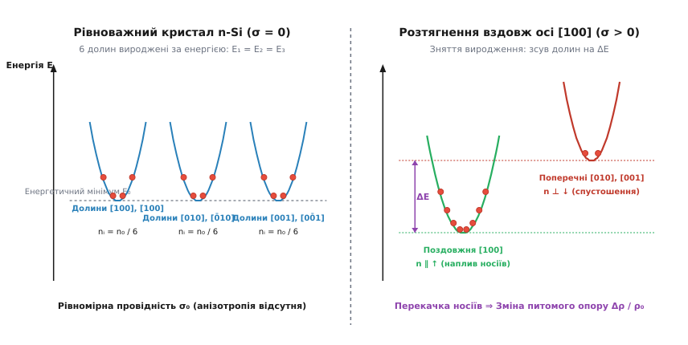
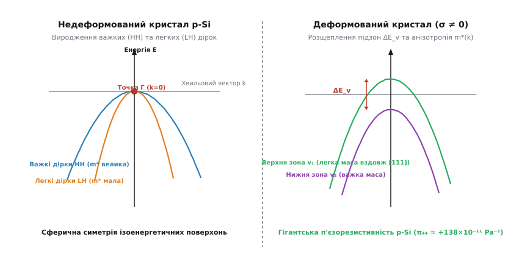
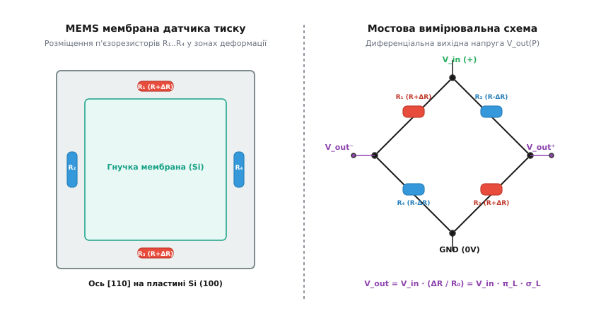

# П'єзорезистивний ефект у напівпровідниках та кристалах

<preknowlist>
- [Зонна теорія напівпровідників](topic:physics/semiconductor) — ефективна маса носіїв, зони провідності та валентні зони, енергетичні долини у k-просторі.
- [Електронний дрейф і рухливість носіїв](topic:physics/electron-drift) — питомий електричний опір, час релаксації імпульсу та тензор провідності.
- [Деформація та напруження у твердих тілах](topic:physics/strain-tensor) — тензор механічних напружень, тензор деформації та закон Гука.
- [Ефект Голла та гальваномагнітні явища](topic:physics/hall-effect) — транспорт носіїв у кристалах із анізотропними ізоенергетичними поверхонями.
</preknowlist>

Коли до металевого дроту прикладають механічне зусилля, його електричний опір змінюється переважно через суто геометричні причини: дріт подовжується, а його поперечний переріз звужується. Однак у 1954 році при вимірюванні електричних властивостей монокристалів кремнію та германію з'ясувалося, що механічна деформація напівпровідника викликає зміну внутрішнього питомого опору речовини, яка у сотні разів перевищує будь-які геометричні ефекти. Це явище отримало назву **п'єзорезистивного ефекту** (*piezoresistivity*).

Причина такого гігантського відгуку полягає не у зміні зовнішніх розмірів кристала, а у глибинних перебудовах його енергетичного спектра. Механічне напруження порушує високу симетрію кристалічної ґратки, розщеплює вироджені енергетичні долини зони провідності та валентні підзони, а також спричиняє масовий перерозподіл носіїв заряду між станами з кардинально різними ефективними масами та рухливостями. Слід чітко розрізняти п'єзорезистивний та п'єзоелектричний ефекти: п'єзоелектрик під дією деформації генерує електричний заряд і макроскопічне поле (без наявності зовнішнього струму), тоді як п'єзорезистор змінює свій опір протіканню вже наявного електричного струму.

Сьогодні п'єзорезистивний ефект становить фундаментальну основу фізики твердотільного транспорту та є головним робочим механізмом для мільярдів мікроелектромеханічних сенсорів (MEMS-датчиків тиску, прискорення, сил та вібрацій), а також для нанодеформаційної інженерії (*Strained Silicon*), яка забезпечує високу швидкодію сучасних FinFET-транзисторів у надвеликих інтегральних схемах.

---

### Від геометричної тензочутливості до електронного ефекту

Щоб зрозуміти унікальність п'єзорезистивності у напівпровідниках, зіставимо її з класичною поведінкою металевих провідників, виявленою Вільямом Томсоном (лордом Кельвіном) ще у 1856 році. Опір однорідного провідника довжиною `L` та площею перерізу `A` описується формулою `R = ρ · L / A`. Якщо піддати провідник малій поздовжній пружній деформації `ε = ΔL / L`, відносна зміна опору виражається як:

```
ΔR / R = ΔL / L - ΔA / A + Δρ / ρ
```

Враховуючи ефект Пуассона (`ΔA / A = -2 ν ε`, де `ν` — коефіцієнт Пуассона), відношення зміни опору до деформації визначає безрозмірний **коефіцієнт тензочутливості** (*Gauge Factor*, `GF`):

```
GF = (ΔR / R) / ε = (1 + 2 ν)  +  (Δρ / ρ) / ε
```

Для більшості металів (мідь, константан, ніхром) коефіцієнт Пуассона дорівнює `ν ≈ 0.3`, а зміна питомого опору `Δρ / ρ` є мізерно малою. У результаті коефіцієнт тензочутливості металевих дротяних та фольгових тензорезисторів становить `GF ≈ 1.5 ... 2.0`.

```
ΔR / R (метали) ≈ 2.0 · ε     [геометричний ефект зміщення атомів]
```

Проте у 1954 році Чарльз Сміт із Bell Telephone Laboratories виявив, що монокристали кремнію n- та p-типу демонструють коефіцієнти тензочутливості від `GF = -140` до `GF = +175`.

```
ΔR / R (p-Si [111]) ≈ 175 · ε  [електронний ефект перебудови зон]
```

Величина `(Δρ / ρ)` у напівпровідниках у десятки й сотні разів перевищує геометричний доданок `(1 + 2ν)`. Це свідчить про те, що механічна деформація безпосередньо керує електронними властивостями кристала.

Детальний історичний шлях від відкриттів Томсона та Сміта до створення сучасних MEMS-приладів викладено у вставці [Відкриття Чарльза Сміта та еволюція напівпровідникових тензодатчиків](topic:physics/piezoresistivity/hist-smith-discovery.md).

---

### Фізичний механізм в n-тип кремнії: зняття дегенерації долин та перерозподіл носіїв

Основою електронного механізму п'єзоопору в n-тип кремнії є багатодолинна структура зони провідності. У недеформованому кубічному кристалі кремнію зона провідності має 6 еквівалентних енергетичних мінімумів (долин), розташованих у k-просторі вздовж кристалографічних осей `<100>` на відстані `0.85` від межі зони Бріллюена.

Ізоенергетичні поверхні поблизу дна кожної долини являють собою витягнуті еліпсоїди обертання. Рух електрона в еліпсоїдальній долині описується анізотропним тензором ефективної маси:
- **Поздовжня маса `m_l*`:** Маса при русі вздовж головної осі еліпсоїда (`m_l* ≈ 0.98 m₀`).
- **Поперечна маса `m_t*`:** Маса при русі перпендикулярно до осі еліпсоїда (`m_t* ≈ 0.19 m₀`).

Оскільки поздовжня маса майже у 5 разів перевищує поперечну масу, дрейфова рухливість електрона вздовж осі еліпсоїда `μ_l = e τ / m_l*` є значно меншою за рухливість у перпендикулярному напрямку `μ_t = e τ / m_t*`.

#### Квантова теорія деформаційного потенціалу Геррінга — Воґта

Квантовомеханічний опис енергетичного зсуву долин зони провідності ґрунтується на Гамільтоніані деформаційного потенціалу, запропонованому Кон'єрсом Геррінгом та Еріком Воґтом. За наявності однорідного тензора деформації `ε_ij` зсув дна `i`-ї енергетичної долини `ΔE_c^{(i)}` визначається двома феноменологічними константами деформаційного потенціалу:

```
ΔE_c^{(i)} = Ξ_d · Tr(ε)  +  Ξ_u · ( u^{(i)} · ε · u^{(i)} )
```

де `Tr(ε) = ε_xx + ε_yy + ε_zz` — гідростатична (об'ємна) зміна розмірів кристала, `Ξ_d` — дилатаційний деформаційний потенціал, `Ξ_u ≈ 8.6 еВ` — зсувний деформаційний потенціал, а `u^{(i)}` — одиничний вектор, спрямований уздовж головної осі `i`-ї долини у k-просторі.

Гідростатичний доданок `Ξ_d Tr(ε)` зсуває всі 6 долин абсолютно однаково за енергією, не викликаючи міждолинного перерозподілу електронів. Натомість сдвігова деформація, виражена другим доданком з константою `Ξ_u`, порушує рівність енергетичних рівнів різних долин, знімаючи їхнє кристалографічне виродження.

#### Зняття виродження долин під дією одноосьового напруження

У недеформованому кристалі всі 6 долин мають абсолютно однакову енергію дна `E₀`. Загальна концентрація електронів провідності `n₀` рівномірно розподіляється між 6 долинами: `n₁ = n₂ = ... = n₆ = n₀ / 6`. Завдяки кубічній симетрії висока анізотропія окремих долин повністю компенсується, і сумарний тензор провідності недеформованого кристала є строго ізотропним:

```
σ₀ = e · n₀ · μ_avg = e · n₀ · (1/3) · ( (1 / m_l*) + (2 / m_t*) ) · e τ
```

При прикладанні одноосьового розтягувального напруження `σ` вздовж напрямку `[100]` кубічна симетрія ґратки порушується.


*Зсув енергетичних мінімумів долин зони провідності кремнію n-типу та перерозподіл носіїв під дією одноосьового розтягнення.*

У результаті розтягнення вздовж `[100]`:
1. Дві долини, розташовані вздовж осі деформації `[100]` та `[̄100]`, опускаються за енергією на величину `-(2/3) ΔE`.
2. Чотири долини, розташовані перпендикулярно до осі деформації (`[010]`, `[0̄10]`, `[001]`, `[00̄1]`), піднімаються за енергією на `+(1/3) ΔE`.

#### Динаміка перерозподілу та зміна питомого опору

Електрони провідності миттєво (за час порядка релаксації фази `τ ≈ 10⁻¹²` с) міждолинно розсіюються та перерозподіляються між зсунутими рівнями відповідно до статистики Максвелла — Больцмана:

```
n_i ∝ exp( - (E_i - E_F) / (k_B T) )
```

Оскільки поздовжні долини `[100]` стають енергетично вигіднішими, електрони масово переходять із вищих поперечних долин у нижчі поздовжні долини.

Розрахуємо сумарний струм вздовж осі `[100]`. Для електронів у поздовжніх долинах `[100]` напрямок струму збігається з їхньою важкою масою `m_l*` (мала рухливість `μ_l`). У той же час кількість електронів у поперечних долинах, де струм переносу визначався легкою масою `m_t*` (висока рухливість `μ_t`), стрімко зменшується.

У результаті сумарна електропровідність вздовж осі деформації `σ_∥` зменшується:

```
σ_∥ = e · ( 2 n_∥ · μ_l  +  4 n_⊥ · μ_t ) < σ₀
```

Оскільки питомий опір є оберненою величиною провідності (`ρ = 1 / σ`), питомий опір `ρ_∥` зростає. Для n-тип кремнію відносна зміна питомого опору прямо пропорційна енергетичному розщепленню та обернено пропорційна тепловій енергії `k_B T`:

```
Δρ / ρ₀ ≈ (1/3) · ( (μ_t - μ_l) / μ_avg ) · ( ΔE / (k_B T) )
```

Оскільки `μ_t > μ_l`, при розтягненні опір зростає, а при стисканні — зменшується. Це дає від'ємний поздовжній коефіцієнт п'єзоопору `π₁₁ ≈ -102.2 × 10⁻¹¹ Па⁻¹`.

#### Зміна міждолинного розсіювання фононів

Крім простого перерозподілу носіїв за масами, енергетичний зсув долин модифікує й самі часи релаксації імпульсу `τ`. Розсіювання електронів в n-кремнії відбувається шляхом випромінювання та поглинання міждолинних фононів двох типів:
- **f-розсіювання (f-scattering):** Перехід електрона між долинами, розташованими на взаємно перпендикулярних осях (наприклад, з `[100]` у `[010]`).
- **g-розсіювання (g-scattering):** Перехід електрона між протилежними долинами однієї осі (з `[100]` у `[̄100]`).

Коли поперечні долини піднімаються на енергію `ΔE > ℏ ω_phonon`, ймовірність f-розсіювання електронів із нижчих поздовжніх долин у вищі поперечні долини різко падає, оскільки електрон має отримати додаткову енергію від фонона. У результаті час вільного пробігу `τ` електронів у поздовжніх долинах зростає, що створює додатковий внесок у тензор п'єзоопору.

---

### Фізичний механізм у p-тип кремнії: деформація валентної зони та зміна ефективних мас

Механізм п'єзоопору у напівпровідниках p-типу (кремній, германій) є істотно складнішим, оскільки верхівка валентної зони у точці `k = 0` (точка `Γ`) є дворазово виродженою за орбітальним моментом (без урахування спіну).

У недеформованому кубічному кристалі у точці `Γ` зіткаються дві підзони:
1. **Зона важких дірок (*Heavy Holes*, HH):** Характеризується малою кривизною `E(k)` та великою ефективною масою (`m_hh* ≈ 0.49 m₀`).
2. **Зона легких дірок (*Light Holes*, LH):** Характеризується високою крутизною `E(k)` та малою ефективною масою (`m_lh* ≈ 0.16 m₀`).

Ізоенергетичні поверхні валентної зони не є сферами — вони мають складну гофровану форму (*warped spheres*), яка описується Гамільтоніаном Латтінджера — Кона.

#### Гамільтоніан Пікуса — Біра та зняття виродження у точці Γ

Коли до кристала p-кремнію прикладається одноосьове або зсувне механічне напруження `σ`, симетрія кристала знижується з кубічної до тетрагональної або тригональної. Для квантовомеханічного опису деформованої валентної зони Григорій Пікус та Еммануїл Бір сформулювали деформаційний Гамільтоніан `H_strain`, який додається до Гамільтоніана Латтінджера — Кона `H_LK`:

```
H_total = H_LK(k) + H_strain(ε)
```

Матричні елементи Гамільтоніана Пікуса — Біра `H_strain` у базисі спінорів `J = 3/2` визначаються трьома деформаційними потенціалами: `a` (гідростатичний зсув всієї зони), `b` (тетрагональне розщеплення вздовж `<100>`) та `d` (тригональне розщеплення вздовж `<111>`).

Механічне напруження негайно **знімає виродження підзон важких та легких дірок у точці Γ**, розщеплюючи їхню спільну вершину на величину `ΔE_v`:

```
ΔE_v = 2 · |b| · ( ε_xx - ε_yy )        [для деформації вздовж [100]]
ΔE_v = 2√3 · |d| · ε_xy                [для зсувної деформації у площині (100)]
```

де `b ≈ -2.1` еВ та `d ≈ -4.8` еВ — тетрагональний та тригональний деформаційні потенціали валентної зони кремнію.


*Зняття виродження важких (HH) та легких (LH) дірок у точці Г та деформація ізоенергетичних поверхонь валентної зони p-кремнію.*

Механічна деформація викликає три одночасних мікроскопічних ефекти у валентній зоні:

1. **Міжпідзонний перерозподіл носіїв:** Дірки перетікають із нижньої розщепленої підзони у верхню підзону, яка має нижчу енергію для дірок.
2. **Зміна ефективної маси `m*(k)`:** Поверхні постійної енергії `E(k)` під дією деформації сильно витягуються. У напрямку деформації кривизна верхньої підзони стрімко зростає, внаслідок чого ефективна маса дірок вздовж осі напруження зменшується до значення `m* ≈ 0.1 m₀`. Вздовж перпендикулярних напрямків маса, навпаки, зростає.
3. **Пригнічення міжпідзонного розсіювання:** У недеформованому кристалі легкі дірки інтенсивно розсіюються у підзону важких дірок із високою густиною станів. Енергетичне розщеплення підзон `ΔE_v > k_B T` унеможливлює міжпідзонне розсіювання, що різко збільшує час релаксації імпульсу `τ`.

Завдяки сильному зсувному деформаційному потенціалу `d` p-тип кремній показує гігантську чутливість до зсувних деформацій. Поздовжній п'єзорезистивний коефіцієнт вздовж кристалографічної осі `[110]` досягає значення `π_L[110] ≈ +71.8 × 10⁻¹¹ Па⁻¹`, а вздовж осі `[111]` — рекордного значення `π_L[111] ≈ +93.5 × 10⁻¹¹ Па⁻¹`.

---

### Тензорний формалізм п'єзоопору та кубічна симетрія

У тривимірному анізотропному кристалі зв'язок між відносною зміною тензора питомого опору `Δρ_ij / ρ₀` та тензором механічних напружень `σ_kl` описується тензором п'єзорезистивних коефіцієнтів четвертого рангу `π_ijkl`:

```
(Δρ_ij / ρ₀) = π_ijkl · σ_kl
```

Використовуючи симетрію тензорів опору (`Δρ_ij = Δρ_ji`) та напружень (`σ_kl = σ_lk`), за допомогою нотації Фойгта (індекси `11→1`, `22→2`, `33→3`, `23→4`, `13→5`, `12→6`) 81 компонент тензора скорочується до матриці розміром `6 × 6` з 36 елементами:

```
Δρ_α / ρ₀ = ∑_(β=1..6) π_αβ · σ_β
```

#### Матриця п'єзоопору для кубічних кристалів (Клас m3m)

Кубічна симетрія кристалічної ґратки кремнію та германію (група симетрії `O_h`) призводить до того, що з 36 елементів матриці `π_αβ` ненульовими та незалежними залишаються лише три коефіцієнти: `π₁₁`, `π₁₂` та `π₄₄`.

```
[ Δρ₁/ρ₀ ]   [  π₁₁   π₁₂   π₁₂    0     0     0  ]   [ σ₁ ]
[ Δρ₂/ρ₀ ]   [  π₁₂   π₁₁   π₁₂    0     0     0  ]   [ σ₂ ]
[ Δρ₃/ρ₀ ]   [  π₁₂   π₁₂   π₁₁    0     0     0  ]   [ σ₃ ]
[ Δρ₄/ρ₀ ] = [   0     0     0    π₄₄    0     0  ] · [ σ₄ ]
[ Δρ₅/ρ₀ ]   [   0     0     0     0    π₄₄    0  ]   [ σ₅ ]
[ Δρ₆/ρ₀ ]   [   0     0     0     0     0    π₄₄ ]   [ σ₆ ]
```

Фізичний зміст компонентів:
- `π₁₁`: Відгук на поздовжнє нормальне напруження вздовж кубічних осей `<100>`.
- `π₁₂`: Відгук на поперечне нормальне напруження перпендикулярно до кубічних осей.
- `π₄₄`: Відгук на зсувне напруження у площинах `{100}`.

#### Розрахунок орієнтаційних коефіцієнтів π_L та π_T

Для довільного напрямку струму з напрямними косинусами `(l, m, n)` відносно кубічних осей поздовжній коефіцієнт п'єзоопору `π_L` виражається формулою:

```
π_L = π₁₁ - 2 · (π₁₁ - π₁₂ - π₄₄) · ( l² m² + m² n² + l² n² )
```

Для найпопулярнішої у MEMS-технології кремнієвої пластини `(100)` з орієнтацією п'єзорезисторів вздовж напрямку `[110]` (напрямні косинуси `l = 1/√2, m = 1/√2, n = 0`):

```
l² m² + m² n² + l² n² = (1/2)² + 0 + 0 = 1/4
```

Підставляючи це значення у формулу `π_L`, отримуємо підсумкові розрахункові співвідношення для поздовжнього та поперечного коефіцієнтів:

```
π_L[110] = (1/2) · ( π₁₁ + π₁₂ + π₄₄ )
π_T[110] = (1/2) · ( π₁₁ + π₁₂ - π₄₄ )
```

Для p-тип кремнію (`π₁₁ = +6.6`, `π₁₂ = -1.1`, `π₄₄ = +138.1 × 10⁻¹¹ Па⁻¹`):

```
π_L[110] = (1/2) · ( 6.6 - 1.1 + 138.1 ) × 10⁻¹¹ = +71.8 × 10⁻¹¹ Pa⁻¹
π_T[110] = (1/2) · ( 6.6 - 1.1 - 138.1 ) × 10⁻¹¹ = -68.7 × 10⁻¹¹ Pa⁻¹
```

Поздовжній та поперечний коефіцієнти мають майже однаковий модуль і протилежні знаки (`π_L ≈ -π_T`). Ця виняткова математична властивість є основою побудови високочутливих мостових схем.

Повний тензорний вивід та матричні перетворення наведено у вставці [Тензорний формалізм п'єзоопору та кубічна симетрія кристалів](topic:physics/piezoresistivity/math-piezoresistive-tensor.md).

---

### НЕЛІНІЙНІ ЕФЕКТИ ТА НАСИЧЕННЯ ПРИ ВЕЛИКИХ ДЕФОРМАЦІЯХ

При помірних механічних напруженнях (`σ < 100` МПа) зміна питомого опору залежить від напруження строго лінійно. Однак при високих рівнях деформації (`σ > 200 ... 500` МПа), які регулярно виникають у сучасних FinFET-транзисторах та ультратонких MEMS-мембранах, виникають нелінійні п'єзорезистивні ефекти другого порядку.

Відносна зміна опору розкладається у степеневий ряд за компонентними напруженнями:

```
(Δρ / ρ₀) = π_L^{(1)} · σ  +  π_L^{(2)} · σ²  +  O(σ³)
```

де `π_L^{(1)}` — класичний лінійний коефіцієнт п'єзоопору, а `π_L^{(2)}` — квадратичний коефіцієнт п'єзоопору.

#### Фізичні причини насичення п'єзорезистивного відгуку

1. **Повне вилідення та насичення перерозподілу:** В n-тип кремнії при розщепленні долин `ΔE > 3 k_B T` (що відповідає напруженням `σ ≈ 400` МПа при 300 K) майже 100% електронів провідності вже перейшли у найнижчі поздовжні долини. Подальше збільшення напруження більше не може збільшити кількість носіїв у цих долинах, і лінійний перерозподільний механізм повністю насичується.
2. **Насичення деформації валентних підзон:** У p-тип кремнії при сильних деформаціях підзони важких і легких дірок розходяться набагато далі, ніж енергія спін-орбітального розщеплення `ΔE_SO ≈ 44` меВ. Зміна ефективної маси `m*` виходить на насичення, а подальше зростання провідності зумовлюється лише повільними змінами акустичного фононного розсіювання.

У результаті залежність `ΔR / R₀` від напруження `σ` прикривається і виходить на плато насичення при напруженнях `σ > 1` ГПа.

---

### Температурна та концентраційна залежність: Piezoresistive Factor P(N, T)

У реальних приладах п'єзорезистивний коефіцієнт не є строго константою. Він залежить від робочої температури `T` та концентрації легуючої домішки `N` через феноменологічний **п'єзорезистивний фактор Кандера `P(N, T)`**:

```
π(N, T) = π₀ · P(N, T)
```

де `π₀` — коефіцієнт слаболегованого кристала при `300 K`.

#### Фізичні причини редукції чутливості

1. **Температурне розмиття (вплив `k_B T`):** Оскільки міждолинний перерозподіл носіїв та розщеплення валентних підзон пропорційні відношенню `ΔE / (k_B T)`, підвищення температури розмиває розподіл Фермі — Дірака. При високих температурах теплова енергія `k_B T` перевищує деформаційне розщеплення `ΔE_v`, носії вирівнюють свої заселеності між підзонами, і п'єзорезистивний ефект спадає пропорційно `1 / T`.
2. **Вплив високого легування (вироджений напівпровідник):** При високих концентраціях домішок (`N > 10¹⁹ см⁻³`) рівень Фермі `E_F` опускається глибоко у валентну зону. Густина станів поблизу рівня Фермі стає дуже високою, тому малі деформаційні зсуви підзон викликають значно меншу відносну зміну заселеності носіїв.

Аналітичне наближення фактора Кандера для p-кремнію має вигляд:

```
P(N, T) = 1 / [ 1  +  (N / N_ref)^α · (300 / T)^β ]
```

де `N_ref = 1.4 × 10¹⁹ см⁻³`, `α = 0.72`, `β = 0.85`.

Графічні значення коефіцієнтів, температурні коефіцієнти опору (TCR) та чутливості (TCGF) для різних матеріалів наведено у вставці [Фізико-технічні параметри п'єзорезисторів та коефіцієнти симетрії](topic:physics/piezoresistivity/api-mems-piezoresistor-params.md).

---

### Практичні застосування: MEMS-сенсори та нанодеформаційна інженерія (Strained Silicon)

Головними сферами практичного використання п'єзорезистивного ефекту є мікроелектромеханічні системи (MEMS) та сучасна наноелектроніка.

#### 1. MEMS-датчики тиску, прискорення та атомно-силові кантилевери

У кремнієвому п'єзорезистивному датчику тиску гнучка квадратна мембрана товщиною `h = 10 ... 30 мкм` виготовляється шляхом мікромеханічного травлення підкладки Si `(100)`. У зонах максимального механічного напруження (на серединах країв мембрани) сформовано 4 p-тип п'єзорезистори `R₁ ... R₄`.


*Конструктивне розміщення поздовжніх і поперечних п'єзорезисторів на гнучкій кремнієвій мембрані та вимірювальна мостова схема Вітстона.*

Два резистори (`R₁`, `R₃`) орієнтовані поздовжньо до кромки, а два (`R₂`, `R₄`) — поперечно. Під дією тиску `P` поздовжні резистори збільшують опір (`R₀ + ΔR`), а поперечні — зменшують (`R₀ - ΔR`).

Резистори ввімкнені у повний міст Вітстона. Вихідна диференціальна напруга моста `V_out` пропорційна тиску:

```
V_out = V_in · (ΔR / R₀) = V_in · π_L · σ_L(P)
```

Завдяки протилежним знакам `π_L` та `π_T` міст Вітстона забезпечує високу вихідну напругу (до `100 ... 300 мВ` при живленні 5 В) та високу лінійність.

Іншим фундаментальним застосуванням є **самозчитувальні кантилевери атомно-силової мікроскопії (AFM)**. П'єзорезистивний датчик, імплантований в основу балки кантилевера, вимірює її найменші відхилення (до `0.01` нм) без використання зовнішніх лазерно-оптичних систем зчитування, що дозволяє працювати в ультравакуумі, кріогенних камерах та каламутних біологічних розчинах.

Повний чисельний код моделятора MEMS-датчика мовами C та C++ наведено у вставці [Чисельне моделювання напівпровідникового п'єзорезистивного MEMS-датчика](topic:physics/piezoresistivity/proj-piezoresistive-sensor-sim.md).

#### 2. Нанодеформаційна інженерія у FinFET-транзисторах (Strained Silicon)

У сучасних мікропроцесорах (техпроцеси 90 нм — 2 нм) деформаційна інженерія використовується для локального штучного прискорення носіїв у каналі транзистора:
- **У pMOS FinFET транзисторах:** Області витоку та стоку вирощують із гетероепітаксіального сплаву кремній-германій `Si₁₋ₓGeₓ`. Більший період ґратки `SiGe` стискає канал кремнію вздовж напрямку протікання струму (`σ_comp ≈ 1.5 ГПа`). Це знімає виродження валентної зони, зменшує ефективну масу дірок та збільшує їхню рухливість на **100–120%**.
- **У nMOS FinFET транзисторах:** Верхнє покриття з напруженого нітриду кремнію `Si₃N₄` розтягує канал кремнію (`σ_tens ≈ 1.0 ГПа`), що знижує заповнення високих долин та підвищує рухливість електронів на **30–50%**.

---

### Порівняльний аналіз принципів тензочутливості

Для системного розуміння порівняємо п'єзорезистивний ефект із альтернативними фізичними методами вимірювання деформацій та сил у таблиці:

| Метод вимірювання | Фізичний механізм | Коефіцієнт тензочутливості (GF) | Переваги | Обмеження та недоліки |
| :--- | :--- | :--- | :--- | :--- |
| **Металевий тензорезистор** | Зміна геометрії провідника (`ΔL/L - ΔA/A`) | `1.5 ... 2.0` | Низька вартість, мала температурна чутливість | Малий вихідний сигнал, вимагає складних підсилювачів |
| **Напівпровідниковий п'єзорезистор** | Зсув долин та зміна ефективних мас носіїв `m*` | **`+100 ... +175` (p-Si)**, **`-140` (n-Si)** | Гігантський вихідний сигнал, можливість інтеграції з CMOS | Сильна температурна залежність `P(N, T)`, потрібна термокомпенсація |
| **П'єзоелектричний датчик** | Генерація поверхневого заряду `Q = d · F` | Не застосовується (генератор заряду) | Не потребує живлення, висока динаміка (до МГц) | Не здатний вимірювати статичний (постійний) тиск |
| **Ємнісний MEMS-датчик** | Зміна зазору конденсатора `C = ε A / d` | Не застосовується (параметричний) | Надвисока температурна стабільність, мале споживання | Складне зчитування малих ємностей (фемтофаради), сприйнятливість до завад |

> 🔧 **Навіщо це.**
> Розуміння фізичних механізмів п'єзорезистивності є практично необхідним у двох галузях сучасної інженерії:
> 1. **Проектування MEMS-приладів:** Розробники датчиків тиску, акселерометрів та мікроваг орієнтують тензомости вздовж оптимальних осей кристала (`[110]` для p-Si на пластині `(100)`), що дозволяє отримувати максимальну чутливість та мінімальний нульовий дрейф.
> 2. **Проектування субмікронних СБІС:** Фізики та топологи напівпровідникових фабрик (TSMC, Intel, Samsung) розраховують механічні напруження від шарів `SiGe` та `Si₃N₄` для підвищення струму насичення `I_dsat` та швидкодії транзисторів без збільшення енергоспоживання.

П'єзорезистивний ефект є яскравим прикладом того, як глибоке фундаментальне фізичне явище фізики конденсованого стану трансформувалося у масштабну промислову технологію, яка визначає вигляд сучасної мікроелектроніки та сенсорики.
