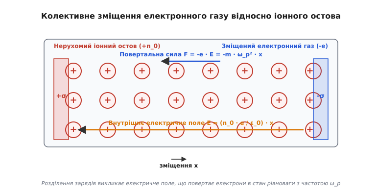
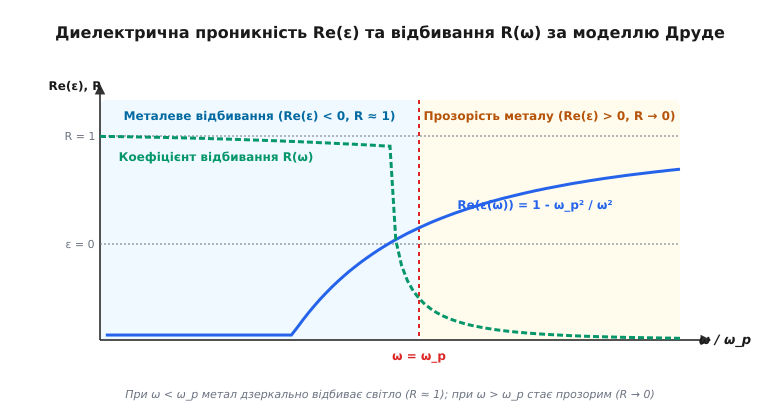
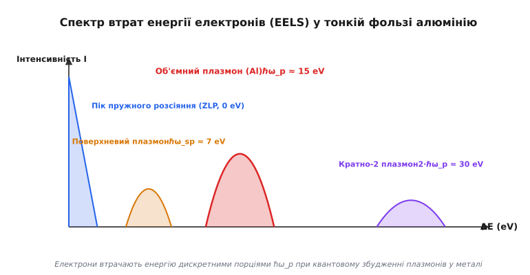
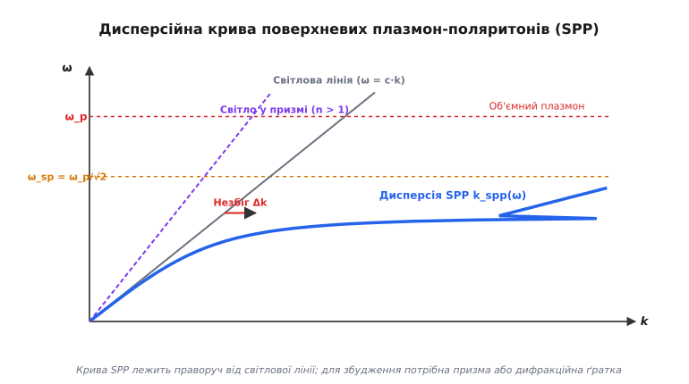

# Плазмові коливання і плазмони

<preknowlist>
- [Електрична провідність металів](topic:physics/conductivity) — вільні електрони, час релаксації та модель Друде.
- [Рівняння Максвелла](topic:physics/electricity-magnetism/maxwell-equations) — дивергенція електричного поля, збереження заряду та зв'язок полів.
- [Провідники та діелектрики](topic:physics/conductors-insulators) — зонна структура, електронні оболонки та носії заряду у твердому тілі.
</preknowlist>

Піднесімо джерело жорсткого ультрафіолетового випромінювання або пучок швидких електронів до гладкої пластини з полірованого алюмінію чи срібла. Для більшості видимих хвиль металева поверхня поводиться як майже ідеальне дзеркало, яке відбиває понад 98% падаючої енергії. Проте при досягненні певного критичного порогу частоти світла або при передачі точної порції кінетичної енергії від пролітаючих електронів метал раптово втрачає свої відбивальні властивості, стає прозорим або інтенсивно поглинає випромінювання. В основі цього оптичного парадоксу лежить колективне явище — узгоджене тремтіння мільярдів електронів відносно іонного кристалічного остова.

Колективні високочастотні збудження електронного газу відносно позитивно зарядженого фону називаються **плазмовими коливаннями** (або ленгмюрівськими хвилями), а їх квантований порціон (квазічастинка) дістав назву **плазмон** (від грецького *πλάσμα* — виліплене, сформатоване). Розуміння плазмових коливань пояснює оптичний спектр металів, визначає енергетичні втрати заряджених частинок у речовині та формує фундамент **плазмоніки** — сучасної галузі нанофотоніки, що керує світлом на нанометрових масштабах.

---

### 1. Механізм плазмових коливань: як виникає колективне тремтіння носіїв заряду

Щоб зрозуміти приборкання колективного руху електронів, розглянемо модель «желе» (jellium model), у якій позитивні іони кристалічної ґратки розмазані у вигляді нерухомого однорідного позитивного фону з об'ємною густиною заряду `ρ_+ = +n_0 · e`, а електрони провідності утворюють рухливу електронну рідину з густиною `ρ_- = -n_0 · e`. У стані термодинамічної рівноваги об'ємний заряд системи в кожній точці дорівнює нулю, і внутрішнє електричне поле відсутнє.

Припустимо тепер, що під дією зовнішнього флуктуаційного збурення або імпульсу зарядженої частинки весь шар електронного газу однорідно змістився праворуч на малу відстань `x` відносно нерухомих іонів.


*Рис. 1 — Зміщення електронного газу відносно іонного остова та виникнення внутрішнього електричного поля.*

Це зміщення миттєво порушує локальну квазінейтральність на межах зразка:
1. На лівій межі виникає нескомпенсований шар позитивних іонів із поверхневою густиною заряду `+σ = +n_0 · e · x`.
2. На правій межі утворюється такий самий нескомпенсований шар надлишкових електронів із поверхневою густиною заряду `-σ = -n_0 · e · x`.

Розділення двох різнойменно заряджених площин викликає всередині металу однорідне електричне поле `E`, яке за теоремою Гаусса для плоского конденсатора спрямоване проти напрямку зміщення `x`:

```
E = (n_0 · e / ε_0) · x
```

Це електричне поле діє на кожен електрон із повертальною кулонівською силою `F = -e · E`:

```
F = - ( (n_0 · e²) / ε_0 ) · x
```

Записавши другий закон Ньютона для електрона масою `m_e` під дією повертальної сили, отримаємо диференціальне рівняння гармонічного осцилятора:

```
m_e · (d²x / dt²) + ( (n_0 · e²) / ε_0 ) · x = 0
```

Розв'язком цього рівняння є незатухаючі гармонічні коливання `x(t) = x_0 · cos(ω_p · t)` із власною цикловою частотою, яка називається **плазмовою частотою Ленгмюра** `ω_p`:

```
ω_p = √ ( (n_0 · e²) / (ε_0 · m_e) )
```

де `n_0` — концентрація вільних електронів провідності, `e` — заряд електрона (`1.602 × 10⁻¹⁹ Кл`), `ε_0` — електрична стала (`8.854 × 10⁻¹² Ф/м`), `m_e` — маса електрона (або її ефективне значення `m*` у кристалічній ґратці).

Важливо підкреслити три фундаментальні особливості плазмових коливань:
- **Колективний характер:** Окремий електрон не може здійснювати плазмове коливання самостійно. Повертальна сила виникає виключно за рахунок сумного кулонівського поля від зміщення мільярдів сусідніх електронів.
- **Відсутність просторового перенесення маси у холодній плазмі:** При чисто поздовжніх плазмових коливаннях без урахування теплового руху (`k → 0`) електромагнітна хвиля не поширюється у просторі — її групова швидкість дорівнює нулю (`v_g = dω/dk = 0`). Увесь електронний газ тремтить синхронно в єдиній фазі.
- **Висока жорсткість:** Оскільки концентрація вільних електронів у металах становить величезну величину (`n_0 ≈ 10²² – 10²³ см⁻³`), повертальна кулонівська сила є гігантською. Частота `ω_p` у металах лежить у надвисокому частотному діапазоні `10¹⁵ – 10¹⁶ рад/с`, що відповідає ультрафіолетовій області спектра.

Детальніше про драматичний шлях від перших спостережень електричних розрядів Ірвінгом Ленгмюром до розробки квантової теорії колективних коливань Девідом Бомом та Девідом Пайнсом читайте у вставці [Історія відкриття плазмових коливань та введення поняття плазмона](topic:physics/plasma-oscillations/hist-langmuir-plasmon.md).

---

### 2. Диелектрична проникність металу та оптичні властивості: від дзеркала до прозорості

Плазмові коливання визначають макроскопічні оптичні властивості речовини у всьому діапазоні від радіохвиль до жорсткого ультрафіолету. За моделлю Друде-Лоренца, диференціальне рівняння руху електрона у змінному електромагнітному полі світлової хвилі `E(t) = E_0 · exp(-i · ω · t)` з урахуванням згасання внаслідок розсіяння має вигляд:

```
m_e · (d²x / dt²) + m_e · γ · (dx / dt) = -e · E_0 · exp(-i · ω · t)
```

де `γ = 1/τ` — частота розсіяння електронів на фононах та дефектах (коефіцієнт згасання), `τ` — середня тривалість вільного пробігу електрона.

Шукаючи розв'язок у формі `x(t) = x_0 · exp(-i · ω · t)`, виразимо комплексний дипольний момент одиниці об'єму (поляризованість) `P = -n_0 · e · x` та визначимо **комплексну диелектричну проникність** металу `ε(ω) = ε_1(ω) + i · ε_2(ω)`:

```
ε(ω) = ε_∞ - ( ω_p² / (ω² + i · γ · ω) )
```

де `ε_∞` — диелектрична проникність іонного остова за нескінченно високої частоти (враховує поляризацію зв'язаних електронів внутрішніх оболонок).

Розділивши дійсну та уявну частини:

```
Re(ε(ω)) = ε_1(ω) = ε_∞ - ( ω_p² / (ω² + γ²) )
Im(ε(ω)) = ε_2(ω) = ( γ · ω_p² ) / ( ω · (ω² + γ²) )
```


*Рис. 2 — Диелектрична проникність Re(ε) та коефіцієнт відбивання R(ω) металу за моделлю Друде.*

Поведінка дійсного значення `Re(ε(ω))` розділяє оптику металів на три строго розмежовані частотні режими:

#### А. Низькочастотний металевий режим (`ω < ω_p`)
На частотах, нижчих за плазмову (у видимому та інфрачервоному діапазонах), дійсне значення діелектричної проникності є **від'ємним**: `Re(ε) < 0`. 
Оскільки комплексний показник заломлення `N = n + i · k = √ε`, від'ємне значення `ε` означає, що дійсна частина показника заломлення `n` є дуже малою (`n ≈ 0`), а показник гасіння `k` — дуже великим (`k ≫ 1`).

Фізично це означає, що електрони металу встигають зміщуватися у протифазі до змінного поля світлової хвилі, повністю екрануючи його всередині металу на тонкій глибині **скін-шару** (`δ ≈ c / ω_p ≈ 10–30 нм`). Електромагнітна хвиля не може поширюватися углиб металу і майже повністю відбивається від його поверхні.

Коефіцієнт відбивання від гладкої поверхні при нормальному падінні з вакууму за формулою Френеля є близьким до ідеальної одиниці:

```
R = | (1 - √ε) / (1 + √ε) |² ≈ 1
```

Саме від'ємне значення `Re(ε)` на частотах `ω < ω_p` забезпечує характерний дзеркальний металевий блиск срібла, алюмінію, золота та міді.

#### Б. Поріг плазмового резонансу (`ω = ω_p`)
На частоті `ω = ω_p` (знехтувавши згасанням `γ ≪ ω_p`) дійсна частина діелектричної проникності перетворюється на нуль: `Re(ε(ω_p)) = 0`.
Згідно з рівнянням індукції Максвелла `D = ε_0 · ε · E`, при `ε = 0` електричне зміщення `D` дорівнює нулю навіть при існуванні ненульового електричного поля `E`. Це означає, що у речовині можуть існувати **поздовжні електромагнітні коливання** без наявності сторонніх вільних зарядів.

#### В. Високочастотний режим оптичної прозорості (`ω > ω_p`)
На частотах, вищих за плазмову (в ультрафіолетовому та рентгенівському діапазонах), інерція електронів не дозволяє їм відслідковувати швидкі коливання світлового поля. Дійсна частина діелектричної проникності стає **додатною**: `Re(ε) > 0`, а коефіцієнт відбивання `R(ω)` стрімко прямує до нуля.

Метал скачкоподібно втрачає свої металеві властивості і перетворюється на звичайний прозорий діелектрик. Це явище називається **ультрафіолетовою прозорістю металів**. Наприклад, лужні метали (натрій, калій, літій) стають абсолютно прозорими для ультрафіолетового світла на довжинах хвиль, коротших за 200–300 нм.

Чисельний розрахунок комплексного спектра `ε(ω)`, показників `n`, `k` та коефіцієнта відбивання `R(ω)` для срібла й алюмінію наведено у вставці [Чисельне моделювання комплексної діелектричної проникності та поверхневих плазмонів за моделлю Друде](topic:physics/plasma-oscillations/proj-plasmon-drude.md).

---

### 3. Квантова природа: об'ємні плазмони та спектроскопія EELS

При переході до квантового опису твердого тіла класичні плазмові коливання електронного газу квантуються строго так само, як коливання кристалічної ґратки (фонони) чи коливання електромагнітного поля (фотони). 

Елементарний квант об'ємних плазмових коливань називається **об'ємним плазмоном** (*bulk plasmon*). Порція енергії, яка відповідає одному плазмону, дорівнює:

```
E_p = ℏ · ω_p
```

де `ℏ = 1.05457 × 10⁻³⁴ Дж·с` (або `6.5821 × 10⁻¹⁶ еВ·с`) — зведена стала Планка.

Оскільки концентрація вільних електронів у металах становить `10²² – 10²³ см⁻³`, енергія об'ємного плазмона виявляється дуже великою — від 3 до 30 електронвольт:

| Метал / Напівпровідник | Концентрація `n_0` (см⁻³) | Експериментальна енергія плазмона `ℏ·ω_p` (еВ) |
| :--- | :--- | :--- |
| **Алюміній (Al)** | `18.1 × 10²²` | `15.3 еВ` |
| **Магній (Mg)** | `8.6 × 10²²` | `10.6 еВ` |
| **Натрій (Na)** | `2.65 × 10²²` | `5.7 еВ` |
| **Срібло (Ag)** | `5.86 × 10²²` | `9.0 еВ` |
| **Кремній (Si)** | `20.0 × 10²²` (валентні) | `16.6 еВ` |

Через таку велику енергію `ℏ·ω_p ≫ k_B·T` за кімнатних температур (`k_B·T ≈ 0.025 еВ`) плазмони у твердих тілах не можуть збуджуватися за рахунок звичайного теплового руху кристалічної ґратки. Опинитися у збудженому плазмонному стані метал може лише під дією зовнішніх високоенергетичних частинок або фотонів.

#### Спектроскопія втрат енергії електронів (EELS)

Найпрямішим і найточнішим методом експериментального спостереження плазмонів є **спектроскопія втрат енергії електронів** (`EELS` — *Electron Energy Loss Spectroscopy*).

У цьому експерименті вузький моноенергетичний пучок швидких електронів з початковою кінетичною енергією `E_0` (зазвичай від 10 до 200 кеВ) пропускається крізь надтонку металеву фольгу завтовшки 20–50 нм у просвічувальному електронному мікроскопі. Пролітаючи крізь метал, швидкий електрон створює навколо себе імпульсне кулонівське поле, яке збуджує колективні коливання електронного газу фольги.


*Рис. 4 — Спектр втрат енергії електронів (EELS) у тонкій фользі алюмінію з піками поверхневих та об'ємних плазмонів.*

Спектр енергій електронів, що пройшли крізь фольгу, виявляє дивовижну дискретну структуру:
1. **Пік пружного розсіяння (Zero-Loss Peak, ZLP):** Розташований строго при `ΔE = 0`. Відповідає електронам, які пройшли крізь фольгу без передачі енергії.
2. **Пік поверхневого плазмона:** Спостерігається при меншій енергії `ΔE = ℏ · ω_sp` (для алюмінію — близько `7 еВ`). Відповідає збудженню плазмонів на межі розділу метал-вакуум.
3. **Головний пік об'ємного плазмона:** Спостерігається при енергії `ΔE = ℏ · ω_p` (для алюмінію — строго `15.3 еВ`). Пролітаючи крізь кристал, електрон передає середовищу порцію енергії, необхідну для народження одного об'ємного плазмона.
4. **Кратно-2 та кратно-3 плазмонні піки:** Спостерігаються при енергіях `ΔE = 2 · ℏ · ω_p` (`30.6 еВ`) та `ΔE = 3 · ℏ · ω_p` (`45.9 еВ`). Якщо фольга є відносно товстою, один і той самий швидкий електрон встигає послідовно породити два або три плазмони поспіль на своєму шляху.

Строгий математичний вивід дисперсійного співвідношення плазмонів з урахуванням теплового тиску Бома-Ґросса `ω² = ω_p² + 3·v_th²·k²` та квантового дисперсійного співвідношення Томаса-Фермі `ω² = ω_p² + (3/5)·v_F²·k²` наведено у вставці [Математичний вивід частоти Ленгмюра та термодинамічної дисперсії хвиль Bohm-Gross](topic:physics/plasma-oscillations/math-plasma-dispersion.md).

---

### 4. Поверхневі плазмон-поляритоні (SPP) та локалізований плазмонний резонанс

Окрім об'ємних плазмонів, які поширюються у безмежному металевому середовищі, на геометричній межі розподілу між металом та діелектриком виникає особливий тип колективних збуджень — **поверхневі плазмон-поляритоні** (`SPP` — *Surface Plasmon Polaritons*).

Поверхневий плазмон-поляритон є гібридною квазічастинкою: це гібрид поздовжніх коливань електронної густини на поверхні металу та поперечної електромагнітної світлової хвилі у прилеглому діелектрику.

Розв'язавши рівняння Максвелла для плоскої межі `z = 0` між металом (`z < 0`, `ε_m(ω) < 0`) та діелектриком (`z > 0`, `ε_d > 0`) для поперечно-магнітної хвилі (TM-поляризація), отримаємо дисперсійне співвідношення поверхневих плазмонів:

```
k_spp = (ω / c) · √ ( (ε_m(ω) · ε_d) / (ε_m(ω) + ε_d) )
```

де `k_spp` — хвильовий вектор поверхневого плазмона, спрямований уздовж межі розподілу.


*Рис. 3 — Дисперсійні криві об'ємних плазмонів та поверхневих плазмон-поляритонів (SPP).*

Аналіз дисперсійної кривої SPP розкриває три ключові фізичні властивості:

1. **Резонансна частота поверхневого плазмона `ω_sp`:**
   Коли дійсне значення `ε_m(ω)` прямує до `-ε_d`, знаменник у формулі прямує до нуля, а хвильовий вектор `k_spp` прямує до нескінченності. Для межі метал-вакуум (`ε_d = 1`) частота поверхневого плазмона становить:

   ```
   ω_sp = ω_p / √2
   ```

   Для алюмінію це дає `ℏ·ω_sp ≈ 15.3 / 1.414 ≈ 10.8 еВ`, а для срібла — близько `3.6 еВ` (ближній ультрафіолет).

2. **Експоненціальне згасання углиб (зв'язані хвилі):**
   Електричне поле SPP має максимальну амплітуду строго на межі `z = 0` і експоненціально спадає в обидва боки від межі за законом `exp(-κ · |z|)`. Глибина проникнення поля у діелектрик становить від сотен нанометрів до одиниць мікрометрів, а в метал — порядку скін-шару (10–30 нм). Це означає, що вся енергія електромагнітного поля виявляється «стиснутою» у надтонкому приповерхневому шарі.

3. **Проблема фазового незбігу та геометрія Кречмана:**
   За будь-якої частоти `ω < ω_sp` крива дисперсії SPP `k_spp(ω)` лежить строго праворуч від світлової лінії у вакуумі `k_light = ω / c`.
   Це означає, що за однакової частоти `ω` хвильовий вектор поверхневого плазмона є більшим за імпульс світлового фотона у вакуумі: `k_spp > k_light`. Вільний світловий промінь, що падає з повітря на плоску металеву поверхню, принципово не може збудити поверхневий плазмон через брак імпульсу.

Щоб компенсувати цей фазовий незбіг `Δk = k_spp - k_light`, німецький фізик Ервін Кречман у 1968 році запропонував використати скляну призму з високим показником заломлення `n_p > 1`. Коли світло падає всередині призми під кутом повного внутрішнього відбивання, імпульс фотона вздовж підошви призми зростає в `n_p` разів: `k_prism = (ω/c) · n_p · sin(θ)`. При досягненні резонансного **кута Кречмана** `θ_K` напрямок імпульсу точно збігається з імпульсом SPP, і світлова енергія на 100% перекачується у поверхневий плазмон.

#### Локалізований поверхневий плазмонний резонанс (LSP)

Якщо метал обмежений не плоскою поверхнею, а утворює наночастинку розміром `R ≪ λ` (наприклад, металеву кульку діаметром 10–50 нм), поверхневі плазмони не поширюються у вигляді біжучої хвилі, а утворюють стоячу локалізовану хвилю — **локалізований поверхневий плазмон** (`LSP` — *Localized Surface Plasmon*).

За теорією розсіяння Мі, поляризовність малої металевої кульки у діелектричному середовищі `ε_d` дорівнює:

```
α(ω) = 4 · π · R³ · ( (ε_m(ω) - ε_d) / (ε_m(ω) + 2 · ε_d) )
```

Резонанс виникає при виконанні так званої **умови Фреліха**:

```
Re(ε_m(ω_LSP)) = -2 · ε_d
```

У цій точці наночастинка інтенсивно поглинає та розсіює світло строго визначеної довжини хвилі. 

Саме локалізований плазмонний резонанс пояснює дивовижні оптичні ефекти, відомі людству з давніх-давен. Золотий колбасний розчин (золь Олександра Ленуара та Майкла Фарадея) демонструє не жовтий, а насичений рубіново-червоний колір завдяки резонансному поглинанню плазмонів наночастинок золота на довжині хвилі 520 нм. Знаменита давньоримська «Чаша Лікурга» (IV століття н. е.) здається зеленою у відбитому світлі і стає яскраво-червоною при освітленні зсередини напрохід — завдяки розсіянню світла на наночастинках сплаву золота та срібла, вкраплених у скло.

---

### 5. Сучасне застосування плазмоніки: від нанофотоніки до надчутливих біосенсорів

Відкриття плазмонів та розробка методів керування ними поклали початок **плазмоніці** — передовому напрямку сучасної прикладної фізики, який об'єднує переваги фотоніки (величезна швидкість передачі сигналу) та мікроелектроніки (нанометрові розміри елементів).

Головні напрямки практичного застосування плазмових явищ включають:

1. **Плазмонні біосенсори (Surface Plasmon Resonance, SPR):**
   Прилади на основі схеми Кречмана дозволяють вимірювати зміни показника заломлення середовища біля поверхні золотого чіпа з точністю до `10⁻⁶`. Коли до антитіл, знерухомлених на поверхні золота, приєднуються білкові молекули або фрагменти ДНК, це викликає зсув резонансного кута Кречмана `Δθ_K`. Це дозволяє у реальному часі без застосування будь-яких флуоресцентних міток реєструвати біохімічні реакції, діагностувати вірусні інфекції та розробляти нові лікарські препарати.

2. **Гігантське комбінаційне розсіяння (SERS — Surface-Enhanced Raman Spectroscopy):**
   Поблизу гострих металевих наноструктур або у вузьких зазорах між наночастинками («гарячих точках», *hot spots*) локальне напряженість електричного поля плазмона зростає в сотні разів. Оскільки інтенсивність комбінаційного (раманівського) розсіяння молекул пропорційна четвертому ступеню локального поля (`|E|⁴`), сигнал розсіяння посилюється у `10⁶ – 10¹⁰` разів. Це дає змогу ідентифікувати хімічний склад речовин аж до виявлення **поодиноких молекул**.

3. **Плазмонна нанофотоніка та нанолазери (Спазери):**
   Поверхневі плазмони дають змогу локалізувати світлову енергію в об'ємах, значно менших за класичну дифракційну межу Аббе (`V ≪ (λ/2)³`). Це дозволяє створювати плазмонні хвилеводи нанометрового перерізу для оптичних чіпів майбутнього та **спазери** (*SPASER* — *Surface Plasmon Amplification by Stimulated Emission of Radiation*) — квантові генератори поверхневих плазмонів розміром у кілька нанометрів.

4. **Оптичні метаматеріали та суперлінзи:**
   Створюючи штучні періодичні масиви металевих наноструктур (метаповерхні), вчені отримують матеріали з **від'ємним показником заломлення** (`n < 0`). Це відкриває можливість створення плоскопаралельних «суперлінз» Пендрі, здатних формувати оптичні зображення з роздільною здатністю, значно вищою за довжину хвилі світла, а також розробки концепцій оптичного «маскування незаметності».

Плазмові коливання та плазмони демонструють фундаментальну єдність класичної електродинаміки та квантової фізики твердого тіла. Від звичайного металевого дзеркала до квантових спазерів і біосенсорів одиночних молекул — плазмонний механізм залишається одним із найбагатших інструментів сучасної фізики конденсованого стану.
