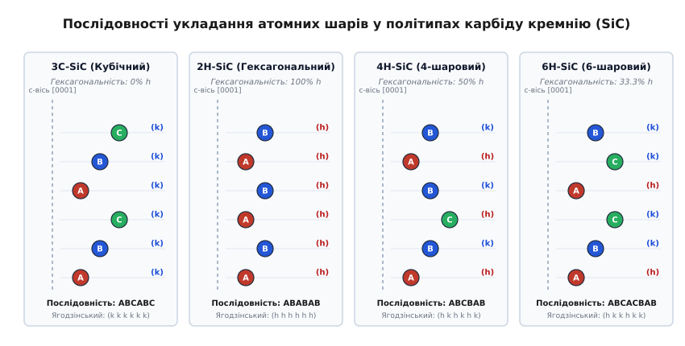
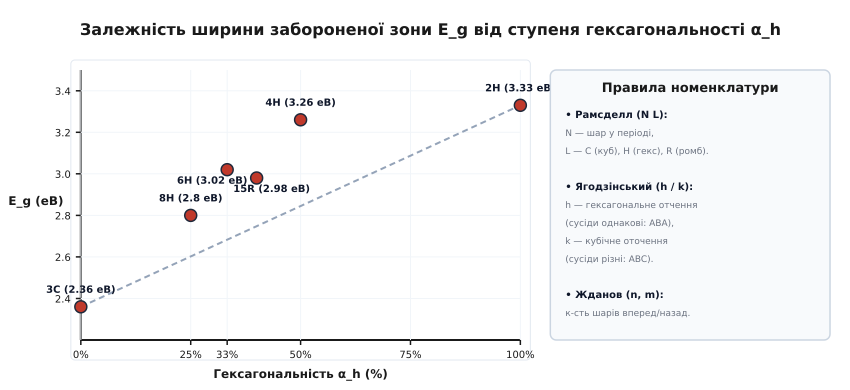
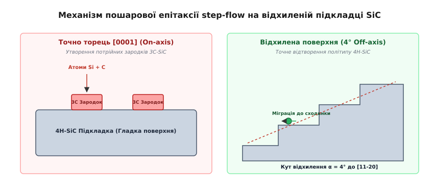
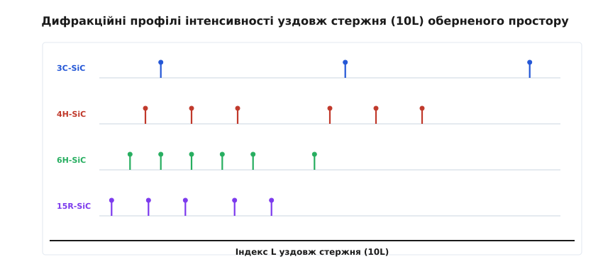

# Політипізм

<preknowlist>
- [Дифракція Бреґґа](topic:physics/bragg-diffraction) — розсіювання рентгенівських променів на періодичних атомних площинах.
- [Обернена ґратка та зони Бріллюена](topic:physics/reciprocal-lattice) — трансляційна симетрія у просторі імпульсів та інтерпретація дифракції.
- [Зонна теорія твердого тіла](topic:physics/band-theory) — формування дозволених та заборонених енергетичних зон у кристалічному потенціалі.
</preknowlist>

При вирощуванні монокристалів карбіду кремнію (SiC) сублімаційним методом за температури понад 2000 °C хімічний та спектральний аналіз показує строго фіксоване стехіометричне співвідношення атомів Кремнію та Вуглецю 1:1. Проте вирощені зливки виявляють кардинально відмінні фізичні властивості: частина кристалів є вузькозонними напівпровідниками з шириною забороненої зони 2.36 еВ, тоді як інші демонструють широкозонну поведінку з межею 3.26 еВ та сильною анізотропією електропровідності. Причиною такого розходження є політипізм — особливий, одновимірний випадок поліморфізму, за якого кристалічні модифікації складені з абсолютно ідентичних за двовимірною будовою та хімічним складом атомних шарів, але відрізняються виключно послідовністю їх укладання вздовж перпендикулярної осі.

## Фізична природа та фундаментальні критерії політипізму

У класичній фізиці конденсованого стану та кристаллографії поліморфізм описує здатність речовини однакового хімічного складу існувати у двох або більше кристалічних фазах, які відрізняються внутрішньою симетрією, типом хімічного зв'язку та координаційними числами атомів. Наприклад, елементарний вуглець існує у формі алмазу (де кожен атом перебуває в sp³-гібридизованому стані й утворює чотири міцні ковалентні зв'язки у тетраедричній конфігурації) та у формі графіту (де атоми утворюють двовимірні плоскі сітки з sp²-гібридизацією, з'єднані слабкими ван-дер-ваальсовими силами).

Політипізм є специфічним субкласом поліморфізму, притаманним шаруватим кристалам та щільно упакованим атомним структурам. Фундаментальна відмінність політипізму від загального поліморфізму полягає в суворій двовимірній інваріантності. Окремий двовимірний шар, з якого будується кристал, залишається абсолютно незмінним для всіх політипів даної сполуки:
- **Хімічна стехіометрія та атомний склад:** Кожен шар містить однакову кількість атомів відповідних елементів (наприклад, шар тетраедрів SiC₄ у карбіді кремнію, шар шаруватого дисульфіду молібдену MoS₂ або сульфіду цинку ZnS).
- **Внутрішньошарова геометрія:** Міжатомні відстані між найближчими сусідами в межах одного шару, валентні кути між зв'язками та плоска трансляційна симетрія (параметр плоскої гексагональної комірки `a`) є абсолютно ідентичними.
- **Тип хімічного зв'язку:** Електронні хмари, що формують ковалентні або іонно-ковалентні зв'язки всередині шару, не зазнають деформацій при зміні політипної модифікації.

Єдина відмінність між різними політипами виникає у третьому вимірі — вздовж нормалі до площини двовимірного шару (вздовж головної кристаллографічної осі c у гексагональній та ромбоедричній системах або вздовж просторової діагоналі `[111]` у кубічній системі). Сусідні двовимірні шари можуть зміщуватися один відносно одного у площині на один із трьох фіксованих векторів трансляції.

Оскільки міжатомні ковалентні зв'язки всередині шару є надзвичайно міцними, а енергія взаємодії між віддаленими шарами є відносно слабкою, термодинамічна різниця вільних енергій утворення різних політипів виявляється мікроскопічною. Розрахунки з перших принципів (DFT) підтверджують, що різниця енергій між політипами 4H-SiC, 6H-SiC та 15R-SiC становить лише від `1` до `10 меВ` на атомну пару Si-C. 

Для порівняння, середня кінетична енергія теплового руху `k_B · T` при кімнатній температурі (`300 K`) становить близько `26 меВ`, а при температурах вирощування кристалів (`2300 K`) сягає `200 меВ`. Саме ця мала енергетична різниця пояснює, чому сотні різних політипних модифікацій можуть виникати, співіснувати та тривалий час зберігати метастабільний стан за однакових зовнішніх умов.


*Формування послідовностей укладання двовимірних шарів A, B, C уздовж осі c для кубічного (3C), гексагональних (2H, 4H, 6H) политипів з позначенням локального оточення за Ягодзінським.*

## Геометрія укладання шарів та номенклатурні системи

Для геометричного опису щільно упакованих структур у кристалографії застосовують систему трьох дискретних позицій шарів у площині `(0001)`, які позначають буквами `A`, `B` та `C`. При щільному укладанні однакових сфер шару кожен наступний шар розміщується у лунках (заглибинах) між сферами попереднього шару.

У двовимірній гексагональній сітці з векторами базису `a1` та `a2` існує рівно три диз'юнктні позиції для центрів атомів:
- **Позиція A:** базове положення з відносними координатами `(0, 0)`;
- **Позиція B:** зсув на вектор `t1 = (2/3)·a1 + (1/3)·a2`, що відповідає відносним координатам `(2/3, 1/3)`;
- **Позиція C:** зсув на вектор `t2 = (1/3)·a1 + (2/3)·a2`, що відповідає відносним координатам `(1/3, 2/3)`.

З міркувань просторового перекриття атомних радіусів діє суворе кристаллографічне правило заборони: два послідовні суміжні шари не можуть займати однакову позицію у площині. Послідовності `AA`, `BB` або `CC` є фізично неможливими, оскільки вони вимагали б розміщення атомів один над одним на відстані, меншій за радіус ковалентного зв'язку.

Будь-яка допустима послідовність укладання є нескінченним ланцюжком символів з трьохбуквеного алфавіту `{A, B, C}` без однакових сусідніх букв. Для зручної класифікації цього різноманіття кристалографи розробили три основні системи номенклатури.

### 1. Номенклатура Рамсделла (`N L`)
Запропонована Льюїсом Рамсделлом у 1947 році, ця номенклатура є найпростішою та найуживанішою в промисловості. Вона описує політип за допомогою двох символів:
- Числа `N`, яке вказує на загальну кількість атомних шарів у періоді повторюваності елементарної комірки уздовж осі c.
- Букви `L`, яка позначає кристаллографічну сингонію кристала:
  - `C` (Cubic) — кубічна сингонія;
  - `H` (Hexagonal) — гексагональна сингонія;
  - `R` (Rhombohedral) — ромбоедрична сингонія;
  - `T` (Trigonal) — тригональна сингонія.

Приклади найважливіших політипів:
- `3C-SiC`: кубічний політип (структура сфалерит), чергування шарів `...ABCABC...`, період 3 шари.
- `2H-SiC`: гексагональний політип (структура вюрцит), чергування `...ABABAB...`, період 2 шари.
- `4H-SiC`: 4-шаровий гексагональний політип з чергуванням `...ABCBAB...`.
- `6H-SiC`: 6-шаровий гексагональний політип з чергуванням `...ABCACBAB...`.
- `15R-SiC`: 15-шаровий ромбоедричний політип з періодом із 15 шарів.

### 2. Номенклатура Ягодзінського (`h / k`)
Хайнц Ягодзінський запропонував локальний підхід, орієнтований на короткодіюче атомне оточення кожного окремого шару. Шар позначається однією з двох букв залежно від орієнтації його двох найближчих сусідів:
- **Гексагональне оточення `h`:** якщо шар знаходиться між двома однаково орієнтованими шарами (наприклад, шар `B` у триплеті `A B A`).
- **Кубічне оточення `k`:** якщо шар знаходиться між двома різноорієнтованими шарами (наприклад, шар `B` у триплеті `A B C`).

Це дозволяє обчислити ключовий фізичний параметр політипу — **ступінь гексагональності `α_h`**:

```
α_h = (N_h / (N_h + N_k)) · 100%
```

де `N_h` та `N_k` — кількість гексагональних та кубічних шарів у періоді комірки. Кубічний политип 3C-SiC має `α_h = 0%`, 2H-SiC — `α_h = 100%`, 4H-SiC — `α_h = 50%`, а 6H-SiC — `α_h = 33.3%`.

### 3. Номенклатура Жданова `(n1, n2, ...)`
Г. С. Жданов запропонував фіксувати кількість послідовних зсувів у прямому напрямку `+` (`A → B → C → A`) та у зворотному напрямку `-` (`A → C → B → A`). Символ складається з пари або набору чисел, що вказують на довжину позитивних та негативних блоків:
- `2H`: символ Жданова `(1, 1)` — чергування `+-+-`;
- `4H`: символ Жданова `(2, 2)` — чергування `++--++--`;
- `6H`: символ Жданова `(3, 3)` — чергування `+++---+++---`;
- `15R`: символ Жданова `(3, 2)₃` — потрійне повторення блоку `+++--`.

Математичні формули перетворення між номенклатурами та розрахунки розщеплення шарів викладено у вставці `[🧮 Математика послідовностей укладання та зонної структури](topic:physics/polytypism/math-stacking-notation-and-bandgap.md)`.

Деталі відкриття цих систем та історичний контекст дослідження поліморфізму наведено у вставці `[📜 Історія відкриття та дослідження політипізму](topic:physics/polytypism/hist-polytypism-discovery.md)`.


*Залежність ширини забороненої зони E_g від відсотка гексагональних шарів α_h за Ягодзінським для політипів карбіду кремнію.*

## Вплив послідовності укладання на зонну структуру та електронні властивості

Зміна послідовності укладання шарів не змінює загальну густину valence-електронів у кристалі, але створює макроскопічну одновимірну суперґратку вздовж осі c. З точки зону квантової механіки це еквівалентно накладанню додаткового періодичного потенціалу з періодом `d = N · c_layer`. 

Цей потенціал призводить до згортання зони Бріллюена (zone folding) у напрямку `Γ-A` та розщеплення енергетичних зон носіїв заряду.

### Залежність ширини забороненої зони `E_g`
У карбіді кремнію ширина забороненої зони виявляє високу чутливість до ступеня гексагональності `α_h`. Кубічні шари `k` створюють локальне середовище з вищою симетрією та меншим енергетичним розщепленням, тоді як гексагональні шари `h` посилюють внутрішнє кристалічне поле:
- `3C-SiC` (α_h = 0%): `E_g = 2.36 еВ` (абсолютний мінімум зони провідності лежить у X-точці зони Бріллюена);
- `6H-SiC` (α_h = 33.3%): `E_g = 3.02 еВ` (мінімум зони провідності розташований вздовж лінії M-L);
- `15R-SiC` (α_h = 40.0%): `E_g = 2.98 еВ`;
- `4H-SiC` (α_h = 50.0%): `E_g = 3.26 еВ` (мінімум зони провідності знаходиться в M-точці);
- `2H-SiC` (α_h = 100.0%): `E_g = 3.33 еВ` (мінімум зони провідності в K-точці).

Зміна `α_h` від `0%` до `100%` збільшує ширину забороненої зони майже на `1 еВ`. Цей ефект дозволяє інженерно вибирати політип під конкретне завдання: 3C-SiC для фотовольтаїки або 4H-SiC для силових приладів надвисокої напруги.

### Анізотропія тензора ефективної маси та рухливості
Гексагональні та ромбоедричні політипи мають анізотропні електрофізичні властивості. Тензор ефективної маси електронів `m*` є анізотропним, що визначає відмінність рухливості електронів уздовж осі c (`μ_par`) та у перпендикулярній площині `(0001)` (`μ_perp`):
- У політипі **6H-SiC** коефіцієнт анізотропії складає `μ_par / μ_perp ≈ 0.22` (`μ_par ≈ 100 см²/В·с`, `μ_perp ≈ 450 см²/В·с`). Електрони зазнають сильного розсіювання при русі вздовж осі c через наявність високих потенціальних бар'єрів між кубічними та гексагональними блоками. Це робить 6H-SiC малопридатним для вертикальних силових транзисторів.
- У політипі **4H-SiC** анізотропія є зворотною: `μ_par / μ_perp ≈ 1.21` (`μ_par ≈ 1150 см²/В·с`, `μ_perp ≈ 950 см²/В·с`). Симетричне чергування шарів `h k h k` усуває глибокі потенціальні ями, забезпечуючи високу провідність у вертикальному напрямку.

Повні параметричні таблиці фізичних констант політипів SiC та ZnS зведені у вставці `[📋 Параметрична довідка політипів SiC та ZnS](topic:physics/polytypism/api-sic-polytype-params.md)`.

## Термодинаміка, кінетика формування та дислокаційний механізм Франка

Мала термодинамічна різниця вільних енергій між політипами означає, що фазовий склад кристала при рості визначається не лише термодинамічною рівновагою, але й кінетикою поверхневих процесів та наявністю розтових дефектів.


*Відтворення послідовності укладання підкладки за допомогою росту уздовж атомних сходинок під кутом відхилення 4°.*

### Дислокаційна теорія Франка
У 1951 році Чарльз Франк розробив теорію росту політипів з гігантськими періодами повторюваності (наприклад, 15R, 21R або 84R). За теорією Франка, в основі росту лежить гвинтова дислокація, вектор Бюргерса `b` якої перпендикулярний до площини укладання і дорівнює товщині декількох атомних шарів:

```
b = N · d_layer
```

Під час кристалізації навколо ядра дислокації виникає ступінчастий ростовий уступ. Обертаючись навколо лінії дислокації, цей уступ створює нескінченну гелікоїдальну поверхню. Кожен оберт спіралі нарощує шар товщиною `h = |b|`, примусово відтворюючи та дублюючи той первинний порядок укладання `N` шарів, який утворився в ядрі дислокації при її зародженні.

### Технологія step-flow епітаксії
Для промислового виробництва силових приладів необхідний ріст 100% однорідних епітаксійних шарів 4H-SiC без включень інших політипів. При осадженні на підкладку, зрізану строго перпендикулярно до осі c (On-axis), на атомарно гладкій поверхні утворюються випадкові двовимірні зародки 3C-SiC.

Щоб запобігти цьому, підкладку 4H-SiC піддають механічному зрізанню під кутом `4°` відхилення (Off-axis cut) у напрямку `[11-20]`. Кутове відхилення оголює регулярний масив атомних сходинок. Атоми Si та C, осаджені з газової фази, дифундують по поверхні тераси й вбудовуються в торці сходинок. Торець сходинки передає епітаксійному шару послідовність укладання матриці 4H-SiC підкладки, забезпечуючи стабільний пошаровий ріст (step-flow growth).

Опис технологій вирощування підкладок PVT та аналіз мікропор і дефектів укладання наведено у вставці `[🔌 Виробництво та дефекти монокристалічних підкладок SiC](topic:physics/polytypism/comp-sic-wafer-polytypes.md)`.

## Рентгеноструктурний аналіз та дефекти укладання

Аналіз политипного складу монокристалів здійснюють методом рентгенівської дифракції (XRD) або комбінаційного розсіювання світла (Raman-спектроскопія).


*Профіль інтенсивності рентгенівського розсіювання уздовж стержня 10L для політипів 3C, 4H, 6H та 15R.*

У просторі оберненої ґратки дифракція на двовимірних шарах формує безперервні стержні інтенсивності, орієнтовані перпендикулярно до площин `(0001)`. Для дифракційних стержнів з індексами `h - k ≠ 3m` (зокрема стержня `10L`) послідовність укладання модулює амплітуду розсіювання. Відстань між сусідніми рефлексами уздовж уздовж стержня в одиницях `L` дорівнює:

```
ΔL = 1 / N
```

де `N` — період укладання політипу за Рамсделлом. Підрахунок кількості дифракційних піків дозволяє прямо визначити період політипу.

Для автоматизованого розрахунку дифракційних профілів та перетворення символів політипів розроблено програмний симулятор, поданий у вставці `[⚙️ Симулятор послідовностей укладання та рентгенівської дифракції](topic:physics/polytypism/proj-polytype-analyzer.md)`.

> 🔧 **Навіщо це.** Фізика політипізму є основою сучасної силової напівпровідникової індустрії. Використання монокристалічного політипу 4H-SiC замість кремнію дозволяє створювати силові транзистори (MOSFET) та діоди Шотткі з критичною напругою пробою понад 1200 В, зменшеним у сотні разів опором у відкритому стані та робочою температурою до 200 °C. Це забезпечує кардинальне підвищення енергоефективності в інверторах електромобілів, сонячних генераторах та промислових електромережах.
