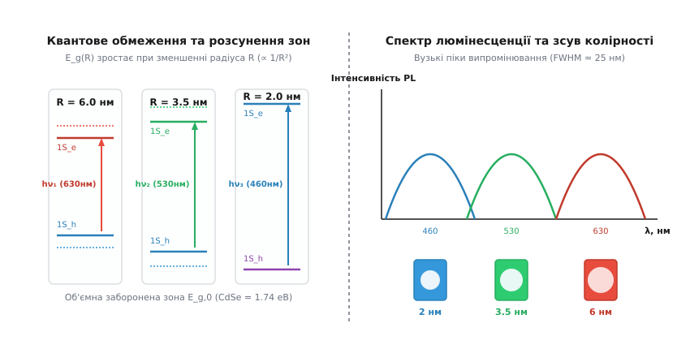
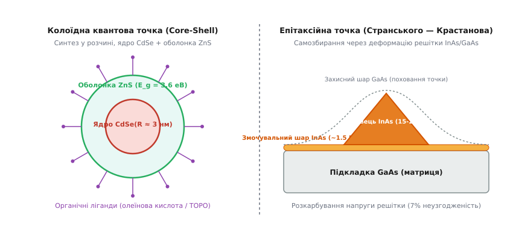
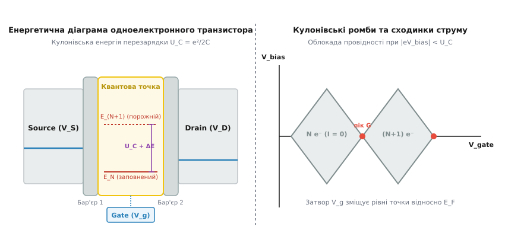

# Квантові точки

<preknowlist>
- [Зонна теорія напівпровідників](book:physics/semiconductor) — валентна зона, зона провідності та заборонена зона (bandgap).
- [Квантування енергії](book:physics/energy-quantization) — дискретний спектр енергетичних станів у потенціальних ямах.
- [Прямозонні та непрямозонні напівпровідники](book:physics/direct-indirect-bandgap) — випромінювальна рекомбінація та оптичні переходи.
- [Квантове тунелювання](book:physics/quantum-tunnelling) — проходження носіїв через потенціальні бар'єри.
</preknowlist>

У макроскопічному напівпровідниковому кристалі селеніду кадмію (`CdSe`), арсеніду галію (`GaAs`) або фосфіду індію (`InP`) ширина забороненої зони `E_g` є фундаментальною константою матеріалу, яка суворо визначається періодичним потенціалом кристалічної решітки та хімічним складом. Фотон із енергією, меншою за `E_g`, проходить крізь кристал без поглинання, тоді як фотон із більшою енергією поглинається, створюючи зв'язану пару електрон-дірка — [екситон](book:physics/exciton). У такому об'ємному монокристалі радіус зв'язаного стану електрона й дірки (екситонний радіус Бора `a_B`) становить від 2 до 10 нанометрів залежно від ефективних мас носіїв та диелектричної проникності середовища. 

Якщо ж макроскопічний кристал фізично зменшити за всіма трьома просторовими координатами до розмірів `R`, порівнянних або менших за `a_B` (типово від 1.5 до 6 нанометрів), періодична зонна структура твердого тіла повністю руйнується. Кристал переходить у режим тривимірного розмірного квантування ($0D$), а його неперервні енергетичні зони розпадаються на дискретний спектр атомоподібних рівнів. Такий нанометровий напівпровідниковий кристаліт називають **квантовою точкою** (*quantum dot*).

Головний фізичний і технологічний наслідок цього переходу полягає у зміні фундаментальних правил поглинання та випромінювання світла. Зменшення фізичного радіуса наночастинки `R` спричиняє розсунення енергетичних рівнів та зростання ефективної забороненої зони `E_g(R)` за законом `1/R²`. Змінюючи суто геометричний розмір наночастинки без будь-якої зміни її хімічного складу, можна плавно перебудовувати колір фотолюмінесценції по всьому видимому та ближньому інфрачервоному спектру — від глибокого червоного до насиченого фіолетового.

---

## Тривимірне квантове обмеження: від неперервних зон до «штучного атома»

Щоб зрозуміти природу квантової точки, необхідно простежити, як змінюється густина електронних станів `g(E)` при послідовному зменшенні розмірності напівпровідникової системи.

У трьох вимірах ($3D$, об'ємний кристал) електрони вільно рухаються в усіх напрямках, а густина станів зростає параболічно з віддаленням від краю зони `g_3D(E) ∝ √(E - E_g)`. При зменшенні одного з розмірів кристала до наномасштабу утворюється квантова яма ($2D$), де густина станів набуває східчастої форми. Зменшення двох розмірів створює квантовий дріт ($1D$), де густина станів має сингулярності зворотного квадратного кореня `g_1D(E) ∝ 1/√(E)`.

Коли ж обмеження діє за всіма трьома напрямками ($0D$, квантова точка), трансляційний рух носіїв повністю заборонений. Електрони й дірки виявляються затиснутими у сферичному потенціальному бар'єрі. Густина станів перестає бути неперервною і перетворюється на набір дискретних дельта-функцій:

```
g_0D(E) = 2 · ∑_n δ(E - E_n)
```

```
3D (Об'ємний кристал)  →  2D (Квантова яма)   →  1D (Квантовий дріт)  →  0D (Квантова точка)
Неперервні зони           Східчастий спектр      Сингулярності 1/√E      Дискретні дельта-піки
g(E) ∝ √E                 g(E) = const           g(E) ∝ 1/√E             g(E) = ∑ δ(E - E_n)
```

Завдяки такій дискретності квантові точки часто називають **«штучними атомами»**. Подібно до справжніх атомів, вони мають дискретні оболонкові стани, які позначають квантовомеханічними індексами `1S_e, 1P_e, 1D_e` для електронів у зоні провідності та `1S_h, 1P_h` для дірок у валентній зоні. Відповідно до принципу Паулі, на кожному `1S`-рівні може перебувати не більше двох електронів із протилежними напрямками спінів.


*Залежність енергетичних рівнів, ширини забороненої зони та кольору випромінювання від радіуса квантової точки.*

Строге співвідношення між радіусом квантової точки `R` та енергією основного оптичного переходу `E_g(R)` дає квантово-розмірна модель Брюса. Згідно з цією моделлю, ефективна ширина забороненої зони дорівнює:

```
E_g(R) = E_g,0 + ΔE_conf - ΔE_Coulomb

E_g(R) = E_g,0 + (ℏ²·π²) / (2·R²) · (1/m_e* + 1/m_h*) - 1.786 · e² / (4 · π · ε₀ · ε_r · R)
```

де `E_g,0` — об'ємна ширина забороненої зони, `m_e*` та `m_h*` — ефективні маси електрона й дірки, `ε_r` — відносна диелектрична проникність напівпровідника.

У цій формулі змагаються два ефекти:
1. **Квантовий кінетичний доданок `ΔE_conf ∝ +1/R²`:** обумовлений стисканням хвильових функцій частинок у малій ямі. Він розсуває енергетичні рівні й дає синій зсув поглинання.
2. **Кулонівський доданок `ΔE_Coulomb ∝ -1/R`:** описує електростатичне притягання між електроном і діркою у звуженому об'ємі, яке дещо зближує рівні (червоний зсув).

Оскільки квантовий доданок зростає квадратично `1/R²`, при малих радіусах частинки (`R < 4 нм`) він повністю домінує над кулонівським зсувом. Детальний математичний вивід усіх доданків рівняння Брюса та чисельні розрахунки для CdSe наведено у вставці 🧮 [Квантово-розмірне обмеження та модель Брюса](book:physics/condensed-matter-physics/quantum-dot/math-confinement.md).

Тонка структура енергетичного спектра квантової точки додатково ускладнюється спін-орбітальною взаємодією та міжчастинковим обмінним розщепленням. Через обмінну взаємодію між електроном (спін `s = 1/2`) та діркою (кутовий момент `j = 3/2`) основний екситонний стан `1S_e - 1S_h` розщеплюється на два підрівні:
- **Світлий екситон (*bright exciton*):** повний момент `J = 1`, дозволений дипольний оптичний перехід, короткий час життя (одиниці наносекунд).
- **Темний екситон (*dark exciton*):** повний момент `J = 2`, оптичний перехід заборонений за спіном, довгий час життя (мікросекунди).

Наявність низьколежачого темного екситонного стану є причиною того, чому за низьких температур фотолюмінесценція квантових точок сповільнюється, а носії можуть довго зберігати спінову орієнтацію, що створює фізичне підґрунтя для квантової пам'яті.

---

## Класифікація та структурна анатомія: колоїдні точки проти епітаксійних острівців

За технологією виготовлення та фізичним оточенням квантові точки поділяють на два фундаментальні класи: **колоїдні квантові точки** (система «розчин — поверхневі ліганди») та **епітаксійні самозібрані точки** (система «напівпровідникова матриця»).


*Анатомія колоїдної квантової точки типу ядро-оболонка (ліворуч) та епітаксійного наноострівця Странського — Крастанова (праворуч).*

### 1. Колоїдні квантові точки (Colloidal Quantum Dots, CQDs)

Колоїдні квантові точки синтезують шляхом рідиннофазних хімічних реакцій за високих температур. Їхня анатомія складається з трьох обов'язкових елементів:
- **Напівпровідникове ядро (*core*):** монокристалічний нанокластер діаметром 2–8 нм (`CdSe`, `InP`, `PbS`, `CsPbBr3`), що задає ширину забороненої зони та колір люмінесценції.
- **Захисна оболонка (*shell*):** шар ширшозонного напівпровідника (`ZnS`, `ZnSe`), нанесений поверх ядра. Оболонка створює потенціальний бар'єр для носіїв заряду й ізолює їх від поверхневих дефектів.
- **Органічні ліганди (*ligands*):** довголанцюгові молекули (олеїнова кислота, триоктилфосфіноксид), приєднані до зовнішніх атомів металу. Ліганди забезпечують розчинність наночастинок у органічних розчинниках і запобігають їхньому злипанню (агрегації).

Зонуванням енергетичних країв ядра й оболонки формують два типи гетероструктур:
- **Тип I (Type-I):** край зони провідності оболонки лежить вище, а валентної зони — нижче, ніж у ядра (`CdSe/ZnS`). Електрон і дірка локалізовані всередині ядра. Це дає квантовий вихід фотолюмінесценції понад 90%, що є ідеальним для дисплеїв та світлодіодів.
- **Тип II (Type-II):** краї зон зсунуті так, що електрон локалізується в ядрі, а дірка — в оболонці (`CdTe/CdSe`). Просторове розділення зарядів продовжує час життя носіїв, що важливо для сонячних батарей та фотодетекторів.

Зародження й ріст колоїдних нанокристалів описується класичною моделлю ЛаМера (*LaMer model*). Завдяки швидкому інжекуванню прекурсорів концентрація мономерів у розчині короткочасно перевищує поріг зародкоутворення, що викликає вибухову появу тисяч зародків. Швидке зниження температури припиняє появу нових зародків, а наявні кристаліти ростуть із високою монодисперсністю.

Історію того, як з реакцій у силікатних стеклах та фотохімічних розчинах виріс Нобелівський синтез колоїдних точок, викладено у вставці 📜 [Історія відкриття та хімічного синтезу квантових точок](book:physics/condensed-matter-physics/quantum-dot/hist-quantum-dots.md).

---

### 2. Епітаксійні квантові точки (Stranski-Krastanov QDs)

Епітаксійні квантові точки вирощують у високому вакуумі методами молекулярно-променевої епітаксії (MBE) або газофазної епітаксії з металоорганічних сполук (MOCVD). В основі їхнього формування лежить **механізм Странського — Крастанова**:

1. На кристалічну підкладку арсеніду галію (`GaAs`) наноситься матеріал з іншою сталою решітки, наприклад арсенід індію (`InAs`, неузгодженість решіток близько 7%).
2. Перші 1–2 атомарні шари лягають суцільним напруженим шаром — так званим **змочувальним шаром** (*wetting layer*).
3. При подальшому нанесенні накопичена пружна енергія деформації стає настільки великою, що суцільна плівка самовільно розпадається на тривимірні наноострівці пірамідальної або лінзоподібної форми базою 15–20 нм і висотою 3–5 нм.
4. Отримані острівці зверху «поховують» шаром матриці `GaAs`, утворюючи монолітний кристал із бездефектними нановкрапленнями.

Епітаксійні точки тверді й жорстко інтегровані в напівпровідникову матрицю. На відміну від колоїдних точок, до них можна легко підвести металеві управляючі електроди й інтегрувати їх у мікрорезонатори, що робить їх основними кандидатами для однофотонних джерел та квантових обчислень.

---

## Кулонівська облокада та одноелектронний транспорт

Окрім унікальних оптичних властивостей, квантові точки володіють фундаментальними електричними властивостями, які проявляються при підключенні до них тунельних контактів.

Завдяки малому фізичному розміру `R`, власна електростатична ємність квантової точки `C_Σ` є надзвичайно малою величиною. Для ізольованої сферичної точки діаметром 5 нм у діелектрику ємність становить `C_Σ ≈ 10⁻¹⁸ Ф` (один аттофарад). Звідси **кулонівська енергія перезарядки** `U_C` — енергія, необхідна для додавання на точку всього одного додаткового електрона — становить:

```
U_C = e² / (2 · C_Σ)
```

Для `C_Σ = 10⁻¹⁸ Ф` кулонівська енергія дорівнює `U_C ≈ 80 меВ`. Оскільки ця енергія значно перевищує енергію теплових коливань за рідкого гелію (`k_B · T ≈ 0.35 меВ` при 4.2 K) і навіть за кімнатної температури (`k_B · T ≈ 25.8 меВ`), електрон не може вільно протунелювати на квантову точку, якщо вхідної напруги недостатньо для покриття енергії `U_C`. Цей ефект називають **кулонівською облокадою** (*Coulomb blockade*).


*Енергетична діаграма тунелювання крізь квантову точку (ліворуч) та кулонівські ромби провідності в координатах напруг затвора й витоку (праворуч).*

На основі цього ефекту будують **одноелектронний транзистор** (Single-Electron Transistor, SET). Пристрій складається з квантової точки, з'єднаної через тонкі тунельні бар'єри з контактами витоку (*Source*) і стоку (*Drain*), та ємкісно зв'язаної з затвором (*Gate*).

Затвор підводять потенціал `V_g`, який безперервно зсуває дискретні енергетичні рівні квантової точки відносно рівня Фермі контактів:
- **Режим облокади (`I = 0`):** жоден із дискретних рівнів точки `E(N)` не потрапляє у вузьке вікно напруги між витоком і стоком. Кількість електронів на точці фіксована й дорівнює `N`. Струм через транзистор повністю заблокований.
- **Режим резонансного тунелювання (пік провідності):** зміною напруги затвора `V_g` енергетичний рівень `E(N+1)` вирівнюється з рівнем Фермі контактів. Електрон з витоку тунелює на точку, а потім миттєво тунелює на смугу стоку. Струм проходить поодинокими електронами.

У координатах «напруга затвора `V_g` — напруга витоку `V_bias`» зона облокади утворює характерну періодичну сітку **кулонівських ромбів** (*Coulomb diamonds*). Ширина ромба вздовж осі затвора дорівнює періоду перезарядки `ΔV_g = e / C_g`, а висота ромба вздовж осі витоку прямо міряє сумарну енергію `U_C + ΔE_conf`.

Завдяки кулонівській облокаді квантову точку можна використовувати як надчутливий електрометр, здатний реєструвати переміщення 1/1000 частки заряду електрона, або як спіновий кубіт, де логічні стани `|0⟩` та `|1⟩` кодуються орієнтацією спіна поодинокого виділеного електрона.

У подвійних квантових точках (*double quantum dots*) два наноострівці розташовують на стільки близько (відстань < 10 нм), що між ними виникає квантовомеханічне тунельне розщеплення станів. Це дозволяє формувати синглет-триплетні спінові кубіти ($S-T_0$), де керування обмінною взаємодією `J(V_g)` здійснюється прикладанням швидких наносекундних імпульсів напруги на проміжний затвор.

---

## Оптичні явища, рекомбінаційні втрати та безвипромінювальні канали

Практична цінність колоїдних квантових точок визначається їхньою здатністю ефективно випромінювати світло під дією оптичного збудження (фотолюмінесценція) або електричного струму (електролюмінесценція). Проте у реальних наносистемах випромінювальному переходу конкурують декілька безвипромінювальних процесів втрати енергії.

```
Оптичне збудження (hν > E_g)
        │
        ├─────────► Випромінювальна рекомбінація (Фотолюмінесценція, PL QY > 90%)
        │
        ├─────────► Оже-рекомбінація (Тричастинковий процес, згасання заряду)
        │
        ├─────────► Захоплення на поверхневі пастки (Дефекти решітки)
        │
        └─────────► Спектральне миготіння (Фотоіонізація → "темний" стан)
```

### 1. Фотолюмінесценція та стоксів зсув

Пік фотолюмінесценції квантової точки зсунутий у довгохвильову область відносно першого піка поглинання — це називається **стоксівським зсувом** (*Stokes shift*). Він виникає через швидку (за пікосекунди) релаксацію збуджених носіїв на найнижчий екситонний рівень за рахунок випромінювання фононів перед тим, як відбудеться оптичний перехід. Вузька ширина випромінювання (FWHM < 20–25 нм) забезпечує високу колірну чистоту, недосяжну для органічних люмінофорів.

---

### 2. Оже-рекомбінація (Auger Recombination)

Коли у квантовій точці одночасно знаходяться два екситони (біекситон) або один екситон і один зайвий заряд (трион), виникає безвипромінювальний Оже-процес. Замість випромінювання фотона електрон і дірка рекомбінують, передаючи всю свою енергію третьому носію заряду, який викидається високо в зону провідності або взагалі за межі точки:

```
(e⁻ + h⁺) + e⁻  ──►  e⁻ (гарячий) + тепло  [Оже-рекомбінація]
```

Оже-рекомбінація у квантових точках відбувається надзвичайно швидко (за 10–100 пікосекунд) через просторове стискання хвильових функцій. Вона є головним чинником зниження яскравості світлодіодів за високих густин струму (*droop effect*).

---

### 3. Спектральне миготіння (Blinking Effect)

Під час безперервного лазерного опромінення поодинока квантова точка періодично «заряжається» і «розряджається», випадковим чином перемикаючись між світлим (*ON*) та темним (*OFF*) станами. Миготіння стається тоді, коли внаслідок фотоіонізації один із носіїв вилітає на поверхневу пастку, залишаючи точку зарядженою. Поки точка заряджена, будь-який новий згенерований екситон миттєво гаситься Оже-рекомбінацією на залишковість заряду, і точка стає «темною». Повернення електрона з пастки повертає точку у світлий стан.

Для пригнічення миготіння й Оже-процесів хіміки вирощують градієнтні оболоноки (`CdSe/CdS/ZnS`) із плавним зміщенням потенціалу, що змащує межу розділу й знижує ймовірність Оже-переходів.

---

## Практичне застосування у сучасних технологіях

Унікальна комбінація вузького спектра випромінювання, технологічності рідких розчинів та гнучкого налаштування колірності перетворила квантові точки з об'єкта фундаментальних досліджень на комерційну індустрію.

### 1. Дисплеї та освітлення (QLED / QD-OLED)

У сучасній побутовій техніці квантові точки використовують у трьох архітектурах:
- **QD-LCD (QDEF):** плівка з квантовими точками (Red & Green QDs) розміщується перед синім світлодіодним підсвічуванням. Синє світло підсвічує рідкокристалічну матрицю і одночасно збуджує точки, створюючи ідеальний білий баланс із охопленням понад 100% стандарту DCI-P3 та 80% стандарту BT.2020.
- **QD-OLED:** сині органічні світлодіоди (OLED) використовуються як джерело збудження, а струменево надруковані пікселі з квантових точок виконують роль фотолюмінесцентних колірних фільтрів.
- **Прямі електролюмінесцентні QLED:** носії заряду інжектуються з транспортних шарів безпосередньо в квантові точки під дією прикладеної напруги (подібно до класичних LED). Традиційна багатошарова структура QLED складається з анода ITO, дірково-транспортного шару (PEDOT:PSS / TFB), випромінювального шару квантових точок, електронно-транспортного шару наночастинок оксиду цинку (`ZnO`) та катода з алюмінію.

---

### 2. Біологія та медична діагностика

Завдяки високій світлостійкості (квантові точки не вигорають під мікроскопом місяцями, на відміну від органічних барвників) та високій яскравості колоїдні квантові точки застосовують як флуоресцентні мітки. 

Поверхню точок вкривають біосумісними полімерами й приєднують до них антитіла або пептиди. Це дозволяє здійснювати адресне маркування ракових пухлин *in vivo* та візуалізувати міжклітинний транспорт поодиноких білків. Для біомедицини виготовляють точки на основі селеніду свипцю (`PbS`) та теллуриду кадмію (`CdTe`), що випромінюють у другому прозорому вікні тканини (NIR-II, 1000–1700 нм), де людське тіло є найбільш прозорим для світла.

---

### 3. Сонячна енергетика та фотовольтаїка

У класичних кремнієвих сонячних батареях поглинання високоенергетичного фотона (наприклад, синього світла) створює лише одну пару електрон-дірка, а вся залишкова енергія `hν - E_g` втрачається на нагрівання решітки (термалізація).

У квантових точках завдяки підсиленій міжчастинковій взаємодії спостерігається ефект **мультикситонної генерації** (Multiple Exciton Generation, MEG): один високоенергетичний фотон з енергією `hν ≥ 2·E_g` здатний народити дві або три пари електрон-дірка до того, як гарячий носій встигне віддати енергію фононам. Це теоретично піднімає граничний ККД сонячних елементів Shockley-Queisser з 33% до понад 44%.

---

### 4. Однофотонні джерела для квантової криптографії

Епітаксійна або поодинока колоїдна квантова точка за своєю природою випромінює строго один фотон за один цикл оптичного або електричного збудження, оскільки другий екситон у тій самій точці миттєво гаситься Оже-процесом. Якість однофотонного випромінювання підтверджується вимірюванням кореляційної функції другого порядку Хенбері Брауна — Твісса `g²(τ)`: при `τ = 0` спостерігається антигрупування фотонів `g²(0) < 0.1`. Це робить квантові точки фундаментальними елементами генерації квантових ключів у захищених лініях зв'язку (QKD).

---

## Порівняльний аналіз матеріалів та технологічні обмеження

Для вибору матеріалу квантової точки у конкретній інженерній задачі враховують спектральний діапазон, токсичність та стабільність.

| Матеріал квантової точки | Спектральний діапазон (нм) | Типовий PL QY (%) | Механічна та хімічна стабільність | Токсичність та RoHS | Основне застосування |
|---|---|---|---|---|---|
| **CdSe / ZnS** | 460 – 650 (Видимий) | > 90% | Висока (з олонкою ZnS) | **Токсичний** (Кадмій обмежений RoHS < 100 ppm) | Еталонні QLED-дисплеї, наукові прилади |
| **InP / ZnSe / ZnS** | 480 – 700 (Видимий) | 75 – 85% | Помірне (чутливий до кисню/вологи) | **Безкадмієвий** (RoHS compliant) | Комерційні побутові телевізори (Samsung QLED) |
| **CsPbX3 (Перовськіти)** | 400 – 700 (Видимий) | > 95% (без оболонки) | Низька (деградує від вологи та тепла) | **Токсичний** (містить Свинець) | Надчисті дисплеї, лазери, дослідні СБ |
| **PbS / PbSe** | 800 – 2000 (Ближній ІЧ) | 50 – 70% | Середня | **Токсичний** (містить Свинець) | ІЧ-детектори, нічне бачення, біовізуалізація |
| **InAs / GaAs** | 900 – 1550 (ІЧ Телеком) | N/A (Епітаксійні) | Надвисока (монолітний кристал) | Безкадмієвий | Однофотонні джерела, квантові кубіти |

> 🔧 **Навіщо це.**
> У реальній інженерній розробці вибір матеріалу квантової точки визначається законодавчими та експлуатаційними обмеженнями. Якщо ви розробляєте масовий споживчий пристрій (телевізор, монітор, побутовий світильник), ви **зобов'язані** використовувати безкадмієві матеріали (`InP` або `CuInS2`), оскільки європейська директива RoHS суворо забороняє вміст кадмію понад 0.01% за масою. Натомість для лабораторних однофотонних джерел квантової криптографії використовують епітаксійні `InAs/GaAs` наноострівці, заморожені до 4 K у кріостаті, де хімічна токсичність не відіграє ролі, а вирішальним є відсутність спектрального миготіння та висока швидкість випромінювання.

Алгоритми чисельного розрахунку спектрів та моделювання вольт-амперної характеристики одноелектронного транзистора наведено у вставці ⚙️ [Чисельне моделювання спектра квантової точки та кулонівської облокади](book:physics/condensed-matter-physics/quantum-dot/proj-dot-sim.md).

---

## Підсумковий синтез

Квантові точки є яскравим прикладом того, як зменшення фізичних розмірів об'єкта переводить класичну напівпровідникову физику у фундаментально новий квантовомеханічний режим. Зміна геометрії від неперервної зонної структури об'ємного тіла до тривимірно обмеженого «штучного атома» дає змогу точно керувати енергетичним спектром носіїв за допомогою лише одного параметра — радіуса частинки `R`.

Сучасна нанофотоніка поєднує тривимірне квантове обмеження (модель Брюса), дискретний кулонівський транспорт (одноелектронне тунелювання) та хімічний інжиніринг поверхонь (структури ядро-оболонка). Це перетворило квантові точки на фундаментальну платформу для створення висококолірних QLED-дисплеїв, надчутливих біологічних маркерів, високоефективних фотоелементів та перспективних систем квантового опрацювання інформації.
