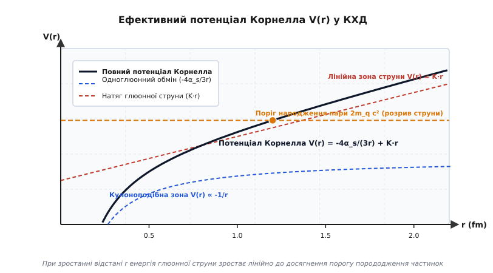
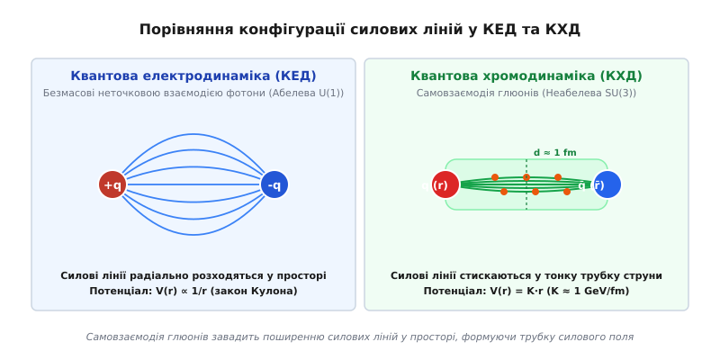
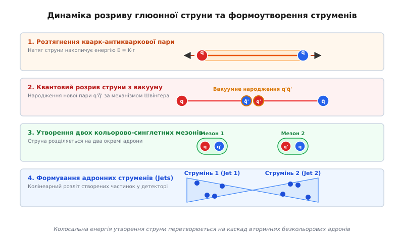

# Конфайнмент кварків

<preknowlist>
- [Фундаментальні взаємодії](topic:physics/fundamental-interactions) — опис чотирьох типів фундаментальних сил природи, зокрема сильної ядерної взаємодії та її носіїв.
- [Принцип заборони Паулі](topic:physics/pauli-exclusion) — квантомеханічне правило, що забороняє ферміонам перебувати в однакових квантових станах та обумовлює необхідність введення кольорового заряду.
- [Спін електрона](topic:physics/electron-spin) — внутрішній кутовий момент квантових частинок, який визначає спінову структуру кварків та баріонів.
- [Асимптотична свобода](topic:physics/asymptotic-freedom) — зменшення константи зв'язку сильної взаємодії при малих відстанях.
- [Кварк-глюонна плазма](topic:physics/quark-gluon-plasma) — стан речовини при високих температурах із деконфайнментом.
</preknowlist>

При спробі вибити окремий кварк з протона у високоенергетичному зіткненні на прискорювачі частинок прикладається колосальна енергія, що перевищує десятки гігаелектронвольт. Однак жоден експеримент на колайдерах SLAC, DESY чи CERN за понад пів століття не зафіксував у детекторах ізольованого дробового електричного заряду `+2/3 e` або `-1/3 e`. Замість вильоту поодинокого кварка надана кінетична енергія миттєво конвертується у вузький струмінь вторинних адронів — піонів, каонів та баріонів. Ця фундаментальна неможливість існування вільних кольорових частинок у вакуумі становить суть явища конфайнменту (утримання) кварків.

У сучасній фізиці елементарних частинок конфайнмент є одним із найскладніших непертурбативних феноменів квантової хромодинаміки (КХД). Він виникає внаслідок специфічної неабелевої структури сильної взаємодії, де носії поля — глюони — самі володіють кольоровим зарядом та інтенсивно взаємодіють між собою.

## Кольоровий заряд та калібрувальна симетрія SU(3)

Мікроскопічною основою сильної взаємодії є квантове число, яке отримало назву кольорового заряду (*color charge*). На відміну від квантової електродинаміки (КЕД), де існує лише один тип електричного заряду (позитивний або негативний), у КХД кварки володіють одним із трьох кольорових зарядів: червоним (`r`), зеленим (`g`) або синім (`b`). Антикварки носять відповідні антикольори: античервоний (`rbar`), антизелений (`gbar`) та антисиній (`bbar`).

Математично КХД побудована як неабелева калібрувальна теорія поля на основі колірної групи симетрії `SU(3)_c`. Генераторами цієї групи є вісім матриць Ґелл-Манна `λ^a` (`a = 1, ..., 8`), які задовольняють алгебру Лі з нетривіальними структурними константами `f^{abc}`:

```
[ λ^a / 2, λ^b / 2 ] = i · ∑_{c=1}^{8} f^{abc} · (λ^c / 2)
```

Взаємодія між кварками здійснюється шляхом обміну вісьмома носіями сильного поля — глюонами. Оскільки глюони належать до приєднаного представлення групи `SU(3)_c`, кожен глюон одночасно переносить один колір та один антиколір (наприклад, `r-gbar` або `g-bbar`). Слід підкреслити фундаментальну відмінність між фотонами КЕД та глюонами КХД: фотон є електрично нейтральним і не взаємодіє з іншими фотонами у першому порядку теорії збурень, тоді як глюони самі є кольорово зарядженими і формують триглюонні (`g · f^{abc}`) та чотириглюонні (`g² · f^{abe} f^{cde}`) вершини самовзаємодії.

Така самовзаємодія повністю змінює структуру вакууму та динаміку силових ліній на великих відстанях.

Фундаментальне правило конфайнменту стверджує: **усі фізично спостережувані вільні стани в природі (адрони) є безкольоровими (кольорово-синглетними)**. Математично це означає, що хвильова функція будь-якого спостережуваного адрона повинна бути інваріантною відносно довільних локальних перетворень групи калібрувальної симетрії `SU(3)_c`.

З точки зору теорії представлень групи `SU(3)_c`, прямому добутку колірних станів відповідає розклад на незвідні представлення:
- Для мезонів (кварк + антикварк): `3 ⊗ 3bar = 1 ⊕ 8` (синглет + октет). Тільки синглетний стан `1` є безкольоровим.
- Для баріонів (три кварки): `3 ⊗ 3 ⊗ 3 = 1 ⊕ 8 ⊕ 8 ⊕ 10` (синглет + два октети + декуплет). Тільки синглетний стан `1` є безкольоровим.

Існує два основні класи традиційних безкольорових комбінацій:
1. **Мезони (`q-qbar`):** зв'язані стани кварка та антикварка з протилежними кольорами. Колірна хвильова функція є синглетом:

```
|Meson⟩ = (1 / √3) · ( |r-rbar⟩ + |g-gbar⟩ + |b-bbar⟩ )
```

2. **Баріони (`qqq`):** зв'язані стани трьох кварків різного кольору. Колірна хвильова функція є повністю антисиметричним тензором Леві-Чивіти `ε_ijk`:

```
|Baryon⟩ = (1 / √6) · ( |rgb⟩ - |rbg⟩ + |gbr⟩ - |grb⟩ + |brg⟩ - |bgr⟩ )
```

Крім класичних мезонів та баріонів, КХД допускає існування екзотичних безкольорових станів:
- **Тетракварки (`qq-qbar-qbar`):** зв'язані стани двох кварків та двох антикварків;
- **Пентакварки (`qqqq-qbar`):** п'атикваркові стани (виявлені на детекторах LHCb);
- **Глюболи (`gg` або `ggg`):** зв'язані стани глюонів без участі валентних кварків.

Будь-які спроби створити стан із незамкненим кольоровим індексом (наприклад, поодинокий червоний кварк або комбінацію з двох кварків `qq`) приводять до того, що напруженість кольорового поля навколо такої системи створює нескінченну потенціальну енергію у порожньому просторі, роблячи такий стан фізично неможливим.

Детальний хронологічний шлях розвитку кваркової гіпотези, розв'язання парадоксу Паулі та формування неабелевої теорії КХД висвітлено у вставці [Історія відкриття кварків та концепції конфайнменту](topic:physics/quark-confinement/hist-quark-confinement.md).

## Асимптотична свобода та ефективний потенціал Корнелла

Характер сильної взаємодії кардинально змінюється залежно від масштабу відстані між частинками або переданого у зіткненні імпульсу `Q²`. У квантовій теорії поля це явище описують за допомогою біжучої константи зв'язку `α_s(Q²)`.

Динаміка константи зв'язку визначається рівнянням ренормгрупи через бета-функцію КХД:

```
β(α_s) = μ² · (∂α_s / ∂μ²) = - (α_s² / 4π) · β₀ - (α_s³ / (16π²)) · β₁ - ...
```

де перші два коефіцієнти розкладу дорівнюють:

```
β₀ = 11 - (2/3) · n_f
β₁ = 102 - (38/3) · n_f
```

де `n_f` — кількість активних ароматів кварків (`n_f = 6` у Стандартній моделі).

Фізичний зміст першого доданку `11` у коефіцієнті `β₀` становить **антиекранування кольорового заряду** за рахунок самовзаємодії глюонів (парамагнітні властивості глюонного вакууму). Другий доданок `-(2/3) n_f` відповідає стандартному екрануванню кольору віртуальними кварк-антикварковими парами (діамагнітні властивості). Оскільки кількість ароматів `n_f = 6 < 16.5`, член антиекранування домінує, і бета-функція КХД є суворо від'ємною (`β₀ = 11 - 4 = 7 > 0`).

Явний вираз для біжучої константи зв'язку в однопетльовому наближенні має вигляд:

```
α_s(Q²) = 12π / ( (33 - 2 · n_f) · ln(Q² / Λ_QCD²) )
```

де `Λ_QCD ≈ 200–300 MeV` — фундаментальний енергетичний масштаб КХД (параметр заходження у режим сильного зв'язку).

З цієї формули випливають два антиподальні фізичні режими:
- **Асимптотична свобода (`Q² >> Λ_QCD²`, відстані `r << 0.1 fm`):** при значному зростанні імпульсу `Q²` знаменник прямує до нескінченності, а константа зв'язку спадає до нуля (`α_s → 0`). На малих відстанях кварки поводяться як майже вільні частинки. Це дозволяє використовувати стандартний пертурбативний апарат фейнманівських діаграм для розрахунку процесів у глибоконепружному розсіянні.
- **Інфрачервоне утримання (`Q² ~ Λ_QCD²`, відстані `r ≥ 0.5 fm`):** при зменшенні переданого імпульсу до масштабу `Λ_QCD` знаменник прямує до нуля, а константа зв'язку розбігається та перевищує одиницю (`α_s ≥ 1`). Теорія збурень повністю втрачає застосовність, і сильна взаємодія стає непертурбативною.

Для аналітичного опису взаємодії між кварком та антикварком на всіх масштабах відстаней використовують феноменологічний **потенціал Корнелла**:

```
V(r) = - (4/3) · (α_s / r) + K · r
```


*Ефективний потенціал Корнелла V(r): кулонівська частина на малих відстанях та лінійне зростання енергії струни на великих відстанях.*

Потенціал Корнелла складається з двох основних додавань:
1. **Кулоноподібний доданок (`-4·α_s / 3r`):** домінує на малих відстанях `r < 0.2 fm`. Він виникає внаслідок одноглюонного обміну між точковими кольоровими зарядами. Множник `4/3` визначається оператором Казимира групи `SU(3)_c`.
2. **Лінійний доданок (`K · r`):** домінує на великих відстанях `r > 0.5 fm`. Параметр `K` називають натягом глюонної струни (*string tension*). Експериментальні дані зі спектроскопії важких мезонів (`J/ψ`, `Υ`) дають значення `K ≈ 1.0 GeV/fm`.

Виведення потенціалу Корнелла з операторів петель Вільсона, аналіз лінійних траєкторій Редже та математичний зв'язок між спіном і масою адронів детально розібрано у вставці [Математична модель потенціалу Корнелла та струнний потенціал КХД](topic:physics/quark-confinement/math-cornell-potential.md).

## Структура глюонного поля: струни та силові трубки

Щоб зрозуміти фізичну природу лінійного доданка `K · r`, необхідно порівняти геометричну конфігурацію силових ліній у КЕД та КХД.

У квантовій електродинаміці електричне поле між двома протилежними зарядами (`+q` та `-q`) вільно розходиться в усьому тривимірному просторі. Через відсутність самовзаємодії фотонів силові лінії відштовхуються одна від одної. У результаті густина енергії поля спадає пропорційно `1/r⁴`, а інтегрування по всьому об'єму дає зворотну залежність потенціалу від відстані `V(r) ∝ 1/r`.


*Порівняння конфігурації силових ліній: радіальне розходження фотонного поля у КЕД проти стискання глюонного поля у тонку трубку струни в КХД.*

У квантовій хромодинаміці картина кардинально змінюється. Коли кварк та антикварк віддаляються один від одного, глюони, які випромінюються колірними зарядами, починають інтенсивно взаємодіяти між собою через триглюонні та чотириглюонні вершини. Притягання між глюонами стискає силові лінії кольорового хромоелектричного поля у вузьку циліндричну трубку — **глюонну струну** (силову трубку, або *flux tube*).

Характерні параметри глюонної струни:
- Поперечний радіус силової трубки становить `R_tube ≈ 0.5 fm`;
- Густина енергії всередині трубки залишається постійною вздовж її довжини: `ε₀ ≈ 1.0 GeV/fm³`;
- Повний опір розтягненню струни створює постійну силу притягання `F = -dV/dr = -K ≈ -1.6 · 10⁵ N`.

Оскільки переріз силової трубки не змінюється при збільшенні відстані `r`, об'єм трубки зростає строго лінійно з ростом `r`: `V_tube = π · R_tube² · r`. Відповідно, накопичена в хромоелектричному полі енергія зростає пропорційно довжині струни: `E(r) = K · r`.

З врахуванням квантових флуктуацій поперечних коливань струни (поправка Люшера), ефективний потенціал на великих відстанях набуває вигляду:

```
V(r) = K · r - (π / (12 · r)) + C   [Потенціал струни з поправкою Люшера]
```

Член `-π / (12 r)` виникає як нульова енергія квантових поперечних мод струни в одновимірному просторі і є універсальним для будь-якої релятивістської струнної теорії.

Якщо віддаляти кварки на нескінченність, потенціальна енергія поля мала б прямувати до нескінченності, що робить існування поодинокого кварка термодинамічно забороненим.

## Механізм розриву струни та утворення струменів (Jets)

Якщо потенціальна енергія глюонної струни зростає нескінченно з відстанню, постає питання: що відбувається, коли у високоенергетичному зіткненні кварк і антикварк розлітаються у протилежні боки з величезною кінетичною енергією?

Відповідь полягає у квантовомеханічному явищі **розриву струни** (*string breaking*). Коли відстань між кварками досягає критичного значення `r_c ≈ 1.0–1.2 fm`, накопичена у хромоелектричному полі енергія стає більшою за поріг народження маси спокою нової кварк-антикваркової пари:

```
E_string = K · r_c ≥ 2 · m_q · c²
```

де `m_q` — ефективна маса легкого кварка (`u` або `d`).


*Динаміка розтискування кварк-антикваркової пари, квантове народження нової пари з вакууму за механізмом Швінгера та формування адронних струменів.*

Процес розриву струни відбувається за наступними етапами:
1. **Накопичення енергії поля:** при розльоті вихідних кварків `q₁` та `qbar₂` глюонна струна натягується, акумулюючи потенціальну енергію `K · r`.
2. **Вакуумне тунелювання (механізм Швінгера):** у сильному хромоелектричному полі струни виникає квантове тунелювання з вакууму нової пари кварк-антикварк `q' - qbar'`. Імовірність цього процесу за одиницю часу на одиницю об'єму описують формулою Швінгера:

```
w ∝ exp( -π · m_q² / K )
```

   Оскільки маси легких кварків `u` та `d` малі (`m_u,d ~ 3–5 MeV`), тунелювання пар `u-ubar` та `d-dbar` відбувається надзвичайно швидко.
3. **Рекомбінація та фрагментація:** створений антикварк `qbar'` негайно зв'язується з вихідним кварком `q₁`, утворюючи безкольоровий мезон (`q₁-qbar'`), а створений кварк `q'` зв'язується з вихідним антикварком `qbar₂`, утворюючи другий безкольоровий мезон (`q'-qbar₂`). Початкова струна розривається на дві коротші струни.
4. **Адронний каскад (Адронізація):** якщо вихідні частинки володіли достатньою енергією, нові коротші струни продовжують розтягуватися і знову розриваються, генеруючи каскад нових кварк-антикваркових пар. Цей процес триває доти, доки кінетична енергія усіх фрагментів не впаде нижче порогу народження піонів.

Математично розподіл імпульсу частинок у струмені описують за допомогою Lund-струнної функції фрагментації:

```
f(z) ∝ (1 / z) · (1 - z)^a · exp( -b · m_T² / z )
```

де `z = E_hadron / E_quark` — частка імпульсу первинного кварка, переношувана утвореним адроном, `m_T = √(m² + p_T²)` — поперечна маса адрона, а `a, b` — феноменологічні параметри Лундської моделі.

На макроскопічному рівні у детекторах експериментів високих енергій (на колайдерах LHC або Tevatron) цей каскадний процес спостерігається у вигляді **адронних струменів** (англ. *jets*). Струмінь є вузьким конусом колінеарно випущених адронів (піонів, каонів, протонів), напрямок руху яких суворо збігається з початковим вектором імпульсу вибитого кварка або глюона. Перше експериментальне підтвердження існування триструменевих подій (`e^+ e^- → q qbar g`) було отримано на установці PETRA у прискорювальному центрі DESY (Гамбург) у 1979 році, що стало прямим доказом реальності глюона.

Алгоритми чисельного розрахунку потенціалу Корнелла, оцінку ймовірності Швінгера та програмну реалізацію моделювання розриву струни мовами C та C++ наведено у вставці [Чисельне моделювання потенціалу КХД та розриву глюонної струни](topic:physics/quark-confinement/proj-string-breaking-sim.md).

## Теоретичні підходи: Гратчаста КХД та дуальний надпровідник

Оскільки конфайнмент є суто непертурбативним явищем (константа взаємодії `α_s ~ 1`), аналітичні розрахунки у межах звичайної теорії збурень є неможливими. Для теоретичного обґрунтування та математичного доказу конфайнменту використовують два основні непертурбативні підходи.

### 1. Гратчаста квантова хромодинаміка (Lattice QCD)

Гратчаста КХД, розроблена Кеннетом Вільсоном, формулює квантову теорію поля на дискретній евклідовій просторово-часовій ґратці з кроком `a`. Кваркові поля `q(x)` локалізовані у вузлах ґратки, а глюонні калібрувальні поля задаються у вигляді орієнтованих матричних елементів зв'язку (link variables):

```
U_μ(x) = exp( i · g · a · A_μ(x) ) ∈ SU(3)
```

Калібрувальна дія Вільсона для ґратки формується з найменших замкнених контурів розміром `a × a` — плакет `P_μν(x)`:

```
S_lattice = (2 / g²) · ∑_{x, μ < ν} Re Tr( 1 - P_μν(x) )
```

Чисельне інтегрування континуальних інтегралів методом Монте-Карло на суперкомп'ютерах дозволяє розраховувати вакуумні середні петель Вільсона без використання теорії збурень. Розрахунки гратчастої КХД з високою точністю підтверджують закон площі для петель Вільсона та повністю відтворюють лінійне зростання потенціалу Корнелла між статичними кварками.

### 2. Модель дуального надпровідника (Намбу — 'т Гоофт — Мандельштам)

Фізична інтуїція стискання силових ліній у тонку трубку пояснюється красивою математичною аналогією з ефектом Мейснера у надпровідності.

У звичайному надпровіднику першого роду куперівські пари електричних зарядів формують конденсат. При внесенні у надпровідник зовнішнього магнітного поля ефект Мейснера виштовхує магнітні силові лінії з об'єму матеріалу. Якщо ж примусово помістити у надпровідник два магнітні монополі (північний та південний), магнітне поле між ними не зможе вільно розходитися і буде стиснуте куперівськими парами у тонку нитку — вихор Абрикосова. В результаті потенціал притягання між магнітними монополями у звичайному надпровіднику стає строго лінійним!

Згідно з концепцією Йоітіро Намбу, Ґерарда 'т Гоофта та Стенлі Мандельштама, **вакуум КХД є дуальним надпровідником**. У вакуумі КХД відбуваються конденсація кольорових магнітних монополів (специфічних топологічних солітонів калібрувального поля). Цей магнітний конденсат створює **дуальний ефект Мейснера**, який виштовхує хромоелектричне поле кварків та стискає його у хромоелектричну вихрову трубку — глюонну струну.

### 3. Проблема тисячоліття Математичного інституту Клея

Попри грандіозні успіхи гратчастого чисельного моделювання, аналітичний доказ наявності конфайнменту безпосередньо з диференціальних рівнянь Янга — Міллса залишається незавершеним.

У 2000 році Математичний інститут Клея оголосив проблему **«Existence and Mass Gap of Yang-Mills Theory»** однією з семи Проблем тисячоліття. Для розв'язання цієї задачі необхідно строго довести, що для довільної простої неабелевої калібрувальної групи `G`:
1. Квантова теорія Янга — Міллса існує як строго сформульована математична теорія у чотиривимірному просторі-часі;
2. Спектр мас теорії володіє строго додатною масовою щілиною `Δm > 0` (найлегша безкольорова частинка — глюбол — має масу, більшу за нуль), що гарантує експоненціальне згасання зв'язків та утримання кольору.

## Термодинамічний фазовий перехід: Кварк-глюонна плазма та деконфайнмент

Попри те, що у звичайному вакуумі за кімнатної температури кварки надійно замкнені всередині адронів, конфайнмент не є абсолютним та вічним станом речовини. При екстремально високих температурах або баріонних густинах відбувається термодинамічний фазовий перехід — **деконфайнмент**.

Коли температура речовини досягає критичного значення `T_c ≈ 150–170 MeV` (що відповідає температурі близько `2 · 10¹² K`), середня кінетична енергія теплових коливань стає порівнянною з масовим масштабом КХД `Λ_QCD`.

Фізичний механізм деконфайнменту базується на дебаївському екрануванні кольорового заряду:
1. При високих температурах вакуум заповнюється величезною густиною спонтанно народжених теплових кварків, антикварків та глюонів.
2. Ці теплові кольорові носії оточують будь-яку кваркову пару і екранують її хромоелектричне поле на відстані, що перевищує дебаївський радіус екранування `r_D ∝ 1 / (g · T)`.
3. Коли радіус екранування `r_D` стає меншим за розмір глюонної струни (`r_D < R_tube`), лінійний потенціал Корнелла руйнується (`K → 0`), а глюонні струни «плавляться».

Математичним параметром порядку для фазового переходу деконфайнменту у чистій калібрувальній КХД є вакуумне середнє значення петлі Полякова `⟨L⟩`:

```
L(x) = (1 / N_c) · Tr P exp( i · g ∫₀^{1/T} A₀(x, τ) dτ )
```

У фазі конфайнменту (`T < T_c`) значення `⟨L⟩ = 0`, що відповідає нескінченній енергії поодинокого кварка `V = -T ln⟨L⟩ → ∞`. У фазі деконфайнменту (`T > T_c`) петля Полякова набуває відмінного від нуля значення `⟨L⟩ > 0`, що свідчить про скінченну енергію і появу вільних кольорових зарядів.

Речовина переходить у новий агрегатний стан — **кварк-глюонну плазму (КГП)**, у якій кварки та глюони отримують можливість вільно переміщатися по всьому об'єму фази.

Експериментальне створення та дослідження кварк-глюонної плазми здійснюється у зіткненнях важких іонів (золота `Au+Au` або свинцю `Pb+Pb`) на релятивістському колайдері RHIC у Брукгейвені та на Великому адронному колайдері (LHC) у CERN. Вимірювання анізотропії розльоту частинок (еліптичний потік `v₂`) та гасіння адронних струменів (jet quenching) довели, що кварк-глюонна плазма поводиться не як ідеальний газ вільних частинок, а як майже «ідеальна квантова рідина» з рекордно малою питомою зсувною в'язкістю `η/s ≈ 1 / (4π)`.

## Фізичне значення конфайнменту

Явище конфайнменту кварків має визначальне значення для влаштування нашого Всесвіту:
- **Походження маси видимої матерії:** понад 99% маси протонів та нейтронів (і відповідно людей, планет та зірок) створюється не масами спокою голих кварків (які додають лише близько 1% за рахунок хіггсівського механізму), а кінетичною та потенціальною енергією конфайнменту глюонного поля та квантових кваркових конденсатів.
- **Еволюція раннього Всесвіту:** у перші мікросекунди після Великого вибуху (`t < 10⁻⁵ s`) уся матерія Всесвіту перебувала у стані гарячої кварк-глюонної плазми. Охолодження Всесвіту нижче критичної температури `T_c` привело до епохи адронізації — фазового переходу конфайнменту, який сформував перші протони та нейтрони.
- **Астрофізика компактних об'єктів:** у ядрах масивних нейтронних зір та гіпотетичних кваркових зір колосальний тиск може викликати баріонний деконфайнмент, створюючи стабільні фази кольорової надпровідності (фаза CFL — Color-Flavor Locking).
