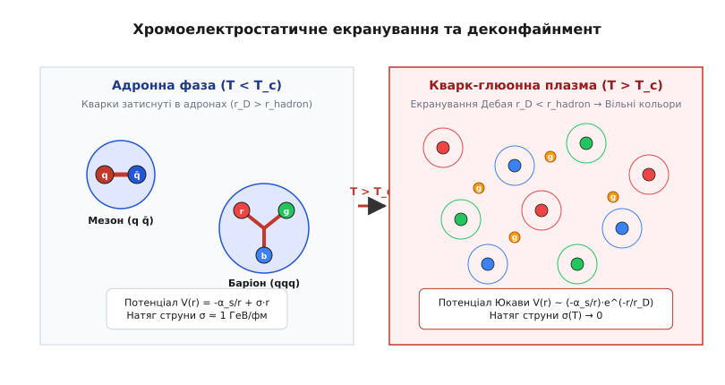
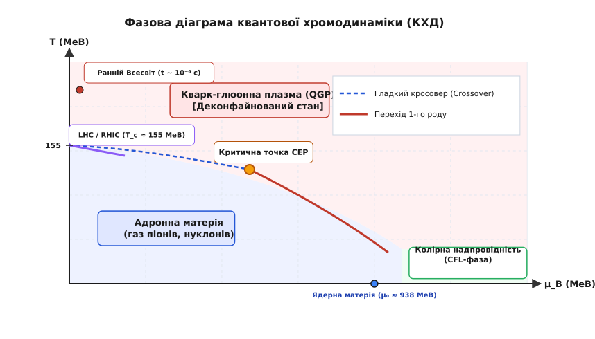
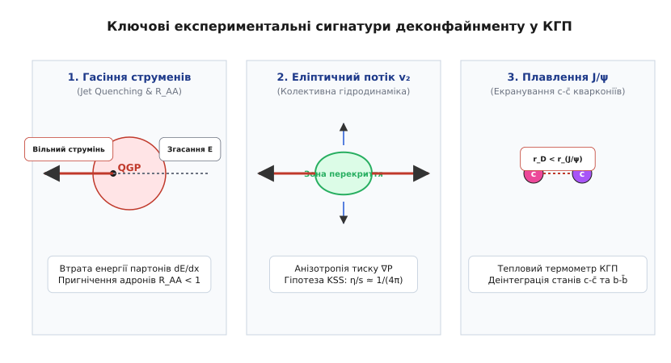

# Кварк-глюонна плазма та деконфайнмент

<preknowlist>
- [Конфайнмент кварків](topic:physics/quark-confinement) — утримання кольорових зарядів усередині безкольорових адронів та потенціал Корнелла.
- [Асимптотична свобода](topic:physics/asymptotic-freedom) — зменшення ефективної константи зв'язку КХД при малих відстанях та високих енергіях.
- [Фундаментальні взаємодії](topic:physics/fundamental-interactions) — структура квантової хромодинаміки, колірна симетрія SU(3)_c та глюони.
- [Радіус Дебая](topic:physics/debye-length) — явище екранування кулонівського та хромоелектростатичного поля носіями заряду в середовищі.
- [Рівень Фермі](topic:physics/fermi-level) — статистичний розподіл ферміонів та баріонний хімічний потенціал у щільній адронній матерії.
</preknowlist>

Коли важкі атомні ядра свинцю ²⁰⁸Pb або золота ¹⁹⁷Au розганяються на релятивістських колайдерах ALICE (CERN) та STAR (RHIC) до швидкостей, що перевищують `99.99999%` швидкості світла, та зіштовхуються чоло в чоло з енергією кілька тераелектронвольт на нуклонну пару, у мікроскопічному об'ємі порядку `10⁻⁴² m³` на мізерну частку секунди (`10⁻²³ s`) вивільняється колосальна концентрація енергії. Густина енергії у зоні перекриття перетиняє поріг `1 GeV/fm³`, що у шість разів перевищує густину спокійного атомного ядра, а температура середовища стрибає вище `1.5 · 10¹² K` (`T > 150-160 MeV`). У цих екстремальних умовах трубчасті трубки колірного потоку, що затискають кварки усередині окремих протонів та нейтронів, починають безперервно перекриватися, розриватися та розчинятися. Вакуум квантової хромодинаміки переходить у новий термодинамічний стан: кварки й глюони вириваються з адронних оболонок, формуючи деконфайновану екзотичну речовину — **кварк-глюонну плазму** (Quark-Gluon Plasma, QGP).

Феномен деконфайнменту (від англійського *deconfinement* — звільнення від утримання) являє собою фундаментальний фазовий перехід КХД, у якому кольорові ступені вільності стають квазівільними носіями заряду та теплового руху. Зрозуміти фізичний механізм цього переходу можна за допомогою розкладу початкових уявлень у [📜 Історія відкриття КГП](topic:physics/quark-gluon-plasma/hist-qgp-discovery.md), аналітичних термодинамічних виводів у [🧮 Термодинаміка деконфайнменту](topic:physics/quark-gluon-plasma/math-deconfinement-thermodynamics.md) та чисельного аналізу анізотропного розльоту плазми у [⚙️ Моделювання еліптичного потоку](topic:physics/quark-gluon-plasma/proj-hydrodynamic-flow-sim.md).

## Фізичний механізм деконфайнменту та екранування колірного заряду

У вакуумі при нульовій температурі взаємодія між кварком та антикварком описується феноменологічним потенціалом Корнелла:

```
V(r) = - (4/3) · (α_s / r) + σ · r
```

де перша доданок відповідає одноглюонному кулоноподібному обміну на малих відстанях, а друга — лінійному потенціалу утримання з натягом колірної струни `σ ≈ 1 GeV/fm` (`σ ≈ 0.18 GeV²`). При спробі віддалити кварк від антикварка енергія струни зростає лінійно з відстанню `r`, аж поки не стане енергетично вигідним вирвати з вакууму нову кварк-антикваркову пару (`q-qbar`), розірвавши струну на два нейтральні мезони.

Однак при нагріванні матерії до високих температур `T` або при її стисненні до екстремальних баріонних густин `n_B` ситуація докорінно змінюється. Середовище заповнюється високою концентрацією теплових кварків, антикварків та глюонів. Ці термодинамічно збуджені кольорові заряди створюють ефект **хромоелектростатичного екранування** (color-electric Debye screening), повністю аналогічний екрануванню кулонівського заряду у звичайній електронно-іонній плазмі.

Завдяки екрануванню далекосяжна частина потенціалу сильної взаємодії пригнічується експоненціальним множником Юкави. Взаємодія між пробною парою кольорових зарядів у гарячому середовищі описується екранованим потенціалом:

```
V(r, T) = - (4/3) · (α_s / r) · exp( - μ_D(T) · r ) + σ(T) · r · [ ( 1 - exp( - μ_D(T) · r ) ) / ( μ_D(T) · r ) ]
```

де `μ_D(T) = 1 / r_D(T)` — маса Дебая (Debye screening mass), а `r_D(T)` — радіус екранування Дебая. У провідному порядку пертурбативної КХД маса Дебая зростає лінійно з температурою:

```
μ_D²(T) = g² · T² · ( 1 + N_f / 6 ) = 4π · α_s(T) · T² · ( 1 + N_f / 6 )
```

де `g` — константа колірного зв'язку, а `N_f` — кількість активних флейворів кварків.

Зі зростанням температури радіус Дебая `r_D(T)` монотонно зменшується. Коли температура досягає критичного значення `T_c`, радіус екранування стає меншим за просторовий радіус адрона (середній радіус протона чи піона `r_hadron ≈ 0.8 fm`):

```
r_D(T_c) < r_hadron ≈ 0.8 fm
```

У цей момент натяг колірної струни прямує до нуля (`σ(T) → 0`), а потенціал утримання втрачає свій лінійний зростаючий характер на великих відстанях. Кварки перестають «відчувати» потенційну яму власного адрона: зв'язуюча сила між ними зникає, а радіус вільного пробігу кольорового заряду стає порівняним із розмірами всієї системи. Пробуджена речовина здійснює фазовий перехід у деконфайнований стан.


*Екранування колірного заряду у КГП: при високих температурах радіус Дебая стає меншим за розмір протона, колірна струна розривається, а кварки й глюони отримують свободу переміщення.*

Суть феномену екранування полягає у тому, що кожен кольоровий кварк у плазмі оточується дебаївською хмарою протилежних колірних зарядів (антикольорів). Для зовнішнього спостерігача на відстанях, більших за `r_D`, колірний заряд пробної частинки стає повністю ефективно компенсованим та нейтралізованим. Потенційна енергія взаємодії `V(r)` падає за експоненційним законом Юкави `exp(-r / r_D) / r`. Завдяки цьому силові лінії хромоелектричного поля більше не стискаються у вузьку трубку потоку (струну) з постійним перерізом, а вільно розходяться у просторі, як це відбувається в електродинаміці. Зникає фундаментальна передумова конфайнменту — постійна сила утримання `F = σ = const`. Кварки отримують можливість вільно пересуватися по всьому об'єму плазмової краплі.

Варто підкреслити, що явище деконфайнменту не означає виникнення абсолютно вільних частинок без будь-яких взаємодій. Навпаки, у термодинамічній області поблизу критичної температури `1.0 T_c < T < 2.0 T_c` ефективна константа зв'язку КХД залишається досить значною (`α_s ≈ 0.3-0.5`). Кварки та глюони перебувають у стані сильній колективній зчепленості, утворюючи не ідеальний газ, а сильнокорельовану плазмову рідину.

## Фазова діаграма квантової хромодинаміки: Кросовер, критична точка та колірна надпровідність

Фазовий стан хромодинамічної матерії зручно зображати на термодинамічній фазовій діаграмі у координатах **температура `T`** — **баріонний хімічний потенціал `μ_B`**. Хімічний потенціал `μ_B` визначає термодинамічний потенціал, пов'язаний із надлишком баріонів над антибаріонами (`n_B = (n_q - n_qbar) / 3`).


*Фазова діаграма квантової хромодинаміки у координатах температура–баріонний хімічний потенціал із позначенням межі деконфайнменту, критичної кінцевої точки та астрофізичних областей.*

На фазовій діаграмі КХД виділяються три фундаментальні області та кілька типів фазових переходів:

1. **Область малого баріонного хімічного потенціалу (`μ_B ≈ 0`):**
   Ця область відповідає умовам раннього Всесвіту через `10⁻⁶ s` після Великого Вибуху, а також ультрарелятивістським зіткненням іонів на колайдерах RHIC та LHC при максимальних енергіях. Точні непертурбативні розрахунки на ґратках (Lattice QCD) довели, що при `μ_B = 0` перехід від адронного газу до кварк-глюонної плазми є **гладким кросовером** (analytic crossover), а не стрибкоподібним фазовим переходом першого роду. При критичній температурі `T_c = 155 ± 9 MeV` термодинамічні величини (густина енергії, ентропія, сприйнятливість) змінюються неперервно, але надзвичайно стрімко у вузькому інтервалі температур `ΔT ≈ 10-15 MeV`.

2. **Область високого баріонного хімічного потенціалу (`μ_B > 400 MeV`):**
   При помірних температурах та високих баріонних густинах (що відповідає експериментам із нижчими пучковими енергіях на комплексі NICA та майбутньому прискорювачі FAIR у GSI) теорія передбачає наявність справжнього фазового переходу **першого роду** (first-order phase transition). Ця межа характеризується наявністю прихованої теплоти переходу, стрибком баріонної густини та співіснуванням двох фаз.

3. **Критична кінцева точка КХД (Critical End Point, CEP):**
   Лінія фазового переходу першого роду, що починається при низьких температурах, обривається в особливій термодинамічній точці — **критичній кінцевій точці КХД**. У цій точці фазовий перехід першого роду перетворюється на неперервний фазовий перехід другого роду із нескінченним радіусом кореляції флуктуацій. Пошук точного розташування CEP (`T_CEP ≈ 100-120 MeV`, `μ_B,CEP ≈ 400-500 MeV`) є однією з найголовніших задач сучасної фізики високих енергій.

4. **Колірна надпровідність (Color-Flavor Locking, CFL):**
   При дуже низьких температурах (`T → 0`) та екстремально високому хімічному потенціалі (`μ_B >> 1 GeV`, що у 3–5 разів перевищує густину насичення ядерної матерії `n_0 ≈ 0.16 fm⁻³`) кварки на поверхні Фермі утворюють куперівські пари завдяки привабливій взаємодії у колірному антитриплетному каналі. Речовина переходить у стан **колірного надпровідника** (Color Superconductor), де колірна та флейворна симетрії спонтанно порушуються з формуванням замороженого конденсату кваркових пар (`⟨q_i^a q_j^b⟩ ≠ 0`). Цей стан виникає у надрах холодних масивних нейтронних зір та при їхніх гравітаційних злиттях.

Аналіз фазової діаграми демонструє глибоку фізичну відмінність між фазовими переходами при малій та великій баріонній густині. У звичайних фізичних системах (наприклад, перехід вода-пара) фазовий перехід першого роду супроводжується поглинанням прихованої теплоти `L = T · Δs` та стрибком об'єму `ΔV`. У КХД при малій баріонній густині (`μ_B ≈ 0`) фізична межа між адронним газом та плазмою є розмитою: зв'язані стани мезонів та баріонів плавно розпадаються на резонансні безкольорові конгломерати, які поступово замінюються деконфайнованим кварк-глюонним континуумом.

Гладкий кросовер супроводжується також відносно плавним відновленням **кіральної симетрії** (chiral symmetry restoration). У вакуумі КХД кіральний конденсат кварків має ненульове значення `⟨qbar q⟩ ≈ - (240 MeV)³`, що надає легким `u`- та `d`-кваркам ефективну динамічну (конституентну) масу `m_q^eff ≈ 300 MeV`. При переході через критичну температуру `T_c` кіральний конденсат прямує до нуля, динамічна маса кварків зникає, а кварки відновлюють свої точні поточні маси `m_u ≈ 2.2 MeV` та `m_d ≈ 4.7 MeV`.

У той же час у разі високого баріонного хімічного потенціалу (`μ_B > 400 MeV`) фазовий перехід залишається переходом першого роду. У цій області термодинамічний потенціал `Ω(T, μ_B)` має два локальні мінімуми, які перетинаються при критичній температурі. Визначення точно геометрії лінії переходу першого роду є критично важливим для розуміння еволюції речовини під час злиття подвійних нейтронних зір та випромінювання сплесків гравітаційних хвиль.

## Термодинаміка деконфайнованої матерії та стрибок ступенів вільності

Головною характеристикою деконфайнменту є драматична зміна кількості активних внутрішніх ступенів вільності середовища. У низькотемпературній адронній фазі основним носієм теплового руху є найлегші псевдоскалярні мезони — піони (`π⁺, π⁻, π⁰`). Оскільки спін піона дорівнює нулю, а колір відсутній (синглет), кількість ступенів вільності адронного газу дорівнює:

```
g_hadron = 3  (три ізотопічні стани піона)
```

При переході через `T_c` у плазмовій фазі розморожуються колірні та спінові ступені вільності кварків та глюонів. Для релятивістського газу безмасових глюонів (спін 1, `2` поляризації, `8` кольорів) та `N_f` флейворів кварків (спін 1/2, `2` спінові стани, `2` частинка-античастинка, `3` кольори) загальна кількість ступенів вільності в межі Стефана-Больцмана описується виразом:

```
g_QGP = g_gluon + (7/8) · g_quark = 2 · 8 + (7/8) · (2 · 2 · 3 · N_f) = 16 + 10.5 · N_f
```

Для трьох активних флейворів легких кварків (`N_f = 3`: `u`, `d`, `s`):

```
g_QGP = 16 + 10.5 · 3 = 47.5
```

Отже, при переході від піонного газу до кварк-глюонної плазми кількість ступенів вільності зростає більш ніж у **15 разів** (від `3` до `47.5`).

Цей вибуховий зростання ступенів вільності виражається у стрімкому стрибку нормованої густини енергії `ε / T⁴` та нормованої ентропії `s / T⁴`, обчислених у непертурбативній ґратчастій КХД. При `T < T_c` величина `ε / T⁴` близька до нуля, а при `T > 1.5 T_c` вона виходить на плато, що становить близько `80-85%` від ідеальної межі Стефана-Больцмана:

```
( ε / T⁴ )_QGP ≈ 0.85 · (π² / 30) · g_QGP ≈ 12-14
```

Відхилення від межі ідеального газу на `15-20%` навіть при високих температурах свідчить про те, що кварк-глюонна плазма залишається неідеальним середовищем із суттєвою залишковою взаємодією між партонами. Важливим показником цієї конформної неідеальності є так званий **слід тензора енергії-імпульсу** (trace anomaly) або міра взаємодії (interaction measure):

```
I(T) = ( ε - 3P ) / T⁴ = T · ( ∂ / ∂T ) ( P / T⁴ )
```

У чисто конформній теорії безмасових частинок `P = ε / 3`, тому міра взаємодії `I(T) = 0`. У квантовій хромодинаміці величина `I(T)` має виразний пік поблизу критичної температури `T_c` (`I_max ≈ 4-5`), що вказує на сильні квантово-хромодинамічні кореляції та неідеальний характер матерії під час фазового переходу. Детальний математичний формалізм моделей мішка та ґратчастих параметрів порядку наведено у [🧮 Термодинаміка деконфайнменту](topic:physics/quark-gluon-plasma/math-deconfinement-thermodynamics.md).

## Релятивістська гідродинаміка та найідеальніша рідина у Всесвіті

Одночасно з експериментальним відкриттям QGP на колайдері RHIC у 2005 році фізики зіштовхнулися з головною парадоксальною властивістю створеної матерії: кварк-глюонна плазма поводиться не як слабозв'язаний газ вільних кварків, а як **сильновзаємодіюча релятивістська рідина** (strongly coupled QGP, sQGP) з надзвичайно малою в'язкістю.

Динаміка розширення плазмової краплі описується рівняннями релятивістської гідродинаміки Нав'є-Стокса для тензора енергії-імпульсу `T^{μν}`:

```
T^{μν} = (ε + P) · u^μ · u^ν - P · g^{μν} + π^{μν}
```

де `u^μ` — 4-швидкість елемента рідини, `P` — тиск, а `π^{μν}` — тензор зсувних в'язких напружень, пропорційний коефіцієнту зсувної в'язкості `η`.

### Еліптичний потік v_2 та колективний азимутальний розліт
У нецентральних зіткненнях атомних ядер зона перекриття двох сферичних ядер має мигдалеподібну (еліптичну) форму. Ця просторова анізотропія початкового стану описується початковим просторовим ексцентриситетом `ε_2`:

```
ε_2 = ( ⟨y² - x²⟩ ) / ( ⟨y² + x²⟩ )
```

Усередині сплюснутої плазмової краплі градієнт тиску вздовж короткої осі `x` (у площині зіткнення) виявляється значно більшим, ніж вздовж довгої осі `y` (поза площиною зіткнення):

```
( ∂P / ∂x ) > ( ∂P / ∂y )
```

Якщо середовище володіє високою колективністю та низькою в'язкістю, цей анізотропний градієнт тиску ефективно прискорює елементи рідини, трансформуючи початкову просторову анізотропію у **імпульсну анізотропію** вилітаючих адронів. Азимутальний розподіл зареєстрованих частинок розкладається у ряд Фур'є:

```
( dN / dϕ ) = ( N / 2π ) · [ 1 + 2 · v_1 · cos(ϕ - Ψ_RP) + 2 · v_2 · cos( 2 · (ϕ - Ψ_RP) ) + 2 · v_3 · cos( 3 · (ϕ - Ψ_RP) ) + ... ]
```

Другий фур'є-коефіцієнт `v_2` називається **еліптичним потоком** (elliptic flow). Експериментально виміряне значення `v_2` на колайдерах RHIC та LHC досягає `15-20%` для високоімпульсних адронів.

Чисельне розв'язання релятивістських гідродинамічних рівнянь, продемонстроване у [⚙️ Моделювання еліптичного потоку](topic:physics/quark-gluon-plasma/proj-hydrodynamic-flow-sim.md), показує, що таке високе значення `v_2` можливе лише за умови, якщо зсувна в'язкість плазми прямує до теоретичного квантового мінімуму.

> 🔧 **Навіщо це.**
> Відкриття ультранизької в'язкості QGP привело до створення фундаментального містка між фізикою важких іонів та теорією струн (дуальність AdS/CFT та голографічний принцип). Моделювання релятивістської гідродинаміки плазми застосовується для розрахунку симуляцій злиття нейтронних зір, аналізу гравітаційно-хвильових сплесків та вивчення квантового транспорту у сильнокорельованих конденсованих середовищах (наприклад, у графені при кімнатній температурі).

### Квантова межа Ковтуна-Сона-Старинця (KSS bound)
У 2001–2005 роках за допомогою квантово-гравітаційної дуальності AdS/CFT Павла Ковтун, Данило Сон та Андрій Старинець вивели теоретичну нижню межу для відношення зсувної в'язкості `η` до густини ентропії `s` будь-якої релятивістської квантової системи у природі:

```
( η / s )_KSS = 1 / ( 4π ) ≈ 0.08  (у одиницях ℏ / k_B)
```

Експериментально вилучене значення `η / s` для кварк-глюонної плазми за даними ALICE та STAR становить:

```
( η / s )_QGP ≈ 0.08 - 0.16
```

Це робить кварк-глюонну плазму найідеальнішою рідиною серед усіх відомих речовин у Всесвіті: її питома в'язкість у сотні разів менша за питому в'язкість рідкого гелію-4 у надплинному стані.

Крім того, вимірювання `v_2` для різних типів адронів виявило явне **масштабування за кількістю валентних кварків** (Valence Quark Number Scaling): якщо розділити коефіцієнт `v_2 / n_q` та поперечний імпульс `p_T / n_q` на кількість валентних кварків у адроні (`n_q = 2` для мезонів, `n_q = 3` для баріонів), усі експериментальні криві для піонів, каонів, протонів та лямбда-гіперонів зливаються в єдину універсальну криву. Це є строгим доказом того, що колективний еліптичний потік виникає ще до етапу адронізації, коли основними носіями руху є саме деконфайновані кварки.

## Головні експериментальні сигнатури деконфайнменту

Оскільки кварк-глюонна плазма існує крихітний проміжок часу (`~ 10⁻²² s`) і швидко розширюється, охолоджуючись та перетворюючись на газ адронів (фаза адронізації чи freeze-out), детектори не можуть безпосередньо «побачити» вільний кварк. Фізики виявили чотири прямі експериментальні сигнатури, які беззаперечно доводять утворення деконфайнованого стану.


*Три ключові докази утворення кварк-глюонної плазми: пригнічення високоїмпульсних струменів (Jet Quenching), еліптична анізотропія розльоту (v_2) та екранування зв'язаних станів важких кварків (J/ψ).*

### 1. Гасіння струменів (Jet Quenching)
На перших жорстких стадіях зіткнення ядер у результаті пружного розсіяння кварків або глюонів з великим переданим імпульсом утворюються високоїмпульсні партони, які вилітають у протилежні боки і мали б сформувати дві вузькі адронні струмені (jets).

Якщо таке розсіяння відбувається поблизу межі краплі QGP, один партон вилітає назовні у вакуум і формує повноцінний струмінь, тоді як второй партон змушений долати товщу гарячої щільної плазми. Проходячи крізь плазму, партон зазнає численних хромоелектродинамічних розсіянь та випромінює глюонне гальмівне випромінювання. Втрата енергії партону на одиницю шляху `dE / dx` розраховується як:

```
dE / dx ~ q̂ · L²
```

де `L` — довжина шляху у плазмі, а `q̂` — параметр транспортного розсіяння середовища (`q̂ ≈ 1-4 GeV²/fm`).

У результаті партон втрачає майже всю свою кінетичну енергію, а протилежний струмінь повністю «гасне» у плазмі. Експериментально це фіксується за допомогою коефіцієнта ядерного модифікування `R_AA`:

```
R_AA(p_T) = ( d²N_AA / dp_T dy ) / ( N_coll · d²N_pp / dp_T dy )
```

У відсутність плазми `R_AA = 1`. На колайдерах ALICE та CMS для важких іонів спостерігається сильне пригнічення високоїмпульсних адронів з `R_AA ≈ 0.2`, що підтверджує наявність екстремально щільної колірної матерії.

### 2. Плавлення та регенерація важких кварконіїв (J/ψ та Упсілон)
У 1986 році Такеші Мацуї (Takeshi Matsui) та Гельмут Затц (Helmut Satz) передбачили, що кварк-глюонна плазма працює як тепловий термометр для зв'язаних станів важких кварків — чармонію (`J/ψ = c-cbar`) та ботомонію (`ϒ = b-bbar`).

У гарячому середовищі радіус Дебая `r_D(T)` зменшується зі зростанням температури. Коли `r_D(T)` стає меншим за середній радіус зв'язаного стану кварконію (`r_J/ψ ≈ 0.5 fm`), колірний потенціал між `c` та `cbar` повністю екранується. Кварк `c` та антикварк `cbar` більше не можуть утворити зв'язаний стан і дисоціюють у плазмі («плавлення `J/ψ`»).

Оскільки різні резонансні стани мають різні енергії зв'язку та радіуси, вони плавляться при різних критичних температурах:

- `ψ'(2S)` та `χ_c`: плавляться при `T ≈ 1.0 T_c`
- `J/ψ(1S)`: плавиться при `T ≈ 1.2 T_c`
- `ϒ(3S)` та `ϒ(2S)`: плавляться при `T ≈ 1.2-1.5 T_c`
- `ϒ(1S)` (основний стан): плавиться лише при `T > 2.5 T_c`

На прискорювачі SPS та колайдері RHIC було зафіксовано чітке пригнічення виходу `J/ψ`. Однак на Великому адронному колайдері (LHC) при вищих енергіях спостерігається новий феномен — **регенерація `J/ψ`**. Завдяки тому, що у кожному зіткненні іонів свинцю народжується понад `100` пар `c-cbar` кварків, при охолодженні плазми на етапі адронізації випадкові `c` та `cbar` кварки знову об'єднуються у мезони `J/ψ`, що підтвердили вимірювання детектора ALICE.

### 3. Підсилення дивності (Strangeness Enhancement)
У звичайних протон-протонних зіткненнях народження дивних кварків (`s-sbar`) пригнічене через їхню масу (`m_s ≈ 95 MeV`). Однак у кварк-глюонній плазмі завдяки високій концентрації теплових глюонів основним механізмом утворення `s-sbar` стає глюонне злиття:

```
g + g → s + sbar
```

Характерний час цього процесу у QGP пропорційний `1 / (α_s² · T)` і виявляється набагато коротшим за час існування плазмової краплі. У результаті плазма швидко насичується дивними кварками до стану хімічної рівноваги. При адронізації це приводить до аномально високого виходу багатодивних гіперонів (`Ξ⁻(dss)`, `Ω⁻(sss)`) порівняно з протонними зіткненнями.

### 4. Теплові фотони та дилептони
Електромагнітні проби — прямі фотони (`γ`) та дилептонні пари (`e⁺e⁻`, `μ⁺μ⁻`) — випромінюються плазмою під час термодинамічного розширення. Оскільки електромагнітна константа зв'язку `α = 1/137` значно менша за сильні взаємодії, фотони та лептони залишають плазму без подальшого розсіяння, несучи незатворену інформацію про початкову температуру плазми. Виміряний спектр прямих теплових фотонів дозволив визначити початкову температуру плазми на колайдері LHC: `T_initial > 300-500 MeV` (понад 4 трильйони келвінів).

## Динаміка фазового виморожування (Freeze-out) та методи детектування

У процесі релятивістського розширення крапля кварк-глюонної плазми охолоджується і здійснює зворотно фазовий перехід у адронну фазу. Еволюція згасання плазми проходить два послідовні термодинамічні етапи виморожування:

1. **Хімічне виморожування (Chemical Freeze-out):**
   Відбувається при температурі `T_chem ≈ 156 MeV`. На цьому етапі неупругі процеси взаємодії між адронами (`π + π → K + Kbar`, `N + Nbar → π + π + π`) припиняються. Відношення виходів різних типів адронів (`π / K / p / Λ / Ξ / Ω`) остаточно «заморожується» і більше не змінюється. Фізичний склад середовища підпорядковується законам теплового статистичного виходу (Statistical Hadronization Model).

2. **Кінетичне / Термічне виморожування (Kinetic / Thermal Freeze-out):**
   Відбувається при нижчій температурі `T_kin ≈ 100-120 MeV`, коли густина адронного газу падає настільки, що припиняються навіть пружні розсіяння частинок (`π + p → π + p`). Середній вільний пробіг адронів стає більшим за розмір системи, частинки вільно вилітають у вакуум і досягають сенсорів експериментальних детекторам. Поперечні імпульсні спектри частинок `dN / dp_T` на цьому етапі фіксують колективну радіальну швидкість розширення середовища `⟨v_r⟩ ≈ 0.6 c`.

Детектування сигнатур QGP на комплексі ALICE здійснюється за допомогою системи високоточних трекових та ідентифікаційних систем:
- **Time Projection Chamber (TPC):** дрейфова камера великого об'єму, що реєструє понад `10 000` треків заряжених частинок у кожному зіткненні свинцю, вимірюючи їхній імпульс за викривленням траєкторії у магнітному полі `B = 0.5 T` та питому іонізацію `dE / dx`.
- **Inner Tracking System (ITS):** прецизійний кремнієвий детектор поблизу точки зіткнення, що вимірює вершини розпаду важких `D`- та `B`-мезонів з точністю до десятка мікрометрів.
- **Zero Degree Calorimeters (ZDC):** калориметри на нульових кутах, що вимірюють кількість нуклонів-спектейторів (які не брали участі у зіткненні) та визначають прицільний параметр (центральність зіткнення).

## Астрофізичне та прикладне значення деконфайнменту

Вивчення кварк-глюонної плазми та хромодинамічного деконфайнменту виходить далеко за межі фізики елементарних частинок:

1. **Космологія раннього Всесвіту:** Протягом перших кількох мікросекунд після Великого Вибуху (`t < 10⁻⁵ s`) весь Всесвіт перебував у стані кварк-глюонної плазми. Процес деконфайнментного кросоверу визначав початкові флуктуації баріонної асиметрії та первинний нуклеосинтез легких елементів.
2. **Фізика компактних астрономічних об'єктів:** У надрах масивних нейтронних зір та гібридних зір тиск перевищує `10³⁵ Pa`. Термодинамічне рівняння стану (Equation of State, EoS) деконфайнованої матерії визначає максимальну масову межу Толмана-Оппенгеймера-Волкова для нейтронних зір та спектр гравітаційних хвиль, що випромінюються при їхньому подвійному злитті.
3. **Фундаментальна теорія полімерів та квантових систем:** Математичний апарат кольорового екранування Дебая та конфайнментних струн застосовується для опису топологічних фазових переходів у фізиці конденсованого стану, зокрема у дробовому квантовому ефекті Голла та надплинних спінових рідинах.
