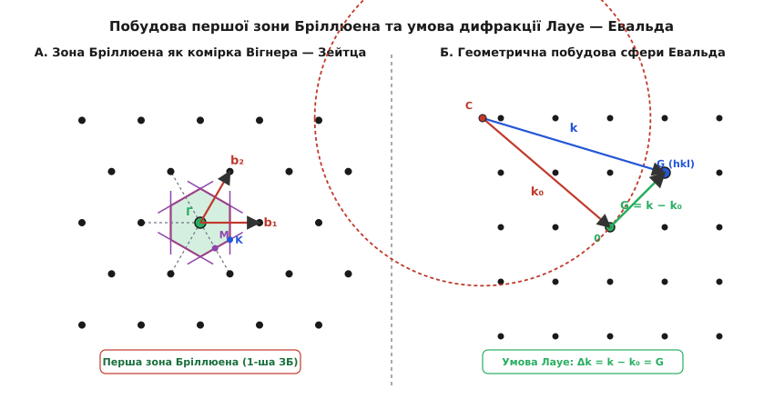
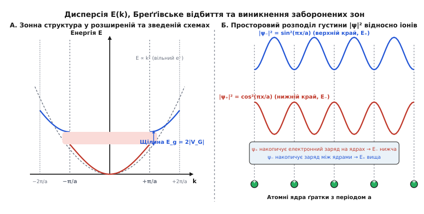

# Обернена ґратка та зони Бріллюена

<preknowlist>
- [Зонна теорія твердого тіла](topic:physics/band-theory) — формування електронних енергетичних зон у періодичному потенціалі кристала.
- [Дифракція Бреґґа](topic:physics/bragg-diffraction) — умова когерентного відбиття хвиль від періодичних атомних площин кристала.
- [Корпускулярно-хвильовий дуалізм](topic:physics/wave-particle-duality) — зв'язок між імпульсом частинки та її хвильовим вектором `p = ℏ · k`.
</preknowlist>

Коли пучок рентгенівських променів з довжиною хвилі 0.154 нм або електронна хвиля з імпульсом `p` розсіюється на монокристалі кремнію з реберним параметром ґратки 0.543 нм, амплітуда інтерференційного сигналу визначається просторовим інтегралом від розсіювальної здатності атомів. Опис цього процесу у звичайній системі декартових координат через вектори атомних позицій `r = u·a₁ + v·a₂ + w·a₃` потребує розв'язання нескінченних систем просторових рівнянь для кожної можливої сім'ї паралельних атомних площин. Перехід у прямий простір обернених хвильових векторів перетворює складну просторову геометрію на дискретну точкову ґратку, де кожна точка відповідає цілій сім'ї паралельних площин кристала.

Обернена ґратка та зони Бріллюена є базовою мовою фізики конденсованого стану. Без цього математичного апарату неможливо описати рух електронів у напівпровідниках, пояснити виникнення дифузійних зонних щілин, розрахувати ефективну масу носіїв заряду або інтерпретувати рентгенівські та нейтронографічні дифрактограми.

[📜 Історія розробки концепції оберненого простору](topic:physics/reciprocal-lattice/hist-brillouin-reciprocal.md)

## Від просторової періодичності до Фурьє-спектра кристала

Будь-який ідеальний монокристал володіє строгою трансляційною симетрією. Це означає, що електронна густина `n(r)` або внутрішній кристалічний потенціал `V(r)` інваріантні відносно зсуву на довільний вектор трансляції реальної ґратки `T`:

```
T = u · a₁ + v · a₂ + w · a₃
```

де `a₁`, `a₂`, `a₃` — примітивні вектори трансляції кристалографічного базису, а `u`, `v`, `w` — довільні цілі числа. Умова періодичності густини в кожній точці простору записується як:

```
n(r + T) = n(r)
```

Оскільки електронна густина є періодичною функцією просторових координат `r`, її можна розкласти у тривимірний ряд Фурьє. Для того щоб кожен гармонічний доданий член ряду `n_K · e^(i K · r)` задовольняв умову періодичності `e^(i K · (r + T)) = e^(i K · r)`, хвильові вектори розкладу `K` повинні задовольняти тотожність:

```
e^(i K · T) = 1
```

Оскільки `e^(i x) = 1` лише тоді, коли аргумент `x` є кратним `2π`, це означає, що скалярний добуток вектора `K` на будь-який вектор трансляції ґратки `T` має бути цілим числом, помноженим на `2π`:

```
K · T = 2π · N
```

де `N` — ціле число. Сукупність усіх векторів `K`, які задовольняють цю умову для всіх векторів реальної ґратки `T`, утворює точкову ґратку в просторі хвильових векторів. Ця ґратка називається **оберненою ґраткою** (*reciprocal lattice*), а її вектори позначають символом `G`.

Електронну густину кристала у кожній точці `r` можна подати у вигляді точної суми за всіма векторами оберненої ґратки `G`:

```
n(r) = ∑ n_G · e^(i G · r)
```

де `n_G` — комплексні амплітуди Фурьє, які визначають інтенсивність розсіювання хвилі відповідною гармонікою електронної густини. Коефіцієнт Фурьє `n_G` обчислюється шляхом інтегрування по об'єму примітивної елементарної комірки `V_cell`:

```
n_G = (1 / V_cell) · ∫ n(r) · e^(-i G · r) d³r
```

Перехід від неперервної функції `n(r)` до дискретного набору коефіцієнтів `n_G` є фундаментальним спрощенням: замість нескінченного простору координат фізичний стан описується сукупністю точок в оберненому `k`-просторі.

## Базисні вектори Евальда та геометричні власності

Для практичного побудування оберненого простору необхідно за відомим базисом прямої ґратки `a₁`, `a₂`, `a₃` знайти вектори базису оберненої ґратки `b₁`, `b₂`, `b₃`. Об'єм примітивної елементарної комірки прямого простору обчислюється як мішаний скалярно-векторний добуток:

```
V_cell = a₁ · (a₂ × a₃)
```

За формулами Пауля Евальда вектори оберненого базису визначаються векторними добутками векторів реального базису:

```
b₁ = 2π · (a₂ × a₃) / V_cell
b₂ = 2π · (a₃ × a₁) / V_cell
b₃ = 2π · (a₁ × a₂) / V_cell
```

З цих формул безпосередньо випливає фундаментальне співвідношення дуальності між прямим та оберненим базисами, яке виражається через символ Кронекера `δᵢⱼ`:

```
aᵢ · bⱼ = 2π · δᵢⱼ
```

Це означає, що вектор `b₁` завжди строго перпендикулярний до плоскої грані, утвореної векторами `a₂` та `a₃`, а його довжина обернено пропорційна висоті паралелепіпеда комірки, опущеної на цю грань.

[🧮 Математична алгебра та розрахунок ґраток SC, BCC та FCC](topic:physics/reciprocal-lattice/math-reciprocal-vectors.md)

Довільний вектор оберненої ґратки `G` розкладається за векторами базису `bᵢ` з цілочисельними коефіцієнтами `h`, `k`, `l`:

```
G[hkl] = h · b₁ + k · b₂ + l · b₃
```

Коефіцієнти `(hkl)` є індексами Міллера. Вектор `G[hkl]` володіє двома фундаментальними геометричними властивостями, які поєднують алгебру `k`-простору з реальною кристалографією:

1. **Ортогональність**: вектор `G[hkl]` строго перпендикулярний до сім'ї паралельних атомних площин кристала, які мають індекси Міллера `(hkl)`.
2. **Міжплощинна відстань**: довжина вектора `G[hkl]` зв'язана з відстажжю `d[hkl]` між сусідніми паралельними площинами сім'ї `(hkl)` співвідношенням:

```
d[hkl] = 2π / |G[hkl]|
```

Чим щільніше розташовані атомні площини у реальному просторі (більше `d`), тим коротшим є відповідний вектор оберненої ґратки `G`, і навпаки. Це фундаментальне правило оберненості дало назву всьому математичному апарату.

## Дифракційні умови Лауе, сфера Евальда та площини Бреґґа

Розглянемо пружне розсіювання монохроматичної хвилі з початковим хвильовим вектором `k₀` на періодичному кристалі. Після розсіювання хвильовий вектор стає дорівнювати `k`. Оскільки розсіювання є пружним (без зміни енергії та довжини хвилі), модулі векторів залишаються однаковими: `|k| = |k₀| = 2π / λ`. Вектор зміни хвильового вектора (вектор переданого імпульсу) дорівнює:

```
Δk = k − k₀
```

Умова конструктивної інтерференції вторинних хвиль, розсіяних усіма атомами ґратки, полягає у тому, що різниця фаз між хвилями від сусідніх вузлів має бути кратною `2π`. Це приводить до **умови дифракції Макса фон Лауе**: інтерференційний максимум виникає тоді і тільки тоді, коли вектор переданого імпульсу `Δk` збігається з одним із векторів оберненої ґратки `G`:

```
k − k₀ = G
```

Перепишемо це рівняння, виразивши `k = k₀ + G`, і піднесемо обидві частини до квадрата:

```
|k|²
= |k₀ + G|²
= |k₀|² + 2 k₀ · G + |G|²      [розкриття квадрата суми векторів]
```

Ураховуючи умову пружного розсіювання `|k|² = |k₀|²`, отримуємо векторне рівняння:

```
2 k₀ · G + |G|² = 0
```

Змінивши знак або перейшовши до вектора падаючої хвилі `k` (замінивши `k₀` на `-k`), це рівняння записують у симетричній формі:

```
k · (1/2 · G) = (1/2) · |G|²
```

Геометричний зміст цього рівняння надзвичайно простий: скалярний добуток вектора `k` на одиничний напрямок вектора `G` дорівнює половині довжини вектора `G`. У трьохвимірному `k`-просторі це рівняння задає площину, яка проходить через середину вектора `G` перпендикулярно до нього.

Ці площини у просторі хвильових векторів називаються **площинами Бреґґа** (або бреґґівськими площинами відбиття / площинами Вайтмана). Коли кінчик хвильового вектора `k` торкається бреґґівської площини, хвиля зазнає когерентного дзеркального відбиття від відповідної сім'ї атомних площин кристала.

Проєкція вектора `k` на напрямок `G` дорівнює `|k| · sin(θ)`, де `θ` — кут ковзання (кут Бреґґа) між хвильовим вектором та атомною площиною. Підставляючи `|k| = 2π / λ` та `|G| = 2π / d`, отримуємо:

```
(2π / λ) · sin(θ) = (1/2) · (2π / d)
```

Після скорочення `2π` отримана рівність перетворюється на класичний **закон дифракції Бреґґа — Вульфа**:

```
2 · d · sin(θ) = λ
```

Рівняння Лауе у просторі оберненої ґратки та закон Бреґґа у реальному просторі описують абсолютно тотожні фізичні явища. Проте обернена ґратка дозволяє узагальнити бреґґівське відбиття на довільні тривимірні структури без необхідності складної тригонометричної геометрії.

## Перша зона Бріллюена та побудова Вігнера — Зейтца

Умова бреґґівського відбиття `k · (1/2 · G) = (1/2) · |G|²` визначає у `k`-просторі сімейство перпендикулярних площин, які розбивають увесь обернений простір на окремі багатогранні області.


*А. Побудова першої зони Бріллюена у 2D оберненій ґратці як комірки Вігнера — Зейтца навколо центральної точки Г (k=0). Б. Геометрична побудова сфери Евальда для визначення умов дифракції Лауе k - k₀ = G.*

**Перша зона Бріллюена (1-ша ЗБ)** визначається як мінімальний замкнений об'єм у `k`-просторі навколо початку координат `k = 0` (точки `Γ`), обмежений площинами Бреґґа, які ділять навпіл відрізки до найближчих вузлів оберненої ґратки `G`.

Геометричний алгоритм побудови першої зони Бріллюена строго повторює побудову примітивної комірки Вігнера — Зейтца у прямому просторі:
1. За початок координат обирають вузол оберненої ґратки `G = 0` (точка `Γ`).
2. Проводять вектори `G` до всіх сусідніх вузлів оберненої ґратки.
3. Через середину кожного вектора `G` проводять перпендикулярну площину (площину Бреґґа).
4. Найменший випуклий багатогранник, обмежений цими площинами, який містить точку `k = 0`, і є першою зоною Бріллюена.

Будь-яка точка всередині першої зони Бріллюена розташована ближче до початку координат `k = 0`, ніж до будь-якого іншого вузла оберненої ґратки `G`.

### Форма зон Бріллюена для кубічних ґраток
Форма першої зони Бріллюена визначається симетрією оберненої ґратки:
- **Проста кубічна ґратка (SC)**: обернена ґратка є також простою кубічною. Перша зона Бріллюена являє собою правильний **куб** із довжиною ребра `2π / a` та об'ємом `(2π / a)³`.
- **Об'ємноцентрована кубічна ґратка (BCC)**: обернена ґратка є гранецентрованою кубічною (FCC). Перша зона Бріллюена має форму **ромбододекаедра** (12 граней).
- **Гранецентрована кубічна ґратка (FCC)**: обернена ґратка є об'ємноцентрованою кубічною (BCC). Перша зона Бріллюена має форму **зрізаного октаедра** (14 граней: 8 шестикутників та 6 квадратів). Саме таку форму має перша зона Бріллюена у найважливіших напівпровідниках (Si, Ge, GaAs) та металах (Cu, Al, Au).

Усередині та на межі першої зони Бріллюена фіксують **високосиметричні точки**, які позначають великими латинськими та грецькими літерами:
- `Γ` (Гамма) — центр зони Бріллюена (`k = 0`).
- `X` — центр квадратної грані на межі зони для FCC ґратки (напрямок `[100]`).
- `L` — центр шестикутної грані для FCC ґратки (напрямок `[111]`).
- `K` або `U` — середина ребра між гранями.

Вищі зони Бріллюена (2-га, 3-тя і так далі) будуються перетином наступних сімейств бреґґівських площин. Важлива геометрична властивість: **усі зони Бріллюена мають абсолютно однаковий об'єм**, який дорівнює об'єму примітивної комірки оберненого простору:

```
V_BZ = (2π)³ / V_cell
```

## Теорема Блоха та трансляційна симетрія у k-просторі

У квантовій механіці рух електрона описується одночастинковим рівнянням Шредінгера з періодичним потенціальним рельєфом ґратки `V(r + T) = V(r)`:

```
H · ψ(r) = (−(ℏ² / 2m) · ∇² + V(r)) · ψ(r) = E · ψ(r)
```

Оператор трансляції `T_a`, визначений як `T_a ψ(r) = ψ(r + a)`, комутує з гамільтоніаном `H`: `[H, T_a] = 0`. З алгебри квантової механіки випливає, що `H` та `T_a` мають спільні власні функції. З огляду на це власні значення оператора трансляції мають модуль 1 і записуються у формі `e^(i k · a)`.

Згідно з теоремою Фелікса Блоха, хвильова функція електрона `ψ_k(r)` у періодичному потенціалі `V(r)` являє собою плоску хвилю, модульовану блохівською функцією `u_k(r)`, яка володіє періодичністю реальної ґратки:

```
ψ_k(r) = e^(i k · r) · u_k(r)
```

де `u_k(r + T) = u_k(r)`.

Розглянемо зсув хвильового вектора `k` на довільний вектор оберненої ґратки `G`: `k' = k + G`. Підставимо новий вектор у вираз для хвильової функції:

```
ψ_{k+G}(r)
= e^(i (k + G) · r) · u_{k+G}(r)              [підставлено хвильовий вектор k' = k + G]
= e^(i k · r) · (e^(i G · r) · u_{k+G}(r))    [розкладено показник експоненти e^(i (k+G)·r)]
```

Функція `u'_k(r) = e^(i G · r) · u_{k+G}(r)` також володіє періодичністю реальної ґратки, оскільки для довільного вектора трансляції `T` маємо `e^(i G · (r + T)) = e^(i G · r) · e^(i G · T) = e^(i G · r)`.

Це означає, що стан з хвильовим вектором `k + G` описує **абсолютно той самий фізичний квантовий стан**, що й стан із вектором `k`. Враховуючи це, енергія електрона є періодичною функцією в оберненому просторі:

```
E_n(k + G) = E_n(k)
```

де `n` — номер енергетичної зони (зоновий індекс).

Трансляційна періодичність `E(k)` дозволяє використовувати три еквівалентні методи представлення спектра енергії:

1. **Розширена схема зон** (*extended zone scheme*): кожен квантовий стан зображується при своєму фізичному значення хвильового вектора `k` у нескінченному `k`-просторі. У цій схемі розриви енергії виникають на межах відповідних зон Бріллюена.
2. **Зведена схема зон** (*reduced zone scheme*): за допомогою додавання або віднімання відповідного вектора оберненої ґратки `G` усі квантові стани з вищих зон Бріллюена трансуються (зводяться) у межі **першої зони Бріллюена**. У цій схемі хвильовий вектор `k` завжди лежить у 1-й ЗБ, а багатозначність енергії описується індексом зони `n = 1, 2, 3...`.
3. **Періодична схема зон** (*periodic zone scheme*): перша зона Бріллюена трансляційно розмножується по всьому `k`-простору, утворюючи періодичний рельєф енергетичних поверхонь Фермі.

Завдяки зведеній схемі зон для повного розрахунку електронної та коливальної (фононної) структури монокристала достатньо обчислити спектр енергії `E_n(k)` лише у межах першої зони Бріллюена (а з урахуванням точкової симетрії кристала — лише у межах її незвідної частини, *irreducible Brillouin zone*).

## Межі зон, Бреґґівське відбиття та виникнення заборонених зон

Найважливішим фізичним наслідком існування оберненої ґратки є виникнення **заборонених енергетичних зон** (зонних щілин `E_g`) в електронному спектрі кристалів.


*А. Розриви дисперсійної кривої E(k) на межах зон Бріллюена k = ±π/a утворюють заборонену зону E_g. Б. Стоячі хвилі ψ₊ та ψ₋ мають різний просторовий розподіл електронної густини відносно позитивно заряджених іонів ґратки.*

Розглянемо одновимірну кристалічну ґратку з періодом `a`. Вектор оберненої ґратки дорівнює `G = 2π / a`. Межі першої зони Бріллюена розташовані в точках:

```
k = ± (1/2) · G = ± π / a
```

Коли хвильовий вектор електрона наближається до межі зони `k = +π / a`, вектор переданого імпульсу при відбитті від потенціалу ґратки стає дорівнювати `G = 2π / a`. Хвиля, що біжить праворуч `e^(i (π/a) x)`, піддається бреґґівському відбиттю і породжує хвилю такої самої амплітуди, яка біжить ліворуч `e^(-i (π/a) x)`.

Суперпозиція двох зустрічних біжучих хвиль з однаковими амплітудами утворює **стоячі хвилі**. Існує дві незалежні комбінації прямих та відбитих хвиль:

1. **Симметрична стояча хвиля `ψ₊`**:
```
ψ₊(x)
= (1 / √2) · (e^(i (π/a) x) + e^(-i (π/a) x))   [симетрична сума прямих та відбитих хвиль]
= √(2) · cos(π · x / a)                          [формула Ейлера: e^(ix) + e^(-ix) = 2 cos(x)]
```
Густина ймовірності знаходження електрона для цієї хвилі дорівнює:
```
|ψ₊(x)|² = 2 · cos²(π · x / a)
```
Ця функція має максимуми у точках `x = 0, ±a, ±2a...`, тобто **безпосередньо на позитивно заряджених атомних ядрах (іонах) ґратки**.

2. **Антисиметрична стояча хвиля `ψ₋`**:
```
ψ₋(x)
= (1 / (i · √2)) · (e^(i (π/a) x) − e^(-i (π/a) x))   [антисиметрична різниця прямих та відбитих хвиль]
= √(2) · sin(π · x / a)                                [формула Ейлера: e^(ix) - e^(-ix) = 2i sin(x)]
```
Густина ймовірності для цієї хвилі дорівнює:
```
|ψ₋(x)|² = 2 · sin²(π · x / a)
```
Ця функція має вузли (нулі) на атомних ядрах і максимуми у точках `x = ±a/2, ±3a/2...`, тобто **в проміжках між атомними ядрами**.

У вільному просторі (без потенціалу ґратки) обидва стани мали б однакову кінетичну енергію `E₀ = ℏ² k² / (2 m) = ℏ² π² / (2 m a²)`. Проте у кристалі існує періодичний кулонівський потенціал атомних ядер `V(x) < 0`.

Оскільки електрон у стані `ψ₊` сконцентрований поблизу позитивних ядер, його потенціальна енергія притягання є мінімальною, і загальна енергія стану `E⋋` знижується відносно рівня вільного електрона. Натомість електрон у стані `ψ₋` локалізований між ядрами, його притягання до ядер є слабшим, і його енергія `E₊` підвищується.

З точки зору квантовомеханічної теорії збурень для вироджених станів `|k⟩` та `|k − G⟩` при `k = G / 2`, гамільтоніан має світловий секулярний вираз:

```
det [
  E₀(k) - E      V_G
  V_G*           E₀(k - G) - E
] = 0
```

Розв'язок цього секулярного рівняння на межі зони `k = G / 2` дає два вироджені корені: `E = E₀(G/2) ± |V_G|`.

У результаті на межі зони Бріллюена `k = ±π/a` енергетичний спектр зазнає розриву. Виникає **заборонена енергетична зона** `E_g`, ширина якої дорівнює подвоєному модулю Фурьє-компоненти кристалічного потенціалу `V_G`:

```
E_g = E₊ − E⋋ = 2 · |V_G|
```

де `V_G = (1/a) ∫ V(x) · e^(-i G x) dx`.

Таким чином, саме бреґґівська дифракція електронних хвиль на межах зон Бріллюена та виникнення стоячих хвиль із різним просторовим розподілом заряду є фізичною причиною розділення енергетичного спектра кристала на дозволені та заборонені зони.

[⚙️ Симуляція зон Бріллюена та межових площин у C++ та Python](topic:physics/reciprocal-lattice/proj-brillouin-zone-builder.md)

## Геометричний аналіз поверхонь Фермі у 3D Зонах Бріллюена

У металах за абсолютного нуля температур `T = 0 K` електрони заповнюють квантові стани в оберненому `k`-просторі аж до певної граничної енергії `E_F` (енергія Фермі). Поверхня у `k`-просторі, яка відокремлює зайняті електронні стани від вільних, називається **поверхнею Фермі**.

Форма поверхні Фермі визначається ізоенергетичним рівнянням `E_n(k) = E_F`:

1. **Модель вільних електронів**: якщо потенціал ґратки `V(r) = 0`, енергія `E = ℏ² k² / (2 m)`, і поверхня Фермі являє собою ідеальну сферу радіуса `k_F = (3 π² n_e)^(1/3)`, де `n_e` — концентрація вільних електронів.
2. **Вплив меж зони Бріллюена**: у реальному кристалі при наближенні поверхні Фермі до бреґґівських площин градієнт енергії `∇_k E` прагне до нуля перпендикулярно до межі ЗБ (оскільки групова швидкість `v_g = (1/ℏ) ∇_k E` на межі ЗБ дорівнює нулю через бреґґівське відбиття). Через це поверхня Фермі деформується і вигинається так, щоб перетинати межі зони Бріллюена під прямим кутом `90°`.
3. **Шйки поверхонь Фермі (Fermi Necks)**: у шляхетних металах із гранецентрованою кубічною ґраткою (Cu, Ag, Au) сфера Фермі дотикається до 8 шестикутних граней першої зони Бріллюена у точках `L` `[111]`. У місцях дотику сфера витягується, утворюючи відкриті «шийки», що з'єднують поверхні Фермі у сусідніх зонах Бріллюена в періодичній схемі.

Топологія поверхні Фермі (замкнені електронні чи діркові орбіти проти відкритих орбіт) визначає гальваномагнітні властивості металів у сильних магнітних полями (ефект де Хааза — ван Альфена, осциляції Шубнікова — де Хааза та магнетоопір).

## Практичне значення та застосування у фізиці твердого тіла

Концепція оберненої ґратки та зон Бріллюена є фундаментальною робочою платформою для багатьох сучасних розділів фізики та інженерії матеріалів:

> 🔧 **Навіщо це.**
> - **Інженерія зонної структури напівпровідників**: проектування світлодіодів, лазерних діодів та сонячних елементів спирається на розрахунок зонної структури у `k`-просторі. Обернена ґратка дозволяє чітко розділити **прямозонні напівпровідники** (наприклад, GaAs, де мінімум зони провідності та максимум валентної зони лежать в одній точці `Γ` при `k = 0`) та **непрямозонні напівпровідники** (наприклад, Si та Ge, де мінімум зони провідності зсунутий до меж зони Бріллюена в точках `X` або `L`).
> - **Рентгеноструктурний аналіз та електронна мікроскопія**: кожна точка на дифракційній картині (дифрактограмі) є прямою фотографією або електронним знімком вузла оберненої ґратки. Відновлення тривимірної структури білків, фармацевтичних сполук чи нових надпровідників виконується шляхом математичного оберненого перетворення Фурьє від точок оберненої ґратки до координат атомів у прямому просторі.
> - **Фотоелектронна спектроскопія з кутовим розділенням (ARPES)**: метод ARPES дозволяє безпосередньо вимірювати енергію та імпульс електронів, експериментально візуалізуючи дисперсійні криві `E(k)` та поверхню Фермі всередині першої зони Бріллюена для 2D-матеріалів (граненових шарів, дихалькогенідів переходних металів) та топологічних ізоляторів.
> - **Тензор ефективної маси носіїв заряду**: динаміка електрона у кристалі під дією зовнішнього електричного поля описується рівнянням `m* · (dv/dt) = −e · E`, де ефективна маса `m*` виражається через другу похідну енергії за хвильовим вектором у `k`-просторі:
>   ```
>   (1 / m*)ᵢⱼ = (1 / ℏ²) · (∂²E_n / ∂kᵢ ∂kⱼ)
>   ```
>   Анізотропія кривизни поверхні `E(k)` поблизу екстремумів зони Бріллюена визначає рухливість електронів та дірок у напівпровідникових мікросхемах.

Обернена ґратка перетворює складні дифракційні та квантовомеханічні явища у кристалах на прості й наочні геометричні побудови у просторі хвильових векторів.
