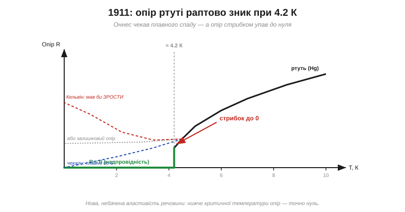
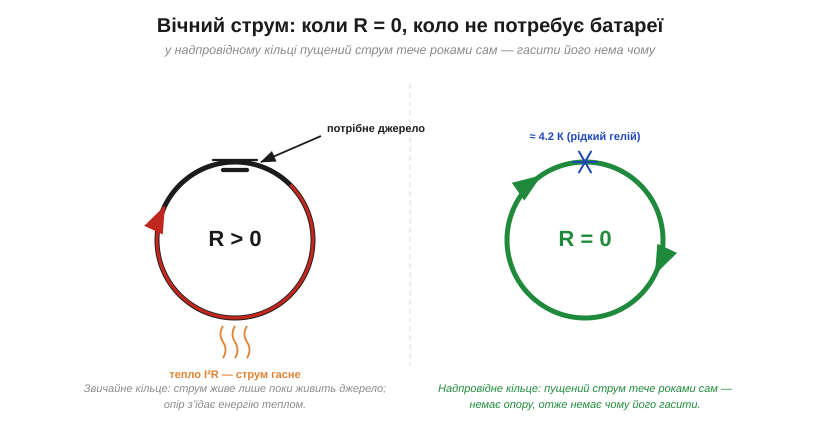
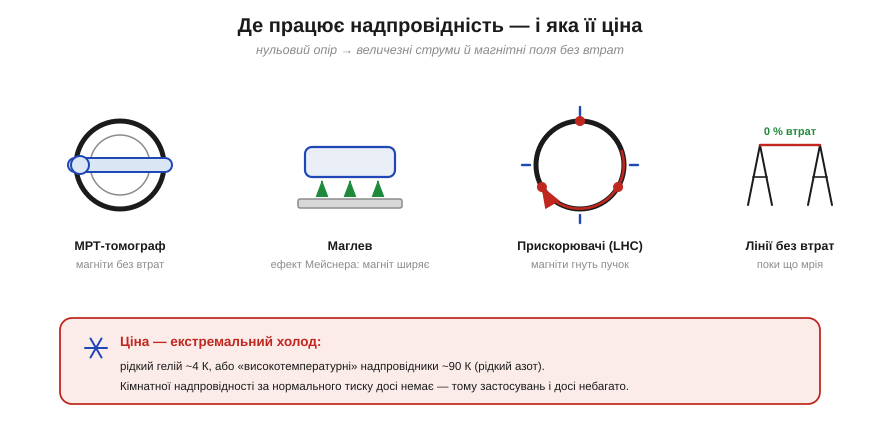

# 📜 Надпровідність: коли опір став точно нулем (Камерлінг-Оннес, 1911)

> Є відоме правило: [охолоджуй метал — і його опір спадає](book:physics/resistance-temperature) (бо стихають теплові коливання решітки, об які б’ються електрони). Природне запитання: а що на самій **межі**, коли температура наближається до абсолютного нуля? Опір сповзе до нуля плавно? Застрягне на якомусь залишку? А може, навпаки — підскочить? Відповідь, здобуту 1911 року в холодній лабораторії Лейдена, ніхто не вгадав. Вона відкрила цілий **новий стан речовини** — **надпровідність** (*superconductivity*).

---

## Холод знижує опір — а що на самій межі

Закон [опору від температури](book:physics/resistance-temperature) простий: R(T) = R₀·[1 + α·(T − T₀)]. У металів α додатна, тож, охолоджуючи мідь чи ртуть, ми бачимо, як опір рівномірно зменшується. Подумки продовжимо лінію вниз, аж до **абсолютного нуля** (0 К = −273.15 °C). Куди вона прийде?

Наприкінці XIX століття на це питання змагалися **три** відповіді, і всі звучали розумно:

- **Плавно до нуля.** Опір — від коливань решітки; виморозиш коливання — зникне й опір. Лінія сама приходить у нуль. Так сподівався і сам Оннес.
- **Залишковий опір** (*residual resistance*). У будь-якому реальному металі є домішки й дефекти, на яких електрони розсіюються **завжди**, хоч як холодно. Тому крива має не дійти до нуля, а **застрягти** на маленькій сталій величині.
- **Знову вгору.** Найповажніший голос — лорд **Кельвін** (*Lord Kelvin*) — припускав протилежне: на абсолютному нулі самі електрони «**примерзнуть**» до атомів, носіїв струму не лишиться, і опір не спаде, а **злетить до нескінченності**.

Розсудити їх міг лише дослід. Але була заковика: щоб дійти до тих кількох градусів над абсолютним нулем, потрібен холод, якого тоді **ніхто на Землі не мав**. Перемогти в цій суперечці міг тільки той, хто перший здобуде такий холод.

---

## Хто володіє холодом — той ставить дослід

Холод став здобиччю в одних руках. **Гейке Камерлінг-Оннес** (*Heike Kamerlingh Onnes*, 1853–1926), професор у голландському Лейдені, перетворив свою лабораторію на справжню **кріогенну фабрику** — з компресорами, каскадами зріджених газів і власною школою склодувів та механіків. Над дверима він написав девіз, що став його методом: **«Door meten tot weten»** — «**через вимірювання — до знання**».

Тривали **перегони за зрідженням газів**. Один за одним газам зривали «вічність»: хлор, кисень, азот, водень… Лишався останній непокірний — **гелій** (*helium*), що кипить найнижче з усіх. 1908 року Оннес узяв і його: він **перший зрідив гелій**, отримавши температуру близько **4.2 К**, а відкачуючи пару — і ще нижчу, близько 1 К. На кілька років він володів **найхолоднішим місцем у Всесвіті**, доступним людині. А отже — і ключем до тієї суперечки про межу.

> 🔧 **Навіщо це.** Тут видно загальний рушій науки: **нова межа вимірювання відкриває нові явища**. Так само телескоп відкрив супутники Юпітера, а мікроскоп — клітини. Оннес не «шукав надпровідність» — він просто дотягнувся туди, куди ніхто не діставав, і там його чекало незнане. Девіз «спершу виміряй» — це та сама точність, якій ми завдячуємо й законом Кулона, і Джоулевим еквівалентом тепла.

---

## 1911: ртуть. Опір не сповз — він зник стрибком

Для вирішального досліду Оннес обрав **ртуть** (*mercury*, Hg). Чому її? Ртуть — рідина, і її можна **багаторазово переганяти** (дистилювати), здобуваючи метал надзвичайної чистоти. Це прибирало з гри відповідь про «залишковий опір від домішок»: якщо вже **чистій** ртуті щось завадить, то не бруд.

Заморозивши тонку нитку ртуті в рідкому гелії, асистенти Оннеса повільно міряли її опір, знижуючи температуру. Спершу все йшло за [звичним правилом](book:physics/resistance-temperature): опір рівно спадав. Аж раптом, біля **4.2 К**, прилад показав те, що спочатку визнали за помилку, — опір **обвалився стрибком**, на кілька порядків, до **неможливо малої, фактично нульової** величини. Не плавно. Не до залишку. Не вгору. **Раптовий перехід** у новий стан.

*Чого чекали — і що сталося. Пунктиром — три тогочасні прогнози: плавно до нуля (синій), залишковий опір (сірий), Кельвінів злет угору (червоний). Суцільна лінія — **дослід**: опір ртуті плавно спадає, а при критичній температурі ≈ 4.2 К **стрибком падає точно в нуль** і там лишається. Жоден прогноз не вгадав.*

Оннес зрозумів, що бачить не просто «дуже малий опір», а **якісно інший стан речовини**, і назвав його **«supraconductivity»** — **надпровідність**. Температуру, за якої стається стрибок, відтоді звуть **критичною температурою** (*critical temperature*, T_c). Для ртуті T_c ≈ 4.2 К.

---

## Наскільки точно «нуль»: дослід із вічним струмом

Тут постала тонкість. Сказати «опір нульовий» легко — а як це **довести**? Звичайний спосіб (закон Ома R = V/I) не годиться: якщо пустити струм і виміряти напругу на зразку, то за R = 0 напруга V = I·R = 0 — але ж і прилад має скінченну точність, тож «нуль» може бути просто «менше, ніж ми бачимо». Як виміряти **точний** нуль?

Оннес вигадав дослід приголомшливої краси — **незатухаючий (вічний) струм** (*persistent current*). Замкнімо надпровідник у **кільце** й наведемо в ньому струм (магнітом). Тепер заберімо джерело й **дивімося**. Будь-яке звичайне кільце має індуктивність L та опір R, і струм у ньому згасає за законом I(t) = I₀·e^(−R·t/L): що більший опір, то швидше гасне. Якщо ж R **точно нуль** — показник дорівнює нулю, експонента не спадає, і струм має текти **вічно**, без жодного джерела.

*Ліворуч — звичайне кільце: щоб струм тривав, потрібне джерело, а опір невпинно гасить його теплом I²R. Праворуч — надпровідне кільце при ≈ 4.2 К: пущений струм **тече роками сам**, без батареї й без втрат, бо гасити його просто **нема чому**.*

Оннес запустив такий струм — і той тік **годинами й добами без жодного помітного спаду**. Це й був доказ: опір не «малий», а нижчий за будь-яку межу вимірювання. Сучасні досліди уточнили: час життя надпровідного струму перевищує **сотні тисяч років** — практично вічність. Опір справді **нуль**.

> 🔧 **Навіщо це.** У звичайному провіднику струм неминуче [гріє його теплом](book:physics/joule-heating) **I²R** і втрачає енергію — бо [електрони зазнають зіткнень](book:physics/resistance-origin). У надпровіднику множник R = 0, тож **I²R = 0** — нагріву й втрат немає взагалі. Звідси й зухвала мрія інженерів: магніти, що тримають поле «задарма», і лінії, що несуть енергію без жодного градуса нагріву. Уся принада надпровідності — в одному цьому нулі.

---

## Чому опір зникає: загадка на 46 років

Оннес дав світові **що**, але не **чому**. Класична фізика була безпорадна: як розсіяння електронів може зникнути не «майже», а **повністю**? Це суперечило всьому, що відомо про [неминучі зіткнення електронів](book:physics/resistance-origin).

Розгадка прийшла лише через **46 років**, і знадобилася вся **квантова механіка**. 1957 року троє американців — **Бардін, Купер і Шріффер** (*Bardeen, Cooper, Schrieffer*) — дали теорію **БКШ** (*BCS*). Спрощено: нижче T_c електрони перестають бути одинаками й **об’єднуються в пари** (**куперівські пари**, *Cooper pairs*) через ледь помітне притягання, яке передає сама решітка. Ці пари зливаються в єдиний узгоджений квантовий «хор», що рухається як ціле, — і ґратці **нема за що його зачепити**, аби розсіяти. Опір зникає.

Дорогою відкрилося, що надпровідність — не просто «нульовий опір», а окремий **стан речовини** зі своїми дивами. 1933 року **Мейснер і Оксенфельд** (*Meissner, Ochsenfeld*) виявили, що надпровідник **виштовхує з себе магнітне поле** — **ефект Мейснера** (*Meissner effect*). Саме завдяки йому магніт **ширяє** над надпровідником: ефектний дослід, що його сьогодні показують у кожному музеї науки.

Заслуги відзначили щедро: Оннес дістав **Нобелівську премію 1913 року** (за дослідження при низьких температурах і зрідження гелію), а творці теорії БКШ — 1972-го.

---

## «Тепла» надпровідність — і чому вона досі не змінила світ

Хиба надпровідності очевидна: 4 К — це майже абсолютний нуль, рідкий гелій дорогий і вередливий. Десятиліттями мріяли підняти T_c. Прорив стався 1986 року: **Беднорц і Мюллер** (*Bednorz, Müller*) знайшли надпровідність у **керамічних оксидах міді** при ~30 К, а далі — і вище **90 К**. Це перейшло важливий поріг: 90 К **тепліше** за рідкий **азот** (77 К), а той дешевий, як газована вода. Премію їм дали вже наступного, 1987 року — **найшвидше в історії**.

Де надпровідність працює вже сьогодні:

- **МРТ-томографи** — їхні потужні магніти намотано надпровідним дротом; без втрат на опір вони тримають поле роками.
- **Прискорювачі частинок** (як **LHC**) — надпровідні магніти згинають пучки на велетенських енергіях.
- **Маглев-потяги** — левітують і мчать майже без тертя.
- Надчутливі **давачі магнітного поля** (SQUID).

*Чотири царини, де нульовий опір уже незамінний: томографи, маглев, прискорювачі, мрія про лінії без втрат. А внизу — головна **ціна**: усе це потребує екстремального холоду (рідкий гелій ~4 К або «високотемпературні» надпровідники ~90 К у рідкому азоті).*

А чому ж досі немає надпровідних дротів у кожній розетці? Бо лишається **головний бар’єр**: **надпровідність за кімнатної температури й звичайного тиску** — досі **не досягнута**. Є зухвалі результати на гідридах під шаленим тиском у **сотні гігапаскалів** — це **мільйони** атмосфер (приклад — LaH₁₀ при ~250 К і ~170 ГПа), та для побуту вони непридатні; а частину гучних заяв про надпровідність біля «кімнатної» температури згодом **відкликали** (ретракції в *Nature*, 2022–2023). Тож поки що за кожен «вічний струм» доводиться платити кріостатом із холодоагентом.

---

## Чим це відгукнулося

Зведімо ланцюг. Є правило: **холод знижує опір**. Надпровідність — це його **крайня межа**, де опір стає не «дуже малим», а **точно нулем**, і речовина переходить у новий стан:

- **Надпровідність** (*superconductivity*) — повне зникнення опору нижче **критичної температури** T_c.
- **Незатухаючий струм** (*persistent current*) — наслідок R = 0: струм у кільці тече роками сам, без джерела.
- **Ефект Мейснера** (*Meissner effect*) — виштовхування магнітного поля; через нього магніт ширяє.
- Пояснення — **куперівські пари** (теорія БКШ, 1957), а здобуто все це **точним вимірюванням** у єдиному найхолоднішому місці планети.

Три уроки звідси варто закарбувати. Перший: **хто дотягнувся до нової межі (тут — холоду), той відкриває незнане** — монополія Оннеса на 4 К подарувала йому ціле явище. Другий: **«спершу виміряй»** — Оннесів девіз приніс відкриття там, де теоретики лише сперечалися (і всі троє, включно з Кельвіном, помилилися). Третій: між **спостереженням** і **поясненням** може лежати прірва — тут аж 46 років.

А найважливіше відлунює у [джоулевому теплі](book:physics/joule-heating): уся теплова електротехніка тримається на множнику **I²R**. Зробіть R нулем — і зникне нагрів і джоулеві втрати. (Щоправда, «безмежного» струму це не дає: надпровідник має власну **критичну густину струму**, а ще критичні температуру й магнітне поле, за якими надпровідність зривається.) Надпровідність показує, **яким був би світ без джоулева тепла**, — і водночас, якою ціною (кріогенний холод) цей світ поки що дається.
