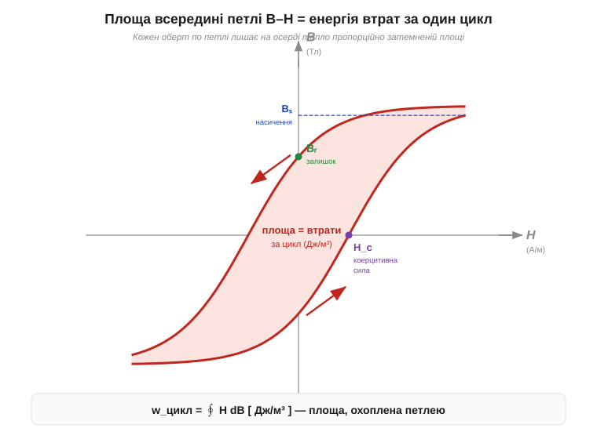
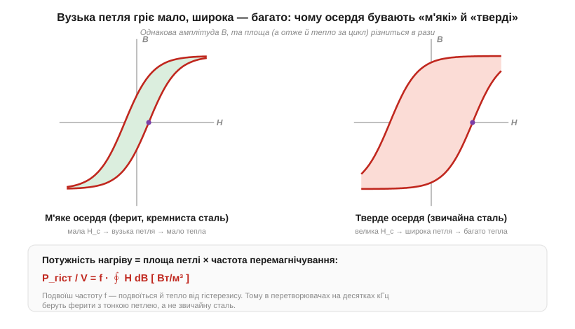

# 🧮 Петля B–H кількісно: площа петлі = втрати за цикл

> Це математична вставка про **петлю гістерезису** (*hysteresis loop*) в осерді. Якісно петля виглядає так: коли ганяєш поле в осерді туди-сюди, відгук B на прикладене H не лягає назад на себе, а описує замкнену криву — залізо «пам'ятає» свою історію (детальніше — у статті про [насичення й гістерезис](book:physics/saturation-hysteresis)). Тут ми поставимо до петлі число й доведемо одну охайну річ: **площа, яку петля охоплює, дорівнює енергії, що йде на тепло за один повний цикл перемагнічування — у джоулях на кубометр осердя.** Не «пропорційна» з темним коефіцієнтом, а буквально дорівнює — рідкісний випадок, коли геометрія картинки прямо є фізичною величиною, яку інженер потім бачить як гарячий трансформатор.

### Означення: що відкладено по осях і чому саме B й H

Спершу домовимося про осі, бо в них уся суть. По горизонталі — **напруженість магнітного поля** (*magnetic field strength*, H, А/м): це те, що ти **задаєш ззовні**, крутячи струм у котушці. Усередині довгого [соленоїда](book:physics/electromagnet) H — це просто `H = N·I / ℓ`, тобто «скільки ампер-витків на метр» ти прикладаєш. H не залежить від того, що напхано в котушку: це причина, напрям дії.

По вертикалі — **магнітна індукція** (*magnetic flux density*, B, Тл): це **відгук**, реальне поле, що встановилося в матеріалі. Саме B пронизує витки, тягне якір і наводить напругу. У вакуумі B й H зв'язані намертво прямою `B = μ₀·H`, але в залізі зв'язок нелінійний і неоднозначний — це й малює петлю.

Чому енергію шукаємо в добутку H на зміну B? Бо так влаштована робота джерела. Щоб наростити поле, котушка штовхає струм проти ЕРС самоіндукції, і елементарна робота, яку джерело вкладає в **одиницю об'єму** осердя за приріст індукції dB, дорівнює рівно `H·dB`. Це не означення «зі стелі», а закон збереження енергії для магнітного кола (повне виведення спирається на [закон електромагнітної індукції](book:physics/electromagnetic-induction), що зв'язує зміну B з наведеною напругою; тут беремо результат). Питома робота за весь цикл — сума таких внесків по замкненому контуру:

```
w_цикл = ∮ H dB        [ Дж/м³ ]
```

Кружок на інтегралі (∮) означає «обхід по замкненій петлі». А [інтеграл](book:math/integral) `∮ H dB` за геометричним змістом — це **площа, охоплена кривою** на площині (H, B). Ось і вся теорема: питомі втрати за цикл = площа петлі.

### Інтуїція: чому замкнена петля не повертає всю енергію

Якби зв'язок B(H) був однозначною кривою — піднімаєш H, B росте тією самою кривою; опускаєш H, B вертається назад точнісінько тим самим шляхом — то інтеграл «туди» й інтеграл «назад» взаємно скоротилися б, і за повний цикл робота була б нульова. Уся енергія, вкладена при намагнічуванні, повернулася б до джерела при розмагнічуванні. Так поводиться ідеальна пружина: стиснув — запасив, відпустив — забрав усе назад.

Але залізо так не вміє. Через тертя [доменних стінок](book:physics/saturation-hysteresis) (домени перескакують стрибками, чіпляючись за дефекти ґратки) крива «вниз» іде **вище**, ніж крива «вгору»: при тому самому H індукція на зворотному ході більша, бо матеріал не хоче відпускати намагніченість. Вітки розходяться — і саме тому інтеграли «туди» й «назад» не гасяться. Те, що лишається, — площа просвіту між ними. Ця енергія не повертається до джерела: вона йде на «відривання» доменних стінок від зачепів і розсіюється теплом у товщі осердя.


*Замкнена петля B–H. Стрілки показують напрям обходу за один цикл змінного струму. Верхня вітка (поле спадає) йде вище за нижню (поле зростає) — матеріал «запізнюється». Затемнена площа між вітками і є питома енергія втрат w_цикл = ∮ H dB у джоулях на кубометр. Заодно петля задає три паспортні числа осердя: насичення Bₛ (вище не вижати), залишкову індукцію Bᵣ (що лишилось при H = 0) і коерцитивну силу H_c (яке зустрічне поле гасить B до нуля).*

Геометрично це читається миттєво: чим «товстіша» петля, тим більший просвіт між вітками, тим більша площа — і тим більше тепла за оберт. Тонка, майже зведена нанівець петля означає, що матеріал ледь пам'ятає історію й майже нічого не гріє. Звідси й уся інженерія осердь.

### Апарат: розмірність, оцінка площі й множення на частоту

Перевіримо, що формула дає саме джоулі на кубометр — найкращий запобіжник від помилки. H вимірюється в А/м, B — у теслах, а тесла розкривається через базові одиниці так:

```
[H·B] = (А/м) · Тл = (А/м) · (В·с/м²) = (В·А·с) / м³ = Дж / м³   ✓
```

(тут Тл = Вб/м² = В·с/м², а В·А·с = Вт·с = Дж). Розмірність зійшлася: добуток H на B справді є густина енергії. Добре.

На практиці інтеграл рідко беруть аналітично — петлю знімають приладом і **рахують площу чисельно**. Найгрубша, але робоча оцінка: апроксимувати петлю прямокутником зі сторонами «по два коерцитивні поля» в ширину й «по дві залишкові індукції» у висоту, і взяти частку k ≈ 0.2…0.5 (петля худіша за описаний прямокутник):

```
w_цикл ≈ k · (2·H_c) · (2·Bᵣ) = 4k · H_c · Bᵣ      [ Дж/м³ ]
```

де H_c — **коерцитивна сила** (*coercivity*, А/м), Bᵣ — **залишкова індукція** (*remanence*, Тл), а k беруть із форми конкретної петлі.

Тепер головний крок до реальності. Одна петля — це втрати за **один** прохід туди-назад. На змінному струмі осердя проходить петлю `f` разів на секунду, де f — частота (Гц). Помножимо енергію за цикл на число циклів — і дістанемо **потужність** втрат на гістерезис на одиницю об'єму:

```
P_гіст / V  =  f · ∮ H dB  =  f · w_цикл        [ Вт/м³ ]
```

Лінійна залежність від частоти — ключовий висновок усієї вставки. Подвоїш частоту перемагнічування — рівно подвоїш тепло від гістерезису (площа петлі при цьому майже не змінюється, бо її визначає амплітуда B, а не темп). Саме тому те саме осердя, цілком холодне на 50 Гц мережі, може розжаритися на десятках кілогерц.


*Та сама амплітуда B, дві різні матерії. Ліворуч — «м'яке» осердя (*soft magnetic*): мала коерцитивна сила H_c, вузька петля, мала площа — мало тепла. Праворуч — «тверда» сталь: велика H_c, широка петля, площа в рази більша. Помножена на частоту, ця площа й вирішує, чи буде осердя теплим, чи гарячим.*

> 🔧 **Навіщо це.** Площа петлі — це не абстракція з підручника, а ват, який доведеться відвести від осердя дроселя чи трансформатора. Коли в перетворювачі на 100 кГц вибирають **феритове** осердя з тонкою петлею, а не дешеву сталь, то платять саме за малу площу ∮ H dB: на такій частоті широка петля сталі дала б кіловати втрат на кубометр і спалила б котушку. Та сама величина пояснює, чому осердя гріються тим сильніше, чим вища робоча частота, і чому в datasheet феритів пишуть «core loss» окремою кривою від частоти. Інженерна вимога коротка: для накопичувачів і трансформаторів бери матеріал із **вузькою** петлею (мала H_c), для [постійних магнітів](book:physics/permanent-magnets) — навпаки, з **широкою** (велика H_c), щоб магніт не розмагнічувався.

**Приклад (нагрів осердя дроселя).** Феритове осердя об'ємом V = 8 см³ = 8·10⁻⁶ м³ працює на частоті f = 100 кГц. Із знятої петлі площа вийшла w_цикл = 300 Дж/м³. Скільки тепла розсіює гістерезис?

```
P_гіст = f · w_цикл · V
       = 100 000 Гц · 300 Дж/м³ · 8·10⁻⁶ м³
       = 100 000 · 300 · 8·10⁻⁶  Вт
       = 0.24 Вт
```

Чверть вата в крихітному осерді — це відчутно тепле осердя, і це **лише** гістерезис, без вихрових струмів (*eddy currents*), які додаються зверху й ростуть із частотою ще швидше. Для контрасту: те саме осердя на f = 50 Гц дало б `0.24 Вт · (50/100000) ≈ 0.12 мВт` — практично нуль. Уся різниця — у множнику «частота», і вся вона прихована в одній площі петлі.

### Де це працює

Площа петлі — місток від фізики магнетизму до теплового бюджету реального пристрою: вона пояснює, чому в [осердя](book:physics/saturation-hysteresis) є межа (насичення) і ціна (втрати) і чому ферити для осердь добирають саме за формою петлі. Логіка «робота = ∮ сила·dx по замкненому контуру» тут та сама, що й у понятті [роботи поля](book:physics/electric-potential), де інтеграл читається як площа під кривою; а прийом «помножити енергію за період на частоту, щоб дістати потужність» — родич того, як із [середньоквадратичного значення](book:physics/rms-value) за період беруть середню потужність. Саме слово «гістерезис» живе ще в зовсім іншому, **електронному** значенні — [гістерезис компаратора](book:electronics/schmitt-trigger) — і це окреме явище, не плутати з магнітним. А зв'язок «площа × частота = ват» — це той самий ват, який доводиться відводити від магнітних елементів перетворювача.
