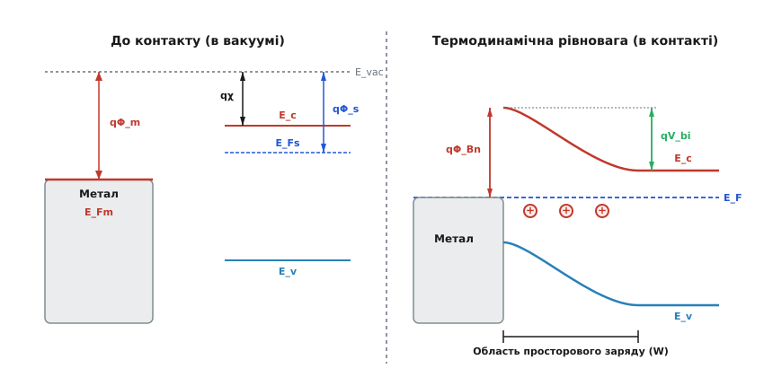
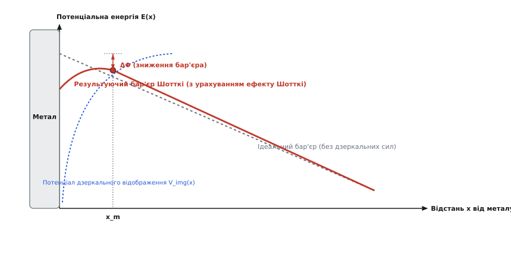
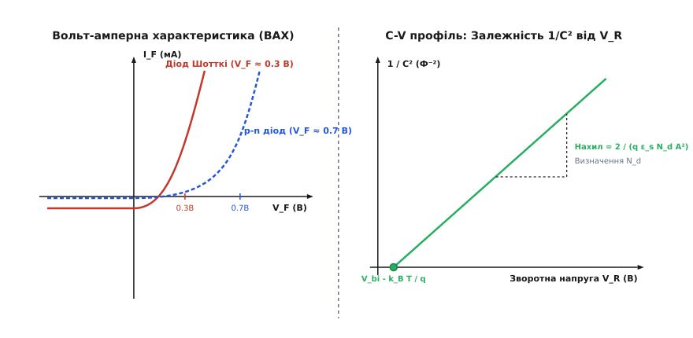

# Бар'єр Шотткі

<preknowlist>
- [Напівпровідники](topic:physics/semiconductor) — енергетична зонна структура, електронна провідність та рівень Фермі.
- [p-n перехід](topic:physics/pn-junction) — виснажена область просторового заряду, потенціальний бар'єр та випрямлення.
- [Допування напівпровідників](topic:physics/doping) — донорні та акцепторні домішки, концентрація основних носіїв.
</preknowlist>

Коли чиста поверхня металу вступає в атомарний контакт із напівпровідником, електрони з матеріалу з меншою роботою виходу миттєво перетікають у матеріал із більшою роботою виходу, вирівнюючи рівні Фермі обох речовин на єдину ізоенергетичну лінію. У приповерхневій області напівпровідника це перетікання залишає шар некомпенсованих іонізованих донорних або акцепторних атомів — область просторового заряду. Виникле в цій області електричне поле вигинає енергетичні зони напівпровідника, утворюючи потенціальний бар'єр для носіїв заряду. Цей контактний енергетичний бар'єр зветься **бар'єром Шотткі** (англ. *Schottky barrier*).

Оскільки перенос носіїв через бар'єр Шотткі здійснюється основними носіями заряду без накопичення неосновних носіїв у квазінейтральних областях, такий контакт випрямляє струм із надзвичайно високою швидкістю перемикання та низьким прямим падінням напруги. Розуміння фізики бар'єра Шотткі є основою для проектування високочастотних силових діодів, польових транзисторів типу MESFET і HEMT, а також для створення низькоопорних омічних контактів у сучасних інтегральних мікросхемах.

---

## 1. Фізична природа та термодинаміка контакту метал-напівпровідник

Щоб збагнути фізичну причину виникнення потенціального бар'єра, розглянемо ізольований метал та ізольований напівпровідник n-типу, які перебувають у вакуумі на великій відстані один від одного. 

Енергетичний стан носіїв у кожному матеріалі за відсутності контакту характеризується трьома фундаментальними величинами:
* **Робота виходу металу `q·Φ_m`** — мінімальна енергія, необхідна для перенесення електрона з рівня Фермі металу `E_Fm` на рівень вакууму `E_vac` (тобто у точку поза межами дії притягання кристалічної ґратки).
* **Робота виходу напівпровідника `q·Φ_s`** — енергія, необхідна для перенесення електрона з рівня Фермі напівпровідника `E_Fs` на рівень вакууму `E_vac`.
* **Електронна спорідненість напівпровідника `q·χ`** — фундаментальна характеристика напівпровідникового матеріалу, яка дорівнює енергетичній відстані від дна зони провідності `E_c` до рівня вакууму `E_vac`:

```
q·χ = E_vac - E_c
```

У помірно легованому напівпровіднику n-типу рівень Фермі `E_Fs` розташований у забороненій зоні поблизу дна зони провідності `E_c`. Енергетичний інтервал між дном зони провідності та рівнем Фермі зазвичай позначають як `q·V_n = E_c - E_F`. Звідси робота виходу напівпровідника пов'язана з електронною спорідненістю співвідношенням:

```
q·Φ_s = q·χ + q·V_n
```

У більшості практичних комбінацій металів і напівпровідників робота виходу металу перевищує роботу виходу напівпровідника (`q·Φ_m > q·Φ_s`). Це означає, що середня термодинамічна енергія електронів у напівпровіднику вища, ніж у металі (`E_Fs > E_Fm`).


*Рис. 1. Енергетичні зонні діаграми ізольованого металу та n-напівпровідника (ліворуч) та в стані термодинамічної рівноваги після контакту (праворуч).*

При приведенні металу та напівпровідника у зазор або безпосередній атомарний контакт виникає термодинамічна нерівновага. Електрони з зони провідності напівпровідника починають перетікати в метал, де для них існують вільні квантові стани з нижчою енергією поблизу рівня Фермі `E_Fm`.

Цей перехід електронів створює в системі подвійний електричний шар і триває доти, доки електростатичний потенціал розділеного заряду не урівноважить початкову різницю рівнів Фермі. У стані термодинамічної рівноваги рівень Фермі стає єдиним уздовж усієї системи (`E_Fm = E_Fs = E_F`), що є базовою вимогою термодинаміки для будь-якої багатокомпонентної системи.

Перетікання електронів у метал призводить до двох важливих просторових наслідків:
1. На самій поверхні металу накопичується тонка двовимірна негативно заряджена плівка (товщиною близько одного атомарного шару `~ 0.1 нм`, завдяки надзвичайно малій довжині екранування в металах).
2. У приповерхневому шарі напівпровідника утворюється позитивно заряджена область просторового заряду (ОПЗ) товщиною `W`, яка складається з некомпенсованих іонізованих донорних атомів `N_d^+`.

Оскільки концентрація іонізованих донорів у напівпровіднику (`N_d ≈ 10¹⁵–10¹⁷ см⁻³`) на багато порядків нижча за концентрацію вільних електронів у металі (`n_m ≈ 10²² см⁻³`), шар просторового заряду повністю локалізується всередині напівпровідникового матеріалу. Внутрішнє електричне поле цього заряду вигинає енергетичні зони напівпровідника вгору.

Детальний опис історичної дискусії довкола вимірювання роботи виходу та формування перших уявлень про контакт метал-напівпровідник наведено у вставці [📜 Історія відкриття контакту метал-напівпровідник](topic:physics/schottky-barrier/hist-schottky-barrier.md).

---

## 2. Модель Шотткі-Мотта та утворення потенціального бар'єра

У 1938 році німецький фізик Вальтер Шотткі та британський фізик Невілл Мотт запропонували ідеальну кількісну модель контакту метал-напівпровідник, яка відкидає поверхневі стани й припускає атомарно чисту межу розділу без проміжного оксидного шару.

Згідно з **правилом Шотткі-Мотта**, неперервність рівня вакууму `E_vac` на межі розділу вимагає вигину енергетичних зон усередині напівпровідника. Повний вигин зон, або **вбудований контактний потенціал `V_bi`**, дорівнює різниці початкових робіт виходу:

```
q·V_bi = q·Φ_m - q·Φ_s
```

Вбудований потенціал `V_bi` утворює потенціальний бар'єр для електронів, які рухаються з об'єму напівпровідника в метал. При нульовому зміщенні лише ті електрони із зони провідності напівпровідника, теплова енергія яких перевищує `q·V_bi`, можуть здолати цей бар'єр і потрапити в метал.

Для електронів, що прямують у зворотному напрямку — з металу в напівпровідник, висота потенціального бар'єра **`q·Φ_Bn`** визначається як енергетична відстань від рівня Фермі металу `E_F` до дна зони провідності `E_c` безпосередньо на межі розділу `x = 0`:

```
q·Φ_Bn = q·Φ_m - q·χ                        [висота бар'єра Шотткі для n-типу]
```

Для напівпровідника p-типу з роботою виходу металу `q·Φ_m < q·Φ_s` виснажена область створюється негативно зарядженими іонізованими акцепторами, а вигин зон відбувається вниз. Висота бар'єра для дірок `q·Φ_Bp` дорівнює відношенню:

```
q·Φ_Bp = E_g - (q·Φ_m - q·χ)                [висота бар'єра Шотткі для p-типу]
```

Сума висот бар'єрів для електронів та дірок на одному й тому самому напівпровідникові дорівнює ширині його забороненої зони `E_g`:

```
q·Φ_Bn + q·Φ_Bp = E_g
```

Для визначення просторового розподілу потенціалу `V(x)` та напряженості електричного поля `E(x)` застосовується одновимірне рівняння Пуассона у виснаженому шарі `0 ≤ x ≤ W`:

```
d²V / dx² = -q·N_d / ε_s
```

де `ε_s = ε_r·ε_0` — діелектрична проникність напівпровідника.

Застосовуючи деплеційне наближення Шотткі (вважаючи, що за межею `x = W` електричне поле дорівнює нулю), отримуємо лінійний розподіл електричного поля:

```
E(x) = (q·N_d / ε_s) · (W - x)
```

Максимальне електричне поле досягається безпосередньо на межі контакту `x = 0`:

```
E_max = (q·N_d·W) / ε_s
```

Інтегруючи поле `E(x)`, отримуємо параболічний профіль потенціальної енергії `E_c(x)` у зоні провідності та вираз для товщини виснаженого шару `W` залежно від зовнішньої прикладеної напруги `V`:

```
W = √((2·ε_s·(V_bi - V)) / (q·N_d))         [ширина області просторового заряду]
```

де `V > 0` відповідає прямому зміщенню (позитивний потенціал на металевому аноді), яке зменшує вбудований бар'єр до величини `V_bi - V` і звужує виснажену область `W`. При зворотному зміщенні (`V = -V_R < 0`) зовнішнє поле додається до вбудованого, збільшуючи потенціальний бар'єр до `V_bi + V_R` та розширюючи виснажену область `W`.

---

## 3. Зонні діаграми при підключенні зовнішньої напруги

Зовнішня напруга `V`, прикладена до контакту метал-напівпровідник, повністю припадає на шар просторового заряду `W`, оскільки опір виснаженої області на багато порядків перевищує опір металевого контакту та квазінейтрального об'єму напівпровідника.

Зміна енергетичного профілю при різних полярностях прикладеної напруги відбувається таким чином:

### Пряме зміщення (Forward Bias, V > 0)
Позитивний потенціал прикладається до металевого анода, а негативний — до n-напівпровідника. Це зміщення зменшує потенціальний бар'єр для електронів, що рухаються з напівпровідника в метал, з величини `q·V_bi` до `q·(V_bi - V)`.
* Товщина виснаженого шару `W` звужується.
* Електричне поле на межі `E_max` зменшується.
* Висота бар'єра з боку металу `q·Φ_Bn` залишається практично незмінною, оскільки рівень Фермі металу опускається відносно напівпровідника на `q·V`.
* Потік електронів із напівпровідника в метал експоненційно зростає пропорційно `exp(q·V / (k_B·T))`, створюючи великий прямий струм.

### Зворотне зміщення (Reverse Bias, V = -V_R < 0)
Негативний потенціал прикладається до металу, а позитивний — до n-напівпровідника. Зміщення збільшує потенціальний бар'єр для електронів напівпровідника до `q·(V_bi + V_R)`.
* Товщина виснаженого шару `W` розширюється.
* Електричне поле на межі `E_max` монотонно зростає.
* Потік електронів із напівпровідника в метал повністю припиняється.
* Крізь бар'єр протікає лише малий, майже насичений зворотний струм `J_s`, створюваний електронами металу, які мають енергію, достатню для подолання бар'єра `q·Φ_Bn`.

---

## 4. Реальні межі розділу та закріплення рівня Фермі (Парадокс Бардіна)

Спрощена модель Шотткі-Мотта передбачає, що висота бар'єра `Φ_Bn` має лінійно зростати зі збільшенням роботи виходу металу `Φ_m` із нахилом `S = d(Φ_Bn)/d(Φ_m) = 1`. Проте чисельні експерименти 1940–1960-х років показали, що для більшості ковалентних напівпровідників (кремнію `Si`, германію `Ge`, арсеніду ґалію `GaAs`) коефіцієнт нахилу `S` близький до нуля (`S ≈ 0.05–0.2`). Це означає, що висота бар'єра майже не залежить від того, який саме метал напилено на поверхню.

Розгадку цього феномену в 1947 році запропонував Джон Бардін, ввівши концепцію **поверхневих станів** (англ. *surface states*).

На поверхні монокристала періодична структура ґратки обривається. Некомпенсовані обірвані валентні зв'язки (англ. *dangling bonds*) поверхневих атомів утворюють високу густину дозволених електронних станів усередині забороненої зони напівпровідника `D_it` (вимірюється в `см⁻²·еВ⁻¹`).

Межу нейтральності цих поверхневих станів називають **рівнем нейтральності поверхні `E_0`**. Якщо поверхневі стани заповнені електронами до рівня `E_0`, поверхня є електрично нейтральною. Якщо рівень Фермі `E_F` піднімається вище `E_0`, поверхневі стани заряджаються негативно; якщо падає нижче `E_0` — позитивно.

```
[Метал] ── (Дипольний шар Δδ) ── [Поверхневі стани D_it (E_0)] ── [Напівпровідник]
```

Коли метал вступає в контакт із напівпровідником, носії заряду перетікають не лише в об'ємний шар просторового заряду `W`, а й на поверхневі стани. При високій густині поверхневих станів (`D_it > 10¹³ см⁻²·еВ⁻¹`) навіть незначний зсув рівня Фермі відносно `E_0` створює на поверхні величезний заряд, який повністю компенсаційно екранує різницю робіт виходу металу й напівпровідника.

У результаті рівень Фермі на межі розділу виявляється жорстко зафіксованим («закріпленим») на рівні нейтральності поверхні `E_0`. Це явище носить назву **закріплення рівня Фермі** (англ. *Fermi level pinning*), або **межа Бардіна** (англ. *Bardeen limit*).

Висота бар'єра в межі Бардіна перестає залежати від металу `Φ_m` і визначається виключно властивостями самого напівпровідника:

```
q·Φ_Bn ≈ E_g - q·E_0                        [висота бар'єра в межі Бардіна]
```

У 1970–1980-х роках Фолькер Гайне та Джон Тезофф довели, що навіть на ідеально чистій атомарній межі розділу без жодного дефекту квантово-механічні хвильові функції електронів провідності металу тунелюють всередину забороненої зони напівпровідника на відстань 0.5–1.0 нм. Ці згасаючі хвильові функції утворюють фундаментальний спектр електронних станів, який отримав назву **індукованих металом зазорових станів** (англ. *Metal-Induced Gap States, MIGS*). 

Сучасна феноменологічна формула для висоти бар'єра враховує як електронну спорідненість, так і параметр закріплення рівня Фермі `S`:

```
q·Φ_Bn = S · (q·Φ_m - q·χ) + (1 - S) · (E_g - q·E_0)
```

Для йонних кристалів (наприклад, `ZnO`, `NaCl`) параметр `S → 1` (межа Шотткі-Мотта), а для ковалентних кремнію та арсеніду ґалію `S → 0` (межа Бардіна).

---

## 5. Механізми переносу заряду крізь бар'єр та теорія Кроуелла-Зе

Електричний струм через бар'єр Шотткі може протікати за рахунок декількох квантових і класичних механізмів переносу носіїв заряду. Залежно від температури, товщини виснаженого шару та ступеня легування напівпровідника панує один із чотирьох основних процесів:

1. **Термоелектронна емісія (Thermionic Emission, TE)** — балістичний проліт над вершинкою бар'єра гарячих електронів, які мають кінетичну енергію `E > q·Φ_Bn`. Це панівний механізм у помірно легованих напівпровідниках при кімнатній та підвищеній температурах.
2. **Термоелектронно-польова емісія (Thermionic-Field Emission, TFE)** — тунелювання теплово збуджених електронів крізь верхню, більш тонку частину потенціального бар'єра. Відбувається у напівпровідниках із середнім рівнем легування (`N_d ≈ 10¹⁷–10¹⁸ см⁻³`). Характеризується температурним параметром `E_00`:

```
E_00 = (q·ℏ / 2) · √(N_d / (m*·ε_s))        [характеристична енергія тунелювання]
```

При `k_B·T ≈ E_00` панує механізм TFE.
3. **Польова емісія (Field Emission, FE)** — квантово-механічне тунелювання електронів безпосередньо з дна зони провідності крізь усю товщину бар'єра при сильному легуванні (`N_d > 10¹⁹ см⁻³`), коли товщина виснаженого шару звужується до `W < 2–3 нм` і `k_B·T << E_00`.
4. **Рекомбінація та ґенерація в області просторового заряду** — рекомбінація носіїв через глибокі пастки в забороненій зоні за моделлю Шокли-Рода-Холлоу.

У 1966 році Чарльз Кроуелл (Charles Crowell) та Саймон Зе (Simon Sze) об'єднали теорію термоелектронної емісії Бете з дифузійною теорією Шотткі. Вони довели, що гранична швидкість переносу носіїв біля межі контакту визначається емісійною швидкістю `v_re = A* · T² / (q · N_c)`, а перенос описується ефективною швидкістю рекомбінації на межі:

```
J = [q · v_re · N_c / (1 + v_re / v_d)] · exp(-q·Φ_Bn / (k_B·T)) · [exp(q·V / (η·k_B·T)) - 1]
```

де `v_d` — дифузійна швидкість прольоту носіїв крізь виснажену область. Для високорухливих напівпровідників `v_d >> v_re`, і вираз Кроуелла-Зе повністю зводиться до чистої теорії термоелектронної емісії Бете.

Кроуелл і Зе також врахували квантово-механічне відбиття електронів від межі розділу та розсіювання на оптичних фононах поблизу максимуму бар'єра, ввівши коефіцієнт квантового проходження `f_q` та фононного розсіювання `f_p`. У результаті ефективна стала Річардсона коригується як `A** = f_p · f_q · A*`.

Детальний математичний вивід інтегралів термоелектронної емісії Бете та розрахунок сталої Річардсона наведено у вставці [🧮 Вивід термоелектронної емісії та ефекту Шотткі](topic:physics/schottky-barrier/math-schottky-transport.md).

За моделлю термоелектронної емісії Бете вольт-амперна характеристика діода Шотткі описується рівнянням:

```
J = J_s · [exp(q·V / (η·k_B·T)) - 1]        [рівняння ВАХ діода Шотткі]
```

Густина струму насичення `J_s` визначається висотою бар'єра `Φ_Bn` та ефективною сталою Річардсона `A*`:

```
J_s = A* · T² · exp(-q·Φ_Bn / (k_B·T))       [густина струму насичення]
```

де `A* = (4·π·q·m*·k_B²) / h³` — ефективна стала Річардсона (для n-Si `A* ≈ 112 А/(см²·К²)`, для n-GaAs `A* ≈ 8.1 А/(см²·К²)`).

Фактор неідеальності `η` (англ. *ideality factor*) для ідеального термоелектронного переносу дорівнює `η = 1.0`. У реальних діодах через наявність ефекту Шотткі, тонкого оксиду та рекомбінації `η` перебуває в межах `1.02–1.15`.

Фактор неідеальності виявляє температурну залежність вигляду `η(T) = 1 + T_0 / T` (ефект `T_0`), спричинений просторовою неоднорідністю висоти бар'єра на атомарному рівні через наявність полікристалічних зерен металічної плівки та флуктуацій поверхневого заряду.

---

## 6. Експресний та експериментальний вимір висоти бар'єра

У фізиці конденсованого стану застосовують три незалежні методи екстракції висоти бар'єра Шотткі `Φ_Bn`:

1. **За вольт-амперними характеристиками (I-V метод)**:
   Побудова залежності `ln(I)` від прямої напруги `V` при кімнатній температурах дозволяє екстраполювати струм до `V = 0`, визначаючи `I_s`. Знаючи площу `A` та сталу Річардсона `A*`, обчислюють `Φ_Bn`. Для усунення похибки площі будують графік Арреніуса `ln(I_s / T²)` від `1/T` при декількох температурах. Нахил лінії прямо визначає висоту бар'єра `Φ_Bn`.
2. **За вольт-фарадними характеристиками (C-V метод)**:
   Побудова оберненого квадрата ємності `1/C²` залежно від зворотної напруги `V_R` дає пряму лінію. Точка перетину з віссю напруг `V_int` визначає вбудований потенціал `V_bi = V_int + k_B·T/q`. Звідси висоту бар'єра обчислюють за зонною рівністю `Φ_Bn = V_bi + V_n`.
3. **За фотоелектричним ефектом (метод Фаулера)**:
   При висвітленні металевого електроду монохроматичним світлом із енергією фотонів `h·ν < E_g`, але `h·ν > q·Φ_Bn`, електрони металу фотопоглинанням збуджуються над бар'єром. Залежність фотоструму `I_photo` від енергії фотона підпорядковується закону Фаулера:

```
I_photo ∝ (h·ν - q·Φ_Bn)²                   [закон фотоемісії Фаулера]
```

Графік `√(I_photo)` від `h·ν` відтинає на осі енергії пряме значення висоти бар'єра `q·Φ_Bn`.

---

## 7. Ефект Шотткі: зниження бар'єра силами дзеркального відображення

Коли електрон із зарядом `-q` перебуває у напівпровіднику на відстані `x` від провідної поверхні металу, він індукує на поверхні металу позитивний заряд. За законами електростатики дія цього індукованого заряду еквівалентна дії уявного точкового заряду `+q`, розташованого у точці `-x` всередині металу (метод дзеркальних зображень).

Кулонівська сила притягання між електроном та його дзеркальним відображенням дорівнює:

```
F_img(x) = -q² / (16·π·ε_s·x²)
```


*Рис. 2. Результуючий потенціальний бар'єр при врахуванні сил дзеркального відображення зі зсувом максимуму x_m та зниженням ΔΦ.*

Потенціальна енергія дзеркальної взаємодії `E_img(x)` віднімається від електростатичного потенціалу виснаженого шару. Внаслідок цього результуючий бар'єр зазнає двох змін:
1. Максимум бар'єра зсувається від межі розділу `x = 0` углиб напівпровідника в точку `x_m = √(q / (16·π·ε_s·E_max))`.
2. Абсолютна висота потенціального бар'єра зменшується на величину **`ΔΦ`**:

```
ΔΦ = √(q·E_max / (4·π·ε_s))                [величина зниження бар'єра Шотткі]
```

Оскільки максимальне електричне поле на межі `E_max = √((2·q·N_d·(V_bi + V_R)) / ε_s)` зростає при збільшенні зворотної напруги `V_R`, висота бар'єра `Φ_B = Φ_Bn - ΔΦ` зменшується під дією зворотної напруги. Це пояснює, чому зворотний струм реального діода Шотткі монотонно зростає при збільшенні зворотної напруги (відсутність ідеального насичення).

---

## 8. Діоди Шотткі проти p-n діодів: порівняльний аналіз

Фундаментальна фізична відмінність між діодом Шотткі та p-n діодом полягає в типі носіїв, які беруть участь у випрямленні струму.

* **p-n діод — це біполярний прилад на неосновних носіях**. При прямому зміщенні дірки інжектуються в n-область, а електрони — в p-область. Ці неосновні носії накопичуються у квазінейтральних областях. При різкому перемиканні напруги з прямої на зворотну діод не може миттєво закритися: накопичений заряд мусить розсмоктатися шляхом рекомбінації. Це створює великий імпульс зворотного струму та визначає **час зворотного відновлення `t_rr`** (від одиниць наносекунд до мікросекунд).
* **Діод Шотткі — це уніполярний прилад на основних носіях**. Струм переносу утворюється електронами зони провідності, які переходять із напівпровідника в метал, де вони миттєво релаксують по енергії за час порядка `10⁻¹⁴ с` (термалізація у морі Фермі металу). У діоді Шотткі **відсутній заряд накопичення неосновних носіїв**, тому його час зворотного відновлення практично дорівнює нулю (`t_rr ≈ 0`).


*Рис. 3. Вольт-амперна характеристика з низькою прямою напругою (ліворуч) та лінійна залежність 1/C² від зворотної напруги V_R для C-V профілювання (праворуч).*

Порівняння ключових параметрів обох типів приладів наведено в таблиці:

| Параметр / Властивість | Діод Шотткі (на n-Si) | Кремнієвий p-n діод |
| :--- | :--- | :--- |
| **Носії заряду** | Уніполярний (тільки основні носії) | Біполярний (основні та неосновні) |
| **Пряма напруга відкривання `V_F`** | Дуже низька: `0.15–0.45 В` | Стандартна: `0.6–0.7 В` |
| **Час зворотного відновлення `t_rr`** | Практично нульовий (`< 10 ps`) | Відчутний (`10 ns – 5 μs`) |
| **Частотний діапазон** | Надвисокочастотний (до 100 ГГц) | Обмежений дифузійною ємністю |
| **Густина зворотного струму `J_R`** | Висока (`10⁻⁶ – 10⁻³ А/см²`) | Дуже низька (`10⁻¹¹ – 10⁻⁹ А/см²`) |
| **Максимальна зворотна напруга `V_BR`** | Обмежена (`< 150–200 В` для Si) | Висока (до `5000 В`) |
| **Температурний коефіцієнт `V_F`** | Від'ємний (загроза теплового розгону) | Від'ємний |

Низьке пряме падіння напруги `V_F ≈ 0.2–0.3 В` робить діоди Шотткі незамінними у випрямлячах імпульсних джерел живлення, де зменшення `V_F` на 0.3 В піднімає ККД перетворювача на 5–10%.

Конструкційні методи підвищення максимальної напруги та запобігання крайньому пробою описано у вставці [🔌 Конструктивні особливості діодів Шотткі](topic:physics/schottky-barrier/comp-schottky-diode.md).

---

## 9. Сучасні застосування та широкозонна напівпровідникова техніка

У сучасній електроніці та фізиці твердого тіла бар'єр Шотткі виконує ключову роль у декількох стратегічних галузях:

1. **Силова електроніка на основі `SiC` та `GaN`**:
   Широкозонні напівпровідники завдяки високому полю пробою (`E_crit > 3 МВ/см`) дозволили створити силові діоди Шотткі на напруги 650 В–1700 В. Вони замінили кремнієві p-n діоди в інверторах електромобілів, сонячних інверторах та швидкозарядних станціях, скоротивши динамічні втрати на перемикання більш ніж на 80%.
2. **Галогенні та Шотткі-TTL логічні елементи (74S / 74LS)**:
   Введення ненасиченого транзистора Шотткі (де діод Шотткі включено між базою та колектором біполярного транзистора) запобігає глибокому насиченню транзистора, усуваючи затримку розсмоктування носіїв і піднімаючи швидкодію логічних елементів у 5 разів.
3. **Ніч-ВЧ та НВЧ змішувачі і детектори**:
   Завдяки відсутності дифузійної ємності діоди Шотткі на арсеніді ґалію (`GaAs`) та фосфіді індію (`InP`) працюють у міліметровому та терагерцовому діапазонах радіочастот (до 1–3 ТГц), виступаючи основними змішувачами у супутниковому зв'язку та радіоастрономії.
4. **Польові транзистори MESFET та HEMT**:
   У транзисторах MESFET (Metal-Semiconductor FET) та HEMT (High Electron Mobility Transistor) бар'єр Шотткі виконує роль затвора, що керує провідністю двовимірного електронного газу (2DEG) без струмів витоку затвора.

---

## 10. Контроль типу контакту: від бар'єра до омічного контакту

У напівпровідниковому виробництві випрямний бар'єр Шотткі потрібен далеко не завжди. Для підключення напівпровідникового приладу до зовнішньої металевої розводки мікросхеми необхідні **омічні контакти** (англ. *ohmic contacts*) — невипрямні з'єднання з мінімальним послідовним опором `R_c`, ВАХ яких є симетричною та лінійною за законом Ома.

Для створення омічного контакту застосовують два принципові фізичні підходи:

1. **Підбір матеріалів без бар'єра (ідеальний випадок)**: Для n-напівпровідника підбирають метал із роботою виходу, меншою за роботу виходу напівпровідника (`Φ_m < Φ_s`). У цьому випадку вигин зон відбувається вниз, виснажена область не утворюється, а поверхня стає збагаченою електронами (накопичувальний шар).
2. **Сильне легування приповерхневого шару (промисловий стандарт)**: Через закріплення рівня Фермі підбір робіт виходу на більшості напівпровідників не працює. Тому під металевим контактом методом іонної імплантації створюють надвисоку концентрацію донорів `N_d > 10¹⁹–10²⁰ см⁻³` (шар `n⁺`).

```
[Метал] ── (Вузький бар'єр W < 2 нм) ── [n⁺-Шар N_d > 10¹⁹ см⁻³] ── [n-Об'єм]
```

Зі зростанням концентрації донорів `N_d` товщина виснаженого шару `W` зменшується за законом `W ∝ 1/√N_d`. При `N_d > 10¹⁹ см⁻³` товщина бар'єра звужується до `W < 2 нм`.

На таких малих товщинах ймовірність квантово-механічного тунелювання електронів крізь бар'єр на рівні Фермі наближається до одиниці (механізм польової емісії FE). Електрони вільно тунелюють в обох напрямках при найменшій напрузі. Потоми питомий контактний опір `ρ_c` спадає за експоненційним законом:

```
ρ_c ∝ exp[(2·√ε_s·m* / ℏ) · (Φ_Bn / √N_d)]  [опір омічного тунельного контакту]
```

При `N_d > 10²⁰ см⁻³` питомий опір контакту зменшується до `ρ_c < 10⁻⁷ Ом·см²`, перетворюючи потенціальний бар'єр Шотткі на високоякісний омічний контакт.

Інженерне налаштування висоти бар'єра за допомогою тонких діелектричних інтерпрошарків (структури метал-ізолятор-напівпровідник MIS) та вимірювання контактного опору методом ліній передачі (TLM) уможливлюють створення нанорозмірних транзисторів у сучасних техпроцесах.

Розробка чисельних алгоритмів та C++/Python програм для симуляції ВАХ/C-V характеристик та розрахунку профілю легування наведена у вставці [⚙️ Чисельне моделювання характеристик Шотткі](topic:physics/schottky-barrier/proj-schottky-sim.md).
