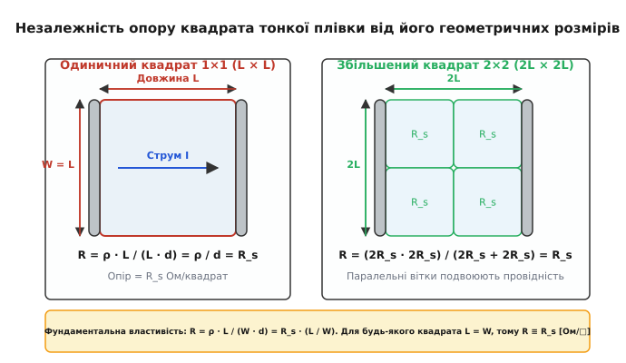
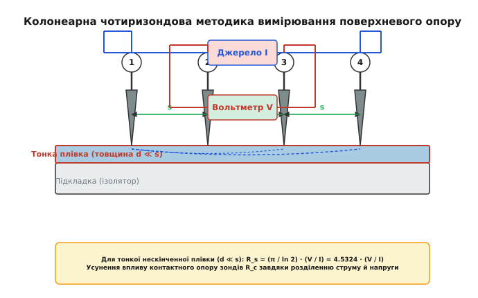
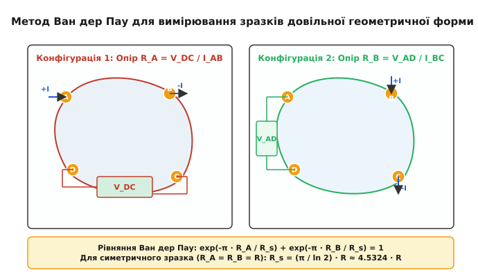
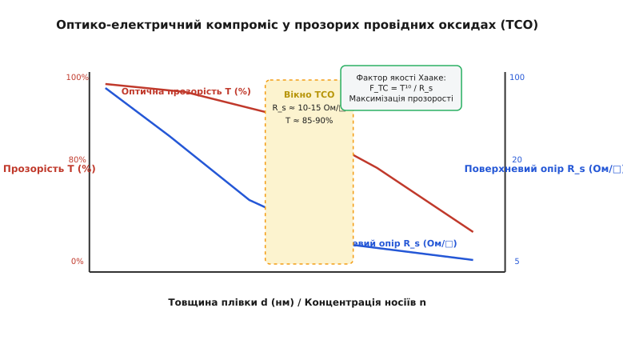

# Поверхневий опір

<preknowlist>
- [Закон Ома](topic:electronics/ohm-law) — зв'язок напруги, струму та опору в електричних колах.
- [Питомий опір та провідність](topic:physics/conductivity) — носії заряду, густина струму та закони мікроскопічного транспорту.
- [Легування напівпровідників](topic:physics/doping) — донори, акцептори, розподіл домішок за глибиною та іонізація.
- [Рухливість носіїв заряду](topic:physics/carrier-mobility) — дрейфова швидкість, розсіяння носіїв та час релаксації імпульсу.
</preknowlist>

Коли на скляну підкладку площею `100 см²` напилюють прозорий струмопровідний шар оксиду індію-олова товщиною `150 нм` для виготовлення сенсорного екрана смартфона, інженер класичної електротехніки стикається з парадоксом: стандартна формула тривимірного опору `R = ρ · L / (W · d)` виявляється незручною та непридатною для опису топології приладу. Якщо вирізати з цієї плівки квадратний фрагмент розміром `1 см × 1 см` і прикласти електроди до двох протилежних боків, виміряний опір становитиме точно `15 Ом`. Але якщо вирізати з тієї ж плівки величезний квадрат розміром `1 м × 1 м`, його опір між протилежними краями виявиться абсолютно ідентичним — тими ж самими `15 Ом`.

Ця унікальна геометрична інваріантність тривимірного транспорту у тонких шарах випливає з того, що при масштабуванні квадрата збільшення довжини шляху струму `L` строго компенсується розширенням фронту провідного каналу `W`. Фізична величина, яка описує власну провідну здатність тонкоплівкового або легованого шару незалежно від його площі та довжини, називається **поверхневим опором** (англ. *sheet resistance*) і позначається як `R_s`. Вона є центральним метрологічним параметром мікроелектроніки, фотовольтаїки, дисплейної техніки та фізики двовимірних матеріалів.

## 1. Геометричні засади та фізичний зміст поверхневого опору

У класичній електродинаміці електричний опір `R` суцільного прямокутного паралелепіпеда з питомим опором `ρ` (лат. *resistivitas* — опір транспорту), довжиною `L`, шириною `W` та товщиною `d` визначається формулою:

```
R = ρ · L / (W · d)
```

Перегрупуємо множники у цій формулі, відокремивши матеріальні й товщинні параметри шару від його двовимірної геометричної форми у площині:

```
R = (ρ / d) · (L / W)
```

Дріб `ρ / d` об'єднує питомий опір матеріалу `ρ` та товщину провідного шару `d` в єдину фундаментальну характеристику. Цю величину називають **поверхневим опором** `R_s`:

```
R_s = ρ / d = 1 / (σ · d)
```

де `σ = 1 / ρ` — питома електрична провідність матеріалу шару.

Звідси загальний опір `R` будь-якої прямокутної ділянки тонкої плівки з довжиною `L` та шириною `W` виражається як:

```
R = R_s · (L / W)
```

Безрозмірний коефіцієнт `n_sq = L / W` показує число геометричних квадратів, з яких складається провідний канал. Якщо `L = W` (тобто шар має форму квадрата будь-якого абсолютного розміру — від нанометрових містків у інтегральних схемах до багатометрових антистатичних лінолеумів), то `L / W = 1`.

У такому разі опір квадрата дорівнює власне поверхневому опору: `R = R_s · 1 = R_s`.


*Геометричне пояснення незалежності опору тонкої плівки від розмірів квадрата: розширення фронту струму вдвічі паралельно подвоює провідність, компенсуючи подвоєння довжини.*

Аналіз розмірності у системі SІ показує, що розмірністю поверхневого опору `R_s` є звичайний `Ом` (`[Ом·м] / [м] = [Ом]`). Однак для уникнення плутанини між об'ємним опором двополюсника `R` та питомою характеристикою шару `R_s`, у науковій і технічній літературі загальноприйнято використовувати спеціальну позначку одиниці вимірювання — **Ом на квадрат** (позначається як **`Ом/□`**, **`Ом/sq`** або **`Ω/sq`**).

Спеціальний символ `□` (квадрат) є фізично безрозмірним множником. Числове значення в `Ом/□` показує, який опір матиме поверхневий шар, якщо сформувати з нього геометрію з рівними довжиною та шириною.

### Еквівалентна схема паралельно-послідовних віток
Фізична причина незалежності опору квадрата від масштабу стає очевидною, якщо уявити великий квадрат розміром `2L × 2L` як сітку з чотирьох однакових одиничних квадратів `L × L`, кожен з яких має опір `R_s`.

Верхня пара квадратів з'єднана послідовно і має сумарний опір `R_top = R_s + R_s = 2 R_s`. Нижня пара квадратів також з'єднана послідовно: `R_bottom = R_s + R_s = 2 R_s`.

Ці дві паралельні вітки підключені до спільних суцільних електродів. За законом паралельного з'єднання опорів, підсумковий опір всієї системи `R_total` становить:

```
R_total = (R_top · R_bottom) / (R_top + R_bottom)
R_total = (2 R_s · 2 R_s) / (2 R_s + 2 R_s) = (4 R_s²) / (4 R_s) = R_s
```

Отже, подвоєння довжини шляху збільшує опір удвічі, але одночасне подвоєння ширини створює дві паралельні траєкторії проходження струму, що строго компенсує зростання опору.

### Двовимірний квантовий транспорт та квант опору
У квантовій фізиці двовимірного електронного газу (2DEG), що реалізується у гетероструктурах AlGaAs/GaAs або моношаровому графені при низьких температурах, поверхневий опір описується тензором поверхневої провідності `σ_ij`.

При квантовому ефекті Холла діагональний поверхневий опір `R_xx` прямує до нуля, тоді як поперечний холлівський поверхневий опір `R_xy` квантується строго за квантом опору фон Клітцинга `R_K`:

```
R_xy = R_K / i = (h / e²) / i ≈ 25812.807 / i  Ом/□
```

де `h` — константа Планка, `e` — заряд електрона, а `i` — ціле число квантованих рівнів Ландау. Це підкреслює фундаментальний характер поверхневого опору як універсальної дворівневої квантової характеристики 2D-транспорту.

## 2. Опір тонких плівок та легованих шарів із неоднорідним профілем

У фізиці конденсованого стану та напівпровідникових технологіях провідний шар далеко не завжди є однорідним по товщині. Типовим прикладом є напівпровідникові пластини кремнію після процесів іонної імплантації або дифузії домішок, де концентрація донорів чи акцепторів `N(z)` швидко змінюється за глибиною `z`.

### Інтегральний поверхневий опір неоднорідного шару
Оскільки локальна питома провідність напівпровідника `σ(z)` залежить від локальної концентрації носіїв заряду `n(z)` або `p(z)` та їхньої рухливості `μ(z)`:

```
σ(z) = q · n(z) · μ_n(z) + q · p(z) · μ_p(z)
```

неоднорідний легований шар можна розглядати як безперервну сукупність нескінченно тонких паралельних провідних прошарків товщиною `dz`.

Паралельні провідності `dG = σ(z) · dz` інтегруються по всій товщині провідної зони від поверхні `z = 0` до глибини p-n переходу або ізолюючої межі `z = x_j` (де `x_j` — глибина залягання переходу, англ. *junction depth*):

```
G_s = 1 / R_s = ∫₀^{x_j} σ(z) dz
```

Звідси отримуємо загальну формулу для **інтегрального поверхневого опору** неоднорідного легованого шару:

```
R_s = 1 / [ ∫₀^{x_j} q · N(z) · μ(N(z)) dz ]
```

Тут `q = 1.602 · 10⁻¹⁹ Кл` — елементарний заряд, `N(z)` — профіль розподілу іонізованої домішки, а `μ(N(z))` — рухливість носіїв, яка сама деградує при високих концентраціях домішок через кулонівське розсіяння на іонах.

При розрахунку поверхневого опору іонно-імплантованого шару слід враховувати ефективний зсув межі провідності за рахунок утворення збідненого шару (англ. *depletion layer*) на p-n переході. Ширина збідненої області `W_dep` вилучає частину рухомих носіїв, тому реальна межа інтегрування скорочується до `x_eff = x_j - W_dep`.

### Вплив неповного виморажування та активації домішок
У ультрамілководних переходах (USJ, англ. *ultra-shallow junctions*) з товщиною `x_j < 15 нм` для сучасних транзисторів FinFET та GAAFET, не всі імплантовані атоми домішок стають електрично активними. Ступінь активації `η_act = N_active / N_total` визначається температурою й тривалістю швидкого термічного відпалу (RTA або лазерного відпалу).

Крім того, при низьких температурах виникає ефект **виморажування носіїв** (англ. *carrier freeze-out*), коли енергії теплових коливань `k_B · T` недостатньо для іонізації донорних або акцепторних рівнів. У результаті поверхневий опір `R_s(T)` стрімко зростає при охолодженні напівпровідникової пластини.

### Ефективна середня провідність та усереднений питомий опір
На практиці для легованих шарів часто вводять поняття **усередненого питомого опору** `ρ_avg`:

```
ρ_avg = R_s · x_j
```

Величина `ρ_avg` дозволяє порівнювати леговані шари різної глибини. За допомогою графіків Ірвіна (англ. *Irvin curves*) виміряне значення `R_s` та відома глибина переходу `x_j` дозволяють безпосередньо визначати поверхневу концентрацію домішок `N_0` для гаусового профілю або профілю додаткової функції помилок (`erfc`).

## 3. Колонеарна чотиризондова методика вимірювання

Класичне вимірювання опору за допомогою двох зондів (омметра) виявляється повністю непридатним для тонких плівок та напівпровідникових пластин.

При двозондовому контакті виміряний опір `R_meas = V / I` являє собою суму трьох послідовних опорів:

```
R_meas = R_sample + 2 · R_c + 2 · R_lead
```

де `R_sample` — корисний опір матеріалу, `R_c` — контактний опір між металевою голкою та плівкою (який через наявність оксидів та високого бар'єра Шотткі може сягати кілоом), а `R_lead` — опір дротів. Оскільки `R_c ≫ R_sample`, двозондовий метод дає хибний результат, який відображає якість притискання голок, а не властивості плівки.

Для повного усунення впливу контактних опорів у 1954 році було розроблено **чотиризондову методику** (англ. *four-point probe method*). Детальний історичний контекст створення методу та його впровадження у лабораторіях Bell Labs описано у вставці [Історія 4-зондового методу та прозорих провідників](topic:physics/sheet-resistance/hist-ito-and-four-probe.md).


*Схема колонеарного 4-зондового вимірювання: розділення струмового кола (зонди 1 та 4) і потенціального кола (зонди 2 та 3) повністю виключає падіння напруги на контактних опорах.*

### Принцип розділення струмового та потенціального кіл
У колонеарній зондовій головці чотири однакові загострені голки розміщують на одній лінії з однаковим кроком `s` (типово `s = 1.0 мм` або `1.59 мм`).

1. Зовнішні зонди **1 та 4** підключають до стабілізованого джерела струму `I`. Вони інжектують струм у плівку та виводять його назад.
2. Внутрішні зонди **2 та 3** підключають до вольтметра з надвисоким вхідним опором `R_in > 10¹² Ом` (гігаоми чи тераоми).

Оскільки вхідний опір вольтметра `R_in` є астрономічно більшим за контактний опір голок `R_c` (`10¹² Ом ≫ 10³ Ом`), струм у потенціальному колі практично дорівнює нулю (`I_voltmeter ≈ 0`). Відповідно, падіння напруги на контактних опорах зондів 2 та 3 дорівнює нулю (`V_c = I_voltmeter · R_c = 0`), і вольтметр вимірює суворо різницю внутрішніх потенціалів плівки `ΔV = V₂ - V₃`.

### Математичний вивід геометричного коефіцієнта для тонкої плівки
Для нескінченної тонкої плівки (товщина `d ≪ s`) струм від точкового зонда розтікається радіально по циліндричних поверхнях радіуса `r`. Потенційне поле від джерела струму `+I` у точці 1 та стоку `-I` у точці 4 створює розподіл потенціалу, який розраховується з перших принципів векторного аналізу у вставці [Математична теорія методу Ван дер Пау та 4-зондових поправок](topic:physics/sheet-resistance/math-van-der-pauw.md).

Різниця потенціалів між внутрішніми зондами 2 та 3 задається виразом:

```
ΔV = (I · ρ / (π · d)) · ln(2)
```

Звідси випливає фундаментальна формула для розрахунку поверхневого опору нескінченної тонкої плівки:

```
R_s = (π / ln 2) · (ΔV / I) ≈ 4.53236014 · (ΔV / I)
```

Числовий коефіцієнт `C_0 = π / ln(2) ≈ 4.5324` є універсальною константою для колонеарного 4-зондового вимірювання на нескінченній 2D-площині.

### Коригування термоелектричних завад та перемикання струму
При контакті металевих голок із напівпровідником через незначну різницю температур `ΔT` виникає термо-РС Зеєбека `V_th = S · ΔT` (де `S` — коефіцієнт Зеєбека). Ця термо-РС створює заваду, яка додається до корисного сигналу `V_meas = V_IR + V_th`.

Для усунення термоелектричних похибок застосовують процедуру **компульсивного реверсування струму**:
1. Вимірюють напругу `V_direct` при прямому струмі `+I`.
2. Вимірюють напругу `V_reverse` при зворотному струмі `-I`.
3. Обчислюють усреднену омічну напругу: `V_true = (V_direct - V_reverse) / 2`.

Оскільки омічне падіння напруги `V_IR` змінює знак при реверсуванні струму, а термо-РС `V_th` залишається незмінною, віднімання вимірювань повністю нейтралізує паразитну термо-РС.

### Геометричні поправочні коефіцієнти для обмежених зразків
Якщо реальний зразок має обмежені розміри (наприклад, круглу пластину діаметром `D` або прямокутник шириною `W`), лінії струму деформуються і відбиваються від ізолюючих країв плівки. У такому разі формула коригується поправочним множником `F`:

```
R_s = (π / ln 2) · (ΔV / I) · F
```

1. **Поправка на скінченний діаметр пластини `F_size(D/s)`**:
   Якщо діаметр круглої пластини `D` зменшується порівняно з кроком зондів `s`, струмові лінії стискаються, що підвищує виміряну напругу.
   - При `D / s > 40`: `F ≈ 1.0000` (зразок можна вважати нескінченним).
   - При `D / s = 10`: `F ≈ 0.9974`.
   - При `D / s = 5`: `F ≈ 0.9213`.
   - При `D / s = 3`: `F ≈ 0.7638`.

2. **Поправка на відстань до краю `F_edge(x/s)`**:
   Якщо колонеарна головка розташована паралельно ізолюючому краю на відстані `x`, метод дзеркальних відображень дає зниження коефіцієнта. При безпосередньому наближенні до ізолюючого краю (`x → 0`) коефіцієнт знижується вдвічі: `C → (π / ln 2) / 2 ≈ 2.2662`.

Практичну програмну реалізацію розрахунку `R_s` з автоматичним обчисленням усіх крайових поправок на мовах Python, C та C++ наведено у вставці [Скрипт розрахунку поверхневого опору та питомого опору](topic:physics/sheet-resistance/proj-four-probe-calc.md).

## 4. Метод Ван дер Пау для плівок довільної геометрії

Незважаючи на простоту колонеарного 4-зондового методу, він вимагає виготовлення жорстких головок із фіксованим кроком голок та підходить переважно для плоских пластин великої площі.

У 1958 році Лео Ван дер Пау запропонував метод, який дозволяє вимірювати поверхневий опір плівок **довільної геометричної форми** (наприклад, неправильних уламків кристалів, хрестоподібних структур або конформних покриттів) без знання їхньої точної двовимірної топології.


*Схема вимірювання за методом Ван дер Пау: вимірювання двох ортогональних опірних конфігурацій R_A та R_B на точкових контактах периметра.*

### Умови застосування та трансцендентне рівняння
Для застосування методу Ван дер Пау зразок повинен задовольняти чотирьом суворим умовам:
1. Плівка має бути просто зв'язаною (не мати наскрізних отворів чи внутрішніх ізолюючих включень).
2. Товщина плівки `d` має бути строго сталою по всій площі.
3. Плівка повинна бути ізотропною в площині транспорту.
4. Чотири точкові контакти A, B, C, D повинні розташовуватися строго на периметрі (границі) зразка.

Вимірювання проводиться у дві послідовні фази:
- **Конфігурація A**: Струм `I_AB` вводиться через контакт A і виводиться через B. Напруга `V_DC` вимірюється між контактами D та C. Опір `R_A = V_DC / I_AB`.
- **Конфігурація B**: Струм `I_BC` вводиться через контакт B і виводиться через C. Напруга `V_AD` вимірюється між контактами A та D. Опір `R_B = V_AD / I_BC`.

Ван дер Пау довів, що поверхневий опір `R_s` зв'язаний із виміряними опорами `R_A` та `R_B` фундаментальним трансцендентним рівнянням:

```
exp(-π · R_A / R_s) + exp(-π · R_B / R_s) = 1
```

Для симетричних зразків (наприклад, квадратного зразка чи диска з симетричними контактами), де `R_A = R_B = R`, рівняння спрощується до аналітичного виразу:

```
2 · exp(-π · R / R_s) = 1
exp(-π · R / R_s) = 1/2
-π · R / R_s = ln(1/2) = -ln(2)
R_s = (π / ln 2) · R ≈ 4.5324 · R
```

Якщо зразок є асиметричним (`R_A ≠ R_B`), для обчислення `R_s` застосовують чисельний метод Ньютона — Рафсона або розкладання поправкового множника асиметрії `f(R_A/R_B)` у ряд Тейлора.

### Спеціальні мікролітографічні топології Ван дер Пау
У напівпровідниковому виробництві для точного контролю поверхневого опору легованих шарів на тестових кристалах (англ. *test chips*) літографічно формують спеціальні Ван дер Пау геометрії:
- **Коншиновий лист (Cloverleaf)**: Чотирипелюсткова структура з вузьким центральним перешиком, яка мінімізує похибку від скінченного розміру контактних майданчиків.
- **Грецький хрест (Greek Cross)**: Хрестоподібна топологія з однаковими рукавами, для якої похибка контактів не перевищує `0.01%`.

### Вимірювання Холл-ефекту за методом Ван дер Пау
Величезною перевагою методу Ван дер Пау є можливість одночасного вимірювання не лише поверхневого опору `R_s`, а й концентрації носіїв `n` та їхньої рухливості `μ`.

Для цього по діагоналі контакту підключають струм `I_AC`, вимірюють діагональну напругу `V_BD`, після чого накладають перпендикулярне магнічне поле з індукцією `B`. Зміна напруги `ΔV_BD` дає коефіцієнт Холла `R_H`:

```
R_H = (d / B) · (ΔV_BD / I_AC)
```

Звідси холлівська рухливість носіїв `μ_H` обчислюється як пряме відношення коефіцієнта Холла до поверхневого опору:

```
μ_H = R_H / ρ = R_H / (R_s · d)
```

## 5. Прозорі провідні оксиди (TCO) та електродний транспорт

Найважливішим прикладом практичного застосування теорії поверхневого опору у сучасній оптоелектроніці є **прозорі провідні оксиди** (англ. *Transparent Conductive Oxides*, **TCO**).

Ці матеріали є основою сенсорних дисплеїв, світлодіодів (OLED), рідкокристалічних панелей, авіаційних електрообігрівачів скла та сонячних елементів. Вони виконують роль переднього прозорого електрода, який пропускає сонячне або випромінюване світло і одночасно знімає чи підводить електричний струм.

```
       Падаюче світло h·ν
            │   │   │
            ▼   ▼   ▼
┌──────────────────────────────┐
│  Прозорий електрод TCO (ITO) │ ◄── R_s ≈ 10–15 Ом/□, Прозорість T > 88%
├──────────────────────────────┤
│  Активний шар (Si / Perovskite)│ ◄── Генерація фотоелектронів
├──────────────────────────────┤
│  Задній металевий контакт    │
└──────────────────────────────┘
```

### Фізика прозорості та провідності у TCO
З точки зору фундаментальної фізики твердого тіла, поєднання високої електричної провідності та прозорості є конфліктним завданням:
- Для високої прозорості у видимому діапазоні (`λ = 380–780 нм`) матеріал повинен мати широку заборонену зону `E_g > 3.1 еВ` (щоб кванти видимого світла `h·ν < E_g` не викликали міжзонного поглинання). Проте діелектрики з широкою забороненою зоною зазвичай є ізоляторами.
- Для високої провідності (низького `R_s`) потрібна висока концентрація вільних носіїв заряду `n > 10²⁰ см⁻³`.

Вирішенням цього конфлікту стало **сильне вироджене легування** широкозонних оксидів металів (насамперед `In₂O₃`, `SnO₂`, `ZnO`). При введенні високої концентрації донорів рівень Фермі `E_F` зміщується глибоко всередину зони провідності (ефект Бурштейна — Мосса), перетворюючи матеріал на вироджений напівпровідник із металевим типом провідності.

Основними промисловими TCO-матеріалами є:
1. **ITO (Indium Tin Oxide, `In₂O₃:Sn`)**: Найбільш поширений TCO. При заміщенні іонів `In³⁺` іонами `Sn⁴⁺` та створенні кисневих вакансій досягається `n ≈ (3–8) · 10²⁰ см⁻³` та рухливість `μ ≈ 30–40 см²/(В·с)`. Це забезпечує рекордний поверхневий опір `R_s = 10–15 Ом/□` при товщині плівки `d ≈ 150 нм` та оптичній прозорості `T > 88%`.
2. **FTO (Fluorine-doped Tin Oxide, `SnO₂:F`)**: Оксид олова, легований фтором. Володіє високою термічною та хімічною стійкістю (витримує температури понад `500 °C`), що робить його основним електродом для перовськітних та кремнієвих сонячних елементів (`R_s ≈ 10–20 Ом/□`).
3. **AZO (Aluminum-doped Zinc Oxide, `ZnO:Al`)**: Дешевий та нетоксичний замінник ITO на основі поширеного цинку та алюмінію (`R_s ≈ 20–40 Ом/□`).


*Оптико-електричний компроміс у TCO-плівках: збільшення товщини плівки або рівня легування зменшує поверхневий опір R_s, але підвищує плазмове відбивання та оптичне поглинання.*

### Оптико-електричний компроміс та плазмова частота Друде
При підвищенні концентрації вільних носіїв `n` з метою зниження поверхневого опору `R_s = 1 / (q · n · μ · d)` починає проявлятися колективне відбивання світла від електронної плазми.

Згідно з моделлю Друде, плазмова частота електронного газу `ω_p` дорівнює:

```
ω_p = √( (n · q²) / (ε_r · ε₀ · m*) )
```

Коли довжина падаючої світлової хвилі перевищує плазмову довжину хвилі `λ_p = 2 · π · c / ω_p`, прозора плівка перетворюється на оптичне дзеркало і повністю відбиває електромагнітне випромінювання. Для ITO при `n > 10²¹ см⁻³` плазмова межа `λ_p` зміщується з інфрачервоної області у видимий червоний діапазон, що призводить до втрати прозорості плівки.

Для чисельної оцінки якості TCO-плівок використовують **фактор якості Хааке** (англ. *Haacke Figure of Merit*, `F_TC`):

```
F_TC = T¹⁰ / R_s
```

Детальний систематизований довідник матеріальних параметрів, плазмових частот, робіт виходу та технологічних методів осадження прозорих покриттів наведено у вставці [Довідник параметрів прозорих провідних плівок](topic:physics/sheet-resistance/api-tco-material-params.md).

## 6. Безконтактні та високочастотні методи вимірювання

Хоча чотиризондовий метод є еталонним метрологічним стандартом, він має суттєвий недолік: механічний контакт гострокінечних голок може пошкодити крихкі або м'які плівки (наприклад, моношаровий графен, перовськітні шари або органоелектроніку).

У конвеєрному виробництві для безперервного контролю поверхневого опору застосовують **безконтактні методи**:

1. **Вихрострумовий метод (Eddy Current Method)**:
   Зразок розміщується між двома високочастотними індуктивними котушками. Змінне магнічне поле викличує у провідному шарі вихрові струми Фуко, які створюють вторинне магнічне поле протилежного напрямку. Поглинання високочастотної потужності прямо пропорційне поверхневій провідності плівки `G_s = 1 / R_s`. Цей метод дозволяє вимірювати `R_s` у діапазоні від `0.001 Ом/□` до `2000 Ом/□` на рухомій стрічці рулонного виробництва (Roll-to-Roll).

2. **Терагерцова часово-розділена спектроскопія (THz-TDS)**:
   Короткі імпульси терагерцового випромінювання (`0.1–5 ТГц`) проходять крізь плівку. Аналіз амплітудного зсуву та фазової затримки THz-імпульсу дозволяє розрахувати комплексну двовимірну провідність `σ_2D(ω)` та поверхневий опір без найменшого механічного торкання зразка.

> 🔧 **Навіщо це.**
> Поверхневий опір `R_s` є головним технологічним критерієм при розробці та вихідному контролі якості напівпровідникових приладів. У виробництві вилітаючих пластин кремнієвих мікропроцесорів вимірювання `R_s` за допомогою автоматизованих 4-зондових установок дозволяє за секунди перевірити рівномірність іонної імплантації та активаційного відпалу домішок по всій 300-міліметровій пластині без виготовлення контактних майданчиків. У виробництві сенсорних дисплеїв та сонячних батарей вимірювання `R_s` ITO/FTO плівок гарантує мінімальне падіння напруги при зніманні фотоструму та відсутність затримок зчитування сигнала сенсорної сітки.

## 7. Практичні приклади розрахунку

### Приклад 1. Розрахунок поверхневого опору та питомого опору ITO плівки
**Умова:** На скляну підкладку магнетронним напиленням нанесено плівку ITO товщиною `d = 120 нм`. Колонеарне 4-зондове вимірювання при струмі `I = 2.0 мА` дало падіння напруги між внутрішніми зондами `V = 5.30 мВ`. Відстань між зондами `s = 1.0 мм`, діаметр зразка значно перевищує крок зондів (`D > 40 мм`). Необхідно розрахувати поверхневий опір плівки `R_s` та питомий опір `ρ`.

**Розв'язок:**
1. Знаходимо сирий точковий опір `R_raw`:

```
R_raw = V / I = 5.30 · 10⁻³ В / (2.0 · 10⁻³ А) = 2.65 Ом
```

2. Обчислюємо поверхневий опір `R_s` за формулою нескінченної плівки:

```
R_s = (π / ln 2) · R_raw = 4.53236 · 2.65 Ом = 12.01 Ом/□
```

3. Переводимо товщину плівки в метри (`d = 120 нм = 1.20 · 10⁻⁷ м`) і розраховуємо об'ємний питомий опір `ρ`:

```
ρ = R_s · d = 12.01 Ом/□ · 1.20 · 10⁻⁷ м = 1.441 · 10⁻⁶ Ом·м = 144.1 мкОм·см
```

**Висновок:** Напилена плівка ITO володіє відмінними електричними параметрами (`R_s ≈ 12 Ом/□`), що відповідає вимогам до прозорих електродів OLED-дисплеїв.

---

### Приклад 2. Інтегральний опір дифузійного p-n переходу у кремнії
**Умова:** У кремнієву пластину n-типу проведено дифузію бору (акцепторна домішка), що сформувало p-шар із глибиною залягання переходу `x_j = 1.5 мкм`. Графік профілю домішки дає середню концентрацію акцепторів `N_a_avg = 5 · 10¹⁷ см⁻³`. У цій області середня рухливість дірок становить `μ_p ≈ 220 см²/(В·с)`. Обчислити поверхневий опір дифузійного шару `R_s` та опір провідної доріжки довжиною `L = 200 мкм` та шириною `W = 10 мкм`.

**Розв'язок:**
1. Оцінюємо середню питому провідність `σ_avg` дифузійного шару:

```
σ_avg = q · N_a_avg · μ_p
σ_avg = (1.602 · 10⁻¹⁹ Кл) · (5 · 10¹⁷ см⁻³) · (220 см²/(В·с))
σ_avg = 1.602 · 10⁻¹⁹ · 5 · 10²³ м⁻³ · 0.022 м²/(В·с) = 1762.2 Ом⁻¹·м⁻¹
```

2. Обчислюємо поверхневий опір `R_s` при товщині `x_j = 1.5 · 10⁻⁶ м`:

```
R_s = 1 / (σ_avg · x_j) = 1 / (1762.2 · 1.5 · 10⁻⁶) = 1 / 0.002643 = 378.3 Ом/□
```

3. Знаходимо число геометрій (квадратів) у провідній доріжці:

```
n_sq = L / W = 200 мкм / 10 мкм = 20 квадратів
```

4. Обчислюємо підсумковий опір доріжки `R`:

```
R = R_s · n_sq = 378.3 Ом/□ · 20 = 7566 Ом ≈ 7.57 кОм
```

**Висновок:** Поверхневий опір `R_s = 378.3 Ом/□` описує провідність дифузійного шару, а опір інтегрального резистора складає `7.57 кОм`.
