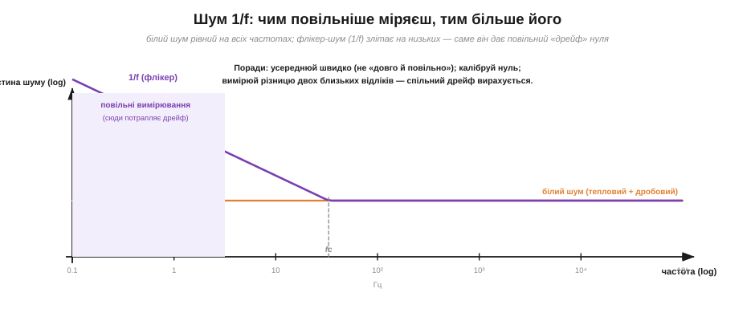

# Дробовий шум і шум 1/f

[Тепловий шум](book:physics/thermal-noise) народжується з **теплового руху** — він є навіть у мертвому резисторі без струму. Але є шуми, що виникають саме тоді, коли **тече струм**, і їхнє коріння — в зовсім іншому факті природи: **заряд дискретний**. [Електричний заряд](book:physics/electric-charge) не розмазаний рівно — струм не є гладкою рідиною, він складається з окремих неподільних порцій-електронів (кожна по e = 1.602×10⁻¹⁹ Кл). А раз так, то й «рівний» струм насправді трохи зернистий: він тремтить просто тому, що зроблений із крапель. Цей зернистий шум називають **дробовим** (*shot noise*). А поряд із ним діє ще один, найзагадковіший і найповільніший, — **шум 1/f**, винуватець того, що дуже повільні вимірювання непомітно «пливуть».

### Дробовий шум: струм — це дощ окремих зарядів

Уявімо струм у новому образі. Ми звикли думати про нього як про рівний потік — стільки-то кулонів за секунду. Але якщо наблизитися «впритул», виявиться, що це радше **дощ окремих крапель**: носії заряду долають якийсь бар'єр (скажімо, p-n перехід у діоді чи транзисторі, або проміжок у вакуумній лампі) **поодинці** й у **випадкові** миті часу. Як краплі дощу по даху: усереднено за секунду їх падає певна кількість (це й є «середній струм»), але **в кожну окрему мить** їх то трохи більше, то трохи менше — стук нерівномірний. Ось ця нерівномірність дощу зарядів і є дробовий шум.


*Рис. Носії заряду долають бар'єр (наприклад, p-n перехід) поодинці й у випадкові миті. Кожен — крихітний «удар» струму. Їхня сума дає рівний у середньому струм, але щомиті він тремтить навколо середнього — це дробовий шум. Чим менший струм (рідший дощ), тим відносно помітніша зернистість.*

Тут важлива тонка, але принципова відмінність від теплового шуму. Тепловий шум був у резисторі **завжди**, навіть без струму, бо його джерело — теплова тряска. Дробовий шум з'являється **лише коли тече струм** і коли носії долають якийсь **бар'єр** поодинці, незалежно один від одного. У звичайному металевому резисторі помітного дробового шуму немає: там електрони рухаються щільним, скорельованим «натовпом», вони весь час штовхають одне одного, тож їхній потік згладжений — окремі «краплі» не видно. А от у **p-n переході** (діод, транзистор) чи у вакуумному проміжку кожен носій долає бар'єр **сам**, як окрема подія, незалежно від сусідів, — і ось тоді зернистість виходить назовні повною мірою. Тому дробовий шум — характерна прикмета саме напівпровідникових переходів і вакуумних приладів, а не «опору взагалі».

Назва «дробовий» (англійською *shot* — «дріб», «постріл») — від образу дробинок, що сиплються поодинці. Її ввів Вальтер Шоттки 1918 року, вивчаючи флуктуації струму у вакуумних лампах, і вона прижилася. Величину дробового шуму, як і теплового, можна порахувати точно — і формула напрочуд схожа за духом:

```
Iш(rms) = √(2 · q · I · B)
```

де q = e — елементарний заряд, I — середній струм, B — смуга частот. Знову бачимо знайомий **квадратний корінь** і знайому **смугу B**: дробовий шум теж «білий» (рівний на всіх частотах) і теж тим більший, чим ширша смуга. Але є важлива тонкість, схована в корені. Сам шумовий струм Iш росте як √I, а **корисний** струм — як I. Тому **відносний** шум (Iш / I) спадає як 1/√I: що більший струм, то він **відносно** тихіший, гладкіший. Слабкі струми зернисті, сильні — гладкі. Це знову та сама статистика великих чисел: коли дощ рясний (мільярди крапель), окрема краплина не помітна; коли рідкий — кожна на слуху.

Цю «гру коренів» варто відчути на числах, бо вона неінтуїтивна. Збільшимо струм у сто разів: корисний сигнал виросте в 100 разів, а шумовий струм — лише в √100 = 10 разів. Відношення сигнал/шум за струмом покращало в 100/10 = 10 разів. Тобто **рясніший дощ зарядів завжди чистіший** — і це фундаментальна, не усувна жодною хитрістю властивість. Звідси й глибокий висновок: щоб надійно полічити **окремі** події (фотони, частинки, електрони), доводиться або набирати їх **багато** (рясний потік — малий відносний шум), або миритися з тим, що при лічених подіях зернистість непереборна. Скажімо, якщо детектор за час вимірювання зловив у середньому 100 квантів, то [природний розкид цього числа](book:math/poisson-statistics) — близько √100 = 10, тобто ±10 %; зловив 10 000 — розкид √10000 = 100, тобто вже лише ±1 %. Точність лічби росте як корінь із числа подій — той самий закон √N, що керує статистикою будь-яких випадкових величин.

> 🔧 **Навіщо це.** Дробовий шум стає головним болем там, де **струми мізерні**: фотодіоди в темряві, вхідні струми чутливих підсилювачів, лічильники окремих частинок. Якщо фотодіод ловить кілька фотонів, кожен народжує лічену кількість електронів — і дробовий шум фундаментально обмежує, наскільки слабке світло можна виміряти. Звідси й практичний хід: де можливо, працюють із **більшим** середнім струмом (рясніший дощ), бо тоді відносний дробовий шум менший. А в цифрових схемах дробовий шум зазвичай не турбує — там струми великі, а сигнали ще більші.

### Шум 1/f: чому повільні вимірювання «пливуть»

Тепловий і дробовий шуми — обидва «білі»: однакові на всіх частотах. Та якщо дуже довго й дуже уважно дивитися на сигнал чутливої схеми на **низьких** частотах — у герцах, частках герца, — виявиться щось дивне. Шуму там виявляється **більше**, ніж на високих, і що нижча частота, то його більше. Це **шум 1/f** (*flicker noise*, «флікер-шум», «мерехтливий шум», іноді «рожевий шум»). Його густина росте обернено пропорційно частоті: удесятеро нижча частота — приблизно вдесятеро більше шуму.


*Рис. Спектри шуму в подвійному логарифмічному масштабі. Білий шум (тепловий + дробовий) — горизонтальна полиця, однакова на всіх частотах. Шум 1/f (флікер) злітає вгору на низьких частотах. Нижче кутової частоти fc він домінує — і саме він потрапляє в зону повільних вимірювань, проявляючись як дрейф нуля.*

Природа 1/f-шуму складніша за дві попередні й досі не зведена до однієї простої формули — це збірна назва для повільних процесів у матеріалі: захоплення й вивільнення носіїв на дефектах кристалічної ґратки, повільні перебудови на межах зерен, дрейф властивостей поверхні. Усі вони мають **довгу пам'ять** — діють у масштабі секунд, хвилин, годин, — і саме тому проявляються на низьких частотах. Практично 1/f-шум зливається з тим, що інженери називають **дрейфом** (*drift*): повільним «спливанням» нуля підсилювача, поступовою зміною показів із часом і температурою. Коли точний прилад, постоявши, починає показувати інший нуль, ніж пів години тому, — це здебільшого 1/f-шум і дрейф.

Дивовижне в 1/f те, **наскільки** він всюдисущий. Закон «густина ∝ 1/f» спостерігають не лише в електроніці: так само «шумлять» розлив річок рік до року, биття серця, гучність музики, коливання курсів, навіть похибка ходу маятникового годинника. Чому той самий закон виринає в геть різних системах — одна з відкритих загадок фізики; єдиної причини, схоже, немає, просто багато різних повільних механізмів дають схожий «рожевий» спектр. Для нас важливий практичний бік: 1/f задає **межу повільної точності**. У будь-якого підсилювача чи давача є **кутова частота** fc, нижче якої 1/f переважає білий шум. Працювати «нижче fc» — означає неминуче мати справу з дрейфом; працювати «вище fc» — означає бачити лише тихий білий шум. Уся стратегія точних повільних вимірювань зводиться до того, щоб **не сидіти в зоні нижче fc** довше, ніж конче треба.

**Приклад (дробовий шум фотодіода).** Фотодіод під слабким світлом дає середній струм I = 1 нА. Скільки дробового шуму в смузі B = 1 кГц?

```
дано:  q = 1.602×10⁻¹⁹ Кл,  I = 1×10⁻⁹ А,  B = 1000 Гц
2qI = 2 × 1.602×10⁻¹⁹ × 1×10⁻⁹ = 3.2×10⁻²⁸
Iш² = 2qI·B = 3.2×10⁻²⁸ × 1000 = 3.2×10⁻²⁵  А²
Iш  = √(3.2×10⁻²⁵) ≈ 5.7×10⁻¹³ А ≈ 0.57 пА (rms)
```

Відносний шум тут Iш/I ≈ 0.57 пА / 1 нА ≈ 0.06 %, тобто струм у наноампер уже досить «гладкий». А якби струм був у тисячу разів менший (1 пА — лічені фотони), відносний дробовий шум зріс би в √1000 ≈ 32 рази, до ~1.8 %, і зернистість стала б серйозною завадою. Знову той самий висновок: рясніший потік — чистіший; рідкий — зернистий.

Звідси найважливіша практична думка про шум 1/f: **не намагайся побороти повільний дрейф «довгим і повільним» усередненням.** Інтуїція підказує протилежне — мовляв, поміряю довше, усереднюся краще. Але для білого шуму це працює, а для 1/f — ні: що довше міряєш, то нижчі частоти захоплюєш, а там 1/f-шуму якраз **більше**. Довге усереднення проти дрейфу — як вичерпувати човен, у якому що довше пливеш, то більша діра.

Правильні ліки інші. По-перше, **частіше калібрувати нуль** — раз у раз вимірювати відому опорну точку й віднімати дрейф. По-друге, вимірювати **різницю** двох близьких у часі відліків (диференційно): повільний дрейф у них майже однаковий і при відніманні зникає. По-третє, переносити корисний сигнал **на вищу частоту**, подалі від 1/f-зони, виміряти там, де панує тихий білий шум, а потім повернути назад (саме так працює прийом «модуляції–демодуляції», або «чопперні» підсилювачі). Спільна ідея всіх трьох: **не давати сигналу затриматися в низькочастотній зоні**, де живе 1/f.

Третій прийом вартий окремого слова, бо він спершу здається парадоксальним: навіщо тягати повільний сигнал на високу частоту й назад? Уявіть, що ви хочете виміряти дуже повільну (майже постійну) величину — а саме на постійці й найближче до неї панує 1/f-шум. Хитрість: швидко «перемикайте» сигнал (модулюйте) — наприклад, по черзі вимірюйте то сам сигнал, то нуль, сотні разів за секунду. Тоді корисна інформація переноситься на частоту перемикання (де білий шум малий), а повільний дрейф підсилювача лишається на місці — на нулі — і легко відокремлюється. Демодулювавши назад, отримуєте чистий повільний сигнал **без** дрейфу підсилювача. Це і є «чоппер» (*chopper*, дослівно «той, що рубає»): сигнал ніби «рубають» на шматки й переносять у тиху зону. Звучить складно, але саме так влаштовані найточніші підсилювачі для давачів — і тепер зрозуміло, **навіщо**: щоб утекти від 1/f.

> 🔧 **Навіщо це.** Будь-яке точне повільне вимірювання — температури, ваги, тиску, постійної напруги — впирається саме в 1/f-шум і дрейф, а не в тепловий шум. Тому терези автоматично «таруються» (калібрують нуль) перед зважуванням, точні вольтметри періодично заглядають у внутрішній еталон, а серйозні підсилювачі для давачів роблять «чопперними». Якщо вимірювання повільне й потребує стабільності хвилинами — головний ворог не теплова «трава», а тихий дрейф 1/f, і боротьба з ним зовсім інша.

**Приклад (де яка домішка головна).** Уявімо три задачі й спитаймо, який шум у кожній домінує:

```
(1) Звуковий підсилювач, смуга 20 Гц–20 кГц, опори десятки кОм:
    → панує ТЕПЛОВИЙ шум (широка смуга, помітні опори); 1/f лише в самому низу.
(2) Фотодіод ловить слабке світло, струм наноампери:
    → панує ДРОБОВИЙ шум (мізерний струм — рідкий дощ зарядів).
(3) Вимірювання постійної напруги з давача раз на секунду, годинами:
    → панує шум 1/f і ДРЕЙФ (наднизькі частоти, довгий час).
```

Три задачі — три різні головні вороги й три різні стратегії: звузити смугу й знизити опір; підняти струм; калібрувати нуль і вимірювати різницю. Уміння наперед сказати, **який шум домінує**, — і є професійний погляд на схему.

> ⚙️ Випадковий шум потрібен не лише для боротьби — його часто доводиться **створювати** (для тестів, моделювання, аудіо-дизерингу). Як із простого рівномірного `rand()` зробити правильний гаусів шум — у вставці [Шум у коді: від rand() до гаусового (Бокс—Мюллер)](book:physics/noise-interference/proj-noise-generator.md). А чому реальні резистори різних типів шумлять по-різному (вуглецеві понад теплову межу, металоплівкові — майже на ній) — у вставці [Шумлять і резистори: вуглецеві проти металоплівкових](comp-resistor-noise.md).

Дробовий шум і шум 1/f, разом із тепловим, вичерпують **внутрішній** шум схеми — той, що народжується в самих компонентах. Він фундаментальний, його не вимкнути жодним екрануванням, але його можна порахувати наперед і утримати під рівнем корисного сигналу. Зовсім інша річ — завади, що приходять **ззовні** (наведення від мережі, радіо, сусідніх кіл): їх ловлять не корінь-формули, а компонування плати й екранування, і боротьба з ними зовсім інша.

---
