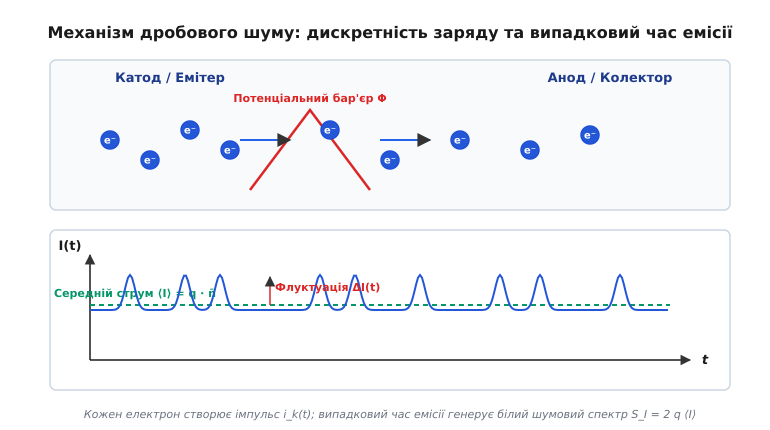
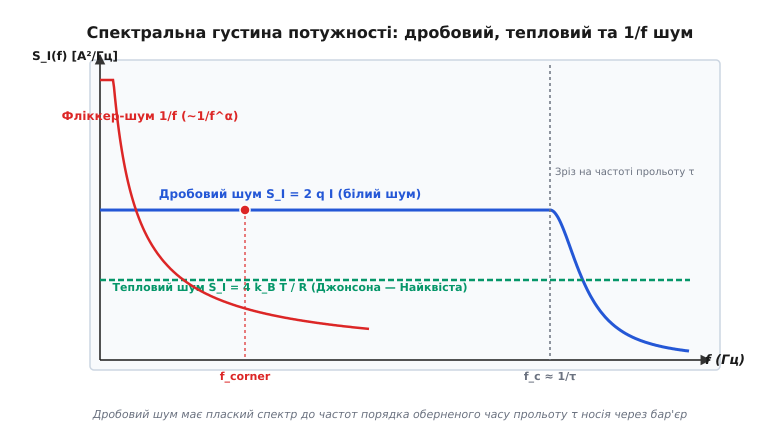
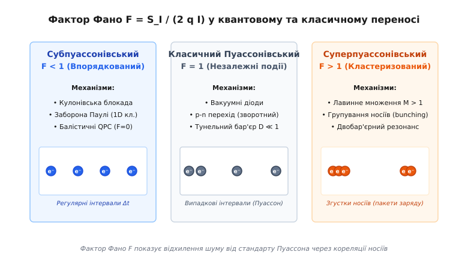
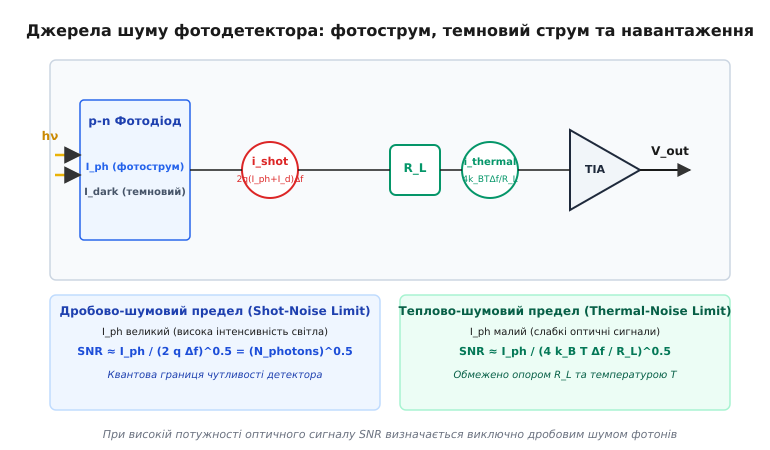

# Дробовий шум

<preknowlist>
- [Дрейф електронів](book:physics/condensed-matter-physics/electron-drift) — перенос заряду носіями та зв'язок з дрейфовою швидкістю.
- [Тепловий шум](book:electronics/analog/thermal-noise) — хаотичні термодинамічні флуктуації напруги й струму в резисторі.
- [Частотний спектр](book:physics/oscillations-waves/frequency-spectrum) — розподіл потужності флуктуацій за частотами.
- [Пуассонівський процес](book:math/poisson-process) — дискретний випадковий процес незалежних подій із постійною середньою інтенсивністю.
</preknowlist>

Коли електричний струм долає потенціальний бар'єр у вакуумному проміжку, напівпровідниковому p-n переході або квантовому тунельному контакті, виміряна величина струму зазнає безперервних спонтанних флуктуацій навколо свого середнього макроскопічного значення. Ці флуктуації виникають не через зовнішні електромагнітні завади, температурну нестабільність джерела чи недосконалість технології виготовлення приладу, а внаслідок фундаментальної квантової властивості матерії: дискретності електричного заряду. Електричний струм у провіднику чи вакуумі не є суцільною неперервною рідиною, а є потоком окремих дискретних носіїв — електронів чи дірок, кожен з яких має строго квантований елементарний заряд `q = 1.602 × 10⁻¹⁹ Кл`. Оскільки емісія частинки з катода чи її подолання потенціального бар'єра є випадковою термодинамічною подією, макроскопічний струм формується як сума безлічі дискретних, хаотично розподілених у часі струмових імпульсів. Це явище називається **дробовим шумом** (від англ. *shot noise*, за аналогією зі звуком падіння свинцевого дробу на металевий щит або крапель зливи на дах).

У стані термодинамічної рівноваги, коли до системи не прикладено зовнішнього електричного поля і середній струм дорівнює нулю (`⟨I⟩ = 0`), дробовий шум повністю відсутній. У рівноважному провіднику хаотичний рух носіїв створює лише тепловий шум (шум Джонсона — Найквіста), який виникає внаслідок теплових коливань електронів та атомів кристалічної ґратки і визначається температурою `T` та опором `R`. Проте щойно до потенціального бар'єра прикладається зовнішня напруга і через пристрій починає протікати постійний нерівноважний струм (`⟨I⟩ > 0`), базова симетрія зустрічних теплових потоків порушується. До рівноважного теплового шуму додається нерівноважний дробовий шум. На відміну від теплового шуму, спектральна потужність класичного дробового шуму прямо пропорційна величині середнього струму `⟨I⟩` і практично не залежить від температури середовища при пуассонівському переносі.

## Фізичний механізм дискретності носіїв та походження флуктуацій

Щоб зрозуміти мікроскопічний механізм виникнення дробового шуму, розглянемо модель двох провідних електродів, розділених потенціальним бар'єром. Це може бути вакуумний проміжок у діоді, деплеційна область у p-n переході, шар діелектрика у тунельному контакті або квантова точка у наноструктурі. Провідники містять колосальну кількість вільних електронів, які перебувають у постійному хаотичному тепловому русі з розподілом за енергіями Фермі — Дирака чи Максвелла — Больцмана.

Лише ті електрони, чия кінетична енергія в напрямку бар'єра перевищує його висоту `Φ`, здатні подолати потенціальний бар'єр і потрапити на протилежний електрод. Оскільки теплові коливання носіїв та їхні зіткнення з фононами й домішками є хаотичними, проходження кожного окремого електрона через бар'єр є статистично незалежною подією. Ймовірність подолання бар'єра в будь-якому короткому інтервалі часу `Δt` є постійною величиною, а моменти емісії `t_k` утворюють класичний пуассонівський процес.


*Дискретність носіїв заряду q та випадкові моменти подолання бар'єра утворюють хаотичну послідовність струмових імпульсів i_k(t), викликаючи флуктуації ΔI(t) навколо середнього значення ⟨I⟩.*

Кожен електрон із зарядом `q`, перетинаючи міжелектродний простір, наводить у зовнішньому колі елементарний імпульс струму `i_1(t)` тривалістю `τ_tr` (час прольоту частинки через бар'єр). Згідно з теоремою Шокли — Рамо для наведеного заряду, часовий інтеграл від прямокутного чи згладженого імпульсу струму одиночної частинки строго дорівнює переносу її елементарного заряду:

```
∫ i_1(t) dt = q     [інтеграл від -∞ до +∞]
```

Макроскопічний струм `I(t)` у будь-який момент часу дорівнює простому підсумовуванню імпульсів від усіх електронів, що вилетили раніше:

```
I(t) = ∑ i_1(t - t_k)
```

Через випадковий розподіл моментів вильоту `t_k` сумарний струм постійно відхиляється від свого середнього значення: `ΔI(t) = I(t) - ⟨I⟩`. 

Якщо усереднити кількість частинок `N`, які перетнули бар'єр за час спостереження `t_obs`, середня величина постійного струму дорівнює:

```
⟨I⟩ = q · n̄ = q · (⟨N⟩ / t_obs)
```

де `n̄ = ⟨N⟩ / t_obs` — середня кількість електронів, що емітуються за одну секунду. Згідно зі властивостями пуассонівського розподілу для статистично незалежних подій, дисперсія кількості частинок `Var(N) = ⟨(N - ⟨N⟩)²⟩` строго дорівнює їхньому математичному сподіванню: `Var(N) = ⟨N⟩`. Саме ця фундаментальна рівність між дисперсією флуктуацій та середньою кількістю носіїв визначає математичну природу класичного дробового шуму.

При розгляді нерівноважного стану важливо підкреслити зв'язок між прикладеною напругою `V` та термодинамічною температурою `T`. Коли напруга на бар'єрі є малій (`q V ≪ k_B T`), прямому та зворотному потокам носіїв відповідають майже однакові пуассонівські швидкості. Сума флуктуацій двох протилежних потоків при цьому дає чисто рівноважний тепловий шум Найквіста `S_I = 4 k_B T G`. Однак коли напруга стає великою (`q V ≫ k_B T`), зворотний потік носіїв стає неможливим через високий потенціальний зсув. У цьому випадку залишається лише один спрямований потік електронів, і флуктуації повністю переходять у нерівноважний дробовий шум Шотткі `S_I = 2 q ⟨I⟩`.

Універсальний зв'язок між тепловим та дробовим шумом у тунельному контакті описується нерівноважною формулою кросовера:

```
S_I = 2 · q · ⟨I⟩ · coth(q · V / (2 · k_B · T))
```

При `q V ≪ k_B T` функція гіперболічного котангенса наближається до `coth(x) ≈ 1/x`, що підставляє у вираз `S_I = 2 q I · (2 k_B T / q V) = 4 k_B T (I / V) = 4 k_B T G` — класичний тепловий шум. При `q V ≫ k_B T` значення `coth(x) → 1`, вираз перетворюється на чисту формулу Шотткі `S_I = 2 q ⟨I⟩`.

Докладний аналіз внеску німецького дослідника у розкриття цього фізичного принципу наведено у матеріалі [Вальтер Шотткі та відкриття дробового шуму](book:physics/condensed-matter-physics/shot-noise/hist-schottky.md).

## Формула Шотткі, теорема Карсона та спектральні властивості

Головною кількісною характеристикою флуктуаційних процесів у фізиці конденсованого стану є одностороння спектральна густина потужності флуктуацій струму `S_I(f)`, яка вимірюється в `А²/Гц` і описує розподіл середньоквадратичної шумової напруги чи струму в одиничній смузі частот (1 Гц).

Для пуассонівського потоку незалежних носіїв заряду Вальтер Шотткі у 1918 році вивів фундаментальне співвідношення, що отримало назву **формули Шотткі**:

```
S_I(f) = 2 · q · ⟨I⟩
```

де `q` — величина заряду носія (`1.602 × 10⁻¹⁹ Кл` для електрона), `⟨I⟩` — середня величина постійного струму через пристрій.

Середньоквадратичне значення шумового струму `i_n` у довільній робочій смузі частот `Δf` обчислюється як:

```
i_n = √(S_I · Δf)
    = √(2 · q · ⟨I⟩ · Δf)
```

Розглянемо ключові спектральні та інженерні властивості формули Шотткі:

1. **Плаский спектр (білий шум).** Вираз `S_I = 2 q ⟨I⟩` взалі не містить частоти `f`. Це означає, що на низьких і середніх частотах спектральна густина дробового шуму є абсолютно постійною величиною. Дробовий шум являє собою класичний приклад білого шуму.

2. **Лінійна залежність від постійного струму.** Потужність шуму зростає строго пропорційно величині протікаючого струму `⟨I⟩`. При припиненні струму (`⟨I⟩ = 0`) дробовий шум повністю зникає.

3. **Чутливість до величини ефективного заряду `q`.** Якщо перенос заряду здійснюється не поодинокими електронами, а згрупованими носіями з зарядом `q = M · e` (наприклад, лавинними згустками) або куперівськими парами `q = 2 e`, шумова потужність пропорційно зростає. Навпаки, у системах із дробовими квазічастинками `q = e/3` шумова потужність спадає.


*Порівняння спектральної густини потужності дробового шуму S_I = 2 q I, теплового шуму S_I = 4 k_B T / R та фліккер-шуму 1/f у залежності від частоти f.*

Плаский спектр формули Шотткі зберігається до тих частот, поки період коливань сигналу `T = 1/f` залишається суттєво більшим за тривалість прольоту частинки `τ_tr` через потенціальний бар'єр. Згідно з теоремою Карсона, при досягненні граничної частоти прольоту `f_c ≈ 1 / (2 π τ_tr)` спектральна густина шуму починає спадати за законом `1 / f²` внаслідок згладжування імпульсів наведеного струму:

```
S_I(f) = 2 · q · ⟨I⟩ · [sin(π · f · τ_tr) / (π · f · τ_tr)]²
```

Математичний вивід теореми Карсона та обчислення частотного зрізу наведено у довіднику [Теорема Карсона та спектральна густина дробового струму](book:physics/condensed-matter-physics/shot-noise/math-carson-theorem.md).

## Порівняльний аналіз фундаментальних джерел шуму у твердих тілах

У будь-якому реальному електронному пристрої одночасно діють три фундаментальні типи фізичних шумів: тепловий (Джонсона — Найквіста), дробовий (Шотткі) та фліккер-шум (шум `1/f`). Для вибору оптимального режиму підсилення та діагностики схем необхідно розрізняти їхні властивості.

| Характеристика | Тепловий шум (Johnson — Nyquist) | Дробовий шум (Schottky) | Фліккер-шум (1/f noise) |
| :--- | :--- | :--- | :--- |
| **Фізична причина** | Хаотичні теплові коливання носіїв у провіднику | Дискретність заряду та випадковий проліт бар'єра | Перехоплення носіїв дефектами та дифузія |
| **Термодинамічний стан** | Рівноважний стан (присутній навіть при `I = 0`) | Нерівноважний стан (потребує струму `I > 0`) | Нерівноважний протікаючий струм |
| **Формула спектра** | `S_I = 4 · k_B · T / R` | `S_I = 2 · q · I · F` | `S_I = K · I^α / f^β` (де `α≈1..2, β≈1`) |
| **Залежність від T** | Прямо пропорційна температурі `T` | Практично не залежить від `T` (при `F=1`) | Складна температурна залежність |
| **Залежність від f** | Білий шум (до `f ≈ k_B T / h ~ 10¹² Гц`) | Білий шум (до частот прольоту `f_c ≈ 1/τ`) | Рожевий шум (падіння `1/f` з частотою) |
| **Типові елементи** | Омічні резистори, провідні канали | p-n переходи, діоди, фотодетектори | Межі розділу діелектрик-напівпровідник |

Головний фізичний критерій розрізнення полягає у термодинамічній рівноважності: тепловий шум існує у будь-якому провіднику з опором `R` без зовнішнього джерела живлення, тоді як дробовий шум виникає лише тоді, коли через потенціальний бар'єр протікає постійний нерівноважний струм `⟨I⟩`.

Взаємодія цих трьох джерел шуму визначає загальний шумовий профіль будь-якої схеми. На низьких частотах, де домінує фліккер-шум `1/f`, спектральна густина спадає з ростом частоти. На середніх частотах фліккер-шум стає меншим за рівень білого шуму, утворюючи так зване плато. На високих частотах, що перевищують обернений час прольоту частинки чи макроскопічні RC-постійні кола, спектральна густина шуму починає спадати.

## Фактор Фано, кореляції носіїв та квантовий режим переносу

У квантових наноструктурах та мікроскопічних провідниках електрони рухаються не абсолютно незалежно. Міжелектронне кулонівське відштовхування, квантова заборона Паулі для ферміонів або лавинні іонізаційні процеси створюють часові кореляції між емісіями носіїв. Для кількісного опису відхилення реального шуму від пуассонівської межі Шотткі вводиться безрозмірний **фактор Фано** `F`:

```
F = S_I / (2 · q · ⟨I⟩)
  = Var(N) / ⟨N⟩
```

Фактор Фано дорівнює відношенню виміряної спектральної густини шуму до класичного теоретичного значення `2 q ⟨I⟩`. За величиною фактора Фано всі фізичні системи поділяються на три класи:


*Три класи статистичного переносу заряду: Субпуассонівський (F < 1), Пуассонівський (F = 1) та Суперпуассонівський (F > 1).*

### 1. Пуассонівський перенос (`F = 1`)
Відповідає класичним статистично незалежним подіям. Спостерігається у вакуумних діодах у режимі температурного насичення, у тунельних контактах з низькою прозорістю бар'єра (`D ≪ 1`) та у зворотній гілці напівпровідникових p-n діодів.

### 2. Субпуассонівський перенос (`F < 1`)
Шум є пригніченим порівняно зі стандартом Шотткі внаслідок негативних часових кореляцій між носіями (носії «відштовхують» один одного, вирівнюючи часові інтервали):
- **Заборона Паулі у балістичних квантових каналах.** У одновимірних квантових точкових контактах (QPC) два ферміони не можуть перебувати в одному квантовому стані. Згідно з формулою Ландауера — Бюттікера, у повністю відкритому квантовому каналі з прозорістю `T_n = 1` дробовий шум повністю зникає (`F = 0`). Загальна виразовість для шуму в квантовому каналі при `T = 0` становить:

```
S_I = 2 · (e³ · V / h) · ∑ T_n · (1 - T_n)
```

- **Кулонівська блокада у квантових точках.** Наявність електрона на малій провідній острівцевій структурі створює електростатичний потенціал, який блокує тунелювання наступного електрона доти, доки перший не залишить острівець. Це стабілізує інтервали часу між прольотами, даючи `F ≈ 0.5`.
- **Вплив об'ємного заряду у вакуумних лампах.** Негативний просторовий заряд у вакуумному діоді гальмує виліт нових електронів, зменшуючи фактор Фано до `F ≈ 0.05...0.1`.
- **Дифузійне пригнічення у брудних мезоскопічних провідниках.** У мезоскопічному провіднику, де довжина вільного пробігу є меншою за довжину провідника, випадкові багаторазові розсіяння електронів у поєднанні із забороною Паулі приводять до універсального значення фактора Фано `F = 1/3`.

### 3. Суперпуассонівський перенос (`F > 1`)
Шум підсилено порівняно з пуассонівською межею через додатні кореляції або згрупованість (bunching) носіїв у пакети charges:
- **Лавинне множення.** У лавинних фотодіодах (APD) первинний електрон викликає ударну іонізацію, створюючи лавину з `M` вторинних частинок. Оскільки коефіцієнт підсилення `M` є випадковим, фактор Фано дорівнює `F = M · F_excess > 1`.
- **Резонансне тунелювання.** Наявність локалізованого стану між двома бар'єрами викликає затримку та виклик носіїв згустками, що збільшує шум до `F ≈ 2...3`.
- **Андрєєвське віддзеркалення.** На межі між надпровідником та нормальним металом (S-N контакт) електрон переносить заряд `q = 2 e` у вигляді куперівської пари, що подвоює фактор Фано до `F = 2`.

Практична реалізація симулятора Монте-Карло для обчислення фактора Фано в усіх трьох режимах наведена у проектному матеріалі [Числове моделювання дробового шуму та фактора Фано](book:physics/condensed-matter-physics/shot-noise/proj-shot-noise-sim.md).

## Дробовий шум у напівпровідникових та оптоелектронних приладах

У твердотільній електроніці та оптоелектроніці дробовий шум виникає в усіх компонентах, де носії заряду подолають потенціальні бар'єри або рекомбінують.

### 1. Напівпровідникові діоди та p-n переходи
У прямозміщеному p-n переході струм описується рівнянням Шокли `I = I_s · (exp(q V / k_B T) - 1)`. Прямий струм складається з двох протилежних пуассонівських потоків: інжекційного струму через бар'єр `I_inj = I_s · exp(q V / k_B T)` та струму витоку `I_rec = I_s`.

Оскільки обидва потоки є статистично незалежними, їхні шумові спектральні густини додаються:

```
S_I = 2 · q · I_inj + 2 · q · I_rec
    = 2 · q · (I + 2 · I_s)
```

При великому прямому зсуві (`I ≫ I_s`) маємо стандартний дробовий шум `S_I = 2 q I`. При нульовому зсуві (`I = 0`) отримуємо `S_I = 4 q I_s = 4 k_B T G_0`, що точно відповідає рівноважному тепловому шуму діода за співвідношенням Ейнштейна.

### 2. Фотодіоди та оптоелектронні фотоприймачі
У p-n або PIN фотодіодах дробовий шум генерується як фотострумом `I_ph` (згенерованим падаючим світлом), так і темновим струмом `I_dark`.


*Еквівалентна шумової схема p-n фотодіода: джерело дробового шуму фотоструму та темнового струму i_shot², джерело теплового шуму навантаження i_thermal² та порівняння двох режимів чутливості.*

При високій інтенсивності освітлення фотоприймач переходить у **дробово-шумовий предел (Shot-Noise Limit)**, у якому відношення сигнал/шум визначається кількістю падних фотонів: `SNR = η · N_ph`. Це квантова границя чутливості, перевищити яку в класичній оптиці неможливо.

Детальний аналіз шумових моделей фотодіодів, лавинних APD та трансімпедансних підсилювачів наведено у прикладній вставці [Шум фотодетекторів та p-n переходів](book:physics/condensed-matter-physics/shot-noise/comp-photodetector-noise.md).

## Експериментальні застосування та квантові вимірювання

У сучасній фізиці конденсованого стану дробовий шум використовується як унікальний спектроскопічний інструмент, що дозволяє вимірювати мікроскопічні характеристики носіїв без руйнування системи.

### 1. Вимірювання ефективного заряду квазічастинок
Вимірюючи фактор Фано `F = S_I / (2 q I)`, фізики можуть прямо визначити заряд `q` носіїв:
- **Куперівські пари у надпровідниках.** У тунельних контактах між надпровідником і нормальним металом (N-S контакти) при андрєєвському віддзеркаленні заряд переноситься парами. Виміряний дробовий шум дав значення заряду `q = 2 e`.
- **Дробовий квантовий ефект Холла (FQHE).** У 1997 році Крістіан Глаттлі та Мордехай Хейблум провели вимірювання дробового шуму у двовимірному електронному газі в режимі квантового ефекту Холла при плато з фактором заповнення `ν = 1/3`. Виміряний дробовий шум дав значення заряду квазічастинок `q = e/3`, а пізніше — `q = e/5`, що стало остаточним доказом існування еніонів із дробовою статистикою.

### 2. Шумова термометрія (Shot Noise Thermometry)
Оскільки спектральна густина шуму в тунельному контакті описується універсальною кросоверною формулою `S_I = 2 q I · coth(q V / 2 k_B T)`, вимірювання форми вольт-шумової характеристики дозволяє прямо визначити абсолютну температуру `T` в кельвінах без використання зовнішнього калібрування. Цей метод застосовується у кріогенній фізиці при температурах нижче 1 K.

### 3. Квантова оптика та стиснутий світловий шум (Squeezed Light)
У класичній оптиці дробовий шум фотонів створює стандартну квантову межу (Standard Quantum Limit, SQL). Використовуючи параметричні нелінійні кристали, фізики генерують квантово-стиснуте світло (Squeezed Light), у якому флуктуації однієї з фазових квадратур пригнічуються нижче рівня дробового шуму (`F < 1`). Ця технологія застосовується в інтерферометрах LIGO для реєстрації гравітаційних хвиль.

> 🔧 **Навіщо це.**
> Розуміння фізики дробового шуму є критичним при розробці сучасних високошвидкісних та надчутливих пристроїв:
> - **У матрицях фотокамер (CMOS/CCD):** дробовий шум фотонів визначає динамічний діапазон (Dynamic Range) та максимальне відношення сигнал/шум сенсора при гарному освітленні.
> - **У волоконно-оптичних лініях зв'язку:** дробовий шум фотодіодів приймача визначає граничну швидкість передачі даних та коефіцієнт помилок (BER).
> - **У квантових обчисленнях:** вимірювання дробового шуму в зчитувальних колах кубітів дозволяє оцінити час декогеренції та прозорість квантових каналів зчитування.
