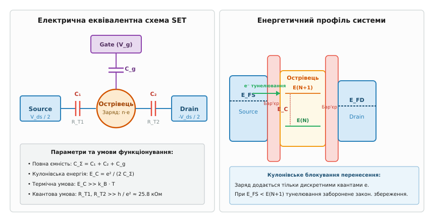
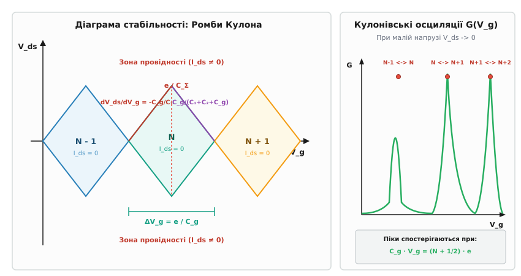
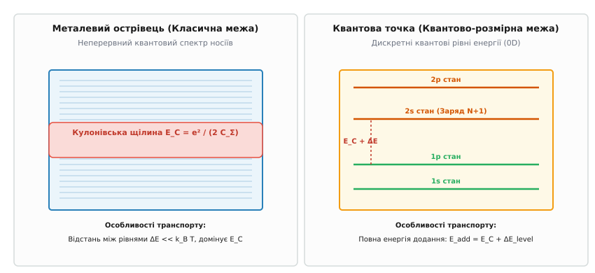

# Одноелектронний транзистор (SET)

<preknowlist>
- [Квантові точки](book:physics/condensed-matter-physics/quantum-dot) — розмірне квантування електронів у вестибулах малого об'єму та формування дискретного енергетичного спектра.
- [Двовимірний електронний газ (2DEG)](book:physics/condensed-matter-physics/two-dimensional-electron-gas) — утворення високорухливого двовимірного газу носіїв на гетеромежі GaAs/AlGaAs для балістичного транспорту.
- [Напівпровідникові гетеропереходи та співвідношення Крьомера](book:physics/condensed-matter-physics/heterojunction) — енергетичні розриви зон та створення тунельних потенціальних бар'єрів.
</preknowlist>

При зменшенні класичного польового транзистора до нанометрових розмірів безперервна макроскопічна модель електричного струму втрачає чинність. Коли провідний канал скорочується до декількох десятків атомів, опір та ємність пристрою перестають описувати неперервне середовище, а електричний заряд переноситься не плавною рідиною носіїв, а дискретними квантами — поодинокими електронами. Електростатичне відштовхування між електронами на малій ділянці провідника створює нездоланний енергетичний бар'єр, який блокує тунелювання носіїв при низьких напругах.

Фізичним втіленням цього граничного квантового режиму є **одноелектронний транзистор** (*Single-Electron Transistor, SET*) — трьохконтактний наноструктурний пристрій, у якому електричний струм між витоком і стоком контролюється перенесенням строго одного електрона на центральний квантовий острівець за допомогою ємнісно зчепленого керувального затвора.

## 1. Конструкція, ємнісна модель та кулонівська блокада

Фундаментальною основою одноелектронного транзистора є квантовий або металевий острівець (*island*) — ізольований провідний регіон малого об'єму, підключений до двох зовнішніх електродів (витоку `Source` та стоку `Drain`) через надтонкі діелектричні тунельні бар'єри. Третій електрод — керувальний затвор (*Gate*) — з'єднаний з острівцем виключно через ємнісне зчеплення без можливості тунельного проходження електронів.


*Принцип побудови одноелектронного транзистора (ліворуч) та потенціальний профіль з кулонівською щілиною E_C (праворуч).*

Кожен із двох тунельних переходів характеризується тунельною ємністю (`C₁` та `C₂`) та тунельним опором (`R_T1` та `R_T2`). Якщо позначити ємність керувального затвора як `C_g`, а паразитичну ємність середовища як `C_p`, то повна електростатична ємність острівця `C_Σ` дорівнює сумі всіх паралельних ємностей:

```
C_Σ = C₁ + C₂ + C_g + C_p
```

Коли один електрон із зарядом `e = 1.602·10⁻¹⁹` Кл тунелює на нейтральний острівець, електростатичний потенціал острівця стрибкоподібно змінюється на величину `Δφ = e / C_Σ`. Робота, яку необхідно виконати проти власного електричного поля острівця для додавання одного додаткового електрона, називається **кулонівською заряджальною енергією** (*Coulomb charging energy*) `E_C`:

```
E_C = e² / (2·C_Σ)      [кулонівська енергетична щілина]
```

Фізичний зміст кулонівської енергії полягає в тому, що кожен інжектований електрон створює електростатичний потенційний бар'єр для всіх наступних носіїв. Додавання електрона вимагає зміщення енергетичних рівнів острівця на величину `2·E_C`. Для того щоб кулонівська енергія `E_C` могла контролювати тунелювання поодиноких носіїв і не розмивалася зовнішніми збуреннями, мають одночасно виконуватися дві фундаментальні фізичні умови.

### Перша умова: Термічна стабільність

Термічна кінетична енергія хаотичного руху електронів у провідниках `k_B · T` (де `k_B` — стала Больцмана, `T` — абсолютна температура) створює розмиття Фермі-розподілу носіїв за енергіями. Якщо термічні флуктуації порівнянні з заряджальною енергією, електрони отримують достатньо енергії для термоемісійного або тунельного подолання кулонівського бар'єра без прикладання зовнішньої напруги. Строга умова придушення термічного розмивання вимагає:

```
k_B · T << E_C
T << e² / (2·k_B · C_Σ)      [верхня температурна межа]
```

Для макроскопічних об'єктів із розмірами близько 1 мікрометра ємність становить `C_Σ ≈ 1` пікофарада (`10⁻¹²` Ф), що дає кулонівську енергію `E_C ≈ 10⁻⁷` еВ. Така енергія відповідає температурам близько 1 мікрокельвіна, що робить кулонівську блокаду неспостережуваною. Проте при звуженні острівця до 100 нанометрів ємність знижується до фемтофарадного масштабу (`C_Σ ≈ 1` фФ), піднімаючи кулонівську енергію до `E_C ≈ 1` меВ (`T_C ≈ 10` Кельвінів). Для спостереження чіткої кулонівської блокади в металевих пристроях експеримент проводять у розчинних кріостатах при температурах нижче 300 мілікельвінів (0.3 К).

### Друга умова: Квантово-механічна локалізація заряду

Навіть якщо температура прямує до абсолютного нуля (`T -> 0`), квантова механіка припускає флуктуації заряду через принцип невизначеності Гейзенберга для енергії та часу:

```
ΔE · Δt ≥ ℏ / 2
```

Час перебування електрона на острівці `Δt` визначається часовою сталою розрядки тунельного контакту `τ_RC = R_T · C_Σ`, де `R_T` — тунельний опір бар'єра. Величина квантової флуктуації енергії острівця через тунельне розмивання дорівнює:

```
ΔE ≈ ℏ / (R_T · C_Σ)
```

Щоб квантові флуктуації заряду не розмивали кулонівську щілину `E_C`, необхідно виконати співвідношення `ΔE << E_C`:

```
ℏ / (R_T · C_Σ) << e² / (2·C_Σ)
R_T >> 2·ℏ / e²
R_T >> R_q = h / e² ≈ 25812.8 Ом      [квант опору фон Клітцинга]
```

Отже, тунельний опір кожного з бар'єрів `R_T` повинен суттєво перевищувати фундаментальний квант опору `R_q ≈ 25.8` кОм. Фізично це означає, що хвильова функція електрона на острівці повинна бути слабко зв'язана з хвильовими функціями електронів у витоку та стоку. Якщо `R_T < R_q`, електрони делокалізуються, хвильові функції проникають крізь бар'єри, і квантове ко-тунелювання знищує кулонівську блокаду навіть при нульовій температурі.

За одночасного дотримання обох умов при малій зовнішній напрузі між витоком і стоком `V_ds < e / C_Σ` електрон не має достатньої енергії для переходу на острівець. Струм через пристрій стає тотожно рівним нулю `I_ds = 0`. Це явище називається **кулонівською блокадою** (*Coulomb Blockade*). Історію теоретичного передбачення та перших експериментальних випробувань цього ефекту викладено в [історії відкриття кулонівської блокади та перших одноелектронних транзисторів](book:physics/condensed-matter-physics/single-electron-transistor/hist-coulomb-blockade.md).

## 2. Керування затвором та кулонівські осциляції провідності

Головна відмінність одноелектронного транзистора від ізольованого тунельного контакту полягає у наявності керувального затвора. Потенціал затвора `V_g` дозволяє неперервно змінювати початковий електростатичний потенціал острівця.

Оскільки затвор з'єднаний із острівцем лише ємнісно, напруга `V_g` індукує на острівці безперервний (недискретний) ефективний заряд затвора `n_g`:

```
n_g = C_g · V_g / e      [індукована безрозмірна напруга затвора]
```

Польна електростатична вільна енергія острівця `F(n)` як функція кількості надлишкових електронів `n` описується квадратичною залежністю:

```
F(n) = E_C · (n - n_g)²      [зарядова вільна енергія Гіббса]
```

Графік вільної енергії являє собою серію парабол, зміщених одна відносно одної вздовж осі `n_g`. Точки перетину сусідніх парабол відповідають умовам виродження енергетичних станів.

```
       Вільна енергія F(n)
          │    \     /     \     /     \     /
          │     \n=0/       \n=1/       \n=2/
          │      \ /         \ /         \ /
          │       ✕           ✕           ✕   <-- Точки виродження (n_g = N + 1/2)
          └───────┼───────────┼───────────┼────────> Індукований заряд n_g
                 0.5         1.5         2.5
```

Коли індукований заряд затвора набуває цілих значень (`n_g = 0, 1, 2, ...`), стан із відповідною кількістю електронів `n = n_g` має мінімальну енергію. Для переходу в стан `n + 1` необхідно подолати повну кулонівську енергетичну щілину `E_C`. Струм блокується.

Проте коли напруга затвора налаштована так, що індукований заряд стає півцілим числом:

```
n_g = N + 1/2
V_g^(N) = (N + 1/2) · e / C_g      [умова виродження]
```

енергії двох сусідніх зарядових станів `F(N)` та `F(N + 1)` стають строго однаковими: `F(N + 1) - F(N) = 0`. Кулонівська енергетична щілина зникає, і електрон може вільно тунелювати з витоку на острівець і далі на стік навіть при як завгодно малій напрузі `V_ds -> 0`.

При плавній зміні напруги затвора `V_g` провідність транзистора `G = dI_ds / dV_ds` демонструє серію періодичних гострих піків, розділених широкими зонами нульової провідності. Ці коливання називаються **кулонівськими осциляціями провідності** (*Coulomb Conductance Oscillations*).

Період кулонівських осциляцій по напрузі затвора `ΔV_g` є строго постійною величиною, що визначається ємністю затвора `C_g`:

```
ΔV_g = e / C_g      [період осциляцій затвора]
```

Вимірявши період осциляцій `ΔV_g`, можна з прецизійною точністю обчислити ємність затвора наноструктури: `C_g = e / ΔV_g`. Повний математичний розрахунок енергетичного балансу та стаціонарних швидкостей тунелювання наведено у [математичному виведенні електростатичної енергії та меж стабільності](book:physics/condensed-matter-physics/single-electron-transistor/math-coulomb-diamonds.md).

Форма піків провідності при скінченній температурі описується формулою Бінакера (*Beanakker formula*):

```
G(V_g) = (G_max / 4) · cosh⁻² ((e · C_g · (V_g - V_g^(N))) / (2 · C_Σ · k_B · T))
```

Ширина піку на піввисоті пропорційна термічній енергії `k_B · T / e`, а амплітуда піку обмежена тунельним опором переходів `G_max ≈ e² / (4 · k_B · T · (R_T1 + R_T2))`.

## 3. Діаграма стабільності: Ромби Кулона (Coulomb Diamonds)

Коли до одноелектронного транзистора прикладають скінченну напругу між витоком і стоком `V_ds ≠ 0`, Фермі-рівні витоку та стоку розсуваються на величину `e · V_ds`. Це створює «енергетичне вікно» транспорту, що дозволяє електронам тунелювати навіть тоді, коли напруга затвора трохи відхиляється від точки точного виродження `n_g = N + 1/2`.

Двовимірний графік диференціальної провідності `G(V_g, V_ds)` або струму `I_ds(V_g, V_ds)` у площині двох напруг називається **діаграмою стабільності заряду** (*charge stability diagram*).


*Діаграма стабільності (ліворуч): області заблокованого струму у формі ромбів Кулона на площині (V_g, V_ds) та осциляції провідності G(V_g) при малій напрузі витік-стік (праворуч).*

На цій діаграмі області, де струм блокується (`I_ds = 0`), утворюють характерні геометричні фігури у формі ромбів — **ромби Кулона** (*Coulomb Diamonds*).

### Анатомія та геометричні властивості ромбів Кулона:

1. **Області всередині ромбів (зони стабільності):** Всередині кожного ромба кількість електронів `N` на острівці є строго фіксованою цілочисельною величиною. Електростатичний потенціал острівця знаходиться всередині кулонівської щілини, тому тунелювання заборонене законом збереження енергії.
2. **Вершини ромбів при `V_ds = 0`:** Вершини, у яких ромби торкаються осі `V_ds = 0`, відповідають точкам виродження `n_g = N + 1/2`. Саме в цих точках спостерігаються піки кулонівських осциляцій провідності.
3. **Верхні та нижні вершини ромбів (Максимальна висота `V_ds^(max)`):** При збільшенні напруги `V_ds` енергетичне вікно досягає величини кулонівської щілини. Максимальна напруга витік-стік, при якій струм усе ще залишається заблокованим у центрі ромба, дорівнює:

```
V_ds^(max) = e / C_Σ      [висота ромба Кулона]
```

Вимірявши висоту ромба по осі напруги витік-стік, визначають повну ємність острівця: `C_Σ = e / V_ds^(max)`.

4. **Наклони бокових граней ромбів:** Межі ромбів утворюються чотирма прямими лініями, які відповідають умовам, коли один із хімічних потенціалів острівця збігається з Фермі-рівнем витоку або стоку. Наклони граней визначаються співвідношенням ємностей:

```
dV_ds / dV_g |_(Source) = - C_g / (C₂ + C_g)      [ліва верхня межа]
dV_ds / dV_g |_(Drain)  =   C_g / (C₁ + C_g)      [права верхня межа]
```

Вимірювання повної геометрії ромбів Кулона дає повний набір електростатичних параметрів пристрою (`C₁`, `C₂`, `C_g`, `C_Σ` та `E_C`) без використання будь-яких підганяльних параметрів.

Чисельну модель побудови карти стабільності ромбів Кулона та розрахунок Вольт-Амперних характеристик на основі кінетичного рівняння балансу наведено в [чисельній симуляції діаграми стабільності ромбів Кулона](book:physics/condensed-matter-physics/single-electron-transistor/proj-coulomb-diamond-sim.md).

## 4. Фізичні платформи: від металевих острівців до квантових точок

Одноелектронні транзистори виготовляють на основі кількох принципово різних матеріальних платформ, кожна з яких має свої фізичні особливості.


*Енергетичні рівні транспорту: суто кулонівська блокада в класичному металевому острівці (ліворуч) та комбінація кулонівської енергії E_C із квантово-розмірним інтервалом ΔE у квантовій точці (праворуч).*

### 1. Металеві острівці (Al / Al₂O₃ / Al)
Історично перші SET створювалися на основі тонких плівок алюмінію за допомогою технології двокутової тіньової евапорації Долана.
- **Особливості:** Металевий острівець містить мільйони вільних електронів, тому відстань між квантово-розмірними рівнями енергії в металі є нескінченно малою порівняно з кулонівською енергією: `ΔE_level << E_C`.
- **Енергетика:** Транспорт визначається суто класичною електростатичною заряджальною енергією `E_C`.
- **Обмеження:** Малий розмір кулонівської щілини (`E_C < 1` меВ) вимагає охолодження до кріогенних температур розчинних кріостатів (`T < 300` мК).

### 2. Напівпровідникові квантові точки у 2DEG (GaAs / AlGaAs)
Створюються шляхом нанесення металевих збіднювальних затворів на поверхню гетероструктури з двовимірним електронним газом. Негативний потенціал на затворах «видавлює» електрони, формуючи ізольовану квантову точку (*0D квантовий резонатор*).
- **Особливості:** Кількість електронів на такій квантовій точці можна плавно зменшити до нульового значення (`N = 0`).
- **Енергетика:** Завдяки малій ефективній масі електронів у GaAs (`m* ≈ 0.067 m_e`), відстань між дискретними рівнем квантування `ΔE_level` стає співмірною з кулонівською енергією `E_C`.
- **Повна енергія додавання:** Для переходу електрона на квантову точку необхідно витратити повну енергію додавання `E_add`:

```
E_add = E_C + ΔE_level      [енергія додавання в квантовій точці]
```

Це призводить до того, що ромби Кулона набувають різної висоти залежно від того, чи заповнюється нова електронна оболонка (аналог періодичної системи елементів у штучному атомі). При непарній кількості електронів на квантовій точці та низьких температурах виникає резонансне спінове тунелювання — **ефект Кондо в квантових точках**, що приводить до появи аномального піку провідності в центрі заблокованого ромба при `V_ds = 0`.

### 3. Кремнієві наноструктури (Silicon-on-Insulator, SOI)
Використовують кремнієві нанодроти або квантові точки, сформовані на підкладках «кремній на ізоляторі».
- **Переваги:** Завдяки малій діелектричній проникності SiO₂ та можливості створення острівців розміром менше 5 нанометрів, ємність `C_Σ` зменшується до атофарадних значень (`C_Σ < 1` аФ = `10⁻¹⁸` Ф).
- **Температурний рекорд:** Це піднімає кулонівську енергію до `E_C > 100` меВ, що дозволяє спостерігати одноелектронну блокаду при температурі рідкого азоту (`T = 77` К) і навіть при кімнатній температурі (`T = 300` К).

Систематичне порівняння параметрів усіх матеріальних платформ, шумових характеристик та кріогенних вимог наведено в [довіднику фізичних та операційних параметрів SET](book:physics/condensed-matter-physics/single-electron-transistor/api-set-operating-params.md).

## 5. Ефекти другого порядку: Ко-тунелювання та витоки струму

У режимі кулонівської блокади класична ортодоксальна теорія передбачає повну відсутність струму за нульової температури (`I_ds = 0`). Проте у реальних експериментальних структурованих системах спостерігається залишковий струм витоку, який пояснюється ефектами другого порядку теорії збурень.

### Квантове ко-тунелювання (Co-tunneling)

Квантове ко-тунелювання — це когерентний двоелектронний процес, при якому електрон із витоку тунелює у віртуальний стан на острівці, і майже одночасно (за час `Δt ≈ ℏ / E_C`) інший електрон тунелює з острівця на стік. При цьому реального вимірюваного накопичення заряду на острівці не відбувається, проте електронний заряд переноситься між витоком і стоком в обхід кулонівського бар'єра.

Розрізняють два типи ко-тунелювання:

1. **Пружне ко-тунелювання (Elastic Co-tunneling):** Електрон залишає острівець у тому самому енергетичному стані, у якому перебував острівець до початку тунельного акту. Острівець залишається в основному квантовому стані. Струм пружного ко-тунелювання лінійно залежить від напруги: `I_elastic ∝ V_ds`.
2. **Непружне ко-тунелювання (Inelastic Co-tunneling):** Електрон, що вилітає з острівця, залишає острівець у збудженому електронному або фононному стані. Непружне ко-тунелювання вимагає мінімальної напруги для активації збудження і демонструє нелінійну степеневу залежність струму: `I_inelastic ∝ V_ds³`.

Спектральна густина струму ко-тунелювання обмежується відношенням кванта опору до тунельних опорів бар'єрів:

```
I_co ∝ (R_q / R_T1) · (R_q / R_T2) · (e·V_ds)³ / E_C²
```

Для мінімізації витоків ко-тунелювання в одноелектронних схемах пам'яті застосовують послідовні ланцюжки з багатьох тунельних переходів (*multi-junction arrays*), де ймовірність ко-тунелювання спадає як `(R_q / R_T)^(2N)`.

## 6. Однозарядові турнікети, насоси та метрологія

Крім регулювання неперервного струму, одноелектронні транзисторні структури дозволяють формувати строго виміряний поодинокий електронний потік під дією змінного високочастотного сигналу на затворі.

При підключенні до затвора змінної напруги з частотою `f` електростатичний потенціал острівця циклічно опускається та піднімається відносно Фермі-рівнів витоку та стоку. Уперше це було реалізовано в пристроях типу **одноелектронного турнікета** (*Single-Electron Turnstile*) та **одноелектронної помпи** (*Single-Electron Pump*).

```
         Фаза 1 (V_g знижується)             Фаза 2 (V_g підвищується)
         Source ──e⁻──> Island               Island ──e⁻──> Drain
```

1. **Перший напівперіод:** Потенціал затвора опускає рівень острівця, роблячи тунелювання з витоку енергетично вигідним. Строго один електрон тунелює з витоку на острівець. Вбудована кулонівська блокада миттєво закриває тунельний перехід для другого електрона.
2. **Другий напівперіод:** Потенціал затвора піднімає рівень острівця. Тунелювання з витоку стає забороненим, проте електрон на острівці отримує надлишкову енергію для тунелювання на стік.

За кожен повний період змінного сигналу `T = 1 / f` крізь пристрій переноситься строго один електрон. Результуючий електричний струм пропорційний частоті генератора `f`:

```
I = e · f      [закон квантованого струму]
```

При частоті маніпуляції затвором `f = 1` ГГц генератор створює строго квантований струм `I = 1.602176634 · 10⁻¹⁹ C · 10⁹ s⁻¹ = 0.1602176634` наноампера. Точність переносу заряду в чотириконтактних однозарядових помпах досягає відносної похибки кращої за `10⁻⁸`, що слугує основою квантового еталона сили струму в новій системі одиниць SI.

## 7. Архітектура одноелектронної логіки та елементів пам'яті

Неперіодична осцилююча характеристика провідності SET `G(V_g)` відкриває принципово нові можливості для побудови цифрової логіки з наднизьким енергоспоживанням.

### Одноелектронна логіка (Single-Electron Logic)
У класичних CMOS-транзисторах логічний рівень «0» або «1» кодується відсутністю або наявністю мільйонів електронів на ємності затвора. В одноелектронній логіці (*Coulomb Blockade Logic*) логічний стан кодується відсутністю або наявністю **строго одного електрона** на острівці.
- **Енергетична ефективність:** Енергія, що розсіюється при перемиканні одного логічного вентиля, дорівнює кулонівській енергії `E_C ≈ 10⁻²⁰` Дж. Це на 4-5 порядків менше за енергію перемикання найдосконаліших класичних CMOS-транзисторів (10⁻¹⁵ Дж), що наближається до термодинамічної межі Ландауера `k_B T ln(2)`.
- **Клітинні автомати (QCA):** У концепції Quantum-Dot Cellular Automata (QCA) чотири квантові точки утворюють осередки, де два електрони розташовуються діагонально через кулонівське відштовхування, створюючи дві стійкі поляризації (стан «0» та стан «1»). Обчислення відбуваються без протікання струму — лише за рахунок електростатичної взаємодії між сусідніми осередками.

### Осередки пам'яті на поодиноких електронах (Single-Electron Memory)
Одноелектронна комірка пам'яті складається з вузла накопичення (малого плаваючого затвора) та SET, що слугує надчутливим считувачем заряду.
- Перенесення одного електрона у вузол накопичення змінює електростатичний потенціал і зсуває робочу точку SET з вершини кулонівського піку у зону блокади.
- Вимірювальний струм SET змінюється на кілька порядків, забезпечуючи швидке неруйнівне зчитування стану комірки пам'яті (*Non-Destructive Readout*).

## 8. Застосування у надчутливій електрометрії та квантових обчисленнях

Поєднання колосальної крутизни кулонівських осциляцій провідності та малого розміру острівця робить одноелектронний транзистор унікальним фізичним інструментом.

### 1. Найдрібніший у світі електрометр
Оскільки провідність SET `G(V_g)` має надзвичайно високу похідну по напрузі затвора `dG / dV_g` на схилах кулонівських піків, найменша зміна зовнішнього заряду поблизу острівця `δQ` викликає гігантську зміну струму.
- **Зарядова чутливість:** Сучасні SET досягають зарядової чутливості порядку `δQ ≈ 10⁻⁵ – 10⁻⁶ e / √Гц`. Це дозволяє реєструвати зсув заряду, що становить мільйонну частку заряду одного електрона.
- **Локальність:** SET використовують як зонд у скануючій одноелектронній мікроскопії (*Scanning Single-Electron Microscopy*) для картографування локального потенціального рельєфу поверхонь твердих тіл на атомарному рівні.

### 2. Зчитування квантових бітів (Кубітів)
У напівпровідникових квантових комп'ютерах інформація кодується у спіновому або зарядовому стані поодиноких електронів, локалізованих у квантових точках. Для зчитування результату квантових обчислень поруч із кубітом розміщують SET або квантову точку-електрометр.
- Поворот спіну електрона під дією спін-орбітальної взаємодії або СВЧ-імпульсу перетворюється на рух заряду через тунельний перехід (*Spin-to-Charge Conversion*).
- SET миттєво реєструє наявність або відсутність електрона на кубіті, забезпечуючи руйнівне або неруйнівне зчитування стану кубіта.

Для подолання низької швидкодії DC-SET, викликаної паразитичною ємністю кабелів, у квантових обчисленнях застосовують радіочастотні транзистори (RF-SET). Порівняння їхньої швидкодії, смуги пропускання та схемотехніки викладено в [порівняльному аналізі DC-SET та RF-SET архітектур](book:physics/condensed-matter-physics/single-electron-transistor/comp-rf-set-vs-dc-set.md).

> 🔧 **Навіщо це.**
> Одноелектронні транзистори стали основою фундаментальної квантової метрології для замикання так званого «метрологічного трикутника». Відповідно до нової міжнародної системи одиниць SI (2019 рік), елементарний заряд `e` визначено як точну константу. Підключаючи SET до високочастотного генератора з частотою `f`, можна формувати еталонний квантований струм `I = e · f`, де кожен період ВЧ поля переносить строго один електрон. Це забезпечує первинний еталон сили струму ампера з відносною похибкою менше `10⁻⁸`, зв'язуючи одиниці струму, напруги (ефект Джозефсона) та опору (квантовий ефект Холла).
