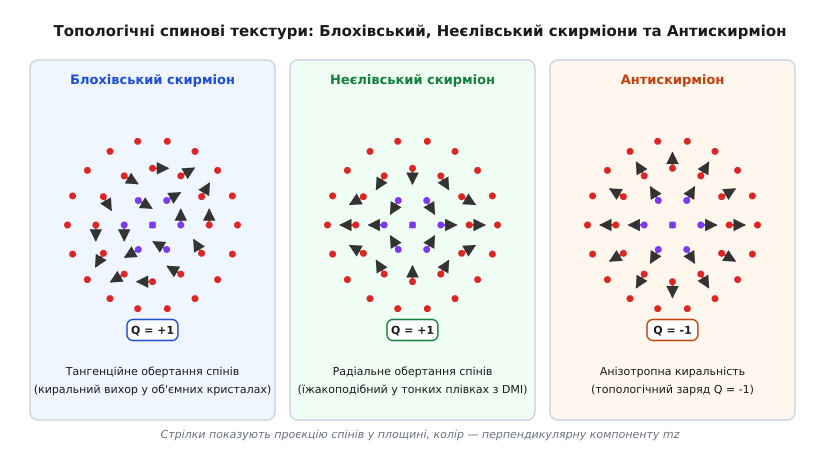
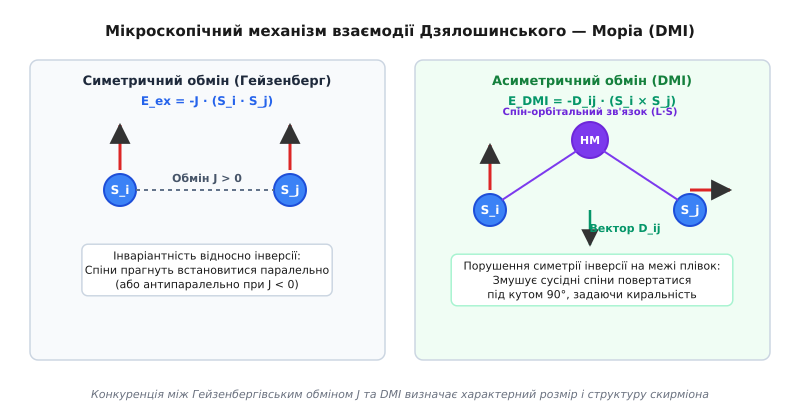
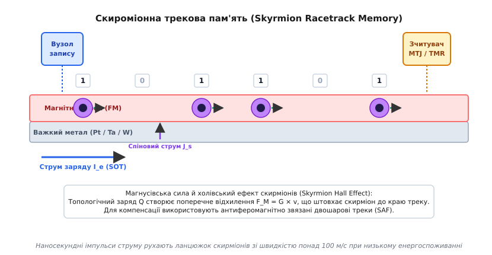

# Скироміони у магнітних матеріалах

<preknowlist>
- [Феромагнетизм](topic:physics/ferromagnetism) — паралельне самодовільне впорядкування атомних магнітних моментів у твердому тілі.
- [Магнітні домени](topic:physics/magnetic-domains) — макроскопічні області однорідної намагніченості та стінки між ними.
- [Спінові хвилі та магнони](topic:physics/spin-wave) — колективні хвильові збудження спінової системи у магнітовпорядкованих середовищах.
</preknowlist>

Зменшення розмірів класичних феромагнітних доменів у сучасних носіях інформації впирається у фундаментальну фізичну перешкоду — суперпарамагнітне обмеження. Коли об'єм магнітного осередку стає меншим за кілька нанометрів, теплові коливання кристалічної ґратки орієнтують вектор намагніченості хаотично, стираючи записані дані. Спроби переміщувати класичні доменні стінки за допомогою електричного струму вимагають високих густин струму (`~10¹¹ A/m²`), що призводить до руйнівного джоулевого нагріву провідника та деградації пристрою.

Розв'язанням цієї фундаментальної суперечності стало відкриття локалізованих вихрових магнітних текстур нанометрового розміру — магнітних скирміонів (англ. *skyrmion*, на честь британського фізика Тоні Скірма). Завдяки особливій геометрії розподілу векторів намагніченості скирміони володіють топологічним захистом, який робить їх стійкими до дефектів кристала, і здатні переміщуватись під дією струмів, на 5–6 порядків менших за ті, що необхідні для руху звичайних доменних стінок.

## Топологія спінового поля та топологічний заряд

Фізична природа стійкості скирміона ґрунтується на математичному понятті топології (грецьк. *topos* — місце, *logos* — вчення) — розділу математики, що вивчає властивості просторових фігур, які залишаються незмінними при неперервних деформаціях (розтягуванні, стисканні, згинанні), але без розривів чи склеювання.

У континуальному наближенні стан двовимірного феромагнетика описують векторним полем одиничної намагніченості `m(r) = (m_x(r), m_y(r), m_z(r))`, де норма вектора в кожній точці простору `r = (x, y)` дорівнює одиниці: `|m(r)| = 1`. Оскільки далеко від центра скирміона намагніченість вирівнюється однорідно вздовж фонового магнітного поля (`m(r → ∞) = (0, 0, 1)`), нескінченну двовимірну площину `R²` можна математично згорнути у двовимірну сферу `S²`.

Векторне поле `m(r)` здійснює відображення просторової сфери `S²` на цільову сферу порядку магнітного параметра `S²`. Кількісною мірою цього відображення є цілочисельний топологічний інваріант — топологічний заряд `Q` (або число обгортання, winding number):

```
Q = (1 / 4π) ∬ m · ( (∂m / ∂x) × (∂m / ∂y) ) dx dy
```

Інтеграл обчислює телесний кут, який замітає вектор намагніченості `m`, коли точка `r` обходить усю площину матеріалу. Для однорідного феромагнетика, де всі спіни спрямовані в один бік, топологічний заряд `Q = 0`. У магнітному скирміоні вектор намагніченості в самому центрі спрямований протилежно до зовнішнього поля (`m_z = -1`), на периферії — вздовж поля (`m_z = +1`), а у проміжній області спіни плавно повертаються, покриваючи цільову сферу точно один раз. Це дає квантоване значення `Q = -1` (або `Q = +1` залежно від орієнтації фонового поля).

Геометричний зміст топологічного заряду стає наочним при використанні стереографічної проєкції. Якщо відобразити двовимірну площину на цільову сферу `S²`, вектор намагніченості скирміона огортає цю сферу суцільною «шкірою» без дірок чи самоперетинів.

Топологічний захист означає, що скирміон неможливо гладко «розплести» чи перетворити на однорідний феромагнетик шляхом поступового відхилення спінів. Щоб змінити ціле число `Q` на нуль, необхідно розірвати неперервність спінового поля, створивши точкову сингулярність безперервності спінового поля — сингулярну точку Блоха. Енергетичний бар'єр утворення такої точкової сингулярності у багато разів перевищує енергію теплових коливань за кімнатної температури, що й забезпечує надзвичайну довговічність скирміонного стану.

Збереження кількості скирміонів у матеріалі математично гарантується законом збереження топологічного струму `∂_μ j_μ = 0`, де тензор топологічного струму `j_μ` виражається через просторово-часові похідні поля намагніченості. Завдяки цьому топологічний заряд виконує роль збережуваного числового квантового числа для спінових текстур у конденсаті.

Детальний математичний апарат сферичної параметризації, розрахунок топологічного інваріанта у полярних координатах та аналіз диференціальних рівнянь профілю скирміона наведено у вставці [Топологічний інваріант та математична модель магнітного скирміона](topic:physics/skyrmion-physics/math-topological-charge.md).

## Класифікація спінових текстур: Блохівські, Неєлівські скирміони та Антискирміони

Залежно від напрямку повертання векторів намагніченості у площині від центра до периферії, магнітні скирміони поділяють на кілька топологічних класів.


*Класифікація спінових текстур магнітних скирміонів за характером повертання вектора намагніченості m у площині.*

Для математичного опису азимутальної структури використовують кут киральності (гелічність) `γ` та вортичність `q`. Азимутальний кут спіна `Φ` пов'язаний із просторовим полярним кутом `φ` співвідношенням `Φ(φ) = q φ + γ`.

У **Блохівському скирміоні** (англ. *Bloch skyrmion*) кут киральності становить `γ = ± π/2`. Спіни повертаються у площині, перпендикулярній до радіального напрямку. Якщо рухатися від центра скирміона уздовж радіуса `r`, вектор намагніченості обертається тангенційно (по колу), нагадуючи вихор рідини. Блохівські скирміони притаманні об'ємним нецентросиметричним кристалам із киральною кристалічною ґраткою (наприклад, `MnSi`, `FeGe`, `Fe_{1-x}Co_xSi`), де об'ємна взаємодія Дзялошинського — Моріа визначає тангенційне обертання.

У **Неєлівському скирміоні** (англ. *Néel skyrmion*) кут киральності становить `γ = 0` або `π`. Повертання спінів відбувається у радіальній площині, яка проходить через центр скирміона і точку спостереження. Спіни розходяться від центра до периферії або сходяться до нього, утворюючи їжакоподібну (радіальну) структуру. Неєлівські скирміони спостерігають у тонкоплівкових багатошарових гетероструктурах, де симетрію інверсії порушено на межі розділу між магнітним шаром та важким металом (наприклад, `Pt/Co/MgO`).

**Антискирміон** (англ. *antiskyrmion*) володіє анізотропною киральністю зі від'ємною вортичністю `q = -1`. Уздовж однієї з осей спіни повертаються за Неєлівським типом, а уздовж ортогональної осі — за Блохівським типом із протилежним напрямком обертання. Це призводить до того, що топологічний заряд антискирміона дорівнює `Q = -1` при протилежному знаку вортичності (`q = -1`). Антискирміони формуються у матеріалах із тетрагональною кристалічною симетрією `D₂d` (наприклад, у магнітних геуслерових сплавах `Mn₂PtSn`).

Крім стандартних скирміонів, у магнітних плівках можуть існувати мерони (merons, `Q = ±1/2`), біскирміони (пари зв'язаних скирміонів) та скирміонні трубки в об'ємних магнетиках.

Історичний шлях від теоретичної ідеї Тоні Скірма в ядерній фізиці до експериментального виявлення скирміонних ґраток за допомогою розсіяння нейтронів та лоренцівської мікроскопії висвітлено у вставці [Історія відкриття магнітних скирміонів](topic:physics/skyrmion-physics/hist-skyrmion-discovery.md).

## Мікроскопічна фізика: Взаємодія Дзялошинського — Моріа (DMI)

Формування скирміона є результатом тонкого енергетичного балансу між чотирма основними магнітними взаємодіями у твердому тілі: симетричним обміном Гейзенберга, асиметричною взаємодією Дзялошинського — Моріа, перпендикулярною магнітною анізотропією та зеєманівською енергією зовнішнього поля.

Класичний симетричний обмін Гейзенберга описують гамільтоніаном `E_ex = -J (S_i · S_j)`. При додатній обмінній константі `J > 0` енергія мінімальна, коли сусідні спіни `S_i` та `S_j` паралельні. Обмін Гейзенберга прагне зробити магнітне поле абсолютно однорідним і протидіє утворенню будь-яких нестійких спінових вихорів.

Головним фізичним механізмом, що стабілізує скирміони, є асиметрична обмінна взаємодія Дзялошинського — Моріа (Dzyaloshinskii-Moriya Interaction, DMI). Вона виникає у системах, де одночасно справджуються дві умови: порушено центральну симетрію кристала та наявний сильний спін-орбітальний зв'язок атомів.


*Порівняння симетричного обміну Гейзенберга та асиметричної взаємодії Дзялошинського — Моріа на межі розподілу шарів.*

Енергію взаємодії DMI між сусідніми спінами `S_i` та `S_j` виражають векторним добутком:

```
E_DMI = -D_ij · (S_i × S_j)
```

де `D_ij` — вектор Дзялошинського — Моріа. Векторний добуток `S_i × S_j` стає максимальним за модулем, коли спіни розташовані під кутом `90°` один до одного. Отже, якщо обмін Гейзенберга прагне тримати спіни паралельними, то DMI намагається розвернути сусідні спіни перпендикулярно, задаючи чітко визначений напрямок обертання — киральність (грецьк. *cheir* — рука).

Мікроскопічний механізм DMI на межі розподілу (механізм Ферта — Леві) виникає за рахунок асиметричного непрямого надобміну. Електрони провідності феромагнітних атомів `i` та `j` перескокують через сусідній атом важкого металу `k` (наприклад, платини `Pt` чи іридію `Ir`), який має потужний спін-орбітальний зв'язок `L · S`. Через відсутність дзеркальної симетрії відносно межі розділу вектор `D_ij` перпендикулярний до площини, утвореної трьома атомами: `D_ij ∝ r_i × r_j`.

У тонкоплівкових гетероструктурах виникає інтерфейсна DMI (interfacial DMI). Коли ультратонку плівку феромагнетика (наприклад, кобальту `Co` товщиною `0.8 nm`) нанесено на підкладку важкого металу (платини `Pt`, танталу `Ta` чи іридію `Ir`), асиметрія межі розподілу порушує інверсійну симетрію перпендикулярно до площини. Вектор DMI у такому випадку лежить у площині межі розділу, що відбирає та стабілізує саме Неєлівські скирміони.

Характерний діаметр скирміона `d_sk` визначається змаганням між обмінною жорсткістю `A` (у `J/m`) та константою DMI `D` (у `J/m²`):

```
d_sk ≈ 4π · (A / |D|)
```

Збільшення константи DMI `D` приводить до зменшення діаметра скирміона та підвищення щільності упаковки спінового вихору.

Мінімізація функціонала повної енергії за допомогою варіаційного числення дає нелінійне рівняння Ейлера — Лагранжа для радіального кута відхилення `Θ(r)`. На великих відстанях від центра скирміона розв'язок спадає за законом модифікованої функції Бесселя: `Θ(r) ∝ (1 / √r) exp(- r / L_sk)`, де `L_sk = √(A / K_eff)` — характеристична анізотропна довжина. Це підтверджує, що скирміон є строго локалізованим спіновим збудженням.

Критичне значення DMI, при якому енергія утворення скирміона стає від'ємною порівняно з однорідним феромагнітним станом, дорівнює `D_c = (4 / π) √(A K_eff)`. При `|D| ≥ D_c` у матеріалі спонтанно формується спиральна фаза або ґратка скирміонів навіть без зовнішнього магнітного поля.

Взаємодія між двома скирміонами на великих відстанях має відштовхувальний характер і описується модифікованою функцією Бесселя нульового порядку `V(R) ∝ K_0(R / L_sk)`. Це Парне відштовхування запобігає зливанню сусідніх скирміонів у нанодроті і забезпечує стабільність їхнього просторового розподілу.

> 🔧 **Навіщо це.**
> Завдяки конкуренції DMI та обміну Гейзенберга фізикам вдається «налаштовувати» розмір скирміона від `100 nm` до рекордних `1–2 nm` за допомогою підбору товщини металевих шарів та матеріалу підкладки. Скирміони нанометрового розміру функціонують як стабільні квантові носії інформації, щільність запису яких у трековій пам’яті перевищує `10 Tbit/inch²`, що у десятки разів вище за межу сучасних жорстких дисків та SSD.

## Динаміка скирміонів під дією електричного струму та Скирміонівський ефект Холла

Для використання скирміонів у обчислювальній техніці необхідно вміти ефективно керувати їхнім рухом вздовж магнітних нанодротів.

Переміщення скирміонів здійснюють за допомогою імпульсів електричного струму. Коли електронний струм тече крізь плівку феромагнетика або сусідній шар важкого металу, виникає переношення спінового моменту кількості руху. Розрізняють два основні механізми струмового керування:
1. **Спін-передавальний момент (Spin-Transfer Torque, STT):** електрони провідності, поляризовані за спіном, проходять крізь неоднорідну спінову текстуру скирміона і передають свій кутовий момент локалізованим d-електронам.
2. **Спін-орбітальний момент (Spin-Orbit Torque, SOT):** електричний струм, що тече у шарі важкого металу (`Pt`, `Ta`), завдяки спіновому ефекту Холла (Spin Hall Effect) генерує перпендикулярний спіновий струм, який інжектується у феромагнітний шар і створює потужний обертальний момент на спінах скирміона.

Спін-орбітальний момент створює два компоненти обертання: демпфінгоподібний момент `t_AD ∝ m × (m × (e_z × j_e))` та польоподібний момент `t_FL ∝ m × (e_z × j_e)`. Саме демпфінгоподібний момент забезпечує ефективне переміщення скирміонів при низьких напругах.

Критична густина струму `j_c`, необхідна для початку руху скирміона, становить усього `10⁵–10⁶ A/m²`. Для порівняння, рух звичайних доменних стінок починається лише при `j_c ≈ 10¹¹ A/m²`. Така колосальна різниця у 5–6 порядків пояснюється топологічним захистом: коли скирміон зустрічає дефект кристалічної ґратки чи неоднорідність товщини плівки (центр зачеплення, або пінінгу), його спінове поле оборотно деформується і огинає дефект, не руйнуючи цілісності квазічастинки.

Однак при русі скирміона під дією струму виникає специфічний динамічний ефект — **Скирміонівський ефект Холла** (Skyrmion Hall Effect, SHE). Оскільки скирміон володіє топологічним зарядом `Q ≠ 0`, при його русі зі швидкістю `v` виникає гіроскопічна сила Магнуса (Magnus gyroforce):

```
F_M = G × v
```

де `G = (0, 0, -4π Q M_s t_FM / γ_0)` — гіровектор скирміона. Гіроскопічна сила спрямована перпендикулярно до вектору швидкості. У результаті скирміон рухається не суворо вздовж електричного струму, а під кутом Холла `θ_Sk` до осі нанодроту:

```
tan θ_Sk = v_y / v_x = G_z / (α · D_xx)
```

де `α` — коефіцієнт згасання Гільберта, а `D_xx` — тензор магнітної дисипації.

Поперечний дрейф під дією сили Магнуса становить серйозну технологічну проблему: при високих швидкостях руху (`>100 m/s`) скирміон відхиляється до бічного краю магнітного треку, де взаємодіє з крайовим потенціалом і може анігілювати (знищитися).

Для повного усунення скирміонівського ефекту Холла розроблено концепцію **синтетичних антиферомагнітних (SAF) скирміонів**. У SAF-структурі два феромагнітні шари розділено тонким немагнітним прошарком рутенію `Ru` товщиною `0.8 nm`, що забезпечує антиферомагнітне обмінне куплювання (взаємодію RKKY). У результаті скирміон складається з двох суміщених спінових вихорів із протилежними напрямками намагніченості у ядрах (`Q₁ = +1` у верхньому шарі та `Q₂ = -1` у нижньому).

Гіровектори верхнього та нижнього шарів взаємно компенсуються:

```
G_tot = G₁ + G₂ = 0
```

Завдяки повній компенсації гіровекторів сила Магнуса зникає (`F_M = 0`), скирміон рухається суворо прямолінійно вздовж нанодроту зі швидкістю понад `1000 m/s`, а критичний струм руху зменшується до `j_c < 10⁵ A/m²`.

Чисельне моделювання еволюції спінової сітки, розрахунок телесних кутів та алгоритми інтегрування LLG мовами C та C++ наведено у вставці [Чисельне моделювання текстури та топологічного заряду скирміона](topic:physics/skyrmion-physics/proj-skyrmion-lattice-sim.md).

## Трекова пам'ять (Racetrack Memory) та архітектури майбутнього

Найперспективнішим практичним застосуванням магнітних скирміонів є створення трекової пам'яті (англ. *Skyrmion Racetrack Memory*) — енергонезалежної твердотільної пам'яті нового покоління, запропонованої фізиком Стянпаком Паркіном (Stuart Parkin).


*Принцип роботи трекової пам'яті: зсув скирміонного ланцюжка спін-орбітальним моментом під вузлами запису та зчитування.*

У трековій пам'яті інформаційні біти кодують наявністю або відсутністю скирміона у послідовному ланцюжку вздовж магнітного нанодроту (треку):
- Присутність скирміона в осередку відповідає логічній «1»;
- Відсутність скирміона (однорідний феромагнітний фон) відповідає логічному «0».

Функціонування трекової пам'яті базується на чотирьох основних операціях:
1. **Запис інформації (Injection):** локальне зародження скирміона здійснюють коротким імпульсом електричного струму через наноконтакт (завдяки ефекту SOT) або локальним напруженням (ефект VCMA — Voltage-Controlled Magnetic Anisotropy). Наносекундний імпульс локально знижує анізотропію, дозволяючи DMI згорнути спіни у Неєлівський скирміон за час `< 1 ns`. Альтернативним методом є локальне випромінювання ультракоротких фемтосекундних лазерних імпульсів.
2. **Зсув даних (Shifting):** послідовність бітів переміщують уздовж треку за допомогою наносекундних імпульсів струму провідності в підкладці важкого металу. Ланцюжок скирміонів рухається як цілісний жорсткий кортеж під вузлами зчитування.
3. **Зчитування інформації (Reading):** зчитування здійснюють за допомогою магнітного тунельного переходу (Magnetic Tunnel Junction, MTJ). Коли скирміон проходить під тунельним бар'єром `MgO`, його розвернене ядро змінює тунельний магніторезистивний опір (TMR) структури, що фіксується вимірювальною схемою як падіння напруги.
4. **Стирання даних (Erase):** видалення скирміона здійснюють імпульсом високої густини струму або електричним полем у звуженні нанодроту, що провокує точковий колапс скирміона назад у феромагнітний фон.

Порівняння перспективних спінтронічних технологій пам'яті демонструє переваги скирміонної трекової пам'яті: вона поєднує енергонезалежність та високу зносостійкість STT-MRAM (`>10¹⁵` циклів) із високою щільністю упаковки та низькою собівартістю тривимірної NAND-пам'яті, оскільки на один вимірювальний MTJ-вузол припадають сотні послідовно записаних бітів у нанодроті.

Крім трекової пам'яті, магнітні скирміони відкривають шляхи до створення нейроморфних (мозкоподібних) обчислювальних систем. Завдяки пружному відштовхуванню між скирміонами та їхній здатності накопичуватися біля перешкод, скирміонні нанопристрої можуть імітувати пластичність біологічних синапсів та функціонування нейронів у мемристорних матрицях та резервуарних обчисленнях (Reservoir Computing).

Зведена специфікація магнітних матеріалів, параметри SOT-інжекції, амплітуди TMR-сигналів та геометричні вимоги до нанодротів зібрані у довідникові [Специфікація та параметри магнітних матеріалів для скироміонної трекової пам'яті](topic:physics/skyrmion-physics/api-skyrmion-racetrack-params.md).
