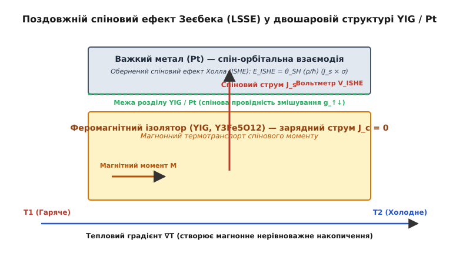
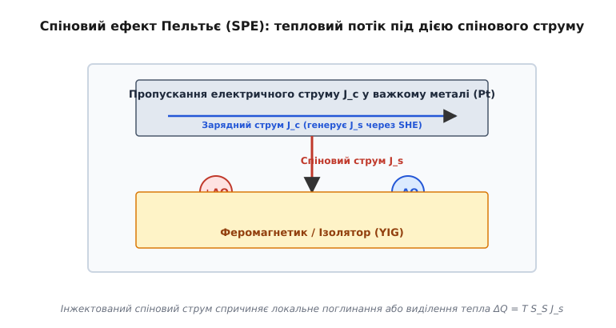
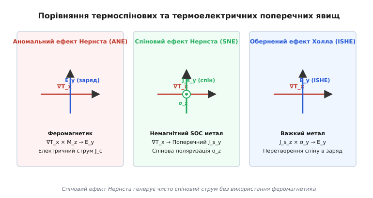

<preknowlist>
- [Магнітні властивості речовини та феромагнетизм](topic:physics/ferromagnetism/ferromagnetism-d.md)
- [Спінові хвилі та магнони в конденсованому середовищі](topic:physics/spin-wave/spin-wave-d.md)
- [Гігантський магнітоопір та спін-залежний транспорт](topic:physics/giant-magnetoresistance/giant-magnetoresistance-d.md)
- [Спін-орбітальна взаємодія та спіновий ефект Холла](topic:physics/spin-orbit-torque/spin-orbit-torque-d.md)
</preknowlist>

# Спінова калоритроніка та термоспінові явища

У класичній напівпровідниковій мікроелектроніці виділення тепла за законом Джоуля — Ленца (`Q = I^2 R`) є неминучим дисипативним фактором, який обмежує щільність компонування елементів, підвищує робочу температуру та спричиняє термічну деградацію кристалічних структур. Спінова калоритроніка (від лат. *calor* — тепло та англ. *electronics* — електроніка) змінює цей парадигмальний підхід: вона розглядає тепловий градієнт не як паразитно втрачену енергію, а як активну термодинамічну силу, здатну генерувати, транспортувати та керувати спіновим кутовим моментом електронів і колективними спіновими збудженнями ґратки. Поєднуючи поняття спінтроніки, термоелектрики та термодинаміки незворотних процесів, цей напрям фізики конденсованого стану відкриває можливість створення автономних термоспінових генераторів, бездисипативних магнонних каналів зв'язку та засобів локального нанорозмірного охолодження.

## Незворотна термодинаміка трипотокового транспорту

Електрон у твердому тілі володіє двома фундаментальними характеристиками — елементарним електричним зарядом `e` та внутрішнім квантовим кутовим моментом — спіном (від англ. *spin* — обертання) `s = ħ / 2`. У класичній термоелектриці перенесення енергії та заряду описується коефіцієнтами Зеєбека та Пельтьє, де носіями виступають електрони провідності. Проте у матеріалах із магнітним впорядкуванням або сильним спін-орбітальним зв'язком транспортні властивості носіїв із протилежними орієнтаціями спінів є принципово неоднаковими.

Згідно з двофлуїдною моделлю Невілла Мотта, у феромагнітному металі провідність здійснюється двома паралельними незалежними каналами: електронами зі спіном, спрямованим паралельно макроскопічній намагніченості (`↑`), та електронами зі спіном проти намагніченості (`↓`). Оскільки густина електронних станів на рівні Фермі `D_↑(E_F)` та `D_↓(E_F)` розщеплена внаслідок внутрішнього обмінного поля, парціальні електропровідності `σ_↑`, `σ_↓` та парціальні коефіцієнти Зеєбека `S_↑`, `S_↓` є відмінними.

Згідно з формулою Мотта для розсіювання електронів поблизу поверхні Фермі, парціальні коефіцієнти Зеєбека прямо пропорційні логарифмічній похідній електропровідності по енергії:

```
S_↑ = - (π^2 k_B^2 T / 3 e) [ d ln σ_↑(E) / dE ]|_{E_F}
S_↓ = - (π^2 k_B^2 T / 3 e) [ d ln σ_↓(E) / dE ]|_{E_F}
```

За наявності температурного градієнта `∇T` кожна спінова підгрупа генерує власний термоелектричний струм:

```
J_↑ = - σ_↑ ∇(μ_↑ / e) - σ_↑ S_↑ ∇T   [струм спінового каналу вгору]
J_↓ = - σ_↓ ∇(μ_↓ / e) - σ_↓ S_↓ ∇T   [струм спінового каналу вниз]
```

Загальний електричний струм заряду `J_c` є простою сумою двох каналів `J_c = J_↑ + J_↓`, тоді як чистий спіновий струм `J_s` визначається їхньою різницею:

```
J_s = (ħ / 2e) (J_↑ - J_↓)            [чиста густина спінового струму]
```

Якщо електричне коло розімкнене (`J_c = 0`), виникає компенсаційне внутрішнє електричне поле, проте різниця парціальних термоЕРС `S_↑ - S_↓` призводить до того, що парціальні струми `J_↑` та `J_↓` не дорівнюють нулю окремо, а течуть у протилежних напрямках. Це означає, що тепловий потік генерує чисто спіновий струм — перенесення кутового моменту без сумарного перенесення електричного заряду.

Для макроскопічного опису зв'язаного переносу використовують термодинамічну матрицю кінетичних коефіцієнтів Ларса Онсагера. У лінійній області незворотної термодинаміки трійка співвідношень зв'язує густину зарядного струму `J_c`, густину спінового струму `J_s` та густину теплового потоку `Q` з відповідними термодинамічними силами:

```
J_c = - σ ∇V - P_σ σ ∇(μ_s / 2e) - σ S ∇T
J_s = - (ħ / 2e) P_σ σ ∇V - (ħ / 2e) σ ∇(μ_s / 2e) - (ħ / 2e) σ S_S ∇T
Q   = - T σ S ∇V - T (ħ / 2e) σ S_S ∇(μ_s / 2e) - κ_0 ∇T
```

де `∇V` — градієнт електричного потенціалу, `μ_s = μ_↑ - μ_↓` — спінове накопичення (різниця електрохімічних потенціалів двох спінових підсистем), `P_σ = (σ_↑ - σ_↓) / σ` — ступінь спінової поляризації провідності, `S` — загальний коефіцієнт Зеєбека, `S_S` — дифференциальний спіновий коефіцієнт Зеєбека, а `κ_0` — теплопровідність кристалічної ґратки.

Спіновий коефіцієнт Зеєбека `S_S` виражається через парціальні характеристики Мотта:

```
S_S = (σ_↑ S_↑ - σ_↓ S_↓) / σ
```

Виражаючи `S_S` через ступінь поляризації провідності `P_σ` та різницю парціальних термоЕРС `ΔS = S_↑ - S_↓`, отримуємо:

```
S_S = P_σ S + (1 - P_σ^2) ΔS / 2
```

Ця фундаментальна матрична форма показує, що три явища — електрична провідність, спіновий транспорт та теплоперенос — є нерозривно пов'язаними (математичне виведення термодинамічної матриці Онсагера та рівнянь транспорту див. у [🧮 Термодинаміка Онсагера та рівняння спінового і магнонного транспорту](topic:physics/spin-caloritronics/math-onsager-thermodynamics.md)).

## Дифузія спінового накопичення за моделлю Валета — Ферта

У провідних феромагнетиках простір релаксації нерівноважного спінового накопичення `μ_s(z)` описується фундаментальним дифузійним рівнянням Тьєррі Валета та Альбера Ферта:

```
d^2 μ_s(z) / dz^2 = μ_s(z) / λ_sf^2
```

де `λ_sf` — характерна довжина спінової релаксації (англ. *spin-flip diffusion length*). Довжина спінової релаксації визначається коефіцієнтом дифузії електронів `D` та часом між актами розсіювання зі зміною орієнтації спіну `τ_sf`:

```
λ_sf = sqrt( D · τ_sf )
```

У нормальних металах без магнітного впорядкування (наприклад, алюміній або мідь) `λ_sf` може досягати сотен нанометрів за кімнатної температури, тоді як у важких металах із сильним спін-орбітальним розсіюванням (платина, тантал, вольфрам) довжина релаксації становить всього від `1` до `5 нм`.

Рівняння Валета — Ферта задає спадання нерівноважної спінової поляризації біля межі контакту за законом експоненти:

```
μ_s(z) = A exp(- z / λ_sf) + B exp(z / λ_sf)
```

Амплітуди `A` та `B` визначаються граничними умовами неперервності спінового струму на межах розділу шарів. Якщо товщина металевої плівки `d` значно більша за довжину релаксації (`d >> λ_sf`), спінове накопичення повністю згасає вглиб об'єму матеріалу.

## Спіновий ефект Зеєбека (Spin Seebeck Effect, SSE)

Спіновий ефект Зеєбека (англ. *Spin Seebeck Effect, SSE*) полягає у виникненні спінового струму або спінового накопичення під дією просторового градієнта температури `∇T` у магнітовпорядкованому матеріалі.

Розрізняють дві основні геометричні конфігурації спостереження ефекту:
1. **Поздовжній спіновий ефект Зеєбека (LSSE)**: градієнт температури `∇T` прикладається перпендикулярно до межі розділу шарів (уздовж осі `z`), а генерований спіновий струм `J_s` тече в тому ж напрямку `z`, інжектуючись у прилеглий вимірювальний шар.
2. **Поперечний спіновий ефект Зеєбека (TSSE)**: градієнт температури прикладається уздовж плівки (в осі `x`), а спінове накопичення вимірюється на поверхні в напрямку `y`.


*Поздовжній спіновий ефект Зеєбека (LSSE) у двошаровій структурі феромагнітний ізолятор / важкий метал.*

Найбільший науковий та практичний інтерес викликає спостереження спінового ефекту Зеєбека у феромагнітних ізоляторах, зокрема у залізо-ітрієвому гранаті `Y_3 Fe_5 O_12` (YIG). Оскільки YIG є якісним діелектриком із шириною забороненої зони понад `2.6 eV`, в ньому повністю відсутні вільні електрони провідності (`σ = 0`), а отже, не можуть протікати джоулеві струми та виникати класичний термоелектричний ефект Зеєбека.

Механізм формування спінового струму в ізоляторі описується магнонною термодинамікою. Градієнт температури `∇T` створює просторову нерівновагу в газоподібній підсистемі магнонів (від лат. *magnus* / англ. *magnetism*) — квантів спінових хвиль, що несуть квант кутового моменту `ħ`. Дисперсійне співвідношення для магнонів у феромагнетику у зовнішньому магнітному полі `H_ext` задається рівнянням:

```
ħ ω(k) = D_ex k^2 + g μ_B H_ext
```

де `D_ex` — параметр обмінного зв'язку, `k` — волновой вектор, `g` — g-фактор Ланде, а `μ_B` — магнетон Бора. Рівноважна функція розподілу магнонного газу підпорядковується статистиці Бозе — Ейнштейна:

```
f_m(ω) = 1 / ( exp( (ħ ω - μ_m) / (k_B T_m) ) - 1 )
```

де `μ_m` — нерівноважний магнонний хімічний потенціал.

Магнони дрейфують від гарячого кінця зразка (де їхня густина та середня енергія вищі) до холодного кінця, створюючи магнонний тепловий струм `J_m`. На межі розділу між магнітним ізолятором YIG та немагнітним важким металом (наприклад, платиною Pt) відбувається процес інтерфейсного термічного спінового пампінгу (англ. *spin pumping*). Нерівноважні магнони в YIG взаємодіють з електронами провідності у платині через обмінне розсіювання на межі contacts. Спіновий струм `J_s`, що передається через межу розділу, виражається через комплексну спінову провідність змішування `g_↑↓ = g_r + i g_i`:

```
J_s = (g_r / 2π) (k_B T_m - k_B T_e)
```

де `T_m` — ефективна температура магнонів біля межі, `T_e` — температура електронів у металі, а `k_B` — стала Больцмана.

Оскільки у важкому металі спіновий струм є електрично нейтральним, для його прямого вимірювання застосовують обернений спіновий ефект Холла (англ. *Inverse Spin Hall Effect, ISHE*). Завдяки сильному спін-орбітальному зв'язку в платині, електрони з протилежними спінами асиметрично відхиляються в протилежні боки при русі у спіновому струмі `J_s`. Це перетворює чисто спіновий струм у поперечне електричне поле `E_ISHE`:

```
E_ISHE = θ_SH (ρ_Pt / ħ) (J_s × σ_spin)
```

де `θ_SH` — спіновий кут Холла металу, `ρ_Pt` — питомий опір платини, а `σ_spin` — орієнтація вектора поляризації спінів (що збігається з напрямком намагніченості YIG `M`). Виміряна на кінцях платинової смужки різниця потенціалів `V_ISHE` є прямою електричною сигнатурою спінового ефекту Зеєбека.

Температурна залежність спінового ефекту Зеєбека має характерний максимум при низьких температурах (`T ≈ 30 - 50 K`). Цей пік пояснюється явленням магнон-фононного захоплення (англ. *magnon-phonon drag*): акустичні фонони кристалічної ґратки, дрейфуючи вздовж градієнта температури, активно захоплюють магнони за рахунок магнон-фононного розсіювання, що різко збільшує сумарний магнонний потік. При наближенні до температури Кюрі `T_C` (для YIG `T_C ≈ 550 K`) амплітуда спінового ефекту Зеєбека спадає до нуля через руйнування дальнодіючого магнітного порядку.

## Експериментальна методологія та розділення супутніх явищ

Точне експериментальне вимірювання спінового ефекту Зеєбека вимагає суворого дотримання методології контролю температурних полів та розділення паразитних термомагнітних сигналів.

Основні експериментальні вимоги включають:
1. **Кутова залежність сигналу ISHE**: Електричне поле оберненого ефекту Холла задовольняє векторний добуток `E_ISHE ∝ J_s × σ_spin`. При обертанні зовнішнього магнітного поля `H_ext` у площині зразка виміряна напруга `V_ISHE` підпорядковується синусоїдальному закону `V_ISHE(φ) = V_0 sin(φ)`, де `φ` — кут між напрямком векторів намагніченості та віссю між електричними контактами.
2. **Симетрія відносно поля**: Оскільки орієнтація спінів `σ_spin` перевертається при зміні напрямку магнітного поля (`H_ext → - H_ext`), сигнал `V_ISHE` є суворо непарною функцією від намагніченості: `V_ISHE(- M) = - V_ISHE(M)`.
3. **Калібрування градієнта температури**: Термопари або оптичні інфрачервоні мікроскопи розміщують безпосередньо на гарячій та холодній підкладках гетероструктури для точного визначення локального перепаду `ΔT` по товщині шару.

## Вплив якості інтерфейсу та спінової провідності змішування

Ключовим чинником, що визначає величину термоспінового сигналу `V_ISHE`, є ефективність транспорту кутового моменту через межу розділу феромагнетик / важкий метал.

Параметр спінової провідності змішування `g_↑↓` чутливий до атомарного стану поверхні:
- **Шорсткість та окислення**: Утворення товстого окисленого шару або шорсткості понад `1 нм` зменшує дійсне значення `g_r` у декілька разів за рахунок неконтрольованого спін-фліп розсіювання на інтерфейсних дефектах.
- **Вставка інтерфейсних шарів**: Нанесення атомарно тонкого шару індексального металу (наприклад, `0.5 нм` Cu або Au) між YIG та Pt дозволяє підвищити прозорість межі розділу та запобігти взаємній дифузії атомів платини й заліза.
- **Магнітна анізотропія межі**: Орієнтація легкої осі намагнічування поблизу межі розділу визначає ефективність спінового пампінгу та ступінь поглинання поперечних спінових компонентів.

## Спіновий ефект Пельтьє (Spin Peltier Effect, SPE)

Згідно з фундаментальним принципом симетрії кінетичних коефіцієнтів Онсагера, кожне пряме термоелектричне чи термоспінове явище має суворо парне обернене явище. Оберненим до спінового ефекту Зеєбека є спіновий ефект Пельтьє (англ. *Spin Peltier Effect, SPE*).

Спіновий ефект Пельтьє полягає у виділенні або поглинанні тепла (локальному нагріванні чи охолодженні) на межі розділу між магнітним матеріалом та нормальним металом при пропусканні через неї чисто спінового струму `J_s`.


*Спіновий ефект Пельтьє (SPE): локальне нагрівання або охолодження контакту під дією інжектованого спінового струму.*

Експериментальна схема спостереження ефекту Пельтьє базується на двошаровій структурі Pt / YIG. Електричний струм заряду `J_c`, що пропускається вздовж платинової смужки, завдяки прямому спіновому ефекту Холла (SHE) генерує поперечний спіновий струм `J_s`, спрямований вертикально до межі з YIG.

Коли інжектований спіновий струм долає межу розділу, електронні спіни передають свій кутовий момент магнонній підсистемі ізолятора. Залежно від відносної орієнтації поляризації спінів `σ_spin` та намагніченості `M`, цей процес супроводжується випромінюванням або поглинанням магнонів:
1. Якщо поляризація інжектованих спінів антипаралельна намагніченості `M`, електрони релаксують шляхом народження магнонів. Це вимагає поглинання енергії з ґратки, що спричиняє локальне **охолодження** межі розділу (`-ΔQ`).
2. Якщо поляризація спінів паралельна намагніченості `M`, інжектований струм викликає знищення магнонів із передачею їхньої енергії кристалічній ґратці, що приводить до локального **нагрівання** межі розділу (`+ΔQ`).

Зміна густини теплового потоку `ΔQ` на межі контакту задається співвідношенням:

```
ΔQ = Π_S (2e / ħ) J_s
```

де `Π_S` — макроскопічний спіновий коефіцієнт Пельтьє. Використовуючи термодинамічне доведення Онсагера, можна показати, що спіновий коефіцієнт Пельтьє зв'язаний зі спіновим коефіцієнтом Зеєбека співвідношенням Кельвіна — Онсагера:

```
Π_S = T · S_S
```

де `T` — абсолютна температура гетероструктури. Оскільки температурні зміни при спіновому ефекті Пельтьє є дуже малими (`ΔT ~ 10^-3 K`), їхнє вимірювання вимагає застосування високочутливих оптичних методів, таких як лінійна оптична lock-in термографія (LIT) та інфрачервона термометрія.

## Спіновий ефект Нернста (SNE) та аномальний ефект Нернста (ANE)

Поряд із поздовжніми термоспіновими ефектами, у конденсованих середовищах виникає сімейство поперечних термомагнітних явищ, зумовлених спін-орбітальною взаємодією та асиметричним розсіюванням носіїв.


*Порівняння термоспінових та термоелектричних поперечних явищ (ANE, SNE та ISHE).*

### Спіновий ефект Нернста (Spin Nernst Effect, SNE)

Спіновий ефект Нернста є термічним аналогом спінового ефекту Холла. Якщо у немагнітному металі з сильним спін-орбітальним зв'язком (наприклад, Pt, Ta, W, Bi_2 Se_3) створити поздовжній градієнт температури `∇T_x`, електрони провідності, що рухаються від гарячого кінця до холодного, зазнають спін-залежного розсіювання (механізми skew-scattering та side-jump).

У результаті електрони зі спіном «вгору» (`σ_z`) відхиляються до однієї бокової грані зразка, а електрони зі спіном «вниз» (`-σ_z`) — до протилежної. Це генерує поперечний чисто спіновий струм `J_s_y^{SNE}` без виникнення поперечного зарядного струму:

```
J_s_y^{SNE} = θ_SN (k_B / e) σ (∇T_x × z)
```

де `θ_SN` — спіновий кут Нернста матеріалу. На відміну від спінового ефекту Зеєбека, для існування спінового ефекту Нернста не потрібна наявність феромагнітного шару — ефект виникає безпосередньо у суцільному немагнітному провіднику за наявності спін-орбітальної взаємодії.

### Аномальний ефект Нернста (Anomalous Nernst Effect, ANE)

У феромагнітних провідниках (Fe, Co, Ni, FePt) поздовжній градієнт температури `∇T_x` за наявності перпендикулярної намагніченості `M_z` генерує поперечне електричне поле `E_y^{ANE}` та поперечний зарядний струм:

```
E_y^{ANE} = - N_A (∇T_x × m)
```

де `N_A` — коефіцієнт аномального ефекту Нернста, а `m = M / |M|` — одиничний вектор намагніченості. Фізична природа ANE пов'язана з кривизною Беррі електронних зон поблизу рівня Фермі в імпульсному просторі (внутрішній квантово-механічний механізм) та спін-орбітальним розсіюванням носіїв.

Для порівняння трьох ключових поперечних термоспінових та термомагнітних явищ зведено їхні фундаментальні характеристики:

| Явище | Середовище | Первинне збудження | Вихідний потік | Наявність `M` |
| :--- | :--- | :--- | :--- | :--- |
| **SSE + ISHE** | Магнітний ізолятор / Важкий метал | `∇T_z` в ізоляторі | Спіновий струм `J_s_z` → Зарядне поле `E_y` | Необхідна у шарі магнетика |
| **SNE** | Немагнітний важкий метал | `∇T_x` у металі | Поперечний спіновий струм `J_s_y` | Не потрібна (`M = 0`) |
| **ANE** | Феромагнітний провідник | `∇T_x` у провіднику | Поперечне зарядне поле `E_y` | Необхідна у провіднику |

Експериментальне відокремлення аномального ефекту Нернста від спінового ефекту Зеєбека є критично важливим завданням при дослідженні металевих термоспінових структур. У провідних плівках ANE генерує паразитний електричний сигнал безпосередньо в об'ємі магнетика, який може перекривати сигнал від ISHE у важкому металі. Саме тому використання феромагнітних ізоляторів (YIG, `NiFe_2 O_4`), де `ANE = 0` через відсутність провідності, є найбільш надійним способом вивчення чистого спінового ефекту Зеєбека.

## Магнонна калоритроніка та інтерфейсний термотранспорт

У магнітних ізоляторах основними носіями тепла є фонони (колективні коливання кристалічної ґратки) та магнони (колективні коливання спінової підсистеми). Взаємодія між цими двома квазічастинковими газами описується двотемпературною моделлю.

Нехай `T_p(z)` — середня температура фононів, а `T_m(z)` — температура магнонів. У об'ємі ізолятора передача енергії між фононами та магнонами відбувається з характерним часом релаксації `τ_mp`. Рівняння теплового балансу для двох підсистем має вигляд:

```
C_p (d T_p / dt) = κ_p ∇^2 T_p - G_mp (T_p - T_m)
C_m (d T_m / dt) = κ_m ∇^2 T_m + G_mp (T_p - T_m)
```

де `C_p`, `C_m` — питомі теплоємності фононів та магнонів, `κ_p`, `κ_m` — відповідні коефіцієнти теплопровідності, а `G_mp = C_m / τ_mp` — коефіцієнт магнон-фононного теплообміну.

За наявності сильного градієнта температури або на межах зразка виникає розбіжність між фононною та магнонною температурами `T_m ≠ T_p`. Цей температурний стрибок `ΔT_mp = T_m - T_p` діє як ефективна термодинамічна сила, що інжектує нерівноважне магнонне накопичення `μ_m` біля поверхні.

На самій межі гетероконтакту виникає інтерфейсний тепловий опір Капіци `R_K`. Стрибок фононної температури `δT_K = Q / R_K` додається до нерівноважного магнонного накопичення, що вимагає врахування граничної теплопровідності покриття при конструюванні нанопристроїв.

Магнонна довжина дифузії `λ_m` визначає відстань, на яку нерівноважне спінове накопичення може проникнути вглиб феромагнетика до того, як згасне внаслідок магнон-фононного розсіювання:

```
λ_m = sqrt( κ_m τ_mp / C_m )
```

Для якісних монокристалів YIG при кімнатній температурі `λ_m` становить від `100 нм` до `1 мкм`, а при зниженні температури до рідкого гелію може досягати десятків мікрометрів.

Просторовий розподіл магнонного накопичення `μ_m(z)` по товщині шару ізолятора розраховується з незведеного диференціального рівняння магнонної дифузії (чисельний розрахунок та алгоритм чисельного моделювання магнонного профілю див. у [⚙️ Моделювання магнонної дифузії та спінової акумуляції](topic:physics/spin-caloritronics/proj-magnon-diffusion.md)).

## Ультрашвидка фемтосекундна спінова калоритроніка

При дії на термоспінові структури ультракоротких лазерних імпульсів тривалістю десятки фемтосекунд (`10 - 100 fs`) виникають екстремальні нерівноважні термодинамічні стани. У цьому режимі класична макроскопічна термодинаміка поступається місцем тритемпературній моделі (3TM):
- Електронна температура `T_e(t)` різко зростає до кількох тисяч Кельвінів за рахунок прямого поглинання оптичного кванту.
- Спінова температура `T_s(t)` та фононна температура `T_p(t)` переходять у нерівноважний стан за час порядку `100 fs`.

Екстремальний електронно-спіновий температурний градієнт `d(T_e - T_s)/dt` генерує субпікосекундні імпульси чистого спінового струму надвисокої амплітуди (`J_s ~ 10^11 А/м²`). Цей ефект ультрашвидкої термоспінової інжекції використовують для генерації терагерцового електромагнітного випромінювання (терагерцові спінтронічні емітери).

Когерентне оптичне керування термоспіновими імпульсами дозволяє перемикати вектор намагніченості у магнітних плівках FePt без застосування зовнішніх магнітних полів, що відкриває шлях до надшвидкого запису інформації з частотою понад `1 THz`.

## Флуктуаційно-дисипативна теорема та термомагнітний шум

Згідно з квантовою флуктуаційно-дисипативною теоремою (ФДТ), термичні флуктуації намагніченості у магнітному ізоляторі створюють флуктуюче спінове поле `δM(t)`, яке взаємодіє з електронами провідності у прилеглому важкому металі.

У стану термодинамічної рівноваги (`∇T = 0`) у металевому шарі виникає випадковий спіновий шум Джонсона — Найквіста. Інжектований у метал термічний флуктуючий спіновий струм перетворюється через ISHE у флуктуючу напругу:

```
< V_ISHE^2 > = 4 k_B T R_Pt Δf + S_V^{spin}(f) Δf
```

де `R_Pt` — електричний опір металевої смужки, `Δf` — полоса частот вимірювача, а `S_V^{spin}(f)` — спектральна щільність термомагнітного спінового шуму. Вимірювання цього шуму дозволяє прямо визначати спінову провідність змішування `g_↑↓` без застосування зовнішніх температурних градієнтів.

## Магнонний ефект Холла та термоспінова магноніка

Поряд із дифузійним рухом магнонів уздовж градієнта температури, у нецентросиметричних феромагнетиках (наприклад, `Lu_2 V_2 O_7`) виникає поперечний магнонний потік — магнонний ефект Холла (англ. *Magnon Hall Effect, MHE*).

Фізична причина магнонного ефекту Холла пов'язана із взаємодією Дзялошинського — Морія (DMI), яка відіграє роль векторного потенціалу решіткового магнітного поля для нейтральних магнонів. Внаслідок цього магнонний потік тепла відхиляється у поперечному напрямку під дією поздовжнього градієнта температури:

```
J_m_y = - κ_xy^m (∇T_x)
```

де `κ_xy^m` — поперечна магнонна теплопровідність, яка інтегрально визначається топологічною кривизною Беррі магнонних зон у зворотній гратці. Це відкриває можливість створення топологічних магнонних діодів та теплових хвилеводів.

## Гігантський магніто-термоелектричний опір у спінових клапанах

У металевих багатошарових спінових клапанах `FM1 / NM / FM2` (наприклад, `Co/Cu/Co` або `Fe/Cr`) спостерігається гігантський магніто-термоелектричний ефект (англ. *Giant Magneto-Thermoelectric Power, GMTP*).

Коефіцієнт Зеєбека структури залежить від кута між векторами намагніченості шарів:
- При паралельній орієнтації (`P`) термоЕРС дорівнює `S_P = (σ_↑ S_↑ + σ_↓ S_↓) / σ`.
- При антипаралельній орієнтації (`AP`) термоЕРС вирівнюється через симетрію залишків каналів: `S_AP = (S_↑ + S_↓) / 2`.

Відносне макроскопічне магніто-Зеєбек розщеплення виражається відношенням:

```
MS = (S_P - S_AP) / S_P
```

Виміряні значення `MS` досягають десятків відсотків за кімнатної температури, що дозволяє створювати автономні магнітні датчики, які не вимагають зовнішнього джерела живлення, а працюють суто на розсіяному теплі контрольованого об'єкта.

## Енергетична ефективність та критерій якості термоспінових перетворювачів

Ефективність перетворення теплової енергії в електричну в спінових калоритронічних пристроях описується спіновим безрозмірним фактором якості `ZT_spin`:

```
ZT_spin = (S_S^2 σ_s T) / κ
```

де `S_S` — спіновий коефіцієнт Зеєбека, `σ_s` — спінова провідність матеріалу, `T` — абсолютна температура, а `κ = κ_e + κ_p` — сумарна теплопровідність (електронна `κ_e` та фононна `κ_p`).

Головна фундаментальна перевага спінової калоритроніка над класичною термоелектрикою полягає у можливості незалежної оптимізації параметрів:
1. У напівпровідникових ТЕГ електропровідність `σ` та коефіцієнт Зеєбека `S` зв'язані теоремою Відемана — Франца, що обмежує максимальне значення `ZT`.
2. У термоспінових пристроях на основі двошарових структур `YIG/Pt` шар магнонного генератора (`YIG`) та шар електричного конвертера (`Pt`) є фізично розділеними. Це дозволяє мінімізувати фононну теплопровідність `κ_p` за рахунок суперґраток, не погіршуючи спінову провідність контакту `g_↑↓`.

## Антиферомагнітна спінова калоритроніка

Новітнім напрямком у термоспіновій фізиці є використання антиферомагнетиків (наприклад, `NiO`, `α-Fe_2 O_3`, `Mn_3 Sn`) замість феромагнетиків.

У антиферомагнетиках магнітні моменти двох або більше атомних підґраток `M_A` та `M_B` є строго скомпенсованими (`M = M_A + M_B = 0`). Це дає три ключові переваги для спінової калоритроніка:
1. **Відсутність зовнішніх полів розсіювання**: Антиферомагнітні термоспінові пристрої не взаємодіють між собою через розсіяні магнітні поля, що дозволяє досягти гранично високої щільності компонування.
2. **Терагерцовий діапазон частот**: Магнонні збудження в антиферомагнетиках мають частоти у діапазоні `0.1 – 10 THz` (на три порядки вище за феромагнетики), що дозволяє генерувати ультракороткі термоспінові імпульси пікосекундної тривалості.
3. **Двомодовий магнонний транспорт**: В антиферомагнетиках існують дві вироджені магнонні моди з протилежною працею кругової поляризації спінового обертання. Градієнт температури створює нерівноважні заселеності обох мод, що дозволяє керувати знаком спінового струму `J_s` без зміни напрямку температурного градієнта.

## Топологічна спінова калоритроніка

Останні відкриття у фізиці топологічних ізоляторів (`Bi_2 Se_3`, `Sb_2 Te_3`) та вейлівських напівметалів (`Co_3 Sn_2 S_2`, `Fe_3 Ge Te_2`) виявили гігантські термоспінові та термомагнітні відгуки завдяки топології електронної зонової структури.

У топологічних ізоляторах спін електронів провідності суворо спирається на їхній імпульс (англ. *spin-momentum locking*). Тепловий потік `∇T` генерує поверхневий спіновий струм із високим коефіцієнтом перетворення. У магнітних вейлівських напівметалах наявність вейлівських вузлів (точкових сингулярностей кривизни Беррі) приводять до виникнення гігантського аномального ефекту Нернста `N_A ~ 5 - 10 мкВ/К`, що перевищує показники класичних феромагнетиків на цілий порядок.

## Практичні застосування та перспективні термоспінові пристрої

Спінова калоритроніка відкриває принципово нові можливості для створення пристроїв прямого перетворення тепла в електрику та спінові сигнали на нанорівні.

### 1. Магнонні термоелектричні генератори (Spin Seebeck Harvesters)

Класичні напівпровідникові термоелектричні генератори (ТЕГ) вимагають послідовного електричного з'єднання сотень `p-n` пар. Оскільки металеві контакти ТЕГ піддаються термічним напруженням та корозії, їхня надійність обмежена.

Термоспінові генератори на основі спінового ефекту Зеєбека мають просту планарну структуру: на масивний феромагнітний ізолятор (YIG або ферити) наноситься тонка плівка важкого металу (Pt або Ta). Градієнт температури, спрямований перпендикулярно до плівки, генерує напругу `V_ISHE` вздовж всієї поверхні металу. Основні переваги таких генераторів:
- Відсутність електричного короткого замикання через ізолюючу підкладку.
- Масштабованість: вихідна напруга зростає пропорційно площі покриття.
- Можливість використання гнучких підкладок та нетоксичних феритів.

### 2. Термомагнітна пам'ять та тунельний магніто-Зеєбек ефект (TMS)

У тунельних магнітних переходах (англ. *Magnetic Tunnel Junctions, MTJ*), що складаються з двох феромагнітних електродів (наприклад, CoFeB), розділених ультратонким діелектричним бар'єром MgO (`d ~ 1 нм`), під дією градієнта температури виникає тунельний магніто-Зеєбек ефект (англ. *Tunnel Magneto-Seebeck, TMS*).

Величина генерованої термоЕРС `U_TMS` залежить від відносного напрямку намагніченості електродів (паралельного `P` чи антипаралельного `AP` станів):

```
TMS = (U_P - U_AP) / min(|U_P|, |U_AP|)
```

Зміна термоЕРС при перемиканні магнітного стану може досягати понад `100%`. Це дає змогу зчитувати стан комірок енергонезалежної спінтронічної пам'яті (STT-MRAM) без пропускання зарядного струму — виключно за рахунок локального підігріву лазерним або термічним імпульсом.

### 3. Термічне управління спіновим обертальним моментом (Thermal Spin-Transfer Torque)

Локальний градієнт температури у наноструктурі генерує спіновий струм, здатний чинити механічний обертальний момент на намагніченість вільних шарів у спінових клапанах. Це явище дозволяє знизити критичний струм перемикання магнітних комірок пам'яті MRAM за рахунок комбінованої дії електричного струму та локального термоспінового імпульсу.

Історичний шлях від перших спостережень термомагнітної фізики XIX століття до створення сучасних магнонних пристроїв висвітлено у додатковому огляді (детальніше див. [📜 Історія спінової калоритроніка](topic:physics/spin-caloritronics/hist-spin-caloritronics.md)).

Спінова калоритроніка демонструє, що поєднання концепцій термодинаміки незворотних процесів із квантовими властивостями спіну та магнонів дає змогу створювати нове покоління енергоефективних нанопристроїв, здатних перетворювати відхідне тепло на корисні інформаційні та електричні сигнали.
