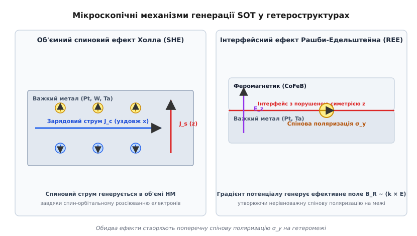
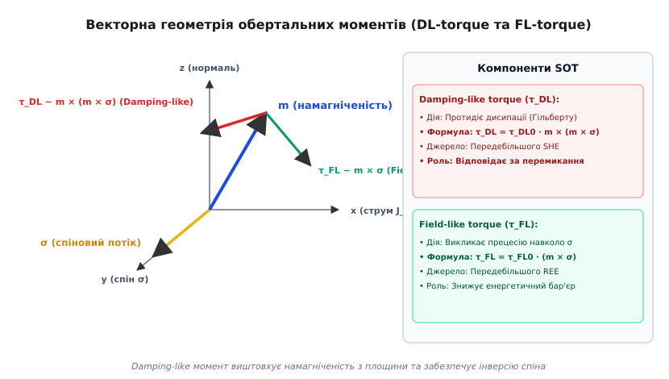
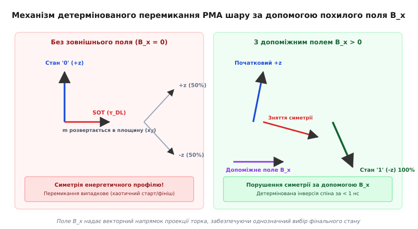
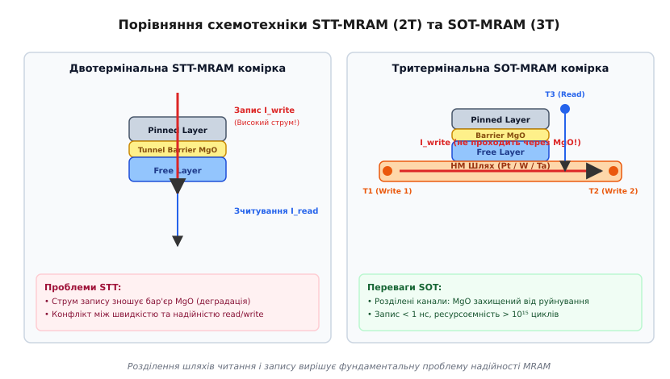

# Спин-орбітальний обертальний момент (Spin-Orbit Torque, SOT)

<preknowlist>
- [Феромагнетизм](book:physics/condensed-matter-physics/ferromagnetism) — спонтанне паралельне впорядкування магнітних моментів електронів у кристалічній ґратці.
- [Обмінна взаємодія](book:physics/condensed-matter-physics/exchange-interaction) — квантовомеханічна взаємодія тотожних частинок, яка визначає спінову впорядкованість.
- [Феромагнітний резонанс](book:physics/condensed-matter-physics/ferromagnetic-resonance) — когерентна прецесія вектора намагніченості під дією високочастотних і постійних магнітних полів.
- [Магнітні домени](book:physics/condensed-matter-physics/magnetic-domains) — області макроскопічно однорідної намагніченості у феромагнетиках.
</preknowlist>

Запис інформації у сучасній енергонезалежній магніторезистивній пам'яті (MRAM) тривалий час спирався на ефект спінового обертального моменту (Spin-Transfer Torque, STT). У технології STT електрони протікають безпосередньо крізь тонкий тоннельний бар'єр з оксиду магнію (`MgO`), який затиснутий між двома магнітними шарами. Перший шар поляризує спіни електронів, а при переході у другий (вільний) шар ці електрони віддають свій спіновий кутовий момент, змушуючи вектор намагніченості вільного шару змінити напрямок. Однак ця концепція містить принциповий технічний конфлікт: щоб переключити магнітний стан за одиниці наносекунд, необхідно пропускати крізь надтонкий діелектричний шар `MgO` (товщиною менше ніж 1 нм) високу густину електричного струму. Сильні електричні поля спричиняють поступову деградацію та прискорений пробій тоннельного бар'єра, а також створюють суворі обмеження за ресурсоємністю запису (зазвичай не більше `10¹⁰`–`10¹²` циклів).

Спин-орбітальний обертальний момент (Spin-Orbit Torque, SOT) кардинально змінює фізику керування намагніченістю. Замість того щоб пропускати струм запису вертикально крізь тоннельний бар'єр `MgO`, SOT пускає зарядовий струм горизонтально в площині сусіднього провідного шару з важкого металу (платини `Pt`, танталу `Ta`, вольфраму `W` або топологічного ізолятора). Завдяки потужній внутрішній спин-орбітальній взаємодії у важкому металі просте переміщення електронів генерує чисто спіновий струм, спрямований перпендикулярно до руху заряду. Цей спіновий потік інжектується у прилеглий феромагнітний шар і створює механічний обертальний момент на векторі намагніченості. Шлях запису повністю відокремлюється від шляху зчитування: діелектричний бар'єр `MgO` більше не зазнає електричних перевантажень, затримка запису скорочується до субнаносекундного діапазону (< 1 нс), а ресурс перемикань перевищує `10¹⁵` циклів.

---

### 1. Еволюція магнітної пам'яті: Від полів Ерстеда до SOT

Для глибокого розуміння фізичних переваг SOT доцільно розглянути три послідовні покоління технологій магнітної пам'яті з довільним доступом (MRAM):

1. **Перше покоління (Field-Induced Magnetic Switching, FIMS-MRAM):** Перемикання намагніченості здійснювалося імпульсами амперівського магнітного поля Ерстеда, що генерувалося струмами у двох взаємно перпендикулярних шинах (Bit Line та Word Line). Цей метод мав незадовільну масштабованість: при зменшенні розміру комірки менше 90 нм необхідна амплітуда струму зростала за законом `1/r`, викликаючи величезне тепловидилення та перехресні завади (cross-talk) між сусідніми комірками.
2. **Друге покоління (Spin-Transfer Torque, STT-MRAM):** Використовує прямоток поляризованих електронів через вертикальний тунельний перехід. Спіновий струм передає кутовий момент безпосередньо d-електронам вільного шару. STT дозволив зменшити розмір комірки до 20 нм. Однак у STT струм запису `I_write` та струм зчитування `I_read` проходять через один і той самий вертикальний тунельний бар'єр `MgO`.

У двотермінальних тоннельних переходах (MTJ) технології STT критична густина струму перемикання `J_c0` визначається параметром загасання Гільберта `α`, висотою енергетичного бар'єра `Δ` та ефективним магнітним полем анізотропії `H_k`:

```
J_c0 = (2 · e · α · M_s · d · H_k) / (ħ · η)      [критичний струм перемикання STT]
```

Тут `e` — елементарний заряд, `M_s` — намагніченість насичення вільного шару, `d` — товщина вільного шару, `ħ` — зведена стала Планка, `η` — коефіцієнт спінової поляризації струму.

Щоб зменшити тривалість імпульсу запису `τ` від 10 нс до 1 нс у технології STT, критичний струм доводиться масштабувати за логарифмічним законом перенапруги. При наносекундних тривалостях амплітуда струму зростає у 3–5 разів. Електричне поле на бар'єрі `MgO` наближається до критичної межі пробою (близько `1.0–1.2 В/нм`). Це призводить до передчасного старіння комірки через утворення локальних провідних містків (філаментів) та катастрофічного падіння тунельного магніторезистивного ефекту (TMR).

Крім того, виникає конфлікт між надійністю зчитування та швидкістю запису. Зчитування здійснюється вимірюванням опору MTJ при малому струмі `I_read`. Якщо струм зчитування занадто близький до `I_c0`, виникає ризик помилкового перезапису даних під час читання (помилка `read disturb`). Збільшення амплітуди `I_write` для гарантованого запису знижує ресурсоємність, а її зменшення підвищує ймовірність помилок запису (помилка `write error rate`, WER).

3. **Третє покоління (Spin-Orbit Torque, SOT-MRAM):** Фізично відокремлює зарядовий канал від тунельного бар'єра. Зарядовий струм тече вздовж металевої смужки важкого металу, генеруючи поперечний спіновий струм. Цей спіновий потік інжектується у феромагнетик, створюючи спин-орбітальний момент SOT.

Детальніше про хронологію виникнення цієї ідеї, перші експериментальні відкриття та дискусії між науковими групами ви можете прочитати у вставці [📜 Історія відкриття спин-орбітального обертального моменту](book:physics/condensed-matter-physics/spin-orbit-torque/hist-sot-discovery.md).

---

### 2. Мікроскопічні джерела SOT: Спиновий ефект Холла та ефект Рашби-Едельштейна

Генерація спинового кутового моменту у гетероструктурах важкий метал / феромагнетик (HM/FM) визначається двома основними фізичними механізмами: об'ємним спиновим ефектом Холла (Spin Hall Effect, SHE) у товщі важкого металу та інтерфейсним ефектом Рашби — Едельштейна (Rashba-Edelstein Effect, REE) на межі розподілу шарів.


*Мікроскопічні механізми генерації SOT у гетероструктурах: ліворуч — об'ємне відхилення спінів у важкому металі (SHE), праворуч — інтерфейсне накопичення спінів завдяки спин-орбітальному розщепленню Рашби (REE)*

#### Об'ємний спиновий ефект Холла (Spin Hall Effect, SHE)

Спиновий ефект Холла виникає всередині немагнітного провідного шару з високою атомною масою (такого як платина `Pt` з `Z = 78`, тантал `Ta` з `Z = 73`, вольфраму `W` з `Z = 74` або вісмут `Bi`). Спин-орбітальна взаємодія у релятивістському наближенні описується гамільтоніаном, пропорційним добутку внутрішнього магнітного поля ядра на спін електрона:

```
H_so = (ħ / (4 · m_e² · c²)) · (∇V × p) · σ      [спин-орбітальний гамільтоніан]
```

Тут `V` — градієнт атомного потенціалу, `p` — імпульс електрона, `σ` — вектор матриць Паулі (орієнтація спіна), `m_e` — маса електрона, `c` — швидкість світла.

Коли електричний струм густиною `J_c` протікає вздовж осі `x`, електрони із орієнтацією спіна "вгору" (`σ` вздовж `+y`) та "вниз" (`σ` вздовж `-y`) зазнають асиметричного відхилення у протилежні боки вздовж вертикальної осі `z`. Це явище обумовлене двома типами розсіювання:
1. **Внутрішній (intrinsic) механізм:** Електрони рухаються у періодичному кристалічному полі, де кривина Беррі (Berry curvature) електронних зон діє як ефективне магнітне поле у просторі імпульсів, відхиляючи носії без участі домішок. Внутрішній внесок є визначальним для важких металів з заповненими або майже заповненими 5d-оболонками (Pt, Ta, W).
2. **Зовнішній (extrinsic) механізм:** Включає косе розсіювання (skew scattering) на асиметричному потенціалі домішок та поперечний зсув хвильового пакета (side jump) під час зіткнення. Зовнішній внесок можна масштабувати легуванням немагнітного провідника важкими домішками (наприклад, додаванням золота `Au` або вісмуту `Bi` у мідну матрицю `Cu`).

У результаті в товщі металу виникає чистий спіновий струм `J_s`, який протікає перпендикулярно до зарядового струму `J_c`:

```
J_s = θ_SH · (ħ / (2 · e)) · (J_c × σ)      [регулярне співвідношення SHE]
```

Безрозмірний коефіцієнт `θ_SH` називається **кут спинового Холла** (*Spin Hall Angle*). Він характеризує ефективність перетворення зарядового струму у спиновий. Для чистої платини `Pt` величина `θ_SH` становить приблизно `+0.07`–`+0.12`, для β-фази танталу `Ta` вона є від'ємною і досягає `-0.15`, а для аморфної β-фази вольфраму `W` від'ємний кут `θ_SH` сягає рекордних значень від `-0.30` до `-0.40`.

Останніми роками для підвищення ефективності SOT застосовують **топологічні ізолятори** (Bi₂Se₃, Bi₂Te₃, Sb₂Te₃) та **напівметали Вейля** (WTe₂, MoTe₂). Завдяки замкненим суцільним дираківським поверхневим станам зі спин-імпульсним зв'язуванням (spin-momentum locking), конус Дірака фіксує спін строго перпендикулярно до імпульсу носія. Коефіцієнт спін-орбітального перетворення `θ_SOT` у топологічних ізоляторах перевищує одиницю (`θ_SOT > 1.0` до `3.5`), що зменшує струми запису на один-два порядки.

Потік спінів досягає гетеромежі HM/FM і дифундує вглиб феромагнетика на відстань, що визначається довжиною спинової релаксації `λ_sd` (зазвичай `1–2 нм`). Переданий на межі спиновий моментум чинить виштовхувальну дію на намагніченість.

#### Інтерфейсний ефект Рашби — Едельштейна (Rashba-Edelstein Effect, REE)

На межі розподілу між важким металом та феромагнетиком (або оксидом) виникає різка асиметрія потенціалу вздовж осі `z` (порушення структурної інверсійної симетрії, Structural Inversion Asymmetry, SIA). Потенціальний градієнт утворює внутрішнє електричне поле `E_z = -∇V`.

Носії заряду, що рухаються зі швидкістю `v` у площині інтерфейсу, у своїй власній системі відліку відчувають ефективне магнітне поле Рашби:

```
B_R ~ (v × E_z) ~ (k × z_hat)      [ефективне поле Рашби]
```

Це поле лежить у площині гетеромежі та є перпендикулярним до хвильового вектора електрона `k`. У рівноважному стані спіни електронів на поверхні Фермі орієнтовані по колу навколо осі `z` (спінова спіральність). Однак при прикладанні зовнішнього електричного поля `E_x` поверхня Фермі зсувається в просторі імпульсів на величину `Δk_x`. Це спричиняє нерівноважну спінову поляризацію електронів `⟨σ_y⟩` на межі розділу:

```
S_y = (e · α_R · m_e / (π · ħ²)) · J_c      [накопичення спінів Едельштейна]
```

де `α_R` — параметр спін-орбітального розщеплення Рашби (вимірюється в еВ·нм). Накопичений на інтерфейсі нерівноважний спіновий момент обміняється імпульсом із d-електронами феромагнетика через обмінну взаємодію `J_ex · (S · m)`, створюючи інтерфейсний обертальний момент.

#### Перспективи Орбітроніки: Орбітальний ефект Холла (Orbital Hall Effect, OHE)

Найновішим напрямком розвитку спін-орбітроніки є використання **орбітального кутового моменту** електронів. У легких перехідних металах (таких як титан `Ti`, ванадій `V`, хром `Cr` або марганець `Mn`), де спін-орбітальна взаємодія слабка, електричний струм генерує потужний потік орбітального моменту `L_s` завдяки **орбітальному ефекту Холла (OHE)**.

Коли цей орбітальний струм `L_s` досягає гетеромежі з феромагнетиком, спин-орбітальна взаємодія всередині феромагнетика перетворює орбітальний момент у спіновий момент (Orbit-to-Spin Conversion). Ефективний кут перетворення `θ_OHE` для титану чи хрому перевищує показники платини, що дозволяє створювати високоефективні SOT-пристрої без використання рідкісних і дорогих важких металів.

---

### 3. Феноменологічна класифікація компонентів SOT: DL-torque та FL-torque

Незалежно від мікроскопічного походження (SHE чи REE), дія спінового струму та поляризації на орт намагніченості `m = M / M_s` описується у рамках розширеного рівняння Ландау — Ліфшиця — Гільберта (LLGS) шляхом додавання двох ортогональних векторних компонентів.


*Просторова орієнтація вектора намагніченості m, спінової поляризації σ та згенерованих обертальних моментів τ_DL (Damping-like) і τ_FL (Field-like)*

Повне рівняння руху намагніченості з урахуванням SOT має вигляд:

```
d m / d t = -γ · (m × H_eff) + α · (m × d m / d t) + τ_DL + τ_FL      [динаміка LLGS з SOT]
```

де `γ = g · μ_B / ħ` — гіромагнітне відношення, `H_eff` — ефективне внутрішнє та зовнішнє магнітне поле, `α` — безрозмірний коефіцієнт загасання Гільберта.

Два додані обертальні моменти категоризуються за їхньою векторною симетрією відносно орта спінової поляризації `σ` (який при протіканні струму вздовж осі `x` орієнтований вздовж осі `y`):

```
τ_DL = τ_DL0 · m × (m × σ)      [Damping-like / anti-damping момент]
τ_FL = τ_FL0 · (m × σ)          [Field-like момент]
```

#### 1. Момент дисипативного типу (Damping-like torque, DL-torque)

Вектор `τ_DL` лежить у площині, утвореній векторами `m` та `σ`, і спрямований строго перпендикулярно до `m`. Своєю векторною структурою він аналогічний члену дисипації Гільберта `α · (m × d m / d t)`, однак залежно від напрямку струму (знака `σ`) може діяти протилежно до нього.

Коли електричний струм перевищує порогове значення, `τ_DL` повністю компенсує природне внутрішнє загасання кристалічної ґратки. Він виштовхує магнітний момент із його рівноважного стану і компенсує енергетичні втрати, змушуючи намагніченість здійснювати незгасаючу прецесію або здійснювати повний розворот на 180 градусів. У гетероструктурах HM/FM основним джерелом Damping-like моменту є об'ємний спиновий ефект Холла (SHE).

#### 2. Момент польового типу (Field-like torque, FL-torque)

Вектор `τ_FL` спрямований перпендикулярно як до вектора намагніченості `m`, так і до вектора спінової поляризації `σ`. За своєю математичною формою він еквівалентний прецесійній дії зовнішнього магнітного поля `H_FL = (τ_FL0 / γ) · σ`, спрямованого вздовж осі `y`.

Під дією `τ_FL` вектор намагніченості починає прецесувати навколо осі `σ`. Сам по собі Field-like момент не може забезпечити детерміновану інверсію спіна з одного полюса в інший, оскільки він лише обертає намагніченість у площині, перпендикулярній до `σ`. Проте він суттєво деформує енергетичний бар'єр анізотропії, модулюючи динаміку перемикання та знижуючи необхідну амплітуду струму для `τ_DL`. Домінуючим джерелом Field-like моменту є інтерфейсний ефект Рашби — Едельштейна (REE).

Математичне виведення систем диференціальних рівнянь LLGS, амплітудних коефіцієнтів `τ_DL0`, `τ_FL0` та розрахунок критичної густини струму детально розібрано у вставці [🧮 Квантовий та феноменологічний розрахунок динаміки SOT](book:physics/condensed-matter-physics/spin-orbit-torque/math-sot-dynamics.md).

---

### 4. Динаміка перемикання шарів з перпендикулярною анізотропією (PMA) та проблема симетрії

Для створення надщільних масивів MRAM феромагнітний шар повинен мати перпендикулярну магнітну анізотропію (Perpendicular Magnetic Anisotropy, PMA). У цьому випадку легка вісь намагніченості орієнтована строго вертикально уздовж осі `z` (стани `m_z = +1` відповідають логічному "0", а `m_z = -1` — логічній "1"). Шари з PMA забезпечують високий енергетичний бар'єр `Δ = E_b / (k_B · T) ≥ 60`, що гарантує збереження даних понад 10 років при мінімальних просторових розмірах комірки (< 20 нм).

Однак при намаганні переключити шар з PMA за допомогою класичного SOT виникає фундаментальна проблема симетрії.


*Вплив допоміжного поздовжнього поля B_x на зняття дегенерації energy-profile при SOT-перемиканні шару з перпендикулярною анізотропією (PMA)*

Зарядовий струм `J_c`, що тече вздовж осі `x`, генерує у важкому металі спінову поляризацію `σ`, орієнтовану вздовж осі `y`. Damping-like обертальний момент `τ_DL = τ_DL0 · m × (m × σ)` на початку процесу (коли `m = +z_hat`) діє у напрямку:

```
τ_DL ~ (+z_hat) × ((+z_hat) × y_hat) = (+z_hat) × (-x_hat) = -y_hat
```

Під дією цього торка вектор намагніченості повертається із вертикального напрямку `+z` в екваторіальну площину `(xy)`, досягаючи стану `m_z = 0`. У цій точки енергетичний потенціал кристала є строго симетричним відносно відхилень у бік `+z` та `-z`. Як тільки струм запису вимикається, теплові флуктуації з рівною ймовірністю 50% скидають намагніченість назад у вихідний стан `+z` або у фінальний стан `-z`. Детермінований (однозначний) запис стає неможливим.

Щоб забезпечити детерміноване перемикання спіна з `+z` у `-z`, необхідно порушити дзеркальну симетрію системи `y → -y`. У лабораторних та промислових пристроях це досягається кількома інженерними методами:

1. **Застосування зовнішнього поздовжнього магнітного поля `B_x`:** Мале магнітне поле (порядку 10–50 мТл), прикладене вздовж напрямку струму `x`, створює додатковий прецесійний момент. Поле `B_x` зміщує вектор намагніченості під час розвороту вздовж осі `x`, створюючи похил, завдяки якому вектор `τ_DL` продовжує штовхати намагніченість далі через екватор строго у протилежну півсферу `-z`.
2. **Вбудоване поле обмінного зсуву (Exchange Bias):** Замість зовнішніх електромагнітів під шар важкого металу інтегрують додатковий антиферомагнітний шар (наприклад, `PtMn` або `IrMn`), який створює внутрішнє локальне магнітне поле `H_eb` вздовж осі `x`.
3. **Градієнт товщини або структури (Structural Lateral Asymmetry):** Наноострівець феромагнетика виготовляють у формі трапеції або створюють боковий градієнт концентрації важкого металу, що порушує просторову симетрію перерозподілу спінів.
4. **Використання сегнетоелектричних та топологічних субстратів:** Спонтанна електрична поляризація підкладки створює вбудований електричний вектор, який змінює геометрію ефективних полів Рашби.
5. **Синтетичні антиферомагнетики (Synthetic Antiferromagnets, SAF):** Корисний шар пов'язують антиферомагнітним обміном Рудермана — Киттеля — Касуї — Йосіди (RKKY) через надтонкий шар рутенію `Ru` (0.4–0.8 нм) із суміжним магнітним шаром. Це зменшує розсіювальні магнітостатичні поля і забезпечує стійкість відносно зовнішніх завад.

У реальних нанорозмірних наноелементах (діаметром > 30 нм) процес перемикання відбувається не через однорідне обертання макроспіна, а шляхом зародження та руху хіральної доменної межі (Domain Wall, DW). Нецентросиметрична взаємодія Дзялошинського — Морія (Dzyaloshinskii-Moriya Interaction, DMI), яка виникає на межі HM/FM, закручує спіни всередині доменної стінки у структуру Нееля. Спин-орбітальний момент SOT штовхає таку Неелівську доменну стінку зі швидкістю до 500–1000 м/с, забезпечуючи перемикання всього наноелемента за час менше 0.5 нс.

---

### 5. Принцип роботи та схемотехніка тритермінальної SOT-MRAM комірки

У промисловій мікроелектроніці елементарна комірка пам'яті SOT-MRAM будується за тритермінальною архітектурою (3-Terminal SOT-MRAM Cell), де функції зчитування та запису просторово й електрично розведені по різних провідних лініях.


*Конструктивне розведення шляхів зчитування та запису у 3-термінальній SOT-MRAM комірці на противагу традиційній 2-термінальній STT-MRAM*

Комірка складається із магнітного тоннельного переходу (MTJ), розташованого на вузькій смужці з важкого металу (треку SOT). Нижній феромагнітний шар MTJ є вільним (`Free Layer`), і він перебуває у безпосередньому квантовому та електричному контакті із провідником HM.

Фізичні термінали комірки розмежовані за функціями:
- **Термінал 1 (T1) та Термінал 2 (T2):** Підключені до протилежних кінців нижньої горизонтальної смужки важкого металу. Для здійснення операції запису імпульс напруги прикладається між T1 та T2. Струм запису `I_write` протікає виключно через низькоомний металевий трек (опір сотні Ом), не торкаючись тоннельного бар'єра `MgO`.
- **Термінал 3 (T3):** З'єднаний із верхнім зафіксованим магнітним шаром MTJ (`Pinned Layer`). Для операції зчитування малоамплітудний струм `I_read` пропускається вертикально між терміналом T3 та одним із терміналів основи (T1 або T2) крізь високоомний бар'єр `MgO` (опір декілька кОм). Опір вимірюється за рахунок тунельного магніторезистивного ефекту (TMR): опір мінімальний при паралельній орієнтації шарів і максимальний при антипаралельній.

Детальний конструктивний розбір геометрії комірки, матеріалів стека, розрахунку фактора термостабільності `Δ` та порівняння параметрів із SRAM наведено у вставці [🔌 Будова та топологія тритермінальної SOT-MRAM комірки](book:physics/condensed-matter-physics/spin-orbit-torque/comp-sot-mram-cell.md).

#### Зведена порівняльна характеристика STT-MRAM та SOT-MRAM

| Фізично-технічний параметр | Традиційна STT-MRAM (2-Terminal) | Перспективна SOT-MRAM (3-Terminal) |
| :--- | :--- | :--- |
| **Кількість терміналів комірки** | 2 (Вертикальний стек) | 3 (Розділені затвор/канал) |
| **Шлях струму запису** | Через тунельний бар'єр `MgO` | Через шар важкого металу (HM) |
| **Тривалість імпульсу запису** | 5 – 20 нс | 0.2 – 1.5 нс (субнаносекундна) |
| **Густина струму запису** | `10⁶ – 10⁷ А/см²` (через `MgO`) | `10⁷ – 10⁸ А/см²` (у HM каналі) |
| **Ресурсоємність (Write Endurance)** | `10¹⁰ – 10¹²` циклів | `> 10¹⁵` циклів (майже безмежно) |
| **Енергія запису на біт** | ~1 – 5 пДж | ~100 – 300 фДж |
| **Площа елементарної комірки** | `6 – 10 F²` (1 ключовий транзистор) | `14 – 20 F²` (2 ключові транзистори) |
| **Основний деградаційний фактор** | Електричний пробій діелектрика `MgO` | Джоулевий нагрів металевого треку |

Завдяки затримкам запису менше 1 нс та ресурсоємності понад `10¹⁵` циклів, SOT-MRAM є першим реальним кандидатом на заміну енергозалежної кеш-пам'яті процесорів першого, другого та третього рівнів (L1/L2/L3 SRAM), що дозволить усунути струми витоку у сучасних мікропроцесорах.

Для чисельного розрахунку траєкторій перемикання вектора намагніченості у просторі під дією токів SOT розроблено симулятори на основі методу Ейлера та Рунге — Кутти. Ви можете ознайомитися з реалізацією такого алгоритму у вставці [⚙️ Чисельне моделювання перемикання намагніченості SOT в Python та C++](book:physics/condensed-matter-physics/spin-orbit-torque/proj-sot-switching-sim.md).

> 🔧 **Навіщо це.**
> Спин-орбітальний обертальний момент є фундаментальною основою для створення енергонезалежної оперативно-кеш пам'яті ультрашвидкої дії. У сучасних високопродуктивних обчислювальних процесорах понад 60% площі кристала займають масиви статичної пам'яті SRAM, які споживають величезну потужність у стані спокою через струми витоку затворів транзисторів. Заміна SRAM на тритермінальні комірки SOT-MRAM дозволяє повністю знеструмлювати блоки кешу без втрати стану даних за частки наносекунди. Понад те, SOT є ключовим рушієм мемристорної спінтроніки та нейроморфних обчислень: модулюючи амплітуду та тривалість імпульсу SOT у гетероструктурах з закріпленими доменними межами, інженери створюють штучні синапси зі змінною магнітною провідністю для апаратного прискорення штучних нейронних мереж безпосередньо у масиві пам'яті (In-Memory Computing).
