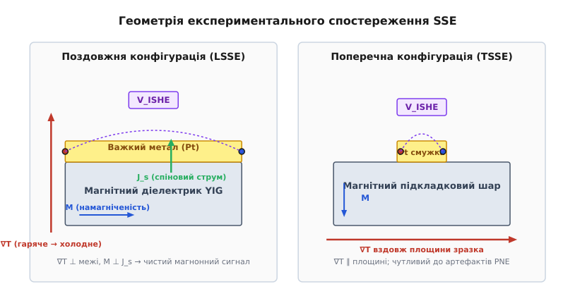
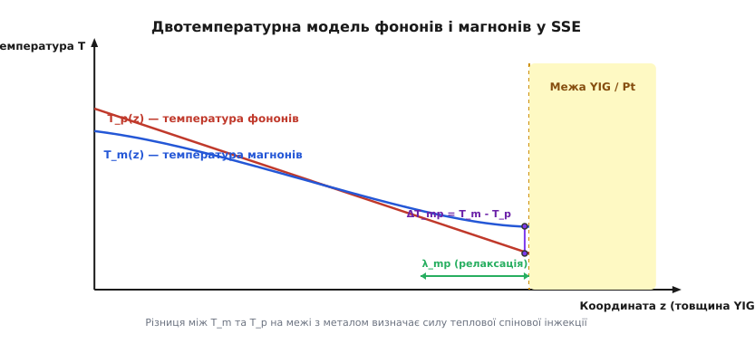
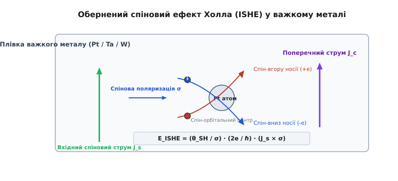
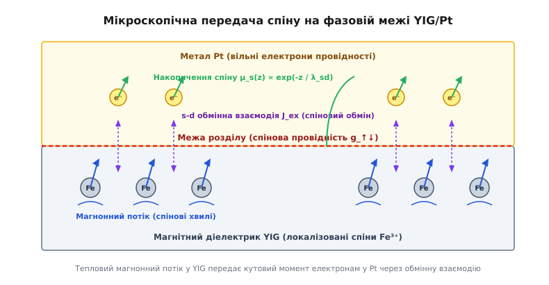

# Спіновий ефект Зеєбека (SSE)

<preknowlist>
- [Антиферомагнетизм і феримагнетизм](topic:physics/antiferromagnetism) — спонтанне магнітне впорядкування спінових моментів та двопідґратковий обмін.
- [Зонна теорія твердого тіла](topic:physics/band-theory) — енергетичний спектр електронів, провідники та діелектрики.
- [Спіновий обертальний момент](topic:physics/spin-transfer-torque) — динаміка прецесії намагніченості та передача спінового кутового моменту.
</preknowlist>

Спроба утилізувати теплові витоки чи знімати електричну напругу з температурних градієнтів у мікроелектронних напівпровідникових кристалах за допомогою класичних термоелектричних матеріалів (таких як телурид вісмуту `Bi₂Te₃`) стикається з фундаментальним фізичним конфліктом: електрони, що переносять теплову енергію, одночасно є носіями електричного заряду. Це неминуче викликає паразитне джоулеве самонагрівання струмом `I²R`, а висока електронна теплопровідність швидко розмиває самий температурний градієнт `∇T`. Спроби відокремити тепловий потік від електричної провідності у традиційних напівпровідниках упираються в жорстку межу, де до 90% теплової енергії розсіюється безкорисно.

Розв'язок цієї фундаментальної проблеми дала **спін-калоритроніка** (від латинського *calor* — тепло та *электрон*) — галузь физики твердого тіла, яка відмовилася від перенесення електричного заряду на користь генерації чистого спінового струму. Ключовим явищем цієї дисципліни є **спіновий ефект Зеєбека** (англ. *Spin Seebeck Effect*, **SSE**), який дозволяє перетворювати градієнт температури безпосередньо у потік спінового кутового моменту навіть у повних електричних діелектриках, де вільні електрони провідності відсутні взагалі.

## 1. Фізична сутність: Від класичного Зеєбека до спінового транспорту

У класичному ефекті Зеєбека, відкритому 1821 року Томасом Йоганном Зеєбеком, температурний градієнт `∇T` вздовж провідника змушує гарячі носії заряду (електрони або дірки) дифундувати до холодного кінця. Цей процес викликає просторовий поділ заряду та створює електричне поле `E = S · ∇T`, де `S` — коефіцієнт Зеєбека матеріалу. Головний недолік класичної термоелектрики полягає у жорсткому зв'язку між теплопровідністю `κ` та електричною провідністю `σ` через закон Відемана — Франца.

Спіновий ефект Зеєбека переносить опис у новий фізичний вимір. Замість спрямованого дрейфу заряджених частинок температурний градієнт збуджує **чистий спіновий струм** (англ. *pure spin current*, **J_s**). Чистий спіновий струм являє собою потік спінового кутового моменту `ℏ/2` без супутнього перенесення електричного заряду:

```
J_s = J_↑ - J_↓,      але      J_c = -e · (J_↑ + J_↓) = 0
```

де `J_↑` та `J_↓` — відповідно струми електронів (або квазічастинок) зі спінами «вгору» та «вниз».

Оскільки сумарний струм заряду `J_c` дорівнює нулю, такий транспорт повністю позбавлений джоулевих втрат `I²R`. Проте виникає фундаментальне питання: яким чином температурний градієнт здатний примусити спінові моменти рухатися в одному напрямку, особливо якщо матеріал не проводить електричний струм?

Відповідь полягає у тому, що у магнітних діелектриках носіями спинового кутового моменту є не електрони провідності, а **магнони** — квантовані спінові хвилі, тобто колективні збудження спінової підґратки кристала.

## 2. Термодинаміка магнонного газу та квантова кінетика

У магнітовпорядкованому діелектрику (такому як феримагнетик ітрій-залізистий гранат `Y₃Fe₅O₁₂` / YIG) спіни іонів заліза `Fe³⁺` зв'язані сильною непрямою обмінною взаємодією. При абсолютному нулю температур (`0 К`) усі магнітні моменти орієнтовані суворо в одному напрямку. При підвищенні температури теплові коливання кристалічної ґратки локально відхиляють спіни від рівноважної осі. Це відхилення не залишається локалізованим, а поширюється кристалом у вигляді спінової хвилі.

Квант такої спінової хвилі — магнон — є бозоном і несе із собою один квант спінового кутового моменту `ΔS_z = -1` (у одиницях `ℏ`). Дисперсійне співвідношення для магнонів у довгохвильовому наближенні описується формулою:

```
ℏ·ω_k = γ·ℏ·H + D_ex · k²
```

де `γ` — гіромагнітне відношення, `H` — ефективне внутрішнє магнітне поле, `D_ex` — стала обмінної взаємодії (`D_ex ≈ 5.4e-40 Дж·м²` для YIG), `k` — хвильовий вектор.

У стані теплової рівноваги при температурі `T` магнонний газ описується функцією розподілу Бозе — Ейнштейна:

```
n_k = 1 / ( exp(ℏ·ω_k / (k_B · T)) - 1 )
```

де `k_B` — стала Больцмана.

Коли вздовж магнітного діелектрика прикладають температурний градієнт `∇T`, гарячий кінець зразка містить значно вищу густину магнонів `n_k(T_hot)`, ніж холодний `n_k(T_cold)`. У результаті виникає градієнт густини магнонного газу `∇n_m`, який викликає дифузію магнонів від гарячої області до холодної. Цей термодинамічний потік магнонів переносить спіновий кутовий момент, формуючи магнонний спіновий струм `J_m`.

Для точного опису цього процесу застосовують **двотемпературну модель**. У твердому тілі одночасно існують дві термодинамічні підсистеми:
1. **Фононна підсистема:** Кристалічна ґратка з температурою `T_p(z)`.
2. **Магнонна підсистема:** Спінова підґратка з температурою `T_m(z)`.

Зовнішній нагрівач створює лінійний градієнт температури у фононній ґратці `∇T_p`. Оскільки фонони взаємодіють із магнонами через магнон-фононне розсіяння, температура магнонів `T_m(z)` намагається підлаштуватися під `T_p(z)`. Однак ця релаксація відбувається не миттєво, а на характеристичній довжині магнон-фононної релаксації `λ_mp`.

Поблизу меж зразка або фазових меж розділу виникає скачок температур `ΔT_mp(z) = T_m(z) - T_p(z)`. Саме ця термодинамічна нерівноважність між магнонами та фононами генерує нерівноважний спіновий хімічний потенціал `μ_m`, який виштовхує спіновий струм через межу розділу в суміжний метал. Детальний математичний вивід двохтемпературних рівнянь та довжин релаксації наведено у вставці [Математична модель магнонного транспорту](topic:physics/spin-seebeck-effect/math-spin-seebeck-transport.md).

## 3. Геометрії спостереження: Поздовжня (LSSE) проти поперечної (TSSE)

Експериментальне виявлення та застосування спінового ефекту Зеєбека можливе у двох принципово різних геометріях: поздовжній (англ. *Longitudinal Spin Seebeck Effect*, **LSSE**) та поперечній (англ. *Transverse Spin Seebeck Effect*, **TSSE**).


*Геометрія експериментального спостереження спінового ефекту Зеєбека: у поздовжній конфігурації (LSSE) градієнт температури спрямований перпендикулярно до межі розділу матеріалів, а в поперечній (TSSE) — уздовж площини зразка.*

### Поздовній спіновий ефект Зеєбека (LSSE)
У поздовжній конфігурації температурний градієнт `∇T` спрямований уздовж нормалі до межі розділу (вісь `z`), тобто перпендикулярно до площини зразка. Намагніченість магнітного шару `M` орієнтують у площині зразка (вісь `x`) за допомогою зовнішнього магнітного поля `H`.

Послідовність фізичних процесів у LSSE розгортається наступним чином:
1. Вертикальний температурний градієнт `∇T_z` створює перпендикулярний потік магнонів до межі YIG/Pt.
2. На межі `z = 0` нерівноважні магнони передають свій спіновий кутовий момент електронам провідності у важкому металі (Pt).
3. У платиновій плівці виникає перпендикулярний вхідний спіновий струм `J_s^z` зі спіновою поляризацією `σ`, паралельною намагніченості `M` (вісь `x`).
4. Внаслідок спін-орбітальної взаємодії у платині вхідний спіновий струм `J_s^z` відхиляється у площині зразка, генеруючи поперечне електричне поле `E_ISHE` вздовж осі `y`.

Переваги LSSE роблять його головним стандартом у фізиці спинового транспорту:
- Сигнал не залежить від довжини зразка і визначається виключно товщиною плівок та градієнтом на межі.
- Геометрія повністю виключає паразитні об'ємні термомагнітні ефекти (ефект Нернста) у площині металевого контакту.
- Масштабованість: вихідна напруга зростає пропорційно довжині контакту `L`.

### Поперечний спіновий ефект Зеєбека (TSSE)
У поперечній конфігурації температурний градієнт `∇T` прикладали уздовж площини зразка (вісь `x`), а намагніченість `M` спрямовували перпендикулярно в площині (вісь `y`). Спіновий струм детектували платиновою смужкою, нанесеною на поверхню.

Історично саме у геометрії TSSE 2008 року було вперше зафіксовано спіновий ефект Зеєбека у металевому пермалої. Проте подальші дослідження показали, що поперечна геометрія надзвичайно чутлива до артефактів: навіть найменша нерівномірність нагріву або локальний похил платинового контакту створюють несправжні напруги за рахунок плоского ефекту Нернста (PNE). Докладно про дискусії навколо перших експериментів розповідає вставка [Історія відкриття спінового ефекту Зеєбека](topic:physics/spin-seebeck-effect/hist-spin-seebeck-discovery.md).

## 4. Механізм спін-помпування та міжфазна обмінна взаємодія

Найбільш вражаючим аспектом ефекту Зеєбека у магнітних діелектриках є перехід носіїв між двома принципово різними середовищами: у YIG електрони зафіксовані на атомних орбіталях і струм заряду дорівнює нулю, а у платині струм переноситься вільними електронами провідності. Яким чином магнонний потік у діелектрику перетворюється на електронний спіновий струм у металі?


*Просторовий розподіл фононної T_p(z) та магнонної T_m(z) температур у магнітному діелектрику та формування нерівноважного скачка температури на межі.*

Цей процес забезпечується механізмом **теплового спін-помпування** (англ. *thermal spin pumping*) через міжфазну `s-d` обмінну взаємодію.

На атомарному рівні межа розділу YIG/Pt являє собою контакт між локалізованими d-орбіталями іонів заліза `Fe³⁺` та рухливими s-електронами провідності платини. Гамільтоніан міжфазного обміну має вигляд:

```
H_ex = -2 · J_ex · ∑ (S_i · s_j)
```

де `J_ex` — інтеграл міжфазного обміну, `S_i` — спіновий оператор іона `Fe³⁺`, `s_j` — спіновий оператор електрона провідності платини.

Коли магнонний потік підходить до межі розділу, прецесія локалізованих магнітних моментів `Fe³⁺` здійснює обмінне розсіяння на спінах електронів провідності платини:

```
Fe³⁺ (↑) + e⁻ (↓)  ⇄  Fe³⁺ (↓) + e⁻ (↑)
```

Під час такого розсіяння магнон знищується (або створюється), а його квант кутового моменту `ℏ` передається електронові провідності, перевертаючи його спін.

Кількісно ефективність цієї передачі описується фундаментальним параметром спінтроніки — **комплексною спіновою міжфазною провідністю** (англ. *spin-mixing conductance*, **g_↑↓**). Густина вхідного спінового струму `J_s^z` на межі `z = 0` виражається як:

```
J_s^z = (g_↑↓ · k_B / (2π · M_s)) · (T_m(0) - T_e(0))
```

де `T_m(0)` — температура магнонів на межі зі сторони діелектрика, а `T_e(0)` — температура електронів у металі.

Якщо магнони гарячіші за електрони (`T_m > T_e`), магнони масово знищуються на межі, інжектуючи спіновий струм у метал. Якщо ж навпаки `T_m < T_e`, електрони металу генерують магнони у діелектрику, змінюючи знак спінового струму.

## 5. Детекування спінового струму через Обернений спіновий ефект Холла (ISHE)

Чистий спіновий струм `J_s`, потрапляючи у платину, не створює безпосереднього зсуву електричного заряду і тому не може бути виміряний звичайним вольтметром. Для його перетворення в електричний сигнал використовують **Обернений спіновий ефект Холла** (англ. *Inverse Spin Hall Effect*, **ISHE**).


*Перетворення чистого спінового струму в поперечний струм заряду у плівці важкого металу за рахунок спін-орбітального розсіяння носіїв.*

Принцип дії ISHE спирається на релятивістську спін-орбітальну взаємодію у важких атомах. Коли електрон рухається у сильному електричному полі важкого ядра (наприклад, платини `Z = 78` або танталу `Z = 73`), у його власній системі відліку виникає ефективне магнітне поле `B_eff ∝ v × E`. Це поле взаємодіє зі спіном електрона `σ`, викликаючи асиметричне розсіяння.

У фізиці твердого тіла виділяють три основні мікроскопічні механізми ISHE:
1. **Внутрішній механізм (Intrinsic mechanism):** Зумовлений кривиною Беррі енергетичних зон у кристалічній ґратці важкого металу. Носії набувають аномальної швидкості між зіткненнями.
2. **Косе розсіяння (Skew scattering):** Зовнішній механізм, при якому спін-орбітальний потенціал домішки асиметрично відхиляє електрони з протилежними спінами на різні кути при зіткненні.
3. **Бічний стрибок (Side-jump):** Зовнішній механізм, при якому волновий пакет електрона зазнає просторового зсуву трансляції при проходженні поблизу розсіювального іона.

Оскільки вхідний струм є спіново-поляризованим (`J_↑ ≠ J_↓`), таке асиметричне розсіяння призводить до просторового накопичення електричного заряду на протилежних боках металевої смужки.

Феноменологічне рівняння перетворення спінового струму `J_s` у поперечну густину струму заряду `J_c` має вигляд:

```
J_c = θ_SH · (2e / ℏ) · (J_s × σ)
```

де `θ_SH` — **кут спінового Холла** (безрозмірний коефіцієнт ефективності спін-орбітального перетворення), `e` — заряд електрона, `σ` — одиничний вектор поляризації спінів.

У результаті на кінцях платинового контакту довжиною `L` виникає вимірювана електрична напруга `V_ISHE`:

```
V_ISHE = (L / d_Pt) · θ_SH · ρ_Pt · λ_sd · (2e / ℏ) · J_s^z · tanh( d_Pt / (2 · λ_sd) )
```

де `d_Pt` — товщина платини, `ρ_Pt` — її питомий електричний опір, а `λ_sd` — довжина спінової дифузії в металі.

Вирішальним тестом спінового походження напруги є її векторна симетрія. Напруга `V_ISHE` строго перпендикулярна як до напрямку спінового струму `J_s` (вздовж `z`), так і до напрямку поляризації спінів `σ` (вздовж `x`). При зміні напрямку зовнішнього магнітного поля на `180°` намагніченість `M` і вектор `σ` перевертаються, що викликає точну зміну знака вихідної напруги `V_ISHE → -V_ISHE`.

## 6. Магнітні діелектрики YIG та інженерія гетероструктур

Хоча спіновий ефект Зеєбека спостерігається у багатьох феромагнітних та антиферомагнітних матеріалах (включаючи `Fe₃O₄`, `BaFe₁₂O₁₉`, `NiO`), абсолютним еталоном для фізичних досліджень та прикладних розробок залишається гетероструктура **YIG / Pt**.


*Мікроскопічний механізм передачі спінового кутового моменту на фазовій межі YIG/Pt через обмінну взаємодію магнонів з електронами провідності.*

Чому саме ітрій-залізистий гранат володіє унікальними перевагами у спін-калоритроніці?
1. **Ізоляційні властивості:** Ширина забороненої зони `2.85 еВ` повністю виключає появу вільних носіїв заряду. Це гарантує 100% чистий магнонний потік без будь-яких домішок класичного термоелектрорушійного струму.
2. **Низька дисипація:** Згасання Гілберта у монокристалах YIG досягає рекордного мінімуму `α ≈ 10⁻⁵`. Це забезпечує величезний час життя магнонів і довжину їх релаксації `λ_mp` до кількох мікрометрів.
3. **Епітаксійне узгодження з підкладкою:** Монокристалічні плівки YIG вирощують методом рідкофазної епітаксії (LPE) або імпульсного лазерного осадження (PLD) на підкладках ґадоліній-галієвого гранату (`Gd₃Ga₅O₁₂` / **GGG**). Невідповідність параметрів кристалічних ґраток YIG та GGG становить менше `0.05%`, що дозволяє отримувати бездефектні інтерфейси атомарної гладкості.

Детальний опис кристалохімії гранатів, параметрів підкладок GGG та методів підготовки фазової межі наведено у вставці [Магнітні діелектрики YIG та контактні важкі метали](topic:physics/spin-seebeck-effect/comp-yig-spin-devices.md).

## 7. Чисельний підрахунок, товщинна залежність та оптимальні параметри

При проектуванні спін-калоритронічних елементів ключовим є питання оптимізації геометричних розмірів шарів. Аналіз аналітичної формули для напруги `V_ISHE` каже, що залежність сигналу від товщини платини `d_Pt` описується геометричною функцією:

```
F(d_Pt) = (1 / d_Pt) · tanh( d_Pt / (2 · λ_sd) )
```

Ця функція описує конкуренцію між двома протилежними факторами:
- При `d_Pt < λ_sd` шар металу надто тонкий, щоб повністю ввібрати інжектований спіновий струм, і його питомий опір занадто великий.
- При `d_Pt > 3·λ_sd` вхідний спіновий струм повністю загасає у нижніх шарах платини біля межі розділу. Верхні шари металу не беруть участі у генерації ISHE, проте працюють як паразитний електричний шунт, що зменшує вихідну напругу.

Чисельний аналіз показує, що чіткий максимум вихідної напруги достигається при товщині важкого металу:

```
d_Pt^{opt} ≈ 2 · λ_sd ≈ 3.0 - 4.0 нм
```

Програми для розрахунку спінових струмів та оптимізації гетероструктур мовами Python, C та C++ наведено у вставці [Симулятор магнонного струму та напруги ISHE](topic:physics/spin-seebeck-effect/proj-spin-seebeck-sim.md).

## 8. Антиферомагнітний спіновий ефект Зеєбека (AF-SSE)

Останніми роками потужного розвитку набув **антиферомагнітний спіновий ефект Зеєбека** (англ. *Antiferromagnetic Spin Seebeck Effect*, **AF-SSE**). У таких матеріалах, як оксид нікелю (`NiO`), гематит (`α-Fe₂O₃`) або фторид марганцю (`MnF₂`), сумарна намагніченість `M = 0` завдяки наявності двох антипаралельних спінових підґраток.

Незважаючи на відсутність макроскопічної намагніченості, температурний градієнт здатний генерувати чистий спіновий струм у антиферомагнетиках. Фізичний механізм спирається на розщеплення двох протилежно поляризованих магнонних мод при накладанні зовнішнього магнітного поля `H`:
- Одна магнонна мода прецесує за годинниковою стрілкою і несе спін `+ℏ`.
- Друга магнонна мода прецесує проти годинникової стрілки і несе спін `-ℏ`.

Зовнішнє магнітне поле зміщує енергетичні рівні цих мод через зеєманівське розщеплення `Δω = 2·γ·H`, створюючи нерівноважну заселеність і генеруючи результуючий спіновий струм.

Переваги антиферомагнітного SSE:
- **Терагерцовий діапазон:** Частоти магнонних мод в антиферомагнетиках досягають `0.1 - 10 ТГц`, що на три порядки перевищує швидкість феромагнетиків (`ГГц`).
- **Відсутність полів розсіювання:** Відсутність власного макроскопічного магнітного поля виключає взаємне наведення завад між сусідніми наноелементами пам'яті.

## 9. Низькотемпературні явища та магнонне захоплення

Температурна залежність спінового ефекту Зеєбека при охолодженні від кімнатної температури до кріогенних областей демонструє складну нелінійну динаміку.

При зниженні температури від `300 К` до `T ≈ 30 - 50 К` напруга `V_ISHE` у гетероструктурах YIG/Pt не падає, а навпаки зростає у 3–5 разів, досягаючи вираженого низькотемпературного максимуму. Цей ефект зумовлений двома чинниками:
1. **Зростання довжини пробігу магнонів:** При низьких температурах магнон-магнонне розсіння вимикається, і довжина релаксації `λ_mp` зростає від `500 нм` до десятків мікрометрів.
2. **Магнонне захоплення (Magnon drag):** Потужний Потік нерівноважних фононів («фононний вітер»), що рухається від гарячого кінця до холодного, захоплює за собою магнонну підсистему через магнон-фононну взаємодію, значно підсилюючи термодинамічний потік спінів.

При подальшому охолодженні нижче `10 К` теплова кількість магнонів виморожується відповідно до закону Блоха `n_m ∝ T^(3/2)`, і сигнал LSSE прямує до нуля при `T → 0 К`.

## 10. Практичні застосування та перспективи спін-калоритроніки

> 🔧 **Навіщо це.**
> Спіновий ефект Зеєбека кардинально змінює підходи до інженерії термоелектричних пристроїв у мікро- та наноелектроніці:
>
> 1. **Гнучкі та безпровідні термогенератори:** Оскільки магнітний діелектрик (YIG) не вимагає електричних контактів по всій площі, можна виготовляти великі плоскі масиви на гнучких підкладках. Навіть при пошкодженні металевої смужки магнітна основа продовжує працювати без коротких замикань.
> 2. **Утилізація скидного тепла чипів (Waste Heat Harvesting):** Нанесення тонких спін-калоритронічних шарів безпосередньо на зворотний бік кремнієвих процесорів дозволяє знімати теплові градієнти `∇T ≈ 10⁶ - 10⁸ К/м` та генерувати корисну напругу для живлення автономних сенсорів IoT.
> 3. **Автономні спінові інжектори для пам'яті MRAM:** Спіновий струм, згенерований теплами витоками, можна використовувати для локального перенамагнічування ячейок магнітної оперативної пам'яті (STT-MRAM / SOT-MRAM), значно знижуючи енергоспоживання обчислювальних систем.
> 4. **Безконтактна термографія та сенсори теплових потоків:** Висока чутливість LSSE до перпендикулярних градієнтів дозволяє створювати надшвидкісні давачі теплового випромінювання та локальної температури із часом відгуку у пікосекундному діапазоні.

Спіновий ефект Зеєбека об'єднав термодинаміку, магнетизм та спін-орбітальну фізику у єдину концепцію. Доводячи, що тепловий рух здатен ефективно генерувати чистий спіновий струм без протекання електричного заряду, SSE відкриває шлях до створення енергоефективної спін-калоритронічної електроніки майбутнього.
