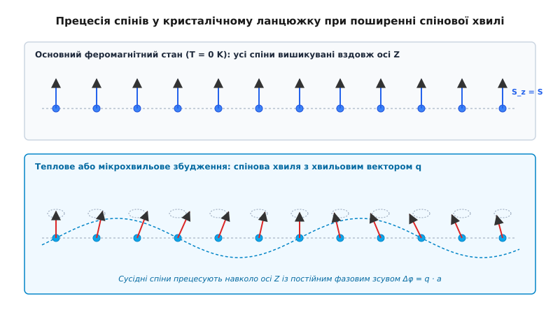
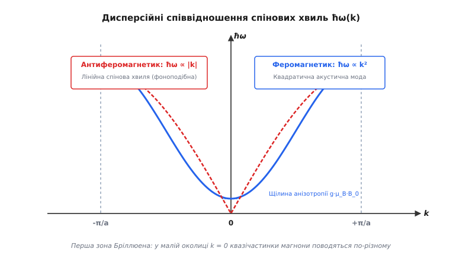
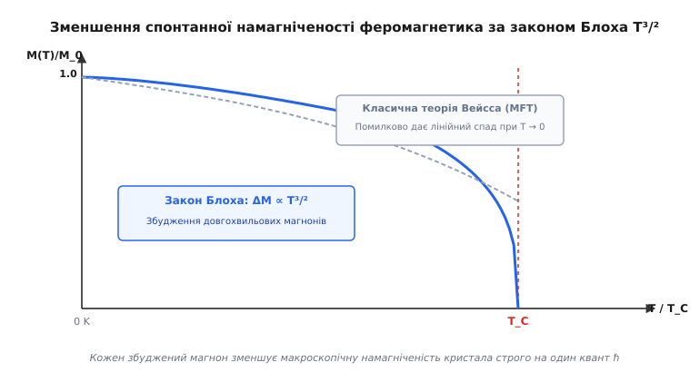
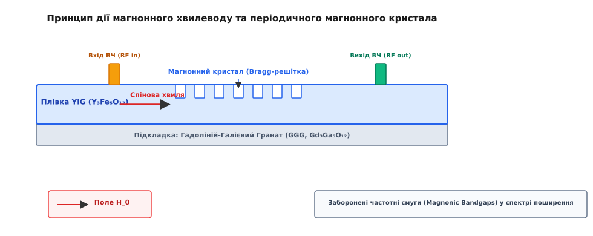

# Спінові хвилі та магнони

<preknowlist>
- [Феромагнетизм](topic:physics/ferromagnetism) — спонтанне магнітне впорядкування електронних спінів під дією обмінної взаємодії.
- [Обмінна взаємодія](topic:physics/exchange-interaction) — квантово-механічний ефект впорядкування спінів через принцип Паулі.
- [Точка Кюрі](topic:physics/curie-temperature) — температура фазового переходу з феромагнітного стану в парамагнітний.
- [Фонон](topic:physics/phonon) — квазічастинка теплових коливань кристалічної ґратки.
</preknowlist>

Охолодивши кристалічний зразок заліза або залізо-ітрієвого гранату до кріогенної температури `4.2 K`, ми спостерігаємо практично ідеальне феромагнетичне впорядкування: трильйони електронних спінів вишикувані строго паралельно один одному вздовж напрямку спонтанної намагніченості. Якщо тепер передати цій магнітній системі мізерну теплову енергію, підвищивши температуру лише на 1 Кельвін, середня енергія теплового руху `k_B · T ≈ 0.086 меВ` виявиться у тисячу разів меншою за локальну енергію обмінного зв'язку між сусідніми спінами (`2 · J · S ≈ 10–100 меВ`). З погляду класичної фізики, жоден окремий електрон у кристалі не здатен отримати порцію енергії, достатню для повного перевороту свого спіна проти напрямку внутрішнього обмінного поля. Здавалося б, магнітна система повинна залишатися повністю «замороженою» і не реагувати на такі мізерні теплові збудження.

Проте прецизійні експериментальні виміри за допомогою надпровідних СКВІД-магнетометрів свідчать про протилежне: навіть за найнижчих кріогенних температур спостерігається неперервне й монотонне спадання спонтанної намагніченості. Цей фундаментальний фізичний парадокс розв'язується завдяки тому, що магнітна система твердого тіла реагує на збудження не локальними «переворотами» поодиноких спінів, а виникненням когерентних колективних коливань — **спінових хвиль** (*spin waves*). Квантами цих колективних збуджень виступають квазічастинки **магнони** (*magnons*). Вивчення спінових хвиль є ключем до розуміння термодинаміки магнетиків, а також створює підґрунтя для магноніки — квантової обчислювальної технології майбутнього.

---

### 1. Механізм спінової хвилі: колективна прецесія замість локального перевороту

Щоб зрозуміти мікроскопічну природу спінової хвилі, розглянемо модельний ідеальний кристал — одновимірний ланцюжок одинакових атомних спінів `S`, пов'язаних між собою квантовою обмінною взаємодією Гейзенберга. За відсутності теплових збуджень (`T = 0 K`) кристал перебуває у найнижчому енергетичному стані (основній фазі): усі спінові вектори орієнтовані строго паралельно уздовж осі `Z`.


*Прецесія спінів у кристалічному ланцюжку: у верхній панелі показано основний феромагнітний стан (T = 0 K); у нижній панелі — спінову хвилю з хвильовим вектором q, де сусідні спіни прецесують навколо осі Z із постійним фазовим зсувом Δφ = q · a.*

При появі теплового або зовнішнього мікрохвильового збудження магнітна система не витрачає енергію на повний переворот одного окремого спіна на 180° (що вимагало б подолання величезного обмінного бар'єра `2 · J`). Натомість отримана енергія збудження розмазується по всьому кристалу. Кожен спіновий вектор `S_i` відхиляється від осі `Z` лише на надзвичайно малий кут `θ`, але починає неперервно прецесувати навколо осі `Z` із частотою `ω`.

Геометрично траєкторія кінця кожного спінового вектора утворює конус прецесії на одиничній сфері Блоха. Компоненти векторів можна записати у вигляді:

```
S_x,i(t) = S · sin(θ) · cos(ω·t - q·r_i)
S_y,i(t) = S · sin(θ) · sin(ω·t - q·r_i)
S_z,i(t) = S · cos(θ) ≈ S - (S_x,i² + S_y,i²) / (2·S)
```

Ключова особливість спінової хвилі полягає у тому, що прецесія кожного наступного спіна у ґратці відбувається з постійним фазовим зсувом `Δφ = q · a` відносно свого сусіда, де `q` — хвильовий вектор спінової хвилі, а `a` — стала кристалічної ґратки. Поперечні компоненти намагніченості `S_x` та `S_y` утворюють гармонічну хвилю прецесії, що біжить уздовж кристала зі швидкістю `v = ω / q`. Вона переносить момент імпульсу `ħ` уздовж кристала без жодного переміщення електричних зарядів, що повністю ліквідує джоулеві втрати.

#### Еліптичність прецесії у магнітоанізотропних середовищах
У загальному випадку кубічної або одновісної магнітної анізотропії конус прецесії спінового вектора перестає бути круговим і набуває еліптичної форми. Еліптичність прецесії описується коефіцієнтом еліптичності `ε = S_y / S_x = √((B_0 + 4·π·M_s) / B_0)`.

При сильно вираженій еліптичності поперечні компоненти намагніченості `S_x` та `S_y` мають неоднакові амплітуди коливань, що призводить до квантово-механічного стиснення магнонного вакууму (стиснені магнонні стани / *squeezed magnons*). Стиснені магнонні моди характеризуються зниженим рівнем квантових флуктуацій в одній із фазових квадратур, що дає змогу підвищити чутливість магнонних квантових сенсорів за межу стандартного квантового порогу.

#### Чому довга хвиля потребує мізерної енергії
Фізична причина винятково малої енергії спінових хвиль полягає у симетрії обмінної взаємодії. Гамільтоніан Гейзенберга `H = -2 · J · ∑ (S_i · S_i+1)` залежить від скалярного добутку сусідніх спінових векторів:

```
S_i · S_i+1 = S² · cos(Δφ)
```

Розклавши косинус за малими кутами фазового зсуву `Δφ = q · a ≪ 1`:

```
S_i · S_i+1 ≈ S² · (1 - (q · a)² / 2)
```

Зі збільшенням довжини хвилі `λ = 2·π / q` (тобто при `q → 0`) фазовий кут між сусідніми спінами `Δφ` стає нескінченно малим. Енергетична різниця між основным станом та станом зі спіновою хвилею зменшується квадратнично за хвильовим вектором (`ΔE ∝ q²`). При `q → 0` енергія спінової хвилі прямує до нуля. Саме тому навіть найменше теплове коливання здатне збудити в кристалі довгохвильову спінову хвилю.

Докладніше про драматичну хроніку суперечностей теорії молекулярного поля, відкриття Фелікса Блоха 1930 року та розшифрування спінових хвиль дивіться у вставці [Історія концепції спінових хвиль та закону Блоха](topic:physics/spin-wave/hist-bloch-magnons.md).

---

### 2. Дисперсійні співвідношення: феромагнетики, антиферомагнетики та феримагнетики

Залежність частоти спінової хвилі `ω` (або її енергії `E = ħ·ω`) від хвильового вектора `q` називається **дисперсійним співвідношенням** (*dispersion relation*). Форма дисперсійної кривої визначається внутрішньою магнітною симетрією кристала, типом домінуючої взаємодії та геометричним виміром матеріалу.


*Дисперсійні співвідношення спінових хвиль ħω(k): феромагнетики володіють квадратичним спектром із щілиною анізотропії (синя лінія), тоді як у бідіпольних антиферомагнетиках дисперсія є лінійною (червона пунктирна лінія).*

#### 1. Феромагнетики: квадратичний закон дисперсії
У тривимірному феромагнетику з кубічною решіткою розв'язок лінеаризованого рівняння Ландау — Ліфшиця для малих хвильових векторів (`q·a ≪ 1`) дає **квадратичну залежність частоти від хвильового вектора**:

```
ħ · ω(q) = g · μ_B · B_0 + K_an + D · q²
```

де `g` — фактор Ланде, `μ_B` — магнетон Бора, `B_0` — зовнішнє магнітне поле, `K_an` — енергія кристалографічної магнітної анізотропії, а `D = 2 · J · S · a²` — **коефіцієнт жорсткості спінової хвилі** (*spin-wave stiffness*).

Наявність зовнішнього магнітного поля та кристалографічної анізотропії утворює **анізотропну щілину** у спектрі `ħ·ω_0 = g·μ_B·B_0 + K_an`. Це означає, що навіть при `q = 0` (однорідна прецесія всього макроскопічного домену) для збудження спінової хвилі необхідно подолати поріг частоти феромагнітного резонансу (ФМР).

З квадратичного закону дисперсії випливають дві важливі швидкості поширення сигналів:
- **Фазова швидкість (`v_p = ω / q`):** Для довгохвильових магнонів `v_p = (D / ħ) · q`. Фазова швидкість зростає лінійно з ростом хвильового вектора.
- **Групова швидкість (`v_g = dω / dq`):** Для квадратичного спектра `v_g = (2 · D / ħ) · q = 2 · v_p`. Групова швидкість удвічі перевищує фазову, що призводить до характерного дисперсійного розпливання хвильових пакетів у просторі під час поширення.

#### 2. Антиферомагнетики: лінійний фононоподібний спектр
В антиферомагнетиках кристал розбивається на дві вкладені магнітні підґратки `A` та `B` із протилежно орієнтованими моментами (`S_A = -S_B`). При збудженні спінової хвилі відхиляються спіни обох підґраток. Завдяки компенсації спонтанного моменту та використанню боголюбовського перетворення діагоналізації, закон дисперсії магнонів при `q → 0` стає **лінійним**:

```
ħ · ω_AFM(q) ≈ ħ · v_s · |q|
```

де `v_s = 2 · √2 · |J| · S · a / ħ` — швидкість антиферомагнітних спінових хвиль.

Математично спектр антиферомагнітних магнонів ідентичний спектру акустичних фононів або фотонів у вакуумі. Оскільки швидкість спінових хвиль в антиферомагнетиках сягає колосальних значень `10⁴ – 10⁵ м/с` (на два порядки вище, ніж у феромагнетиках), антиферомагнітна магноніка дозволяє створювати пристрої надшвидкої обробки інформації у терагерцовому діапазоні частот (`0.1 – 10 ТГц`).

Частота антиферомагнітного резонансу (АФМР) в нульовому зовнішньому полі визначається геометричним середнім обмінного поля `B_E` та поля анізотропії `B_K`:

```
ω_AFMR = γ · √(2 · B_E · B_K + B_K²)
```

Оскільки ефективне обмінне поле сягає сотень Тесла (`B_E ≈ 100–500 Т`), частота АФМР природним чином лежить у терагерцовому діапазоні (0.1–3 ТГц), на відміну від гіперчастот ФМР у феромагнетиках (1–30 ГГц).

Крім того, антиферомагнітні спінові хвилі володіють двома виродженими модами циркулярної поляризації (лівополяризованою та правополяризованою прецесією). Цей додатковий ступеній вільності слугує аналогом спінового стану фотонів для побудови антиферомагнітної магнонної логіки.

#### 3. Феримагнетики та спінові системи з DMI-взаємодією
У феримагнетиках (таких як YIG або ферити-шпінелі) спінові підґратки є нееквівалентними (`S_A ≠ S_B`). Дисперсійний спектр розщеплюється на дві гілки:
- **Акустична магнонна мода:** Низькочастотна гілка із квадратичним законом `ω ∝ q²`, у якій магнітні моменти підґраток прецесують синфазно.
- **Оптична магнонна мода:** Високочастотна гілка з великою енергетичною щілиною `ħ·ω_opt ≈ 2·|J|·|S_A - S_B|`, у якій моменти прецесують у протифазі.

У кристалах без центру інверсії (наприклад, у наноплівках `Co/Pt` або кристалах `MnSi`) спін-орбітальна взаємодія викликає додатковий асиметричний обмін — **взаємодію Дзялошинського — Морія** (*Dzyaloshinskii-Moriya Interaction*, DMI):

```
E_DMI = -D_DM · ∑ (d_ij · (S_i × S_j))
```

DMI наводить асиметрію в законі дисперсії `ω(q) ≠ ω(-q)`, роблячи поширення спінових хвиль хіральним та невзаємним. Це відкриває можливість проектування магнонних діодів, у яких спінові хвилі проходять лише в одному напрямку, а також стабілізує кіральні топологічні структури — магнітні скірміони.

#### 4. Кросовер дипольної та обмінної взаємодій у тонких плівках
У дійсних планарних структурах на спінову хвилю діють два різні типи сил:
- **Короткосяжна обмінна взаємодія:** Домінує при великих хвильових векторах (`q > 10⁶ см⁻¹`, `λ < 100 нм`), забезпечуючи квадратичний внесок `D · q²`.
- **Довгосяжна диполь-дипольна (магнітостатична) взаємодія:** Домінує при малих хвильових векторах (`q < 10⁵ см⁻¹`, `λ > 1 мкм`), створюючи анізотропні **магнітостатичні хвилі** (*magnetostatic waves*).

Залежно від напрямку підмагнічування та поширення хвилі виділяють три класи магнітостатичних хвиль:
1. *Поверхневі хвилі Деймона — Ешбаха (DESSW):* поле `B_0` у площині, `B_0 ⊥ q`. Хвиля локалізується біля верхньої або нижньої поверхні плівки й володіє суворою невзаємністю: зміна напрямку поширення `q ↦ -q` переносить магнонову енергію з верхньої поверхні на нижню.
2. *Об'ємні зворотні хвилі (BVMSW):* поле `B_0` у площині, `B_0 ∥ q`. Дисперсія має від'ємну групову швидкість (`dω/dq < 0`), оскільки внутрішнє розмагнічувальне дипольне поле протидіє фазовому зсуву.
3. *Об'ємні прямі хвилі (FVMSW):* поле `B_0` перпендикулярне до площини. Дисперсія є просторово ізотропною з додатною груповою швидкістю.

Повний математичний вивід прецесійного рівняння Ландау — Ліфшиця, операторів Гольштейна — Примакова та перетворення Боголюбова наведено у вставці [Математика спінових хвиль: дисперсія та квантування](topic:physics/spin-wave/math-spin-wave-dispersion.md).

---

### 3. Квантування спінових хвиль: магнони як квазічастинки

Згідно з принципами квантової механіки, енергія колективних коливань спінової системи квантується. Квант спінової хвилі називається **магноном**.

Використовуючи точне операторне перетворення Гольштейна — Примакова (1940), оператори спіна `S_i^+`, `S_i^-`, `S_i^z` виражаються через бозівські оператори народження `a_q^†` та знищення `a_q` магнонів у стані з хвильовим вектором `q`:

```
S_i^+ = √(2·S) · √(1 - a_i^†·a_i / (2·S)) · a_i
S_i^z = S - a_i^†·a_i
```

За умов низьких температур (`⟨a_i^†·a_i⟩ ≪ 2·S`) корінь розкладається в ряд, і гамільтоніан Гейзенберга набуває вигляду суми квантових гармонічних осциляторів:

```
H = E_0 + ∑ ħ·ω(q) · (a_q^† · a_q + 1/2)
```

Кожен збуджений магнон володіє чітко визначеними корпускулярними характеристиками:
1. **Квант енергії:** `E = ħ · ω(q)`.
2. **Квазіімпульс:** `p = ħ · q`.
3. **Власний спіновий момент:** `ΔS_z = -ħ` (або `-g · μ_B`). Кожен магнон у феромагнетику зменшує загальну проєкцію магнітного моменту кристала строго на один квант `ħ`.

#### Статистика Бозе — Ейнштейна та закон Блоха `T³/²`
Оскільки магнони мають цілочисельний спін (в одиницях `ħ`), вони підпорядковуються статистиці Бозе — Ейнштейна. За умов термодинамічної рівноваги середня кількість магнонів у стані з енергією `ħ·ω(q)` описується функцією розподілу:

```
⟨n_q⟩ = 1 / [exp(ħ·ω(q) / (k_B·T)) - 1]
```

Оскільки кількість магнонів у кристалі не зберігається (магнони можуть вільно народжуватися та поглинатися кристалічною ґратною при зміні температури), хімічний потенціал магнонного газу в рівновазі дорівнює нулю (`μ = 0`).


*Зменшення спонтанної намагніченості феромагнетика: квантовий закон Блоха T³/² (синя крива) точно описує пригнічення намагніченості магнонами при низьких температурах, на відміну від класичної теорії Вейсса (сірий пунктир).*

Інтегрування кількості теплових магнонів по всьому об'єму першої зони Бріллюена із квадратичним законом дисперсії `ħω = D·q²` приводить до знаменитого **закону Блоха трьох других**:

```
ΔM(T) / M(0) = (M(0) - M(T)) / M(0) = B · T³/²
```

де `B = [ζ(3/2) / (32 · π³/²)] · [k_B / (2·J·S)]³/²` — стала Блоха, а `ζ(3/2) ≈ 2.6124` — дзета-функція Рімана. Безрозмірний обчислений коефіцієнт дорівнює `0.0587`.

Закон Блоха `T³/²` є фундаментальною основою кріогенної магнітної термодинаміки. Він показує, що саме збудження довгохвильових магнонів відповідальне за плавну втрату намагніченості феромагнетиків при віддаленні від абсолютного нуля.

#### Теорема Мерміна — Вагнера у низьковимірних магнетиках
Розмірність простору `d` відіграє критичну роль у термодинаміці спінових хвиль:
- **Тривимірні магнетики (3D):** Інтеграл для кількості теплових магнонів `∫ (q² dq) / q² = ∫ dq` збігається на нижній межі `q → 0`. Це забезпечує стійкість спонтанного магнітного порядку за ненульових температур `T > 0 K`.
- **Двовимірні магнетики (2D):** Інтеграл `∫ (q dq) / q² = ∫ dq / q = ln(q)|_0` логарифмічно розбігається у нулі.
- **Одновимірні магнетики (1D):** Інтеграл `∫ dq / q² = -1/q|_0` розбігається за степеневим законом.

Цей аналіз є физичною основою **теореми Мерміна — Вагнера** (1966): в ізотропних 1D та 2D магнітних системах із короткосяжною взаємодією спонтанний магнітний порядок за ненульових температур є неможливим. Будь-яке теплове збудження за вищих за нуль температур породжує нескінченну кількість довгохвильових магнонів, повністю руйнуючи далекий порядок. Лише наявність магнітної анізотропії `K_an > 0` вносить енергетичну щілину у спектр магнонів, що зрізає розбіжність і робить можливим двовимірний феромагнетизм (як у моношарах `CrI_3` та `Fe_3GeTe_2`).

---

### 4. Взаємодія магнонів та квантові феномени високої густини

При низьких температурах густина магнонного газу мала, і магнони поводяться як майже ідеальний невзаємодіючий газ квазічастинок. Проте зі зростанням температури або під дією потужного зовнішнього мікрохвильового накачування густина магнонів стрімко зростає, що активує ефекти магнон-магнонної та магнон-фононної взаємодії.

#### 1. Взаємодія магнонів між собою (процеси розсіювання)
Згідно з теорією Фрімана Дайсона (1956), магнони зазнають двох типів взаємодій:
- **Кінематична взаємодія:** Наслідок принципу заборони Паулі для вихідних електронів — на одному атомному вузлі не може перебувати більше ніж `2·S` магнонних збуджень.
- **Динамічна взаємодія:** Пряме обмінне розсіювання магнонів один на одному. Основним процесом є чотиримагнонне розсіювання (`q_1 + q_2 ⇄ q_3 + q_4`), при якому зберігаються сумарна енергія та квазіімпульс.

При високих амплітудах збудження чотиримагнонні процеси викликають нелінійну **нестійкість Сула** (*Suhl instability*), що призводить до самовільного розпаду однорідної прецесії на пари магнонів із протилежними хвильовими векторами `q` та `-q` при досягненні порогової амплітуди ВЧ-поля `h_th`.

В областях із від'ємною груповою дисперсією баланс між нелінійним зсувом частоти та дисперсійним розпливанням формує стійкі магнонні солітони огинаючої — самофокусовані магнітні хвильові пакети, що поширюються без зміни своєї форми.

#### 2. Магнон-фононна взаємодія та магнон-поляритони
Коливання магнітних спінів зв'язані з механічними коливаннями кристалічної ґратки через **магнітострикційну (магнітоеластичну) взаємодію**. Коли дисперсійні криві магнонів `ħ·ω_mag(q)` та акустичних фононів `ħ·ω_phon(q) = ħ·v_sound·q` перетинаються, виникає гібридизація спектра — утворюються **магнон-фононні поляритони** (*magnon-phonon polaritons*) із забороненою енергетичною щілиною у точці перетину.

#### 3. Бозе-ейнштейнівська конденсація магнонів за кімнатної температури
У 2006 році група німецьких фізиків під керівництвом Сергія Демокрітова та Михайла Костильова здійснила фундаментальне відкриття: вони експериментально продемонстрували **бозе-ейнштейнівську конденсацію (БЕК) магнонів за кімнатної температури** у тонкій плівці залізо-ітрієвого гранату (YIG).

Використовуючи метод безперервного параметричного мікрохвильового накачування на частоті `8.1 ГГц`, дослідники інжектували у плівку товщиною 5 мкм надлишкову густину магнонів. Завдяки швидким чотиримагнонним процесам термалізації, надлишкові магнони стекали у найнижчий доступний енергетичний стан спектра з `q = q_min ≈ 3 × 10⁴ см⁻¹`. При досягненні критичної густини магнонний газ самодовільно конденсувався в один макроскопічний квантовий стан із єдиною фазою, продемонструвавши макроскопічну квантову когерентність за температури 300 K.

Фаза магнонного конденсату описується єдиною нелінійною хвильовою функцією Гросса — Пітаєвського:

```
i · ħ · (∂Ψ / ∂t) = - (ħ² / 2·m_mag*) · ∇² Ψ + U_int · |Ψ|² · Ψ
```

де `m_mag* = ħ² / (2·D)` — ефективна маса магнона, а `U_int` — константа магнон-магноного відштовхування.

---

### 5. Експериментальні методи дослідження спінових хвиль

Розвиток фізики спінових хвиль спирається на чотири ключові методи експериментальної спектроскопії:

1. **Феромагнітний резонанс (ФМР) та спін-хвильовий резонанс (СХР):**
   Зразок розміщують у мікрохвильовому резонаторі у зовнішньому магнітному полі `B_0`. ВЧ-поле частотою `1–40 ГГц` збуджує однорідну прецесію (`q = 0`). Резонансна частота описується формулою Кіттеля `ω_FMR = γ · √(B_0 · (B_0 + 4·π·M_s))`. Ширина лінії ФМР `ΔH` дозволяє прямо виміряти коефіцієнт згасання Гільберта `α_G`. У тонких плівках із закріпленими граничними спінами збуджуються стоячі моди спінових хвиль (СХР), що дозволяє прямо виміряти коефіцієнт обмінної жорсткості `D`.

2. **Спектроскопія мандельштам-бріллюенівського розсіювання світла (BLS):**
   Лазерний промінь фокусується на поверхні магнітної плівки. Фотони світла непружно розсіюються на спінових хвилях, поглинаючи або народжуючи магнон. Вимірювання зсуву частоти та кута розсіювання світла за допомогою багатопрохідного інтерферометра Фабрі — Перо дозволяє картографувати дисперсію `ω(q)` з просторовим розділенням до `200 нм`.

3. **Непружне розсіювання теплових нейтронів (INS):**
   Фундаментальний метод спектроскопії монокристалів (розроблений Бертрамом Брокгаузом, Нобелівська премія 1994). Нейтрони, маючи власний спін `1/2` та магнітний момент, взаємодіють безпосередньо з електронними спінами ґратки. Вимірювання енергії та імпульсу розсіяних нейтронів дає повну карту дисперсії магнонів по всій зоні Бріллюена (`q` від `0` до `π/a`).

4. **Магнетометрія на NV-центрах у алмазі:**
   Використання поодиноких азотно-вакансійних центрів (NV-centers) у кристалчиках алмазу дозволяє здійснювати локальне картографування спінових хвиль та магнонних струмів із просторовою роздільною здатністю до `10–20 нм`.

---

### 6. Магноніка: логіка, пристрої та майбутнє спінтроніки

Завдяки відсутності джоульових втрат на нагрівання та високій робочій частоті спінові хвилі стали основою для створення нової обчислювальної парадигми — **магноніки** (*magnonics*).


*Принцип дії магнонного хвилеводу та магнонного кристала: мікросмужкова вхідна антена збуджує спінову хвилю в плівці залізо-ітрієвого гранату (YIG), яка поширюється крізь періодичну Bragg-решітку з формуванням магнонних заборонених зон.*

#### 1. Елементна база магноніки
- **Магнонні хвилеводи:** Тонкі смужки монокристалічних плівок YIG або пермалою, які каналізують поширення спінових хвиль.
- **Магнонні кристали:** Структури з періодичною модуляцією товщини або намагніченості, що створюють заборонені частотні смуги (*magnonic bandgaps*) для фільтрації та затримки сигналів.
- **Інтерферометричні логічні вентилі:** Пристрої (типу інтерферометра Маха — Цендера), у яких логічні операції **НІ (NOT)**, **І (AND)**, **XOR** виконуються за рахунок конструктивної або деструктивної інтерференції двох спінових хвиль. Phase shifter регулює фазу спінової хвилі в одному з плечей інтерферометра за рахунок локального Оерстедівського поля.

#### 2. Спін-орбітальні інтерфейси та спіновий пампінг
Для узгодження магнонних каналів зв'язку з класичними електронними колами застосовують ефекти спін-орбітальної взаємодії у двошарових гетероструктурах важкий метал / феромагнетик (наприклад, `Pt / YIG` або `Ta / YIG`):
- **Прямий спіновий ефект Холла (SHE):** Проходження електричного струму скрізь платиновий контакт викликає спінову сегрегацію електронів і генерирує спіновий струм, який за допомогою спін-орбітального моменту (SOT) інжектує магнони у плівку YIG.
- **Обернений спіновий ефект Холла (ISHE):** Спінова хвиля, що дисипує біля платинового електрода, наводить електричну напругу `V_ISHE`, зчитуючи хвильовий сигнал назад у вигляді електричного потенціалу.
- **Спіновий накачувальний ефект (Spin Pumping):** Прецесія намагніченості у феромагнетику виштовхує чистий спіновий струм `j_s` у прилеглий шар важкого металу, що супроводжується додатковим згасанням Гільберта `Δα_G = (g·μ_B·γ / (4·π·M_s·d_FM)) · g_↑↓`.

---

### 7. Топологічна магноніка та магнонні скірміони

Останніми роками стрімко розвивається **топологічна магноніка** (*topological magnonics*). Завдяки кіральним обмінним взаємодіям (DMI) або геометричному розмірному квантуванню, у спектрі магнонних кристалів виникають магнонні смуги з ненульовим індексом Черна `C_n ≠ 0`.

Інтегрування кривини Беррі `Ω(q)` по зонах Бріллюена виражається точним топологічним інваріантом:

```
C_n = (1 / (2·π)) · ∬ Ω_n(q) d²q
```

На межах розділу між топологічно відмінними магнонними кристалами виникають **односпрямовані крайні магнонні моди**. Ці спінові хвилі володіють топологічним захистом: вони поширюються строго в одному напрямку та здатні огинати гострі кути і структурні дефекти без зворотного розсіювання, оскільки зворотні квантові стани відсутні у магнонному спектрі.

Крім того, спінові хвилі здатні ефективно взаємодіяти з топологічними магнітними текстурами — магнітними скірміонами. Розсіювання магнонів на скірміоні викликає ефект магнонного Холла (відхилення магнонного променя) та передачу спінового моменту, що дозволяє рухати скірміони вздовж нанохвилеводів зі швидкостями понад `100 м/с` за допомогою суто магнонних струмів без виділення джоульового тепла.

---

### 8. Нейроморфні магнонні обчислення та квантова кавіті-магноніка

Магноніка виходить далеко за межі традиційної булевої логіки, пропонуючи принципово нові обчислювальні архітектури:

- **Нейроморфна магноніка (Reservoir Computing):** Завдяки вираженій нелінійності магнон-магнонного розсіювання та багатомодовій інтерференції, магнонна мікроструктура здатна функціонувати як фізичний резервуар для штучних нейронних мереж. Вхідні мікрохвильові сигнали розкладуються у багатовимірний простір non-linear магнонних мод, дозволяючи виконувати розпізнавання образів та сигналів за наносекундні інтервали часу.
- **Квантова кавіті-магноніка (Cavity Quantum Magnonics):** Поєднуючи монокристалічну сферу YIG із мікрохвильовим фотонним резонатором, фізики досягають режиму сильного квантового зв'язку (`g > κ, γ`). Колективне збудження 10¹⁵ спінів поводиться як єдина квантова дворевнева система, що здатна когерентно обмінюватися одиночними квантами (магнонами й фотонами) із надпровідниковими транзмонними кубітами. Це робить магнони перспективними мікрохвильовими квантовими шинами та вузлами квантової пам'яті.

---

### 9. Перспективні матеріальні платформи для магноніки

Швидкий прогрес фізики спінових хвиль стимулював пошук та синтез нових матеріальних систем:

1. **Альтермагнетики (Altermagnets):** Відкритий у 2022 році третій фундаментальний клас магнетизму (наприклад, `RuO_2`, `Mn_5Si_3`). Вони поєднують компенсацію макроскопічного магнітного моменту (як в антиферомагнетиках) із імпульсно-залежним спіновим розщепленням електронних зон `d`- або `g`-симетрії (як у феромагнетиках). Альтермагнітні магнони володіють терагерцовими частотами та надвисокими швидкостями без паразитного поля розсіювання.
2. **Двовимірні ван-дер-ваальсові магнетики:** Атомно тонкі моношари `CrI_3`, `Cr_2Ge_2Te_6` та `Fe_3GeTe_2`. Завдяки вираженій магнітній анізотропії вони долають теорему Мерміна — Вагнера, дозволяючи будувати 2D магнонні нанопристрої атомної товщини.
3. **Органічні феромагнетики та феримагнетики:** Матеріали на основі органічних молекулярних сполук (такі як `V[TCNE]_x`). Вони поєднують рекордне для органіки низьке згасання Гільберта (`α_G ≈ 4 × 10⁻⁵`) із легкістю хімічного синтезу при кімнатній температурі.

---

### 10. Фізичні обмеження та інженерні виклики магноніки

При розробці практичних магнонних мікропроцесорів інженери зіштовхуються з трьома основними фізичними обмеженнями:

1. **Дисипативне згасання спінових хвиль:** Навіть у найкращих плівках YIG із коефіцієнтом згасання `α_G ≈ 10⁻⁵` характерна довжина пробігу магнонів обмежена величинами `10–100 мкм` для дипольних хвиль та `1–5 мкм` для коротких обмінних хвиль. Для компенсації втрат застосовують параметричне підсилення або інжекцію спінового струму (SOT).
2. **Теплові шуми за кімнатної температури:** За `T = 300 K` теплі флуктуації створюють високий магнонний шум, який обмежує відношення сигнал/шум (SNR) у низькоамплітудних магнонних логічних елементах.
3. **Ефективність конверсії ВЧ-сигналу в магнони:** Перетворення електричного мікрохвильового сигналу у спінову хвилю за допомогою індуктивних мікроантен супроводжується втратами узгодження імпедансів (`10–20 дБ`), що вимагає використання спін-орбітальних інтерфейсів високої ефективності.

#### Порівняльний аналіз магноніки, електроніки та фотоніки

| Параметр | Зарядова електроніка (CMOS) | Магноніка (Spin Waves) | Фотоніка (Integrated Optics) |
| :--- | :--- | :--- | :--- |
| **Носій інформації** | Електричний заряд (`e⁻`) | Спінова хвиля / Магнон | Фотон світла |
| **Перенесення маси/заряду** | Наявне (рух електронів) | **Відсутнє** (прецесія) | **Відсутнє** |
| **Джоулеве тепловиділення** | Високе (`I²·R`) | **Вкрай низьке** | Незначне |
| **Типова частота** | `1 – 4 ГГц` | **`10 – 1000 ГГц`** | `200 – 400 ТГц` |
| **Характерна довжина хвилі** | — | **`10 нм – 1 мкм`** | `500 нм – 1.5 мкм` |
| **Мініатюризація (найменший розмір)** | `3 – 5 нм` | **`< 10 нм`** | `200 – 300 нм` (дифракційна межа) |
| **Логічна обробка** | Зарядові транзистори | **Хвильова інтерференція** | Оптична інтерференція |

> 🔧 **Навіщо це.**
> Традиційна кремнієва CMOS-електроніка досягла фізичної межі масштабування через гігантські витоки струму та тепловиділення на частотах понад 4 ГГц. Магноніка дозволяє здійснювати аналогову обробку інформації та виконувати логічні операції на частотах `10–100 ГГц` у нанометрових хвилеводах, витрачаючи на 2–3 порядки менше енергії, оскільки у магнонному каналі зв'язку повністю відсутнє перенесення заряду й джоульовий опір.

Докладніше про фізичні параметри YIG, геометрію магнітостатичних хвиль та порівняльний аналіз магноніки з полупровідниковою CMOS-технологією читайте у вставці [Магнонні кристали та хвилеводи на основі залізо-ітрієвого гранату](topic:physics/spin-wave/comp-yig-magnonics.md).

Практичну програмну реалізацію чисельного симулятора LLG на мовах C++ та Python з розрахунком еволюції хвильового пакета та побудовою спектрально-дисперсійної карти 2D FFT наведено у вставці [Чисельне моделювання спінових хвиль на решітці](topic:physics/spin-wave/proj-spin-wave-sim.md).
