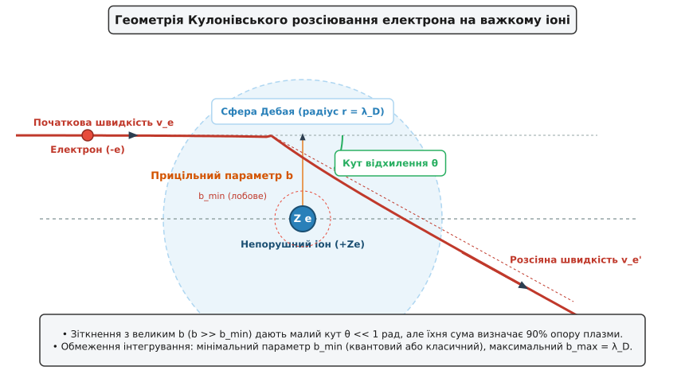
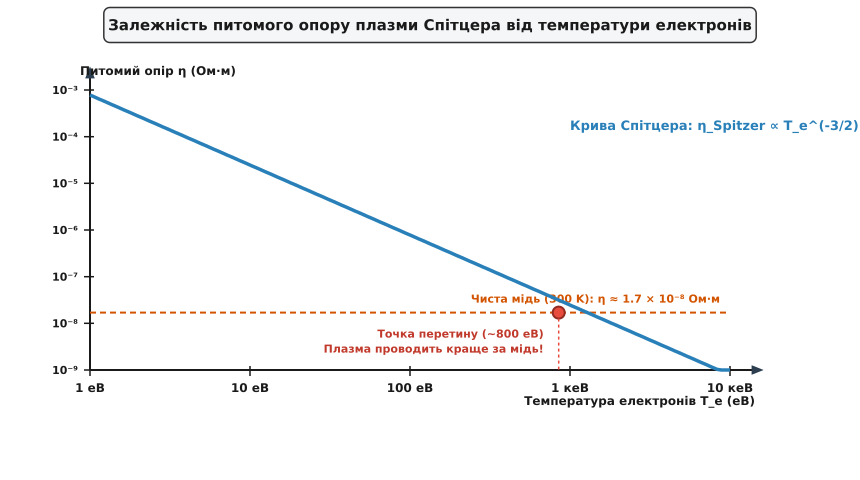
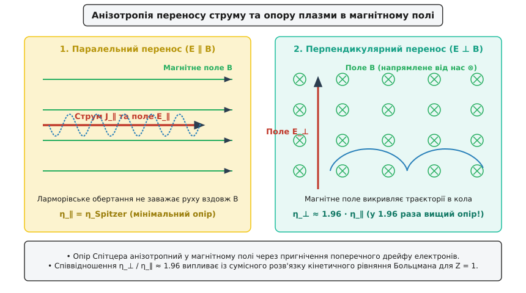

# Опір Спітцера та провідність іонізованої плазми

<preknowlist>
- [Питомий опір](book:physics/resistivity) — електричний опір одиничного об'єму речовини.
- [Довжина екранування Дебая](book:physics/debye-length) — радіус екранування електростатичного поля носіїв у плазмі.
- [Плазмові коливання і плазмони](book:physics/plasma-oscillations) — колективні високочастотні коливання електронного газу.
- [Дрейф електронів](book:physics/electron-drift) — напрямлений рух носіїв під дією зовнішнього поля.
</preknowlist>

Нагрівання плазми в магнітних пастках для керованого термоядерного синтез (токамаках і стелараторах) або аналіз переносу енергії в надрах зірок наштовхується на фундаментальну властивість повністю іонізованого газу: зі зростанням температури електронів його електричний опір не зростає, як у металевих провідниках, а стрімко спадає за законом температури у ступені мінус півтора. На відміну від звичайних металів, де основними центрами розсіювання носіїв є теплові коливання кристалічної ґратки (фонони), у високотемпературній плазмі електрони рухаються у довгосяжних електростатичних полях іонів. Чим вища кінетична енергія електронів, тим швидше вони пролітають повз іони і тим менше викривляються їхні траєкторії під дією притягання, роблячи гарячу плазму кращим провідником струму, ніж чиста мідь при кімнатній температурі.

Цей ефект уперше теоретично описав американський астрофізик Лайман Спітцер у п'ятдесят третьому році двадцятого століття. Сформульована ним теорія електропровідності повністю іонізованого газу пояснила зв'язок між частотою кулонівських зіткнень, колективним екрануванням Дебая та анізотропією переносу струму в зовнішньому магнітному полі.

*Геометрія прицільного параметра b та кута відхилення θ при Кулонівському зіткненні електрона з іоном.*

## 1. Фізична природа Кулонівських зіткнень та розсіювання у плазмі

У нейтральних газах або у твердих тілах зіткнення носіїв заряду мають характер парних контактних ударів твердих кульок: взаємодія виникає лише тоді, коли відстань між центрами частинок стає меншою за їхній геометричний радіус. У повністю іонізованій плазмі взаємодія між електронами та іонами визначається кулонівським потенціалом, який спадає повільно і діє на великих відстанях.

Коли електрон пролітає повз непорушний іон на відстані прицільного параметра, кулонівська сила відхиляє електрон від початкового напрямку руху. Кут відхилення обернено пропорційний квадрату швидкості електрона та прицільному параметру. З цього випливають дві вирішальні особливості кулонівського розсіювання, які корінним чином відрізняють плазму від твердотільних провідників:

По-перше, виникає сильна залежність від швидкості частинки. Кут відхилення обернено пропорційний кінетичній енергії електрона. Швидкі електрони майже не відчувають притягання іона і пролітають повз нього практично по прямій лінії. Оскільки середня кінетична енергія електронів прямо пропорційна температурі, підвищення температури плазми призводить до того, що електрони розсіюються значно слабше.

По-друге, спостерігається домінування далеких зіткнень на малі кути. Диференціальний переріз розсіювання Резерфорда зростає надзвичайно швидко при зменшенні кута відхилення. Сумарний опір плазми визначається не поодинокими лобовими зіткненнями на великі кути, а дифузійним накопиченням мільйонів послідовних слабких відхилень на малі кути.

Процес зміни напрямку руху електрона під дією численних слабких кулонівських імпульсів нагадує броунівський рух у просторі швидкостей і описується кінетичним оператором Фоккера — Планка. Кожне окреме зіткнення надає лише незначний випадковий поперечний імпульс, але сума цих імпульсів за певний час збиває початковий напрямок руху електрона, розсіюючи його поздовжній дрейфовий струм.

Математично цей процес описується за допомогою кінетичного рівняння Больцмана з інтегралом зіткнень Ландау. Електрони під дією зовнішнього електричного поля набувають середньої дрейфової швидкості, однак кулонівські зіткнення з іонами прагнуть повернути функцію розподілу електронів до ізотропного максвеллівського стану. Рівновага між прискоренням полем та гальмуванням зіткненнями визначає стаціонарну густину електричного струму.

Детальний математичний аналіз розвитку цієї теорії в історичному контексті створення керованого термоядерного синтезу наведено у [історичному нарисі](book:physics/condensed-matter-physics/spitzer-resistivity/hist-spitzer-discovery.md).

## 2. Математичний вивід та формула Спітцера

Для знаходження питомого опору плазми скористаємося феноменологічною моделлю Друде, де опір виражається через масу електрона, ефективну частоту зіткнень електронів з іонами, концентрацію електронів та квадрат елементарного заряду.

Ефективна частота зіткнень визначається як добуток густини іонів, середньої теплової швидкості електронів та транспортного перерізу розсіювання. Транспортний переріз, отриманий інтегруванням по всіх прицільних параметрах від мінімального до максимального, пропорційний квадрату класичного радіуса найближчого зближення та Кулонівському логарифму.

Підставляючи вирази для класичного радіуса та теплової швидкості у частоту зіткнень, отримуємо частоту електрон-іонних зіткнень, яка пропорційна густині іонів, квадрату заряда іона та Кулонівському логарифму і обернено пропорційна температурі у ступені три других.

Враховуючи умову квазінейтральності плазми, підставимо частоту зіткнень у формулу опору Друде. При цьому об'ємна густина плазми повністю скорочується у чисельнику та знаменнику. Фізичне пояснення цього парадокса полягає у взаємній компенсації двох ефектів: при збільшенні густини вдвічі кількість носіїв заряду подвоюється (що мало б підвищити провідність удвічі), але рівно вдвічі зростає і частота розсіювальних іонних центрів. Обидва ефекти точнісько компенсують один одного. Питомий опір повністю іонізованої плазми залежить лише від її температури, заряду іонів та Кулонівського логарифма.

*Залежність питомого опору плазми η ∝ T⑺^(-3/2) від температури електронів у порівнянні з міддю.*

У реальній плазмі електрони розсіюються не лише на іонах, але й один на одному. Електрон-електронні зіткнення не змінюють сумарний імпульс електронної компоненти безпосередньо, але вони викривляють максвеллівський розподіл швидкостей, зменшуючи поздовжній дрейфовий струм. Спітцер і Гярм розв'язали кінетичне рівняння Больцмана з точним інтегралом зіткнень і ввели безрозмірний коефіцієнт поправки, який дорівнює п'яти десятим для чистоводневої плазми.

Для температури електронів в один кілоелектронвольт (близько одинадцяти мільйонів кельвінів) питомий опір плазми становить близько трьох на десять у мінус восьмому ступені Ом-метра, що лише вдвічі перевищує питомий опір чистої міді при кімнатній температурі. При температурі десять кілоелектронвольт (характерній для ядра термоядерного реактора) опір плазми спадає до однієї мільярдної частки Ом-метра — така високотемпературна плазма проводить електричний струм у п'ятнадцять разів краще за чисту мідь.

Порівнюючи провідність плазми з іншими матеріалами, можна відзначити, що при кімнатній температурі срібло має питомий опір одна ціла шість десятих на десять у мінус восьмому ступені Ом-метра, мідь — одна ціла сім десятих, алюміній — дві цілих вісім десятих. Холодна плазма з температурою в один електронвольт має опір близько п'яти на десять у мінус п'ятому ступені Ом-метра, що у три тисячі разів гірше за мідь. Проте при нагріванні до термоядерних температур опір плазми падає нижче будь-яких відомих металевих провідників у нормальному стані.

## 3. Кулонівський логарифм та дебаївське екранування

Формула Спітцера містить співвідношення Кулонівського логарифма, який виражається як логарифм відношення максимального прицільного параметра до мінімального. Без фізичного обмеження цих меж опір плазми прямував би до нескінченності.

Максимальний параметр визначається екрануванням Дебая. Кулонівське поле окремого іона діє не до нескінченності: на відстанях, більших за радіус Дебая, електростатичний заряд іона екранується рухливими електронами плазми. Тому зіткнення з прицільним параметром, більшим за радіус Дебая, відсутні.

Мінімальний прицільний параметр визначається квантовою або класичною межею. Класична межа відповідає відстані найближчого зближення при лобовому зіткненні, де потенціальна енергія дорівнює кінетичній. Квантова межа відповідає тепловій довжині хвилі де Бройля електрона. У високотемпературній плазмі хвильові властивості електрона переважають, тому використовується квантово-механічне обрізання.

Детальний математичний вивід інтеграла зіткнень та таблицю значень Кулонівського логарифма для різних астрофізичних об'єктів наведено у [математичній вставці](book:physics/condensed-matter-physics/spitzer-resistivity/math-coulomb-logarithm.md).

Оскільки даний параметр входить під знаком логарифма, його значення слабко змінюється в широкому діапазоні параметрів плазми (зазвичай в межах від десяти до двадцяти). Це робить опір Спітцера універсальною характеристикою високотемпературного іонізованого газу.

## 4. Анізотропія провідності у зовнішньому магнітному полі

У намагніченій плазмі, де циклотронна частота обертання електронів перевищує частоту зіткнень з іонами, транспортні властивості стають сильно анізотропними.

*Анізотропія переносу струму у магнітному полі: паралельний опір η_∥ та перпендикулярний опір η_⊥.*

Магнітне поле не перешкоджає руху електронів вздовж силових ліній: ларморівська спіраль просто накручується на напрямок магнітного поля. Тому поздовжній питомий опір дорівнює класичному опору Спітцера.

Проте при намаганні пропустити струм у перпендикулярному напрямку, магнітне поле змушує електрони обертатися по колових орбітах радіуса Лармора. Електрон може зміститися в напрямку електричного поля лише тоді, коли зіткнення з іоном змістить центр його ларморівського кола. Аналіз Брагінського показує, що для водневої плазми поперечний питомий опір майже вдвічі вищий за паралельний.

Фізично це пояснюється тим, що при перпендикулярному дрейфі електрон-електронні зіткнення чинять додатковий опір переносу імпульсу, який не виникає при вільному русі вздовж силових ліній.

У загальному випадку закон Ома для намагніченої плазми записується у тензорній формі з урахуванням ефекту Холла, де холлівська провідність описує беззіткновний дрейф плазми у скрещених полях.

## 5. Тікаючі електрони та порогове поле Дрейсера

Оскільки частота кулонівських зіткнень спадає зі зростанням швидкості електрона обернено пропорційно кубу швидкості, сила кулонівського гальмування має максимум при тепловій швидкості і стрімко спадає для швидких електронів.

Якщо до плазми прикласти зовнішнє електричне поле, на кожен електрон діє прискорювальна сила. Зіставляючи цю силу з кулонівським гальмуванням, отримуємо умову безперервного прискорення електрона. Для будь-якого електричного поля існує критична швидкість електрона, починаючи з якої прискорювальна сила перевищує максимальну силу кулонівського тертя.

Електрони, швидкість яких перевищує критичну, переходять у режим неперервного прискорення або режим тікаючих електронів. Вони безперешкодно набирають енергію до релятивістських значень, перетворюючись на пучки високоенергетичних частинок. Порогове поле тотального тікання всього електронного ансамблю називається критичним полем Дрейсера.

Для чисельного розрахунку параметра Дрейсера, критичних швидкостей та компонент тензора Спітцера у довільних фізичних умовах створено [програмну модель](book:physics/condensed-matter-physics/spitzer-resistivity/proj-spitzer-calculator.md).

У токамаках при аварійних зривах плазми раптове охолодження електронів викликає сплеск індукованого електричного поля, яке у сотні разів перевищує поле Дрейсера. Це призводить до формування релятивістських пучків тікаючих електронів зі струмом у кілька мегаампер. Попадання такого пучка на першу стінку реактора може викликати локальне плавлення та пробій вакуумної камери. Для пом'якшення цього ефекту застосовують системи масивної інжекції газу або заморожених паливних пелет (аргону чи неону), які підвищують густину плазми та прискорюють радіаційне охолодження без формування високовольтних полів.

## 6. Межі застосовності теорії Спітцера та неідеальна плазма

Класичний опір Спітцера отримано в припущенні слабкого кулонівського зв'язку та ідеальності плазми. Теорія втрачає чинність у таких граничних режимах:

По-перше, у сильнозв'язаній або неідеальній плазмі, коли потенціальна енергія Кулона перевищує теплову енергію, радіус Дебая стає меншим за середню відстань між іонами. У цьому випадку Кулонівський логарифм прямує до одиниці, а парне наближення розсіювання повністю ламається.

По-друге, спостерігається аномальний опір через розвиток турбулентності. При високих дрейфових швидкостях електронів у плазмі збуджуються іонно-звукові або кінетичні турбулентні хвилі. Електрони розсіюються не на окремих іонах, а на флуктуаціях електричного поля плазмових хвиль, що збільшує ефективний опір у сотні разів порівняно зі спітцерівським.

По-третє, у виродженому електронному газі (у надрах білих карликів чи рідких металах) електрони підкоряються статистиці Фермі — Дирака, і розсіювання визначається енергією Фермі, а не температурою.

## 7. Практичне застосування у сучасних технологіях

Знання опору Спітцера є критично важливим у багатьох галузях сучасної фізики та інженерії:

У керованому термоядерному синтезі опір Спітцера визначає межу омічного нагріву токамаків, час затухання індукованих струмів та швидкість перезамикання магнітних силових ліній.

У астрофізиці теорія Спітцера визначає процеси генерації магнітних полів у зоряному динамо, нагрів сонячної корони, дисипацію струмових шарів у сонячних спалахах та дифузію магнітного поля в акреційних дисках чорних дир.

У плазмових двигунах та технологіях опір Спітцера використовується для розрахунку джоулевих втрат та коефіцієнта корисної дії у стаціонарних плазмових двигунах із ефектом Холла, імпульсних плазмових прискорювачах та потужних Z-пінчах.

Опір Спітцера демонструє унікальну фізику плазми: на відміну від звичайних речовин, високотемпературний іонізований газ стає тим досконалішим провідником, чим сильніше його нагрівають.
