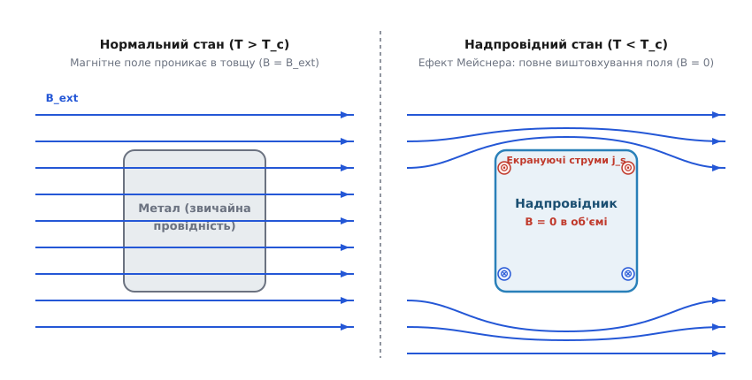
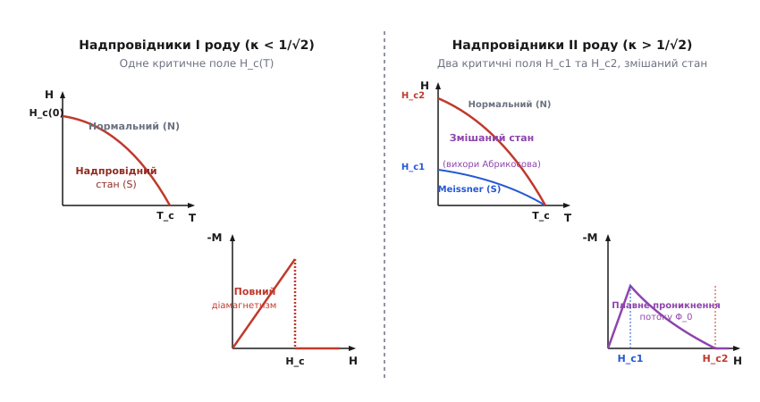
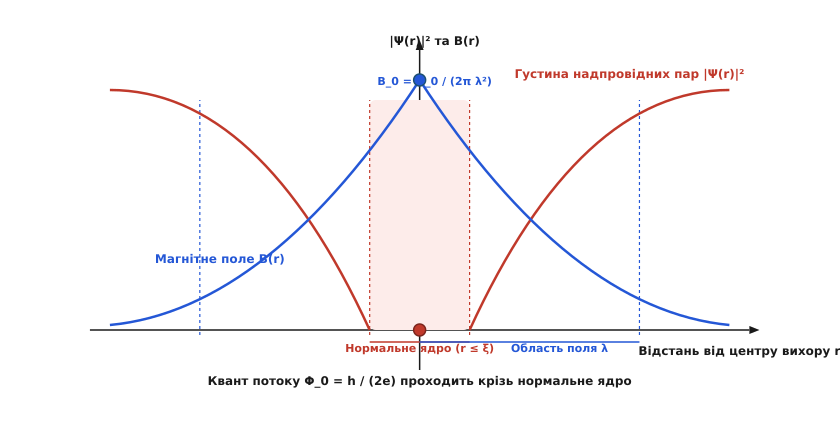
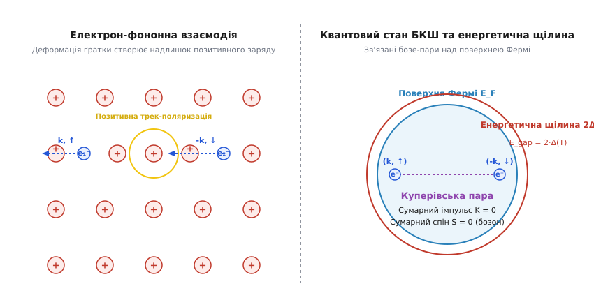

# Надпровідність

<preknowlist>
- [Провідність](book:physics/conductivity) — механізм розсіювання носіїв заряду на фононах та дефектах решітки.
- [Зонна теорія твердого тіла](book:physics/band-theory) — валентна зона, зона провідності, енергія Фермі та поверхня Фермі.
- [Опір і температура](book:physics/resistance-temperature) — залежність питомого опору металів від температури.
- [Феромагнетизм](book:physics/ferromagnetism) — магнітна проникність, вектори B та H, намагніченість речовини.
</preknowlist>

Охолодження звичайного металевого провідника зменшує амплітуду теплових коливань кристалічної ґратки, що приводить крізь розсіювання електронів до плавного зниження питомого опору. Однак навіть біля абсолютного нуля опір звичайного металу не стає нульовим: він виходить на залькове значення, зумовлене розсіюванням на домішках, вакансіях та межах зерен. У надпровідниках відбувається якісний стрибок: при досягненні критичної температури `T_c` електричний опір раптово падає до строгого нуля — вимірюваного значення менше `10⁻²³ Ом·м`. Електричний струм у замкненому надпровідному кільці здатний циркулювати без найменшого згасання десятки років без будь-якого зовнішнього джерела енергії.

Однак стрибок провідності є лише однією з двох невід'ємних граней явища. Якби надпровідник був лише ідеальним провідником з нескінченною провідністю (`σ → ∞`), то за законами класичної електродинаміки магнітне поле, присутнє всередині зразка до охолодження, замерзало б у ньому навалом. Натомість реальний надпровідник при перетині `T_c` повністю виштовхує зовнішнє магнітне поле зі свого об'єму, виявляючи властивості ідеального діамагнетика з магнітною сприйнятливістю `χ = -1`. Природа цього подвійного ефекту полягає в макроскопічній квантовій фазовій coherence електронного конденсату.

Для детальнішого ознайомлення з хронологією наукових перегонів, зрідженням гелію та відкриттям високотемпературних купратів перегляньте [📜 Відкриття та еволюція теорій надпровідності](book:physics/condensed-matter-physics/superconductivity/hist-superconductivity-discovery.md).

## Феноменологія: Ефект Мейснера — Оксенфельда та термодинаміка фазового переходу

Розрізнення між гіпотетичним ідеальним провідником та реальним надпровідником є принциповим. У матеріалі з нескінченною провідністю, за рівнянням індукції Фарадея `∇ × E = - ∂ B / ∂ t` та законом Ома `E = j / σ`, електричне поле в об'ємі дорівнює нулю (`E = 0`), що дає `∂ B / ∂ t = 0`. Це означає, що кінцевий стан ідеального провідника в магнітному полі залежить від історії: якщо охолодити зразок у зовнішньому полі `B_ext`, то після переходу в стан `σ → ∞` поле залишиться всередині.


*Ефект Мейснера — Оксенфельда. У нормальному стані (ліворуч) магнітне поле вільно проникає в зразок. У надпровідному стані (праворуч) поверхневі струми повністю виштовхують внутрішнє магнітне поле (B = 0).*

У надпровіднику індукція `B` всередині масивного зразка завжди дорівнює нулю (`B = 0`), незалежно від того, чи було магнітне поле увімкнене до охолодження, чи після нього (режим Field-Cooled проти Zero-Field-Cooled). Це явище виштовхування поля називається ефектом Мейснера — Оксенфельда. 

Оскільки `B = μ_0 · (H + M) = 0`, намагніченість надпровідника `M` строго компенсує напруженість зовнішнього поля `H`:

```
M = - H
[ідеальний діамагнетизм: вектор намагніченості протилежний зовнішньому полю]
```

Виштовхування поля забезпечується незагасаючими поверхневими надструмами (струмами Мейснера `j_s`), які самоорганізуються у вузькому приповерхневому шарі й створюють внутрішнє індуковане поле `B_ind = - B_ext`.

### Термодинаміка та критичне магнітне поле

Залишаючись термодинамічно рівноважним станом, надпровідність може бути зруйнована не лише підвищенням температури, а й накладенням зовнішнього магнітного поля чи пропусканням струму великої густини. Мінімальне магнітне поле, яке руйнує надпровідний стан при даній температурі, називається критичним полем `H_c(T)`.

Температурна залежність критичного поля добре описується емпіричною співвідношенням:

```
H_c(T) = H_c(0) · [ 1 - (T / T_c)² ]
[параболічна залежність критичного поля від температури]
```

З термодинамічної точки зору, перехід у надпровідний стан за відсутності магнітного поля (`H = 0`) є фазовим переходом другого роду. Зв'язок вільних енергій Гіббса визначається енергією конденсації:

```
G_s(T, H) = G_s(T, 0) + (μ_0 / 2) · H²
[вільна енергія надпровідного стану в магнітному полі]
```

Оскільки на межі фазового переходу при `H = H_c(T)` вільні енергії двох станів зрівнюються (`G_s(T, H_c) = G_n(T)`), різниця вільних енергій у нульовому полі дорівнює:

```
G_n(T) - G_s(T, 0) = (μ_0 / 2) · H_c²(T)
[енергія конденсації надпровідного стану]
```

Диференціюючи вільну енергію за температурою (`S = - ∂G / ∂T`), знаходимо ентропію надпровідного стану `S_s` порівняно з нормальним `S_n`:

```
S_n - S_s = - μ_0 · H_c(T) · (d H_c / d T)
[різниця ентропій двох фаз]
```

Оскільки `d H_c / d T < 0` при всіх температурах, ентропія надпровідного стану завжди менша за ентропію нормального стану (`S_s < S_n`). Це означає, що надпровідний стан є більш впорядкованим квантовим станом.

При `T = T_c` критичне поле дорівнює нулю (`H_c = 0`), тому різниця ентропій зникає (`S_s(T_c) = S_n(T_c)`), що підтверджує відсутність прихованої теплоти (`Q = T · ΔS = 0`) — перехід за відсутності поля є фазовим переходом другого роду.

Однак диференціювання ентропії по температурі дає стрибок теплоємності `Δ C_v = C_s - C_n` при `T = T_c` (співвідношення Рутгерса):

```
Δ C_v = T_c · (μ_0 / V) · (d H_c / d T)² |_(T=T_c)
[співвідношення Рутгерса для стрибка теплоємності]
```

За теорією БКШ, відносний стрибок електронної теплоємності становить універсальну константу `(C_s - C_n) / C_n = 1.43`.

### Руйнування надпровідності в тонких плівках
У тонких надпровідних плівках товщиною `d << λ_L` зовнішнє магнітне поле, паралельне поверхні плівки, не виштовхується повністю, а майже безперешкодно пронизує об'єм. Внаслідок цього кінетична енергія екрануючих струмів є малою, і паралельне критичне поле тонкої плівки `H_c,film` суттєво перевищує критичне поле масивного зразка `H_c`:

```
H_c,film = H_c · √24 · (λ_L / d) >> H_c
[критичне поле тонкої надпровідної плівки]
```

Цей ефект дозволяє використовувати тонкоплівкові надпровідники у сильних паралельних магнітних полях.

## Феноменологічна теорія Лондонів

Для пояснення відсутності опору та виштовхування магнітного поля німецькі фізики Фріц та Хайнц Лондон у 1935 році запропонували феноменологічне розширення електродинаміки Максвелла.

Замість стандартного закону Ома `j = σ · E`, брати Лондон сформулювали два фундаментальні рівняння для густини надструму `j_s`:

Перше рівняння Лондонів пов'язує часову похідну струму з електричним полем:

```
d j_s / d t = (n_s · e² / m) · E
[перше рівняння Лондонів: бездисипативне прискорення носіїв]
```

Друге рівняння Лондонів пов'язує просторові зміни надструму з магнітною індукцією:

```
∇ × j_s = - (n_s · e² / m) · B
[друге рівняння Лондонів: геометрія виштовхування поля]
```

де `n_s` — об'ємна густина надпровідних електронів, `e` — заряд електрона, `m` — ефективна маса.

Ввівши характерний масштаб довжини — лондонівську глибину проникнення `λ_L`:

```
λ_L = √( m / (μ_0 · n_s · e²) )
[лондонівська глибина проникнення магнітного поля]
```

підстановка другого рівняння Лондонів у квазістаціонарне рівняння Максвелла `∇ × B = μ_0 · j_s` приводить до фундаментального рівняння екранування:

```
∇² B = B / λ_L²
[диференціальне рівняння екранування магнітного поля]
```

Для плоскій межі надпровідника (`x ≥ 0`) розв'язок цього рівняння показує експоненційне згасання магнітного поля вглиб матеріалу:

```
B(x) = B_ext · exp(-x / λ_L)
[експоненційний розподіл поля вглиб надпровідника]
```

Для типових чисто металевих надпровідників лондонівська глибина проникнення при `T → 0` становить `λ_L ≈ 30–100 нм`. Магнітне поле не зникає миттєво на анатомічній поверхні, а плавно згасає у приповерхневому шарі товщиною `λ_L`. Саме в цьому шарі циркулюють екрануючі надструми.

Детальні математичні кроки виведення рівнянь Лондонів, їхній одновимірний розв'язок, дворідинну модель Гортера — Казимира та нелокальне рівняння Піппарда наведено у [🧮 Математичне виведення рівнянь Лондонів та квантування магнітного потоку](book:physics/condensed-matter-physics/superconductivity/math-london-equations.md).

## Теорія Гінзбурга — Ландау: Комплексний параметр порядку

Феноменологічна теорія Лондонів була лінійною і не враховувала квантовомеханічну природу змінення густини надпровідних електронів `n_s` у просторі та сильних полях. У 1950 році Віталій Гінзбург та Лев Ландау розробили полумікроскопічну теорію, засновану на загальній теорії фазових переходів Ландау.

У теорії Гінзбурга — Ландау (ГЛ) стан надпровідних носіїв описується комплексним параметром порядку `Ψ(r)`:

```
Ψ(r) = |Ψ(r)| · exp(i · φ(r))
[комплексний параметр порядку Гінзбурга — Ландау]
```

Квадрат модуля параметра порядку дорівнює густині надпровідних пар: `|Ψ(r)|² = n_s(r) / 2`, а `φ(r)` являє собою макроскопічну квантову фазу.

Поблизу критичної температури `T_c` густина вільної енергії надпровідника `f_s` розкладається в ряд за ступенями `|Ψ|²` та його градієнта:

```
f_s = f_n + α(T) · |Ψ|² + (β / 2) · |Ψ|⁴ + (1 / (2·m*)) · |(-i·ℏ·∇ - q*·A) Ψ|² + B² / (2·μ_0)
[розклад густини вільної енергії в теорії Гінзбурга — Ландау]
```

де `α(T) = α_0 · (T - T_c)` змінює знак при `T = T_c`, `β > 0` — константа самовзаємодії, `q* = 2e` та `m* = 2m` — ефективний заряд і маса куперівської пари, `A` — векторний потенціал.

Варіювання функціонала вільної енергії по `Ψ*` та `A` дає два рівняння Гінзбурга — Ландау:

Перше рівняння Гінзбурга — Ландау (нелінійне рівняння типу Шредінгера):

```
α · Ψ + β · |Ψ|² · Ψ + (1 / (2·m*)) · (-i·ℏ·∇ - q*·A)² Ψ = 0
[перше рівняння Гінзбурга — Ландау для параметра порядку]
```

Друге рівняння Гінзбурга — Ландау (вираз для густини надструму):

```
j_s = (q*·ℏ / (2·m*·i)) · [ Ψ* · ∇Ψ - Ψ · ∇Ψ* ] - (q*² / m*) · |Ψ|² · A
[друге рівняння Гінзбурга — Ландау для густини струму]
```

### Дві характерні довжини та безрозмірний параметр безрозмірності `κ`

Теорія Гінзбурга — Ландау вводить дві фундаментальні довжини, які повністю визначають магнітну та просторову поведінку надпровідника:

1. **Температурно залежна глибина проникнення `λ(T)`:** масштаб екранування магнітного поля.
2. **Довжина кореляції Гінзбурга — Ландау `ξ(T)`:** характерна відстань, на якій параметр порядку `Ψ(r)` відновлюється від нуля до свого рівноважного об'ємного значення `Ψ_0`:

```
ξ(T) = ℏ / √( 2 · m* · |α(T)| )
[довжина кореляції Гінзбурга — Ландау]
```

Безрозмірне відношення цих двох довжин називається параметром Гінзбурга — Ландау `κ`:

```
κ = λ(T) / ξ(T)
[параметр Гінзбурга — Ландау]
```

Значення параметра `κ` ділить усі надпровідники на два чіткі фізичні класи з принципово різною поведінкою в магнітному полі.

## Надпровідники I та II роду та вихори Абрикосова

Взаємодія між нормальними та надпровідними областями на межі розділу фаз супроводжується поверхневою енергією `σ_ns`. Теоретичний аналіз Гінзбурга та Ландау показав, що знак поверхневої енергії залежить від величини `κ`:

```
σ_ns > 0   при   κ < 1 / √2  (Надпровідники I роду)
σ_ns < 0   при   κ > 1 / √2  (Надпровідники II роду)
[умова розділу надпровідників за знаком поверхневої енергії]
```

порогове значення становить `1 / √2 ≈ 0.707`.


*Порівняння надпровідників I та II роду. Надпровідники I роду (ліворуч) розпадаються стрибком при H_c. Надпровідники II роду (праворуч) переходять у змішаний стан між H_c1 та H_c2.*

### Надпровідники I роду (`κ < 0.707`)
До цього класу належить більшість чистих металів (алюміній, свинець, ртуть, олово, цинк). Оскільки поверхнева енергія `σ_ns` додатна, системі невигідно створювати внутрішні межі між нормальними та надпровідними фазами. 

При збільшенні зовнішнього магнітного поля надпровідник I роду зберігає повний діамагнетизм (`B = 0`) аж до критичного поля `H_c`. При досягненні `H_c` надпровідність стрибком руйнується по всьому об'єму, і матеріал переходить у нормальний стан. Критичні поля надпровідників I роду невеликі (рідко перевищують `0.1 Тл`), що унеможливлює їхнє використання для створення потужних магнітних систем.

### Надпровідники II роду (`κ > 0.707`)
До цього класу належать сплави (наприклад, `NbTi`, `Nb_3Sn`), інтерметаліди, керамічні купрати та гідриди. Оскільки поверхнева енергія `σ_ns` від'ємна, системі енергетично вигідно максимізувати площу межі між фазами, розбиваючи об'єм на безліч нормальних та надпровідних ниток.

Надпровідники II роду мають два критичних магнітних поля:

1. **Нижнє критичне поле `H_c1`:** при `H < H_c1` поле повністю виштовхується з об'єму (чистий стан Мейснера).
2. **Верхнє критичне поле `H_c2`:** при `H > H_c2` надпровідність повністю руйнується.

У проміжному інтервалі полів `H_c1 < H < H_c2` надпровідник перебуває у **змішаному стані (стані Шубникова — Абрикосова)**.

### Структура вихору Абрикосова та динаміка вихорної матерії

У 1957 році Олексій Абрикосов довів, що у змішаному стані магнітне поле проникає в об'єм надпровідника II роду у вигляді дискретних квантованих ниток — **вихорів Абрикосова**.


*Структура окремого квантованого вихору Абрикосова. Нормальне ядро радіуса ξ оточене коловими надструмами, які екранують квант потоку Φ_0 на відстані λ.*

Кожен вихор Абрикосова має впорядковану двошарову структуру:
- **Нормальне ядро:** циліндрична область радіуса близько довжини кореляції `ξ`. Усередині ядра параметр порядку падає до нуля (`|Ψ| = 0`), і речовина перебуває у нормальному стані.
- **Область колових надструмів:** навколо ядра циркулюють замкнені надструми, які згасають на відстані `λ`. Ці струми екранують решту надпровідного об'єму від магнітного поля вихору.

Кожен вихор Абрикосова несе у собі точно один квант магнітного потоку `Φ_0`:

```
Φ_0 = h / (2e) ≈ 2.0678 × 10⁻¹⁵ Вб
[елементарний квант магнітного потоку]
```

Вихори відштовхуються один від одного і під дією сил кулонівського типу в ідеальному кристалі утворюють впорядковану трикутну або квадратну решітку.

При проходженні транспортного струму густиною `j` крізь надпровідник у змішаному стані на кожен вихор діє об'ємна сила Лоренца:

```
f_L = j × Φ_0
[сила Лоренца на одиницю довжини вихору]
```

Під дією сили Лоренца вихори починають рухатися зі швидкістю `v_v`. Рух вихорів супроводжується генерацією електричного поля `E = v_v × B` і дисипацією енергії в нормальних ядрах (потоковий опір, Flux Flow). Це руйнує надпровідний опір і формує дифференціальний опір `ρ_ff = ρ_n · (B / B_c2)`.

Для збереження строго нульового опору у сильних полях вихори закріплюють на дефектах кристалічної ґратки (дислокаціях, межах зерен, штучних нанопорах). Цей процес називається **пінінгом вихорів**. Максимальний струм, при якому сила пінінгу `f_p` здатна утримувати вихори непорушними (`f_L ≤ f_p`), визначає критичну густину струму `j_c`.

Залежно від температури, магнітного поля та сили пінінгу, сукупність вихорів формує різні термодинамічні фази вихорної матерії:
- **Решітка Брегга (Bragg Glass):** впорядкований твердий стан вихорів при низьких температурах.
- **Вихорне скло (Vortex Glass):** хаотично зафіксований на дефектах аморфний твердий стан з нульовим опором.
- **Вихорна рідина (Vortex Liquid):** плавлена фаза рухливих вихорів при високих температурах (`T → T_c`), у якій виникає скінченний опір розплітання.

## Мікроскопічна теорія Бардіна — Купера — Шріффера (БКШ)

Попри успіх феноменологічних теорій, мікроскопічна природа притягання між однаково зарядженими електронами у металі залишалася загадкою до 1957 року, коли Джон Бардін, Леон Купер та Роберт Шріффер сформулювали теорію БКШ.

### Електрон-фононий механізм та куперівські пари

Кулонівське відштовхування між двома вільними електронами у вакуумі є сильним. Однак у кристалічній ґратці електрон провідності зі спіном і імпульсом `(k, ↑)` рухається крізь масив позитивних іонів і кулонівськи притягує їх до себе. Оскільки маса іона у 10⁴–10⁵ разів більша за масу електрона, іони зміщуються повільно, створюючи за електроном локальне згущення позитивного заряду (трек поляризації або квантований фононий сплеск).


*Мікроскопічний механізм теорії БКШ. Електрон створює трек позитивної поляризації ґратки, що притягує другий електрон з протилежним імпульсом та спіном, формуючи енергетичну щілину Δ.*

Другий електрон зі спіном і імпульсом `(-k, ↓)`, що рухається слідом, притягується до цього надлишкового позитивного заряду. В результаті між двома електронами виникає ефективне притягання, опосередковане обміном віртуальними фононами.

У 1956 році Леон Купер довів фундаментальну теорему: за наявності як завгодно слабкого притягання у фермі-газі при `T = 0 K` основний стан Фермі стає нестійким щодо утворення зв'язаних пар електронів з протилежними імпульсами та спінами. Ці утворення називаються **куперівськими парами**.

Основні властивості куперівської пари:
- Сумарний імпульс центру мас: `K = k_1 + k_2 = 0`.
- Сумарний спін: `S = s_1 + s_2 = 0` (синглетний стан).
- Просторий розмір пари (параметр зв'язаності / довжина кореляції `ξ_0`): становить `100–1000 нм`, що на три порядки перевищує міжатомну відстань. Усередині об'єму однієї куперівської пари перекриваються центри мільйонів інших пар.

Оскільки куперівська пара має цілочисельний спін `S = 0`, вона є **бозоном**. На відміну від ферміонів, для яких діє принцип заборони Паулі, бозони при низьких температурах здатні накопичуватися в одному й тому самому нижчому квантовому стані, формуючи макроскопічний бозе-конденсат.

### Хвильова функція БКШ та густина квазічастинкових станів

Основний стан надпровідника описується макроскопічною хвильовою функцією БКШ:

```
|Ψ_BCS⟩ = ∏_k [ u_k + v_k · c_{k,↑}⁺ · c_{-k,↓}⁺ ] |0⟩
[основний квантовий стан теорії БКШ]
```

де `c⁺` — оператори народження електронів, а коефіцієнти Боголюбова `u_k` та `v_k` задовольняють умову нормування `u_k² + v_k² = 1`.

Квазічастинкові збудження у теорії БКШ утворюються за допомогою канонічного перетворення Боголюбова — Валатіна і мають спектр енергій:

```
E_k = √( (ε_k - E_F)² + Δ² )
[спектр енергій боголюбовських квазічастинок]
```

Густина одночастинкових станів у надпровідному стані `N_s(E)` має сингулярний характер біля країв енергетичної щілини (піки Боголюбова):

```
N_s(E) = N_n(0) · [ |E| / √( E² - Δ² ) ]     при |E| > Δ
[густина квазічастинкових станів]
```

При `|E| < Δ` густина станів дорівнює нулю (`N_s = 0`), що повністю блокує одночастинкове розсіювання при низьких температурах.

### Енергетична щілина `Δ(T)`

Внаслідок конденсації куперівських пар у спектрі одночастинкових електронних збуджень поблизу поверхні Фермі виникає енергетична щілина `Δ(T)`. 

Для розриву однієї куперівської пари та утворення двох вільних квазічастинок необхідно затратити мінімальну енергію `2·Δ(T)`. 

У мікроскопічній теорії БКШ при `T = 0 K` зв'язок між шириною енергетичної щілини `Δ(0)` та критичною температурою `T_c` виражається універсальним співвідношенням:

```
2 · Δ(0) = 3.53 · k_B · T_c
[універсальне співвідношення БКШ для енергетичної щілини]
```

де `k_B` — константа Больцмана.

Температурна залежність енергетичної щілини `Δ(T)` обертається в нуль при `T = T_c`:

```
Δ(T) ≈ 1.74 · Δ(0) · √( 1 - T / T_c )    при T → T_c
[залежність енергетичної щілини поблизу критичної температури]
```

Присутність енергетичної щілини пояснює відсутність електричного опору: при помірній швидкості руху конденсату куперівські пари не можуть розсіюватися на фононах чи дефектах ґратки, оскільки енергія поодинокого зіткнення є недостатньою для розриву пари та подолання бар'єра `2·Δ`.

## Ефекти Джозефсона та Андрєєвське відбивання

У 1962 році Браян Джозефсон передбачив, що якщо розділити два надпровідники дуже тонким шаром діелектрика (структура S-I-S товщиною `1–2 нм`), куперівські пари здатні тунелювати крізь цей бар'єр без втрати квантової фазової зв'язаності.

Виділяють два ефекти Джозефсона:

### 1. Стаціонарний ефект Джозефсона
При проходженні крізь тунельний перехід струму, меншого за критичний `I_c`, падіння напруги на переході дорівнює нулю (`V = 0`). Густина надструму визначається різницею макроскопічних фаз `Δφ = φ_2 - φ_1` хвильових функцій по обидва боки бар'єра:

```
I = I_c · sin(Δφ)
[формула стаціонарного ефекту Джозефсона]
```

### 2. Нестаціонарний ефект Джозефсона
Якщо до джозефсонівського переходу прикласти постійну напругу `V ≠ 0`, різниця фаз починає лінійно змінюватися з часом:

```
d (Δφ) / d t = (2·e / ℏ) · V
[часова похідна різниці фаз]
```

Це приводить до виникнення високочастотного змінного струму тунелювання з частотою `f_J`:

```
f_J = (2·e / h) · V = K_J · V
[частота Джозефсона; K_J ≈ 483597.8 ГГц / В]
```

Кожному мікровольту прикладеної напруги відповідає генерація електромагнітного випромінювання частотою `483.597 МГц`. Цей ефект лежить в основі сучасного первинного еталона вольта.

### Андрєєвське відбивання (Andreev Reflection) та зв'язані стани

На плоскій межі між нормальним металом і надпровідником (N-S перехід) виникає унікальний квантовий механізм переносу заряду, відкритий у 1964 році Александром Андрєєвим.

Якщо електрон з енергією `E < Δ` налітає з нормального металу на межу з надпровідником, він не може увійти в надпровідник як поодинока квазічастинка через наявність енергетичної щілини `Δ`. Натомість електрон підхоплює з металу другий електрон з протилежним імпульсом та спіном, утворюючи куперівську пару в надпровіднику. Щоб зберегти закон збереження заряду та імпульсу, у нормальний метал назад відбиється **дірка** вздовж точної траєкторії падаючого електрона (Retro-reflection).

Цей механізм передає заряд `2e` крізь N-S межу і формує зв'язані стани Андрєєва у тонких N-шарах. Енергія цих станів залежить від різниці фаз `Δφ`:

```
E_ABS(Δφ) = ± Δ · √( 1 - D · sin²(Δφ / 2) )
[енергія зв'язаних станів Андрєєва у джозефсонівському контакті]
```

де `D` — прозорість потенціального бар'єра.

Детальний аналіз конструкції та вимірювальних схем на основі Джозефсонівських переходів наведено у [🔌 Надопровідні прилади: Квантовий інтерферометр (SQUID)](book:physics/condensed-matter-physics/superconductivity/comp-squid-sensor.md).

## Багатощілинна, високотемпературна та топологічна надпровідність

Класична теорія БКШ передбачала, що максимальна критична температура для фононного механізму зв'язування обмежена величиною близько `30–40 K` (межа Макміллана). Відкриття у 1986 році Георгом Беднорцем та Карлом Мюллером надпровідності у шаруватих купратах `La-Ba-Cu-O` розбило цей бар'єр.

### Багатощілинна надпровідність (`MgB_2`)
У 2001 році було відкрито надпровідність у дибориді магнію `MgB_2` з `T_c = 39 K`. `MgB_2` виявився першим підтвердженим двощілинним надпровідником БКШ-типу: у ньому одночасно існують дві енергетичні щілини у двох різних електронних зонах — сильна σ-зона (`Δ_σ ≈ 7.2 меВ`) та слабша π-зона (`Δ_π ≈ 2.3 меВ`).

### Високотемпературні купрати
Основою високотемпературних надпровідників (ВТНП) є мідно-кисневі площини `CuO_2`. Головні представники:
- **YBCO (`YBa_2Cu_3O_7-x`):** `T_c = 93 K` (перевищує точку кипіння рідкого азоту `77.4 K`).
- **BSCCO (`Bi_2Sr_2Ca_2Cu_3O_10`):** `T_c = 110 K`.
- **Hg-1223 (`HgBa_2Ca_2Cu_3O_8`):** `T_c = 135 K` (при атмосферному тиску) та до `164 K` під тиском.

Особливості ВТНП купратів:
1. **Симетрія куперівських пар:** симетрія параметра порядку належить до d-хвильового типу (`d_x²-y²`), на відміну від ізотропного s-хвильового типу у класичних надпровідниках БКШ.
2. **Анізотропія:** провідність уздовж площин `CuO_2` у тисячі разів перевищує провідність перпендикулярно до них.
3. **Короткий радіус кореляції:** `ξ_ab ≈ 1.5 нм`, `ξ_c ≈ 0.2 нм`, що порівняно з міжатомною відстанню і створює проблеми із зачепленням вихорів.

У 2008 році Гідео Хосоно відкрив залізовмісні надпровідники (пніктиди та халькогеніди, наприклад `LaOFeAs`, `FeSe`) з `T_c` до `56 K` та `s_±`-симетрією параметра порядку.

З 2015 року відкритий новий клас — **багатоводневі гідриди під надвисоким тиском**. Сполука `H_3S` виявляє надпровідність при `T_c = 203 K` під тиском `150 ГПа`, а `LaH_10` — при `T_c = 250–260 K` (`-23 ... -13 °C`) під тиском `170 ГПа`.

### Топологічна надпровідність та Майоріанівські ферміони

Сучасним напрямом фізики конденсованого стану є пошук **топологічних надпровідників** — матеріалів із p-хвильовою симетрією спарювання або гетероструктур з сильним спін-орбітальним зв'язком у контакті зі звичайним надпровідником (наприклад, нанодроти `InAs/Al`).

У ядрах вихорів або на кінцях одновимірних топологічних дротів виникають нульові моди Майоріани (Majorana Zero Modes, MZM) — квазічастинки, які є власними античастинками (`γ⁺ = γ`). Вони підкоряються неабелевій квантовій статистиці, що робить їх ідеальними кандидатами для побудови толерантних до декогеренції топологічних квантових комп'ютерів шляхом косування (Braiding) нульових мод.

## Практичні застосування та інженерні обмеження

> 🔧 **Навіщо це у розробці.**
> Розуміння тріади критичних параметрів (`T_c`, `H_c2`, `j_c`) є обов'язковим для проектування надпровідних магнітів медичних томографів (МРТ), прискорювачів частинок (LHC в CERN), термоядерних реакторів (ITER), а також квантових процесорів на трансмонних кубітах.

Використання надпровідних матеріалів обмежується тріадою критичних параметрів. Перетин будь-якої з трьох меж повертає матеріал у нормальний стан із виділенням тепла Джоуля (процес Квенчингу, Quench):

```
                   T < T_c (Критична температура)
                   H < H_c2 (Критичне магнітне поле)
                   j < j_c (Критична густина струму)
```

### Основні сфери застосування:

1. **Сильнострумова інженерія та виготовлення магнітів:**
   - Кабелі із надпровідних сплавів `NbTi` та `Nb_3Sn` створюють магнітні поля до `15–20 Тл` без виділення тепла. Застосовуються в МРТ, томографах, магістралях токамаків ITER та маглевах (поїздах на магнітній подушці).
2. **Квантові обчислення:**
   - Джозефсонівські переходи є єдиним нелінійним дисипативно-чистим елементом для побудови надпровідних кубітів (трансмонів), які використовуються у квантових процесорах IBM, Google та Rigetti.
3. **Надвисокочастотна техніка та вимірювання:**
   - Надопровідні об'ємні резонатори з добротністю `Q > 10¹⁰` у лінійних прискорювачах.
   - SQUID-магнітометри для медичної діагностики мозку та серця.
