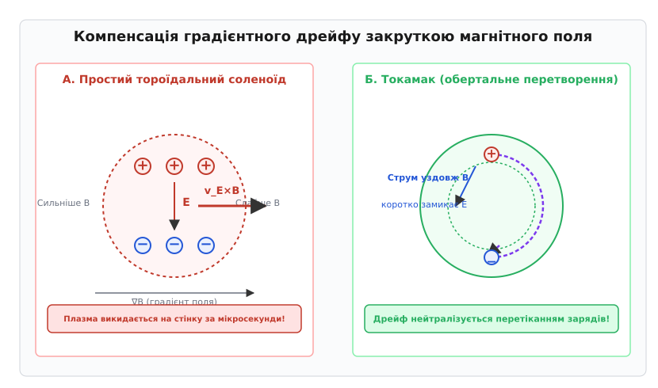
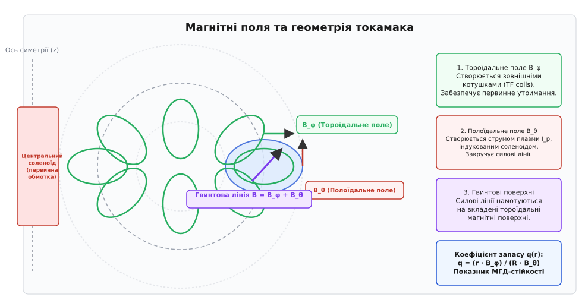
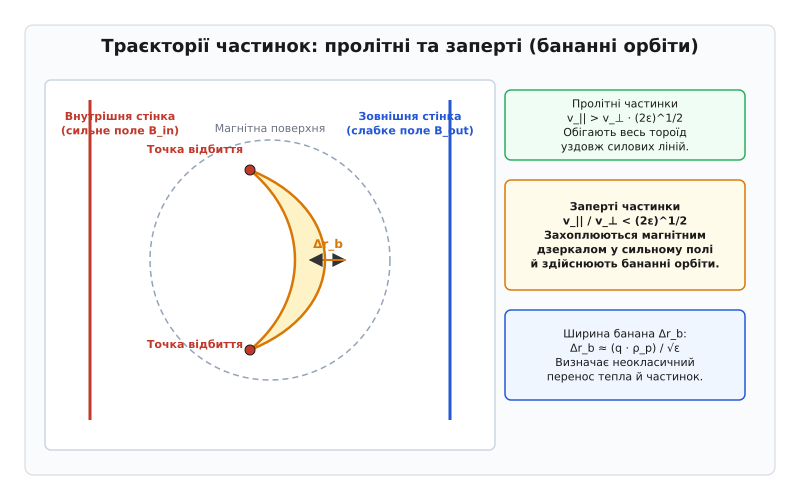
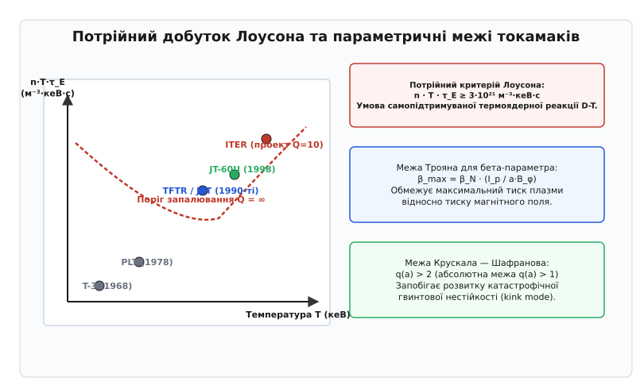

# Принцип токамака

<preknowlist>
- [Сила Лоренца](book:physics/lorentz-force) — рух заряджених частинок у схрещених електричному й магнітному полях.
- [Фізика плазми](book:physics/plasma-physics) — іонізований стан речовини, квазінейтральність та колективні процеси.
- [Сила Ампера](book:physics/ampere-force) — взаємодія провідників зі струмом та магнітний тиск.
</preknowlist>

Спроба втримати термоядерну плазму з температурою 100 мільйонів кельвінів у простому тороїдальному соленоїді зазнає катастрофічного краху впродовж перших мікросекунд: через градієнт магнітного поля іони дрейфують вгору, електрони — вниз, а виникле вертикальне електричне поле виштовхує весь плазмовий шнур на зовнішню стінку камери зі швидкістю в десятки кілометрів на секунду. Фізичний принцип токамака розв'язує цю фундаментальну проблему шляхом пропускання через плазму потужного поздовжнього струму, що створює полоїдальне магнітне поле й закручує силові лінії в замкнені гвинтові поверхні.

## 1. Фізична дилема тороїдального утримання та компенсація дрейфу

Для досягнення самопідтримуваної реакції термоядерного синтезу ядер дейтерію та тритію речовину необхідно нагріти до температур порядка `T ≈ 10–15 кеВ` (приблизно 100–150 мільйонів градусів за Цельсієм). За таких умов атоми повністю іонізуються, перетворюючись на високотемпературну плазму. Оскільки жодна матеріальна поверхня не здатна витримати колосальні теплові потоки (які в реакторних умовах перевищують 10–20 мегават на квадратний метр), виникає потреба в безконтактній термоізоляції за допомогою магнітного поля — принципі магнітного утримання.

Заряджена частинка в однорідному магнітному полі `B` рухається уздовж силової лінії по ларморівському колу радіуса `ρ_L = m·v_⊥ / q·B` з циклотронною частотою `ω_c = q·B / m`. Уздовж магнітного поля частинка рухається вільно, не відчуваючи сили Лоренца. Щоб усунути втрати плазми вздовж кінців прямолінійного силового шнура (які в лінійних пастках призводять до витікання плазми за частки мікросекунди), природним кроком є згортання магнітної системи у замкнений тор.

Проте згортання прямого соленоїда в тороїдальний кільцевий об'єм неминуче порушує однорідність магнітного поля. Згідно із законом повного струму, сила тороїдального магнітного поля `B_φ` зменшується від внутрішньої радіальної межі тора до зовнішньої обернено пропорційно відстані від головної осі симетрії `R`:

```
B_φ(R) = B_tor0 · (R₀ / R)
```

де `R₀` — великий радіус токамака, а `B_tor0` — поле на центральній магнітній осі плазмової камери.

Неоднорідність поля `∇B` та кривина силових ліній радіуса `R` викликають два фундаментальні дрейфи заряджених частинок — градієнтний та кривинний. Сумарна швидкість вертикального дрейфу напрямлена перпендикулярно як до вектора магнітного поля `B`, так і до вектора його радіального градієнта `∇B`:

```
v_d = v_∇B + v_c = [ (m · (v_⊥² + 2·v_||²)) / (2 · q · B · R) ] · (R × B) / (R · B)
```

Оскільки знак сили дрейфу залежить від знаку заряду частинки `q`, позитивні іони та негативні електрони дрейфують у протилежних вертикальних напрямках (наприклад, іони дрейфують вгору, а електрони — вниз). Поділ зарядів створює просторову макроскопічну поляризацію плазмового шнура та генерує вертикальне однорідне електричне поле `E`. 

Утворене електричне поле `E` разом із тороїдальним магнітним полем `B_φ` викликає електричний дрейф плазми як єдиного цілого у зовнішньому радіальному напрямку зі швидкістю:

```
v_E×B = (E × B_φ) / B_φ²
```

Цей дрейф не залежить від маси чи заряду частинок: іони та електрони рухаються разом до зовнішньої стінки вакуумної камери. За типових параметрів термоядерної плазми плазмовий виток виштовхується на зовнішню стінку за час порядка 1–10 мікросекунд, що унеможливлює магнітну термоізоляцію у простому тороїдальному соленоїді.


*Компенсація градієнтного дрейфу закруткою магнітного поля. Вгорі ліворуч: у простому тороїдальному соленоїді градієнтний дрейф викликає вертикальний поділ зарядів, що генерує електричне поле E й виштовхує плазму на зовнішню стінку за рахунок E×B-дрейфу. Вгорі праворуч: у токамаку полоїдальне поле B_θ створює гвинтові силові лінії; електрони та іони вільно перетікають уздовж силових ліній між верхньою та нижньою частинами тора, нейтралізуючи вертикальне електричне поле.*

Розв'язання цієї дилеми, запропоноване в 1950 році Ігорем Таммом та Андрієм Сахаровим (див. [історію винайдення токамака](book:physics/tokamak-principle/hist-tokamak-origin.md)), полягає в створенні **обертального перетворення** (rotational transform). До тороїдального поля `B_φ` додається ортогональне полоїдальне магнітне поле `B_θ`, що охоплює плазмовий виток у малій проекції.

Результуюче магнітне поле `B = B_φ + B_θ` намотується на тороїдальні поверхні у вигляді гвинтових силових ліній. Оскільки частинки володіють високою провідністю вздовж силових ліній, вільне перетікання зарядів уздовж закрученої силової лінії швидко коротко замикає верхню та нижню області тора, повністю нейтралізуючи вертикальне електричне поле `E`. Радіальний `E×B`-дрейф зупиняється, а градієнтний дрейф перетворюється на невеликі осциляції частинки навколо замкнених магнітних поверхонь.

## 2. Магнітна топологія токамака та вкладені поверхні

Створення необхідного комбінованого магнітного поля у токамаку забезпечується двома основними магнітними системами:
1. **Зовнішні тороїдальні котушки (TF coils):** Прямокутні або D-подібні надпровідникові котушки, рівномірно розташовані навколо вакуумної камери, створюють сильне поздовжнє тороїдальне поле `B_φ` (у сучасних токамаках від 2 до 6 Тесла, а у компактних високоефективних проєктах — до 12 Тесла).
2. **Центральний соленоїд та струм плазми:** Центральний індуктор виступає первинною обмоткою великого імпульсного трансформатора. Плазмовий виток слугує вторинною одновитковою обмоткою. Зміна магнітного потоку в соленоїді `dΦ_CS / dt` наводить у тороїдальному плазмовому контурі вихрове електричне поле `E_φ`, яке збуджує в плазмі потужний поздовжній електричний струм `I_p` (від сотен кілоампер у лабораторних установках до 15 мегаампер у проекті ITER). Саме цей струм плазми створює полоїдальне магнітне поле `B_θ`.


*Геометрія та вектори магнітних полів токамака. Сильне тороїдальне поле B_φ створюється зовнішніми котушками, а полоїдальне поле B_θ — струмом плазми I_p, індукованим центральним соленоїдом. Сумарне поле утворює гвинтові силові лінії, що формують систему вкладених тороїдальних магнітних поверхонь.*

Силові лінії результуючого поля `B` утворюють сімейство **вкладених тороїдальних магнітних поверхонь** (flux surfaces). Кожна така поверхня характеризується постійним значенням полоїдального магнітного потоку `ψ = const`. На найпростішій центральній лінії — магнітній осі — поле є чисто тороїдальним. На зовнішніх поверхнях кут закручування силових ліній змінюється від центру до краю.

Кількісною характеристикою закручування силових ліній є **коефіцієнт запасу стійкості** (safety factor) `q(r)`. Фізичний зміст `q` відповідає кількості повних тороїдальних обходів `N_tor`, які робить силова лінія за один повний полоїдальний обіг `N_pol = 1`:

```
q(r) = (1 / 2π) · ∮ dφ ≈ (r · B_φ) / (R₀ · B_θ(r))
```

де `r` — малий радіус розглянутої магнітної поверхні, `R₀` — великий радіус тора, `B_φ` — тороїдальне поле, `B_θ(r)` — полоїдальне поле на радіусі `r`.

Профіль `q(r)` має фундаментальне значення для макроскопічної стійкості плазми:
- **Раціональні поверхні (`q = m/n`):** Магнітні поверхні, на яких `q` дорівнює відношенню малих цілих чисел (наприклад, `q = 1`, `q = 3/2`, `q = 2`, `q = 3`), називаються раціональними. На таких поверхнях силова лінія замикається сама на себе після `n` тороїдальних і `m` полоїдальних обходів. Це робить плазму особливо чутливою до резонансних МГД-нестійкостей та утворення магнітних островів.
- **Межа Крускала — Шафранова (`q(a) > 2`):** Якщо струм плазми `I_p` занадто великий, а полоїдальне поле `B_θ` перевищує допустиму межу, значення `q` на краю плазмового шнура `r = a` опускається нижче одиниці `q(a) < 1`. За таких умов розвивається катастрофічна гвинтова нестійкість розтягування (kink mode), яка призводить до миттєвого скидання струму й розриву плазмового шнура (дизрапції).

Для стабільної роботи токамака коефіцієнт запасу стійкості на краю плазми обов'язково має задовольняти умову `q(a) > 2` (а в центрі `q(0) ≈ 1`).

## 3. Магнітогідродинамічна рівновага та рівняння Града — Шафранова

У стаціонарному стані плазмовий тороїдальний шнур перебуває в рівновазі, коли газокінетичний тиск плазми `p` врівноважується тиском магнітного поля та сила амперівського стиснення `j × B` балансує градієнт тиску:

```
∇p = j × B
```

Оскільки вектор градієнта тиску `∇p` ортогональний як до вектора магнітного поля `B`, так і до вектора густини струму `j`, ізобаричні поверхні `p = const` тотожно збігаються з магнітними поверхнями `ψ = const`. Це означає, що тиск плазми є постійним уздовж всієї тороїдальної поверхні.

Математичним описом двовимірної осьово-симетричної МГД-рівноваги у циліндричних координатах `(R, φ, z)` є **рівняння Града — Шафранова** (детальний математичний вивід подано у [виведенні рівняння Града — Шафранова](book:physics/tokamak-principle/math-grad-shafranov.md)):

```
Δ* ψ = - μ₀ · R² · p'(ψ) - F(ψ) · F'(ψ)
```

де `Δ*` — диференціальний еліптичний оператор виду:

```
Δ* ψ ≡ R · ∂/∂R ((1/R) · ∂ψ/∂R) + ∂²ψ/∂z² = ∂²ψ/∂R² - (1/R)·(∂ψ/∂R) + ∂²ψ/∂z²
```

а `p(ψ)` — функція тиску плазми, `F(ψ) = R · B_φ` — функція тороїдального магнітного потоку, `p'(ψ)` та `F'(ψ)` — їхні похідні за магнітним потоком `ψ`.

З розв'язку рівняння Града — Шафранова випливають два ключові ефекти тороїдальної рівноваги:
1. **Зсув Шафранова (`ΔR`):** Внаслідок того, що магнітний тиск тороїдального поля сильніший з внутрішнього боку тора `(R < R₀)` і слабший з зовнішнього `(R > R₀)`, а також через випиральну дію газокінетичного тиску та самоіндукції струмового витка, внутрішні магнітні поверхні зміщуються назовні відносно зовнішніх. Зсув магнітної осі `ΔR` зростає зі збільшенням тиску плазми.
2. **Параметр бета (`β`) та межа Трояна:** Ефективність утримання плазми характеризується безрозмірним параметром `β` — відношенням газокінетичного тиску плазми до тиску магнітного поля:
   ```
   β = p / (B² / 2μ₀) = (2 · μ₀ · n · k_B · T) / B²
   ```
   У токамаках відношення `β` обмежене **межею Трояна** (Troyon limit) через розвиток балонних та жолобкових МГД-нестійкостей:
   ```
   β_max = β_N · (I_p / (a · B_φ))
   ```
   де `β_N ≈ 2.8–3.5` — нормалізований коефіцієнт Трояна, `I_p` — струм плазми у МА, `a` — малий радіус у метрах, `B_φ` — тороїдальне поле у Теслах. Для класичних токамаків критичне значення `β` зазвичай становить від 3% до 6%.

## 4. Макроскопічні та тингові МГД-нестійкості

Підтримання рівноваги за Градом — Шафрановим є лише необхідною, але не достатньою умовою стабільного утримання плазми. Наявність вільних джерел енергії (градієнтів тиску `∇p` та градієнтів густини струму `∇j`) породжує широкий спектр макроскопічних гідромагнітних нестійкостей.

За фізичною природою МГД-нестійкості поділяються на ідеальні (що розвиваються в припущенні ідеальної провідності `σ = ∞` без зміни топології силових ліній) та резистивні (у яких скінченний опір плазми дозволяє магнітне перезамикання):

1. **Пилоподібні та гвинтові нестійкості (Kink modes):** Ростуть за рахунок енергії полоїдального магнітного поля при високих значеннях струму `I_p`. Якщо на крайній поверхні `q(a) < 1` або `q(a) < 2`, плазмовий шнур згинається у великий гвинт і торкається стінок вакуумної камери.
2. **Балонні нестійкості (Ballooning modes):** Виникають у зоні несприятливої кривини магнітного поля на зовнішньому обводі тора (`R > R₀`), де градієнт тиску `∇p` напрямлений у бік зменшення поля. При перевищенні межі Трояна плазма «спучується» назовні у вигляді локальних випуклостей.
3. **Тингові моди та магнітні острови (Tearing modes):** У плазмі зі скінченним опором біля раціональних поверхонь `q = m/n` відбувається дисипативне магнітне перезамикання (magnetic reconnection). Силові лінії розриваються й замикаються у новій топології, утворюючи замкнені трубки полоїдального потоку — **магнітні острови**. Наявність магнітних островів різко погіршує термоізоляцію, оскільки тепло швидко переноситься вздовж замкнених ліній острова від його внутрішнього краю до зовнішнього.
4. **Пилоподібні осциляції (Sawtooth oscillations):** У центральній зоні плазми, де `q(0) < 1`, періодично розвивається внутрішня тингова мода `m=1, n=1`. Вона призводить до швидкого вирівнювання профілю температури в центрі та скидання тепла на периферію з періодом у десятки мілісекунд.
5. **Катастрофічні дизрапції (Disruptions):** Повний розвиток великих тингових мод `m=2, n=1` може призвести до їхнього перекриття й теплового зриву (thermal quench). Температура плазми падає до декількох електрон-вольт за мікросекунди, після чого відбувається струмовий зрив (current quench) з виникненням релятивістських втікаючих електронів (runaway electrons), що несуть струми в мільйони ампер і здатні проплавити першу стінку реактора.

## 5. Транспортні процеси та бананні орбіти частинок

Навіть у разі повного макроскопічного МГД-рівноваги плазма поступово втрачає енергію та частинки через мікроскопічні переноси. У класичній плазмі перенос описується зіткненнями між частинками, причому крок розсіяння дорівнює ларморівському радіусу `ρ_L`. Проте у тороїдальній геометрії токамака переносу сприяє наявність двох класів частинок із принципово різною кінематикою.

Оскільки модуль магнітного поля спадає вздовж великого радіуса як `B(R) ∝ 1/R`, внутрішня область тора є областю сильного поля, а зовнішня — слабкого. Внаслідок збереження магнітного моменту `μ = m·v_⊥² / 2B` частинка, рухаючись уздовж силової лінії у бік сильного поля, зазнає дії гальмівної сили магнітного дзеркала.

Залежно від співвідношення між поздовжньою `v_||` та поперечною `v_⊥` швидкостями частинки поділяються на:
- **Пролітні частинки (passing particles):** Частинки з великою поздовжньою швидкістю `v_|| / v_⊥ > √(2ε)` подолають магнітний бар'єр і вільно здійснюють повні обходи навколо тора уздовж закручених силових ліній.
- **Заперті частинки (trapped particles):** Частинки з малими поздовжніми швидкостями `v_|| / v_⊥ < √(2ε)` (де `ε = r / R₀` — тороїдальне сплощення) відбиваються від областей сильного магнітного поля. Вони виявляються захопленими у тороїдальній магнітній пастці на зовнішньому боці тора.


*Траєкторії частинок у полоїдальному перерізі токамака. Пролітні частинки обігають весь тороїд уздовж замкнених магнітних поверхонь. Заперті частинки відбиваються від точок сильного поля на внутрішньому боці й виконують вигнуті орбіти у формі банана з шириною Δr_b, яка у q / √ε разів перевищує полоїдальний ларморівський радіус.*

У проекції на полоїдальну площину `(R, z)` траєкторія запертої частинки утворює замкнений вигнутий контур, що зовні нагадує банан. **Ширина бананної орбіти** `Δr_b` значно перевищує звичайний ларморівський радіус у полоїдальному полі `ρ_p = m·v / q_e·B_θ`:

```
Δr_b ≈ (q · ρ_p) / √ε = (q · m · v_⊥) / (q_e · B_θ · √ε)
```

Детальне розрахункове чисельне моделювання бананних орбіт подано у [чисельному моделюванні бананних орбіт](book:physics/tokamak-principle/proj-tokamak-orbit-sim.md).

Наявність запертих частинок призводить до теорії **неокласичного переносу** (Neoclassical transport). Оскільки парні зіткнення зміщують центр бананної орбіти на величину її ширини `Δr_b`, коефіцієнт дифузії в неокласичному режимі виявляється у `q² / ε³⸍²` разів більшим за класичний коефіцієнт дифузії:

```
D_neoclassical ≈ ν_e-i · ρ_p² · (q² / ε³⸍²)
```

У реальних експериментах втрати тепла виявляються ще вищими через розвиток дрібномасштабних турбулентних нестійкостей — градієнтно-температурних мод іонів та електронів (ITG, TEM). Цей додатковий транспорт називається **аномальним переносом**.

## 6. Режими утримання, диверторна фізика та H-режим

У 1982 році на токамаку ASDEX (Німеччина) було відкрито феномен самоорганізації плазми — **H-режим** (High-confinement mode). При досягненні критичної потужності нагріву біля краю плазмового шнура виникає вузький шар із сильним радіальним електричним полем та високим широм швидкості `E×B`-обертання `d(v_E×B)/dr`.

Цей шир радіального обертання механічно розриває турбулентні вихори, створюючи на периферії плазми **бар'єр переносу** (Edge Transport Barrier, ETB). Час утримання енергії `τ_E` при цьому стрибкоподібно зростає удвічі порівняно зі звичайним L-режимом (Low-confinement mode). Сучасні токамаки проектуються з розрахунком на обов'язкову роботу в H-режимі.

Проте H-режим супроводжується періодичними вибуховими скиданнями накопиченого тиску на краю — **периферійними балонними модами (ELM — Edge Localized Modes)**. Вони викидають імпульсні теплові потоки на стінки вакуумної камери, що вимагає розробки спеціальних систем магнітного пригнічення ELM за допомогою додаткових резонансних котушок (RMP).

Для контролю виходу тепла й нейтралізації домішок важких елементів (ерозія стінок) у сучасних токамаках замість безпосереднього контакту плазми з діафрагмою (лімітером) застосовують **диверторну конфігурацію**. За допомогою додаткових полоїдальних котушок створюється сепаратриса з седельною нульовою точкою (X-точкою), яка відводить крайні силові лінії та потік відпрацьованого гелію на спеціальні високотермостійкі диверторні пластини з вольфраму.

Завдяки введенню нейтрального газу в диверторний об'єм досягається режим **відриву плазми (detachment)**, при якому більша частина теплової потужності випромінюється у вигляді об'ємного фотонного випромінювання до того, як плазма торкнеться пластин. Це знижує температуру плазми біля пластин до `< 5 еВ`, запобігаючи випаровуванню вольфраму.

## 7. Сферичні токамаки та альтернативні конфігурації

Окрім класичних токамаків із помірним аспектним відношенням `A = R₀ / a ≈ 3.0` (як JET або ITER), у 1980-х роках Мартін Пенг запропонував концепцію **сферичних токамаків** (Spherical Tokamak, ST) з гранично малим аспектним відношенням `A ≈ 1.3–1.5` (наприклад, токамаки MAST у Великій Британії та NSTX у США).

Геометрично сферичний токамак нагадує яблуко без серцевини: тороїдальний соленоїд згортається у тонку центральну колонку. Сферичні токамаки володіють унікальними фізичними перевагами:
1. **Високі значення бета-параметра (`β_T > 20–40%`):** Завдяки сильній природній витягнутості плазми `κ > 2` та високому самозбуджуваному бутстреп-струму сферичні токамаки здатні утримувати тиск плазми при значно менших тороїдальних магнітних полях.
2. **Пригнічення мікротурбулентності:** Сильний шир `E×B`-обертання та високий магнітний шир пригнічують ITG-моди, забезпечуючи високу термоізоляцію.
3. **Компактні розміри:** Можливість побудови дешевших і менших за габаритами термоядерних модулів.

Основним інженерним обмеженням сферичних токамаків є відсутність місця для товстого надпровідного центрального соленоїда, що вимагає безіндукційного стаціонарного збудження струму (через бутстреп-струм та радіочастотні хвилі).

## 8. Експериментальна діагностика плазми токамака

Для вимірювання екстремальних параметрів термоядерної плазми без її обурення застосовують комплекс безконтактних оптичних, лазерних та електромагнітних діагностичних систем:

1. **Лазерне томсонівське розсіювання (Thomson Scattering):** Короткі лазерні імпульси проходять крізь переріз плазми. Розширення спектра розсіяного випромінювання на вільних електронах дає локальний профіль електронної температури `T_e(r)`, а інтенсивність розсіювання — профіль густини `n_e(r)`.
2. **Електронно-циклотронне випромінювання (ECE — Electron Cyclotron Emission):** Власне радіовипромінювання електронів на гармоніках циклотронної частоти описується випромінюванням абсолютно чорного тіла, що дозволяє вимірювати локальні температури `T_e(R)` із часовим розділенням у мікросекунди.
3. **Спектроскопія перезарядки (CXRS — Charge Exchange Recombination Spectroscopy):** Рекомбінація іонів плазми з нейтральними атомами діагностичного пучка NBI дозволяє міряти доплерівську температуру іонів `T_i(r)` та швидкість тороїдального обертання плазми `v_φ(r)`.
4. **Магнітна діагностика:** Пояси Роговського вимірюють повний струм плазми `I_p`, вимірювальні магнітні петлі — полоїдальний потік `ψ`, а датчики Холла та котушки Мірнова слугують для швидкого виявлення МГД-коливань та реконструкції рівноваги в кодах EFIT.

Управління геометрією плазмового шнура здійснюється в реальному часі за допомогою зворотного зв'язку цифрового контролера: сигнал від магнітних датчиків порівнюється з розрахованою рівновагою за Градом — Шафрановим, після чого контролер коригує струми в полоїдальних котушках для підтримання заданої витягнутості `κ` та трикутності `δ`.

## 9. Запобігання зривам та мітигація аварійних режимів

Розвиток катастрофічної МГД-дизрапції в великому токамаку реакторного масштабу (як ITER) є головним технічним ризиком, оскільки він створює три критичні загрози:
1. **Тепловий удар:** Скидання десятків мегаджоулів енергії плазми за 1 мікросекунду викликає локальне випаровування та ерозію вольфрамових диверторних пластин.
2. **Електромагнітні сили:** Швидка зміна струму `dI_p / dt` наводить вихрові струми в корпусі вакуумної камери, що генерує механічні сили вигину в тисячі тонн.
3. **Лавина втікаючих електронів:** Зростання тороїдального індукційного поля при охолодженні плазми прискорює електрони до релятивістських енергій (втікаючі електрони, runaway electrons).

Для запобігання цим загрозам у сучасних токамаках будують системи **мітигації зривів (Disruption Mitigation Systems, DMS)**. Основні технології включають:
- **Інжекція масивних газових струменів (MGI):** За кілька мілісекунд до зриву в камеру впорскується великий об'єм благородних газів (аргону або неону), які швидко випромінюють енергію плазми у вигляді ізотропного світла, запобігаючи локальному пропалу.
- **Дробове інжектування заморожених пелетів (SPI — Shattered Pellet Injection):** Заморожені циліндри з неону чи дейтерію механічно розбиваються перед входом у камеру на дрібний град, який глибоко проникає в ядро плазми, забезпечуючи рівномірне об'ємне охолодження та пригнічуючи формування пучків втікаючих електронів.

## 10. Методи нагріву, підтримка струму та критерій Лоусона

Оскільки Spitzer-опір плазми `η_Spitzer` зменшується з зростанням температури за законом `η ∝ T⁻³⸍²`, первинний **омічний нагрів** струмом `P_Ohm = η · j²` втрачає ефективність при досягненні температур `T ≈ 2–3 кеВ`. Для подальшого нагріву плазми до термоядерних температур `10–20 кеВ` застосовують додаткові допоміжні методи нагріву:

1. **Інжекція нейтральних пучків (NBI — Neutral Beam Injection):** Пучки високоенергетичних нейтральних атомів дейтерію чи тритію (з енергією від 100 кеВ до 1 МеВ) іонізуються всередині плазмового шнура, захоплюються магнітним полем і передають свою кінетичну енергію основній плазмі шляхом парних зіткнень.
2. **Високочастотний радіочастотний нагрів (RF Heating):**
   - *Іонно-циклотронний нагрів (ICRH):* Електромагнітні хвилі мегагерцового діапазону `(40–90 МГц)` резонансно поглинаються іонами на їхній циклотронній частоті `ω = ω_ci`.
   - *Електронно-циклотронний нагрів (ECRH):* Хвилі міліметрового діапазону `(100–170 ГГц)` резонансно нагрівають електрони на частоті `ω = ω_ce`.
   - *Нижньогібридний нагрів (LHCD):* Використовується як для нагріву, так і для неіндуктивного збудження струму (Current Drive).


*Потрійний добуток Лоусона та параметричні межі токамаків. Ліворуч: траєкторія досягнення умови запалювання Q = ∞ у координатах потрійного добутку n·T·τ_E відносно температури T для історичних та сучасних токамаків. Праворуч: параметричні межі МГД-стійкості за критерієм Лоусона, межею Трояна для бета-параметра та межею Крускала — Шафранова для коефіцієнта q.*

Оскільки центральний соленоїд володіє обмеженим запасом магнітного потоку `ΔΦ_CS`, омічний токамак працює в імпульсному режимі. Для переходу до безперервної (стаціонарної) роботи реактора застосовують **неіндукційне збудження струму** (Non-Inductive Current Drive) за допомогою високочастотних хвиль (LHCD, ECCD), інжекції пучків (NBCD), а також використання внутрішнього самозбуджуваного **бутстреп-струму** (Bootstrap current), що виникає внаслідок градієнта тиску запертих частинок у неокласичній плазмі.

Умовою досягнення самопідтримуваної термоядерної реакції синтезу (коли нагрів альфа-частинками `P_α` повністю перекриває всі втрати тепла) є виконання **потрійного критерію Лоусона**:

```
n · T · τ_E ≥ 3 · 10²¹ м⁻³ · кеВ · с
```

де `n` — густина плазми, `T` — температура в кеВ, `τ_E` — час утримання енергії.

Параметр `Q = P_fusion / P_heating` характеризує коефіцієнт підсилення потужності:
- `Q = 1` — поріг брейк-івена (break-even), коли виділена термоядерна потужність дорівнює вкладеній потужності нагріву.
- `Q = 10` — мета міжнародного реактора **ITER** (виробництво 500 МВт термоядерної потужності при вкладених 50 МВт нагріву).
- `Q = ∞` — режим чистого самозапалювання (ignition).

> 🔧 **Навіщо це.**
> Принцип токамака є технологічною основою світової термоядерної енергетики першого покоління. На відміну від альтернативних схем (стелараторів, дзеркальних пасток, інерціального синтезу), токамаки володіють найвищим показником термоізоляції плазми на одиницю об'єму магнітного поля. Знання принципу токамака, МГД-рівноваги Града — Шафранова та межі Трояна необхідне для проектування промислових електростанцій (DEMO), розробки надпровідникових магнітних систем на високотемпературних надпровідниках (HTS, як у проекті SPARC) та створення високоточних систем автоматичного керування положенням плазмового шнура в реальному часі.
