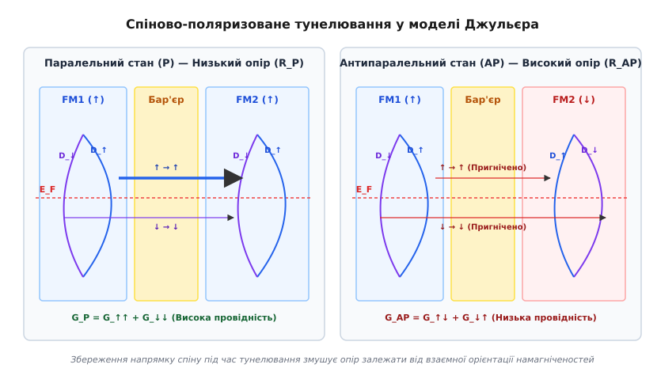
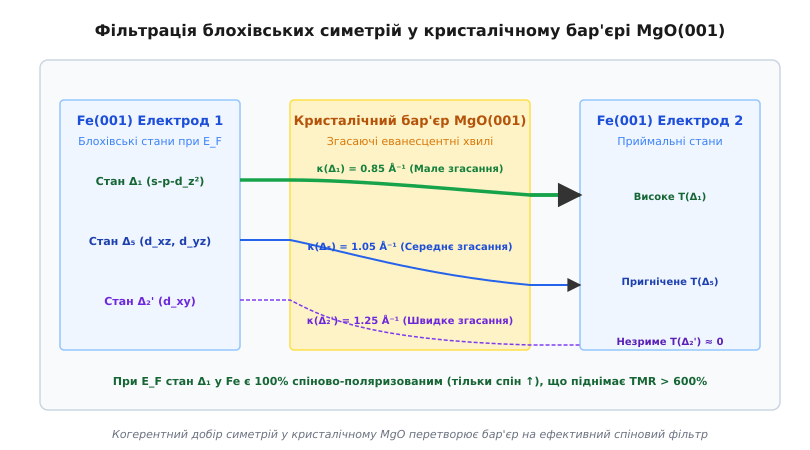
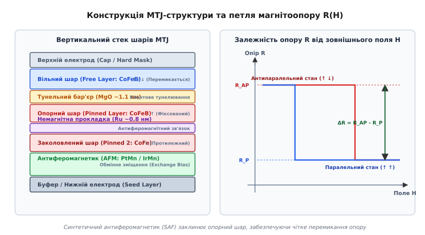
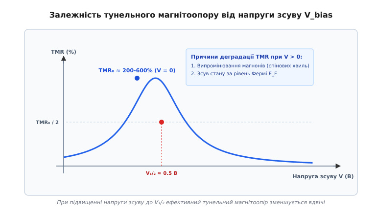

# Тунельний магнітоопір (TMR)

<preknowlist>
- [Феромагнетизм](topic:physics/ferromagnetism) — спонтанне паралельне впорядкування магнітних моментів електронів та наявність спінового розщеплення зон.
- [Рівень Фермі](topic:physics/fermi-level) — енергетичний рівень, що розділяє заповнені та вільні електронні стани при абсолютному нулю.
- [Магнітоопір](topic:physics/magnetoresistance) — зміна електричного опору матеріалу або структури під дією зовнішнього магнітного поля.
</preknowlist>

Якщо між двома феромагнітними електродами із заліза завтовшки в кілька нанометрів помістити надтонкий шар діелектрика MgO товщиною всього 1.0–1.5 нм (близько 5–7 атомних шарів) і прикласти невелику різницю потенціалів, крізь класично непереборний потенціальний бар'єр потече квантово-механічний тунельний струм. Вимірювання електричного опору такої сендвіч-структури при кімнатній температурі показує приголомшливий ефект: під час перемикання орієнтації магнітних моментів електродів із паралельного стану в антипаралельний за допомогою зовнішнього магнітного поля опір зростає не на частки відсотка, а на 200–600%. Цей стрибок опору в сотні разів перевищує класичний магнітоопір металів і лежить в основі роботи сучасних зчитувальних головок жорстких дисків та енергонезалежної магніторезистивної оперативної пам'яті (STT-MRAM).

---

### 1. Фізичний механізм спіново-поляризованого тунелювання

Класична електродинаміка строго забороняє рух носіїв заряду через область, де потенціальна енергія бар'єру `V₀` перевищує кінетичну енергію електрона `E`. У класичній фізиці електрон повністю відбивається від потенціального порогу без найменшого проникнення у глиб диелектрика. Проте у квантовій механіці електрон описується хвильовою функцією `Ψ(r)`. На межі розділу "метал-діелектрик" хвильова функція не обнуляється скачком, а гармонічно проникає у заборонену область, де її амплітуда експоненціально згасає за законом:

```
Ψ(z) = Ψ(0) · exp(-κ · z)
```

де `κ` — коефіцієнт згасання хвильової функції усередині бар'єру, що визначається висотою потенціального бар'єру `V₀` та кінетичною енергією електрона `E`:

```
κ = √[ (2·m* / ℏ²) · (V_0 - E) ]
```

Якщо товщина диелектричного шару `d` є порівнянною з дебройлівською довжиною хвилі електрона (порядку 1 нм), амплітуда хвильової функції на протилежному боці бар'єру `Ψ(d)` залишається відмінною від нуля. Це забезпечує скінченну ймовірність проходження електрона крізь диелектрик.

У немагнітних металах (міді `Cu`, алюмінії `Al`, золоті `Au`) густина електронних станів для електронів зі спіном "вгору" (`↑`) та спіном "вниз" (`↓`) є строго однаковою через спінову симетрію за відсутності магнітного поля. Проте у феромагнетиках (залізі `Fe`, кобальті `Co`, нікелі `Ni` та їхніх сплавах) внутрішнє квантове обмінне поле розщеплює 3d-електронну зону на дві енергетично нееквівалентні спінові підзони.

Обмінна взаємодія Стонера зсуває енергетичні рівні електронів зі спіном, паралельним внутрішньому магнітному моменту кристала, вниз за енергією на величину обмінного розщеплення `ΔE_ex ≈ 1.5 - 2.0 еВ` відносно електронів з антипаралельним спіном. У результаті на рівні Фермі `E_F` густина доступних електронних станів зі спіном вгору `D_↑(E_F)` (мажоритарні носії) та спіном вниз `D_↓(E_F)` (миноритарні носії) суттєво відрізняється.

Спінова поляризація ферромагнітного матеріалу `P` визначається як нормована відносна різниця між густинами станів мажоритарних та миноритарних носіїв на рівні Фермі:

```
P = (D_↑(E_F) - D_↓(E_F)) / (D_↑(E_F) + D_↓(E_F))
```

Для більшості класичних феромагнітних металів (`Fe`, `Co`, `Ni`) значення поляризації `P` становить від 35% до 55%. У напівметалевих феромагнетиках (наприклад, у сплавах Гейслера `Co₂FeSi` або оксидах `CrO₂`) поляризація на рівні Фермі теоретично сягає 100%, оскільки одна зі спінових підзон повністю відсутня на рівні Фермі, виявляючи диелектричну щілину.


*Спіново-поляризоване тунелювання електронів у паралельному (P) та антипаралельному (AP) станах MTJ*

При квантовому тунелюванні електрона крізь потенціальний бар'єр проміжок часу проходження є настільки малим (близько 10⁻¹⁵ с), що спін-орбітальна взаємодія та зовнішні магнітні поля не встигають розвернути спіновий момент електрона. Тунелювання відбувається із **збереженням орієнтації спіну** (пружне спіново-зберігаюче тунелювання).

Це означає, що спіновий потік розділяється на два строго незалежні паралельні канали:
- Електрони зі спіном вгору можуть тунелювати виключно у вільні стани зі спіном вгору в другому електроді;
- Електрони зі спіном вниз можуть тунелювати виключно у стани зі спіном вниз.

Згідно з золотим правилом Фермі, тунельний струм для кожного спінового каналу є пропорційним добутку густини початкових заповнених станів у першому електроді на густину доступних кінцевих вільних станів у другому електроді при енергії Фермі:

1. **Паралельна конфігурація (P):** Намагніченості обох електродів спрямовані паралельно в один бік. Мажоритарний канал першого електрода `D₁_↑` тунелює у високогусний мажоритарний канал другого електрода `D₂_↑`. Одночасно малогусний миноритарний канал `D₁_↓` тунелює у `D₂_↓`. Сумарний струм описується виразом:
   ```
   I_P ∝ (D₁_↑ · D₂_↑ + D₁_↓ · D₂_↓)
   ```
   Оскільки добуток `D₁_↑ · D₂_↑` містить множення двох великих величин, сумарний тунельний струм виявляється високим, а опір структури `R_P` — мінімальним.

2. **Антипаралельна конфігурація (AP):** Намагніченість другого електрода розвернена на 180° за допомогою зовнішнього магнітного поля. Тепер мажоритарний канал першого електрода `D₁_↑` змушений тунелювати у миноритарний канал другого електрода `D₂_↓`, який має низьку густину станів. Аналогічно, миноритарний канал `D₁_↓` тунелює у `D₂_↑`:
   ```
   I_AP ∝ (D₁_↑ · D₂_↓ + D₁_↓ · D₂_↑)
   ```
   Обидва доданки містять множення великої густини станів на малу. У результаті підсумковий струм дроселюється, і опір переходу `R_AP` скачкоподібно зростає.

---

### 2. Модель Джульєра та фізичні обмеження аморфних бар'єрів (Al₂O₃)

У 1975 році французький фізик Мішель Джульєр запропонував феноменологічну модель, яка пов'язала величину магнітоопору безпосередньо зі спіновими поляризаціями обох феромагнітних електродів `P₁` та `P₂`.

Виражаючи парціальні густини станів через сумарну густину `D = D_↑ + D_↓` та поляризацію `P`, провідність структури у паралельному `G_P` та антипаралельному `G_AP` станах виражається як:

```
G_P  = G_0 · (1 + P₁ · P₂)
G_AP = G_0 · (1 - P₁ · P₂)
```

Коефіцієнт тунельного магнітоопору (TMR Ratio) визначається як відносна зміна опору при переході з паралельного в антипаралельний стан:

```
TMR = (R_AP - R_P) / R_P = (G_P - G_AP) / G_AP = (2 · P₁ · P₂) / (1 - P₁ · P₂)
```

Детальний історичний екскурс про те, як модель Джульєра роками залишалася поза увагою дослідників через невідтворюваність кріогенних експериментів, наведено у вставці [Історія відкриття тунельного магнітоопору: від досліду Джульєра до революції MgO](topic:physics/tunnel-magnetoresistance/hist-julliere.md).

Строгий математичний вивід провідностей `G_P` та `G_AP`, а також порівняння оптимістичного та песимістичного коефіцієнтів TMR наведено у вставці [Математична теорія спиново-поляризованого тунелювання та симетрійного згасання](topic:physics/tunnel-magnetoresistance/math-julliere-model.md).

#### Електрофізика тунелювання за Бринкманом — Дайнесом — Роуеллом (BDR)
Окрім феноменологічної моделі Джульєра, вольт-амперні характеристики реальних тунельних діелектриків описуються мікроскопічною моделлю Бринкмана — Дайнеса — Роуелла (Brinkman-Dynes-Rowell, BDR). Згідно з цією моделлю, густина тунельного струму `J(V)` при прикладанні напруги `V` виявляє нелінійний кубічний характер через деформацію профілю потенціального бар'єру під дією електричного поля:

```
J(V) = C₁ · V + C₂ · V² + C₃ · V³
```

де коефіцієнт `C₁` визначається середньою висотою потенціального бар'єру `Φ_bar` та його товщиною `d`, а коефіцієнт `C₂` описує асиметрію потенціального профілю на межах із різними металами.

#### Причини фізичного ліміту аморфного Al₂O₃
Протягом 1990-х років основним матеріалом тунельного бар'єру слугував аморфний оксид алюмінію (`Al₂O₃`). Аморфний диелектрик володіє неупорядкованою атомною сіткою без дальнього порядку. Під час тунелювання крізь аморфну структуру електрони зазнають численних некогерентних розсіювань на флуктуаціях потенціалу та амбіполярних дефектах.

Це призводить до наступних негативних наслідків:
1. **Втрата збереження хвильового вектора:** Некогерентне розсіювання повністю хаотизує напрямок поперечного хвильового вектора `k_∥`. Електрон втрачає пам'ять про свою початкову Блохівську орбіталь.
2. **Усереднення по всьому простору станів:** Тунельний струм стає усередненим по всьому ізоенергетичному об'єму поверхні Фермі.
3. **Обмеження поляризації:** Ефективна поляризація `P` дорівнює лише об'ємно-усередненій поляризації d-зони. Для типових сплавів `CoFe` поляризація становила `P ≈ 0.45 - 0.50`, що обмежувало кімнатно-температурне значення TMR межею у 40–70%:

```
TMR_Al2O3 = (2 · 0.5² / (1 - 0.5²)) = 0.50 / 0.75 ≈ 67%
```

Додатково непружне тунелювання електронів (Inelastic Electron Tunneling Spectroscopy, IETS) у структурах з `Al₂O₃` виявляло інтенсивне розсіювання на локальних фононах аморфної сітки, що приводило до стрімкого спаду TMR при підвищенні напруги зсуву вже до 0.2 В. Аморфні бар'єри виявилися неспроможними забезпечити подальший стрибок магніточутливості.

---

### 3. Когерентне тунелювання та фільтрація Блохівських станів у MgO(001)

У 2001 році теоретичні розрахунки з перших принципів (DFT) довели, що якщо замінити аморфний диелектрик на ідеальний монокристалічний бар'єр оксиду магнію `MgO(001)`, затиснутий між монокристалічними електродами заліза `Fe(001)`, фізика тунелювання докорінно змінюється.

У кристалічному середовищі атомний порядок зберігається уздовж усього тунельного шляху. Поперечний хвильовий вектор `k_∥` залишається строго збереженим. Електрон описується не просто спіном, а **блохівською хвильовою функцією з певною просторовою симетрією**.


*Когерентне згасання блохівських хвильових функцій різної симетрії у кристалічному бар'єрі MgO(001)*

У кристалевому залізі `Fe(001)` вздовж напрямку тунелювання `[001]` електронні стани при енергії Фермі розкладаються на три основні симетрійні компоненти:
1. **Стан симетрії Δ₁:** Симетрична гібридизована орбіталь, сформована s-, p_z- та d_{z²}-орбіталями атомів заліза. Вона витягнута строго перпендикулярно до площини інтерфейсу (вздовж осі z).
2. **Стан симетрії Δ₅:** Поперечно-симетрична орбіталь, сформована d_{xz}- та d_{yz}-орбіталями.
3. **Стан симетрії Δ₂':** Поперечна орбіталь, сформована d_{xy}-орбіталями.

Коли блохівська хвиля потрапляє у заборонену зону диелектричного кристала `MgO`, її поздовжній хвильовий вектор `k_z` стає уявним: `k_z = i · κ`. Амплітуда хвилі спадає за законом `exp(-κ · z)`. Коефіцієнт згасання `κ` визначається комплексною зонною структурою `MgO` і є принципово різним для різних симетрій:

```
κ(Δ₁)  ≈ 0.85 Å⁻¹   (Мінімальне згасання — хвиля легко проникає крізь бар'єр)
κ(Δ₅)  ≈ 1.05 Å⁻¹   (Середнє згасання)
κ(Δ₂') ≈ 1.25 Å⁻¹   (Максимальне згасання — хвиля швидко згасає)
```

Фізична причина мінімального згасання стану Δ₁ полягає в тому, що s-p-d_z² орбіталі заліза мають ідеальну просторову та фазову сумісність із заповненими 2p_z-орбіталями кисню `O²⁻` та вільними 3s-орбіталями магнію `Mg²⁺` у кубічній ґратці типу NaCl. Групова швидкість перенесення заряду для цієї симетрії `v_g = (1/ℏ) · (∂E/∂k_z)` виявляється максимальною.

Оскільки імовірність тунелювання пропорційна `exp(-2 · κ · d)`, навіть при товщині бар'єру `MgO` всього 1.5 нм хвилі симетрії Δ₁ проходять крізь кристалічний діелектрик у **понад 600 разів ефективніше**, ніж хвилі інших симетрій. Кристал MgO виступає в ролі ідеального **просторового фільтра симетрії**.

Найголовніша особливість заліза `Fe(001)` полягає у тому, що через обмінне розщеплення зон при енергії Фермі `E_F` стан симетрії Δ₁ існує **виключно у спіновій підзоні вгору (Δ₁^↑)**. У підзоні вниз (Δ₁^↓) стан такої симетрії відсутній (він зсунутий за енергією вище рівню Фермі обмінним інтегралом Стонера `ΔE_ex ≈ 1.8 еВ`).

У результаті кристалічний бар'єр MgO пропускає майже виключно електрони симетрії Δ₁, які у залізі є **100% спіново-поляризованими** (`P(Δ₁) → 1.0`). Це перетворює структуру `Fe/MgO/Fe` на майже ідеальний тунельний спіновий фільтр, піднімаючи теоретичне значення TMR до рівня 1000–2000%, а практично виміряне при кімнатній температурі — до 200–604%.

#### Джерела втрати когерентності у реальних структурі CoFeB/MgO
У реальних промислових гетероструктурах досягти теоретичного ліміту TMR у 2000% перешкоджають три мікроскопічні фактори:
1. **Інтерфейсна шорсткість та дефекти:** Атомарні сходинки та нерівності на межі розділу `CoFeB/MgO` частково порушують строге збереження `k_∥`, розсіюючи хвилі Δ₁ у стани Δ₅.
2. **Дифузія марганцю та бору:** При високих температурах відпалу атоми бору та марганцю можуть дифундувати до тунельного бар'єру, створюючи додаткові центри непружного спінового розсіювання.
3. **Термічне випромінювання магнонів:** При температурі 300 K флуктуації намагніченості створюють теплові магнони, які викликають перекид спінів тунелюючих електронів, що знижує кімнатно-температурний TMR у 2–3 рази порівняно з кріогенним значенням при 4.2 K.

---

### 4. Анатомія тришарової структури MTJ та робочі характеристики

Практична реалізація тунельного магнітного переходу у мікроелектроніці вимагає створення складного вертикального наностека шарів.


*Конструкція комерційного p-MTJ стека та гістерезисна залежність опору R(H)*

Типовий промисловий p-MTJ (Perpendicular Magnetic Tunnel Junction) містить наступні ключові елементи:
- **Антиферомагнітний заклинювальний шар (AFM, IrMn або PtMn):** Створює ефект обмінного зміщення (*exchange bias*), що фіксує магнітний момент сусіднього феромагнетика.
- **Синтетичний антиферомагнетик (SAF):** Тришарова система `CoFe / Ru (0.85 нм) / CoFeB`. Завдяки міжшаровій обмінній взаємодії РККЙ (RKKY) через надтонку прокладку рутенію, намагніченості шарів `CoFe` та `CoFeB` орієнтуються строго антипаралельно. Це повністю компенсує паразитичні поля розсіювання, які б інакше розвертали вільний шар.
- **Тунельний бар'єр MgO (1.0–1.2 нм):** Кристалічний шар, що забезпечує когерентне тунелювання.
- **Вільний шар (Free Layer, CoFeB 1.2–1.6 нм):** Намагніченість цього шару може вільно перемикатися між двома станами (0 та 1).
- **Захисний шар (Cap Layer, Ta/Ru):** Відводить атоми бору під час відпалу.

Детальний опис матеріалознавчих аспектів кристалізації `CoFeB`, механізмів формування перпендикулярної анізотропії (i-PMA) та класифікацію дефектів наведено у вставці [Конструкція та матеріалознавство тунельного магнітного переходу (MTJ)](topic:physics/tunnel-magnetoresistance/comp-mtj-stack.md).

#### Ефект перпендикулярної магнітної анізотропії (i-PMA)
Для зменшення геометричних розмірів елемента пам'яті нижче 20 нм вектори намагніченості орієнтують перпендикулярно до площини плівки. Це досягається за рахунок інтерфейсної анізотропії (i-PMA), що виникає завдяки гібридизації 3d-орбіталей заліза та 2p-орбіталей кисню безпосередньо на межі `CoFeB/MgO`. Перпендикулярна орієнтація забезпечує високий енергетичний бар'єр термодинамічної стабільності `E_b = K_u · V`, що гарантує збереження записаного біта понад 10 років при температурі 85 °C.

---

### 5. Спіновий обертальний момент (STT), SOT, VCMA та прикладне застосування

При підключенні джерела живлення до MTJ величини тунельного магнітоопору суттєво залежать від прикладеної напруги зсуву `V_bias`.


*Деградація коефіцієнта TMR при зростанні напруги зсуву V_bias*

При збільшенні напруги `V` значення TMR нелінійно спадає за феноменологічним законом:

```
TMR(V) = TMR_0 / [ 1 + (V / V_12)² ]
```

Головними фізичними причинами падіння TMR є:
1. **Випромінювання магнонів (спінових хвиль):** Гарячі електрони, проходячи крізь бар'єр під напругою, неупруго розсіюються з випромінюванням магнонів у феромагнітних електродах. Це призводит до перевертання спінів та некогерентного змішування спінових каналів.
2. **Зміщення рівня Фермі:** Зсув напруги розводить рівні Фермі електродів на величину `e · V`, підключаючи до тунелювання стани з іншою симетрією (Δ₅, Δ₂'), що знижує ефективність симетричного фільтра `MgO`.

Для практичних застосувань критично важливо контролювати параметр `V_1/2` (напруга, при якій TMR зменшується вдвічі, типово `V_1/2 ≈ 0.5 В`).

#### Ефект спінового обертального моменту (Spin-Transfer Torque, STT)
Коли крізь MTJ-структуру протікає тунельний струм високої густини (`J > 10⁵ А/см²`), електрони, поляризовані за спіном у фіксованому опорному шарі, при тунелюванні переносять свій спіновий кутовий момент у вільний шар.

Взаємодіючи з локальними магнітними моментами вільного шару, тунелюючий спіновий струм створює механічний обертальний момент — **Spin-Transfer Torque (STT)**. Якщо густина струму перевищує порогове значення `J_c`, обертальний момент перевертає намагніченість вільного шару без використання зовнішнього магнітного поля:
- Струм у напрямку "від опорного до вільного шару" встановлює **паралельний стан (P, логічний 0)**;
- Струм у зворотному напрямку "від вільного до опорного шару" встановлює **антипаралельний стан (AP, логічна 1)**.

#### Спін-орбітальний обертальний момент (SOT) та напругова анізотропія (VCMA)
Нові покоління спінтроніки розвивають альтернативні фізичні принципи керування станом MTJ:
- **SOT-MRAM (Spin-Orbit Torque):** Струм запису протікає вздовж підкладки з важкого металу (`Ta`, `Pt`, `W`). Завдяки спіновому ефекту Холла (Spin Hall Effect) створюється чисто спіновий струм, який розвертає вільний шар. Це ізолює тунельний бар'єр `MgO` від струмового зносу.
- **VCMA-MRAM (Voltage-Controlled Magnetic Anisotropy):** Прикладання напруги до `MgO` змінює густину заряду на інтерфейсі `CoFeB/MgO`, модулюючи величину перпендикулярної анізотропії (i-PMA). Це дозволяє виконувати прецесійне перемикання намагніченості електричним полем без проходження високих струмів, знижуючи енергію запису до < 1 фДж на біт.

Детальний чисельний симулятор вольт-амперних характеристик MTJ, кутової залежності опору та спаду TMR(V), написаний мовами C та C++, наведено у вставці [Чисельне моделювання вольт-амперної характеристики та кутової залежності MTJ](topic:physics/tunnel-magnetoresistance/proj-mtj-tmr-sim.md).

> 🔧 **Навіщо це.**
> Тунельний магнітоопір на основі кристалічного MgO є базовим фізичним принципом роботи енергонезалежної оперативної пам'яті **STT-MRAM (Spin-Transfer Torque Magnetoresistive RAM)**. На відміну від класичної кремнієвої DRAM, яка вимагає постійного регенеративного перезаряду конденсаторів, комірка STT-MRAM зберігає інформацію у вигляді орієнтації спинів без споживання енергії у режимі очікування. Вона поєднує швидкість роботи статичної пам'яті SRAM (наносекундний доступ), щільність запису DRAM та енергонезалежність Flash-пам'яті з практично безкінечним ресурсом перезапису (понад 10¹² циклів). STT-MRAM масово інтегрується у мікроконтролери та кеш-пам'ять процесів замість традиційної eFlash та SRAM.

Завдяки високому коефіцієнту TMR, атомарній товщині бар'єрів та квантовому добору симетрій, тунельний магнітоопір залишається одним із найважливіших досягнень спінтроніки та фізики конденсованого стану, що визначає розвиток обчислювальних систем та магнітних сенсорів XXI століття.
