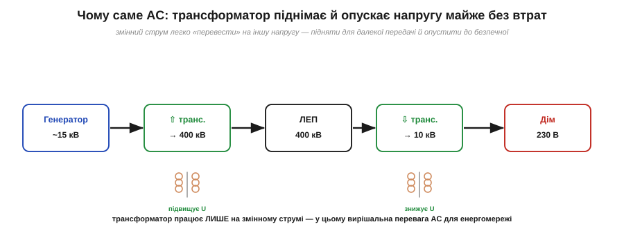

# Чому мережа змінна: транспорт енергії

Чому світова електромережа — змінна? Коротка відповідь звучить так: мережа змінна, бо змінну напругу легко перетворює **трансформатор** — підвищує для передачі, знижує для споживача, — а постійну тоді так перетворювати не вміли. Та за цим фактом стоїть глибша фізика: не просто «бо трансформатор», а **чому без трансформації передати енергію на великі відстані фізично неможливо** і яку саме перешкоду долає підвищення напруги. Цей механізм і розберемо кількісно.

Питання слушне й гостре. Уся ж електроніка — мікросхеми, процесори, телефони — працює на [постійному струмі](book:physics/dc-vs-ac); кожен пристрій усередині перетворює мережеву змінну напругу назад на постійну. То навіщо взагалі городити змінну мережу, якщо споживачеві потрібна постійна? Чому не передавати одразу постійний струм? Відповідь криється не в споживачі, а в **дорозі** від станції до розетки — у сотнях кілометрів дроту.

### Ворог далекої передачі — опір дроту

Уявімо, що енергію треба доправити від електростанції до міста за сотню кілометрів. Дроти — мідні чи алюмінієві, чудові провідники, — та на такій довжині навіть їхній малий [опір](book:physics/resistance) складається в помітну величину, адже опір росте з довжиною. І щойно дротом тече струм, цей опір **гріється**, безповоротно з'їдаючи частину переданої потужності. Ключове — за яким законом ці втрати ростуть. Потужність, що [виділяється теплом](book:physics/joule-heating) на опорі R, яким тече струм I, дорівнює:

```
P_втрат = I² · R
```

Зверніть увагу на **квадрат струму**. Це і є серце всієї історії. Втрати в дротах залежать не від напруги передачі, а від **струму** — і то квадратично. Подвоїте струм — втрати вчетверо; зменшите струм удесятеро — втрати впадуть у **сто** разів. А опір дроту R — заданий (його не змінити, не потовщивши й не вкоротивши лінію). Отже, єдиний спосіб різко зрізати втрати в лінії — гнати по ній **якомога менший струм**.

### Хитрість: та сама потужність — або великим струмом, або високою напругою

Але як передати велику потужність малим струмом? Тут і спрацьовує друга формула — [потужність](book:physics/electric-power) як добуток напруги на струм:

```
P = U · I
```

Одну й ту саму потужність P можна доставити **двома різними способами**: або помірною напругою й великим струмом, або високою напругою й малим струмом — бо важить лише їхній добуток. А оскільки втрати залежать тільки від струму (квадратично!), вибір очевидний: треба **підняти напругу** якомога вище, тоді струм для тієї самої потужності впаде, а з ним обвалом — і втрати.


*Рис. Та сама потужність двома способами. Угорі — низька напруга, тож великий струм (100 А); втрати ∝ 100². Унизу — піднята вдесятеро напруга, тож струм у 10 разів менший (1 А); втрати ∝ 1². Оскільки втрати йдуть із квадратом струму, передача високою напругою коштує у 100 разів менших утрат у дротах. Тому магістральні лінії несуть сотні кіловольтів.*

Покажемо силу цього на числах — вона вражає.

**Приклад (виграш від підвищення напруги).** Треба передати потужність P = 100 кВт лінією, опір якої R = 10 Ом. Порівняймо передачу при 1 кВ і при 100 кВ.

```
Варіант А — 1 кВ:
  струм   I = P/U = 100 000 / 1 000   = 100 А
  втрати  P_втрат = I²·R = 100² · 10   = 100 000 Вт = 100 кВт  (!!)
  → втрачаємо в дротах УСЮ потужність — передача безглузда

Варіант Б — 100 кВ (та сама потужність):
  струм   I = P/U = 100 000 / 100 000 = 1 А
  втрати  P_втрат = I²·R = 1² · 10     = 10 Вт
  → втрачаємо 10 Вт зі 100 000 — мізер (0.01 %)
```

Різниця приголомшлива: підняли напругу в 100 разів — струм упав у 100 разів — а втрати впали в **100² = 10 000** разів, із цілковито з'їденої потужності до незначних десятків ватів. Ось чому магістральні лінії електропередачі несуть **сотні кіловольтів**: це не примха, а єдиний фізичний спосіб доправити енергію далеко, не спаливши її дорогою в самих дротах. Без підвищення напруги далека передача просто неможлива.

### Чому це означає саме змінний струм

Отже, передавати треба **високою напругою**, а споживати — **низькою й безпечною** (у розетці 230 В, а не 100 000). Значить, напругу треба двічі **перетворити**: круто підняти на виході станції й знизити перед містом і будинком. І ось тут постійний струм програє начисто, а змінний — виграє.

Бо перетворити рівень **змінної** напруги вміє напрочуд простий, надійний і майже без втрат пристрій — **трансформатор** (*transformer*). Він працює саме на тому, що напруга **змінюється** в часі (на сталій постійній він просто не діє): в його основі лежить [електромагнітна індукція](book:physics/electromagnetic-induction) — та сама, що дає [синусоїдну напругу генератора](book:physics/sine-wave). Через це ланцюг від станції до розетки виглядає як кілька трансформаторних сходинок:


*Рис. Шлях енергії — це сходинки напруги. Генератор дає помірні кіловольти; підвищувальний трансформатор піднімає їх до сотень кіловольтів для далекої лінії (малий струм, малі втрати); наприкінці знижувальні трансформатори опускають напругу — спершу до розподільчих кіловольтів, тоді до безпечних 230 В у домі. Кожну сходинку робить трансформатор — а він працює лише на змінному струмі.*

Саме ця **легкість перетворення** і зробила світову мережу змінною. Постійний струм у часи [«війни струмів»](book:physics/dc-vs-ac) трансформувати не вміли взагалі — тож із ним кожне місто довелося б живити з електростанції чи не на сусідній вулиці, бо передати далеко низьку напругу неможливо, а підняти її було нічим. Змінний струм цю стіну обходив одним пристроєм — і переміг.

Тут варто бути чесним і не впадати в спрощення «AC завжди кращий». Перевага AC — саме й тільки в **легкості перетворення напруги** заради передачі. У самій передачі високою напругою постійний струм навіть **кращий** за змінний (у нього немає ні «реактивних» втрат, ні складнощів із синхронізацією) — і сьогодні наддалекі магістралі часом будують саме постійними, **HVDC**. Та можливим це стало лише тоді, коли навчилися дешево перетворювати рівень постійної напруги силовою електронікою (це вже зовсім інша, пізніша техніка). У XIX же столітті, коли закладали мережу, єдиним перетворювачем напруги був трансформатор — а він вимагає змінного струму. Тому світ і став на змінний, і досі переважно на ньому.

> 🔧 **Навіщо це.** Ця фізика пояснює, чому світ влаштований так, як він влаштований, — і дає кілька твердих практичних висновків. По-перше, **високовольтні лінії смертельно небезпечні** саме тому, що несуть сотні кіловольтів; повага до них — питання життя. По-друге, у кожному пристрої сидить **блок живлення**, що знижує мережеву напругу й випрямляє її на потрібну приладу постійну, — і саме він є місток між [«мережею змінною» і «електронікою постійною»](book:physics/dc-vs-ac). По-третє, розуміння «втрати ∝ I²·R» працює не лише в енергетиці: усюди, де тече великий струм — у дротах живлення плати, у роз'ємах, у доріжках, — вигідно тримати струм меншим (а напругу, де можна, вищою), бо нагрів і просадка ростуть зі струмом. Це той самий закон, що жене напругу в магістраль на сотні кіловольтів, лише в мініатюрі вашого пристрою.

---

Отже, мережа змінна не заради споживача (тому потрібна постійна напруга), а заради **транспорту енергії на відстань**. Втрати в дротах ідуть із **квадратом струму** (P_втрат = I²·R), тож щоб не спалити потужність дорогою, лінією треба гнати **малий струм**. Ту саму потужність (P = U·I) при малому струмі дає **висока напруга** — тому магістраль несе сотні кіловольтів, а виграш у втратах квадратичний (підняли U в 100× → втрати в 10 000× менші). Перетворювати ж рівень напруги легко й надійно вміє **трансформатор**, який працює **тільки на змінному струмі** (через електромагнітну індукцію). Тому світ і став на AC; постійний струм у самій передачі навіть кращий (HVDC), та потребує складної силової електроніки, якої в часи закладання мережі не існувало. Закон «втрати ∝ I²·R» працює й у мініатюрі будь-якого пристрою.
