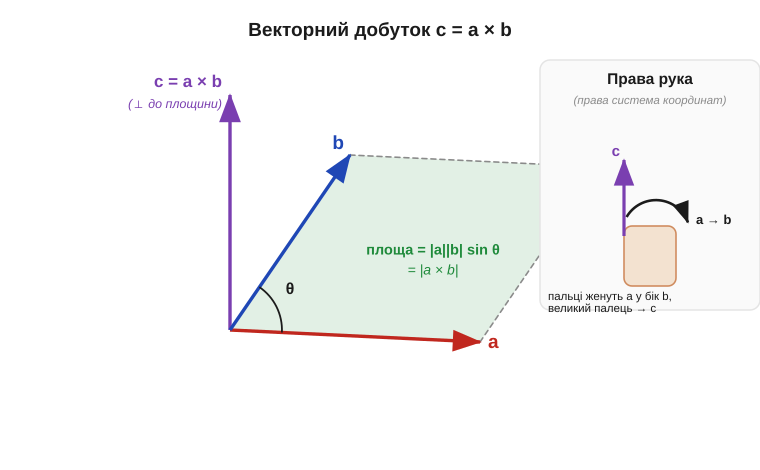
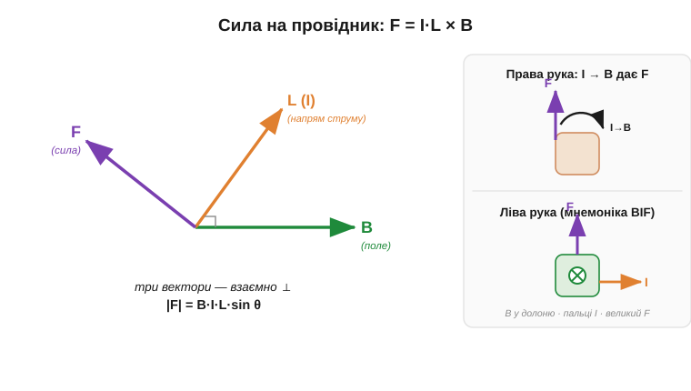

# 🧮 Векторний добуток: математика правил правої і лівої руки

[Сила Ампера](topic:physics/ampere-force) штовхає провідник зі струмом, і сила F виходить **збоку** — перпендикулярно і до струму, і до поля, а напрям ловлять «правилом руки». Рука — гарна мнемоніка, але за нею стоїть точна операція над векторами, **векторний добуток** (*cross product*, ×). Розберімо її окремо: коли ви її раз побачите, усі правила рук перестануть бути магією й стануть однією формулою.

### Навіщо тут окрема дія над векторами

Звичні нам добутки дають **число**. Помножити струм на опір — число; взяти [скалярний добуток](topic:math/dot-product) двох векторів (*dot product*, ·) — теж число, проєкцію одного на інший. Але сила Ампера поводиться інакше: її величина залежить від обох векторів, **а напрям лежить поза їхньою площиною**. Жоден добуток, що дає число, цього не передасть. Потрібна дія, яка з двох векторів робить **третій вектор** — і саме такою є операція ×.

### Означення: довжина і напрям

Щоб ця дія була справді корисною, її треба задати точно — окремо для довжини результату й окремо для його напряму. Векторний добуток c = a × b задають саме двома такими правилами.

```
|a × b| = |a| · |b| · sin θ      (θ — кут між a і b)
напрям  : ⊥ до площини (a, b), за правою рукою
```

Довжина має наочний геометричний сенс: |a||b|·sinθ — це **площа паралелограма**, побудованого на a і b. Звідси відразу видно два граничні випадки. Коли вектори **паралельні** (θ = 0), синус нульовий — паралелограм сплющується в лінію, добуток зникає. Коли вони **перпендикулярні** (θ = 90°), синус дорівнює 1 — площа найбільша. Саме тому сила на провідник максимальна, коли струм іде впоперек поля, і нульова, коли вздовж нього.


*Вектори a (червоний) і b (синій) з одного початку задають паралелограм; його площа |a||b|·sinθ дорівнює довжині добутку |a × b|. Сам вектор c = a × b (фіолетовий) стоїть перпендикулярно до всієї площини. Куди саме — вгору чи вниз — каже права рука: пальці женуть a у бік b, відігнутий великий палець показує c.*

### Чому напрям задає саме рука

Перпендикулярів до площини два — угору й униз. Який із них «правильний»? Тут і немає глибшої причини: це **угода** (*convention*). Домовилися брати той, що задає **права рука**: зігніть пальці правиці від першого вектора (a) до другого (b) найкоротшим шляхом — відставлений великий палець укаже c. Це та сама права система координат, у якій вісь z = x × y. Угода одна на всю фізику, тож, прийнявши її раз, ми вже не плутаємось.

Звідси випливає важлива риса: порядок співмножників **не байдужий**. Перестановка розвертає результат:

```
a × b = −(b × a)        (антикомутативність)
```

Рукою це видно одразу: щоб зігнути пальці від b до a, долоню треба перевернути — і великий палець дивиться в протилежний бік.

### Де це працює в курсі: сила Ампера

Найпряміший приклад — та сама сила Ампера. [Сила на прямий провідник](topic:physics/ampere-force) довжини L зі струмом I у полі B — це рівно векторний добуток, де роль «довжини першого вектора» грає струм:

```
F = I · (L × B)
|F| = B · I · L · sin θ        (θ — кут між проводом і полем)
```

Знайома формула F = B·I·L — це просто випадок θ = 90° (sinθ = 1), коли провід строго впоперек поля. А напрям сили — це напрям L × B, той самий перпендикуляр за правою рукою.


*Ліворуч: струм L (помаранчевий), поле B (зелений) і сила F (фіолетовий) — три взаємно перпендикулярні вектори, |F| = B·I·L·sinθ. Праворуч — дві однакові за результатом мнемоніки: «права рука» прямо застосовує добуток (пальці I → B, великий палець F), а шкільне «правило лівої руки» (BIF) дає те саме — поле входить у долоню, чотири пальці вздовж струму, відставлений великий палець показує силу.*

### Права чи ліва: чому мнемонік дві

У книжках трапляються обидва правила, і це бентежить. Розв'язка проста: математичний добуток L × B **завжди** означений через **праву** руку — це фізика. А «правило **лівої** руки» — лише шкільна мнемоніка для того самого результату, з іншим розкладом пальців (поле в долоню, пальці — струм, великий — сила). Обидві дають однакову стрілку сили; руки різні — бо пальцям у них призначено різні ролі. Надійніше тримати в голові один математичний образ — добуток за правою рукою, — і тоді жодна перестановка пальців не зіб'є.

> 🔧 **Навіщо це.** Той самий добуток × ще не раз стане в пригоді: момент сили на рамку зі струмом (основа стрілкового приладу і майбутнього мотора), сила на рухомий заряд, орієнтація осей у правій системі координат. Один раз засвоєний знак × економить години плутанини зі стрілками напрямів.

**Приклад (куди штовхне провід).** Горизонтальний провід тягнеться зі сходу на захід, струм тече на захід (вектор L — на захід). Поле B напрямлене горизонтально на північ, B = 0.2 Тл, струм I = 3 А, довжина в полі L = 0.1 м. Куди й з якою силою?

```
кут між проводом і полем θ = 90°  →  sin θ = 1
|F| = B · I · L = 0.2 · 3 · 0.1 = 0.06 Н
напрям = L × B : права рука, пальці із «заходу» у бік «півночі»
         → великий палець дивиться вертикально вниз
```

Сила 0.06 Н штовхає провід **униз**. Перевернімо струм (на схід) — за антикомутативністю L × B змінить знак, і провід піде **вгору**. Жодного гадання: напрям однозначно випливає з добутку.
