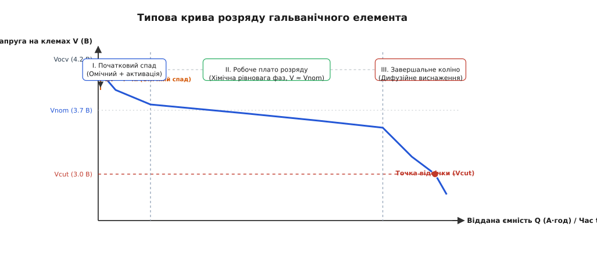
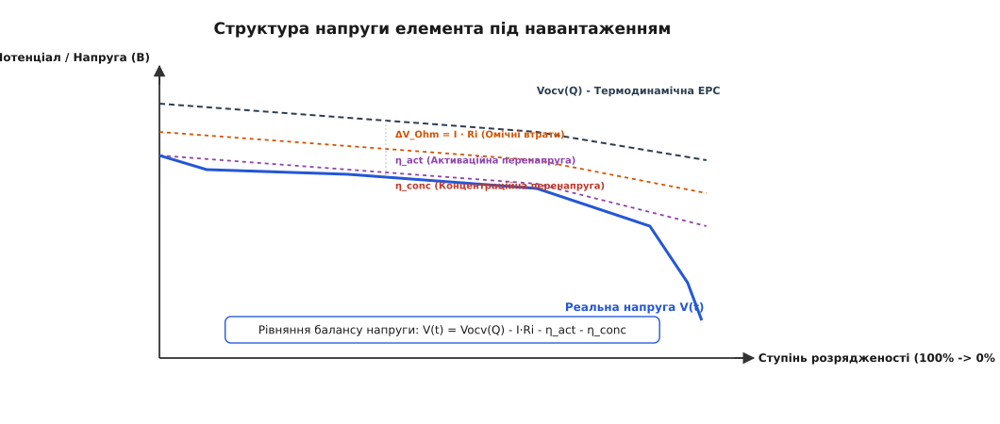
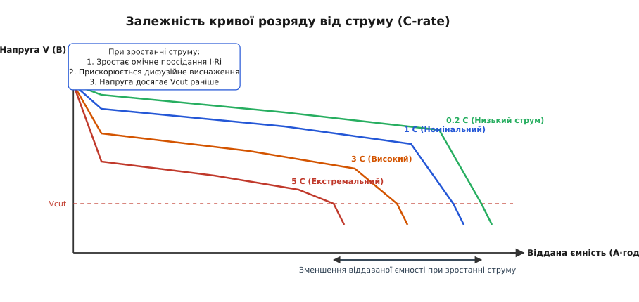
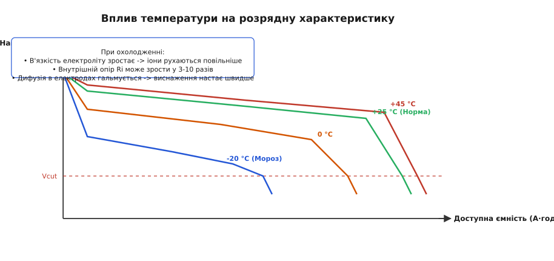

# Крива розряду батареї: від хімічного потенціалу до межі живлення

<preknowlist>
- [Електрорушійна сила (ЕРС)](topic:physics/emf) — термодинамічна різниця потенціалів клем джерела без навантаження.
- [Іонна провідність](topic:physics/ionic-conduction) — перенесення заряду іонами в електроліті під дією електричного поля та дифузії.
- [Внутрішній опір](topic:electronics/internal-resistance) — опір електроліту, електродів та контактів, що зумовлює омічне просідання напруги.
- [Замкнене коло](topic:physics/closed-circuit) — умова течії струму від анода до катода у зовнішньому колі та всередині джерела.
</preknowlist>

Коли портативний пристрій або електромобіль живиться від автономного хімічного джерела, [напруга](topic:physics/voltage) на його клемах ніколи не залишається строго постійною. Типовий літій-іонний елемент із номіналом `3.7 В` одразу після повного заряджання видає `4.2 В`, протягом більшої частини свого віддача утримує відносно стабільне плато `3.6–3.8 В`, а потім раптово стрімко падає до `3.0 В`, де схема захисту змушена аварійно відключити навантаження. Якби розробник електронного пристрою спрощено вважав батарею ідеальним джерелом постійної напруги, пристрій або передчасно вимикався б при першому сплеску струму, або зазнавав би незворотного хімічного руйнування від глибокого перерозряду.

Графік залежності клемної напруги від відданого заряду або часу розряду називають **кривою розряду батареї**. Вона не є простою технічною паспортограмою — це динамічний відбиток фізико-хімічних процесів, що відбуваються всередині елемента: від термодинамічної активності реагентів до кінетики переносу іонів і дифузійних обмежень в електроліті.

---

### Анатомія кривої: три ділянки розрядного графіка

Якщо розряджати повністю заряджений гальванічний елемент або акумулятор постійним помірним струмом, графік зміни клемної напруги `V(t)` проявляє три чітко виражені фази.


*Типова крива розряду елемента: І — релаксація та омічний спад на початку; ІІ — тривале робоче плато хімічної рівноваги; ІІІ — завершальне коліно виснаження носіїв заряда до межі відсічки Vcut.*

#### 1. Початковий спад (Релаксація та активація)
У момент замикання [замкненого кола](topic:physics/closed-circuit) напруга на клемах миттєво «стрибає» вниз від потенціалу розімкненого кола `V_ocv` (Open Circuit Voltage). Цей перший стрибок зумовлений падінням напруги на внутрішньому омічному опорі елемента `ΔV_Ohm = I · R_i`. 

Одразу після омічного стрибка спостерігається плавне додаткове зниження напруги протягом перших кількох хвилин. Це встановлення активаційної поляризації — подвійний електричний шар на межі розділу «електрод — електроліт» заряджається, а міжфазний перенос електронів виходить на стаціонарний режим.

#### 2. Робоче плато розряду
Після початкового спаду напруга стабілізується й формує довгу, відносно пласку ділянку — **розрядне плато**. Саме тут акумулятор віддає понад 70–80% своєї повної енергії. 

Форма й нахил цього плато визначаються термодинамікою хімічної реакції. У фазово-стабільних системах (наприклад, у свинцево-кислотних чи літій-залізо-фосфатних `LiFePO₄` елементах) хімічні потенціали анода й катода лишаються майже незмінними, поки співіснують дві фази матеріалу, тому плато виходить майже ідеально горизонтальним. У системах із постійним розчиненням або безперервною зміною концентрації іонів у твердому розчині (наприклад, у кобальтаті літію `LiCoO₂` або лужних марганцево-цинкових елементах) плато має помітний похилий нахил.

Середнє значення напруги на цьому плато визначає так звану **номінальну напругу** елемента `V_nom` (наприклад, `1.2 В` для NiMH, `2.0 В` для свинцево-кислотних, `3.2 В` для LiFePO₄ та `3.7 В` для Li-ion).

#### 3. Завершальне коліно виснаження (Cutoff)
Коли більша частина активної речовини на електродах вичерпана, концентрація вільних іонів-носіїв біля реакційних центрів падає до нуля. Масоперенос більше не встигає забезпечувати задану густину струму.

На розрядній кривій це виглядає як крутий, майже вертикальний обрив напруги вниз — так зване «коліно» розряду. Спроба продовжувати розряджати елемент нижче безпечного порогу **напруги відсічки** `V_cut` (наприклад, `3.0 В` або `2.5 В` для Li-ion) призводить до незворотного руйнування електродних матеріалів, розчинення мідної фольги анода, виділення газів та втрати ємності.

---

### Фізико-хімічні механізми втрат: омічне просідання та поляризація

Щоб зрозуміти, чому клемна напруга батареї під навантаженням відрізняється від її ЕРС, потрібно простежити весь шлях проходження заряду крізь хімічний елемент. 

У зовнішньому колі струм переноситься вільними електронами крізь металеві провідники та навантаження. Проте всередині батареї електрони не можуть вільно рухатися крізь рідкий або гелевий електроліт. Естафету перенесення заряду переймають іони (наприклад, катіони `Li⁺` у літієвих або `H⁺` у кислотних батареях). На двох межах розділу між металевими струмознімачами та електролітом відбуваються гетерогенні окисно-відновні реакції.

Напруга на клемах розряджуваного елемента в будь-який момент часу є меншою за фундаментальну ЕРС `V_ocv`. Різниця між термодинамічною ЕРС та реальною напругою називається **поляризацією елемента**. Вона складається з трьох фізичних внесків:

```
V(t) = V_ocv(Q) - ΔV_Ohm - η_act - η_conc
```


*Розклад потенціалу елемента: від термодинамічної ЕРС Vocv через омічний спад I·Ri, активаційну перенапругу η_act та дифузійний бар'єр η_conc до реальної клемної напруги.*

> 🧮 Детальний математичний вивід кожної з трьох складових перенапруги на основі рівнянь Нернста, Батлера — Фольмера та дифузійних законів Фіка наведено у вставці: [Математична модель розрядної кривої та поляризаційних перенапруг](topic:physics/battery-discharge-curve/math-discharge-model.md).

Розглянемо фізичну природу кожного з трьох компонентів втрат:

#### 1. Омічні втрати (`ΔV_Ohm = I · R_i`)
Викликані електронним опором колекторів струму (металевих фольг), опором активної маси електродів та [іонною провідністю](topic:physics/ionic-conduction) електроліту й пористого сепаратора. Омічний спад виникає й зникає безинерційно — миттєво в момент ввімкнення або вимкнення струму. Це явище лежить в основі ефекту [просідання напруги батареї](topic:electronics/battery-sag).

#### 2. Активаційна поляризація (`η_act`)
Електрохімічна реакція відновлення чи окиснення вимагає подолання енергетичного бар'єра переносу заряду між атомами електрода та іонами в розчині. Щоб змусити електрони долати цей бар'єр зі швидкістю, що відповідає струмові `I`, потрібна додаткова різниця потенціалів `η_act`. Кінетика цього процесу підпорядковується рівнянню Батлера — Фольмера, тому активаційна перенапруга зростає логарифмічно з ростом струму.

#### 3. Концентраційна (дифузійна) поляризація (`η_conc`)
Під час проходження струму іони споживаються на поверхні електрода. Щоб реакція тривала, нові іони мусять прибувати з глибини електроліту та дифундувати всередину твердих гранул активного матеріалу. Якщо струм великий, дифузія не встигає поповнювати локальну концентрацію, утворюється градієнт концентрації `ΔC`. Згідно з рівнянням Нернста, локальне виснаження іонів зменшує електродний потенціал. Коли локальна концентрація на поверхні прямує до нуля, `η_conc` прямує до нескінченності, формуючи кінцеве коліно кривої.

---

### Вплив струму: C-rate, омічний спад і ефект Пешара

Один і той самий акумулятор формує принципово різні розрядні криві залежно від величини струму, який з нього відбирають. Для нормалізації струму відносно розміру елемента використовують величину **C-rate** (C-кратність):
- Струм `1 C` означає струм, що чисельно дорівнює номінальній ємності батареї в ампер-годинах. Для елемента на `3.0 А·год` струм `1 C` дорівнює `3.0 А` (час розряду близько 1 години).
- Струм `0.2 C` для того ж елемента дорівнює `0.6 А` (час розряду близько 5 годин).
- Струм `5 C` дорівнює `15 А` (теоретичний час розряду 12 хвилин).


*Родина розрядних кривих при різних C-rate: зростання струму знижує рівень робочого плато через омічний спад і прискорює дифузійне виснаження, зменшуючи корисну віддану ємність.*

Зростання струму розряду спричиняє два наслідки:
1. **Вертикальний зсув плато вниз:** Збільшення струму `I` прямо пропорційно збільшує омічне просідання `I · R_i` та активаційну перенапругу. Розрядне плато опиняється нижче за напругою.
2. **Горизонтальне стискання ємності (Закон Пешара):** При високих струмах концентраційна поляризація досягає критичного значення `V_cut` набагато раніше, ніж хімічні реагенти у глибині електрода встигають вступити в реакцію. Акумулятор вимикається за напругою відсічки, віддавши менше ампер-годин, ніж його повна номінальна ємність.

Емпірична формула Пешара пов'язує час розряду `t` зі струмом `I`:

```
Iᵏ · t = Cₚ
```

де `k` — показник Пешара (`1.05–1.30` для свинцевих та `1.01–1.05` для сучасних літієвих батарей). Чим ближчий `k` до `1.0`, тим менше батарея втрачає ємність при високих струмах.

> 📜 Про те, як вивчали поляризацію перших вольтових стовпів та як відкриття закону Пешара 1897 року змінило уявлення про ємність акумуляторів, читайте у вставці: [Від водневої поляризації до літієвої революції: історія вимірювання розрядних характеристик](topic:physics/battery-discharge-curve/hist-battery-curves.md).

---

### Вплив температури: в'язкість електроліту та термодинаміка

Температура навколишнього середовища радикально змінює фізичні властивості матеріалів всередині батареї: [іонну рухливість](topic:physics/ionic-conduction) електроліту, коефіцієнт твердотільної дифузії іонів та опір міжфазних меж.


*Розрядні криві за різних температур: мороз спричиняє велетенський омічний спад та різке скорочення віддаваної ємності; підвищена температура піднімає плато, але прискорює деградацію.*

#### Розряд на морозі (низькі температури)
При зниженні температури (наприклад, від `+25 °C` до `-20 °C`):
- В'язкість рідкого електроліту зростає в рази, а коефіцієнт іонної дифузії `D(T)` падає за законом Арреніуса `D = D₀ · exp(-E_a / (R · T))`.
- Внутрішній опір елемента `R_i` зростає у 3–10 разів.
- Омічне падіння напруги `I · R_i` стає величезним: під навантаженням напруга миттєво просідає майже до межі відсічки.
- Концентраційне виснаження на поверхні електродів настає вкрай швидко. У результаті при `-20 °C` акумулятор може віддати лише 30–50% своєї номінальної ємності до моменту, коли напруга впаде нижче `V_cut`.

#### Розряд при підвищеній температурі
При підвищенні температури (до `+45 °C`):
- Іонна рухливість зростає, опір `R_i` зменшується, а плато напруги стає навіть трохи вищим, ніж при `+25 °C`.
- Віддавана ємність досягає 100–102% від номіналу.
- Однак висока температура катастрофічно прискорює побічні хімічні реакції розкладу електроліту та зростання пасиваційної плівки SEI, що приводить до швидкої [деградації та старіння батареї](topic:electronics/battery-aging).

---

### Хімічна специфіка розрядних характеристик

Різні хімічні системи мають принципово різну форму розрядних кривих, що зумовлено термодинамікою їхніх внутрішніх матеріалів.

#### 1. Свинцево-кислотні акумулятори (Lead-Acid, 2.0 В / осередок)
Мають монотонно похилу розрядну криву від `2.1 В` (100% SoC) до `1.75 В` (0% SoC). Похилий нахил зумовлений тим, що під час розряду сірчана кислота `H₂SO₄` зв'язується в сульфат свинцю `PbSO₄`, і густина електроліту безперервно зменшується від `1.28 г/см³` до `1.15 г/см³`. Зміна концентрації кислоти безпосередньо зміщує Нернстівський потенціал.

#### 2. Нікель-кадмієві (NiCd) та нікель-металогідридні (NiMH, 1.2 В / осередок)
Формують тривале пласке розрядне плато на рівні `1.20–1.25 В`, яке тримається до 85% виснаження, після чого стрімко падає до `1.0 В`. Елементи NiCd схильні до так званого «ефекту пам'яті» — якщо їх систематично розряджати лише наполовину, на розрядній кривій з'являється другорядне нижче плато («step dip»), яке зменшує робочу напругу.

#### 3. Літій-залізо-фосфатні акумулятори (LiFePO₄ / LFP, 3.2 В / осередок)
Володіють найпласкішим розрядним плато серед усіх сучасних хімій. Напруга утримується у вузькому вікні `3.20–3.25 В` від 20% до 90% стану заряду. Це пояснюється тим, що фазовий перехід між `LiFePO₄` та `FePO₄` є двофазним переходом першого роду, де хімічний потенціал лишається строго константним.

#### 4. Літій-нікель-марганець-кобальтові (NMC / NCA, 3.7 В / осередок)
Утворюють помірно похилу розрядну криву від `4.2 В` до `3.0 В`. Нахил зумовлений однофазним твердотільним розчиненням іонів літію в кристалічній ґратці оксиду металу, де хімічний потенціал плавно змінюється зі ступенем інтеркаляції `x`.

#### 5. Літій-титанатовий акумулятор (LTO, 2.4 В / осередок)
Завдяки кристалічній ґратці титанату літію з нульовою деформацією («zero-strain»), елементи LTO здатні видавати розрядні струми до `10C–20C` без суттєвого дифузійного виснаження, зберігаючи пласке плато напруги навіть при екстремальних навантаженнях.

---

### Еволюція внутрішнього опору та теплове саморозігрівання

Внутрішній опір елемента `R_i` не є сталим значенням уздовж розрядної кривої. Його функція `R_i(SoC)` проявляє характерний U-подібний або V-подібний профіль:

1. **На початку розряду (100% SoC):** Опір `R_i` є відносно високим через товстий шар розчинника біля електродів та початкову температуру.
2. **На робочому плато (80%–20% SoC):** Опір падає до мінімуму. Під час проходження струму виділяється Джоулеве тепло `P = I² · R_i`, яке підігріває елемент. Підвищення температури покращує [іонну провідність](topic:physics/ionic-conduction) електроліту, компенсуючи часткове виснаження.
3. **Наприкінці розряду (нижче 10% SoC):** Опір `R_i` зростає експоненціально у 3–5 разів. Це зумовлено виснаженням іонів у порах активного матеріалу та різким зменшенням електронної провідності виснаженого катодного матриксу.

Виділення тепла створює позитивний зворотний зв'язок: при розряджанні великим струмом саморозігрів елемента знижує `R_i(T)`, що трохи піднімає клемну напругу в середині розряду. Проте якщо тепловідвід недостатній, цей процес може перейти у небезпечний тепловий розгін (Thermal Runaway).

---

### Імпульсний розряд та ефект релаксації (Recovery Effect)

У реальних електронних системах (наприклад, у смартфонах, що періодично вмикають передавач Wi-Fi/LTE, або в імпульсних моторних інверторах) розряд здійснюється не постійним струмом, а короткими високоамплітудними імпульсами.

Коли після паузи розрядного струму навантаження миттєво вимикається (`I = 0`), клемна напруга не просто повертається до початкового рівня, а проявляє двостадійну релаксацію:
1. **Миттєвий стрибок нагору:** Напруга піднімається на величину омічного спаду `ΔV = I · R_i` за частки мікросекунди.
2. **Тривалий дифузійний підйом:** Протягом кількох хвилин напруга повільно зростає від значення `V_terminal` до стану термодинамічної рівноваги `V_ocv`. Це явище називають **ефектом відновлення (Recovery Effect)**.

Під час пауз у споживанні струму градієнти концентрації іонів `ΔC` всередині пористих електродів розсмоктуються за рахунок вільної дифузії. Іони з глибини електроліту повертаються до виснаженої поверхні електрода. Завдяки цьому при переривчастому (імпульсному) розряді батарея здатна віддати більше корисної ємності, ніж при неперервному розряджанні тим самим піковим струмом.

---

### Батарейні збірки та дисбаланс осередків

У високовольтних батарейних блоках (наприклад, у батареях електромобілів на 400 В або 800 В) сотні осередків з'єднуються послідовно. Форма розрядної кривої кожного окремого осередку незначно відрізняється через технологічний розкид ємності `Q_max` та внутрішнього опору `R_i`.

Під час розряду послідовного ланцюга крізь усі осередки тече один і той самий струм `I`. Проте елемент із найменшою ємністю або найбільшим опором `R_i` досягає відсічки `V_cut` першим. У цей момент BMS змушена зупинити розряд всієї батареї, щоб запобігти перерозряду «слабкої» ланки, хоча інші осередки ще мають 10–15% залишку енергії.

Саме для компенсації розбіжностей розрядних кривих осередків у батарейних збірках застосовують системи балансування (пасивне резистивне або активне індуктивно-ємнісне балансування).

---

### Від вимірювання напруги до оцінки заряду (SoC та BMS)

Форма розрядної кривої безпосередньо визначає складність побудови систем оцінки залишку енергії (State of Charge, SoC) у сучасній мікроконтролерній техніці.

#### Нелінійність зв'язку напруга-SoC
Якби крива розряду була строго похилою прямою лінією від `4.2 В` до `3.0 В`, контролерові достатньо було б просто виміряти напругу за допомогою АЦП:

```
SoC_approx = (V_cell - V_cut) / (V_full - V_cut)
```

Однак через наявність довгого пласького плато (особливо у LiFePO₄ елементів, де напруга утримується біля `3.2 В` у діапазоні від 20% до 80% SoC) зміна напруги на `10 мВ` може відповідати зміні ємності на 30%. Найменший шум АЦП чи зміна струму навантаження дає колосальну похибку визначення залишку ходу або часу роботи.

#### Двокомпонентний підхід BMS
Сучасна [система управління батареєю (BMS)](topic:electronics/bms) використовує комбінований метод оцінки:
1. **Динамічний кулон-лічильник (Coulomb Counting):** Інтегрує виміряний струм за часом `Q(t) = ∫ I dt`, віднімаючи його від початкової ємності.
2. **Корекція за опорною кривою OCV:** Коли пристрій переходить у стан спокою (струм `I ≈ 0` протягом кількох хвилин), активаційна та концентраційна поляризація повністю згасають. Напруга відновлюється до значення `V_ocv`. Контролер вимірює `V_ocv`, за нелінійною таблицею точно визначає абсолютний SoC і обнуляє накопичену похибку інтегрування кулон-лічильника.

> ⚙️ Практичну реалізацію алгоритму оцінювача SoC із кусково-лінійною інтерполяцією кривої OCV, компенсацією омічного просідання та захисною відсічкою мовами C та C++ наведено у вставці: [Алгоритм оцінки стану заряду (SoC)](topic:physics/battery-discharge-curve/proj-soc-estimator.md).

---

### Порівняння з іншими джерелами енергії

> 🔧 **Навіщо це.** Фізична форма розрядної кривої задає архітектуру системи живлення. Залежно від того, як саме джерело віддає напругу під навантаженням, розробник обирає відповідний тип конвертора та метод вимірювання залишку енергії.

Зіставимо розрядні характеристики різних типів накопичувачів та перетворювачів енергії:

| Тип джерела | Форма розрядної кривої `V(t)` | Характерний діапазон `V` | Головний фізичний обмежувач |
| :--- | :--- | :--- | :--- |
| **Літій-іонний акумулятор (Li-ion / NMC)** | Похиле плато з двома вигинами | `4.2 В → 3.0 В` | Дифузія іонів у твердій фазі електрода |
| **Літій-залізо-фосфат (LiFePO₄)** | Майже ідеально пласке горизонтальне плато | `3.4 В → 3.0 В` | Двофазний інтеркаляційний перехід |
| **Свинцево-кислотний акумулятор** | Монотонно похила лінія | `12.6 В → 10.5 В` | Зміна концентрації `H₂SO₄` в електроліті |
| **Суперконденсатор (Іоністор)** | Строго лінійна похила (`V(t) = V₀ - I·t/C`) | `2.7 В → 0.0 В` | Електростатичне накопичення заряду |
| **Паливний елемент (Fuel Cell)** | Залежить від протоку реагентів, падіння від струму | `0.9 В → 0.5 В` | Масоперенос кисню та водню через мембрану |

Звідси випливає важливий інженерний висновок:
- **Конденсатори та іоністори** вимагають обов'язкового застосування імпульсних підвищувально-знижувальних перетворювачів (Buck-Boost), оскільки їхня напруга під час віддачі заряду падає до нуля.
- **Хімічні батареї** завдяки розрядному плато дозволяють більшості електронних схем працювати безпосередньо або через простий знижувальний регулятор (LDO / Buck) протягом майже всього циклу розряду.

Таким чином, крива розряду батареї виступає мостом між мікроскопічною електрохімічною кінетикою іонного переносу та макроскопічною поведінкою реальних електричних кіл. Без урахування її трьох ділянок, температурної залежності та поляризаційних втрат неможливо створити ані надійний мобільний телефон, ані безпечний електротранспорт або ефективну енергосистему.
