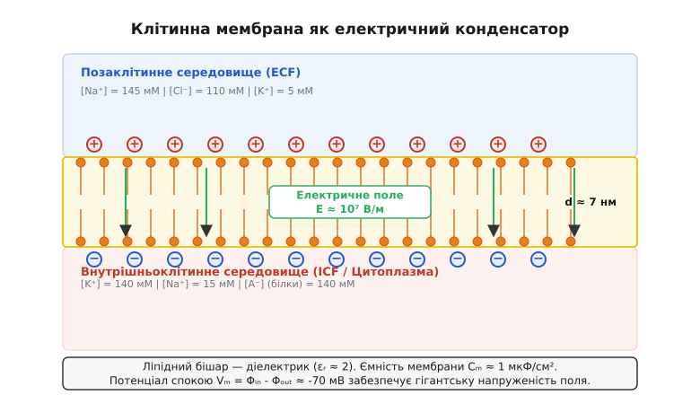
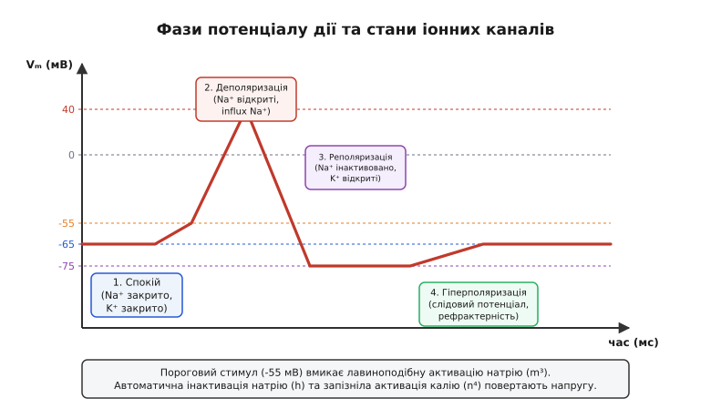
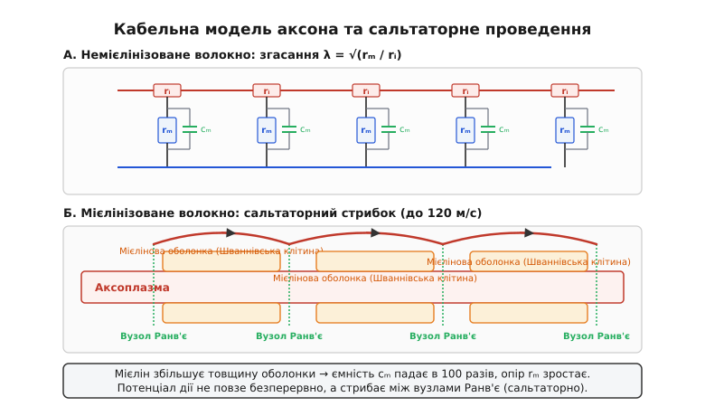
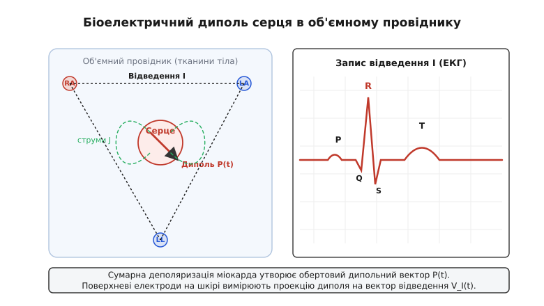

# Біоелектрика: електродинаміка живих мембран

<preknowlist>
- [Електричний потенціал](topic:physics/electric-potential) — робота з перенесення одиничного заряду в електричному полі.
- [Іонна провідність](topic:physics/ionic-conduction) — струм у рідкому середовищі як двонаправлений дрейф катіонів та аніонів.
- [Закон Ома](topic:electronics/ohm-law) — пропорційність струму, напруги та опору ділянки кола.
- [Електрична ємність](topic:physics/capacitive-coupling) — накопичення заряду на межі розподілу двох провідників, розділених діелектриком.
</preknowlist>

Кожна жива клітина людського організму — від нейрона головного мозку до м'язового волокна серця — є мікроскопічним електрохімічним генератором. Понад третину всієї метаболічної енергії, яку організм отримує з їжею у вигляді аденозинтрифосфату (АТФ), клітина безперервно витрачає на єдину фізичну задачу: підтримання постійної різниці електричних потенціалів між цитоплазмою та міжклітинним середовищем. Якщо ця напруга падає до нуля, клітина незворотно гине. Тонка біологічна оболонка товщиною всього в кілька нанометрів утримує електричне поле такої напруженості, яка в техніці межує з пробоєм діелектрика, а виникаючі на ній струми керують думками, скороченнями м'язів та ритмом серцебиття.

## 1. Життя як електричний дисбаланс: структура та ємність мембрани

З точки зору класичної електродинаміки, межа клітини є двошаровою структурою із фосфоліпідних молекул (від грец. *ліпос* — жир). Гідрофобні вуглеводневі хвости молекул орієнтовані всередину, утворюючи суцільне жирове ядро товщиною `d ≈ 7 нм`, а гідрофільні фосфатні головки звернені назовні — до водних розчинів цитоплазми та міжклітинного середовища.

Оскільки внутрішнє жирове середовище мембрани позбавлене вільних зарядів, воно є високоякісним діелектриком із відносною діелектричною проникністю `εᵣ ≈ 2`. Натомість цитоплазма та міжклітинна рідина являють собою водні розчини солей-електролітів із високою [іонною провідністю](topic:physics/ionic-conduction) (діелектрична проникність води `ε_water ≈ 80`). Утворюється класична плоска конденсаторна структура: два рідкі провідники, розділені тонким шаром діелектрика.


*Клітинна мембрана розділяє заповнені іонами розчини. Заряджений подвійний шар створює напруженість поля E ≈ 10⁷ В/м.*

Питома електрична ємність такої біологічної мембрани на одиницю площі розраховується за формулою плоского конденсатора:

```
C_m = (ε₀ · εᵣ) / d
```

Підставивши значення електричної сталої `ε₀ = 8.854·10⁻¹² Ф/м`, діелектричної проникності ліпідів `εᵣ ≈ 2.2` та товщини `d = 7·10⁻⁹ м`, отримуємо:

```
C_m = (8.854·10⁻¹² · 2.2) / (7·10⁻⁹) ≈ 2.78·10⁻³ Ф/м² ≈ 1.0 мкФ/см²
```

Експериментальні вимірювання підтверджують: питома ємність біологічних мембран майже всіх живих організмів на Землі становить дивовижно сталу величину — приблизно `1.0 мкФ/см²` (або `0.01 Ф/м²`).

Висока ємність означає, що для зміни напруги на мембрані потрібен зовсім невеликий іонний струм. Низька діелектрична проникність ліпідного ядра `εᵣ ≈ 2` створює високий борнівський енергетичний бар'єр для одиночних іонів: енергія перенесення іона радіуса `r` із води (`ε = 80`) у ліпід (`ε = 2`) дорівнює `ΔW = (z² e² / 8π ε₀ r) · (1/ε_lipid - 1/ε_water) ≈ 40 k_B T`. Тому чистий ліпідний бішар є повністю непроникним для заряджених частинок, виконуючи роль ідеального ізолятора.

У стані спокою внутрішня поверхня мембрани нейрона заряджена від'ємно відносно зовнішньої, створюючи різницю потенціалів `V_m = Φ_in - Φ_out ≈ -70 мВ` (мілівольт). Хоча напруга `-70 мВ` у побутовому розумінні є крихітною, вона зосереджена на надзвичайно малій товщині `7 нм`. Напруженість електричного поля `E` всередині мембрани сягає велетенських значень:

```
E = |V_m| / d = 0.070 В / (7·10⁻⁹ м) = 10 000 000 В/м = 10⁷ В/м = 100 кВ/см
```

Напруженість поля `10⁷ В/м` наближається до межі електричного пробою повітря та багатьох сухих трансформаторних масел. Мембрана витримує таке поле завдяки високій впорядкованості ліпідного бішару. Лише підвищення напруги до рівнів понад `200 – 300 мВ` викликає фізичний розрив ліпідного шару — явище **електропорації** (від грец. *електро* + латин. *порус* — отвір).

Який саме шар іонів створює цю напругу? Знайдемо поверхневу густину заряду `σ_q`, необхідну для заряджання ємності `C_m` до напруги `70 мВ`:

```
σ_q = C_m · V_m = 1.0·10⁻² Ф/м² · 0.070 В = 7.0·10⁻⁴ Кулон/м²
```

Оскільки заряд одного моля одновалентних іонів дорівнює сталій Фарадея `F ≈ 96485 Кл/моль`, поділимо `σ_q` на `F`:

```
n_ions = σ_q / F = 7.0·10⁻⁴ / 96485 ≈ 7.26·10⁻⁹ моль/м²
```

Це означає, що для створення потенціалу спокою `-70 мВ` достатньо розділити невелику кількість іонів — всього близько 7 наномолей на кожен квадратний метр мембрани. Ця частка становить менше `0.01%` від загальної кількості іонів усередині клітини. Решта об'єму цитоплазми лишається повністю електронейтральною.

> 📜 Про те, як понад два століття тому розгорталася драматична суперечка між Луїджі Ґальвані та Алессандро Вольтою щодо «тваринної електрики», і як науковці пройшли шлях від здригання жаб'ячих лапок до вимірювання пікоамперних струмів окремих білкових пор: вставка [Від жаб’ячих лапок до іонних каналів](topic:physics/bioelectricity/hist-galvani-volta.md).

## 2. Іонні градієнти та молекулярні помпи

Електричний потенціал на мембрані не міг би існувати без різниці концентрацій іонів між внутрішньою та зовнішньою сторонами клітини. Усі живі клітини підтримують принципово асиметричний розподіл чотирьох основних іонів: калію `K⁺`, натрію `Na⁺`, хлору `Cl⁻` та кальцію `Ca²⁺`.

Типові молярні концентрації іонів для нейрона ссавця у стані спокою:

| Іон | Концентрація зовні (`C_out`) | Концентрація всередині (`C_in`) | Напрямок градієнта |
| :--- | :--- | :--- | :--- |
| **Калій (`K⁺`)** | `5 мМ` | `140 мМ` | Зсередини назовні (у 28 разів вища всередині) |
| **Натрій (`Na⁺`)** | `145 мМ` | `15 мМ` | Ззовні всередину (майже у 10 разів вища зовні) |
| **Хлор (`Cl⁻`)** | `110 мМ` | `10 мМ` | Ззовні всередину (у 11 разів вища зовні) |
| **Кальцій (`Ca²⁺`)** | `1.5 мМ` | `0.0001 мМ` (`100 нМ`) | Ззовні всередину (у 15 000 разів вища зовні) |

Окрім неорганічних іонів, усередині клітини міститься висока концентрація крупних органічних аніонів `A⁻` (заряджені білки, нуклеїнові кислоти, фосфати) із загальною концентрацією близько `140 мМ`. Вони є занадто великими, щоб проходити крізь ліпідну мембрану, і назавжди заперті у цитоплазмі, створюючи постійне внутрішнє від'ємне фонове середовище.

Як створюється ця асиметрія? Закони дифузії прагнуть вирівняти концентрації, тож іони натрію безперервно просочуються всередину клітини, а іони калію — назовні. Для протидії пасивному витіканню у мембрану вбудовані спеціальні білкові молекули-транспортери — **іонні помпи** (насоси).

Найважливішою серед них є **натрієво-калієва аденозинтрифосфатаза** (`Na⁺/K⁺`-АТФаза). Цей білковий комплекс використовує хімічну енергію розщеплення однієї молекули АТФ для примусового перенесення **трьох іонів `Na⁺` з клітини назовні** в обмін на введення **двох іонів `K⁺` всередину клітини**:

```
3 Na⁺_in + 2 K⁺_out + АТФ ⟶ 3 Na⁺_out + 2 K⁺_in + АДФ + Ф_і
```

Цикл роботи помпи протікає через зміну двох конформаційних станів (`E_1` та `E_2`):
1. **Стан `E_1`**: Білок відкритий всередину цитоплазми і володіє високим сродством до іонів `Na⁺`. Зв'язування трьох іонів `Na⁺` стимулює гідроліз АТФ і фосфорилювання білка.
2. **Перехід `E_1-P → E_2-P`**: Приєднання фосфатної групи викликає конформаційну перебудову. Пора відкривається назовні клітини, сродство до `Na⁺` падає у 100 разів, і три іони `Na⁺` вивільняються у міжклітинне середовище.
3. **Стан `E_2`**: Відкрита назовні пора володіє високим сродством до іонів `K⁺`. Зв'язування двох іонів `K⁺` стимулює відщеплення фосфату (дефосфорилювання).
4. **Повернення у `E_1`**: Пора знову повертається всередину, вивільняючи два іони `K⁺` у цитоплазму.

Оскільки за один цикл помпа виносить три додатні заряди `Na⁺` і заносить лише два додатні заряди `K⁺`, кожен оберт помпи викачує з клітини один чистий додатний заряд. Це утворює прямоточний **електрогенний струм помпи** `I_pump`, який створює додатковий від'ємний потенціал близько `-5 мВ` у стані спокою і безперервно підтримує концентраційні градієнти `Na⁺` та `K⁺`.

## 3. Потенціал спокою: рівновага Нернста та рівняння Ґольдмана

Припустимо на мить, що в мембрані спокійного нейрона відкриті лише іонні канали, проникні для калію `K⁺`, а канали для натрію та хлору щільно закриті.

У цьому разі іони калію почнуть дифундувати з цитоплазми (де їх `140 мМ`) назовні (де їх всього `5 мМ`) за градієнтом концентрації. Виходячи назовні, кожен іон `K⁺` виносить один додатний електричний заряд `+e`. Проте великі аніони білків `A⁻` не можуть піти слідом за калієм і лишаються на внутрішній поверхні мембрани.

Виникає розділення зарядів: зовнішня поверхня мембрани заряджається позитивно, а внутрішня — негативно. Це створює внутрішньоспрямоване електричне поле `E`, яке жене іони калію назад у клітину.

Зі зростанням виходу калію електричне поле посилюється, доки електростатична сила притягання не зрівняється за величиною із силою дифузійного тиску. Встановлюється **динамічна термодинамічна рівновага одного іона**.

Потенціал напруги, при якому дифузійний потік іона точно дорівнює зворотному електричному дрейфовому потоку, описується **рівнянням Нернста**:

```
E_ion = (R · T / (z · F)) · ln([Ion]_out / [Ion]_in)
```

де `R` — газова стала (`8.314 Дж/(моль·К)`), `T` — температура в кельвінах, `F` — стала Фарадея (`96485 Кл/моль`), `z` — валентність іона.

Розрахуємо рівноважний потенціал Нернста для калію `E_K` при температурі тіла людини `T = 37 °C = 310.15 K`:

```
E_K = (8.314 · 310.15 / (1 · 96485)) · ln(5 / 140)   [підстановка констант та концентрацій калію]
    = 0.02671 В · ln(0.03571)                         [обчислення термічного потенціалу R·T/F та відношення 5/140]
    = 0.02671 В · (-3.3322)                          [значення натурального логарифма]
    = -0.0890 В = -89.0 мВ                           [підсумковий потенціал Нернста для калію]
```

Якби мембрана у стані спокою була проникна **виключно** для калію, потенціал клітини дорівнював би суворо `-89.0 мВ`.

Проте реальна мембрана володіє невеликою «витікаючою» проникністю також для іонів натрію та хлору. Відносні коефіцієнти проникності мембрани нейрона у стані спокою відносяться як:

```
P_K : P_Na : P_Cl = 1.0 : 0.04 : 0.45
```

Проникність для натрію `P_Na = 0.04` становить лише 4% від калієвої, але оскільки рівноважний потенціал натрію є сильно позитивним (`E_Na = +60.6 мВ`), навіть незначний вхідний потік натрію підтягує реальний потенціал спокою у позитивний бік від калієвого рівноважного рівня.

За наявності декількох іонів виникає стан **рівноваги Доннана** (від імені ірландського хіміка Фредеріка Доннана). Непроникні внутрішньоклітинні аніони білків `A⁻` змушують пасивно проникні іони хлору `Cl⁻` перерозподілятися так, щоб їхній рівноважний потенціал Нернста `E_Cl` збігався з реальним потенціалом спокою мембрани `V_m`:

```
[Cl⁻]_in / [Cl⁻]_out = [K⁺]_out / [K⁺]_in
```

Стаціонарна напруга мембрани з урахуванням усіх іонів описується **рівнянням Ґольдмана-Годжкіна-Катца (GHK)**:

```
V_m = (R·T / F) · ln[ (P_K·[K⁺]_out + P_Na·[Na⁺]_out + P_Cl·[Cl⁻]_in) / (P_K·[K⁺]_in + P_Na·[Na⁺]_in + P_Cl·[Cl⁻]_out) ]
```

Підставивши у рівняння GHK біологічні концентрації та відносні проникності при `37 °C`, отримуємо значення потенціалу спокою нейрона:

```
V_m = 61.51 мВ · lg[ (1.0·5 + 0.04·145 + 0.45·10) / (1.0·140 + 0.04·15 + 0.45·110) ]  [формула GHK при T = 310.15 K]
    = 61.51 мВ · lg[ (5.0 + 5.8 + 4.5) / (140.0 + 0.6 + 49.5) ]                       [підстановка продуктів P_i · C_i]
    = 61.51 мВ · lg[ 15.3 / 190.1 ]                                                    [суми в чисельнику та знаменнику]
    = 61.51 мВ · lg(0.08048)                                                           [значення дробу в логарифмі]
    = 61.51 мВ · (-1.0943) = -67.3 мВ                                                  [підсумковий потенціал спокою]
```

Теорія передбачає потенціал спокою `-67.3 мВ`, що ідеально збігається з прямими експериментальними вимірюваннями у живих нейронах (`-65 ... -70 мВ`).

> 🧮 Повне математичне виведення рівняння Нернста з рівності електрохімічних потенціалів та рівняння Ґольдмана з інтегрування векторного диференціального рівняння Нернста-Планка наведено у вставці [Виведення рівнянь Нернста та Ґольдмана-Годжкіна-Катца](topic:physics/bioelectricity/math-nernst-goldman.md).

## 4. Потенціал дії: нелінійна тригерна хвиля збудження

Потенціал спокою `-70 мВ` — це не просто пасивна напруга батарейки. Це заряджена пружина, готова розрядитися у відповідь на стимул. Збудливі клітини (нейрони, м'язові клітини серця та скелетних м'язів) володіють здатністю генерувати **потенціал дії** (спайк) — короткий, самовідновлюваний електричний імпульс амплітудою близько `100 мВ` і тривалістю від `1 мс` (у нейронах) до `300 мс` (у кардіоміоцитах).

Механізм потенціалу дії базується на роботі **потенціалзалежних іонних каналів** — білкових пор, які змінюють свою конформацію (відкриваються або закриваються) у відповідь на зміну електричної напруги на мембрані.


*Потенціал дії V_m(t) виникає через послідовне перемикання натрієвих та калієвих каналів.*

Молекулярна структура потенціалзалежного натрієвого каналу `Na_v` містить чотири вольт-сенсорні домени. Кожен сенсор є α-спіраллю `S_4`, збагаченою додатними залишками амінокислот аргініну та лізину. При деполяризації внутрішньоклітинний мінус слабшає, і поле виштовхує спіраль `S_4` назовні, механічно тягнучи за собою пороутворювальні спіралі `S_5-S_6` і відкриваючи канал.

Процес генерування потенціалу дії розгортається у чотири послідовні фази:

### 1. Порогова деполяризація та цикл Годжкіна
У стані спокою більшість потенціалзалежних натрієвих (`Na_v`) та калієвих (`K_v`) каналів закрита. Якщо зовнішній електричний струм (наприклад, від сусідньої ділянки аксона чи синапсу) деполяризує мембрану від `-70 мВ` до порогового рівня близько **`-55 мВ`**, позитивний зсув напруги викликає конформаційну зміну у вольт-сенсорних доменах `Na_v`-каналів.

Ворота активації `Na_v`-каналів розчиняються. Іони натрію `Na⁺`, утримувані назовні високою концентрацією (`145 мМ` проти `15 мМ`) та від'ємним внутрішнім зарядом, лавиноподібно рвуться всередину клітини.

Вхідний струм натрію ще більше деполяризує мембрану, що змушує відкриватися нові й нові натрієві канали. Виникає нелінійний додатний зворотний зв'язок — **петля (цикл) Годжкіна**:

```
Деполяризація V_m ↑ ⟶ Відкривання Na_v каналів ⟶ Вхідний струм Na⁺ ↑ ⟶ Подальша деполяризація V_m ↑↑
```

### 2. Овершут (Переліт)
Провідність мембрани для натрію `g_Na` зростає у сотні разів, тимчасово перевищуючи калієву проникність у десятки разів (`P_Na : P_K ≈ 20 : 1`). Напруга мембрани відривається від калієвого рівня `-89 мВ` і стрімко злітає у позитивну область, досягаючи піку **`+40 мВ`** (овершут). Вона не досягає рівноважного потенціалу натрію `+60.6 мВ` лише через початок інактивації.

### 3. Інактивація натрію та калієва реполяризація
Потенціалзалежний натрієвий канал має два типи воріт: швидкі ворота активації `m` та повільні ворота інактивації `h` («кулька на ланцюжку»). При тривалій деполяризації інактиваційна кулька замикає пор зсередини клітини. Через `0.5 – 1 мс` після відкриття натрієві канали самочинно інактивуються і припиняють пропускати струм, незалежно від того, наскільки високою є напруга.

Одночасно з цим із запізненням розчиняються повільні потенціалзалежні калієві канали (`K_v`). Провідність калію `g_K` потужно зростає. Вихідний струм калію `I_K` швидко виносить додатний заряд із цитоплазми назовні, перезаряджаючи ємність мембрани `C_m` назад до від'ємних значень. Напруга стрімко падає — відбувається **реполяризація**.

### 4. Гіперполяризація та рефрактерний період
Оскільки калієві канали закриваються з повільною часовою константою, провідність калію деякий час лишається вищою, ніж у стані спокою. Напруга мембрани просідає нижче звичайного рівня спокою, наближаючись до потенціалу Нернста для калію — виникає **слідова гіперполяризація** (напруга біля `-75 ... -80 мВ`).

Протягом цього часу клітина перебуває в **абсолютному рефрактерному періоді** (від латин. *refractarius* — упертий, несприйнятливий): інактивовані натрієві канали фізично не здатні відкритися знову, хоч би яким сильним був новий стимул. Це задає верхню межу частоти генерації імпульсів (близько `500 – 1000 Гц`) і гарантує, що потенціал дії поширюється вздовж нерва лише в один бік.

### Особливості біоелектрики серцевого міокарда

Серцеві кардіоміоцити володіють принципово іншою формою потенціалу дії, ніж нейрони. Потенціал дії шлуночка серця має тривалу плато-фазу (фаза 2) і триває близько `300 мс`.

Плато-фаза підтримується збалансованим протіканням двох протилежних струмів: повільного вхідного струму іонів кальцію крізь потенціалзалежні `Ca_v1.2` L-типу канали та вихідного струму калію.

Вхідний кальцій виконує роль електромеханічного містка: він зв'язується з рианодиновими рецепторами `RyR2` саркоплазматичного ретикулуму, викликаючи масивне вивільнення кальцію в цитоплазму. Іони `Ca²⁺` зв'язуються з тропоніном C, запускаючи скорочення м'язових ниток актину й міозину. Тривалий рефрактерний період серця (`250 мс`) унеможливлює виникнення тетанічних судом, забезпечуючи ритмічне розслаблення шлуночків для наповнення кров'ю.

### Синаптична передача: електричні та хімічні синапси

Передача біоелектричного сигналу між нейронами відбувається у двох фундаментальних формах:
1. **Електричні синапси (щелинні контакти / gap junctions)**: Мембрани двох нейронів зближені до відстані `2 – 3 нм` і з'єднані білковими каналами-коннексонами. Електричний струм протікає безпосередньо з цитоплазми однієї клітини в іншу без жодної затримки (`< 0.1 мс`). Це забезпечує миттєву синхронізацію нейронних мереж серця та сітківки.
2. **Хімічні синапси**: Потенціал дії, досягаючи аксонного термінала, відкриває потенціалзалежні кальцієві канали `Ca_v`. Вхідний `Ca²⁺` викликає екзоцитоз везикул із хімічним медіатором (ацетилхолін, ґлутамат, ГАМК) у синаптичну щілину завширшки `20 нм`. Зв'язування медіатора з рецепторами постсинаптичної мембрани відкриває лігандзалежні іонні канали, викликаючи місцевий **збудливий (EPSP)** або **гальмівний (IPSP)** постсинаптичний потенціал. Сумація сотен EPSP та IPSP на тілі нейрона вирішує, чи буде згенеровано новий потенціал дії.

> ⚙️ Чисельну модель симуляції нелінійної системи диференціальних рівнянь Годжкіна-Гакслі для потенціалу дії мовами C та C++ з використанням алгоритму Ейлера та Раша-Ларсена наведено у вставці [Чисельна симуляція потенціалу дії](topic:physics/bioelectricity/proj-hodgkin-huxley-sim.md).

## 5. Поширення сигналу: кабельна теорія та сальтаторний дрейф

Потенціал дії, виникнувши в одній точці нейрона (наприклад, в аксонному горбику), мусить без спотворень передатися на велику відстань — іноді до 1 метра (наприклад, від спинного мозку до пальців ноги).

Як електричний сигнал біжить уздовж нервового волокна? Фізичний опис цього процесу дав Вільям Томсон (лорд Кельвін) у 1855 році для підводного трансатлантичного телеграфного кабелю, а пізніше Вілфрід Ралл адаптував його для біології у вигляді **кабельної теорії**.


*Мієлін зменшує ємність c_m та підвищує опір r_m, змушуючи імпульс стрибати між вузлами Ранв'є.*

Аксон розглядається як коаксіальна електрична лінія передачі із втратами, що володіє трьома основними погонними параметрами:
- **Погонний осьовий опір цитоплазми (`r_i`, Ом/м)**: опір внутрішнього стовпчика рідини аксоплазми. Збільшується зі зменшенням діаметра аксона `d_ax`: `r_i = 4·ρ_i / (π·d_ax²)`.
- **Погонний опір витоку мембрани (`r_m`, Ом·м)**: опір витоку струму назовні крізь іонні канали.
- **Погонна ємність мембрани (`c_m`, Ф/м)**: ємність ліпідного шару.

Диференціальне рівняння кабелю в частинних похідних виводиться з другого закону Кірхгофа та збереження струму:

```
(1 / r_i) · (∂²V / ∂x²) = c_m · (∂V / ∂t) + V / r_m
```

Помноживши обоє частин на `r_m`, введемо два фундаментальні фізичні параметри кабелю:

```
λ = √(r_m / r_i)     [просторова константа довжини, м]
τ_m = r_m · c_m      [часова константа мембрани, с]
```

Просторова константа довжини `λ` виражає відстань, на якій постійна напруга `V_0`, прикладена в одній точці, згасає у `e ≈ 2.718` разів за рахунок витоку крізь мембрану: `V(x) = V_0 · exp(-x / λ)`.

У звичайному немієлінізованому аксоні пасивне протікання струму вздовж аксоплазми деполяризує сусідню ділянку мембрани до порогу `-55 мВ`, викликаючи генерацію свіжого потенціалу дії. Швидкість проведения у таких волокнах масштабується пропорційно квадратному кореню з діаметра аксона: `v ∝ √(d_ax)`. Для досягнення високої швидкості проведення кальмарам довелося розвинути гігантські аксони діаметром `1 мм`.

Для кардинального прискорення сигналу без збільшення товщини нервів ссавці розвинули **мієлінізацію**. Спеціальні допоміжні клітини (Шваннівські клітини у периферичній нервовій системі та олігодендроцити у центральній) багаторазово (до 100 шарів) обгортають аксон своїми ліпідними мембранами.

Що це дає з точки зору фізики?
1. **Збільшення товщини діелектрика у 100 разів**: Погонна ємність мембрани `c_m` падає у 100 разів (від `1 мкФ/см²` до `0.01 мкФ/см²`).
2. **Збільшення опору витоку у 100 разів**: Погонний опір мембрани `r_m` зростає в сотні разів.

Згідно з формулою `λ = √(r_m / r_i)`, зростання `r_m` різко збільшує просторову константу `λ`. Потенціал деполяризації тепер може поширюватися вздовж аксоплазми на значно більшу відстань без згасання.

Мієлінова оболонка переривається через кожні `1 – 2 мм` короткими оголеними ділянками завдовжки близько `1 мкм` — **вузлами Ранв'є** (від імені французького анатома Луї-Антуана Ранв'є). У вузлах Ранв'є сконцентрована гігантська щільність натрієвих каналів `Na_v` (у 100 разів вища, ніж у звичайній мембрані).

Потенціал дії не генерується під мієліном, а **стрибає** (від латин. *saltare* — стрибати) від одного вузла Ранв'є до іншого. Це явище називають **сальтаторним проведенням**. Швидкість сальтаторного проведення зростає **лінійно** з діаметром аксона (`v ∝ d_ax`), досягаючи у товстих мієлінізованих волокнах **`100 – 120 м/с`** (понад `400 км/год`), одночасно зменшуючи енергетичні витрати клітини на заповнення іонних градієнтів у сотні разів.

## 6. Об'ємні провідники та поверхневі біопотенціали (ЕКГ, ЕЕГ, ЕМГ)

Коли хвиля збудження поширюється по серцю, мозку чи м'язах, локальні трансмембранні струми не замикаються всередині клітини. Вони виходять у навколишнє міжклітинне середовище, яке являє собою **об'ємний електричний провідник** (від англ. *volume conductor*).

Електричні джерела в об'ємному провіднику описуються квазістаціонарним наближенням рівнянь Максвелла. Оскільки частоти біосигналів не перевищують декількох кілогерц, струмами зміщення `∂D/∂t` у міжклітинній рідині можна повністю знехтувати порівняно зі струмами провідності `J = σ · E`.

Рівняння безнеперервності струму в об'ємному провіднику з питомою провідністю `σ` набуває вигляду рівняння Пуассона:

```
∇ · (σ ∇Φ) = I_s
```

де `Φ` — електричний потенціал у точці середовища, `I_s` — об'ємна густина сторонніх біоелектричних джерел струму.


*Деполяризація міокарда утворює еквівалентний диполь P(t), струми якого створюють потенціали на поверхні шкіри (ЕКГ).*

На великій відстані від збудженого органа сумарну електрична активність мільйонів клітин можна подати за допомогою мультипольного розкладу як еквівалентний **точковий струмовий диполь** із дипольним моментом `p(t)` (Кулон·м або Ампер·м):

```
p(t) = ∫_V r̄ · I_s(r̄, t) dV
```

Потенціал `Φ(R)` у довільній точці поверхні тіла на відстані `R` від біодиполя виражається класичною формулою потенціалу диполя в однорідному середовищі:

```
Φ(R̄) = (1 / (4·π·σ)) · ( p̄(t) · R̄ ) / R³
```

Саме цей еквівалентний диполь створює на поверхні шкіри різниці потенціалів, які реєструються медичними приладами:
- **Електрокардіограма (ЕКГ)**: Реєструє проекцію обертового струмового диполя серця `p_heart(t)` на відведення кінцівок (трикутник Ейнтговена). Амплітуда сигналу становить `0.5 – 3.0 мВ`, частотний спектр `0.05 – 150 Гц`.
- **Електроенцефалограма (ЕЕГ)**: Реєструє сумарний потенціал дипольних шарів пірамідних нейронів кори головного мозку крізь покривні тканини черепа. Амплітуда сигналу становить `10 – 100 мкВ`, частотна смуга `0.5 – 100 Гц`.
- **Електроміограма (ЕМГ)**: Реєструє потенціали дії рухових одиниць скелетних м'язів під час їх скорочення. Амплітуда становить `50 мкВ – 10 мВ`, частотний спектр `10 – 2000 Гц`.

Окрім електричних полів, біоелектричні струми згідно із законом Біо-Савара утворюють у навколишньому просторі вихрові **біомагнітні поля**. Магнітна індукція `B` біомагнітного поля мозку становить від `10⁻¹³` до `10⁻¹⁵ Тесла` (у мільярд разів слабше від магнітного поля Землі).

Для вимірювання цих надслабких полів використовують **магнітоенцефалографію (МЕГ)** на основі надпровідних квантових інтерферометрів (СКВІД, SQUID). Головна фізична перевага МЕГ над ЕЕГ полягає у тому, що магнітна проникність кісток черепа та шкіри дорівнює одиниці (`μ_r ≈ 1`). Магнітне поле проходить крізь череп без жодного викривлення чи просторового розмиття, забезпечуючи локалізацію джерел у мозку з точністю до міліметра.

Для зняття біопотенціалів із поверхні шкіри використовують неполяризовні електроди із хлорованого срібла (`Ag/AgCl`). На межі «електрод–гель–шкіра» виникає гальванічний зсув потенціалу `V_DC ≈ ±300 мВ`, тому вимірювальні підсилювачі біопотенціалів мусять володіти високим коефіцієнтом придушення синфазної завади (`CMRR > 110 дБ`) та величезним вхідним опором (`Z_in > 10⁸ Ом`).

> 📋 Детальний технічний довідник параметрів біосигналів, стандартів розміщення електродів (12-канальна система ЕКГ, система «10-20» ЕЕГ) та архітектури аналогових вхідних каскадів (AFE) наведено у вставці [Параметри та довідник біопотенціальних сигналів](topic:physics/bioelectricity/api-biopotential-signals.md).

> 🔧 **Навіщо це.** Біоелектрика — це фізичний фундамент сучасної кардіології, неврології та біомедичної інженерії. На розумінні іонних струмів побудовано **електрокардіостимулятори** (пейсмейкери), які посилають електричні імпульси для нав'язування ритму серцю при блоках провідності; **імплантовані дефібрилятори**, які подають потужний розряд струму для зупинки смертельної фібриляції шлуночків; **кохлеарні імпланти**, які перетворюють звук на електричні імпульси слухового нерва, повертаючи слух глухим людям; а також новітні **інтерфейси мозок-комп'ютер (BCI)** та протези кінцівок, що керуються знятими зі шкіри сигналами ЕМГ чи ЕЕГ.
