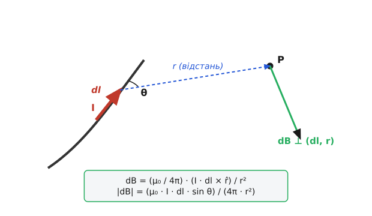
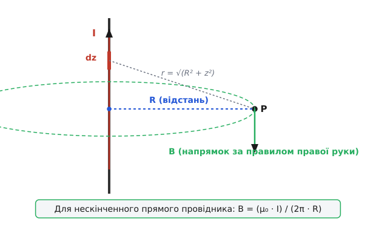
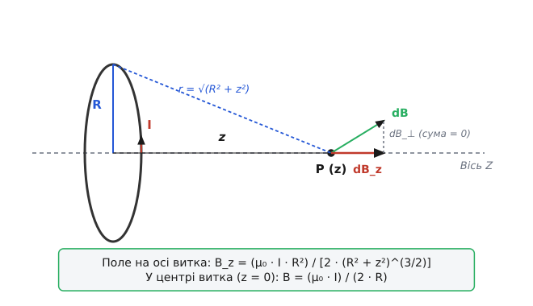

# Закон Біо–Савара

<preknowlist>
- [Дослід Ерстеда](topic:physics/oersted-experiment) — якісний зв'язок між електричним струмом і виникненням закрученого магнітного поля.
- [Магнітне поле](topic:physics/magnetic-field) — векторна індукція `B`, соленоїдальність, силові лінії та відсутність магнітних зарядів.
- [Сила Ампера](topic:physics/ampere-force) — дія магнітного поля на провідник зі струмом і векторний добуток.
</preknowlist>

Коли електричні заряди перебувають у стані спокою, утворене ними електростатичне поле повністю описується скалярним потенціалом та радіальним вектором напруженості за законом Кулона. Силові лінії кулонівського поля починаються на позитивних зарядах і закінчуються на негативних, а самі сили взаємодії спрямовані строго вздовж прямої лінії, що з'єднує заряди. Проте як тільки заряди починають упорядковано рухатися, створюючи електричний струм, довкола провідника виникає якісно нове фізичне явище — магнітне поле. На відміну від електростатичного поля, яке є потенціальним і центральним, магнітне поле виявляється вихровим і ортогональним як до напрямку руху носіїв заряду, так і до радіус-вектора точки спостереження.

Експериментальне виявлення того факту, що електричний струм повертає магнітну стрілку компаса, поставило перед класичною фізикою фундаментальне завдання: сформулювати точний кількісний закон, який дозволяє обчислити вектор магнітної індукції `B` у довільній точці тривимірного простору для провідника будь-якої довільної конфігурації та величини струму. На відміну від електростатики, де закон Кулона дає центральне поле точкового заряду `1 / r²`, у магнетостатиці аналогічну фундаментальну роль відіграє закон Біо — Савара (у багатьох наукових джерелах відомий як закон Біо — Савара — Лапласа).

Закон Біо — Савара відіграє в магнетостатиці таку ж центральну і фундаментальну роль, як закон Кулона в електростатиці. Він дає змогу розбити будь-який складний криволінійний контур зі струмом на нескінченно малі елементи, обчислити елементарний диференціальний внесок кожного елемента в вектор магнітної індукції і за допомогою принципу суперпозиції синтезувати підсумкове поле у будь-якій точці простору.

---

## Диференціальне формулювання закону Біо — Савара — Лапласа

Розглянемо тонкий провідник довільної просторової конфігурації, яким протікає постійний електричний струм `I` (вимірюється в Амперах, А). Виділимо на цьому провіднику нескінченно малий векторний елемент довжини `dl` (лат. *elementum* — складова частина), напрямок якого збігається з напрямком векторної густини струму в провіднику.

Позначимо через `r` радіус-вектор, спрямований від виділеного елемента струму `dl` до точки спостереження `P` у тривимірному евклідовому просторі, а через `r = |r|` — абсолютну відстань між ними. Одиничний вектор у напрямку точки спостереження позначимо як `r̂ = r / r`.


*Елемент провідника довжиною `dl` зі струмом `I` створює диференціальний внесок `dB` у точку спостереження на відстані `r` під кутом `θ`.*

Згідно з диференціальним законом Біо — Савара, виділений елемент струму `I · dl` створює в точці спостереження `P` диференціальний вектор магнітної індукції `dB`, який у міжнародній системі одиниць SI виражається векторним добутком:

```
dB = (μ₀ / (4·π)) · (I · dl × r̂) / r²
```

або еквівалентно через повний радіус-вектор `r`:

```
dB = (μ₀ / (4·π)) · (I · dl × r) / r³
```

де:
- `μ₀ = 4·π · 10⁻⁷ Гн/м ≈ 1.256637 · 10⁻⁶ Гн/м` — магнітна стала (магнітна проникність вакууму);
- `I · dl` — векторний елемент струму, який виступає точковим токовим джерелом вихрового магнітного поля;
- `×` — операція векторного добутку тривимірних векторів;
- `r` — відстань від джерела до точки вимірювання індукції.

Чисельний множник `1 / (4·π)` виникає внаслідок сферичної симетрії поширення елементарного збудження у тривимірному просторі, оскільки площа сфери радіуса `r` дорівнює `4·π · r²`. Магнітна стала `μ₀` задає розмірний масштабуючий коефіцієнт між електричними одиницями струму та магнітними одиницями індукції. Вона тісно пов'язана з електричною сталою `ε₀` та швидкістю світла у вакуумі `c` фундаментальним співвідношенням `c² = 1 / (ε₀ · μ₀)`. Розмірність магнітної сталої у системі SI виражається як `Гн/м = Тл·м/А = Н/А²`.

Жан-Батист Біо та Фелікс Савар за допомогою методів малого магнітного осцилятора експериментально виміряли закон спадання поля `1 / R` для нескінченного прямого провідника зі струмом, а П'єр-Сімон Лаплас теоретично вивів диференціальну форму закону обернених квадратів `1 / r²` для елементарного струму. Експериментальну хронологію та математичні деталі цього відкриття розкрито у вставці [📜 Історія відкриття закону Біо–Савара](topic:physics/biot-savart-law/hist-discovery.md).

### Геометричний зміст та векторні властивості

З алгебраїчних властивостей векторного добутку випливають чотири фундаментальні риси вектора елементарної індукції `dB`:

1. **Модуль вектора індукції:** Величина диференціального внеску визначається скалярним виразом:
   ```
   |dB| = (μ₀ · I · dl · sin θ) / (4·π · r²)
   ```
   де `θ` — кут між вектором елемента струму `dl` та радіус-вектором `r`. Поле досягає свого абсолютного максимуму у площині, ортогональній до провідника (`θ = 90°`, `sin θ = 1`), і повністю дорівнює нулю на продовженні осі самого провідника (`θ = 0°` або `180°`, `sin θ = 0`).

2. **Подвійна ортогональність:** Вектор `dB` ортогональний як до вектора елемента струму `dl`, так і до радіус-вектора `r` (`dB ⊥ dl` та `dB ⊥ r`). Це означає, що вектор індукції перпендикулярний до всієї площини, у якій лежать вектори `dl` та `r`.

3. **Правило правої руки (правого гвинта):** Напрямок вектора `dB` задається правилом правої руки: якщо великий палець правої руки спрямувати вздовж векторного елемента струму `I · dl`, то чотири зігнуті пальці вкажуть напрямок огинання ліній індукції `dB` навколо провідника.

4. **Нецентральний характер елементарної сили:** На відміну від кулонівської взаємодії зарядів, де сила спрямована уздовж лінії зв'язку, магнітна взаємодія елементів струму є нецентральною. Це означає, що для окремих ізольованих елементів струму третій закон Ньютона у своїй сильній формі (рівність сил уздовж однієї лінії) не виконується, а повне збереження імпульсу системи забезпечується лише з урахуванням імпульсу самого електромагнітного поля.

---

## Принцип суперпозиції та інтегральні форми

Завдяки лінійності рівнянь електродинаміки магнітне поле задовольняє принцип суперпозиції (лат. *superpositio* — накладання). Підсумковий вектор магнітної індукції `B` у будь-якій точці простору дорівнює векторній сумі (інтегралу) внесків від усіх елементів струму, які утворюють електричну систему.

### 1. Лінійні замкнені та нескінченні контури

Для тонкого провідника `L` інтегральна формула закону Біо — Савара має вигляд контурного інтеграла першого роду:

```
B = ∫[по контуру L] dB = (μ₀ / (4·π)) · ∫[L] (I · dl × r̂) / r²
```

Цей інтеграл обчислюється вздовж усієї геометрії провідника `L`. Для замкнених струмових контурів підсумовування здійснюється за замкненим шляхом `∮[L]`.

### 2. Об'ємний розподіл струмів

Якщо електричний струм протікає не по тонкій нитці, а розподілений у тривимірному об'ємі `V` із макроскопічною векторною густиною струму `J(r')` (вимірюється в А/м²), елемент струму `I · dl` замінюється об'ємним диференціалом `J(r') · dV'`:

```
B(r_p) = (μ₀ / (4·π)) · ∫∫∫[V] (J(r') × (r_p - r')) / |r_p - r'|³ dV'
```

де `r_p` — координати точки спостереження, `r'` — координати елементарного об'єму `dV'` всередині провідного тіла. Густина струму `J = ρ · v` являє собою векторне поле, утворення якого зумовлене рухом об'ємного заряду `ρ` зі швидкістю `v`.

### 3. Поверхневий розподіл струмів

Для струмів, що протікають по двовимірній поверхні `S` (наприклад, у тонких фольгових обмотках або надпровідних екранах) з поверхневою густиною `K` (А/м), елемент струму замінюється на `K · dS'`:

```
B(r_p) = (μ₀ / (4·π)) · ∫∫[S] (K(r') × (r_p - r')) / |r_p - r'|³ dS'
```

> 🔧 **Навіщо це.** Об'ємні та поверхневі інтеграли Біо — Савара є основою обчислювальних алгоритмів розрахунку паразитних магнітних полів, індуктивностей розсіяння та перехресних наводок у високочастотних друкованих платах, симетричних шинопроводах, силових транзисторних модулях та трансформаторах, де товщину провідників неможливо ігнорувати.

---

## Точні аналітичні розв'язки для класичних геометрій

Закон Біо — Савара дає змогу отримати точні аналітичні вирази для низки фундаментальних геометрій струму, які є базовими будівельними блоками радіофізики, електротехніки та наукового приладобудування.

### 1. Прямолінійний провідник: від скінченного відрізка до нескінченної лінії

Розглянемо тонкий прямий провідник зі струмом `I`. Розрахуємо індукцію поля `B` на перпендикулярній відстані `R` від осі провідника.


*Магнітні лінії нескінченного прямолінійного струму утворюють замкнені концентричні кола навколо провідника.*

- **Для скінченного відрізка провідника:** Якщо краї провідника видно з точки спостереження під кутами `α₁` та `α₂` відносно перпендикуляра `R`, інтегрування за допомогою кутової заміни змінної `z = R · tan α` дає:
  ```
  B = (μ₀ · I / (4·π · R)) · (sin α₂ - sin α₁)
  ```
  або через кути `θ₁` та `θ₂` між напрямком струму та напрямком на краї провідника:
  ```
  B = (μ₀ · I / (4·π · R)) · (cos θ₁ - cos θ₂)
  ```
- **Для суцільного циліндричного провідника радіуса `R_wire`:**
  Зовні провідника (`r > R_wire`) поле збігається з полем нескінченно тонкої лінії: `B = (μ₀ · I) / (2·π · r)`. Усередині провідника (`r < R_wire`) при рівномірному розподілі густини струму `J = I / (π · R_wire²)` інтегрування за Біо — Саваром дає лінійне зростання поля від центра до поверхні:
  ```
  B_in(r) = (μ₀ · I · r) / (2·π · R_wire²)
  ```
- **Для квадратного контуру зі стороною `a` у його центрі:** Підсумовуючи внески від 4 однаковісіньких скінченних відрізків із кутами `α₁ = -45°` та `α₂ = +45°` на відстані `R = a / 2`:
  ```
  B_square = 4 · [(μ₀ · I / (4·π · (a/2))) · (sin 45° - sin(-45°))]
  = (2·√2 · μ₀ · I) / (π · a)
  ```
- **Для правильного n-кутника зі струмом:** Поле у центрі правильного багатокутника з `n` сторонами, вписаного у коло радіуса `R`, виражається формулою `B_n = (n · μ₀ · I / (2·π · R)) · tan(π / n)`. При `n -> ∞` множник `n · tan(π / n) -> π`, і вираз точно переходить у поле колового витка `B = (μ₀ · I) / (2 · R)`.
- **Для нескінченно довгого провідника (`α₁ -> -π/2`, `α₂ -> +π/2`):**
  Оскільки `sin(+π/2) - sin(-π/2) = 1 - (-1) = 2`, отримуємо фундаментальну формулу:
  ```
  B = (μ₀ · I) / (2·π · R)
  ```
  Силові лінії цього поля являють собою замкнені концентричні кола з центром на осі провідника. Зі збільшенням відстані `R` індукція поля спадає обернено пропорційно першому степеню відстані (`1 / R`).

- **Для напівнескінченного провідника (струмовий промінь від `0` до `+∞`):**
  На торці прямого струмового променя поле дорівнює точно половині від нескінченного провідника:
  ```
  B = (μ₀ · I) / (4·π · R)
  ```

### 2. Коловий виток зі струмом на осі симетрії та поза нею

Розглянемо коловий провідник радіуса `R`, розташований у площині `XY`, яким протікає струм `I`. Обчислимо індукцію магнітного поля на осі `Z` на відстані `z` від центра витка.


*Скасування поперечних компонентів `dB_⊥` та додавання осьових компонентів `dB_z` на осі колового струму.*

Завдяки осьовій симетрії контуру радіальні (поперечні) компоненти вектора `dB` від діаметрально протилежних елементів витка повністю взаємно скасовуються (`∫ dB_⊥ = 0`), а осьові компоненти `dB_z = dB · sin γ` (де `sin γ = R / √(R² + z²)`) арифметично додаються.

У результаті інтегрування вздовж колового контуру довжиною `2·π · R` отримуємо точну формулу для осьового поля:

```
B_z = (μ₀ · I · R²) / [2 · (R² + z²)^(3/2)]
```

Розглянемо фундаментальні граничні випадки та узагальнення цієї формули:
1. **У центрі витка (`z = 0`):**
   ```
   B(0) = (μ₀ · I) / (2 · R)
   ```
   Це максимальне значення магнітної індукції, яке створюється даним витком у площині його розташування.
2. **Далеке дипольне поле (`z >> R`):**
   Знаменник наближено дорівнює `(z²)^(3/2) = z³`. Ввівши магнітний дипольний момент витка `p_m = I · S = I · (π · R²)`, вираз набуває вигляду:
   ```
   B_z ≈ (μ₀ · p_m) / (2·π · z³)
   ```
   Це поле **магнітного диполя**: на великих відстанях коловий струм поводиться точно так само, як точковий диполь із магнітним моментом `p_m`.
3. **Дуга кола під кутом `θ` (у радіанах):**
   Для провідника у формі дуги кола радіуса `R` із центральним кутом `θ` поле у центрі дуги спрямоване вздовж осі симетрії та дорівнює:
   ```
   B_arc = (μ₀ · I · θ) / (4·π · R)
   ```
   Зокрема, для півкола (`θ = π`) маємо `B = (μ₀ · I) / (4 · R)`, а для чверті кола (`θ = π / 2`) отримуємо `B = (μ₀ · I) / (8 · R)`.
4. **Поле у довільній точці простору поза віссю `(r_radial, z)`:**
   Поза віссю витка аналітичний розв'язок закону Біо — Савара виражається через повні еліптичні інтеграли першого `K(k)` та другого `E(k)` роду з модулем `k² = (4·R·r_radial) / ((R + r_radial)² + z²)`:
   ```
   B_z = (μ₀ · I / (2·π)) · [1 / √((R + r_radial)² + z²)] · [E(k) · (R² - r_radial² - z²) / ((R - r_radial)² + z²) + K(k)]
   ```

### 3. Соленоїд та котушки Гельмгольца

- **Скінченний соленоїд:** Для циліндричної котушки довжиною `L` з густиною намотування `n = N / L` витків на метр поле на осі дорівнює:
  ```
  B_z = (μ₀ · n · I / 2) · (cos θ₁ - cos θ₂)
  ```
  де `θ₁` та `θ₂` — кути, під якими видно торець та початок соленоїда з точки спостереження.
- **Нескінченно довгий соленоїд (`L >> R`):** Для точок глибоко всередині довгової котушки `θ₁ -> 0` (`cos 0 = 1`) та `θ₂ -> π` (`cos π = -1`), що дає:
  ```
  B = (μ₀ · n · I / 2) · (1 - (-1)) = μ₀ · n · I
  ```
  Усередині нескінченного соленоїда магнітне поле є строго однорідним, паралельним осі та постійним за величиною, а зовні соленоїда поле дорівнює точно нулю.
- **Котушки Гельмгольца:** Пара однакових співвісних колових котушок радіуса `R`, розташованих на відстані `d = R` одна від одної. При такій геометрії у центральній точці на осі між котушками одночасно обнуляються перша, друга та третя похідні поля за координатою `z` (`∂B/∂z = 0`, `∂²B/∂z² = 0`, `∂³B/∂z³ = 0`). Це забезпечує унікально плоский платоподібний профіль однорідності магнітного поля поблизу центра системи.

Повний покроковий математичний вивід усіх цих геометрій (із проміжними замінами змінних, винесенням констант та інтегруванням) дивіться у вставці [🧮 Математичний вивід та інтегрування закону Біо–Савара](topic:physics/biot-savart-law/math-integrations.md). Вставка містить детальні математичні розклади для прямолінійних відрізків, багатокутників, колових дуг, еліптичних інтегралів та доказу обнулення похідних у котушках Гельмгольца.

---

## Векторний потенціал та теорія поля

У математичному формалізмі електродинаміки замість прямого обчислення вектора індукції `B` зручно використовувати допоміжне векторне поле — **векторний потенціал** `A` (вимірюється у Тл·м або В·с/м).

Оскільки магнітна індукція задовольняє умову соленоїдальності `∇ · B = 0` (відсутність точкових магнітних зарядів), за теоремою векторного аналізу її можна подати як ротор від деякого векторного поля `A`:

```
B = ∇ × A
```

Поле `A` визначене з точністю до градієнта довільної скалярної функції `ψ(r)` (калібрувальна інваріантність: `A' = A + ∇ψ`). Вибираючи **кулонівську калібровку** `∇ · A = 0`, закон Біо — Савара дає змогу виразити векторний потенціал `A` у будь-якій точці простору через об'ємний інтеграл від густини струму `J`:

```
A(r_p) = (μ₀ / (4·π)) · ∫∫∫[V] (J(r') / |r_p - r'|) dV'
```

Для тонкого лінійного провідника зі струмом `I`:

```
A(r_p) = (μ₀ · I / (4·π)) · ∫[L] (dl / |r_p - r'|)
```

Головна математична перевага використання векторного потенціалу `A` полягає у тому, що інтеграл Біо — Савара для `A` містить простий скалярний знаменник `1 / r` замість кубічного векторного знаменника `1 / r³`, що значно спрощує аналітичні розрахунки, мультипольні розклади поля та чисельні алгоритми.

У дальній зоні (`r >> r'`) скалярний дріб `1 / |r - r'|` розкладають у ряд за степенями `r'/r` (мультипольний розклад):
- **Монопольний член:** дорівнює нулю (`∫ J dV = 0` для будь-якої стаціонарної системи струмів);
- **Дипольний член:** дає головний внесок `A_dipole(r) = (μ₀ / (4·π)) · (p_m × r) / r³`, де `p_m = (1/2) · ∫ (r' × J) dV'` — магнітний дипольний момент системи.

Підставляючи `B = ∇ × A` у диференціальне рівняння ротора `∇ × B = μ₀ · J` при дотриманні кулонівської калібровки `∇ · A = 0`, отримуємо 3D-векторне рівняння Пуассона для магнітного потенціалу:

```
∇² A = -μ₀ · J
```

Кожна з трьох декартових компонент цього рівняння (`∇² A_x = -μ₀ · J_x`, `∇² A_y = -μ₀ · J_y`, `∇² A_z = -μ₀ · J_z`) тотожна за своєю математичною структурою скалярному рівнянню Пуассона для електростатичного потенціалу `∇² φ = -ρ / ε₀`.

---

## Зв'язок із рівняннями Максвелла та теоремою про циркуляцію

Закон Біо — Савара є точним інтегральним розв'язком стаціонарних рівнянь Максвелла для магнітного поля у вакуумі. Застосуємо до математичного виразу закону Біо — Савара дифференціальні оператори векторного аналізу — дивергенцію (`∇ ·`) та ротор (`∇ ×`).

### 1. Соленоїдальність магнітного поля (закон Гаусса для магнетизму)

Обчислимо дивергенцію від виразу Біо — Савара за координатами точки спостереження `r`:

```
∇ · B = (μ₀ / (4·π)) · ∫∫∫ ∇ · [(J(r') × (r - r')) / |r - r'|³] dV' = 0
```

Використовуючи векторну тотожність для дивергенції векторного добутку:

```
∇ · (U × V) = V · (∇ × U) - U · (∇ × V)
```

де `U = J(r')` та `V = (r - r') / |r - r'|³ = -∇(1 / |r - r'|)`:
- Перший доданок `V · (∇ × J(r')) = 0`, оскільки оператор `∇` бере похідні за точкою спостереження `r`, а `J(r')` залежить лише від джерела `r'`;
- Другий доданок `J(r') · (∇ × (-∇(1 / |r - r'|))) = 0`, оскільки ротор від будь-якого градієнта тотожно дорівнює нулю (`∇ × ∇ψ = 0`).

Таким чином отримуємо диференціальну форму другого рівняння Максвелла:

```
∇ · B = 0
```

Це рівняння стверджує соленоїдальність магнітного поля: лінії магнітної індукції не мають ні початку, ні кінця (вони завжди замкнені або йдуть у нескінченність), а в природі не існує поодиноких магнітних зарядів (монополів).

### 2. Вихровий характер та ротор поля (закон Ампера)

Обчислення ротора від вектора індукції `B`, заданого законом Біо — Савара, з урахуванням `B = ∇ × A` та рівняння Пуассона `∇² A = -μ₀ · J` дає:

```
∇ × B = ∇ × (∇ × A) = ∇(∇ · A) - ∇² A
```

Застосовуючи кулонівську калібровку `∇ · A = 0`, отримуємо диференціальний закон Ампера:

```
∇ × B = -∇² A = μ₀ · J
```

За теоремою Стокса це диференціальне рівняння еквівалентне теоремі про циркуляцію магнітного поля (закону Ампера у макроскопічній інтегральній формі):

```
∮[по контуру C] B · dl = μ₀ · I_enclosed
```

де `I_enclosed` — повний електричний струм, що пронизує поверхню, натягнуту на замкнений контур `C`.

Таким чином, закон Біо — Савара і теорема про циркуляцію являють собою два фундаментальні боки однієї концепції:
- **Закон Біо — Савара** є прямим конструктивним інтегралом: знаючи розподіл струмів `J`, ми можемо безпосередньо обчислити поле `B` у будь-якій точці простору для будь-якої складної геометрії;
- **Теорема про циркуляцію** дає змогу миттєво знайти поле у високосиметричних випадках (циліндр, соленоїд, тороїд) без обчислення складних підсумовуючих інтегралів.

---

## Релятивістське походження магнітного поля

З точки зору спеціальної теорії відносності (СТО), магнітне поле та закон Біо — Савара не є незалежними первинними сутностями, а виникають як неминучий релятивістський ефект при русі електричних зарядів зі скінченною швидкістю поширення взаємодії `c`.

Розглянемо точковий заряд `q`, який рухається зі постійною нерелятивістською швидкістю `v` (`v << c`) у лабораторній системі відліку. 

У власній системі відліку `S'`, що рухається разом із зарядом, існує лише сферично симетричне електростатичне кулонівське поле `E'`:

```
E' = (q / (4·π · ε₀)) · r̂ / r²
```

При переході до лабораторної системи відліку `S` за допомогою перетворень Лоренца для електромагнітного тензора `F^μν`, електричне поле доповнюється поперечним магнітним полем `B`:

```
B ≈ (v × E) / c²
```

Підставляємо кулонівське електричне поле `E` і враховуємо фундаментальне співвідношення між електродинамічними сталевими та швидкістю світла `c² = 1 / (ε₀ · μ₀)`:

```
B = (v × ((q / (4·π · ε₀)) · r̂ / r²)) / c²
= (μ₀ · ε₀ / (4·π · ε₀)) · (q · v × r̂) / r²    [підстановка c² = 1 / (μ₀·ε₀)]
= (μ₀ / (4·π)) · (q · v × r̂) / r²              [скорочення ε₀ у чисельнику та знаменнику]
```

Розглянемо нейтральний дріт зі струмом. У власній системі провідника позитивні іони нерухомі, а електрони рухаються зі швидкістю дрейфу `v_d`. Через лоренцеве скорочення довжини відстань між рухомими електронами змінюється при переході до іншої системи відліку, утворюючи ненульову релятивістську густину заряду. У результаті електрична сила в рухомій системі відліку виявляється еквівалентною магнітній силі в лабораторній системі.

Переходячи від одного рухомого заряду `q · v` до макроскопічного ансамблю носіїв у елементі провідника `I · dl = q_n · v · dl`, ми отримуємо точно закон Біо — Савара!

> 💡 **Ключовий висновок:** Магнітне поле — це релятивістська кінематична поправка до кулонівського електричного поля, яка виникає внаслідок скінченності швидкості поширення інформації `c` та релятивістського лоренцевого скорочення довжини для рухомих носіїв заряду.

---

## Чисельне моделювання та інженерні застосування

У реальних інженерних задачах контури провідників рідко мають ідеально прості геометричні форми. Для розрахунку магнітних полів складних 3D-конструкцій закон Біо — Савара дискретизують і чисельно інтегрують на комп'ютері.

### Алгоритм дискретизації

Провідник довільної конфігурації розбивають на `N` лінійних сегментів `Δl_i`. Для кожного сегмента обчислюють векторну відстань `R_i` від його середини до точки спостереження та підсумовують внески:

```
B(P) ≈ (μ₀ · I / (4·π)) · ∑[i=0..N-1] (Δl_i × R_i) / |R_i|³
```

Аналіз обчислювального алгоритму, математичне обґрунтування регуляризації ядра за допомогою радіуса ядра провідника `r_core`, дослідження квадратичної швидкості сходимості `O(1 / N²)` та готові реалізації мовами C++, C і Python наведено у вставці [⚙️ Обчислення 3D-магнітного поля методом дискретизації Біо–Савара](topic:physics/biot-savart-law/proj-biot-savart-sim.md). Цей матеріал містить робочий код 3D-солвера магнітного поля, структури даних SoA для SIMD-прискорення та таблицю числової верифікації похибки проти аналітичного розв'язку.

### Практичні інженерні застосування

1. **Котушки Гельмгольца:** Пара одинакових колових котушок, розташованих на відстані радіуса `R` одна від одної. Використовуються для створення еталонних однорідних полів при калібруванні магнітометрів, комп'ютерній томографії та випробуваннях космічних апаратів.
2. **Медична магнітно-резонансна томографія (МРТ):** Основні надпровідні та градієнтні котушки МРТ-томографів розраховуються чисельним методом Біо — Савара з відносною точністю кращою за `1 ppm` (одна мільйонна частка).
3. **Проектування друкованих плат (PCB):** Оцінка паразитної індуктивності, випромінюваних електромагнітних завад (EMI) та перехресних магнітних наводок між високочастотними сигнальними та силовими доріжками.
4. **Утримування плазми у токамаках та стелараторах:** Розрахунок точної конфігурації полів тороїдальних та полоїдальних надпровідних котушок для термоядерного синтезу.

---

## Межі застосовності закону та електродинамічні узагальнення

Закон Біо — Савара у своїй класичній формі є точним законом **магнетостатики** — галузі електродинаміки, яка вивчає постійні або повільно змінювані струми у провідниках.

При виході за межі магнетостатики виникають принципові обмеження:

1. **Квазістаціонарне наближення:** Для струмів, що змінюються у часі з частотою `f`, закон Біо — Савара залишається виконуваним із високою точністю доти, доки характерний розмір системи `L` значно менший за довжину електромагнітної хвилі `λ = c / f` (`L << λ`).
2. **Електромагнітне випромінювання та запізнення:** У високочастотних колах та антенних системах (`L ~ λ`) необхідно враховувати струм зсуву Максвелла `μ₀ · ε₀ · ∂E / ∂t` та ефекти запізнення потенціалів через скінченну швидкість світла `c`. Описати такі системи дають змогу узагальнені рівняння Єфименка та потенціали Лієнара — Віхерта:
   ```
   B(r, t) = (μ₀ / (4·π)) · ∫ [ (J(r', t_ret) × r̂) / r² + (∂J(r', t_ret)/∂t × r̂) / (c · r) ] dV'
   ```
   де `t_ret = t - r / c` — запізнювальний час. На великих відстанях від джерела хвильовий доданок спадає не за законом статики `1 / r²`, а значно повільніше — за законом випромінювання `1 / r`.
