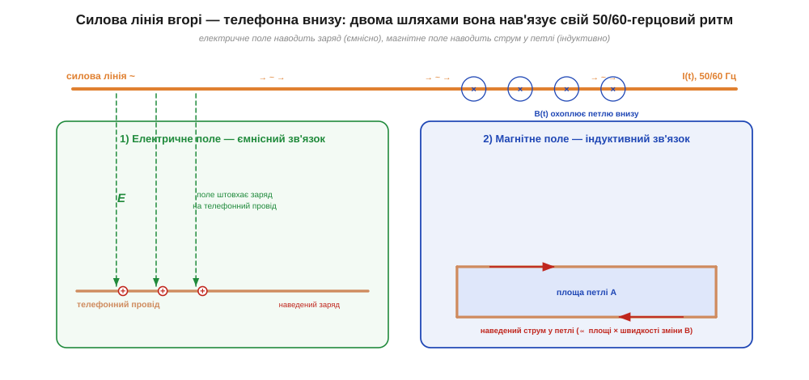
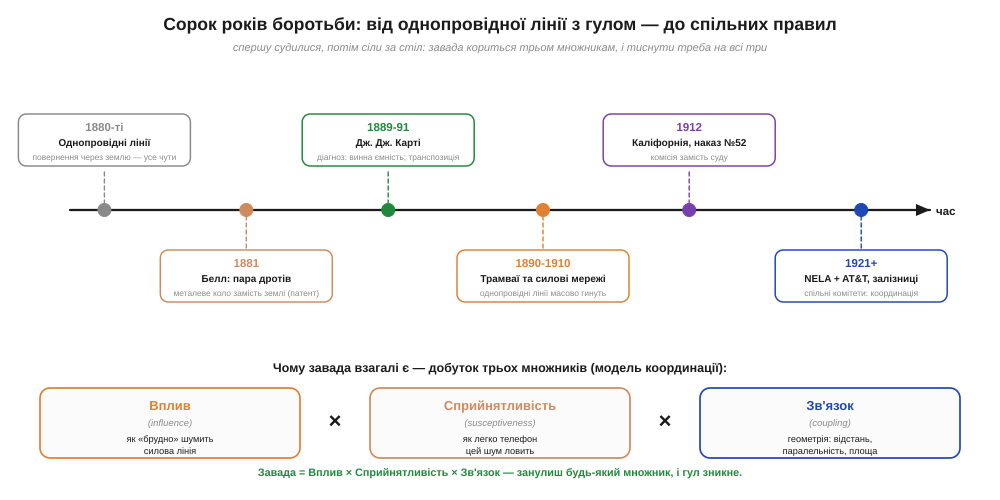

# 📜 Гул у слухавці: як телефоністи воювали з силовими лініями

> Механізм наводки простий: змінне електричне поле силового дроту наводить заряд на сусідній сигнальний провід через [ємнісний зв'язок](book:physics/capacitive-coupling) — і в слухавці народжується рівний гул на частоті мережі. Механізм виглядає абстрактно, поки не дізнаєшся, що рівно з цим гулом ціла галузь воювала **сорок років** — спершу в судах, потім за спільним столом. Історія телефонної наводки — це історія про те, як дві молоді індустрії, електрика й зв'язок, мусили навчитися ділити один стовп, одну вулицю й одну землю під ногами, не глушачи одна одну.

## Коли земля була «другим дротом»

Щоб зрозуміти, чому гул узагалі став катастрофою, треба повернутись у 1880-ті — до телефонних ліній, яких ми сьогодні й не впізнали б. Перші лінії були **однопровідні** (*single-wire*): від апарата йшов **один** залізний чи сталевий дріт, а зворотний шлях струму замикався **через землю** — точнісінько як у телеграфі, де ґрунт давно правив за дешевий «другий дріт». Заземлений штир із одного боку, заземлений штир із іншого — і коло замкнене. Дешево, просто, по одному дроту на абонента замість двох.

Поки навколо була лише телеграфна тиша, така лінія працювала. Але вона мала вроджену ваду: однопровідна лінія з поверненням через землю — це **величезна, нічим не врівноважена антена**. Її єдиний провід висить над землею сам по собі; усе, що наводить на нього заряд чи струм — далека гроза, сусідній телеграф, а згодом і силовий дріт, — лізе просто в слухавку, бо немає другого, симетричного проводу, на який навелося б те саме й тим скомпенсувалося. Доки сусіди шепотіли, це терпіли. Та сусіди невдовзі загриміли.

## Електрика приходить на вулицю — і приносить шум

Кінець 1880-х — початок 1890-х: містами розповзається **дугове освітлення й лампи розжарювання**, а головне — **електричний трамвай** (*trolley*, *streetcar*). І трамвай, і ранні освітлювальні мережі живилися проводами, натягнутими тими самими вулицями, де вже висіли телефонні. Гірше того: трамвайна тяга часто теж замикала струм **через рейки й землю** — тобто в землю, яку телефон використовував як «другий дріт», тепер стікали потужні, рвані тягові струми.

Наслідок телефоністи почули миттєво. У слухавці оселився **рівний гул** (*hum*) — на частоті мережі та її гармоніках, — а коли трамвай рушав чи гальмував, до гулу домішувалися тріск і вищання. Розмовляти ставало важко, на довгих лініях — часом неможливо. Це був не дефект апарата, який можна полагодити викруткою: сам *принцип* однопровідної лінії перестав працювати поряд із сильнострумовою електрикою. Саме тоді, між **1890 і 1910 роками**, однопровідні лінії з поверненням через землю масово вимерли — їх витіснив інший спосіб вмикання, про який ітиметься нижче. Поштовхом була не якась одна геніальна ідея, а проста безвихідь: стара лінія більше не давала чути співрозмовника.

Цікаво, що сам гул звучав не так, як можна було б подумати. Слухавка передає смугу приблизно від 300 Гц угору, тож **основний тон мережі** — 50 чи 60 Гц — лежить на самому її краю або нижче й сам собою ледь чутний. По-справжньому дратувало інше: **гармоніки**. Струм у силовій лінії не чистий синус — у ньому є складові на подвоєній, потроєній частоті й вище (120, 180, 240 Гц…), і саме ці вищі тони потрапляють у смугу слухавки й чуються як гудіння й деренчання. А коли по землі стікав рваний трамвайний струм, він додавав цілий ліс випадкових гармонік. Звідси практичний висновок: чистота форми струму в джерелі важить незгірш за саму амплітуду — кривий, «гармонічний» струм шумить голосніше, ніж рівний синус тієї ж величини.


*Рис. Два шляхи, якими силова лінія нав'язує телефону свій 50/60-герцовий ритм. Зліва — [**ємнісний** (*capacitive*) зв'язок](book:physics/capacitive-coupling): змінне електричне поле дроту наводить заряд на сигнальний провід. Справа — [**індуктивний** (*inductive*) зв'язок](book:physics/inductive-coupling): змінне магнітне поле охоплює телефонну петлю й наводить у ній струм тим більший, чим більша площа петлі. На однопровідній лінії з поверненням через землю обидва шляхи відкриті навстіж.*

## Карті ставить діагноз: винна ємність, не магніт

Поки одні скаржилися, інші взялися зрозуміти. Молодий інженер **Джон Джозеф Карті** (*John Joseph Carty*, 1861–1932) — родом із Кембриджа, штат Массачусетс, майбутній головний інженер AT&T — у кінці 1880-х копався в тому, чому паралельні дроти на одних стовпах так псують один одному сигнал. Тут крилася й окрема, тонша біда: **перехресні завади** (*crosstalk*) — коли в твоїй слухавці чути **чужу** розмову із сусідньої пари дротів.

Карті зробив головне, що й має робити інженер-діагност: розділив явище на механізми й виміряв, який важить більше. Спершу в доповіді «Новий погляд на телефонну індукцію» (*A New View of Telephone Induction*) перед нью-йоркським Electric Club 1889 року, а потім у класичній статті 1891 року перед Американським інститутом інженерів-електриків (*AIEE*) — «Inductive Disturbances in Telephone Circuits» — він показав несподіване: головний винуватець перехресних завад між сусідніми телефонними дротами — це **електростатична (ємнісна) індукція**, а не магнітна. Тобто головну шкоду чинить саме [ємнісний механізм](book:physics/capacitive-coupling): змінне **електричне поле** одного дроту наводить заряд на інший. Карті ще й вигадав, як дослідом **відрізнити** один внесок від іншого — крок, без якого «лікувати» заваду означало б бити навмання.

> 🔧 **Навіщо це.** Тут перший великий урок інженера-шумоборця: **спершу постав діагноз, який саме зв'язок панує — ємнісний чи індуктивний, — бо ліки різні.** Проти електричного поля (ємності) рятує екран і симетрія входу; проти магнітного поля — зменшення площі петлі. Сплутаєш механізм — і «лікуватимеш» не те. Карті 1891 року вже знав те, що даташити повторюють і досі.

З діагнозу випливали ліки. Перше — **транспозиція** (*transposition*): дроти лінії через рівні проміжки міняють місцями на стовпах, перехрещуючи. Тоді наводка, що на одній ділянці тиснула на провід в один бік, на наступній тисне у зворотний — і за всю довжину внески від далекого джерела взаємно гасяться. (За цей напрям робіт Карті дістав і патент США № 442 856 ще 1890 року.) Транспозиція стала робочим конем боротьби з наводками на десятиліття — і дожила, у мікроскопічному вигляді, аж до того, як дроти всередині кабелю звивають у симетричну виту пару.

## Дві землі замість однієї: металеве коло

Та хоч як перехрещуй єдиний провід, фундаментальна вада однопровідної лінії лишалась: повернення через землю. І рятунок прийшов звідти ж, звідки транспозиція, — від ідеї **симетрії**. Замість «один дріт + земля» лінію почали робити з **двох** дротів, якими струм іде «туди» й «назад», а земля з кола вибуває зовсім. Таке вмикання назвали **металевим колом** (*metallic circuit*) — на противагу «земляному». Сам принцип запатентував ще 1881 року Александер Ґрем Белл (*Alexander Graham Bell*), та широко його прийняли не одразу: два дроти дорожчі за один, і доки лінії шепотіли, економили. А коли поряд загуркотіла силова електрика, дорожнеча раптом перестала здаватися дорожнечею — за тиху лінію платити стали охоче. (Як саме два дроти ще й геометрично гасять наводку — окрема механіка; тут важливо лиш, що земля перестала бути «другим дротом».)

Чому два дроти рятують — видно з тієї самої механіки ємнісної наводки. Якщо обидва дроти йдуть **поруч**, далеке силове поле наводить на них **майже однаковий** заряд (синфазну заваду, *common-mode*). А слухавку вмикають так, що вона чує лише **різницю** напруг між дротами. Однакове на обох — віднімається й зникає; корисний сигнал, що живе саме як різниця, лишається. Симетрія перетворює «беззахисну антену» на пару, що сама себе оберігає. Це та ж думка, що й у транспозиції: зроби лінію симетричною — і завада на двох провідниках стане спільною, а отже, її можна відкинути.

## Від суду — до спільного столу: «координація»

Технічні ліки існували, але була ще проблема людська й господарська: телефонні та електричні компанії — це різні фірми з різними інтересами. Електрики тягли лінії, як їм зручно; телефоністи потерпали від гулу. Спершу пішли звичним шляхом — у **суди й комісії**. Знаковим став каліфорнійський регуляторний **наказ № 52** (*General Order 52*, 1912): держава почала диктувати, як двом галузям ділити простір, щоб не глушити одна одну.

Та судитися щоразу, коли десь загув телефон, — нескінченно. Тож індустрії зробили розумніше: **сіли за спільний стіл**. У 1921 році до досліджень разом із AT&T долучилася **NELA** (*National Electric Light Association* — об'єднання електричних компаній), а трохи згодом і залізничники зі своєю секцією зв'язку. Спільну роботу назвали **індуктивною координацією** (*inductive coordination*): не «хто винен і хто заплатить», а «як обом так спроєктувати свої лінії, щоб завада не родилася». Цей зсув — від позову до інженерної співпраці — і був головним проривом, не меншим за саму транспозицію.

Сама транспозиція тим часом з доморощеного «перехрестимо тут і там» виросла в точну науку. Ще 1918 року інженер **Генрі С. Осборн** (*Henry S. Osborne*) доповідав AIEE математично прораховані **схеми транспозиції** — у яких точках і в якому порядку міняти дроти місцями, щоб наводки гасилися не лише від однієї лінії, а одразу від багатьох сусідніх, та ще й щоб самі телефонні пари не заважали одна одній. Залізничники до середини 1920-х довели це до спеціальних **транспозиційних стовпів**, що перехрещували всю в'язку проводів разом. А з боку електриків діяв дзеркальний прийом: **транспозиція фаз** силової лінії й те, щоб фазні проводи трималися якнайближче один до одного — тоді їхні поля назовні майже гасяться, і «стороннє» поле, що дістається телефону, слабшає. Кожна галузь чистила свій бік рівняння.


*Рис. Угорі — лінія часу: від однопровідної лінії з гулом (1880-ті), через діагноз Карті (1889–91) і масовий перехід на металеве коло під тиском силових мереж (1890–1910), до каліфорнійського наказу №52 (1912) і спільних комітетів (1921+). Унизу — модель, до якої дійшли інженери: сила завади є **добуток трьох множників** — впливу (*influence*: як «брудно» шумить джерело), сприйнятливості (*susceptiveness*: як легко жертва ловить шум) і зв'язку (*coupling*: геометрія — відстань, паралельність, площа петлі). Занулиш будь-який множник — і гул зникне.*

З цієї співпраці виросла навдивовижу сучасна думка — та сама, на якій тримається вся теорія електромагнітних завад. Завада, дійшли інженери, народжується як **добуток трьох множників**:

```
завада  =  вплив  ×  сприйнятливість  ×  зв'язок
           (influence)  (susceptiveness)  (coupling)
```

- **Вплив** — наскільки «брудна» сама силова лінія: скільки в її струмі гармонік, наскільки несиметричні фази.
- **Сприйнятливість** — наскільки телефонна лінія *схильна* ловити шум: однопровідна земляна — дуже, симетрична металева пара — куди менше.
- **Зв'язок** — чиста геометрія: як близько лінії, як довго йдуть паралельно, яка площа петлі підставлена під магнітне поле.

Краса формули в тому, що **досить занулити будь-який множник** — і добуток стане нулем. Можна почистити джерело (зменшити вплив), можна зробити приймач симетричним і екранованим (зменшити сприйнятливість), можна розвести лінії й перехрестити дроти (зменшити зв'язок). Координація означала тиснути на всі три розумно, ділячи зусилля й кошти між обома галузями.

> 🔧 **Навіщо це.** Ця тріада — досі канва будь-якої боротьби з завадами, лише слова інші: замість «телефон і трамвай» кажуть «джерело — шлях зв'язку — приймач». Коли в схемі гуде, інженер по черзі питає: чи можна **притишити джерело** (вплив), **розірвати шлях** екраном або рознесенням (зв'язок), **загартувати приймач** симетрією й фільтром (сприйнятливість)? Телефоністи 1920-х відповіли на це раніше за нас.

## Що з усього лишилося

Гул трамвая в слухавці давно стих, але кожна його причина жива — і впізнавана в будь-якій сучасній схемі. Однопровідна лінія з поверненням через землю — це і досі найгірше, що можна зробити з чутливим входом: незрівноважений провідник ловить усе підряд. Перехід на симетричну пару, де слухавка чує лише різницю напруг, — це і є той самий прийом, яким сьогодні передають сигнали від давачів і дані лініями, що тягнуться поряд із силовими. А модель «вплив × сприйнятливість × зв'язок» — той самий триногий стіл, на якому тримається вся боротьба із завадами: на зв'язок тиснуть геометрією й екраном, на сприйнятливість — симетрією входу.

І ще один, тихіший урок — людський, схожий на той, що його дала колись прокладка першого трансатлантичного телеграфного кабелю: складну заваду не перемагає жоден геній, жоден позов. Її перемагають, коли той, хто шумить, і той, хто слухає, сідають разом і ділять відповідальність за спільний простір — стовп, вулицю, спектр. Інженерія завад почалася не з формули, а з уміння домовитися.
