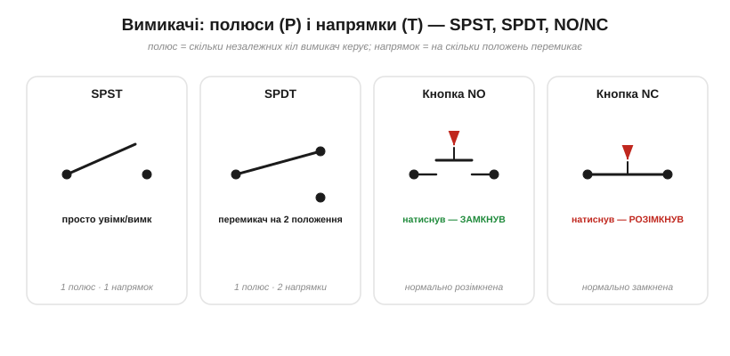

# 🔌 Вимикачі й кнопки: полюси й напрямки (SPST/SPDT), контакти NO/NC

### Що це й мова описів

**Вимикач** (*switch*) — це керований розрив у колі: механічний (тумблер, кнопка) чи електронний. Описують його двома числами — **полюси** й **напрямки**:

- **Полюс** (*pole*, P) — скільки **незалежних** кіл вимикач перемикає **одночасно**, одним рухом. Один полюс — одне коло; два полюси — двома колами керуєш разом.
- **Напрямок** (*throw*, T) — на скільки **положень** перемикається кожен полюс: розімкнено/замкнено (1 напрямок) чи перекидається між двома виходами (2 напрямки).

*Полюси й напрямки. **SPST** — просте увімк/вимк (1 полюс, 1 напрямок). **SPDT** — перекидач на 2 положення (спільний вихід іде то на один, то на інший контакт). Кнопка **NO** у спокої розімкнена (натиснув — замкнув), **NC** — навпаки.*

Звідси й абревіатури з даташитів: **SPST** (single-pole, single-throw) — звичайний вимикач увімк/вимк; **SPDT** — перекидач на два положення (зручний як селектор «або те, або те»); **DPDT** (double-pole, double-throw) — два таких перекидачі в одному корпусі, керовані спільно (наприклад, щоб одночасно перемкнути обидва дроти). Окремо розрізняють **фіксований** (latching: клацнув — лишилось) і **миттєвий** (momentary: тримаєш — замкнено, відпустив — розімкнено) механізми.

### NO і NC: стан у спокої

Для кнопок важливо ще одне: який контакт **у спокої**, коли її не чіпають.

- **NO** (*normally open*, нормально розімкнений) — у спокої розірваний; натиснув — **замкнув** коло. Це звичайна кнопка «пуск».
- **NC** (*normally closed*, нормально замкнений) — у спокої проводить; натиснув — **розірвав**. Так роблять кнопки «стоп» і аварійні: навіть якщо дріт обірветься, коло вже розімкнене — безпечніше.

Багато мікроперемикачів мають **обидва** контакти (NO і NC) та спільний (COM) — фактично той самий SPDT.

### Як під'єднати

Найчастіше кнопку садять на **цифровий вхід** мікроконтролера. Але тут чигає класична пастка: якщо просто з'єднати вхід через кнопку з землею, то у **відпущеному** стані вхід «висить у повітрі» (плаває) і ловить наводки — рівень читається випадково. Тому до входу обов'язково додають **підтяжку** (pull-up або pull-down резистор), що задає певний рівень, поки кнопку не натиснуто. Докладно про це — у [плаваючих входах і підтяжках](topic:electronics/floating-pullups).

### Типові граблі

- **Брязкіт контактів** (*bounce*). Механічні контакти, стикаючись, кілька мілісекунд **брязкочуть** — замикаються й розмикаються поспіль. Один натиск мікроконтролер може порахувати як десяток. Лікують **усуненням брязкоту** (debounce) — програмним або RC-фільтром.
- **Перевищення номіналів.** У вимикача є межі по струму й напрузі; перевищиш — контакти підгорають. Особливо лютий **індуктивний** навантаж (мотор, реле): у мить розриву він дає дугу, що випалює контакти (тому ставлять іскрогасні кола).
- **Плаваючий вхід** — згадана вище відсутність підтяжки.

### Варіації класу

Тактова кнопка на платі, тумблер, повзунок, кулісний (rocker), **DIP**-перемикачі (банка крихітних SPST для налаштувань), поворотний (rotary) селектор, мікроперемикач (кінцевий), герконовий (reed — замикається магнітом). А коли вимикачем має керувати не палець, а інша схема, беруть **реле** чи **транзистор** — електрично керовані ключі, той самий «розрив петлі», тільки без механіки.
