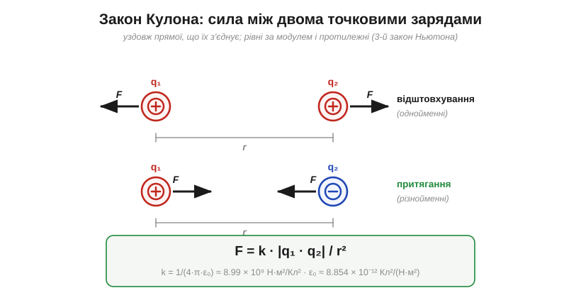
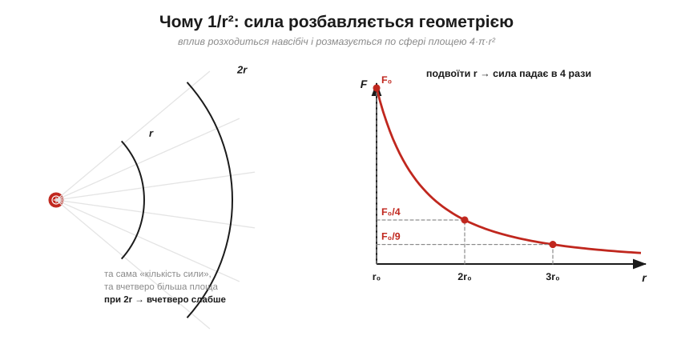
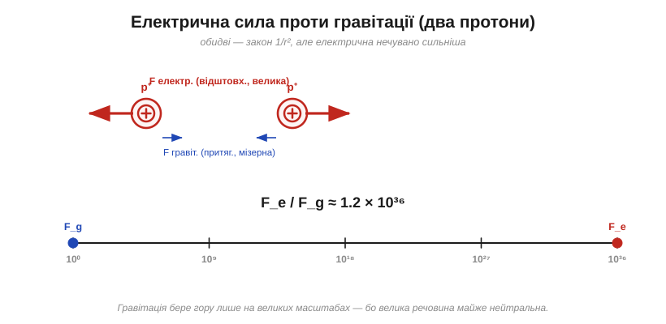
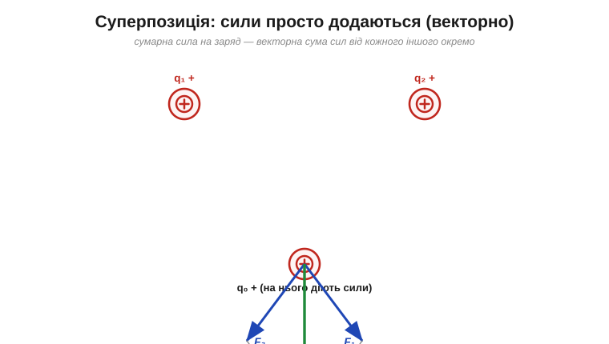

# Сила між зарядами: закон Кулона

Про [електричний заряд](book:physics/electric-charge) легко сказати «штовхає», «притягує», «сильніше» — але це ще не **число**. А вся інженерія починається там, де «тягне» перетворюється на «тягне з силою стільки-то ньютонів». Саме це зробив Шарль-Огюстен де Кулон: він зважив невидиму силу між зарядами й виявив, що вона підкоряється напрочуд простому закону — такому ж простому, як закон тяжіння Ньютона, і навіть тієї самої форми.

> 📜 **Як узагалі можна «зважити» силу, якої не видно й не чути?** Кулон зробив це крутильними терезами тонкості майже неймовірної — і ця історія варта окремої розповіді: [Кулон і крутильні терези](book:physics/coulomb-law/hist-coulomb.md).

### Сам закон: модуль і напрямок

Кулон установив: сила між двома **точковими зарядами** прямо пропорційна добутку їхніх величин і обернено пропорційна **квадрату** відстані між ними.


*Сила діє **вздовж прямої**, що з'єднує заряди: однойменні відштовхуються, різнойменні притягуються. На обидва заряди діють сили, **рівні за модулем і протилежні за напрямком** (3-й закон Ньютона) — навіть якщо самі заряди дуже різні.*

У формульному вигляді:

```
F = k · |q₁ · q₂| / r²

k  = 1 / (4·π·ε₀) ≈ 8.99 × 10⁹ Н·м²/Кл²      (стала Кулона)
ε₀ ≈ 8.854 × 10⁻¹² Кл²/(Н·м²)                 (електрична стала, проникність вакууму)
```

Тут *q₁*, *q₂* — величини зарядів (у кулонах), *r* — відстань між ними (у метрах), а *k* — **стала Кулона** (*Coulomb constant*). Знак добутку *q₁·q₂* підказує тип взаємодії: додатний (однойменні) — відштовхування, від'ємний (різнойменні) — притягання; модуль у формулі дає саму величину сили. Важлива умова: формула — для **точкових** зарядів (або, що те саме, для рівномірно заряджених куль, і тоді *r* міряють **між центрами**). І ще одне застереження про межі: цей закон — для зарядів **у спокої** (електростатика); для швидко рухомих зарядів додаються інші ефекти, але до них у курсі ще далеко.

### Напрямок, одиниці й що таке «точковий» заряд

Строго закон Кулона — **векторний**. Сила на заряд *q₂* з боку *q₁* записується так:

```
F⃗ = k · (q₁ · q₂ / r²) · r̂
```

де **r̂** — одиничний вектор уздовж прямої, що з'єднує заряди. Уся зручність — у знаку добутку *q₁·q₂*: якщо він додатний (однойменні), вектор сили дивиться **геть** від іншого заряду — відштовхування; якщо від'ємний — **до** нього — притягання. Тобто напрямок «вшитий» у саму формулу, окремо його запам'ятовувати не треба.

Корисно перевірити й **одиниці** сталої k — вони не випадкові, а саме такі, щоб усе зійшлося до ньютонів:

```
[k] = Н·м²/Кл²
[k · q² / r²] = (Н·м²/Кл²) · Кл² / м² = Н   ✓
```

І нарешті — що означає **«точковий заряд»**. Реальні тіла мають розмір, але коли відстань між ними набагато більша за самі тіла, кожне можна вважати точкою в його центрі, і похибка дрібна. Понад те, рівномірно заряджена **куля** діє на зовнішні заряди **точно** так, ніби весь її заряд зібрано в центрі (красива теорема, яку ще Ньютон довів для тяжіння). Тому для двох невеликих заряджених кульок за кілька діаметрів одна від одної проста формула працює чудово; складнощі починаються, лише коли заряди близько, а форма неправильна — тоді тіло доводиться подумки різати на точкові шматочки й додавати їхні внески за принципом суперпозиції.

> 🔧 **Навіщо це.** Закон Кулона — це не абстракція «для фізиків»: це причина, чому однойменні заряди на провіднику самі розповзаються по його поверхні — вони відштовхуються за цим законом. Це й причина, чому статика **пробиває** повітря іскрою, коли заряд (а отже, сила на електронах) стає достатнім, щоб відірвати їх від молекул. Уся робота зі струмами внизу тримається на цій силі між зарядами.

**Приклад (наскільки сильна ця сила).** Візьмімо два невеликі заряди по 1 мкКл (мікрокулон) на відстані 1 см і порахуймо силу:

```
q₁ = q₂ = 1 мкКл = 1 × 10⁻⁶ Кл
r = 1 см = 0.01 м

F = k · q₁ · q₂ / r²
F = (8.99 × 10⁹) · (1 × 10⁻⁶) · (1 × 10⁻⁶) / (0.01)²
F = (8.99 × 10⁹) · (1 × 10⁻¹²) / (1 × 10⁻⁴)
F ≈ 89.9 Н
```

Майже **90 ньютонів** — це вага дев'ятикілограмової гирі! І все це від двох **мікро**кулонів (а [кулон](book:physics/electric-charge) — велетенська порція). Ось чому в природі вільні заряди такі малі: великий вільний заряд породив би нестерпні сили, що миттєво розкидали б його геть.

> 🔌 А чи можна **навмисно** накопичити великий заряд і втримати його? Саме це робить класична машина, що жене стрічкою заряд на металеву кулю до сотень кіловольтів: [Генератор Ван де Граафа](book:physics/coulomb-law/comp-van-de-graaff.md).

### Закон оберненого квадрата: чому саме 1/r²

Найважливіше в законі — оте **r²** у знаменнику. Воно означає, що сила спадає з відстанню дуже швидко: **подвоїти** відстань — це **вчетверо** послабити силу, потроїти — у дев'ять разів.


*Чому квадрат? Вплив заряду розходиться навсібіч і «розмазується» по поверхні сфери, а її площа росте як 4·π·r². На вдвічі більшій відстані та сама «кількість» сили припадає на вчетверо більшу площу — звідси падіння в 4 рази. Праворуч — та сама крива F ∝ 1/r².*

Ця геометрична картинка пояснює навіть, **звідки в сталій k взялося 4π**: воно прийшло з площі сфери. Запис k = 1/(4·π·ε₀) не примха — четвірка-пі буквально є тілесним кутом повної сфери, по якій розбавляється вплив. (Саме тому в багатьох формулах далі 4π то з'являється, то зникає — залежно від того, чи є там сферична симетрія.)

Варто наголосити: показник степеня тут саме **2**, а не 1.99 чи 2.01. Це не наближення й не зручне округлення — точність «двійки» перевіряли понад двісті років і щоразу підтверджували з фантастичною строгістю. І це принципово: якби сила спадала, скажімо, як 1/r¹·⁹, уся струнка будова електростатики (зокрема те, що всередині зарядженого провідника поля немає) просто розсипалася б. Природа тут обрала рівно квадрат — і дотримується його бездоганно.

> 🔧 **Навіщо це.** Обернений квадрат — це чому **відстань вирішує все**. Піднести палець на міліметр до наелектризованого виводу — і сила (а з нею ризик ESD-пробою) зростає лавиноподібно. Той самий закон 1/r² керуватиме й гравітацією супутника, і яскравістю світла від лампи, і потужністю радіосигналу від антени: щойно щось «випромінюється» з точки навсібіч, воно розбавляється як 1/r². Засвоївши його тут, ви впізнаватимете його всюди.

### Та сама форма, що й тяжіння — але незрівнянно сильніша

Хто бачив закон всесвітнього тяжіння Ньютона (F = G·m₁·m₂/r²), уже помітив: закон Кулона — **тієї самої форми**, лише замість мас стоять заряди, а замість G — стала k. Це глибока спорідненість. Але є дві разючі відмінності. По-перше, маса буває лише одного «знаку» (тяжіння завжди притягує), а заряд — двох, тож електрична сила вміє і притягати, і відштовхувати. По-друге — масштаб.


*Між двома протонами електричне відштовхування сильніше за гравітаційне притягання приблизно в 10³⁶ разів. Гравітація — вкрай слабка сила; вона панує в космосі лише тому, що великі тіла електрично майже нейтральні, і заряди гасяться.*

**Приклад (у скільки разів електрика сильніша за гравітацію).** Порівняймо силу між двома протонами:

```
F_e / F_g = (k · e²) / (G · m_p²)

k · e²   = (8.99 × 10⁹) · (1.602 × 10⁻¹⁹)²  ≈ 2.31 × 10⁻²⁸
G · m_p² = (6.674 × 10⁻¹¹) · (1.673 × 10⁻²⁷)² ≈ 1.87 × 10⁻⁶⁴

F_e / F_g ≈ (2.31 × 10⁻²⁸) / (1.87 × 10⁻⁶⁴) ≈ 1.2 × 10³⁶
```

Тридцять шість порядків — це число, яке важко навіть уявити. І ось чому світ улаштований так, як улаштований: на рівні атомів усім керує електрика, а гравітація геть непомітна; зате на рівні планет і зір електричні заряди врівноважені (речовина нейтральна), вони гасяться — і лишається сама лиш кволенька, але **невитравна** гравітація. Два роди заряду проти одного роду маси — ось чому космосом править слабша сила.

Звідси й гарний побутовий парадокс. Ви щомиті відчуваєте гравітацію **цілої планети** — а куди сильнішої електрики не помічаєте зовсім, бо у звичайних тілах вона зрівноважена. Та варто порушити баланс хоч на крихту — потерти кульку об волосся — і вже та крихта незрівноваженої електрики піднімає волосину **проти тяжіння всієї Землі**. Слабша сила перемагає сильнішу лише завдяки нейтральності; щойно нейтральність порушено, електрика бере гору миттєво.

### Коли зарядів багато: принцип суперпозиції

Закон Кулона описує силу між **двома** зарядами. А якщо їх багато? Природа і тут милостива: сили просто **додаються** — векторно, як стрілки.


***Принцип суперпозиції**: щоб знайти силу на заряд, рахують силу від кожного іншого заряду окремо (за Кулоном), а тоді складають усі ці сили **як вектори**. Кожна пара «не знає» про існування інших — взаємодії незалежні.*

Це **принцип суперпозиції** (*superposition principle*) — одне з найкорисніших спрощень у всій фізиці. Він означає, що складну задачу з купою зарядів завжди можна розкласти на прості парні взаємодії. Важливо саме **векторне** додавання: дві сили можуть посилювати одна одну, частково гаситися або зрівноважитися повністю. Наприклад, заряд точно **посередині** між двома однаковими зарядами відчуває дві рівні, але протилежно напрямлені сили — і сумарна сила на нього **нуль**, хоча кожна окрема сила велика. Ця сама ідея незалежного додавання діє й для [цілих електричних кіл](book:electronics/superposition), де внески кількох джерел складаються нарізно.

> 🧮 А як саме «додати стрілки» — на практиці, в координатах, а не транспортиром? Короткий рецепт, за яким із багатьох кулонівських сил дістають одну рівнодійну: [Вектори: додавання сил і суперпозиція](book:physics/coulomb-law/math-vectors.md).

### Сила залежить від середовища

Дотепер мовчазно малося на увазі, що заряди — у порожнечі. А якщо між ними не вакуум, а якась речовина? Тоді сила **слабшає**.


*Те саме розташування зарядів у вакуумі й у воді: у воді сила приблизно у 80 разів менша. Речовина частково «екранує» заряди одне від одного. Міра цього — **відносна діелектрична проникність** εr.*

Кількісно: у середовищі з відносною проникністю εr (*relative permittivity*, або діелектрична стала) сила менша в εr разів — у формулі ε₀ замінюють на ε = εr·ε₀. Для вакууму εr = 1 (за означенням), для повітря ≈ 1.0006 (тобто майже вакуум — повітря на силу майже не впливає), для скла 4–8, для води ≈ 80.

Чому ж речовина послаблює силу? Причина — [поляризація](book:physics/electric-charge) речовини. Молекули багатьох речовин — це крихітні **диполі** (гр. *di-* — двічі + *pólos* — полюс): один їхній край трохи додатний, інший трохи від'ємний. Опинившись між нашими зарядами, такі молекули **повертаються** й шикуються так, щоб їхні власні заряди частково гасили вплив наших, — і сумарна сила слабшає. Вода складається з яскраво полярних молекул, тому екранує дуже сильно (εr ≈ 80); сухе ж повітря майже неполярне — і майже не впливає (εr ≈ 1). Інакше кажучи, εr — це міра того, **наскільки охоче речовина поляризується** у відповідь на заряди.

**Приклад (та сама пара зарядів, але у воді).** Зануримо заряди з першого прикладу (по 1 мкКл, за 1 см) у воду:

```
F_вакуум ≈ 89.9 Н           (порахували вище)
F_вода = F_вакуум / εr
F_вода = 89.9 / 80 ≈ 1.1 Н
```

Ті самі заряди на тій самій відстані тиснуть одне на одного майже у **80 разів слабше** — лише тому, що між ними тепер вода, а не порожнеча.

Звідси видно й сенс самої ε₀: це **проникність порожнечі**, що задає «силу» електричної взаємодії в найчистішому випадку — у вакуумі. Та сама величина εr описує й діелектрик усередині [конденсатора](book:electronics/capacitance): чим краще речовина поляризується, тим більший заряд утримує прилад при тій самій напрузі.

---

Отже, сила між зарядами підкоряється закону Кулона F = k·|q₁q₂|/r² — діє вздовж лінії між ними, спадає як **обернений квадрат** відстані, складається за **суперпозицією** й послаблюється середовищем. Та за цією формулою стоїть глибоке, майже філософське запитання, яке непокоїло й самого Ньютона: як заряд *q₂* узагалі «дізнається», що десь поодаль є *q₁*? Що передає цю силу через **порожній простір** між ними? Саме спроба чесно відповісти на це народила одну з найпотужніших ідей фізики — [поле](book:physics/electric-field).

---
