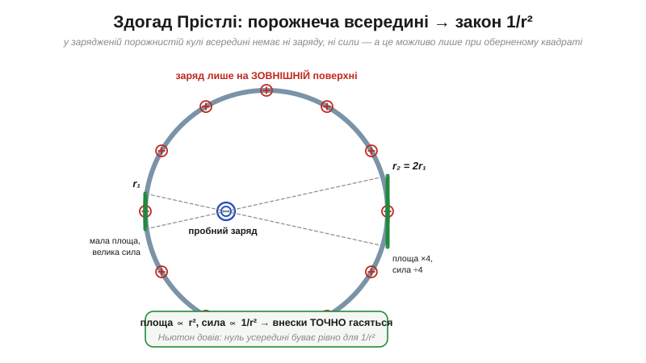
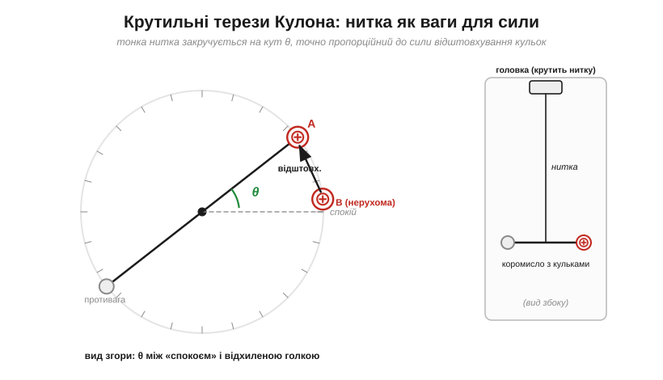
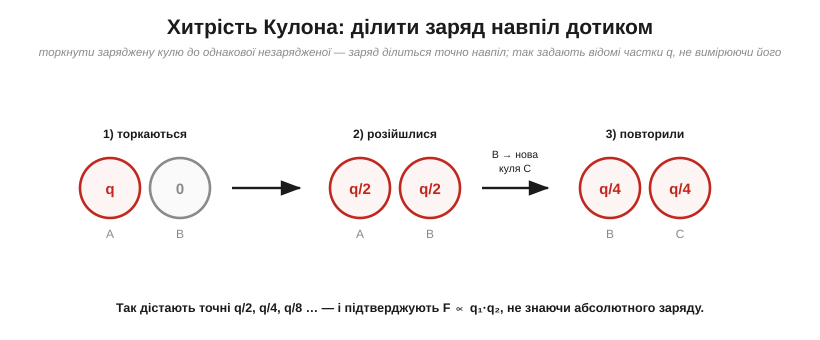

# 📜 Кулон і крутильні терези: як зважили невидиму силу

> Історична вставка до [закону Кулона](book:physics/coulomb-law). Тут — не «хто відкрив формулу», а **як узагалі можна виміряти силу, якої не видно, не чути й яка тікає з пальців**. Це історія про здогад, прочитаний із порожнечі, про генія, що виміряв усе й нікому не сказав, і про нитку, тонку настільки, що відчула поштовх між двома порошинками заряду.

До 1770-х років усе «якісне» про заряд уже знали. Дю Фе показав два роди електрики, Франклін дав знаки **+/−** і закон збереження. Кожен школяр-аматор бачив, як однойменні відштовхуються, а різнойменні притягуються. Та головного — **закону** — не було. Як саме сила залежить від відстані? Від величини зарядів? Без цього числа електрика лишалася салонним дивом, а не наукою.

Чому ж цей закон давався так тяжко — на ціле століття довше за закон тяжіння Ньютона? Бо виміряти його здавалося майже неможливим. Сила між невеликими зарядами **мізерна** — частки грама. Заряд **не сидить на місці**: у вологому повітрі він стікає за хвилини. А саму силу **не видно**: нема за що вхопитися. Уявіть, що вам треба зважити запах. Приблизно так почувалися ті, хто брався за цю задачу.

---

## Закон, прочитаний із порожнечі: Прістлі

Перший прорив прийшов не з вимірювання, а з **чистої думки** — і це один із найкрасивіших епізодів в історії фізики.

Франклін якось помітив дрібницю: якщо наелектризувати металевий кухоль, а всередину на нитці опустити коркову кульку, та **не притягується** до стінок. Усередині зарядженого тіла — наче нічого й нема. Він написав про це своєму другові, англійському хіміку **Джозефу Прістлі** (*Joseph Priestley*, 1733–1804) — тому самому, що відкриє кисень. Прістлі повторив дослід і замислився над тим, що ця «порожнеча всередині» означає.

І тут він зробив блискучий стрибок. Прістлі згадав, що **Ньютон** колись довів суто математичну теорему про тяжіння: усередині порожнистої кулі сила тяжіння точно **нульова** — але лише тому, що тяжіння спадає як **обернений квадрат** відстані. Якби закон був інакший (скажімо, 1/r чи 1/r³), усередині лишалася б ненульова сила. Прістлі міркував за аналогією: якщо й електрична «порожнеча всередині» реальна, то електрична сила теж мусить підкорятися закону **1/r²**.


*Рис. Чому всередині нема сили? Візьмімо пробний заряд і подивімося в два протилежні боки під однаковим кутом. Ближча ділянка стінки мала, але близька (велика сила); дальша — вчетверо більша за площею, та вдвічі дальша (вчетверо слабша сила). Унески **точно** гасяться — і саме тому, що сила ∝ 1/r². За будь-якого іншого закону баланс зламався б.*

Вдумайтеся в зухвалість цього висновку: закон сили **прочитали з того, що нічого не відбувається**. Жодних терезів — лише спостереження порожнечі й Ньютонова геометрія. Це був тріумф розуму. Але водночас і слабке місце: це **здогад за аналогією**, а не пряме вимірювання. Бракувало і твердого доказу, і самого числа — сталої, що стоїть перед 1/r².

> 🔧 **Навіщо це.** Той самий принцип працює щодня: **екран Фарадея** (металева коробка чи обплетення кабелю) захищає електроніку саме тому, що заряди на зовнішній оболонці не створюють поля всередині. Кожен екранований роз'єм, корпус приладу, обплетення сигнального дроту — це Прістлі та його «порожнеча всередині» в дії.

---

## Геній, що мовчав: Кавендіш

Був чоловік, який зробив це з немислимою точністю — і майже нікому не розповів. **Генрі Кавендіш** (*Henry Cavendish*, 1731–1810), нечувано багатий англійський аристократ і водночас патологічно сором'язливий відлюдник, який уникав людей так, що зі слугами спілкувався записками.

Сучасники казали про нього: «найбагатший з-поміж учених і найученіший з-поміж багатіїв». Саме він першим довів, що вода — це сполука, а не первоелемент, виміряв густину повітря й самої Землі. Та оприлюднювати відкриття Кавендіш вважав майже зайвим клопотом — він робив науку для власної втіхи. Подейкують, він навіть звелів прибудувати в домі окремі сходи, аби випадково не перестріти власну економку.

Близько 1772–1773 років Кавендіш зробив свій варіант досліду з порожниною — двома вкладеними сферами — і виміряв, наскільки малий заряд лишається на внутрішній. Результат був приголомшливий: показник степеня в законі дорівнює **2** з похибкою не більше 1/50. Тобто він експериментально підтвердив закон Кулона **до самого Кулона** і точніше за нього.

І… поклав записи в шухляду. Кавендіш публікував украй мало; величезна частина його електричних робіт пролежала непоміченою близько **ста років**, аж доки **Джеймс Клерк Максвелл** (*James Clerk Maxwell*) не розібрав і не видав їх 1879 року. На той час усе це вже відкрили інші. Скільки років науки втрачено через мовчання однієї людини — підрахувати годі.

> 🔧 **Навіщо це.** Історія Кавендіша — вічне нагадування інженерові: **робота, про яку ніхто не знає, наче й не існує**. Задокументувати, поділитися, залишити слід — це не бюрократія, а частина самого відкриття. (А ім'я його не загубилося: знаменита Кавендішська лабораторія в Кембриджі, де згодом відкриють електрон, названа саме на його честь.)

---

## Терези для крихітної сили: Кулон

І ось виходить головний герой — **Шарль-Огюстен де Кулон** (*Charles-Augustin de Coulomb*, 1736–1806). Що важливо: він був **не фізик-теоретик, а військовий інженер**. Роками він будував укріплення, а у вільний час досліджував геть приземлені речі — тертя в машинах, міцність балок і… **закручування ниток і дротів**. І саме це «нудне» інженерне знання дало йому ключ.

Шлях його був аж ніяк не кабінетний. Молодим інженером Кулон провів дев'ять виснажливих років на острові Мартиніка, зводячи форт Бурбон, і там надірвав здоров'я. Повернувшись до Франції, визнання Академії наук він здобув не електрикою, а призовими працями про **тертя** в механізмах (1781) та про **пружність закручених ниток і дротів**. Саме та, друга робота — суто інженерне дослідження, як дріт опирається скручуванню, — і виявилася несподіваним ключем до зарядів. До електрики Кулон прийшов уже зрілим майстром механіки, озброєний інструментом, якого не мав ніхто інший.

Кулон чудово знав із власних дослідів: якщо тонку нитку чи дріт закрутити невеликим моментом, вона повертається на кут, **точно пропорційний** до прикладеного зусилля. Подвоїв момент — подвоївся кут. Нитка — це ідеальна, лінійна, **неймовірно чутлива пружина для крутіння**. А отже, з неї можна зробити ваги для будь-якої малесенької сили: треба лише перевести силу в обертання й виміряти кут.

Так 1785 року народилися **крутильні терези** (*torsion balance*).


*Рис. Горизонтальне коромисло висить на тонкій нитці. На одному кінці — заряджена кулька A, на іншому противага. Підносять другу заряджену кульку B — відштовхування повертає коромисло, доки пружність закрученої нитки не зрівноважить силу. **Кут θ прямо пропорційний до сили.** Угорі — головка, якою нитку можна підкручувати, точно відмірюючи момент.*

Чутливість була фантастична — терези відчували силу в тисячні частки грама. Тепер невидиму силу можна було **зважити**: міняй відстань між кульками, читай кути — і будуй закон. Виходило чисте **1/r²**: відсунув кульку вдвічі далі — сила впала вчетверо, рівно як передбачив Прістлі.

> 🔧 **Навіщо це.** Ідея «міряти силу через відхилення пружини відомої жорсткості» — безсмертна. Саме так працюють сучасні **MEMS-акселерометри** у вашому телефоні й дроні (кремнієва мікропружина відхиляється — електроніка читає зсув) і **атомно-силові мікроскопи**, що «обмацують» окремі атоми гнучкою консоллю. Крутильні терези Кулона — прапрадід усіх цих приладів.

---

## Поділ заряду навпіл за симетрією

Лишалася підступна проблема. Щоб довести, що сила пропорційна **добутку зарядів** (q₁·q₂), треба міняти заряд у відомих пропорціях. Але ж абсолютний заряд кульки виміряти Кулон не міг — приладу для цього не існувало! Як задати «половину заряду», не знаючи, скільки його взагалі?

Розв'язок був елегантний до краси.


*Рис. Торкніть заряджену металеву кулю до **однакової незарядженої** — за симетрією заряд розділиться точно навпіл (q → q/2 на кожній). Ще раз — і маєте q/4. Так Кулон задавав точні частки заряду 1 : ½ : ¼, **жодного разу не вимірявши його абсолютну величину**, і підтвердив, що сила ∝ q₁·q₂.*

Дві однакові кулі **не можуть** після дотику мати різний заряд — їх ніщо не розрізняє, тож заряд ділиться строго порівну. Це міркування «за симетрією» дало Кулонові точні відносні заряди задарма. Поєднавши залежність від відстані (1/r²) і від зарядів (q₁·q₂), він і дістав повний закон:

```
F = k · q₁ · q₂ / r²
```

> 🔧 **Навіщо це.** Прийом «не знаю абсолютної величини — задам точні **відношення**» — улюблений трюк інженера-метролога досі. Поділ навпіл, подільники, відомі співвідношення опорів — коли точно виміряти величину важко, часто простіше й надійніше працювати з її **частками**.

---

## Чому це було важко — і чому відштовхування

Варто оцінити, проти чого боровся Кулон. Заряд **стікав** із кульок у вологому повітрі — доводилося працювати швидко й у суху погоду. Найменший протяг гойдав коромисло. Сили були крихітні, а відлік — на межі можливого.

Та була й тонша, суто механічна пастка, через яку Кулон для точних вимірів користувався переважно **відштовхуванням**, а не притяганням. Уявіть: кульки притягуються, і що ближче рухома підходить до нерухомої, то **сильнішою** стає сила (1/r²) — а от утримувальний момент нитки росте лише пропорційно куту. У якийсь момент сила перемагає, і кульки **злипаються** — рівновага нестійка. З відштовхуванням усе навпаки: підійшли ближче — відштовхування зросло й саме **відпихнуло** назад; рівновага стійка й піддається точному виміру. Маленький урок механіки, що ховається в самому серці методу.

### А притягання? Друга, незалежна перевірка

Лишити притягання неперевіреним Кулон, звісно, не міг — і тут він вчинив як справжній експериментатор: підтвердив закон **іншим методом**. Заряджену голку, підвішену біля нерухомого заряду, він злегка штовхав — і вона починала **гойдатися**, наче маятник, у якому роль тяжіння грає електрична сила. Що сильніша сила тягне голку до положення рівноваги, то **швидші** коливання (коротший період) — точнісінько як жорсткіша пружина пришвидшує гойдання вантажу. Вимірявши, як період коливань змінюється з відстанню, Кулон **знову** дістав ту саму залежність 1/r².

І ось що тут найголовніше. Два зовсім різні підходи — статичний (закрут нитки) і динамічний (період коливань) — дали **один і той самий** закон. А коли до однакового висновку ведуть незалежні дороги, довіра до нього незрівнянно більша, ніж від будь-якого окремого виміру. Це золоте правило фізики: істину впізнають за тим, що до неї сходяться різні шляхи.

---

## Чим це відгукнулося

Кулон отримав закон тієї самої форми, що й закон всесвітнього тяжіння Ньютона, — два великі закони **оберненого квадрата** класичної фізики, знайдені майже за століття один від одного, близнюки за виглядом. Чи випадкова ця схожість? Аж ніяк: обидві сили «випромінюються» з точки навсібіч у порожнечу, а отже, неминуче розбавляються по поверхні сфери — звідси те саме 1/r² в обох. Те, що тяжіння й електрика говорять однією геометричною мовою, — не дивний збіг, а підказка про глибшу будову простору, яку згодом розкриє поняття **поля**. Але слід Кулона в нашому щоденному житті значно ширший за одну формулу:

- **Одиниця заряду — кулон** (*coulomb*, **Кл**), узаконена 1881 року, через 75 років після його смерті. Щоразу, пишучи «Кл» — або «А·год» на акумуляторі, — ви вшановуєте людину з крутильними терезами.
- **Друга вершина Кулона — тертя.** Той самий військовий інженер сформулював закони сухого тертя (*Coulomb friction*, F = μN), які донині вивчають у механіці й закладають у кожен інженерний розрахунок. Його ім'я стоїть на **двох** стовпах фізики — нагадування, що великі відкриття часто роблять руками практики.
- **Самі крутильні терези** чекала ще гучніша слава. Англієць Джон Мічелл побудував такий самий прилад, аби виміряти **гравітацію**; після його смерті за терези взявся… знову Кавендіш — і 1798 року виміряв гравітаційну сталу, фактично **«зваживши Землю»**. Та сама делікатна нитка, що відчула поштовх між порошинками заряду, дала людству масу цілої планети.

Озирнімося на весь ланцюг. Закон спершу **прочитали з порожнечі** (Прістлі), потім **виміряли потай і змовчали** (Кавендіш), і нарешті **зважили невидиме на закрученій нитці** (Кулон). Три дуже різні шляхи до однієї істини — і кожен по-своєму повчальний. Наступного разу, ставлячи в розрахунку скромне «Кл», згадайте: за цією літерою стоїть нитка, тонша за волосину, яка змогла відчути силу між двома цятками заряду.

А попереду — питання, що бентежило ще Ньютона й яке закон Кулона залишає без відповіді: **як** один заряд відчуває інший крізь порожній простір? Що передає цю силу? Саме воно народить ідею [поля](book:physics/electric-field).

---

### Пов'язане
- [Сила між зарядами: закон Кулона](book:physics/coulomb-law) — формула, яку тут «зважили».
- [Історія: ланцюг питань від бурштину до поля](book:physics/electric-charge/hist-electricity.md) — де цей епізод стоїть у загальному ряду (дю Фе → Франклін → **Кулон** → Вольта → Фарадей).
