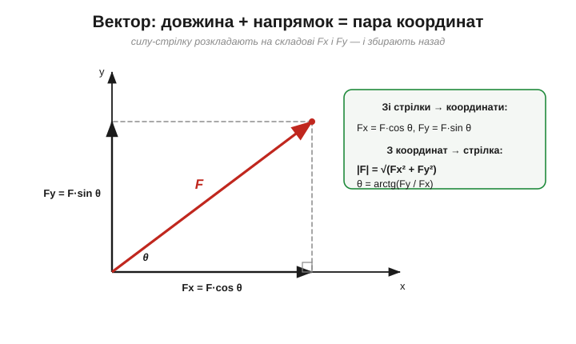
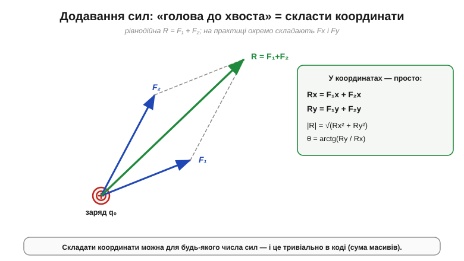

# 🧮 Вектори: додавання сил і суперпозиція в координатах

> Коли на пробний заряд діє багато інших зарядів, сили на нього **додаються векторно** (принцип суперпозиції). Але «векторно» — це як саме? Стрілку до стрілки додають не так, як числа. Тут — рівно той апарат **векторів**, якого досить, щоб із кількох кулонівських сил дістати одну рівнодійну, причому **в координатах**: бо саме так це рахують і на папері, і в коді.

### Вектор: число, що має напрямок

Деякі величини задаються одним числом: маса, заряд, час, температура — їх звуть **скалярами** (*scalar*). Та сила так не задається: мало сказати «3 ньютони» — треба ще й **куди**. Величини, що мають напрямок, звуть **векторами** (*vector*) і позначають стрілкою над буквою (F⃗) або жирним шрифтом. Геометрично вектор — це стрілка: її **довжина** — це модуль (величина), а **напрямок** — куди вона діє.

Стрілку можна задати двома рівноцінними мовами. Перша — **довжина й кут**: |F⃗| та θ (наприклад, «5 Н під 37° до горизонталі»). Друга, набагато зручніша для обчислень, — [**координати**](topic:math/vector-components) (*components*): скільки вектор «проходить» уздовж осей x та y (а в просторі — ще й z).

### Розкласти на координати — і зібрати назад

Перехід між двома мовами — звичайна тригонометрія прямокутного трикутника.


*Будь-яку силу-стрілку розкладають на дві складові вздовж осей: Fx = F·cos θ і Fy = F·sin θ. Назад зі складових збирають модуль |F| = √(Fx² + Fy²) і кут θ = arctg(Fy/Fx). Це той самий вектор, лише записаний двома способами.*

```
зі стрілки в координати:   Fx = F·cos θ        Fy = F·sin θ
з координат у стрілку:      |F| = √(Fx² + Fy²)      θ = arctg(Fy / Fx)
```

Навіщо ця морока з координатами? Бо вона перетворює **додавання стрілок на додавання чисел**.

### Суперпозиція в координатах

Геометрично дві сили [додають за правилом «голова до хвоста»](topic:math/vector-addition) (або, що те саме, за **паралелограмом**): хвіст другої стрілки прикладають до голови першої, а рівнодійна йде від спільного початку до кінця. Гарно — але міряти довжини й кути транспортиром незручно й неточно. Розклавши ж кожну силу на складові, додавати майже нічого:


*Рівнодійна R = F₁ + F₂ — це діагональ паралелограма. Але рахувати її найпростіше в координатах: складові додаються окремо, Rx = F₁x + F₂x і Ry = F₁y + F₂y, а тоді з Rx, Ry збирають назад модуль і кут.*

```
Rx = F₁x + F₂x + …        (усі x-складові)
Ry = F₁y + F₂y + …        (усі y-складові)
|R| = √(Rx² + Ry²)         θ = arctg(Ry / Rx)
```

Ось і весь **рецепт суперпозиції**, доведений до чисел. Щоб знайти сумарну силу на заряд від багатьох інших:

1. для кожного джерела порахуй модуль кулонівської сили Fi = k·|q·qi| / ri²;
2. визнач її напрямок (уздовж лінії до того заряду: однойменні — від нього, різнойменні — до нього) і кут θi;
3. розклади на складові: Fix = Fi·cos θi, Fiy = Fi·sin θi;
4. склади окремо по осях: Rx = Σ Fix, Ry = Σ Fiy;
5. збери назад: |R| = √(Rx² + Ry²), θ = arctg(Ry / Rx).

Жодних транспортирів — сама арифметика.

**Приклад (дві сили під прямим кутом).** На заряд діють F₁ = 3·10⁻⁵ Н уздовж осі x і F₂ = 4·10⁻⁵ Н уздовж осі y. Яка рівнодійна?

```
Rx = 3·10⁻⁵ + 0     = 3·10⁻⁵ Н
Ry = 0 + 4·10⁻⁵     = 4·10⁻⁵ Н
|R| = √((3·10⁻⁵)² + (4·10⁻⁵)²) = 5·10⁻⁵ Н
θ  = arctg(4 / 3) ≈ 53°
```

Зверніть увагу: модуль рівнодійної **не** 3 + 4 = 7, а саме 5 — бо сили дивляться в різні боки. Складати «в лоб» можна лише величини **вздовж однієї прямої**; для всіх інших напрямків працює тільки покоординатне додавання. (А якби сили були **протилежні** — як на заряді точно посередині між двома однаковими, — їхні складові відняли б одна одну до нуля.)

### Де це працює в курсі

Цей маленький апарат — двигун **усієї** суперпозиції. [Електричне поле E⃗](topic:physics/electric-field) — теж вектор, тож поля кількох зарядів складають точно за цим самим рецептом. Та сама покоординатна логіка спрацьовує щоразу, коли додаються величини з напрямком — швидкості дрейфу, а також обертові «стрілки»-фазори змінного струму. І ще одне, суто практичне: у коді вектор — це просто масив чисел `[Fx, Fy]`, а додати сили означає додати масиви поелементно. Саме так будь-який симулятор підсумовує взаємодії сотень зарядів: не геометрією, а кількома рядками покоординатних сум.
