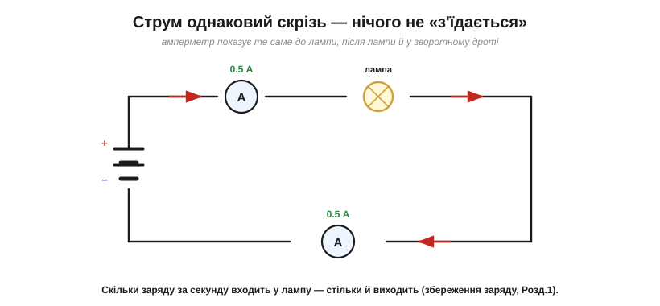
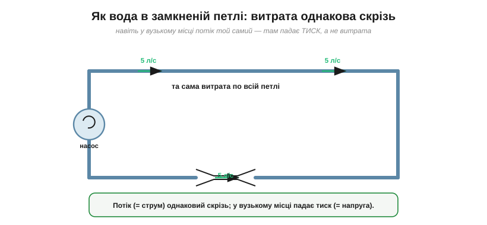
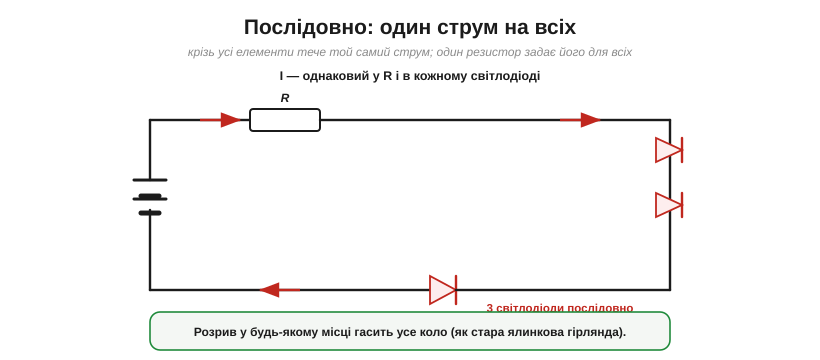

# Струм не «витрачається»: він однаковий уздовж кола

Є одна напрочуд уперта хибна думка, яку варто викорінити негайно, бо вона псує все подальше розуміння кіл. Здається природним, що струм, проходячи крізь лампу чи резистор, частково «з'їдається»: мовляв, у лампу входить більше струму, ніж із неї виходить, — вона ж «споживає». Це **неправильно**. У простому колі-петлі струм **однаковий усюди**: скільки заряду за секунду входить у будь-який елемент, рівно стільки й виходить. Зрозуміти це — означає раз і назавжди розвести два поняття, які початківець постійно змішує: що в колі **циркулює** (заряд, струм) і що в ньому **витрачається** (енергія, напруга).

### Той самий струм — до й після

Поставмо подумки амперметри в кількох місцях кола й порівняймо покази.


*Рис. У простій петлі амперметр показує **те саме** значення до лампи, після лампи й у зворотному дроті. Лампа не «з'їдає» струм: скільки заряду за секунду в неї входить, стільки ж виходить.*

Чому так? Це пряме веління **[збереження заряду](book:physics/electric-charge)**. Заряд не виникає й не зникає, а в усталеному струмі ще й не може **накопичуватися** в жодній точці (інакше там росло б поле й гальмувало потік). Отже, потік заряду крізь будь-який переріз кола однаковий — інакше десь заряд або зникав би, або громадився. Лампа світить не тому, що «ловить» частину струму, — крізь неї проходить увесь струм, до останнього кулона.

### Заряд кружляє, а не споживається

Звідки ж береться оманливе відчуття, що струм «з'їдається»? З побуту: у житті майже все **витрачається** — пальне згоряє, вода з відра виливається, гроші йдуть. Тож мозок за звичкою переносить це й на струм. Але заряд поводиться інакше — він не **витікає** з кола, а **кружляє** ним по замкненій петлі, знову й знову проходячи ті самі точки.

Найточніший образ — **велосипедний ланцюг** (чи конвеєр). Ланцюг біжить по колу як єдине ціле: педалі (джерело) штовхають його, зірочка на колесі (навантаження) забирає в нього зусилля — та сам ланцюг нікуди не дівається й не коротшає. Так і заряд: джерело розганяє його, навантаження відбирає енергію, а заряд циркулює далі, цілий і незмінний. Витрачається не ланцюг, а **зусилля**, що ним передається.

### Як нестислива вода в петлі

Найкраще це відчути на воді. Уявіть замкнену петлю труб із насосом і однією **вузькою** ділянкою.


*Рис. У замкненій водяній петлі витрата (літрів за секунду) **однакова скрізь** — навіть у вузькому місці. Вода нестислива: скільки її входить у звуження, стільки й виходить. У вузькому місці падає **тиск**, а не витрата. Так само в колі: струм усюди той самий, а на навантаженні падає **напруга**.*

Звуження труби — це наша лампа чи резистор: вода долає його важче (потрібен більший перепад тиску), але **витрата** від цього не меншає — крізь вузьке місце проходить рівно стільки ж літрів за секунду, скільки й деінде. Перенесімо на коло: струм (= витрата) скрізь однаковий, а на «вузькому місці» — навантаженні — падає **напруга** (= тиск). Ось і вся таємниця.

### Що ж тоді витрачається? Енергія

Якщо струм не зменшується, то що ж «споживає» лампа? **Енергію**, а не струм. Це принципова відмінність, яку плутають найчастіше.


*Рис. Той самий кулон входить у лампу «повним» енергії (високий потенціал) і виходить «порожнім» (низький), але це **той самий** кулон — він прямує далі. Заряду проходить стільки ж (струм незмінний), а от **енергію** він віддає лампі. Витрачається напруга/енергія, не струм.*

Кожен кулон несе [енергію qV](book:physics/volt). Проходячи крізь лампу, кулон **віддає** їй свою енергію (вона стає світлом і теплом) — і виходить з протилежного боку з меншою енергією, тобто на нижчому потенціалі. Але **сам кулон нікуди не дівся** і рушає далі по колу. Тому через лампу проходить незмінний струм, а «втрачається» на ній **напруга** (різниця потенціалів між входом і виходом) — і саме ця втрачена напруга, помножена на струм, і є спожита енергія. Запам'ятаймо формулу-розрізнення: **струм проходить наскрізь, напруга — падає**.

Корисно простежити енергію по всьому колу. Джерело піднімає кожен кулон на свою [напругу](book:physics/voltage), вкладаючи в нього енергію. Далі кулон обходить петлю й **роздає** цю енергію навантаженням — по шматочку на кожному падінні напруги. Коли він вертається до джерела, енергії в ньому вже не лишається: скільки джерело дало, рівно стільки він і віддав колу. Тобто сума всіх падінь напруги вздовж петлі дорівнює напрузі джерела — енергія, як і заряд, зводиться в замкненому колі без залишку. Цей баланс схоплює **[закон напруг Кірхгофа](book:electronics/kvl)**, пара до закону струмів.

> 🔧 **Навіщо це.** Звідси й розвінчання поширеного міфу: батарея **не «віддає струм»** як щось, що в ній зберігається. Батарея зберігає **енергію** (і заряд — ті самі [мА·год](book:physics/electric-current)); а струм — це лише те, з якою швидкістю коло цей заряд забирає. «Сів акумулятор» означає, що скінчилася запасена **енергія/заряд**, а не якийсь окремий «запас струму». Скільки струму потече — вирішує не батарея сама, а ціле коло ([напруга](book:physics/voltage) й [опір](book:physics/resistance)).

### Послідовне коло: один струм на всіх

Найпряміший наслідок: якщо з'єднати кілька елементів **послідовно** (ланцюжком, один за одним), крізь усіх них тече **той самий** струм.


*Рис. У послідовному колі струм однаковий у резисторі й у кожному світлодіоді — бо їм нема куди «розгалузитися». Тому один струмозадавальний резистор визначає струм одразу для всієї гірлянди; а розрив у будь-якому місці гасить усе коло.*

**Приклад (струм скрізь той самий).** Батарея жене крізь послідовне коло з лампою струм 0.2 А. Який струм у дроті до лампи, у самій лампі та в дроті після неї?

```
скрізь однаковий:  I = 0.2 А
заряду за хвилину: Q = I·t = 0.2 × 60 = 12 Кл — теж однаково в кожній точці
```

Це й легко перевірити приладом: увімкніть [амперметр](book:physics/electric-current) у будь-яке місце послідовного кола — до резистора, між світлодіодами чи у зворотний дріт — і він щоразу покаже **те саме** число. Саме так на практиці й переконуються, що струм по колу один: він не «слабшає» від лампи до лампи, хоч би скільки їх стояло послідовно.

> 🔧 **Навіщо це.** Тому в гірлянді світлодіодів, з'єднаних послідовно, **один** резистор задає яскравість усіх одразу — струм же спільний. І тому стара ялинкова гірлянда гасла повністю, варто було перегоріти **одній** лампочці: розрив послідовного кола зупиняє струм скрізь. А коли елементи треба живити **незалежно**, їх вмикають інакше — [паралельно](book:electronics/parallel-connection), і там уже струми розгалужуються.

І ще: раз струм спільний, його диктує **все коло** разом (напруга джерела й сумарний опір), а не котрийсь один елемент. Слабша ланка, розрахована на менший струм, тоді обмежує весь ланцюг — як найвужче місце труби обмежує потік усієї магістралі.

Чесна засторога: «однаковий струм усюди» строго справджується для **усталеного** струму в простій петлі. Є компонент, що тимчасово це порушує, — **[конденсатор](book:electronics/capacitor)**: заряджаючись, він на якийсь час накопичує заряд на пластинах, тож на короткій миті струм «до» і «після» нього може різнитися. У звичайних же резистивних колах з постійним струмом правило «струм скрізь однаковий» діє беззастережно.

Та сама логіка працює й там, де петля не одна. А що у **вузлі**, де сходяться кілька дротів? Те саме збереження заряду: скільки струму втікає у вузол, стільки ж і витікає. Це і є **[закон струмів Кірхгофа](book:electronics/kcl)** — а корінь його той самий, проста думка «заряд не береться нізвідки й не зникає».

---

Отже, струм **не витрачається** — у нерозгалуженій петлі він однаковий до й після будь-якого навантаження (збереження заряду). Витрачається не струм, а **енергія/[напруга](book:physics/voltage)**: кожен кулон проходить наскрізь, але віддає на навантаженні свою енергію. У послідовному колі струм спільний для всіх елементів; розрив зупиняє все.

---
