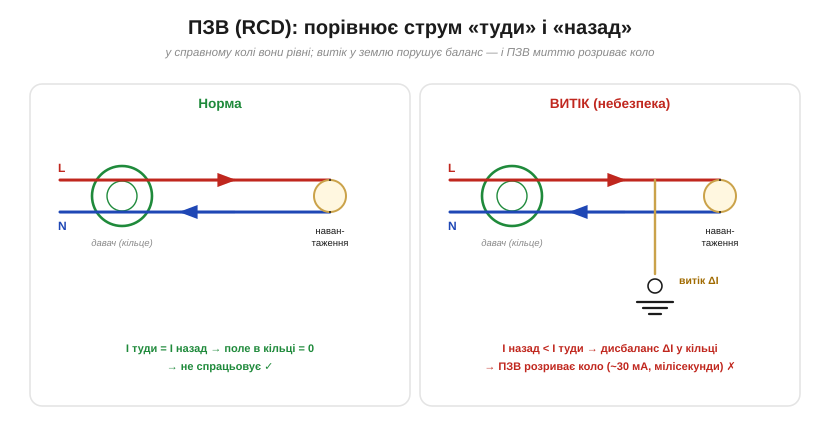

# 🔌 ПЗВ (RCD): прилад, що порівнює струм «туди» і «назад»

> Компонентна вставка про ПЗВ. **Принцип** простий: у справному колі скільки струму пішло, стільки й вертається, а витік крізь людину порушує цей баланс. Тут — як це влаштовано в металі: давач, пороги, типи й типові граблі реального приладу.

### Принцип в одній картинці

*Рис. Обидва дроти (L і N) проходять крізь спільне кільце-давач. Норма: скільки струму пішло, стільки й вернулось — їхні магнітні дії в кільці гасяться, сигналу немає (струм у замкненому колі [неперервний](book:physics/current-continuity)). Витік (струм утік крізь людину в землю): «назад» менше за «туди», у кільці виникає дисбаланс ΔI — і ПЗВ рве коло за мілісекунди.*

### Як побудований

Серце ПЗВ (англ. **RCD**, residual-current device; як окремий апарат — **RCCB**; американський варіант у розетці — **GFCI**) — це **диференційний трансформатор**: феритове кільце, крізь яке проходять **обидва** провідники, фазний і нейтральний. Рівні зустрічні струми створюють у кільці рівні й протилежні магнітні поля, що **гасяться** до нуля. Щойно струми розбіжаться (частина витекла в землю), у кільці лишається нескомпенсоване поле — воно наводить струм у **вторинній обмотці**, а той зводить **розчіплювач**, який механічно **рве контакти**. Усе це — за мілісекунди, без жодної електроніки в найпростіших моделях (енергію дає сам дисбаланс).

### Пороги й типи — що читати на корпусі

- **Струм спрацювання (IΔn).** Для захисту **людини** — **30 мА** і менше (10 мА — для особливо вологих місць). А ось **100 чи 300 мА** — це вже **не** персональний захист, а протипожежний (ловить великий витік на корпус, але крізь людину 300 мА встигнуть нашкодити). Тому в побуті ставлять саме 30 мА.
- **Тип за формою струму витоку.** **Тип AC** реагує лише на чисту синусоїду. Але сучасна техніка з випрямлячами й імпульсними блоками дає витік із **постійною** складовою, який AC може й «проґавити». Тому для електроніки беруть **тип A** (ловить і пульсуючий постійний), а для частотників та DC-кіл — **тип B**. Це важлива деталь: дешевий тип AC за сучасних навантажень буває **небезпечно сліпий**.
- **Кнопка «ТЕСТ».** Натиск пускає крізь кільце навмисний крихітний дисбаланс через внутрішній резистор — справний ПЗВ має одразу вимкнутися. Перевіряти варто хоч раз на місяць: механіка з часом застигає.

### Як ставлять

ПЗВ монтують у щиток. Важливо: він **не замінює** запобіжник чи автомат — ті захищають **коло** від надструму, а ПЗВ захищає **людину** від витоку. Тому їх ставлять разом; є й суміщений апарат — **RCBO** (ПЗВ + автомат в одному корпусі). Нейтраль кожного ПЗВ має йти **тільки** через нього (не можна «позичати» N у сусіднього кола — інакше штучний дисбаланс і хибне спрацювання).

### Типові граблі

- **Хибні спрацювання.** Багато імпульсних блоків живлення потроху «зливають» струм через свої завадозахисні (Y-) конденсатори; сумарно ці міліампери можуть перевищити поріг — і ПЗВ вибиває «без причини». Лікують поділом навантажень на кілька ПЗВ.
- **Волога й довгі лінії** додають витоку — звідси спрацювання в дощ.
- **Не ловить дотик фаза–нейтраль.** Якщо взятися за **обидва** робочі дроти, струм крізь тіло «збалансований» — ПЗВ його не бачить. Він рятує від витоку **в землю**, а не від будь-якого ураження.
- **Хибна економія на типі.** Тип AC там, де треба A, — типова й небезпечна помилка в колах із електронікою.
