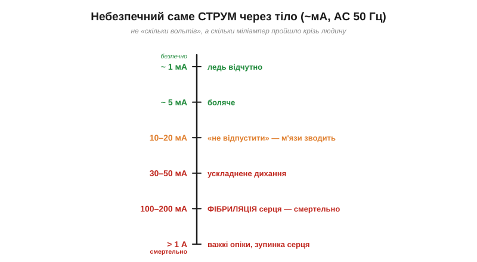
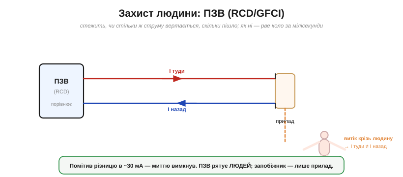

# Струм і безпека: чому небезпечний саме струм

Це тема, від якої залежить життя. Поширене запитання «скільки вольтів небезпечно?» поставлене **неправильно** — і нерозуміння цього коштувало людям здоров'я. Бо шкодить тілу не напруга сама по собі, а **струм**, що крізь нього пройшов. Напруга лише **жене** цей струм; а скільки його потече — і чи стане воно смертельним — залежить ще й від опору тіла. Розберімо це чітко.

### Небезпечний саме струм — і ось скільки

Те, що руйнує тіло, — це **струм крізь нього**, у міліамперах. Він діє двояко: гріє тканини ([джоулеве тепло](topic:physics/joule-heating)) і — головне — **перебиває власні іонні сигнали** тіла ([іонна провідність](topic:physics/ionic-conduction)), якими керуються м'язи й серце.


*Приблизні пороги для змінного струму 50 Гц, що пройшов крізь людину: ~1 мА — ледь відчутно; 10–20 мА — м'язи зводить так, що **не відпустити** дроту; 100–200 мА — **фібриляція** серця (смертельно); понад ампер — важкі опіки. Вирішують саме міліампери, а не вольти.*

Особливо підступний поріг — «не відпустити» (10–20 мА): струм змушує м'язи руки судомно стиснутися, і людина **не може розтиснути** долоню, що схопила дріт, — а отже, лишається під струмом, аж поки не станеться найгірше. А близько 100 мА струм збиває з ритму серце (**фібриляція**, від лат. *fibra* — волокно: м'язові волокна починають тіпатися кожне саме по собі, замість злагодженого удару), і це вже смертельно. Усі ці значення — **міліампери**: тілу не треба багато.

> 📜 Звідки взялися саме ці числа? Їх виміряла конкретна людина — Чарльз Далзіел. А «винайшов ПЗВ» — поширений міф (диференційні пристрої старші за нього): [Чарльз Далзіел](topic:physics/current-safety/hist-dalziel.md).

### Опір тіла задає струм: I = V/R

Чому ж тоді кажуть про «вольти»? Бо напруга задає струм через [закон Ома](topic:electronics/ohms-law): I = V/R, де R — опір тіла. А опір тіла шалено залежить від стану **шкіри**, де струм несуть [іони у вологих тканинах](topic:physics/ionic-conduction): суха шкіра — сотні кілоом, мокра — лише кілоом. Звідси й уся підступність.


*За однієї й тієї самої напруги 230 В суха шкіра (≈50 кОм) пропускає лише ~4.6 мА — боляче, та за сухого контакту зазвичай не смертельно (гарантій, утім, нема); а мокра (≈1 кОм) — аж ~230 мА, далеко за порогом фібриляції. Напруга та сама, а наслідок — від «струсонуло» до загибелі.*

**Приклад (чому мокрі руки вбивають).** Дотик до 230 В мережі:

```
суха шкіра:  I = V/R = 230 / 50000 ≈ 4.6 мА   → боляче, зазвичай не смертельно
мокра шкіра: I = V/R = 230 / 1000  ≈ 230 мА   → смертельно
```

Той самий контакт, та сама напруга — а струм відрізняється в **п'ятдесят разів**, бо змінився лише опір шкіри. Ось чому однозначної відповіді «скільки вольтів небезпечно» немає: усе вирішує струм, а його — опір.

Грубий орієнтир усе ж є: напруги приблизно **до 50 В** змінного струму (чи ~120 В постійного) вважають порівняно безпечними («наднизька напруга», SELV) — за нормальних сухих умов вони рідко проганяють небезпечний струм крізь цілу шкіру. Та це не індульгенція: у вологості, при пораненні чи поганому контакті небезпечним буває й менше. «Безпечно» завжди залежить від умов.

> 🔧 **Навіщо це.** Звідси практичні висновки. **Мокрими руками чи у ванній** електрику чіпати смертельно небезпечно — опір падає, струм злітає. **Низьковольтні батареї** (1.5–12 В) зазвичай безпечні на дотик: навіть мокра шкіра дає невеликий струм (12 В / 1 кОм = 12 мА — неприємно, та не смертельно), а суха його майже не пропустить. Але навіть низька напруга стає небезпечною там, де опір малий (наскрізна рана, занурення), а великий **струм** низької напруги — це опіки й пожежа.

### Шлях і тривалість теж важать

Однакового струму замало, щоб судити про небезпеку, — важить, **яким шляхом** він пройшов і **як довго**.


*Найгірший шлях — **рука в руку** (чи рука в ногу): струм перетинає груди, де серце. Звідси «правило однієї руки»: працювати під напругою по змозі **однією** рукою, щоб струм не пішов через серце. А пташка на дроті ціла, бо обидві лапки на **одному** проводі — між ними нема [різниці потенціалів](book:physics/electric-potential), отже, й струму крізь неї нема.*

Найнебезпечніший шлях — через **груди**, тому й існує **правило однієї руки**: торкатися можливо-живого однією рукою (а другу тримати в кишені), щоб у разі удару струм не пройшов «рука → серце → рука». А пташка на лінії електропередачі ціла саме тому, що сидить на одному дроті: її лапки на [однаковому потенціалі](topic:physics/electric-potential), різниці нема — нема й струму. Небезпека з'явилася б, якби вона торкнулася водночас двох дротів або дроту й землі.

Тривалість додає: що довше тіло під струмом, то гірше (накопичується нагрів, зростає шанс фібриляції). Важить і рід струму: побутовий [**змінний** струм 50 Гц](topic:physics/dc-vs-ac) особливо небезпечний — він і викликає «не відпустити», і легше зриває серце в фібриляцію, ніж постійний. Чому саме 50–60 Гц так зловісно діють? **Не** тому, що ця частота «збігається з ритмом серця» — пульс це лише близько одного удару за секунду (~1 Гц). А тому, що низькочастотний змінний струм, по-перше, **щопівперіоду** наново смикає м'язи, аж долоню не розтиснути; а по-друге, якщо триває довше за один серцевий цикл і йде крізь груди, майже неминуче влучає у **вразливу фазу** серцевого ритму й збиває злагоджені скорочення у фібриляцію. Постійний і високочастотний струм у цьому сенсі менш підступні. Прикра іронія: частота, найзручніша для енергетики, виявилася однією з найнебезпечніших для серця.

Окрема загроза — **крокова напруга**: біля обірваного дроту чи місця удару блискавки сама земля має різний потенціал у різних точках, і струм може пройти **між ногами**. Тому з небезпечної зони відходять дрібними кроками, не розставляючи ноги широко.

### Як захищаються

На щастя, фізику небезпеки давно приборкали кількома рівнями захисту. Головний для **життя** — пристрій захисного вимкнення.


*__ПЗВ__ (*RCD/GFCI*) стежить, чи стільки ж струму **повертається**, скільки пішло в прилад. Якщо частина «витекла» кудись убік — наприклад, крізь людину в землю — баланс порушується, і ПЗВ **рве коло за мілісекунди**. Спрацьовує вже на ~30 мА (європейський/український стандарт; у США персональні GFCI — на ~5 мА) — раніше, ніж струм устигне вбити.*

Ключова ідея ПЗВ (пристрою захисного вимкнення) — **порівняння струмів**: у справному колі скільки струму пішло «туди», стільки ж [вертається «назад»](topic:physics/current-continuity). Якщо ж частина струму **витікає** повз — крізь тіло людини на землю, — туди й назад уже не рівні, і ПЗВ миттю вимикає живлення. Він реагує на крихітні ~30 мА за мілісекунди — тобто **рятує людину**, а не прилад. (Це європейський/український поріг персонального захисту; американські GFCI спрацьовують ще чутливіше — ~5 мА.) Але майте на увазі межу: ПЗВ ловить лише **витік** повз коло; якщо ж торкнутися водночас **фази й нейтралі**, струм крізь тіло «збалансований» — і ПЗВ його не помітить. Тож він не скасовує обережності.

> 🔌 Як ПЗВ улаштований усередині (кільце-давач і розчіплювач), що означають **типи AC/A/B** та пороги 10/30/100/300 мА, навіщо кнопка «ТЕСТ» і чому він іноді «вибиває» сам: [ПЗВ (RCD)](topic:physics/current-safety/comp-rcd.md).

> 🔧 **Навіщо це.** Запам'ятайте різницю, що рятує життя: **запобіжник і автомат захищають коло** (від надструму й пожежі), а **ПЗВ захищає людину** (від витоку крізь тіло). Тому у вологих місцях (ванна, кухня, вулиця) ПЗВ обов'язковий. Інші рівні захисту: надійна **ізоляція**, **заземлення** корпусів (щоб пробій ішов у землю, а не крізь вас), правило **однієї руки**, не працювати під напругою без потреби — і пам'ятати, що **конденсатори** тримають заряд навіть після вимкнення (їх розряджають перед роботою). Повага до струму — головна навичка безпеки.

Варто пояснити роль **заземлення корпусів** докладніше. Якщо живий провід усередині приладу торкнеться металевого корпусу, незаземлений корпус сам стане «під напругою» й чекатиме, поки до нього доторкнеться людина. Заземлений же корпус відразу відведе цей струм **захисним проводом (PE)** — низькоомним шляхом назад **до джерела** (а не «в ґрунт», як у стік: земля для цього надто високоомна). Через малий опір потече великий струм, миттю спрацює автомат чи ПЗВ, і небезпека зникне, перш ніж хтось постраждає.

І найважливіше — **перша допомога**. Якщо людину «тримає» струм, **не хапайте її руками**: ви самі станете частиною кола й постраждаєте обоє. Спершу **вимкніть живлення** (вимикач, пробки) або відштовхніть потерпілого сухим ізолятором — дерев'яним держаком, пластиком. І лише знеструмивши — надавайте допомогу. Це правило важить найбільше.

---

Головне, що варто винести: шкодить **струм** через тіло (міліампери!), а не «вольти»: ~10–20 мА вже «не відпустити», ~100 мА — фібриляція. Струм задає закон Ома I = V/R, тож за тієї самої напруги **мокра шкіра** (малий опір) у десятки разів небезпечніша за суху. Важать також **шлях** (найгірше — крізь серце; звідси правило однієї руки й чому пташка на дроті ціла) і **тривалість**, а змінний 50 Гц підступніший за постійний. Рятують **ПЗВ** (захищає людину), заземлення та ізоляція.
